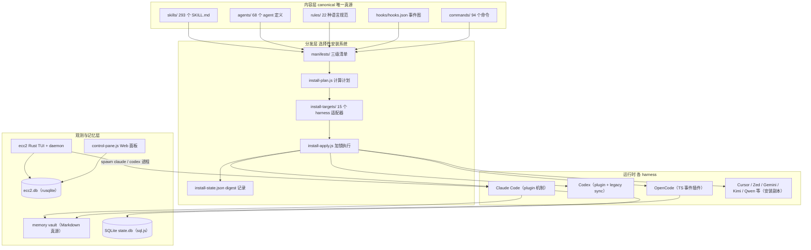
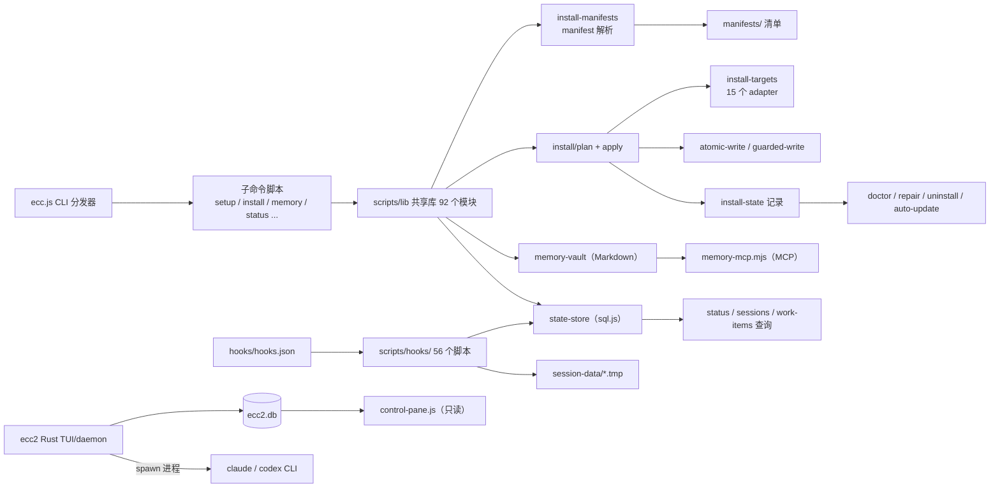
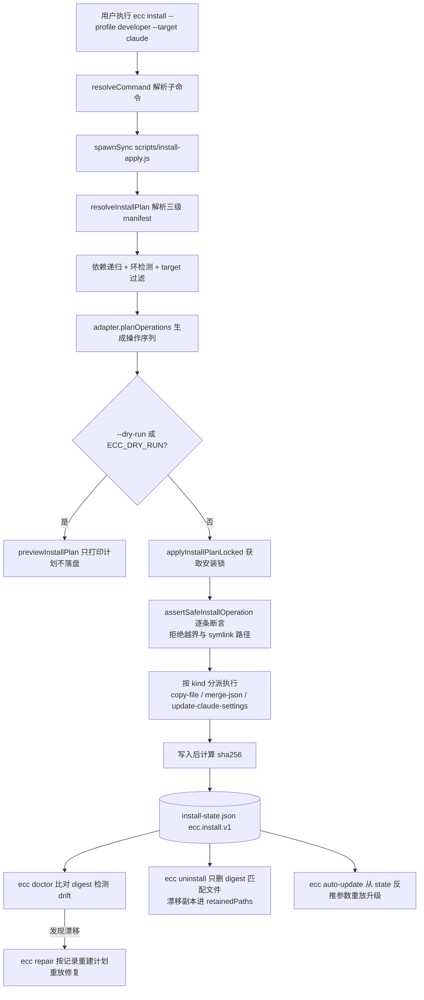
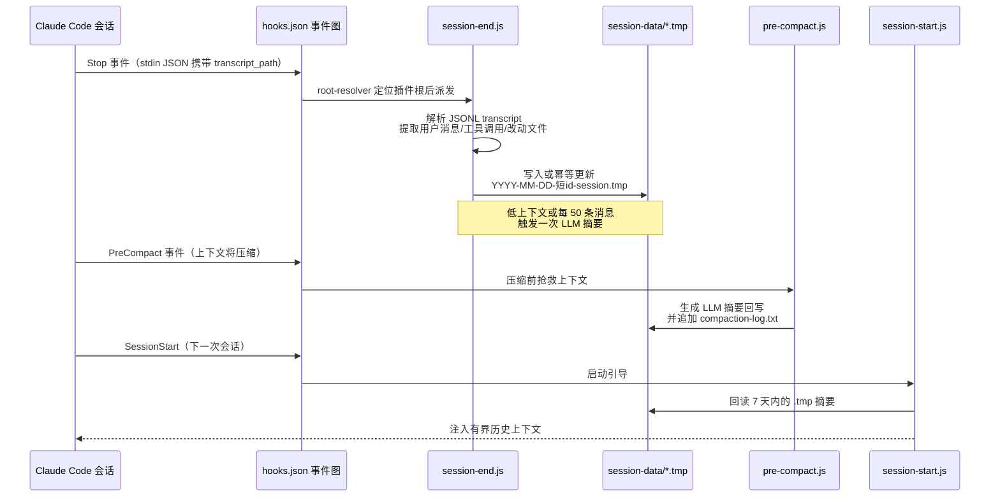

# ECC 源码学习笔记

> 仓库地址：[ECC](https://github.com/affaan-m/ECC)
> 学习日期：2026-10-01

---

> **以下为 AI 源码分析**
>
> ### 一句话概括
>
> ECC（Everything Claude Code，npm 包名 `ecc-universal` v2.2.2）是一个"harness 原生的 agent 操作系统"：它把 293 个 skills、68 个 agents、94 个 commands、hooks 与 rules 作为一份 canonical 内容，通过声明式 manifest + 15 个目标适配器选择性安装进 Claude Code、Codex、Cursor、OpenCode 等编码 agent 工具，并用 Markdown memory vault、SQLite 状态库和 Rust TUI 控制平面（ecc2）补齐"计划→实现→评审→验证→记忆→改进"的完整闭环。
>
> ### 要点速览
>
> | 模块 | 职责 | 关键文件 |
> |------|------|----------|
> | CLI 分发器 | `ecc` 命令入口，把子命令 spawn 到独立脚本 | `scripts/ecc.js` |
> | 选择性安装系统 | 三级 manifest 声明、plan/apply 两阶段、记录式可逆安装 | `manifests/`、`scripts/lib/install*/` |
> | 多 harness 适配层 | 一份内容翻译到 15 种 agent 工具的目录约定 | `scripts/lib/install-targets/` |
> | Hooks 运行时 | PreToolUse/SessionStart/Stop 等事件驱动自动化 | `hooks/hooks.json`、`scripts/hooks/` |
> | 会话记忆持久化 | transcript → 摘要 `.tmp` → 下次会话注入 | `scripts/hooks/session-end.js` 等 |
> | Memory Vault | 跨 harness 共享记忆（Markdown 唯一真源）+ MCP server | `scripts/lib/memory-vault.js`、`scripts/memory-mcp.mjs` |
> | SQLite 状态库 | 会话/技能运行/治理事件的运营查询（sql.js WASM） | `scripts/lib/state-store/` |
> | ecc2 控制平面 | Rust TUI：多会话编排、git worktree 并行、daemon 自愈 | `ecc2/src/` |
> | 内容层 | skills/agents/commands/rules 的定义格式 | `skills/`、`agents/`、`commands/`、`rules/` |
> | CI 验证管线 | 16 个结构校验器 + 325 个零依赖测试 | `scripts/ci/`、`tests/run-all.js` |

---

## 项目简介

ECC 解决的问题是：AI 编码 agent（Claude Code、Codex、Cursor 等）能力很强，但缺少一套"工程操作系统"——计划先行、测试驱动、自我评审、会话记忆、经验沉淀。这些流程如果靠用户在每个 prompt 里重建，既冗余又不可复用。ECC 的思路是把这套流程**安装一次，变成 agent 工作方式的一部分**：agent 定义（68 个专业 subagent）、工作流技能（293 个 SKILL.md）、强制规范（rules）由事件钩子（hooks）在会话生命周期中自动执行，会话结束后自动摘要落盘、下次会话自动注入，跨工具切换时通过 memory vault 与 handoff 机制共享上下文。它以 MIT 协议开源，最佳支持 Claude Code，同时通过适配器覆盖 Codex、Cursor、OpenCode、Gemini、Zed、Qwen、Kimi 等 15 种 harness。

## 技术栈

| 类别 | 技术 |
|------|------|
| 语言 | JavaScript（Node.js ≥ 18，CommonJS）为主体；TypeScript（`.opencode/` 插件）；Rust（`ecc2/` 控制平面）；Python（`ecc_dashboard.py` 文本仪表盘） |
| 核心依赖 | 运行时仅 4 个：`@iarna/toml`（TOML 解析）、`ajv`（JSON Schema 校验）、`js-yaml`、`sql.js`（WASM 版 SQLite）；ecc2 侧用 ratatui + crossterm + tokio + rusqlite + git2；MCP server 手写 JSON-RPC 2.0，零 SDK 依赖 |
| 构建工具 | `tsc`（`scripts/build-opencode.js` 编译 `.opencode/` → `dist/`）；`cargo` 构建 ecc2；`prepack` 钩子在发包前自动构建 |
| 依赖管理 | `packageManager` 锁定 yarn 4.9.2；发布为 npm 包 `ecc-universal`；ecc2 用 Cargo.lock 锁定 |
| 测试框架 | 自研零依赖 runner（`tests/run-all.js`，325 个 `*.test.js` 逐文件 spawn 执行）；c8 覆盖率门槛（lines 80 / functions 80 / branches 79 / statements 80）；`npm test` 前置串联 16 个 `scripts/ci/validate-*.js` 结构校验器 |

## 目录结构

```
ECC/
├── agents/                  # 68 个 subagent 定义：扁平 .md，frontmatter + 提示词
├── skills/                  # 293 个技能，每目录一个 SKILL.md（canonical 工作流真源）
├── commands/                # 94 个斜杠命令（legacy 兼容层，方向是 skills-first）
├── rules/                   # 22 种语言/框架规范目录 + common/ 通用规则
├── hooks/
│   ├── hooks.json           # 生产 hook 图（6 类事件 × 多 matcher）
│   └── memory-persistence/  # 会话持久化钩子参考定义（人读文档）
├── manifests/               # 三级安装清单：profiles → components → modules
├── scripts/
│   ├── ecc.js               # CLI 分发器（bin: ecc / ecc-universal）
│   ├── install-plan.js      # 只读计划检查 CLI
│   ├── install-apply.js     # 加锁执行安装
│   ├── doctor.js / repair.js / uninstall.js / auto-update.js   # 安装生命周期自愈
│   ├── setup.js / install-guided.js    # Claude 插件向导 / 多 harness 向导
│   ├── memory.js / memory-mcp.mjs      # 跨 harness 记忆 CLI 与 MCP server
│   ├── status.js / sessions-cli.js / session-inspect.js        # 状态库查询面
│   ├── control-pane.js      # 本地 Web 控制面板（只读 ecc2 数据库）
│   ├── ci/                  # 16 个结构校验器（validate-skills/agents/hooks/...）
│   ├── hooks/               # 56 个 hook 脚本实现
│   └── lib/                 # 92 个共享模块（install/state-store/memory-vault/...）
├── ecc2/                    # Rust 控制平面：session/runtime/daemon + TUI + worktree
├── .opencode/               # OpenCode TS 插件（npm 包 main 入口，事件映射）
├── .claude-plugin/          # Claude Code 原生插件清单（plugin.json + marketplace.json）
├── .codex-plugin/           # Codex 原生插件清单
├── .cursor/ .zed/ .gemini/ .kiro/ .qwen/ .kimi/ ...   # 各 harness 预适配 vendored 副本
├── mcp-configs/             # 14 个 MCP server 接入模板
├── schemas/                 # JSON Schema（state-store、install 等）
├── contexts/                # context profiles 载荷
├── tests/                   # 325 个零依赖测试文件 + run-all.js
├── plugins/ecc/             # Claude 插件说明（marketplace 安装路径）
├── docker/                  # 插件安装的平台级测试环境
└── ecc_dashboard.py         # Python 文本仪表盘
```

## 架构设计

### 整体架构

ECC 是典型的**"内容 + 分发 + 运行时 + 观测"四层架构**。内容层是唯一真源（仓库根的 skills/agents/rules/hooks）；分发层是声明式安装系统，把内容按 manifest 计划翻译复制到各 harness 的目录约定；运行时层由各 harness 消费内容（Claude 走 plugin 机制，OpenCode 走 TS 事件插件，其余走安装副本）；观测层横跨所有 harness，收集会话、记忆与状态。ecc2 Rust 控制平面位于最上层，直接 spawn agent CLI 进程做并行编排，与 Node.js 体系通过 SQLite 文件解耦。



设计上有两个鲜明取向：

1. **harness-native 而非 harness-agnostic**：不为跨工具兼容造统一抽象层，而是承认每个工具的目录约定差异（Cursor 的 `.mdc` rules、Codex 的 TOML 配置、OpenCode 的事件 API），在安装时由薄适配器逐一翻译。适配深度分四档（Native / Adapter-backed / Instruction-backed / Reference-only），由 `scripts/lib/harness-adapter-compliance.js` 的冻结记录驱动文档矩阵并强制同步。
2. **运行时依赖极小化**：npm 运行时依赖只有 4 个，MCP server 与测试 runner 全部手写零依赖，install-state 校验器也是手写的（供应链审查考量，`scripts/lib/install-state.js:9-14` 注释明说）。

### 核心模块

#### 1. CLI 分发器（scripts/ecc.js）

- **职责**：`ecc` 命令的唯一定义面。`COMMANDS` 表（`scripts/ecc.js:9-110`）把 24 个子命令映射到 `scripts/` 下的独立脚本文件；`resolveCommand`（:211-268）解析 argv，未知命令且不是 legacy 语言名则报错，`--dry-run` 全局旗标设置 `ECC_DRY_RUN=1` 环境变量；`runCommand`（:270-320）用 `spawnSync` 把参数转发给子脚本执行。
- **关键细节**：`ito` 子命令走 `createSafeItoInvocationEnvironment` 构造的干净环境（防止环境变量注入）；交互式命令（setup/install/ito login）用 `stdio: inherit` 直连终端。
- **关系**：是所有子命令脚本的统一壳；`bin` 字段还注册了 `ecc-install`、`ecc-memory-mcp`、`ecc-plan-canvas`、`ecc-control-pane` 等直连入口（package.json:466-473）。

#### 2. 选择性安装系统（manifests/ + scripts/lib/install*）

- **三级声明式模型**：
  - `manifests/install-profiles.json`：profile（minimal/core/developer/security/research/full 等）只是一组 module id；
  - `manifests/install-components.json`：用户面的组件目录（id/family/description/modules），targets 由成员模块推导，skills 还会合成 `skill:<id>` 组件（`scripts/lib/install-manifests.js:194`）；
  - `manifests/install-modules.json`：真正执行单元，字段为 `id, kind, paths（源路径）, targets（适用 harness）, dependencies, defaultInstall, cost, stability`。
- **plan → apply 两阶段**：`resolveInstallPlan`（`install-manifests.js:547`）做 profile 归并、依赖递归 + 环检测（:636）、target 过滤；`planInstallTargetScaffold`（`scripts/lib/install-targets/registry.js:50`）调用目标 adapter 的 `planOperations` 产出操作；`createManifestInstallPlan`（`scripts/lib/install/plan.js:253`）把目录型 scaffold 物化为逐文件 copy-file，`dedupeCopyFileOperations`（:227）只保留同目的地最后一个（修复过 issue #2414）。执行侧 `applyInstallPlanLocked`（`scripts/lib/install/apply.js:744`）先取锁，逐操作过 `assertSafeInstallOperation`（:269，拒绝越出 targetRoot 与 symlink 路径），按 kind 分派 `copy-file`/`merge-json`/`update-claude-settings`，最后写入后计算 sha256 落 install-state。
- **记录式可逆安装**：install-state（schema `ecc.install.v1`，`scripts/lib/install-state.js:281`）记录每次安装的 request、resolution 与每个 operation 的路径/策略/digest。`ecc doctor`（`scripts/lib/install-lifecycle.js:1747` `buildDoctorReport`）比对 digest 检测 drift；`ecc repair`（:1992）用记录的 request 重建计划重放修复；`ecc uninstall`（:2401）只删除 digest 匹配的文件（漂移副本保留）；`ecc auto-update` 从 state 反推安装参数重放。
- **原子写**：`writeFileAtomic`（`scripts/lib/atomic-write.js:7`，临时文件 + `O_EXCL` + fsync + rename）；`writeFileNoFollow`（`scripts/lib/guarded-write.js:32`，`O_NOFOLLOW` 打开 + sha256/mtime 校验后才写，对抗 TOCTOU）。
- **关系**：是分发层的心脏，被 setup.js（Claude 插件向导）、install-guided.js（多 harness 向导）、auto-update 等复用。

#### 3. 多 harness 适配层（scripts/lib/install-targets/）

- **职责**：15 个 target 各对应一个 adapter 文件（claude-home.js、kimi-project.js、cursor-project.js、zed-project.js……），由 `createInstallTargetAdapter` 工厂（`helpers.js:316`）统一契约：`resolveRoot / getInstallStatePath / planOperations / supportsModule`。
- **翻译规则示例**：Claude 把 rules 收进 `rules/ecc/` 命名空间、hooks merge 进 settings.json；Cursor 把 `rules/typescript/*.md` 拍平改名为 `typescript-*.mdc`（`toCursorRuleFileName`，cursor-project.js:13-21）；Kimi 把 `.agents/skills` 重映射到 `.kimi-code/skills` 并把 mcp-configs 合并成 `mcp.json`；Gemini 用 `scripts/gemini-adapt-agents.js:8-17` 翻译工具名（Read→read_file）。跨平台污染由 `isForeignPlatformPath`（helpers.js:42-52）过滤。
- **接入通道分类**（`scripts/lib/harness-capabilities.js:31-243`）：native-plugin（Claude/Codex）、managed-project（kimi/cursor/antigravity/gemini/zed…复制进项目目录）、managed-home（opencode/qwen/hermes…复制进家目录）；`.pi/` 走零拷贝包挂载（根 package.json 的 `pi` 字段直接引用 `./skills`）。
- **关系**：安装系统调用的策略层；合规检查（`harness-adapter-compliance.js`）与能力目录（`validateCatalog`，harness-capabilities.js:272-303）三方交叉校验目录、注册表与 `SUPPORTED_INSTALL_TARGETS` 的一致性。

#### 4. Hooks 运行时与会话持久化（hooks/hooks.json + scripts/hooks/）

- **职责**：把自动化挂进 Claude Code 的 6 类生命周期事件：PreToolUse（按 matcher 细分 Bash/PowerShell/Write/Edit/mcp__ 等，hooks.json:3-91）、PreCompact（:92）、SessionStart（:103）、PostToolUse（经 `posttooluse-dispatcher.js` 派发，:123）、Stop（:195）、SessionEnd（:240）。
- **root-resolver 自举**：每条 hook 命令内嵌一段压缩 JS，从 `CLAUDE_PLUGIN_ROOT` 环境变量或 `~/.claude/plugins/{ecc, marketplaces/ecc, cache/ecc/*}` 等候选位置定位插件根，再注入 `plugin-hook-bootstrap.js` 执行——保证插件无论被 marketplace 装到哪个缓存路径都能工作。
- **会话记忆闭环**：`session-end.js`（scripts/hooks/）在 Stop 事件解析 stdin JSON 的 `transcript_path`（JSONL），提取用户消息/工具调用/改动文件，写入 `~/.claude/session-data/YYYY-MM-DD-<短id>-session.tmp`（含 `ECC:SUMMARY:START/END` 标记块的幂等更新）；`pre-compact.js` 在上下文压缩前生成 LLM 摘要回写并记 compaction-log；`session-start.js`（:68）回读 7 天内 `.tmp` 注入有界上下文。低上下文或每 50 条消息触发一次摘要。
- **关系**：hook 脚本大量复用 `scripts/lib/` 共享库；OpenCode 插件按 `ECC_HOOK_PROFILE`（standard/strict 等档位）复用同一批脚本（`.opencode/plugins/ecc-hooks.ts:138-170`）。

#### 5. Memory Vault 与 MCP server（scripts/lib/memory-vault.js + scripts/memory-mcp.mjs）

- **数据模型**：每条记忆一个 Markdown 文件，严格 JSON 值 frontmatter，schema `ecc.memory.v1`（`memory-vault-format.js:5-60`）：`id`（`mem_日期_随机串`）、`kind`（context/decision/fact/handoff/lesson/note/preference/runbook 八种）、`scope`（project/team/user）、`trust`（首版仅 unreviewed）、`source_harness`、`target_harnesses[]`、`tags`、`links`。目录：`<repo>/.ecc/memory/{project,team}/<kind>s/` 与 `~/.ecc/memory/`（memory-vault.js:73-77）；project 作用域强制 fail-closed `.gitignore`（:243-262）。
- **写入安全**：create-only（临时文件 + `O_EXCL` + 硬链接原子化，:191-241），写前用 10 个正则扫描密钥形态（format.js:49-60），全程拒绝 symlink 穿越。
- **跨 harness handoff 的本质**：`ecc memory handoff --from codex --target claude` 没有任何格式转换——只是 `saveMemory` 强制 `kind=handoff` + 路由元数据（`scripts/memory.js:412-424`）；跨 harness 语义完全由**读取侧过滤**（`targetHarnesses.includes('all') || includes(目标)`，memory-vault.js:631-635）实现。
- **MCP server**：`memory-mcp.mjs` 手写 JSON-RPC 2.0 stdio server（无 SDK），4 个工具：`memory_save / memory_search / memory_read / memory_doctor`（:52-148，Ajv 校验参数）。关键安全设计：启动必须设 `ECC_MEMORY_HARNESS` 标识 harness 身份，该**服务端身份不可被客户端覆盖**——写入时充当 source_harness，读取时自动作为 target 过滤器（:174-197）。
- **设计哲学**："Markdown files are the source of truth. SQLite context graphs… are indexes or adapters, never the only copy"（`docs/design/ecc-memory-vault.md:15-16`）。

#### 6. SQLite 状态库（scripts/lib/state-store/）

- **职责**：结构化运营状态的查询面，与 memory vault（非结构化上下文）刻意分离。默认路径 `~/.claude/ecc/state.db`（index.js:21），表含 `sessions / skill_runs / skill_versions / decisions / install_state / governance_events / work_items / schema_migrations`（migrations.js:3-134，全部带 `json_valid` CHECK）。
- **sql.js 持久化技巧**：WASM SQLite 内存打开，每次写入后 `db.export()` 导出整库 Buffer，经临时文件（`O_EXCL|O_NOFOLLOW`、0600、fsync、rename、目录 fsync）原子整库覆盖（index.js:145-182）；因 export 隐式终止事务，写盘推迟到 COMMIT 之后。
- **session 归一化**：session-adapters（claude-history / dmux-tmux / codex-worktree / opencode）把各 harness 会话归一为 `ecc.session.v1` canonical snapshot（`canonical-session.js:162-263`），`persistCanonicalSnapshot` 在 store 不可用时降级写 JSON 文件（:388-424）。
- **关系**：status.js 聚合 readiness/activeSessions/skillRuns/installHealth/governance/workItems 六大板块（:762-804）；行级校验用 Ajv + `schemas/state-store.schema.json`。

#### 7. ecc2 Rust 控制平面（ecc2/src/）

- **定位**："the layer above individual harness installs"（ecc2/README.md:25）——不是主体系的替代，而是其上的编排层。技术栈 ratatui 0.30 + crossterm + tokio + rusqlite（bundled）+ git2。
- **session 模型**：`Session` 结构体（session/mod.rs:304）含 task/agent_type/working_dir/state/pid/worktree/metrics，七态状态机带合法转移校验；`manager` 负责编排，`runtime` 负责单进程生命周期（`capture_command_output` pipe stdout/stderr 逐行经专用 `DbWriter` 线程写库、定时心跳、按退出码定终态，runtime.rs:137-228），`store` 封装 SQLite 与 20+ 张表，`daemon`（daemon.rs:20-93）是后台循环：心跳强制、cron 调度、worktree 自动合并/清理、启动时把 pid 已死仍标 Running 的会话改判 Failed。
- **runner 机制**：会话创建后用 `current_exe()` 以隐藏子命令 `run-session` 重新调用自身并 setsid 脱离（manager.rs:2978-3029）——崩溃恢复靠数据库而非进程树。
- **与 agent CLI 的交互**：直接 spawn 进程，如 `claude --print --name ecc-<id> [--model --allowed-tools --permission-mode --max-budget-usd] <task>`、`codex exec --sandbox workspace-write`（manager.rs:3071-3188 `build_agent_command`）；`[harness_runners.*]` 可自定义任意 harness。
- **TUI**：五窗格（Sessions/Output/Metrics/Board/Log）+ 七种输出模式（含 diff、冲突协议、git status、patch，dashboard.rs:204-221）；250ms tick 从 SQLite hydrate，同时执行心跳/预算/冲突三项强制执法并发桌面通知与 Slack/Discord webhook（:4018）。
- **与 Node 侧的契约**：Node 的 `ecc control-pane`（Web 面板）只读 `~/.claude/ecc2.db`，所有写操作 shell 出 `ecc-tui messages send`——"The CLI owns the ecc2 session DB"（`scripts/lib/control-pane/message-sink.js:4-11`）。SQLite 文件是两套语言体系间的唯一契约。

#### 8. CI 验证管线（scripts/ci/ + tests/）

- **结构即契约**：`npm test`（package.json:501）串联 16 个校验器：`validate-agents/commands/rules/skills/hooks`（frontmatter 与格式合法性）、`check-unicode-safety`（防不可见字符注入）、`check-hooks-schema-keys`、`validate-install-manifests`、`validate-context-profiles`、`validate-no-personal-paths`、`catalog:check`（清单与目录同步）、`command-registry:check`，最后 `node tests/run-all.js`。
- **零依赖测试 runner**：`tests/run-all.js:38-44` 递归发现 `tests/**/*.test.js`，逐文件 spawn 执行并在 GitHub Actions 环境输出 `::error` 注解（:51-59）；325 个测试文件。
- **关系**：这是把"293 个 Markdown 技能"当代码一样管理的关键——内容层的格式漂移在 CI 就被拦截，而不是装到用户机器上才报错。

### 模块依赖关系



值得注意的解耦点：**安装系统与运行时完全分离**（装完即静态文件，运行时不回调安装代码）；**Node 与 Rust 之间只共享 SQLite 文件**；**memory vault 与 state store 是两套独立存储**（前者非结构化跨 harness 上下文，后者结构化运营状态，设计上仅在未来 lane 计划投影同步）。

## 核心流程

### 流程一：`ecc install --profile developer --target claude` 选择性安装与自愈



文字说明关键逻辑：

1. **解析**：`install-apply.js` 先把 `--profile developer` 展开成 module 集合，递归解析 `dependencies`（带环检测），按 `--target claude` 过滤掉不适用的模块（如 opencode 专属模块），再排除 `TARGET_DEFAULT_EXCLUSIONS` 的默认项。
2. **计划物化**：Claude adapter 的 `planOperations` 返回的是"scaffold"级操作（rules 目录、hooks merge、settings 更新），`createManifestInstallPlan` 再把目录展开成逐文件 copy-file，并做目的地去重。
3. **执行护栏**：每条操作先过 `assertSafeInstallOperation`（目的路径必须在 targetRoot 内且不得含符号链接），`update-claude-settings` 走 `writeFileAtomic`（同目录临时文件 + rename），OpenCode 的 activation 文件走 `writeFileNoFollow`（防 TOCTOU）。
4. **可逆性来源**：install-state 把"谁装的、应什么请求、动过哪些文件、内容 digest 是什么"全部记录在案——doctor/repair/uninstall/auto-update 四个生命周期命令全部基于这份记录工作，而不是靠重新扫描猜测。这是"记录式安装"（recorded install）模式：**卸载安全性来自安装时的记录，漂移检测来自内容寻址 digest**。
5. **幂等升级**：auto-update 无需记住当时的命令行参数，直接从 state 的 request 字段反推出等价安装参数重放（`scripts/auto-update.js:84` `buildInstallApplyArgs`）。

### 流程二：会话结束 → 记忆持久化 → 下次会话注入（remember 闭环）



文字说明关键逻辑：

1. **事件的语义选择**：落盘时机选在 `Stop`（agent 完成回合）而非 `SessionEnd`（会话退出）——前者信息最完整且频繁触发，后者只做标记（session-end-marker.js）。`PreCompact` 则是"上下文即将丢失"前的最后抢救窗口。
2. **transcript 是数据源**：`session-end.js:28-102` 把 Claude 的 JSONL transcript 当结构化数据解析（不执行其中任何指令），提取的内容按固定模板写 `.tmp` 文件（Completed / In Progress / Notes for Next Session / Context to Load 四个章节，`ECC:SUMMARY` 标记块保证幂等更新而非无限追加）。
3. **有界性**：回读限制 7 天窗口，扫描有 MAX_FILES=5000、MAX_SCAN_BYTES=16MB 上限——记忆系统处处设界，防止上下文预算被历史吞掉。
4. **跨 harness 的另一条线**：若用户执行 `ecc memory handoff --from codex --target claude`，落盘的是 memory vault 里一条 `kind=handoff` 的 Markdown（带 target_harnesses 路由元数据）；Claude 侧通过 `memory-mcp.mjs` 搜索时，服务端身份（ECC_MEMORY_HARNESS=claude）自动过滤出投递给自己的条目。两条线互补：session `.tmp` 服务"同一 harness 的连续性"，vault 服务"跨 harness 的交接"。

## 关键设计亮点

### 1. 记录式可逆安装（recorded, digest-addressed install）

- **解决什么问题**：插件/配置类工具的通病——装的时候痛快，卸载时不知道哪些文件是自己写的、升级时不知道用户改过什么、漂移时无法判断该不该覆盖。
- **实现方式**：`scripts/lib/install-state.js` 定义 `ecc.install.v1` schema，`applyInstallPlanLocked` 每写一个文件就记录 `contentSha256`；`doctor`（install-lifecycle.js:1747）用 digest 比对把操作分为 missing/drifted/unsafe；`repair`（:1992）从记录的 request 原地重建计划重放；`uninstall`（:846）只删 digest 匹配的文件。
- **为什么这样设计**：把"安装"建模为**事务日志**而不是一次性动作，可逆性、可审计性、幂等升级全部免费获得；代价只是每个文件多存一个 hash。

### 2. 安装时翻译，而非运行时抽象（canonical content + thin adapters）

- **解决什么问题**：15 种 harness 各有目录约定与格式差异（Cursor 的 `.mdc`、Codex 的 TOML、Gemini 的工具名），用运行时抽象层兼容会导致永远追着最弱公约数走。
- **实现方式**：仓库根的内容是唯一 canonical 真源；每个 target 一个薄 adapter（`scripts/lib/install-targets/*.js`）只做三件事：路径重映射、文件改名/拍平、JSON/TOML add-only 合并。`assertSafeInstallOperation` 拒绝 symlink 穿透，复制的 Markdown 重写相对链接。
- **为什么这样设计**：翻译发生在安装期（一次性成本），运行期各 harness 读到的就是原生格式，零抽象税；Claude/Codex 额外走原生 plugin 通道获得最深集成，其余 harness 降级为副本也能用——**适配深度分级**（Native/Adapter-backed/Instruction-backed/Reference-only）由合规脚本强制与文档矩阵同步，不夸大宣传（`harness-adapter-compliance.js:386-474`）。

### 3. hooks.json 内嵌 root-resolver 自举

- **解决什么问题**：Claude Code 插件可能被 marketplace 装到多个不同缓存路径（`~/.claude/plugins/ecc`、`marketplaces/ecc`、`cache/ecc/<version>`），hook 命令必须能在任何位置找到插件根才能执行脚本。
- **实现方式**：hooks.json 的每条命令内嵌一段自定位 JS（优先 `CLAUDE_PLUGIN_ROOT`，否则逐个探测候选目录，调用 `scripts/lib/resolve-ecc-root` 的 `resolveEccRoot`），找到后设置环境变量再加载 `plugin-hook-bootstrap.js`（hooks.json:9）。
- **为什么这样设计**：把"位置无关性"编码进每个 hook 入口，插件升级、重装、marketplace 迁移都不需要重写 hooks 配置——这是对插件分发机制不稳定性的防御性设计。

### 4. 极高密度的安全工程

- **解决什么问题**：这个仓库的内容会安装到大量开发者的机器上并被 agent 自动执行，是天然的供应链攻击目标（README 顶部就有官方渠道警告）。
- **实现方式**（散布在各层的成体系防御）：
  - 文件写入：`writeFileAtomic`（O_EXCL + fsync + rename）与 `writeFileNoFollow`（O_NOFOLLOW + TOCTOU 校验）两套原语；
  - memory 写入前 10 个正则扫密钥形态、project 作用域 fail-closed gitignore、拒绝 symlink 穿越（memory-vault.js）；
  - 每个 agent 定义头部注入 "Prompt Defense Baseline"（agents/planner.md:8-15：不改身份、不泄密、外内容视为不可信、警惕 unicode 同形字攻击）；
  - MCP server 的 harness 身份由服务端环境变量决定、客户端不可伪造（memory-mcp.mjs:174-197）；
  - CI 里有 `check-unicode-safety.js`（不可见字符）、`scan-supply-chain-iocs.js`（IOC 扫描）、`validate-workflow-security.js`；install-state 校验器手写零依赖并注明供应链原因。
- **为什么这样设计**：供应链安全的教训是"最薄弱的一个入口就够了"，所以防御必须覆盖文件、进程、prompt、配置四个层面。

### 5. Markdown 为唯一真源、SQLite 只是投影（memory vault 设计）

- **解决什么问题**：跨 harness 记忆如果锁在私有数据库里，换工具即失效；锁在纯文本里又难以检索。
- **实现方式**：每条记忆一个 Markdown 文件 + 严格 JSON frontmatter（`memory-vault-format.js`），检索用有界词法打分（标题 8 分/标签 6 分/metadata 3 分，memory-vault.js:555-578）而非数据库全文索引；设计文档明确 SQLite 图只是未来的"index or adapter, never the only copy"（docs/design/ecc-memory-vault.md:15-16）。
- **为什么这样设计**：Markdown 是所有 harness 都能读的最大公约数，且可 git 管理、可人工审阅、可脱离工具存活——工具会过时，文件不会。配套的 sql.js 整库原子覆盖写（export Buffer → 临时文件 → rename）也展示了"无原生 SQLite 绑定时如何安全持久化 WASM 数据库"的实用技巧。

## 未深入分析的部分

- 293 个 skills 的逐个内容（仅抽样分析了 `tdd-workflow` 的格式契约：frontmatter + When to Activate + 步骤化工作流 + 大量 prompt-injection 防御文案）；
- `.kiro/`、`.trae/` 自带的独立 install.sh 子安装器细节；
- `contexts/` context profiles 载荷体系与 `docker/context-profiles`；
- `examples/` 下的 eval-harness、gan-harness、unified-memory 原型；
- 商业面（ECC Pro GitHub App、AgentShield 企业扫描）与 `agent.yaml`、greptile.json 等协作配置。
