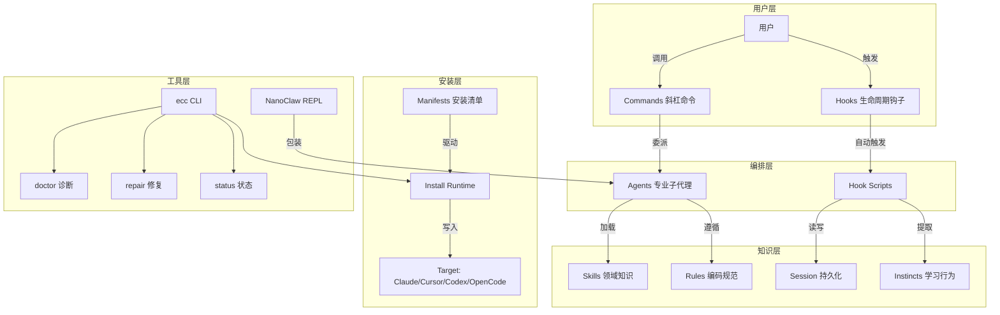
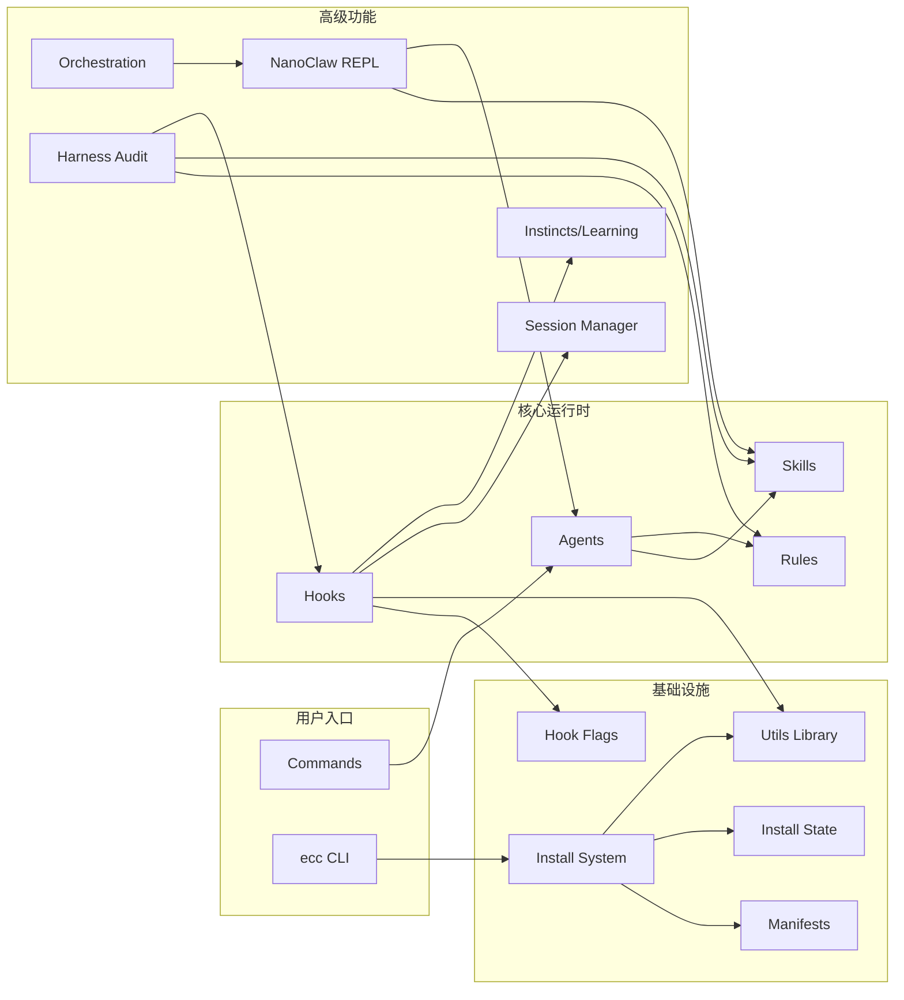
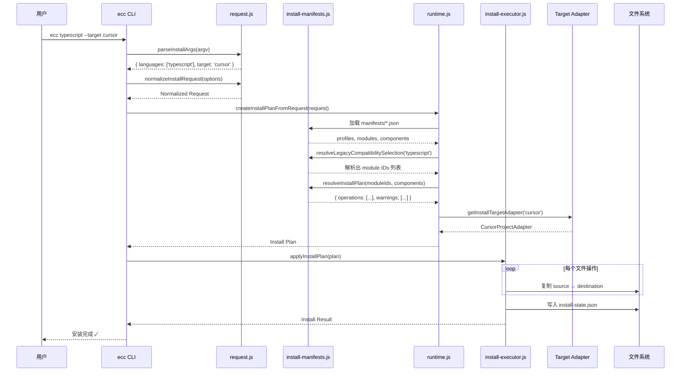
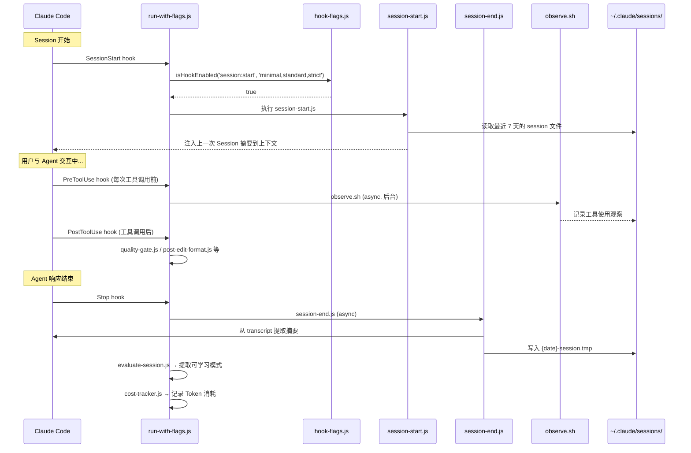

# everything-claude-code 源码学习笔记

> 仓库地址：[everything-claude-code](https://github.com/affaan-m/everything-claude-code)
> 学习日期：2026-03-22

---

> **以下为 AI 源码分析**
>
> ### 一句话概括
>
> 一套为 AI Agent 编码工具（Claude Code、Cursor、Codex 等）打造的性能优化系统，包含 28 个专业 Agent、116 个 Skill、59 个 Command 和自动化 Hook 工作流。
>
> ### 要点速览
>
> | 核心模块 | 职责 | 关键文件 |
> |---------|------|---------|
> | agents/ | 28 个专业子 Agent（规划、代码审查、TDD、安全等） | `planner.md`, `code-reviewer.md`, `tdd-guide.md` |
> | skills/ | 116 个领域知识和工作流定义 | 每个 skill 一个目录，含 `SKILL.md` |
> | commands/ | 59 个用户可调用的斜杠命令 | `tdd.md`, `plan.md`, `code-review.md` |
> | hooks/ | 生命周期自动化钩子（Session/Tool/Stop） | `hooks.json`, `scripts/hooks/*.js` |
> | rules/ | 编码规范指南（通用 + 12 门语言） | `common/`, `typescript/`, `python/` 等 |
> | scripts/ | CLI 工具和安装运行时 | `ecc.js`, `install-apply.js`, `claw.js` |
> | manifests/ | Selective Install 的配置清单 | `install-profiles.json`, `install-modules.json` |

---

## 项目简介

Everything Claude Code（ECC）是一个 AI Agent Harness 性能优化系统，由 Anthropic Hackathon 获奖者经过 10+ 个月密集日常使用迭代而成。它不是简单的配置包，而是一套完整的系统：包含 Skill（领域知识）、Instinct（自动学习的行为模式）、Memory Optimization（跨会话上下文持久化）、Continuous Learning（从会话中自动提取模式）、Security Scanning（安全扫描）等。ECC 可跨 Claude Code、Cursor、Codex、OpenCode 等多个 AI 编码工具使用，通过 npm 包 `ecc-universal` 分发安装。

## 技术栈

| 类别 | 技术 |
|------|------|
| 语言 | JavaScript (Node.js)、Markdown、Shell |
| 框架 | 无传统框架，自建 Plugin/Hook 体系 |
| 构建工具 | npm scripts、ESLint、markdownlint |
| 依赖管理 | npm（仅 1 个 runtime 依赖：sql.js） |
| 测试框架 | Node.js 原生 `node:test` + `node:assert`（零外部依赖） |

## 目录结构

```
everything-claude-code/
├── agents/                  # 28 个专业子 Agent 定义（Markdown + YAML frontmatter）
│   ├── planner.md           #   实现规划专家
│   ├── code-reviewer.md     #   代码审查专家
│   ├── tdd-guide.md         #   TDD 引导专家
│   ├── security-reviewer.md #   安全审查专家
│   └── ...                  #   Go/Rust/Python/Java/Kotlin 等语言专用 Agent
├── skills/                  # 116 个 Skill 目录
│   ├── tdd-workflow/        #   TDD 工作流
│   ├── security-review/     #   安全审查清单
│   ├── continuous-learning-v2/ # Instinct 持续学习系统
│   ├── coding-standards/    #   编码标准
│   └── ...                  #   Django/Spring/Laravel/Flutter 等框架 Skill
├── commands/                # 59 个斜杠命令定义
│   ├── tdd.md               #   /tdd 命令
│   ├── plan.md              #   /plan 命令
│   ├── code-review.md       #   /code-review 命令
│   └── ...
├── hooks/                   # Claude Code Hook 配置
│   └── hooks.json           #   所有生命周期钩子定义
├── rules/                   # 编码规范规则（12 种语言 + common）
│   ├── common/              #   通用规则
│   ├── typescript/          #   TypeScript 规则
│   ├── python/              #   Python 规则
│   └── ...
├── scripts/                 # Node.js CLI 工具和运行时
│   ├── ecc.js               #   主 CLI 入口（ecc 命令）
│   ├── install-apply.js     #   安装执行器
│   ├── install-plan.js      #   安装计划查看器
│   ├── claw.js              #   NanoClaw v2 Agent REPL
│   ├── doctor.js            #   安装诊断工具
│   ├── harness-audit.js     #   Harness 审计评分
│   ├── hooks/               #   Hook 脚本实现
│   └── lib/                 #   共享库（install、session、utils 等）
├── manifests/               # Selective Install 清单
│   ├── install-profiles.json #  安装 Profile 定义
│   ├── install-modules.json  #  安装模块定义
│   └── install-components.json # 安装组件定义
├── schemas/                 # JSON Schema 校验
├── tests/                   # 测试套件
├── contexts/                # 上下文模板（dev/research/review）
├── .claude/                 # Claude Code Plugin 配置
├── .cursor/                 # Cursor IDE 配置和 hooks
├── .opencode/               # OpenCode 集成
├── .codex/                  # Codex CLI 集成
├── CLAUDE.md                # 项目 Claude Code 指令
├── AGENTS.md                # Agent 编排指令
└── package.json             # npm 包配置（ecc-universal v1.9.0）
```

## 架构设计

### 整体架构

ECC 采用**插件化 + 事件驱动**的架构。核心思想是将 AI Agent 的行为规范化为四层结构：**Rules（始终遵循的规则）→ Skills（领域知识）→ Agents（专业子代理）→ Commands（用户入口）**，并通过 **Hooks** 实现自动化的生命周期管理。整个系统通过 Selective Install 机制按需安装到不同的 AI Harness 中。



### 核心模块

#### 1. Install System（安装系统）

安装系统是 ECC 最复杂的模块，采用 Manifest-Driven 架构实现 Selective Install：

- **核心文件**：`scripts/install-apply.js`, `scripts/install-plan.js`, `scripts/lib/install-manifests.js`, `scripts/lib/install-executor.js`
- **子模块**：`scripts/lib/install/` (request.js, runtime.js, config.js, apply.js)
- **Target 适配器**：`scripts/lib/install-targets/` (claude-home.js, cursor-project.js, codex-home.js, antigravity-project.js, opencode-home.js)
- **流程**：解析用户请求 → 加载 Manifest → 解析 Profile/Module → 生成 Install Plan → 适配目标平台 → 执行文件复制 → 记录 Install State
- **关键设计**：通过 `install-state.json` 跟踪已安装文件，支持增量更新、doctor 诊断和 repair 修复

#### 2. Hook System（钩子系统）

基于 Claude Code 的原生 Hook 机制，实现 AI Agent 会话的全生命周期自动化：

- **核心文件**：`hooks/hooks.json`, `scripts/hooks/run-with-flags.js`, `scripts/lib/hook-flags.js`
- **生命周期事件**：`SessionStart` → `PreToolUse` → `PostToolUse` → `PostToolUseFailure` → `PreCompact` → `Stop` → `SessionEnd`
- **关键 Hook**：
  - `session-start.js`：加载上一次 Session 摘要、检测项目类型和包管理器
  - `session-end.js`：从 transcript 提取摘要并持久化
  - `run-with-flags.js`：Hook 调度器，支持 Profile 级别开关（minimal/standard/strict）
  - `quality-gate.js`：代码编辑后自动质量检查
  - `suggest-compact.js`：上下文窗口管理建议
  - `cost-tracker.js`：Token 和成本追踪

#### 3. Agent System（Agent 系统）

28 个专业 Agent，以 Markdown + YAML frontmatter 格式定义：

- **核心文件**：`agents/*.md`
- **Agent 格式**：
  ```yaml
  ---
  name: planner
  description: Expert planning specialist...
  tools: ["Read", "Grep", "Glob"]
  model: opus
  ---
  ```
- **Agent 分类**：
  - 通用型：planner、architect、code-reviewer、tdd-guide、security-reviewer
  - 语言专用：go-reviewer、python-reviewer、rust-reviewer、typescript-reviewer、java-reviewer、kotlin-reviewer、cpp-reviewer
  - 运维型：build-error-resolver、loop-operator、harness-optimizer
  - 特殊型：chief-of-staff（通信分类）、doc-updater（文档更新）

#### 4. Skill System（Skill 系统）

116 个 Skill，每个为独立目录含 `SKILL.md`：

- **核心文件**：`skills/*/SKILL.md`
- **Skill 格式**：Markdown with frontmatter (name, description, origin, version)
- **Skill 分类**：
  - 工作流型：tdd-workflow、verification-loop、continuous-learning-v2
  - 语言型：python-patterns、golang-patterns、rust-patterns
  - 框架型：django-patterns、springboot-patterns、laravel-patterns
  - 安全型：security-review、security-scan
  - 工具型：eval-harness、deep-research、exa-search

#### 5. Command System（命令系统）

59 个斜杠命令，Markdown 格式定义：

- **核心文件**：`commands/*.md`
- **命令格式**：Markdown with description frontmatter
- **代表命令**：`/tdd`、`/plan`、`/code-review`、`/build-fix`、`/learn`、`/skill-create`、`/harness-audit`

#### 6. NanoClaw（Agent REPL）

轻量级 Agent REPL，零外部依赖：

- **核心文件**：`scripts/claw.js`
- **功能**：Session 管理、Skill 热加载、Model 路由、Session 分支/搜索/导出/压缩
- **命令**：`:new`、`:switch`、`:list`、`:search`、`:branch`、`:export`、`:compact`、`:metrics`

### 模块依赖关系



## 核心流程

### 流程一：Selective Install（选择性安装）

这是 ECC 最核心的流程，用户通过 `npx ecc typescript` 或 `ecc install --profile developer --target cursor` 安装组件到目标 Harness。



**关键逻辑**：
1. **参数解析**（`request.js`）：支持 Legacy 语言模式和新版 Profile/Module 模式
2. **Manifest 解析**（`install-manifests.js`）：从 `manifests/` 目录加载 Profile → Module → Component 三级配置
3. **计划生成**（`runtime.js`）：根据 Target 类型和选定模块，生成文件复制操作列表
4. **Target 适配**（`install-targets/`）：每个 Target（Claude/Cursor/Codex/Antigravity/OpenCode）有独立适配器，决定安装路径和文件映射
5. **状态追踪**（`install-state.js`）：记录所有已安装文件的 SHA-256 哈希，支持 doctor 检测漂移和 repair 修复

### 流程二：Hook 驱动的 Session 生命周期

ECC 通过 Hook 系统实现跨 Session 的上下文持久化和持续学习。



**关键逻辑**：
1. **Hook 调度**（`run-with-flags.js`）：所有 Hook 通过此统一调度器执行，先检查 Profile 开关（minimal/standard/strict）和禁用列表（`ECC_DISABLED_HOOKS`）
2. **Session 持久化**：`session-start.js` 在新 Session 开始时加载上一次摘要，`session-end.js` 在 Stop 事件时从 JSONL transcript 提取用户消息、工具使用和修改文件
3. **持续学习**（`continuous-learning-v2`）：通过 PreToolUse/PostToolUse 的 `observe.sh` 后台收集工具使用模式，后台 Agent 分析并生成 Instinct（原子级行为模式），Instinct 积累到一定置信度后可进化为 Skill/Command/Agent
4. **Hook 性能优化**：`run-with-flags.js` 对导出 `run()` 函数的 Hook 使用 `require()` 直接调用（节省 ~50-100ms 的进程启动开销），仅对 Legacy Hook 使用 `spawnSync` 子进程

## 关键设计亮点

### 1. Selective Install 的 Manifest-Driven 架构

**解决的问题**：用户只需要部分组件（如只写 TypeScript），不想安装全部 116 个 Skill 和 12 种语言规则。

**实现方式**：三级配置架构 —— Profile（预设组合）→ Module（功能模块）→ Component（用户可见组件）。`manifests/install-profiles.json` 定义 5 个 Profile（core/developer/security/research/full），`install-modules.json` 定义模块和文件映射，`install-components.json` 定义用户级别的开关。安装时 `install-plan.js` 解析清单生成操作列表，`install-apply.js` 执行复制并记录 `install-state.json`。

**为什么这样设计**：避免了"全量安装 or 手动挑选"的二元选择。用户可以用 Profile 快速上手，也可以用 `--modules`/`--with`/`--without` 精细控制。Install State 机制使得后续的 doctor 诊断和 repair 修复成为可能。

**关键文件**：`manifests/*.json`, `scripts/lib/install-manifests.js`, `scripts/lib/install/runtime.js`

### 2. Hook Profile 分级控制

**解决的问题**：Hook 过多导致性能开销大，不同场景需要不同级别的自动化。

**实现方式**：`scripts/lib/hook-flags.js` 实现了三级 Profile 开关 —— `minimal`（仅 session 持久化）、`standard`（标准自动化）、`strict`（全部 Hook 启用）。每个 Hook 在 `hooks.json` 中通过 `run-with-flags.js` 声明支持的 Profile 列表，运行时通过 `ECC_HOOK_PROFILE` 环境变量和 `ECC_DISABLED_HOOKS` 精确控制。

**为什么这样设计**：一行环境变量即可切换自动化级别，无需修改任何配置文件。这在排查 Hook 性能问题时尤为关键。

**关键文件**：`scripts/lib/hook-flags.js`, `scripts/hooks/run-with-flags.js`, `hooks/hooks.json`

### 3. Instinct-Based Continuous Learning

**解决的问题**：每次新 Session 都从零开始，无法复用之前积累的编码模式和偏好。

**实现方式**：`skills/continuous-learning-v2/` 实现了 Instinct 系统 —— 通过 Hook 在每次工具使用时观察行为，后台 Haiku Agent 分析模式并生成原子级 Instinct（带 0.3-0.9 置信度评分）。Instinct 支持 Project-Scoped（项目隔离）和 Global（跨项目共享）两种作用域。当 Instinct 在 2+ 个项目中出现时可提升为 Global。高置信度 Instinct 集群可进化为完整的 Skill/Command/Agent。

**为什么这样设计**：比直接学习 Skill 更细粒度，置信度机制防止误学习，项目隔离防止 React 模式污染 Python 项目。

**关键文件**：`skills/continuous-learning-v2/SKILL.md`, `skills/continuous-learning-v2/hooks/observe.sh`

### 4. 跨 Harness 统一适配

**解决的问题**：同一套最佳实践需要适配 Claude Code、Cursor、Codex、OpenCode、Antigravity 等多个 AI 编码工具。

**实现方式**：`scripts/lib/install-targets/registry.js` 定义了 Target 适配器注册表，每个 Target 有独立的适配器（如 `claude-home.js`、`cursor-project.js`），决定安装路径映射和特殊处理。Cursor 额外安装 `.cursor/hooks/` 和 `.cursor/rules/`，Codex 使用 `AGENTS.md` 作为指令入口，OpenCode 有独立的 Plugin 系统。

**为什么这样设计**：Agent → Skill → Rule → Hook 的内容层不变，仅通过 Target Adapter 适配不同工具的文件约定。新增 Harness 支持只需编写新的 Adapter。

**关键文件**：`scripts/lib/install-targets/registry.js`, `scripts/lib/install-targets/*.js`

### 5. Agent 定义的 Markdown + Frontmatter 格式

**解决的问题**：Agent 定义需要对人类可读、对 AI 可解析、且易于社区贡献。

**实现方式**：每个 Agent 是一个 Markdown 文件，YAML frontmatter 声明元数据（name、description、tools、model），正文是给 AI 的详细指令。这种格式：1) 人类直接阅读理解 Agent 行为；2) 工具链可解析 frontmatter 做自动化；3) 贡献者只需写 Markdown，无需学习 DSL；4) Git diff 友好。

**为什么这样设计**：Markdown 是开发者最熟悉的格式，frontmatter 是静态站点生成器（Jekyll/Hugo）的成熟模式。这使得 ECC 能在 GitHub 上直接预览 Agent 定义，社区贡献门槛极低（30+ 贡献者）。

**关键文件**：`agents/*.md`, `CONTRIBUTING.md`
