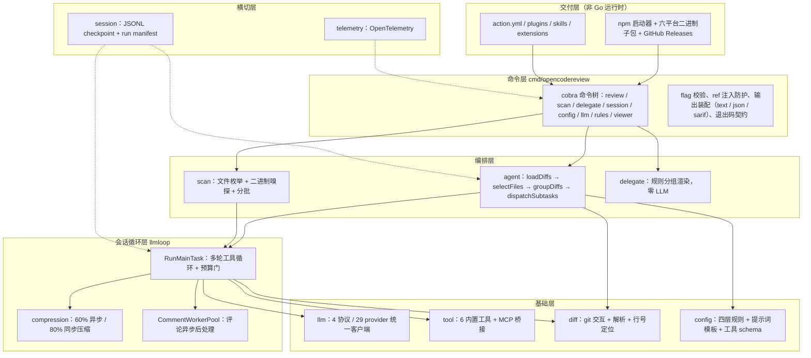
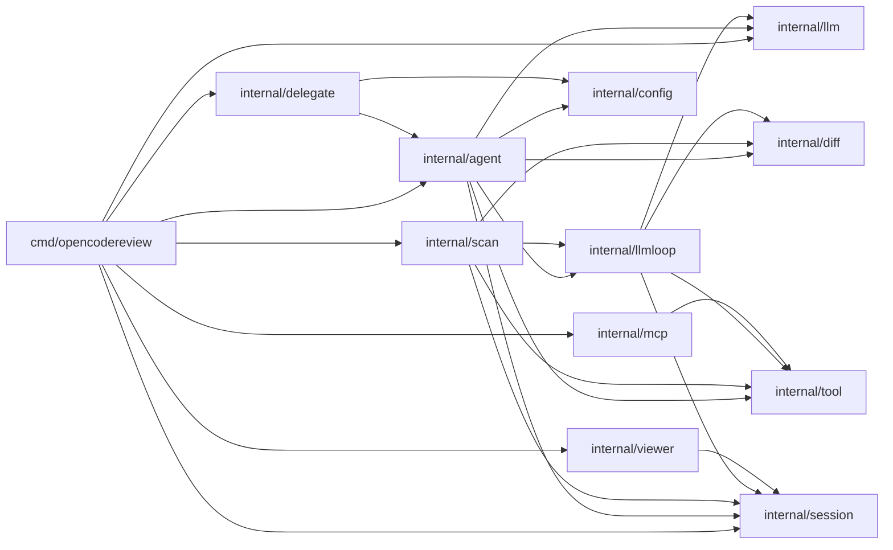
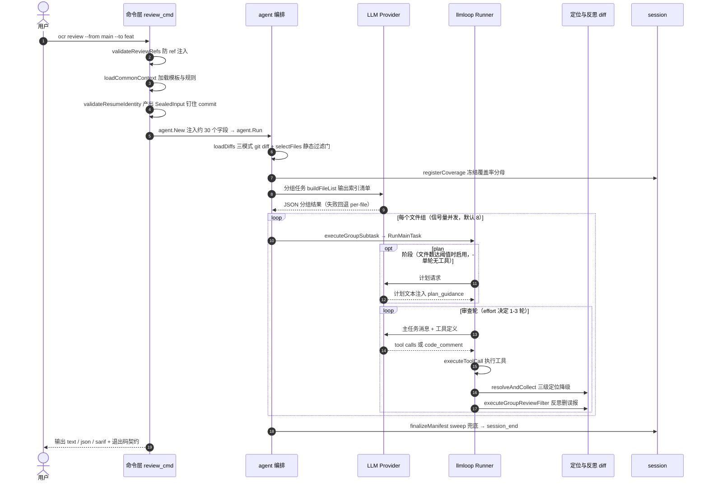
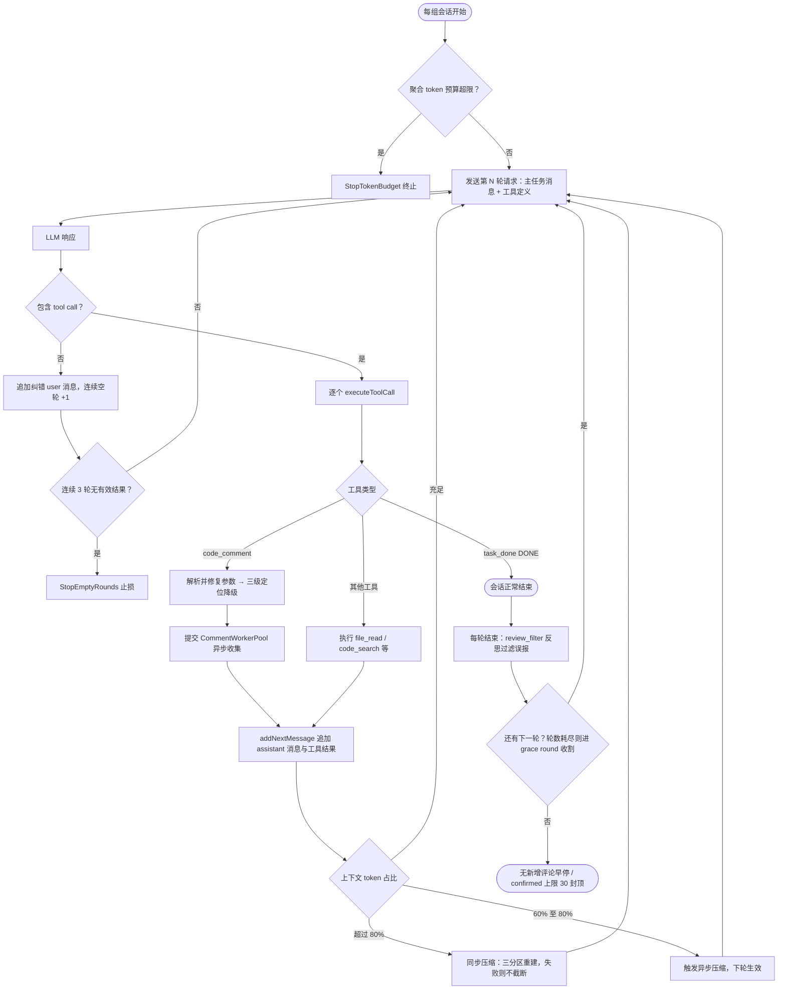

# open-code-review 源码学习笔记

> 仓库地址：[open-code-review](https://github.com/alibaba/open-code-review)
> 学习日期：2026-09-30

---

> **以下为 AI 源码分析**
>
> ### 一句话概括
>
> 阿里内部孵化的开源 AI 代码审查 CLI（`ocr`）：用确定性工程（文件选择、智能分组、规则匹配、评论定位、coverage 记账）硬约束一个多轮工具调用的 LLM Agent，产出行级精准的 review 评论——同等模型下 F1 / Precision 显著高于通用 Agent，token 消耗仅约 1/9。
>
> ### 要点速览
>
> | 模块 | 职责 | 关键文件 |
> |------|------|----------|
> | `cmd/opencodereview` | CLI 命令层（cobra）：review / scan / delegate / session / config / llm / rules / viewer 子命令、输出装配、resume 装配 | `main.go`、`root.go`、`review_cmd.go` |
> | `internal/agent` | 审查编排：diff 加载 → 文件选择 → LLM 智能分组 → 并发派发 → plan / 反思阶段 | `agent.go`、`grouping.go`、`selection.go` |
> | `internal/llmloop` | 单文件组的 LLM 会话循环：多轮工具调用、上下文压缩、评论异步后处理 | `loop.go`、`compression.go`、`pool.go` |
> | `internal/tool` | 6 个内置工具 + Registry 冻结机制，工具 schema 来自 `tools.json` | `definitions.go`、`code_comment.go` |
> | `internal/llm` | 协议无关统一客户端（4 协议 / 29 内置 provider 预设）+ 端点解析 + token 计数 + 重试观测 | `client.go`、`providers.go`、`resolver.go` |
> | `internal/diff` | git 交互、unified diff 解析、hunk 行号映射、评论定位降级链前两级 | `git.go`、`parser.go`、`resolver.go` |
> | `internal/config` | 四层规则引擎、提示词模板、工具 schema、连通性测试 | `rules/`、`template/`、`toolsconfig/` |
> | `internal/session` | JSONL checkpoint（可回放 agent trace）+ run manifest（coverage 唯一真相）+ resume 身份校验 | `persist.go`、`manifest.go`、`resume.go` |
> | `internal/scan` | `ocr scan` 全文件扫描（无 diff 场景），复用 llmloop 但不复用 agent | `scan/agent.go`、`provider.go`、`batch.go` |
> | `internal/delegate` | 委托模式：纯确定性 spec 生成，零 LLM 调用 | `rulegroup.go`、`format.go` |
> | `internal/viewer` | 本地只读 Web UI（embed.FS + 防 DNS rebinding） | `server.go`、`store.go`、`hostguard.go` |
> | `internal/telemetry` | OpenTelemetry trace / metric（OTLP） | `config.go` |

---

## 项目简介

Open Code Review 起源于阿里集团内部官方 AI 代码审查助手，两年内服务数万名开发者、识别百万级代码缺陷后孵化开源（Apache-2.0）。它读取 git diff，把变更文件经一个带工具调用能力的 Agent 发给可配置的 LLM，生成行级精准的结构化评论；`ocr scan` 还支持无 diff 场景的全文件审计，`ocr delegate` 支持把 LLM 推理外包给宿主 coding agent。

它要解决的核心问题是**通用 Agent（如 Claude Code + Skills）做 code review 的三大痛点**：大变更集漏文件（incomplete coverage）、行号漂移（position drift）、质量随 prompt 微调大幅波动（unstable quality）。项目的诊断是：纯语言驱动缺乏对审查过程的硬约束。因此核心设计是**确定性工程 × Agent 混合**——文件选择、文件分组阈值、规则匹配、评论定位、coverage 记账这些"绝不能出错的步骤"由工程代码保证；LLM 只承担动态决策（哪些文件语义相关、如何深挖上下文）。

基准数据来自 AACR-Bench（50 个开源仓库 / 200 个真实 PR / 10 种语言、80+ 资深工程师标注 1505 条 ground-truth）：同等模型下 F1 与 Precision 显著高于通用 Agent，token 消耗约 1/9，代价是 Recall 略低——刻意用"少而准"换"多而噪"。

工程质量信号同样值得注意：产品代码约 3.6 万行，测试代码约 7.6 万行（2 倍），CI 强制 90% 覆盖率门槛（`Makefile:47`）；仓库自带安全论证文档 `ASSURANCE_CASE.md`（威胁模型 + 信任边界）；`.opencodereview/rule.json` 是项目给自己定的审查规则——dogfooding 自审。

## 技术栈

| 类别 | 技术 |
|------|------|
| 语言 | Go 1.25.5（核心 CLI）；TypeScript（VSCode 扩展 / 官网）、Kotlin（IDEA 扩展） |
| CLI 框架 | spf13/cobra + pflag |
| LLM 接入 | anthropic-sdk-go、openai-go v3、aws-sdk-go-v2（Bedrock，SigV4 签名） |
| Agent 扩展 | modelcontextprotocol/go-sdk（MCP client，外部工具接入 review agent） |
| TUI | charm.land bubbletea v2 / bubbles / lipgloss（provider 配置交互界面） |
| Token 计数 | pkoukk/tiktoken-go + 内嵌 cl100k_base BPE 数据（计数不依赖网络） |
| 路径匹配 | bmatcuk/doublestar v4（规则 glob，支持 `**` 与 `{a,b}` 展开） |
| 可观测 | OpenTelemetry（OTLP gRPC/HTTP + stdout exporter） |
| 构建工具 | Make + `go build` 交叉编译（linux/darwin/windows × amd64/arm64 六平台）；`go:embed` 内嵌资源 |
| 依赖管理 | Go modules（Go 侧）；npm optionalDependencies 平台子包（分发层） |
| 测试框架 | `go test -race`（覆盖率门槛 90%）；vitest（pages/）；Node 内置测试（npm 层） |

## 目录结构

```
open-code-review/
├── cmd/opencodereview/        # CLI 入口与全部子命令（cobra）：review/scan/delegate/session/
│                              #   config/llm/rules/viewer/completion，含输出与 SARIF 装配
├── internal/                  # 核心 Go 包
│   ├── agent/                 # 审查编排：文件选择、LLM 分组、并发派发、plan/反思阶段
│   ├── llmloop/               # LLM 会话循环：多轮工具调用、上下文压缩、评论后处理池
│   ├── tool/                  # 6 个内置工具 + Registry 冻结 + 工具参数修复
│   ├── llm/                   # 统一 LLM 客户端：4 协议、29 provider 预设、token 计数
│   │   ├── bpe_data/          # 内嵌 tiktoken BPE 数据（cl100k_base）
│   │   └── gen/               # go:generate 生成 TS/Kotlin provider 列表（防漂移）
│   ├── diff/                  # git 交互、unified diff 解析、行号定位三级降级
│   ├── config/                # 规则引擎（4 层）、提示词模板、工具 schema、连通性测试
│   ├── session/               # JSONL checkpoint、run manifest、resume 身份校验
│   ├── scan/                  # ocr scan：全文件扫描（复用 llmloop，不复用 agent）
│   ├── delegate/              # ocr delegate：确定性 spec 生成（零 LLM）
│   ├── viewer/                # ocr viewer：本地只读 Web UI（embed.FS + hostGuard）
│   ├── mcp/                   # MCP client：外部工具桥接进 tool Registry
│   ├── model/                 # 共享数据类型（LlmComment / Diff / ScanItem / Preview）
│   └── ...                    # gitcmd / pathutil / release / stdout / suggestdiff / telemetry
├── plugins/open-code-review/  # Claude Code / Codex / Cursor / Kimi / OpenCode / QCA 插件
├── skills/                    # portable agent skill（open-code-review 与 delegate 两份）
├── extensions/                # VSCode / IDEA 插件 + 前端共享库（frontend/）
├── npm/                       # npm 分发：bin/ocr.js 启动器 + 六平台二进制子包
├── pages/                     # 官网与文档站（React + webpack）
├── examples/                  # GitHub Actions / GitLab / Gerrit / Codeup 等 CI 示例
├── scripts/                   # license 校验、英文-only 校验、发布脚本
├── action.yml                 # GitHub Action（复合 action，含评论回贴逻辑）
├── .opencodereview/rule.json  # 项目自审规则（dogfooding）
├── ASSURANCE_CASE.md          # 安全论证文档（威胁模型 / 信任边界 / 缓解措施）
├── AGENTS.md / CONTRIBUTING.md / GOVERNANCE.md / ROADMAP.md
└── Makefile                   # build/test/coverage(90%)/check/dist（六平台发布）
```

## 架构设计

### 整体架构

整个系统是**严格自上而下的分层管线**：命令层只做装配与校验，编排层做确定性决策，会话循环层驱动 LLM，基础层提供协议与数据能力，横切层记录 checkpoint 与遥测。外围的 npm / action / plugins / skills 都只是同一个 Go 二进制的不同交付壳。



设计要点：

- **agent 与 llmloop 分层**是理解本项目的钥匙：agent 持有 diff 侧状态、做确定性决策（选哪些文件、怎么分组、并发多少）；llmloop 拥有每组一个的 LLM 会话（多轮消息、工具派发、上下文压缩）。scan 复用 llmloop 但完全绕开 agent（`scan/agent.go:96`）。
- **工具 schema 与实现分离**：LLM 实际看到的工具定义来自 `config/toolsconfig/tools.json`（按 plan / main 阶段过滤），Go 侧 `tool.Registry` 只是执行器——改提示词层面的工具描述不用动 Go 代码。
- **横切不侵入**：session / telemetry 以 `ManifestBuilder`、`SessionHistory` 等类型挂在管线上，llmloop 完全不触碰 manifest（coverage 记账全在 agent 层）。

### 核心模块

#### internal/agent —— 审查编排

- **职责**：把一次 review 编排成确定性流水线：diff 获取 → 文件选择 → 分组 → 并发派发子任务 → 每组 plan / 主循环 / 反思 → manifest 收尾。
- **核心文件**：`agent.go`（`Agent` struct :185-205；`Args` 注入约 30 个字段 :55-167；`Run` :284-443；`dispatchSubtasks` :631-858；`executeGroupSubtask` :1379-1559）、`grouping.go`、`selection.go`、`estimate.go`、`resume_identity` 逻辑（`ResolveIdentity`）。
- **关键函数**：`Run`（总入口）、`groupDiffs`（分组决策树，`grouping.go:68-108`）、`selectFiles`（静态过滤门，`selection.go:43-63`）、`resolveGroupSystemRule`（按路径解析规则并注入 `{{system_rule}}`，`agent.go:1686`）、`executeGroupReviewFilter`（反思，`agent.go:1798-1923`）。
- **关系**：上游 cmd 层；下游 llmloop（每组会话）、config（规则 + 模板）、diff、session（manifest / resume）。

#### internal/llmloop —— 会话循环

- **职责**：单文件组的 LLM 会话：多轮请求、工具调用执行、上下文压缩、`code_comment` 的异步收集、token 聚合与止损。
- **核心文件**：`loop.go`（`Deps` :29-75；`RunMainTask` :374-533；`executeToolCall` :629-827；`addNextMessage` :834-881）、`compression.go`（双阈值压缩）、`pool.go`（`CommentWorkerPool` :40-154）、`tool_failure_streak.go`（工具失败升级链）、`tool_args_json.go`（参数容错解析）。
- **关键机制**：`toolReqCount` 默认 100 轮上限；连续 3 轮无有效结果 `StopEmptyRounds`；轮数耗尽进入 grace round（只留 `code_comment` + `task_done` 收割，`loop.go:545-607`）；同一 (taskKey, tool) 连续失败第 3 次起伪装成功防无限重试（`tool_failure_streak.go:73-88`）。
- **关系**：被 agent（review）与 scan 双方复用——scan 注入 `NewRequestMeta=nil`，其请求不进 retry report（`loop.go:53-65`）。

#### internal/tool —— LLM 工具

- **职责**：工具注册表与 6 个内置实现。`Provider` 接口只有 `Tool()` / `Execute(ctx, args)`（`definitions.go:71-76`）；`Registry` 支持 `Freeze()` 冻结只读（`injectDiffMap` 注入后冻结，`agent.go:322`）。
- **工具清单**（名称定义 `definitions.go:18-25`）：`task_done`（LLM 宣告结束，特判在 `loop.go:632-653`）、`code_comment`（提交评论，`code_comment.go:51-71`）、`code_search`（git grep，100 条截断 / 10s 超时）、`file_read`（读文件，500 行截断）、`file_read_diff`（查指定文件的 diff）、`file_find`（文件名查找，git ls-files / ls-tree）。
- **关系**：MCP server 的外部工具经 `mcp.RegisterAll` 注入同一 Registry（`review_cmd.go:597`）；scan 侧通过 `excludeToolDef` 把 `file_read_diff` 从 LLM 可见 schema 中隐藏但保留实现。

#### internal/llm —— 统一 LLM 客户端

- **职责**：协议无关的聊天客户端 + 端点解析 + token 计数 + 可观测（重试报告 / 原始日志）。
- **核心文件**：`client.go`（唯一接口 `LLMClient` 单方法 `CompletionsWithCtx` :92-94；三个客户端实现 + Bedrock 复用 Anthropic 客户端 :1226-1332；OpenAI 流式聚合 :685-873）、`protocol.go`（4 协议常量：anthropic / openai / openai-responses / anthropic-bedrock :19-38）、`providers.go`（29 个内置 provider 预设，:42-503）、`resolver.go`（端点解析链：config 文件 → OCR 环境变量 → `ANTHROPIC_*` 环境变量 → shell rc 解析 :97-151）、`usage_resolver.go`（6 组 JSON path 探测 token 用量）、`retry_report.go`、`embedded_loader.go`（内嵌 BPE）。
- **亮点**：tiktoken BPE 数据内嵌（`embedded_loader.go:22-29`）——tiktoken-go 默认首次使用联网下载、失败静默降级为 bytes/4 估算，内嵌后计数永不依赖网络；`gen/` 用 `go generate` 把 provider 注册表渲染成 TS / Kotlin 生成物，CI 校验防漂移。
- **关系**：上层只依赖 `CompletionsWithCtx` 一个方法；凭证优先级：静态 `api_key` > `api_key_cmd`（命令输出）> 预设环境变量。

#### internal/diff —— git 与定位

- **职责**：三种 diff 模式（workspace：staged+unstaged+untracked / commit：`git show --diff-merges=first-parent` / range：merge-base）的 git 交互、unified diff 解析状态机、hunk 行号映射、评论定位降级链前两级。
- **核心文件**：`git.go`（`GetDiffSet` :218-280；untracked 文件手工合成 new-file diff :686-700；`-z` 防路径转义 :712）、`parser.go`（`ParseDiffText` 逐行状态机 :64-147）、`hunk.go`（`ParseHunks` :40-113）、`resolver.go`（`ResolveLineNumbers` :15-58；`RelocateAcrossFiles` :100-139）、`relocation.go`（LLM 重定位 :49-95）、`gitignore.go`。
- **关系**：agent / llmloop / scan 都消费它；scan 用 `model.ScanItem.AsDiff()`（`model/scan.go:22`）适配器让全文件内容零改动复用 diff 侧行号解析器。

#### internal/config —— 规则与模板

- **职责**：四层规则引擎（custom `--rule` > project `.opencodereview/rule.json` > global `~/.opencodereview/rule.json` > system 内嵌，first-match-wins，`NewResolver` :299-347）、提示词模板、工具 schema、连通性测试。
- **规则格式**是自定义 JSON（非 YAML）：`{rules:[{path, rule, merge_system_rule}], include, exclude}`；`rule` 字段既可内联文本也可指向 .md 文件（512KB 上限 + 路径逃逸校验）。路径匹配用 doublestar，大小写不敏感 + `{a,b}` 手工展开（`system_rules.go:182-203`）。还有内容嗅探层：`.m` 文件读首个非空行判断 Objective-C vs MATLAB（`sniffer.go:45-51`）。
- **模板不是 Go text/template**：`task_template.json`（embed）声明 6 类任务（main / plan / grouping / memory_compression / re_location / review_filter）的 messages 与预算标量，提示词正文是 `prompts/*.md`，运行时 `strings.ReplaceAll` 替换 `{{xxx}}` 占位符（`template.go:154-158`、`LoadDefault` :214-253）。effort 三档只映射审查轮数 1/2/3。
- **testconnection**（`ocr llm test`）刻意走一轮 tool-call 往返而非单次请求——单请求测不出"provider 拒绝 tool call 后续轮次"这一失败模式（`testconnection.go:31-36`）。
- **关系**：`rules.Resolver.Resolve(path)` 被 agent 消费注入提示词；`tools.json` 决定 LLM 看到的工具 schema。

#### internal/session —— checkpoint 与 manifest

- **职责**：JSONL 持久化（既是可回放的 agent trace，又是文件级断点）+ run manifest（coverage 唯一真相）+ resume 身份校验。
- **核心文件**：`persist.go`（`$HOME/.opencodereview/sessions/<encoded-repo>/<session-id>.jsonl`，9 种记录类型、每条带 uuid 链 :24 起）、`manifest.go`（`RunManifest` = `ocr.run-manifest/v1`；`ManifestBuilder` 两阶段 sealed/frozen；`Finalize` sweep 兜底 :742；terminal state 只从 coverage 推导 :941）、`resume.go`（按 fingerprint 重放 checkpoint）、`resume_identity.go`（运行级身份校验）、`history.go`（`SessionHistory` 完整对话轨迹 + TaskType 六枚举）、`raw_writer.go`（`raw/` 目录：未解析的原始 HTTP 字节，与 session JSONL 分流）、`compare.go`（两次 session 的 findings 对比，匹配 key 刻意不含行号）。
- **关系**：agent / llmloop 写，viewer 读，cmd 装配校验。

#### internal/scan —— 全文件扫描

- **职责**：`ocr scan` 枚举整个仓库文件做审查（无 git 历史依赖）：git 仓库用 `git ls-files`（完整 .gitignore 语义）、否则 `filepath.WalkDir` 回退；2MiB 体积上限；二进制嗅探只发占位符；三种分批策略（none / by-language / by-directory）。
- **核心文件**：`scan/agent.go`（`Agent` :96-114，只负责枚举与 FULL_SCAN_TASK 渲染，循环交给 llmloop；`RunManifest()` 返回 nil——scan 不在 v1 manifest 范围内 :190）、`provider.go`、`batch.go`、`estimate.go`（估 token 不估钱，超限只诊断不终止）。
- **关系**：复用 llmloop + diff 定位；输入完全来自工作树文件字节，因此 scan 可以 resume 而 workspace review 不行。

#### internal/delegate —— 委托模式

- **职责**：OCR 只输出"选哪些文件 + 适用什么规则"的确定性 spec，LLM 推理交给宿主 coding agent（复用其订阅额度），OCR 侧零 API key、零 LLM 调用。
- **核心文件**：`rulegroup.go`（`GroupRules` :55 按 `source\x00pattern\x00text` 分组——同文本不同来源也不合并）、`format.go`（`RuleGroupsMarkdown` 渲染）。
- **关系**：复用 `agent.Preview` 做文件选择，但**故意不传 Template**，从而关闭 per-file diff 体积上限（宿主 agent 用自己的上下文窗口，`delegate_cmd.go:120-123` 注释）。

#### internal/viewer —— 只读 Web UI

- **职责**：本地 HTTP 服务器（默认 `localhost:5483`）浏览 / 回放 session；`embed.FS` 内嵌模板与静态资源；`ocr session export` 渲染单文件自包含 HTML。
- **核心文件**：`server.go`（`StartServer` :45；先 `net.Listen` 再打印/开浏览器 :67-69；Go 1.22 方法限定 pattern 路由只注册 GET :113）、`hostguard.go`（防 DNS rebinding：默认拒绝白名单，通配 bind 不自动放行 :88）、`securityheaders.go`（严格 CSP，无 `unsafe-inline` :14-28）、`store.go`（JSONL → 视图模型）、`browser.go`（跨平台开浏览器，TTY/SSH 判定）。
- **关系**：只读 session JSONL；"mark as fixed/ignored" 存浏览器 localStorage（`static/session.js:178`），服务端只发稳定 MarkID 零写入。

### 模块依赖关系



（`internal/model` 为共享类型包，被 agent / llmloop / diff / tool 普遍引用，图中省略；依赖方向单一向下：agent → llmloop → {llm, tool, session, diff}，无反向依赖——scan 与 review 共享 llmloop 而不共享 agent，是两条平行的顶层管线。）

## 核心流程

### 流程一：`ocr review` 从命令到评论的完整链路

入口 `executeReviewContext`（`review_cmd.go:114`）。命令层在调 LLM 前做了大量"防错装配"：ref 注入防护（`validateReviewRefs` :477，`--end-of-options` 防 `--from` 传 `--upload-pack` 之类）、resume 身份校验必须发生在 `agent.New` 之前（否则被拒的 resume 会留下孤儿 session 文件，:381-394 注释）。



关键逻辑说明：

1. **SealedInput**（`agent.go:144-150`）：resume 校验通过后把运行钉在预解析出的 commit 端点上，防止校验后 ref 被移动导致"审查的 diff 和读的文件不是同一版本"（`fileReadRef` 同理换 ref，`review_cmd.go:432-441`）。
2. **分组**：决策树（`grouping.go:68-108`）——单文件短路；文件数 ≥ `GROUPING_MIN_FILES=4` 走 LLM 分组；总变更行 < `GROUPING_BUNDLE_LINE_THRESHOLD=200` 全并一组；否则 per-file。LLM 按零基整数索引返回分组（省 token）；两个硬护栏随后强制执行：`enforceMaxFilesPerGroup`（每组 ≤ 10 文件）与 `enforceGroupTokenBudget`（组 token 合计超 80% MaxTokens 整组拆成单文件组）。"按语言 / 同目录 / producer-consumer 分组"不是代码规则，而是 grouping 提示词约束。
3. **组内子任务**（`executeGroupSubtask`，`agent.go:1379-1559`）：diff 用 XML 包裹拼接（`<file path="...">`）；plan 阶段失败只告警不中断；主循环每轮结束后跑反思（`executeGroupReviewFilter`），按本轮 baseline 增量计算 `confirmed`，无新增评论早停、`confirmedCap=30` 封顶。
4. **退出码契约**（`reviewResultError`，`review_cmd.go:326-352`）：非零仅当运行级失败或**所有** selected 项都失败；budget 触发的是受控截断，有任何覆盖就退出 0。manifest 即使在失败运行中也会先发布（JSON 消费者保留完整 coverage 诊断）。

### 流程二：单组 LLM 会话循环与评论生命周期

这是 llmloop 的 `RunMainTask`（`loop.go:374-533`）——项目里最"agent 味"的部分，但每个自由度都配了工程止损阀。



关键逻辑说明：

1. **评论定位三级降级链**（`resolveAndCollect`，`loop.go:708-768`）：`code_comment` 提交的评论先做纯文本定位——hunk 匹配（新侧→旧侧，跳空行的连续行匹配）失败再全文滑窗匹配（`diff.ResolveComment`，`resolver.go:62-73`）；仍失败则跨文件查找 `ExistingCode` 的**唯一**命中（0 或多命中都放弃，`RelocateAcrossFiles` :100-139）；最后才用 LLM 以 re_location 提示词重生成 snippet 再试一次（`relocation.go:49-95`）。**评论无论定位成败都会进 collector**——定位失败不等于审查失败。
2. **上下文双阈值压缩**（`compression.go:20-23`）：60% 触发**异步**压缩（不阻塞当前轮、5 分钟超时、下轮开始时换入）；80% 触发**同步**压缩。压缩把消息分三区：前 2 条 frozen、中间摘要成 `<previous_review_summary>` 附到 user 消息、尾部按预算整轮保留；压缩失败返回原消息**不截断**（宁可超预算也不丢上下文）。
3. **工具失败升级链**（`tool_failure_streak.go:73-88`）：同一 (taskKey, tool) 连续失败第 1 次原样报错、第 2 次显式警告、第 3 次起**伪装成已跳过的成功消息**——防止模型无限重试坏工具。
4. **参数容错**：工具参数 JSON 解析失败时用 `extractTopLevelJSON` 截取首个平衡的顶层 JSON 值（`tool_args_json.go:34-76`），兼容网关转发原始补全文本的场景；损坏的字符串化 comments 走确定性修复（`comment_args_repair.go`）。
5. **反思过滤**（`executeGroupReviewFilter`，`agent.go:1798-1923`）：每轮把 baseline 之后的候选评论编号为 `c-N` 连同组 diff 发给 LLM，带两个单选工具（`approve_all_comments` / `remove_comments`），点名删除误报；LLM 失败只打日志不删任何评论，解析失败同样保底全保留——反思的失败模式被设计为"保守"。

## 关键设计亮点

### 1. 确定性工程 × Agent 混合："必须不出错的交给代码，动态决策交给模型"

- **解决的问题**：纯语言驱动的 review 在大变更集上漏文件、行号漂移、质量随 prompt 微调剧烈波动——根因是缺乏硬约束。
- **实现**：分组是一棵带硬阈值的决策树（`grouping.go:68-108`）：单文件短路 / ≥4 文件走 LLM / <200 变更行全并一组 / 否则 per-file，LLM 分组结果还要过两道硬护栏（每组 ≤10 文件、组 token ≤80% MaxTokens），LLM 失败自动回退 per-file。文件选择门顺序固定不可绕（`selection.go:70-102`：binary → secret → user exclude → user include → 扩展白名单 → 默认排除；secret 与 provider 目录**无条件排除**，include 规则也救不回来）。
- **为什么**：让"绝不能错的步骤"（不漏文件、不超预算、不审秘密文件）成为结构性事实，与提示词写得好不好无关；模型只做它擅长的语义判断。

### 2. ItemID / Fingerprint 双身份 + manifest 作为 coverage 唯一真相

- **解决的问题**：断点续跑（resume）如何精确判断"哪些文件可复用、哪些必须重审"，并抗住行号漂移与 ref 移动。
- **实现**：`ItemID = sha256(operation + mode + 归一化路径)`（`manifest.go:199`，刻意**不含内容**，resume 链上逻辑身份稳定）；`Fingerprint = sha256(mode + 路径 + diff 全文)`（`agent.go:936`，内容敏感，checkpoint 失效粒度）。`SealSelected` 在派发前冻结覆盖率分母；`Finalize` 的 sweep 保证"没有 selected 项能不留结局"（`manifest.go:742`）；terminal state 只从 coverage 推导，绝不由评论数反推。resume 复用要求**父 manifest 为该 fingerprint 背书**（`ReusableItem`），丢一行 checkpoint 记录变成无害事件。
- **为什么**：把"运行级真相"（manifest）与"条目级身份"（fingerprint）分离，coverage、退出码、断点复用全从同一份数据推导，杜绝口径漂移；配套 `hashFields` 长度前缀哈希（`agent.go:1105`）杜绝拼接碰撞。

### 3. 评论定位三级降级链 + 反思过滤：精度优先，但一条评论都不丢

- **解决的问题**：LLM 输出的行号和代码片段经常漂移（通用 agent 的 position drift 痛点）。
- **实现**：hunk 匹配 → 全文滑窗 → 跨文件唯一命中 → LLM 重定位（`loop.go:708-768`），四级尝试全部失败也只是行号降级，评论照常进 collector；噪声控制交给独立的 review_filter 反思模块（按轮增量、失败保底全保留）。session 对比（`compare.go:87`）的匹配 key 刻意**不含行号**——行号漂移的两条评论仍能匹配上。
- **为什么**：定位（location）与发现（finding）解耦——定位是工程可验证的问题，发现是模型的价值所在；把"宁可精度降级也不丢发现"和"反思宁保守也不误删"两个失败方向都设计成安全侧。

### 4. 上下文预算当一等公民：双阈值压缩 + grace round + 工具失败升级链

- **解决的问题**：多轮 agent 循环的上下文膨胀、模型陷入重试循环、审查到一半预算耗尽一无所获。
- **实现**：60% / 80% 双阈值（`compression.go:20-23`）异步与同步压缩配合，压缩失败不截断；轮数耗尽 / 预算超限时 grace round 只保留 `code_comment` + `task_done` 两个工具做最后一次收割（`loop.go:545-607`）；同一工具连续失败 3 次伪装成功截断重试（`tool_failure_streak.go:73-88`）；80% 门（`PromptTokenLimit`）同时是文件选择、分组拆分、压缩触发共用的同一个预算口径。
- **为什么**：token 预算是这套架构的成本与质量双约束——所有预算检查共用同一常量，避免"选择时按一个口径、压缩时按另一个口径"的不一致。

### 5. 只读 Web UI 的纵深防御：读写边界放进路由层，而非依赖约定

- **解决的问题**：本地 HTTP server 承载含被审源码的 session 数据，任意网页可通过 DNS rebind 到 127.0.0.1 窃取。
- **实现**：四层独立防线——路由层用 Go 1.22 方法限定 pattern 只注册 GET，"只读"成为结构性事实（`server.go:113`，有 `TestMux_HasNoWriteRoutes` 守护）；`hostGuard` 默认拒绝 + 通配 bind 不自动放行（`hostguard.go:88`，逼运维显式设 `OCR_VIEWER_ALLOWED_HOSTS`）；严格 CSP 无 `unsafe-inline`、`frame-ancestors 'none'`（`securityheaders.go:14`）；"标记 fixed/ignored" 这种需要状态的功能放浏览器 localStorage，服务端只发稳定 MarkID（`store.go:778`），换来服务端零写入。
- **为什么**：这类安全决策不是散落在代码里的 if，而是集中写在 `ASSURANCE_CASE.md` 的威胁模型里（信任边界、T1-T7 威胁、逐条缓解），设计意图可审计。

---

**未深入分析的部分**（聚焦核心 Go 管线，以下仅做概览级扫描）：`pages/` 官网（React + webpack）、`extensions/` VSCode / IDEA 插件、`npm/` JS 启动器与安装脚本、`action.yml` 内嵌的 GitHub Actions 评论回贴逻辑、`scripts/publish` 发布流水线、以及 `internal/` 中的小包（`suggestdiff`、`release`、`stdout`、`pathutil`）。
