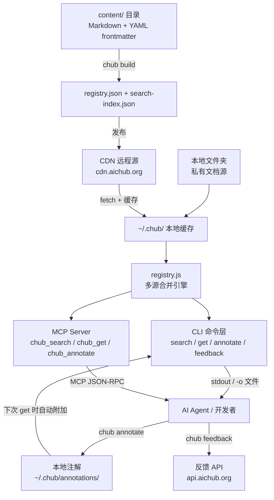
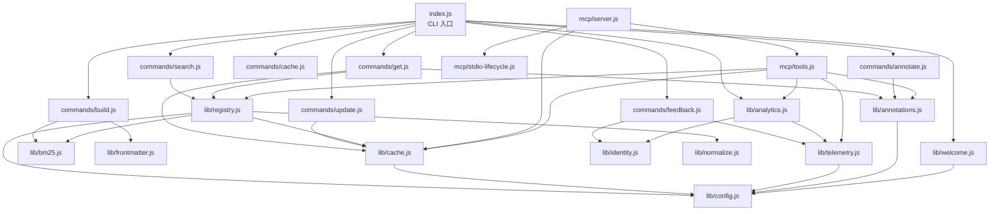
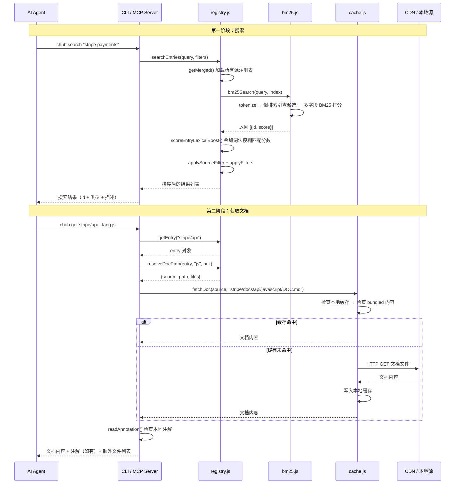
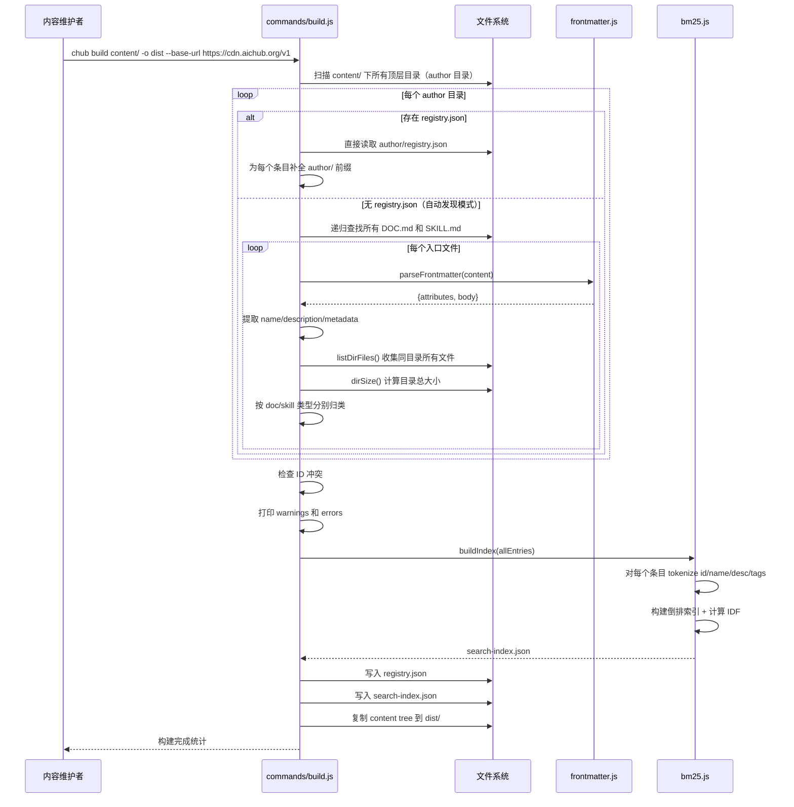

# context-hub 源码学习笔记

> 仓库地址：[context-hub](https://github.com/andrewyng/context-hub)
> 学习日期：2026-04-05

---

> **以下为 AI 源码分析**
>
> ### 一句话概括
>
> Context Hub 是一个 CLI 工具 + MCP Server，为 AI 编程 Agent 提供精选的、版本化的 API 文档和技能检索服务，解决 LLM 知识截断和 API 幻觉问题。
>
> ### 要点速览
>
> | 核心模块 | 职责 | 关键文件 |
> |---------|------|---------|
> | CLI 入口 | Commander 命令注册与生命周期管理 | `cli/src/index.js` |
> | Commands | 7 个子命令实现（search/get/build/update/cache/feedback/annotate） | `cli/src/commands/*.js` |
> | Registry | 多源注册表合并、条目查找与搜索 | `cli/src/lib/registry.js` |
> | Cache | 远程注册表拉取、文档缓存、bundled 内容加载 | `cli/src/lib/cache.js` |
> | BM25 搜索 | 基于 BM25 的全文搜索引擎，含倒排索引和词法模糊匹配 | `cli/src/lib/bm25.js` |
> | MCP Server | 将 CLI 功能暴露为 MCP 协议工具，供 AI Agent 原生调用 | `cli/src/mcp/server.js` |
> | Content | 600+ 个以 Markdown + YAML frontmatter 组织的文档/技能条目 | `content/` |

---

## 项目简介

Context Hub（简称 chub）是由 Andrew Ng 发起的开源项目，旨在解决 AI 编程 Agent 因 LLM 知识截断而频繁幻觉 API 用法的问题。它维护了一个由社区贡献的、精选的 LLM 优化文档和技能仓库，Agent 可以通过 CLI 命令或 MCP 协议实时搜索、获取最新的 API 文档，并通过 **annotation（本地注解）** 和 **feedback（反馈评分）** 机制实现跨会话的自我改进循环。核心价值在于：让 Agent 不再依赖训练数据中的过时 API 知识，而是在编码时按需获取准确文档。

## 技术栈

| 类别 | 技术 |
|------|------|
| 语言 | JavaScript (ES Modules, Node.js >= 18) |
| 框架 | Commander.js (CLI)、@modelcontextprotocol/sdk (MCP Server) |
| 构建工具 | 无构建步骤，原生 ES Modules 直接运行 |
| 依赖管理 | npm workspaces（根仓库 + cli 子包） |
| 测试框架 | Vitest |

## 目录结构

```
context-hub/
├── cli/                          # CLI 工具包（npm 包 @aisuite/chub）
│   ├── bin/
│   │   ├── chub                  # CLI 可执行入口
│   │   └── chub-mcp              # MCP Server 可执行入口
│   ├── src/
│   │   ├── index.js              # CLI 主入口，Commander 注册所有命令
│   │   ├── commands/             # 7 个子命令实现
│   │   │   ├── search.js         # 搜索文档和技能
│   │   │   ├── get.js            # 获取文档/技能内容
│   │   │   ├── build.js          # 从 content/ 构建 registry.json
│   │   │   ├── update.js         # 刷新远程注册表缓存
│   │   │   ├── cache.js          # 缓存状态查看与清理
│   │   │   ├── feedback.js       # 文档质量评分反馈
│   │   │   └── annotate.js       # 本地注解管理
│   │   ├── lib/                  # 核心工具库
│   │   │   ├── registry.js       # 注册表加载、合并、搜索核心逻辑
│   │   │   ├── cache.js          # 注册表/文档的缓存与网络获取
│   │   │   ├── bm25.js           # BM25 搜索引擎实现
│   │   │   ├── config.js         # ~/.chub/config.yaml 配置读取
│   │   │   ├── annotations.js    # 本地注解的 CRUD 操作
│   │   │   ├── telemetry.js      # 反馈发送与遥测开关控制
│   │   │   ├── analytics.js      # PostHog 匿名使用分析
│   │   │   ├── identity.js       # 机器级匿名 Client ID 生成
│   │   │   ├── output.js         # 双模输出（human/JSON）
│   │   │   ├── normalize.js      # 语言别名标准化（py→python）
│   │   │   ├── frontmatter.js    # YAML frontmatter 解析
│   │   │   └── welcome.js        # 首次运行欢迎提示
│   │   └── mcp/                  # MCP Server 实现
│   │       ├── server.js         # MCP Server 创建与工具注册
│   │       ├── tools.js          # 5 个 MCP 工具的 handler 实现
│   │       └── stdio-lifecycle.js # stdio 生命周期守护
│   ├── skills/                   # 内置 Agent 技能
│   │   └── get-api-docs/SKILL.md # 教 Agent 使用 chub 的技能文件
│   ├── tests/                    # Vitest 测试
│   └── package.json              # npm 包配置
├── content/                      # 公共文档注册表源（600+ 条目）
│   ├── openai/docs/...           # 按 author/docs|skills/name 组织
│   ├── flask/docs/...
│   └── ...
├── docs/                         # 设计文档
│   ├── design.md                 # 核心设计决策文档
│   ├── cli-reference.md          # CLI 完整参考
│   ├── content-guide.md          # 内容贡献指南
│   └── feedback-and-annotations.md
├── package.json                  # 根包（workspaces 配置）
├── llms.txt                      # LLM 可读的项目完整说明
└── README.md
```

## 架构设计

### 整体架构

Context Hub 采用 **内容仓库 → 构建发布 → 多源聚合 → CLI/MCP 消费** 的分层架构。内容以 Markdown + YAML frontmatter 形式存储在 Git 仓库中，通过 `chub build` 构建为 `registry.json` 索引和 BM25 搜索索引，发布到 CDN。CLI 和 MCP Server 从多个源（远程 CDN + 本地文件夹）加载注册表并合并，提供统一的搜索和获取接口。



### 核心模块

#### 1. CLI 入口与命令注册（`cli/src/index.js`）

职责：创建 Commander 程序实例，注册 7 个子命令，管理 preAction 钩子（遥测初始化、注册表加载）。

关键设计：
- **preAction 钩子**：在每个命令执行前自动加载注册表（`ensureRegistry()`），但 `update`/`cache`/`build`/`feedback`/`annotate` 等无需注册表的命令跳过
- **遥测初始化**：懒加载 identity 和 analytics 模块，fire-and-forget 方式发送事件，绝不阻塞命令执行
- **无默认命令时打印自定义帮助**：覆盖 Commander 默认行为，提供更友好的使用说明

#### 2. 注册表管理（`cli/src/lib/registry.js`）

职责：从所有配置源加载并合并 docs/skills 注册表，提供条目查找、列表、搜索接口。

核心函数：
- `getMerged()` — 从所有源加载注册表，合并为 `{ docs, skills }`，懒加载 + 单例缓存
- `searchEntries(query, filters)` — BM25 搜索 + 词法模糊匹配的混合搜索引擎
- `getEntry(id)` — 按 ID 精确查找，支持 `source:id` 消歧格式
- `resolveDocPath(entry, lang, version)` — 解析文档的语言/版本路径
- `applySourceFilter(entries)` — 按信任策略过滤条目源（official/maintainer/community）

关键设计：
- **多源合并**：支持多个 remote + local 源，同 ID 冲突时通过 `source:id` 前缀消歧
- **混合搜索策略**：先 BM25 打分，再叠加词法模糊匹配（Levenshtein 距离 + compact identifier 比较），处理包名拼写变体
- **源过滤**：配置中的 `source` 字段控制信任策略，只返回 allowed 源的条目

#### 3. 缓存系统（`cli/src/lib/cache.js`）

职责：管理远程注册表的下载、缓存刷新、文档的逐文件获取和本地缓存。

核心函数：
- `ensureRegistry()` — 确保至少一个注册表可用：优先用缓存 → bundled 内容 → 网络下载
- `fetchDoc(source, docPath)` — 获取单个文档：本地源直接读取 → 缓存目录 → bundled 内容 → CDN 下载并缓存
- `fetchAllRegistries(force)` — 批量刷新所有远程源的注册表
- `fetchFullBundle(sourceName)` — 下载 tar.gz 完整包用于离线使用

关键设计：
- **三级降级策略**：缓存 → bundled（npm 包内置） → CDN 网络，确保首次安装无需网络即可使用
- **缓存新鲜度检查**：`refresh_interval` 配置控制缓存 TTL（默认 6 小时），过期时后台刷新
- **bundled 内容种子**：`prepublish` 脚本在 npm 发布时将 content/ 构建到 dist/，首次运行自动种子到缓存

#### 4. BM25 搜索引擎（`cli/src/lib/bm25.js`）

职责：实现完整的 BM25 文本搜索算法，含索引构建（build 时）和运行时查询。

核心特性：
- **多字段加权**：id(4.0) > name(3.0) > tags(2.0) > description(1.0)
- **倒排索引**：build 时预计算，搜索时 O(1) 定位候选文档
- **标识符特化分词**（`tokenizeIdentifier`）：对包名进行激进分词，如 `node-fetch` → `nodefetch` + `node` + `fetch`
- **停用词过滤**：内置 ~60 个英文停用词

#### 5. MCP Server（`cli/src/mcp/`）

职责：将 CLI 核心功能暴露为 MCP 协议工具，支持 Claude Code、Cursor 等 MCP 兼容 Agent 原生调用。

工具列表：
- `chub_search` — 搜索文档和技能
- `chub_get` — 获取文档/技能内容（含路径遍历防护）
- `chub_list` — 列出所有可用条目
- `chub_annotate` — 注解的 CRUD 操作（含 ID 校验防注入）
- `chub_feedback` — 发送质量评分

关键设计：
- **console.log 劫持**：将所有 console 输出重定向到 stderr，防止破坏 stdio JSON-RPC 协议
- **stdio 生命周期守护**：监听 stdin EOF/close 和 stdout EPIPE 事件，父进程断开时优雅退出
- **最佳努力注册表加载**：注册表加载失败不阻塞服务器启动

#### 6. 注解与反馈系统

**注解**（`cli/src/lib/annotations.js`）：
- 本地持久化到 `~/.chub/annotations/`，以 JSON 文件存储
- 文件名使用 `entryId.replace(/\//g, '--')` 避免路径问题
- `chub get` 时自动附加在文档末尾，实现跨会话知识积累

**反馈**（`cli/src/lib/telemetry.js`）：
- 通过 HTTP POST 发送到 `api.aichub.org/v1/feedback`
- 包含结构化标签（accurate/outdated/incomplete 等）+ 自由文本评论
- 自动检测 Agent 类型（Claude Code/Cursor/Codex 等）

### 模块依赖关系



## 核心流程

### 流程一：文档搜索与获取（Search → Get）

这是 Agent 使用 Context Hub 的核心工作流，涵盖从搜索到获取文档内容的完整链路。



### 流程二：内容构建与发布（Build）

这是内容维护者将 Markdown 文档构建为可分发注册表的流程。



## 关键设计亮点

### 1. BM25 + 词法模糊匹配的混合搜索策略

**解决的问题**：包名搜索的特殊挑战 — 用户输入 `nodefetch` 或 `node fetch` 需要匹配 `node-fetch`，传统 BM25 仅靠分词无法覆盖这类变体。

**实现方式**（`cli/src/lib/registry.js` + `cli/src/lib/bm25.js`）：
- 先用 BM25 倒排索引快速召回候选集
- 再用 `compactIdentifier()` 将标识符压缩为纯小写字母数字（去除所有分隔符），进行前缀匹配、子串包含和 Levenshtein 距离计算
- 两个分数叠加，词法匹配可以"拯救"BM25 未命中的条目
- `tokenizeIdentifier()` 在 build 时对包名进行激进分词，拆分 `camelCase`、数字字母边界

**为什么这样设计**：纯 BM25 对短标识符搜索效果不佳，纯模糊匹配又缺乏 TF-IDF 的相关性排序。混合策略在保持搜索质量的同时覆盖了标识符变体场景。

### 2. 三级降级的缓存策略

**解决的问题**：CLI 首次安装时可能无网络，但仍需提供可用内容。

**实现方式**（`cli/src/lib/cache.js`）：
- `fetchDoc()` 依次检查：本地缓存 (`~/.chub/sources/`) → bundled 内容 (`dist/`) → CDN 下载
- `ensureRegistry()` 依次尝试：已有缓存 → npm 包内置 `dist/registry.json` → 网络下载
- `prepublish` 脚本在 npm 发布时预构建 content/ 到 dist/，确保包自带完整内容

**为什么这样设计**：离线优先（offline-first），保证在任何网络条件下都能使用，同时通过 `refresh_interval` 自动刷新确保内容时效性。

### 3. 双接口架构：CLI + MCP Server 复用同一核心逻辑

**解决的问题**：不同 AI Agent 有不同的集成方式 — 有的通过 shell 命令调用 CLI，有的原生支持 MCP 协议。

**实现方式**：
- 核心逻辑全部在 `lib/` 层（registry、cache、annotations、telemetry）
- `commands/*.js` 是 CLI 适配层，处理 Commander 参数和 human/JSON 双模输出
- `mcp/tools.js` 是 MCP 适配层，包装 lib 函数返回 MCP 标准格式
- MCP Server（`mcp/server.js`）使用 `@modelcontextprotocol/sdk`，暴露 5 个工具 + 1 个资源

**为什么这样设计**：核心逻辑复用避免了两套实现的一致性问题。CLI 覆盖通过 shell 调用的场景（任何 Agent 都可用），MCP 提供更原生的集成体验。

### 4. console.log 劫持保护 MCP stdio 协议

**解决的问题**：MCP Server 通过 stdin/stdout 的 JSON-RPC 通信。任何依赖库（如 posthog-node）的 `console.log` 调用会注入非 JSON 数据，破坏协议帧。

**实现方式**（`cli/src/mcp/server.js`）：
```javascript
const _stderr = process.stderr;
console.log = (...args) => _stderr.write(args.join(' ') + '\n');
console.warn = (...args) => _stderr.write('[warn] ' + args.join(' ') + '\n');
```
在 MCP Server 启动时立即覆盖全局 console 方法，将所有输出重定向到 stderr。

**为什么这样设计**：这是一个 defensive programming 的典型案例 — 第三方依赖的行为不可控，而 stdio 协议对输出纯净度要求极高。全局劫持是最可靠的防护方式。

### 5. 自我改进循环：Annotations + Feedback

**解决的问题**：AI Agent 的知识是"一次性"的 — 这次会话中发现的 API 陷阱（如 "Stripe Webhook 需要 raw body"），下次会话又会忘记。

**实现方式**：
- **Annotations**（`cli/src/lib/annotations.js`）：本地 JSON 文件存储在 `~/.chub/annotations/`，`chub get` 时自动附加到文档末尾。Agent 通过 `chub annotate` 记录发现的陷阱，下次获取同一文档时自动可见
- **Feedback**（`cli/src/lib/telemetry.js`）：结构化评分（up/down + 标签）发送到服务端 API，文档作者根据反馈改进内容，惠及所有用户

**为什么这样设计**：Annotations 解决单机/单用户的跨会话学习，Feedback 解决社区级的内容质量改进。两者形成 local + global 的双层改进循环。
