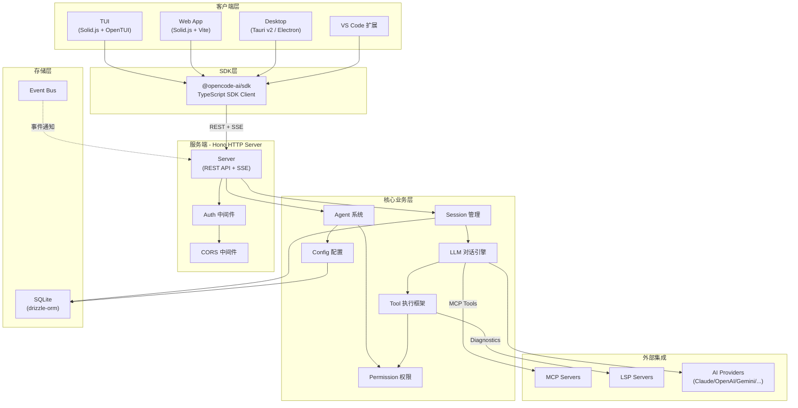
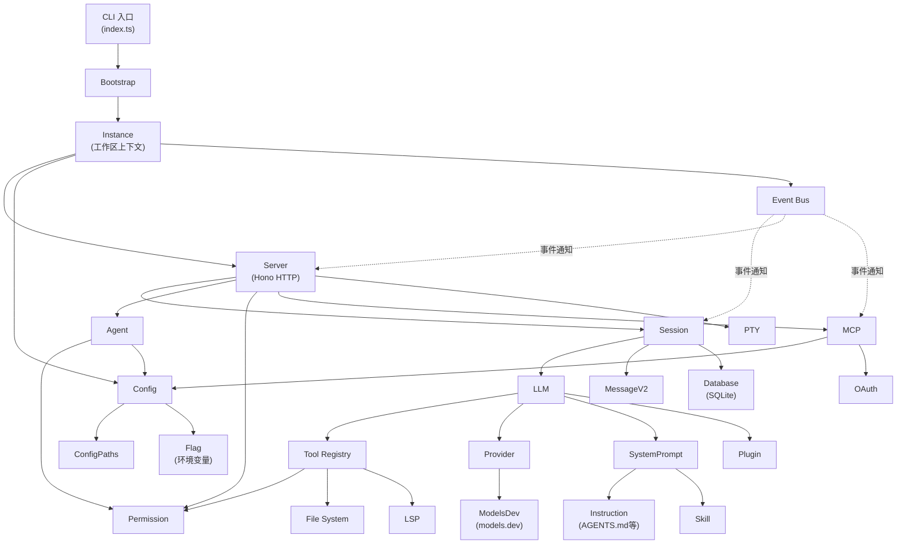
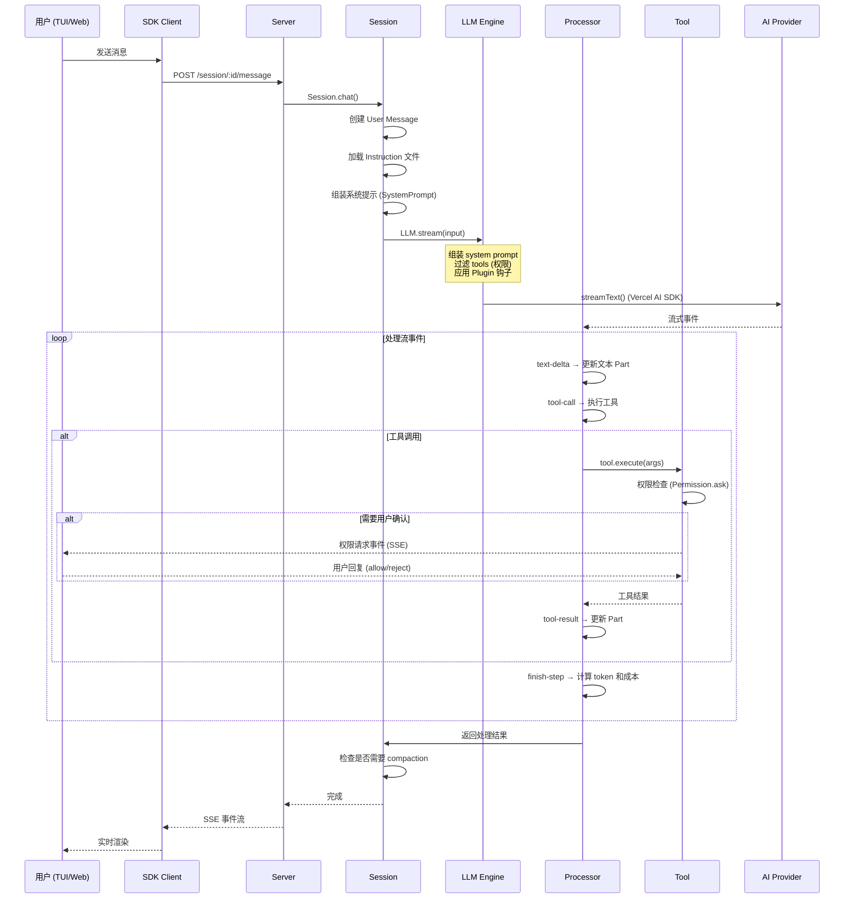
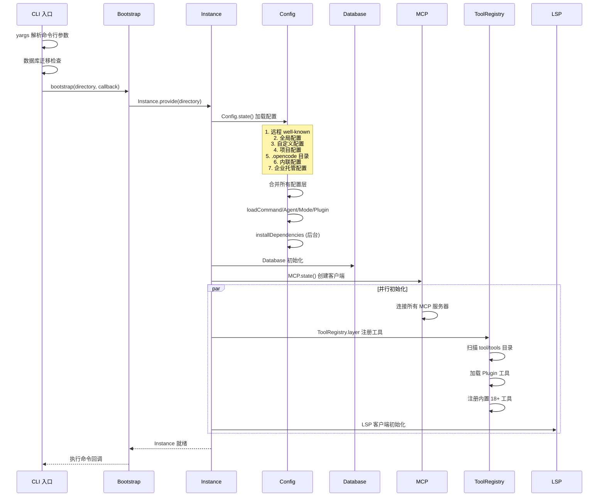

# opencode 源码学习笔记

> 仓库地址：[opencode](https://github.com/anomalyco/opencode)
> 学习日期：2026-03-22

---

> **以下为 AI 源码分析**
>
> ### 一句话概括
>
> OpenCode 是一个 100% 开源、不绑定任何 AI 供应商的终端 AI 编程助手，采用 Client/Server 架构，同时提供 TUI、Web 和桌面应用三种前端界面。
>
> ### 要点速览
>
> | 核心模块 | 职责 | 关键文件 |
> |---------|------|---------|
> | Agent | 定义 AI 代理角色、权限和行为模式 | `packages/opencode/src/agent/agent.ts` |
> | Session | 会话管理、消息存储、使用量和成本计算 | `packages/opencode/src/session/index.ts` |
> | LLM | 流式对话、多供应商适配、系统提示组装 | `packages/opencode/src/session/llm.ts` |
> | Tool | 工具注册/执行框架（bash、edit、read、grep 等） | `packages/opencode/src/tool/` |
> | Provider | 多 AI 供应商 SDK 管理和模型配置 | `packages/opencode/src/provider/provider.ts` |
> | Server | Hono HTTP 服务，对外暴露 REST + SSE API | `packages/opencode/src/server/server.ts` |
> | Permission | 分层规则引擎，控制工具执行权限 | `packages/opencode/src/permission/` |
> | Config | 多层级配置合并（全局 → 项目 → 内联 → 托管） | `packages/opencode/src/config/config.ts` |
> | MCP | Model Context Protocol 集成，支持 OAuth 认证 | `packages/opencode/src/mcp/index.ts` |
> | TUI | 基于 Solid.js + OpenTUI 的终端用户界面 | `packages/opencode/src/cli/cmd/tui/` |
> | Web App | 基于 Solid.js + Vite 的 Web 前端 | `packages/app/src/` |
> | Desktop | Tauri v2 原生桌面壳，复用 Web 前端 | `packages/desktop/` |

---

## 项目简介

OpenCode 是一个开源 AI 编程助手（类似 Claude Code），核心价值在于**供应商无关**——可以使用 Anthropic Claude、OpenAI、Google Gemini、Amazon Bedrock 或本地模型。项目采用 Client/Server 架构，后端是一个运行在本地的 Hono HTTP 服务器，前端有三种形态：TUI（终端 UI）、Web 应用和 Tauri 桌面应用。内置 LSP 支持、MCP（Model Context Protocol）集成、插件系统和完整的权限控制体系，开发者可以在终端中完成代码阅读、编辑、执行命令等全套工作流。

## 技术栈

| 类别 | 技术 |
|------|------|
| 语言 | TypeScript (全栈) |
| 框架 | Solid.js (前端)、Hono (HTTP 服务)、OpenTUI (TUI 渲染) |
| 构建工具 | Vite、Turborepo、Bun 编译器 |
| 依赖管理 | Bun (workspace monorepo) |
| 测试框架 | Bun Test、Playwright (E2E) |
| AI SDK | Vercel AI SDK (多供应商适配层) |
| 数据库 | SQLite (drizzle-orm) |
| 桌面框架 | Tauri v2 (Rust)、Electron（备选） |

## 目录结构

```
opencode/
├── packages/
│   ├── opencode/              # 核心包：CLI、Server、Agent、Session、Tool 等全部业务逻辑
│   │   ├── src/
│   │   │   ├── index.ts       # CLI 入口，yargs 命令注册
│   │   │   ├── agent/         # Agent 定义和管理
│   │   │   ├── session/       # 会话管理、LLM 对话、消息处理
│   │   │   ├── tool/          # 工具系统（bash、edit、read、grep、glob 等 20+ 工具）
│   │   │   ├── provider/      # AI 供应商 SDK 管理和模型配置
│   │   │   ├── server/        # Hono HTTP 服务器和路由
│   │   │   ├── permission/    # 权限规则引擎
│   │   │   ├── config/        # 多层配置系统
│   │   │   ├── mcp/           # MCP 协议集成
│   │   │   ├── lsp/           # LSP 客户端集成
│   │   │   ├── bus/           # 事件总线（Pub-Sub）
│   │   │   ├── cli/cmd/tui/   # TUI 界面（Solid.js + OpenTUI）
│   │   │   ├── storage/       # SQLite 数据库层
│   │   │   └── util/          # 工具函数库
│   │   └── bin/               # 可执行文件入口
│   ├── app/                   # Web 前端应用（Solid.js + Vite）
│   │   └── src/
│   │       ├── entry.tsx      # Web 入口
│   │       ├── app.tsx        # Provider 堆栈和路由
│   │       ├── pages/         # 页面组件（Home、Session、Layout）
│   │       └── context/       # 30+ 全局上下文
│   ├── desktop/               # Tauri v2 桌面应用壳
│   ├── desktop-electron/      # Electron 桌面应用壳
│   ├── ui/                    # 共享 UI 组件库
│   ├── sdk/js/                # TypeScript SDK 客户端
│   ├── plugin/                # @opencode-ai/plugin 插件接口
│   ├── web/                   # 官网（Astro）
│   ├── docs/                  # 文档站（Mintlify）
│   └── console/               # 管理控制台
├── sdks/vscode/               # VS Code 扩展
├── infra/                     # SST 基础设施配置
├── sst.config.ts              # SST 配置入口
├── turbo.json                 # Turborepo 任务配置
└── package.json               # 根 workspace 配置
```

## 架构设计

### 整体架构

OpenCode 采用 **Client/Server 分离架构**。服务端是一个本地 Hono HTTP 服务器，承载所有业务逻辑（Agent、Session、Tool、LLM 交互）；客户端通过 REST API + SSE 事件流与服务端通信。这种设计使得 TUI、Web、Desktop 三种前端可以共享同一个后端，甚至支持远程驱动（如手机上操作电脑上运行的 OpenCode）。



### 核心模块

#### 1. Agent 系统 (`packages/opencode/src/agent/agent.ts`)

**职责**：定义 AI 代理的角色、权限、模型绑定和系统提示。

**内置 Agent**：
- **build** — 默认主 Agent，拥有完整工具访问权限，用于开发工作
- **plan** — 只读 Agent，默认拒绝文件编辑，适合代码分析和规划
- **general** — 子 Agent，用于复杂搜索和多步骤任务
- **explore** — 子 Agent，专注代码探索
- **compaction** / **title** / **summary** — 内部辅助 Agent

**关键接口**：
- `Agent.Info` — Zod schema，定义 name、mode（"primary" | "subagent"）、permission、model、prompt
- `Agent.state()` — 缓存 Agent 列表，合并默认权限 + 用户配置 + 项目配置
- `Agent.generate()` — 使用 LLM 生成新 Agent 配置

#### 2. Session 系统 (`packages/opencode/src/session/`)

**职责**：管理对话生命周期、消息存储、令牌计算和成本统计。

**核心文件**：
- `index.ts` — Session CRUD、fork（分叉）、消息列表、使用量计算
- `llm.ts` — LLM 流式对话入口，系统提示组装，插件钩子集成
- `processor.ts` — 流事件状态机，处理 text/tool/reasoning 各类事件
- `system.ts` — 按模型选择优化的系统提示模板
- `instruction.ts` — 加载项目级、全局级、URL 指令文件（AGENTS.md / CLAUDE.md / CONTEXT.md）
- `compaction.ts` — 上下文压缩（当消息超出模型上下文窗口时触发）

**关键设计**：
- Session 支持 `fork()`，复制完整消息历史到新会话
- `getUsage()` 精确计算缓存令牌（Anthropic/Bedrock 特殊处理）和 Decimal 精度成本
- Doom Loop 检测：连续 3 次相同工具调用+相同输入时暂停并请求用户确认

#### 3. Tool 框架 (`packages/opencode/src/tool/`)

**职责**：定义和执行 AI 可用的工具，类似 Claude Code 的工具系统。

**内置工具（18+）**：

| 工具 | 文件 | 功能 |
|------|------|------|
| bash | `bash.ts` | 执行 Shell 命令，tree-sitter 解析 AST 做权限检查 |
| read | `read.ts` | 读取文件/目录，支持图片 base64、PDF、行范围 |
| edit | `edit.ts` | 文件编辑，9 种替换策略（精确 → 模糊匹配级联） |
| write | `write.ts` | 创建/覆盖文件 |
| glob | `glob.ts` | 文件模式匹配搜索 |
| grep | `grep.ts` | 内容搜索（regex） |
| apply_patch | `apply_patch.ts` | 应用 diff patch |
| multiedit | `multiedit.ts` | 批量文件编辑 |
| codesearch | `codesearch.ts` | 代码搜索 |
| webfetch | `webfetch.ts` | 网页内容抓取 |
| websearch | `websearch.ts` | 网络搜索 |
| lsp | `lsp.ts` | LSP 诊断查询 |
| batch | `batch.ts` | 批量工具调用 |
| question | `question.ts` | 向用户提问 |
| task | `task.ts` | 任务管理 |
| skill | `skill.ts` | 技能调用 |
| plan | `plan.ts` | Plan mode 退出 |
| todo | `todo.ts` | Todo 管理 |

**关键设计**：
- `Tool.define()` 工厂函数：自动 Zod 参数验证 + 输出截断
- `ToolRegistry` 基于 Effect 框架的 Layer 模式，支持动态注册和模型特定过滤
- Edit 工具的 9 层替换策略：SimpleReplacer → LineTrimmedReplacer → BlockAnchorReplacer（Levenshtein 距离） → WhitespaceNormalizedReplacer → IndentationFlexibleReplacer → EscapeNormalizedReplacer → MultiOccurrenceReplacer → TrimmedBoundaryReplacer → ContextAwareReplacer

#### 4. Provider 系统 (`packages/opencode/src/provider/`)

**职责**：统一管理 20+ AI 供应商的 SDK 实例、模型配置和认证。

**支持的供应商**：
Anthropic、OpenAI、Google、Google Vertex、Amazon Bedrock、Azure、OpenRouter、xAI、Mistral、Groq、DeepInfra、Cerebras、Cohere、Together AI、Perplexity、Vercel、GitLab、GitHub Copilot 等

**关键接口**：
- `Provider.Model` — 模型完整定义（capabilities、cost、limit、status）
- `Provider.getLanguage(model)` — 返回 Vercel AI SDK 的 `LanguageModelV2` 实例
- `Provider.getSmallModel()` — 按供应商获取小型模型（用于辅助任务）
- `ModelsDev.Data` — 懒加载模型数据，优先本地缓存 → 快照 → 远程 fetch（models.dev）

**设计特点**：
- SDK 实例缓存，key 基于 providerID + npm 包 + options hash
- 自定义 fetch 包装器处理超时和 SSE
- 环境变量模板替换：`${VAR_NAME}` 模式

#### 5. Server (`packages/opencode/src/server/server.ts`)

**职责**：Hono HTTP 服务器，对外暴露完整 REST API + SSE 事件流。

**中间件链**：错误处理 → Basic Auth → 日志计时 → CORS → 工作区上下文注入

**关键路由**：
- `/session` — 会话 CRUD + 消息发送
- `/agent` — Agent 列表
- `/config` — 配置读写
- `/permission` — 权限请求和回复
- `/mcp` — MCP 服务管理
- `/pty` — 伪终端管理
- `/event` — SSE 事件流

**设计特点**：
- 每个请求自动获取或创建 Instance 上下文（工作区隔离）
- 使用 `hono-openapi` 自动生成 OpenAPI 文档
- 支持 mDNS 发布，方便局域网发现

#### 6. Permission 系统 (`packages/opencode/src/permission/`)

**职责**：分层权限规则引擎，控制工具执行的安全边界。

**权限模型**：
- `Rule = { permission: string, pattern: string, action: "allow" | "deny" | "ask" }`
- 支持通配符匹配（`*`、`**`）
- 规则优先级由列表顺序决定（最后匹配的规则优先）

**执行流程**：
1. 工具请求执行 → `Permission.ask()` 评估规则
2. 规则为 "deny" → 直接拒绝
3. 规则为 "allow" → 直接通过
4. 规则为 "ask" → 发布事件，等待用户回复（once / always / reject）

#### 7. Config 系统 (`packages/opencode/src/config/config.ts`)

**职责**：多层级配置合并，支持从全局到企业的完整配置链。

**优先级（低 → 高）**：
1. 远程 `.well-known/opencode`（组织默认）
2. 全局 `~/.config/opencode/opencode.json{,c}`
3. 自定义 `OPENCODE_CONFIG` 环境变量
4. 项目 `opencode.json{,c}`
5. `.opencode/` 目录配置
6. 内联 `OPENCODE_CONFIG_CONTENT` 环境变量
7. 企业托管配置（最高优先级）

**特殊能力**：
- JSONC 格式支持（带注释的 JSON）
- `{env:VAR}` 环境变量替换和 `{file:path}` 文件内容引用
- plugin 和 instructions 数组采用连接合并而非覆盖

#### 8. MCP 集成 (`packages/opencode/src/mcp/index.ts`)

**职责**：集成 Model Context Protocol，扩展 AI 可用的工具和资源。

**支持的连接方式**：
- **Remote MCP** — StreamableHTTP → SSE 回退，支持 OAuth 2.0 认证
- **Local MCP** — StdioClientTransport，启动本地进程

**关键功能**：
- MCP Tool → AI SDK Tool 自动转换
- 完整 OAuth 流程（authorize → callback → token）
- 进程树清理：递归杀死所有子进程

#### 9. Event Bus (`packages/opencode/src/bus/`)

**职责**：解耦模块间通信的 Pub-Sub 事件系统。

**设计**：
- 实例级隔离，每个 Instance 有独立订阅集
- 支持通配符 `*` 订阅所有事件
- 通过 GlobalBus 跨实例传播
- `BusEvent.define()` 基于 Zod 的类型安全事件定义

### 模块依赖关系



## 核心流程

### 流程一：用户发送消息到 AI 回复的完整流程

这是 OpenCode 最核心的交互流程，从用户输入到 AI 流式回复、工具执行、最终输出。



**关键细节**：
1. **系统提示组装**（`llm.ts`）：优先级为 agent.prompt > SystemPrompt.provider() > input.system，并经 Plugin 钩子 `experimental.chat.system.transform` 修改
2. **工具权限过滤**（`LLM.resolveTools()`）：使用 `Permission.disabled()` 移除被禁用的工具
3. **Doom Loop 检测**（`processor.ts`）：连续 3 次相同工具+相同输入时暂停
4. **错误恢复**：`ContextOverflowError` 触发 compaction；`SessionRetry.retryable()` 判断是否指数退避重试

### 流程二：配置加载和实例初始化

每次 OpenCode 启动时的初始化流程，展示配置系统如何工作。



**关键细节**：
1. **配置合并**使用 `mergeConfigConcatArrays()`：plugin 和 instructions 数组**连接**而非覆盖
2. **JSONC 配置支持**：`{env:VAR}` 环境变量替换，`{file:path}` 文件内容引用
3. **依赖安装**：`.opencode/` 目录中的 plugin/command 依赖在后台异步安装
4. **Instance 隔离**：每个工作区（directory）有独立的 Instance 上下文，互不影响

## 关键设计亮点

### 1. 9 层级联 Edit 替换策略

**解决的问题**：LLM 生成的文件编辑指令经常存在空白、缩进、转义等微小差异，导致精确匹配失败。

**实现方式**（`packages/opencode/src/tool/edit.ts`）：
- 依次尝试 9 种替换器：精确匹配 → 行 Trim 匹配 → Block 锚点 + Levenshtein 距离 → 空白规范化 → 缩进弹性 → 转义规范化 → 多重出现 → 边界修剪 → 上下文感知
- 每种替换器从严格到宽松递进，确保在不牺牲准确性的前提下最大化成功率
- `BlockAnchorReplacer` 使用首尾行作为锚点，配合 Levenshtein 距离（阈值 0.0 ~ 0.3）进行相似度匹配

**设计意图**：AI 编程助手的核心可靠性取决于文件编辑的成功率，这种渐进式降级策略在精确性和容错性之间取得了良好平衡。

### 2. 模型感知的系统提示切换

**解决的问题**：不同 AI 模型对系统提示的理解和响应方式不同，需要针对性优化。

**实现方式**（`packages/opencode/src/session/system.ts`）：
- `SystemPrompt.provider()` 根据模型 family 选择专用提示模板
- GPT-4/O1/O3 → `PROMPT_BEAST`，GPT 系列 → `PROMPT_CODEX`，Gemini → `PROMPT_GEMINI`，Claude → `PROMPT_ANTHROPIC`
- 每个模板针对该模型系列的优势和特点进行优化

**设计意图**：供应商无关不意味着用相同方式对待所有模型，针对性的系统提示能显著提升每种模型的实际效果。

### 3. Effect 框架驱动的依赖注入和资源管理

**解决的问题**：复杂的模块间依赖和生命周期管理（尤其是数据库连接、MCP 客户端、LSP 进程等需要清理的资源）。

**实现方式**：
- 使用 `Effect` 框架的 Layer 模式进行依赖注入（`packages/opencode/src/tool/registry.ts`、`packages/opencode/src/permission/index.ts`）
- `Instance.state()` 管理实例级状态，自动在 `dispose()` 时清理
- `Database.use()` 事务化操作，`Database.effect()` 确保事务完成后才执行副作用

**设计意图**：避免全局单例和手动清理的脆弱性，通过类型系统保证资源生命周期的正确性。

### 4. Client/Server 解耦的多前端架构

**解决的问题**：需要同时支持 TUI、Web、Desktop 三种界面，且未来可能增加移动端。

**实现方式**：
- Server 端所有 API 通过 Hono 框架暴露 REST + SSE 端点
- `@opencode-ai/sdk` 提供统一的 TypeScript 客户端
- TUI（Solid.js + OpenTUI）、Web App（Solid.js + Vite）、Desktop（Tauri 壳复用 Web App）各自独立
- SSE 事件流实现实时推送，SDK 层统一处理事件批处理（16ms 防抖）

**设计意图**：真正的 Client/Server 分离允许远程操作（如手机驱动电脑上的 OpenCode），同时复用代码避免功能不一致。

### 5. 分层权限系统与 Doom Loop 防护

**解决的问题**：AI 执行工具（特别是 bash 命令和文件编辑）需要严格的安全控制，同时防止 AI 陷入无限循环。

**实现方式**：
- 权限规则引擎（`packages/opencode/src/permission/evaluate.ts`）：通配符匹配 + 规则优先级（最后匹配规则优先）
- Agent 级别默认权限 + 用户配置 + 会话级别覆盖
- Bash 工具使用 tree-sitter 解析命令 AST，检测外部目录访问（`packages/opencode/src/tool/bash.ts`）
- Doom Loop 检测（`packages/opencode/src/session/processor.ts`）：追踪连续工具调用，3 次相同调用+相同输入时暂停

**设计意图**：安全性是 AI 编程助手的底线。分层权限允许灵活配置（从"全部询问"到"全部允许"），Doom Loop 防护则是对 LLM 行为不可预测性的务实应对。
