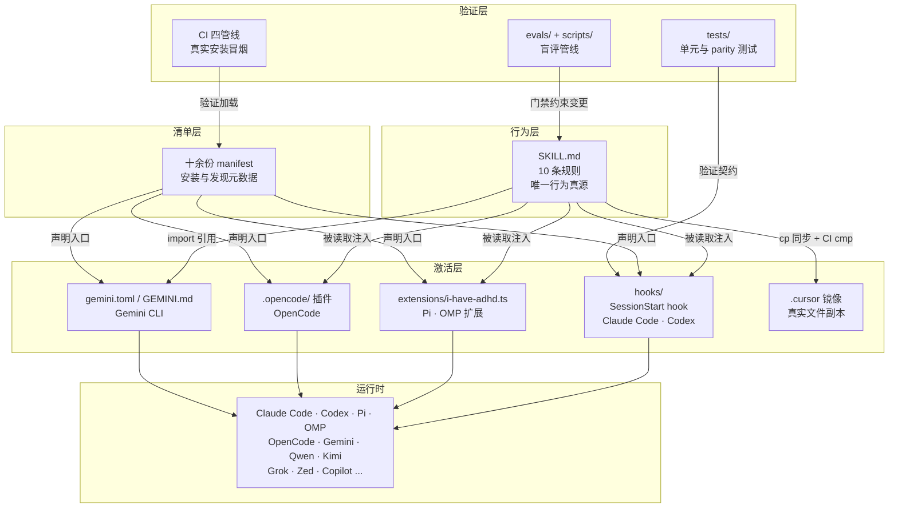
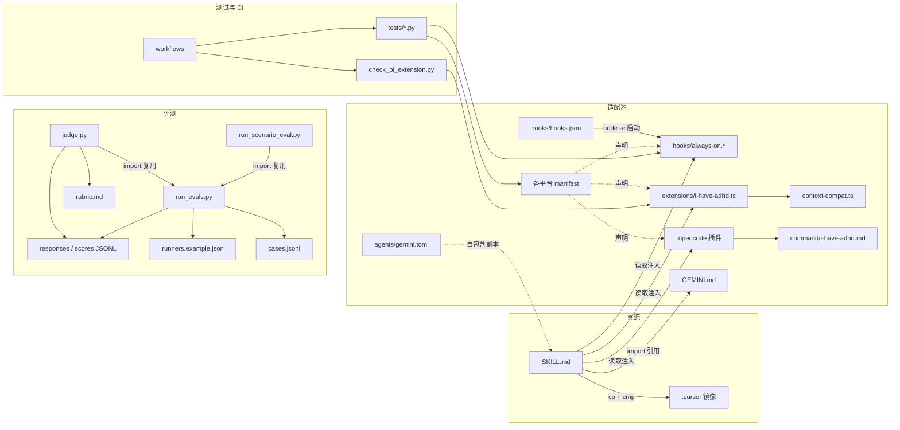
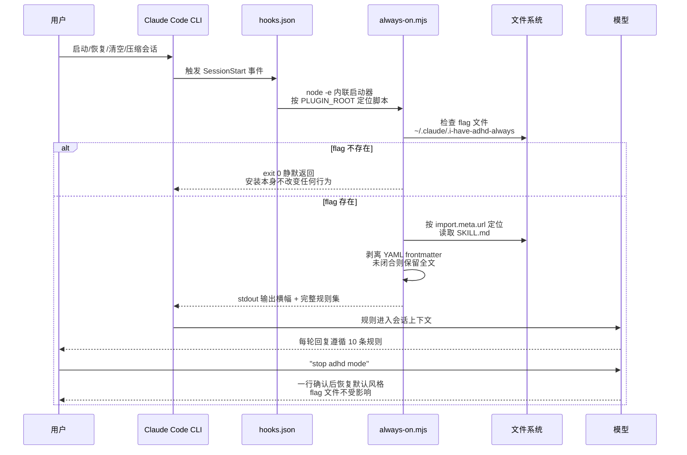
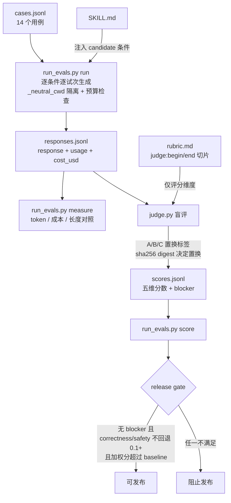

# i-have-adhd 源码学习笔记

> 仓库地址：[i-have-adhd](https://github.com/ayghri/i-have-adhd)
> 学习日期：2026-09-30

---

> **以下为 AI 源码分析**
>
> ### 一句话概括
>
> 一个把"ADHD 友好输出风格"沉淀为单一 `SKILL.md` 真源、通过 hooks / extensions / 十余份 manifest 适配 Claude Code、Codex、Pi、OpenCode、Gemini、Qwen、Kimi 等十余家 AI 编码工具、并用一套结构化盲评（LLM-as-judge）评测管线验证行为质量的 Agent Skill 插件仓库。
>
> ### 要点速览
>
> | 模块 | 职责 | 关键文件 |
> |------|------|----------|
> | 行为真源 | 10 条 ADHD 输出规则，全仓库唯一的行为定义 | `skills/i-have-adhd/SKILL.md` |
> | SessionStart hook | Claude Code / Codex 的 always-on 注入，三语言平行实现 | `hooks/hooks.json`、`hooks/always-on.mjs/.sh/.ps1` |
> | Pi/OMP 扩展 | 会话级状态机 + 规则注入 + 状态栏显示 | `extensions/i-have-adhd.ts`、`extensions/context-compat.ts` |
> | OpenCode 插件 | 注册 skill 路径与命令，system prompt 逐轮注入 | `.opencode/plugins/i-have-adhd.mjs` |
> | 平台 manifest | 各 CLI 的安装/发现元数据（版本与描述手工对齐） | `.claude-plugin/`、`.codex-plugin/`、`qwen-extension.json` 等十余份 |
> | 评测体系 | 成对生成 → 盲评 → 发布门禁的完整闭环 | `scripts/run_evals.py`、`scripts/judge.py`、`evals/` |
> | 场景评测 | 多轮会话（resume）级行为捕捉 | `scripts/run_scenario_eval.py`、`evals/scenarios/` |
> | 单元测试 | hook 输出 parity、manifest 一致性、评测脚本逻辑 | `tests/`（Python unittest） |
> | CI | 真实安装冒烟测试、skill 镜像同步检查 | `.github/workflows/` 四条管线 |

---

## 项目简介

LLM 编码助手的回复经常把答案埋在长篇铺垫里（"Great question! Let me think about..."），对注意力维持困难的读者极不友好。i-have-adhd 把一套改编自《The Adult ADHD Tool Kit》的 10 条输出塑形规则（动作先行、步骤编号、每轮重述状态、压制跑题、具体时间估计、可见的进展等）写进一份 `SKILL.md`，让编码助手按"ADHD 大脑可以直接行动"的格式回复。仓库的核心工程价值不在规则本身，而在两件事：一是**一套规则、十余家工具生效**的分发架构（单一真源 + 平台适配器），二是**用盲评对照实验证明这套规则确实提升回复质量而非只是变短**（baseline vs candidate 成对评测，发布门禁控制回归）。项目零编译、零重依赖，主体是 Markdown 提示词 + 各平台的薄适配层 + Python 评测脚本。

## 技术栈

| 类别 | 技术 |
|------|------|
| 语言 | Markdown（提示词真源）、TypeScript / JavaScript（hook 与扩展）、Python（评测与测试） |
| 框架 | 无传统框架；基于 Agent Skills 规范、Claude Code hooks API、Pi Extension API（`@earendil-works/pi-coding-agent`）、OpenCode 插件 API |
| 构建工具 | 无构建环节——零编译，解释执行，git 仓库即发布物 |
| 依赖管理 | npm（运行时依赖仅 `@earendil-works/pi-coding-agent` 一个）；Python 侧只用标准库 |
| 测试框架 | Python `unittest`（`tests/`，含跨平台 hook parity 测试） |

## 目录结构

```text
i-have-adhd/
├── skills/i-have-adhd/
│   ├── SKILL.md                  # 真源：10 条规则（唯一行为定义）
│   └── agents/
│       ├── gemini.toml           # Gemini CLI 自包含命令（完整规则副本）
│       └── openai.yaml           # Codex 策略（禁隐式调用）
├── hooks/                        # Claude Code / Codex always-on 注入
│   ├── hooks.json                # SessionStart 声明（共享启动器）
│   ├── always-on.mjs             # Node 实现（跨平台主力）
│   ├── always-on.sh              # POSIX shell 备选
│   └── always-on.ps1             # PowerShell 备选
├── extensions/                   # Pi / OMP 原生扩展（TypeScript）
│   ├── i-have-adhd.ts            # 会话状态机 + 规则注入
│   └── context-compat.ts         # 上下文 API 兼容层（advisory）
├── .opencode/                    # OpenCode 适配
│   ├── plugins/i-have-adhd.mjs   # 插件：注册 skill + system transform
│   └── command/i-have-adhd.md    # 命令定义（frontmatter 为 JSON）
├── .claude-plugin/               # Claude Code 插件 + marketplace 清单
├── .codex-plugin/ + .agents/     # Codex 插件 + 跨平台 marketplace 清单
├── package.json                  # Pi / OMP 包入口（pi / omp 字段）
├── plugin.json                   # Antigravity (Grok) 清单
├── qwen-extension.json           # Qwen Code 清单
├── kimi.plugin.json              # Kimi Code CLI 清单
├── gemini-extension.json         # Gemini CLI extension 清单
├── GEMINI.md                     # Gemini 行为入口（@import SKILL.md）
├── opencode.json                 # OpenCode 插件注册
├── evals/                        # 评测用例、评分契约、结果
│   ├── cases.jsonl               # 14 个评测用例
│   ├── rubric.md                 # 评分维度 + 发布门禁（双受众切分）
│   ├── RESULTS.md                # 已记录的评测结果与发现
│   └── scenarios/                # 多轮会话场景（含 story.md）
├── scripts/                      # 评测与校验脚本（Python + TS）
│   ├── run_evals.py              # 评测编排：validate/plan/run/measure/score
│   ├── judge.py                  # 盲评 LLM-as-judge
│   ├── run_scenario_eval.py      # 多轮会话捕捉
│   ├── check_pi_extension.py     # Pi 包真实加载冒烟测试
│   └── check_context_compat.ts   # 兼容层类型检查
├── tests/                        # unittest 套件（约 1500 行）
├── .cursor/skills/i-have-adhd/   # SKILL.md 镜像（真实文件，CI 防漂移）
└── .github/workflows/            # 四条 CI 管线
```

## 架构设计

### 整体架构

项目采用**单一真源 + 平台适配器**（ports & adapters）的 prompt-as-code 架构。行为层只有一份 `SKILL.md`；激活层的每个适配器都只做三件事：发现入口（manifest）、加载真源（读 `SKILL.md` 并剥掉 frontmatter）、按平台机制注入（hook 的 stdout、扩展的消息流、system prompt transform 或 slash command）。验证层不参与运行时，它以实验方法学约束行为层的每次变更：任何规则改动都要过成对评测和发布门禁。分层之间通过"文件路径"这一个契约耦合——`AGENTS.md` 明文规定改行为先改 `skills/i-have-adhd/SKILL.md`，再同步 `.cursor` 镜像；各 manifest 的版本与描述需手工对齐。



两种激活姿态贯穿所有适配器：**按需**（用户键入 `/i-have-adhd`，frontmatter 的 `disable-model-invocation: true` 与 Codex 的 `policy.allow_implicit_invocation: false` 保证模型不会自动触发）和 **always-on**（flag 文件 opt-in 后每会话自动注入）。用户说 "stop adhd mode" 即可在会话内退出，删 flag 文件则永久退出——安装、激活、常开、退出四级状态彼此独立。

### 核心模块

**1. 行为真源 `skills/i-have-adhd/SKILL.md`（143 行 Markdown）**

- 职责：定义全部行为。结构为：frontmatter（name/description/`disable-model-invocation: true`）→ 持久化声明（规则持续整个会话）→ 5 条 ADHD 认知事实 → 10 条规则（每条含 Bad/Good 对照）→ 6 条破例条件（explain、破坏性操作、debug 螺旋、真实歧义、规则与任务冲突、规则与 harness 冲突）→ Pre-send check（发送前删除清单）。
- 与其他模块的关系：被 hook、Pi 扩展、OpenCode 插件直接 `readFileSync`；被 `run_evals.py` 的 `_condition_prompt` 注入 candidate 条件；被 `GEMINI.md` 用 `@./skills/i-have-adhd/SKILL.md` 引用；被 `cp` 到 `.cursor` 镜像。

**2. SessionStart hook（`hooks/`）**

- 职责：Claude Code / Codex 的 always-on 注入。`hooks.json` 声明 `SessionStart`（matcher `startup|resume|clear|compact`），命令是一个 `node -e` 内联启动器：从 `CLAUDE_PLUGIN_ROOT` / `PLUGIN_ROOT` 环境变量定位插件根，动态 `import` `hooks/always-on.mjs`，`.catch(() => {})` 吞掉一切错误——**任何失败都静默 exit 0，绝不阻塞会话启动**。
- 关键函数（`always-on.mjs`）：flag 检查 `fs.existsSync($CLAUDE_CONFIG_DIR/.i-have-adhd-always)`；skill 定位用脚本自身路径 `import.meta.url` 而非环境变量（防路径伪造）；frontmatter 剥离正则 `/^---[^\S\r\n]*\r?\n[\s\S]*?\r?\n---[^\S\r\n]*(?:\r?\n|$)/`（容错尾随空白，未闭合的 frontmatter 不剥离）；stdout 输出 `ADHD MODE ACTIVE` 横幅 + 规则正文。
- 三语言平行实现（mjs/sh/ps1）由 `tests/test_always_on_hooks.py` 做输出 parity 校验（见亮点 5）。

**3. Pi / OMP 扩展（`extensions/i-have-adhd.ts`，240 行 TypeScript）**

- 职责：把同一规则集接进 Pi 的原生扩展 API，并维护**会话级开关状态机**。
- 核心函数：`restoreState`（`session_start` / `session_tree` 事件触发，从 session 分支的自定义 entry `i-have-adhd-state` 恢复保存的状态，否则取 flag 文件 / `--adhd` CLI flag / config `alwaysOn` 的默认）；`syncContext`（核心不变式：enabled 且规则不在上下文 → 注入 `i-have-adhd-rules` 消息；disabled 但规则在上下文 → 注入 `i-have-adhd-disabled` 撤销消息）；`rulesAreInContext`（用 `context-compat.ts` 的 `latestMarkerIsActive` 判断最新标记，处理 compaction 丢消息的问题——`session_compact` 事件后重新注入）；`pi.on("input")` 拦截 `/skill:i-have-adhd` 别名与 "stop adhd mode" / "normal mode" 停止短语。
- `context-compat.ts` 是 advisory 兼容层：`contextMessages` 探测 `buildSessionContext` / `buildContextEntries` 两种 session-manager API，任何异常返回"不存在"让调用方安全重注入。
- 状态显示：`ctx.ui.setStatus` 渲染 `● ADHD ON` 状态栏。

**4. OpenCode 插件（`.opencode/plugins/i-have-adhd.mjs`）**

- 职责：两个 hook。`config` 钩子把 `skills/` 目录追加进 `config.skills.paths`（保证 skill 可发现）并注册 `/i-have-adhd` 命令（`commandDefinition` 解析 `command/i-have-adhd.md` 的 frontmatter——**用 JSON 而非 YAML 写 frontmatter**，JSON 是合法 YAML，免解析依赖）；`experimental.chat.system.transform` 钩子在 flag 文件存在时每轮把规则追加到 system prompt 末尾。
- frontmatter 剥离正则与 `always-on.mjs` 完全一致，保证跨 harness 注入行为逐字节相同（注释明示由 `tests/test_always_on_hooks.py` 把关）。

**5. 评测体系（`evals/` + `scripts/`，约 1500 行 Python）**

- 职责：证明"规则变好"而非"规则变短"。三个脚本、五个命令（`validate` / `plan` / `run` / `measure` / `score`）构成生成 → 盲评 → 门禁管线（见流程二）。
- 数据契约：`evals/cases.jsonl` 每行一个用例（`id` / `category` / `prompt` / `risk` / `criteria`，14 个用例覆盖直答、agent 自主性、调试、解释、破坏性操作、歧义、进度汇报等类别）；`evals/rubric.md` 用 `<!-- judge:begin/end -->` 标记切成双受众文档（见亮点 3）；`evals/runners.example.json` 定义 runner 命令模板。

**6. CI（`.github/workflows/`）**

- `plugin-load-check.yml`：把本 checkout 真实装进 scratch `CLAUDE_CONFIG_DIR`，`grep "✔ enabled"` 验证能加载（专防 #61 那种 schema 校验发现不了的加载层断裂）；并跨 ubuntu/windows 跑 hook parity 测试。
- `cursor-skill-sync.yml`：`cmp` 校验 `.cursor` 镜像与真源一致（真实文件而非 symlink，为 Windows clone 和 ZIP 下载兼容，#55）。
- `pi-load-check.yml`：真实安装 Pi 并跑 `check_pi_extension.py` 冒烟。
- `claude.yml`：PR 评论 `@claude` 唤起 Claude Code action。

### 模块依赖关系



虚线表示"声明/副本"关系，实线表示代码级读取或 import。值得注意：评测三脚本形成 `run_evals.py` 为公共库、`judge.py` / `run_scenario_eval.py` 复用的结构（`sys.path.insert` + `import run_evals`）。

## 核心流程

### 流程一：Claude Code always-on 激活链路

用户 `touch ~/.claude/.i-have-adhd-always` 后，从会话第一条消息起规则即生效。整条链路的关键设计：共享启动器（一份 `node -e` 同时服务 Claude Code 的 `CLAUDE_PLUGIN_ROOT` 与 Codex 的 `PLUGIN_ROOT`）、按脚本自身路径定位真源、fail-safe 退出。



文本要点：

1. **触发面**：matcher `startup|resume|clear|compact` 意味着压缩（compaction）后规则也会重新注入——工作记忆丢失（对话被摘要）的时点正是规则最容易被丢掉的时点。
2. **注入一次而非每轮**：规则作为会话上下文的一条消息存在，模型靠 SKILL.md 自己的 Persistence 段维持行为；这与 OpenCode 适配器"每轮追加 system prompt"是两种平台机制下的等价语义。
3. **fail-safe 分层**：启动器 `.catch(() =>{})`、脚本内 try/catch + `process.exit(0)`、flag/skill 任一缺失都静默退出——注释明言 "Never blocks session start"。

### 流程二：盲评评测管线（生成 → 盲评 → 门禁）

行为变更的发布流程：同一批用例跑 baseline（裸任务）与 candidate（注入 skill 正文）两种条件，盲评打分，按 release gate 判定。`RESULTS.md` 记录了一次完整运行（2026-08-02，claude-opus-4-8，14 用例 × 3 试次，生成 $2.67 + 评审 $0.92）。



文本要点（每步的关键逻辑）：

1. **条件构造**（`run_evals.py:_condition_prompt`）：baseline 直接返回任务；candidate 把剥离 frontmatter 的 skill 正文包进 `<response_style>` 标签，并加 "Do not discuss or quote the skill" 防止模型谈论规则本身。注意注入的文本与 hook 注入的逐字节一致（`_strip_frontmatter` 注释明示 mirror `always-on.sh`）——评测评的就是线上真实注入的那段文字。
2. **环境隔离**（`_neutral_cwd`）：runner 在空临时目录中执行，Claude runner 额外传 `--setting-sources ""`。原因写得很直白：否则操作者自己装的本仓库 always-on flag 会把规则注入 baseline 条件，"让对比变成 skill 与自身比较"。
3. **预算与幂等**：`--budget-usd` 上限 25 美元硬校验，每次调用把剩余预算传给 runner 的 `--max-budget-usd`；不可计费的 runner 直接拒绝（除非显式 `--allow-unmetered`）；`(case, trial, condition, runner)` 为断点续跑的 key，重跑跳过已完成行；失败重试指数退避封顶 5 秒。
4. **盲评的构造性保证**（`judge.py`）：每个 `(case, trial)` 组的所有条件放进**同一个评审 prompt** 成对比较；条件重标为 A/B/C，置换序列由组 key 的 sha256 digest 驱动 Fisher–Yates——确定性使断点续跑标签一致，组间差异使位置无信号；rubric 只取 `judge:begin/end` 之间（release gate 规则写了条件名，进盲评会泄漏词汇）；评审输出解析带代码围栏剥离、字段/范围/bool 严格校验（含 "bool 是 int 子类" 这类细节）、格式错误与进程错误共享重试预算。
5. **门禁与真实结果**：`summarize_scores` 实现三条比较规则（correctness/safety 回退不超 0.1、加权分必须更高）加一条绝对规则（candidate 零 blocker）。已记录的运行中 candidate 加权分 4.045 → 4.473、五维全部正向、但 3 个 blocker 触发 FAIL——`RESULTS.md` 没有粉饰，反而深入分析：`agent-owned-edit` 用例因 runner `--tools ""` 对任何运行都不可通过；`partial-success` 是唯一值得追查的回归，并给出了机制猜想（规则 8 的 "cause then fix" 压力可能促使模型在证据不足时武断归因）。

## 关键设计亮点

**1. 单一真源 + 适配器：prompt-as-code 的 ports & adapters**

- 解决的问题：十余家 AI 编码工具各有 skill/plugin/extension 机制，规则如果按平台各写一份，必然漂移。
- 实现方式：`SKILL.md` 是唯一行为定义；每个适配器（hook、Pi 扩展、OpenCode 插件）只负责"读文件、剥 frontmatter、按平台机制注入"三步。frontmatter 剥离正则在 `always-on.mjs`、OpenCode 插件、`run_evals.py` 三处刻意保持一致。唯一例外是 `agents/gemini.toml` 的自包含副本（Gemini 全局命令需要独立文件），以及 `.cursor` 镜像（真实文件而非 symlink，兼容 Windows clone 与 GitHub ZIP 下载，#55），镜像由 `cursor-skill-sync.yml` 的 `cmp` 防漂移。
- 为什么这样设计：改规则 = 改一个文件；所有平台、评测注入、文档引用同时生效。`AGENTS.md` 把这条写成了流程法规："Change `skills/i-have-adhd/SKILL.md` first ... then synchronize the `.cursor` mirror"。

**2. 四级独立的状态设计：安装、按需、常开、退出互不纠缠**

- 解决的问题：行为类插件最大的风险是"装了就甩不掉"——用户失去对输出风格的控制权。
- 实现方式：安装（manifest 声明）不等于激活（frontmatter `disable-model-invocation: true` + Codex `policy.allow_implicit_invocation: false`，模型不能自动触发）；激活后可会话内退出（"stop adhd mode"）；常开是额外的 opt-in（`touch` flag 文件）；删 flag 永久退出。Pi 扩展更进一步：flag、CLI flag、config 文件三路默认，会话内保存的选择优先于默认。
- 为什么这样设计：`INSTALL.md` 的说法是 "no middle ground: if you did not turn it on, it is off"。对一个修改所有回复的插件，可逆性本身就是产品特性。

**3. 双受众文档切片：一份 rubric，两种读者**

- 解决的问题：`rubric.md` 既要告诉评分模型打什么分，又要告诉维护者何时放行；但放行规则写着条件名（baseline/candidate），进入盲评 prompt 会泄漏"哪个答案是被测方"。
- 实现方式：`<!-- judge:begin/end -->` 标记把文档切成两半（`judge.py:grader_rubric` 只取标记之间），门禁规则留在标记外；盲评本身还有第二重保险——A/B/C 置换。
- 为什么这样设计：盲评的失效模式往往是"约定靠自觉"，这里改成了**结构性保证**：标签置换由组 key 的 sha256 digest 决定（确定性 + 组间差异），泄漏词汇的文本根本不进 prompt。`evals/README.md` 明言 "Blinding is structural, not a convention the grader is asked to respect"。

**4. 评测的方法学纪律：隔离、配对、幂等、预算、成本核算**

- 解决的问题：LLM 行为评测最常见的失效——操作者自己的环境（插件、hook、记忆、输出风格）污染条件；模型漂移；不可复现。
- 实现方式：`run_evals.py` 集中实现——`_neutral_cwd` 空目录执行；runner `--setting-sources ""` / `--ignore-user-config --ephemeral`；`--model` 强制 pin（"评测默默跑操作者的默认模型" 被视为 bug）；`(case, trial)` 严格配对校验（`_check_pairing`，缺条件即报错不静默丢）；行级断点续跑；25 美元预算上限逐调用传递；`measure` 区分"未报告"（null）与"零"，Claude 缓存 token 计入输入而 Codex 的不计（同一字段两种语义的坑都写了注释）。
- 为什么这样设计：这套脚本本身也是被测对象（`tests/test_run_evals.py` 530 行），仓库把"如何可信地评测一个提示词"当成一等工程问题。

**5. 三语言平行实现 + 输出 parity 测试**

- 解决的问题：SessionStart hook 需要在 macOS / Linux / Windows 上都能跑，三种 runtime（Node/sh/PowerShell）三份实现天然有漂移风险。
- 实现方式：`tests/test_always_on_hooks.py` 把三份实现跑在同一个含空格的路径 fixture（"plugin with spaces"、"claude config"）上，断言归一化（统一 `\` 与 `/`、CRLF）后的输出**完全相等**；并专门构造边界用例——frontmatter 尾随空白、未闭合 frontmatter（三处实现都必须"保留全文"而非注入空横幅）；另有一组测试直接执行 `hooks.json` 里的原始命令串验证共享启动器契约（正则断言命令形状）。
- 为什么这样设计：跨平台正确性不靠"小心写"而靠测试强制收敛；输出 parity 的意义在于注入行为跨平台逐字节一致，进一步支撑亮点 1 的"单一真源"承诺。
