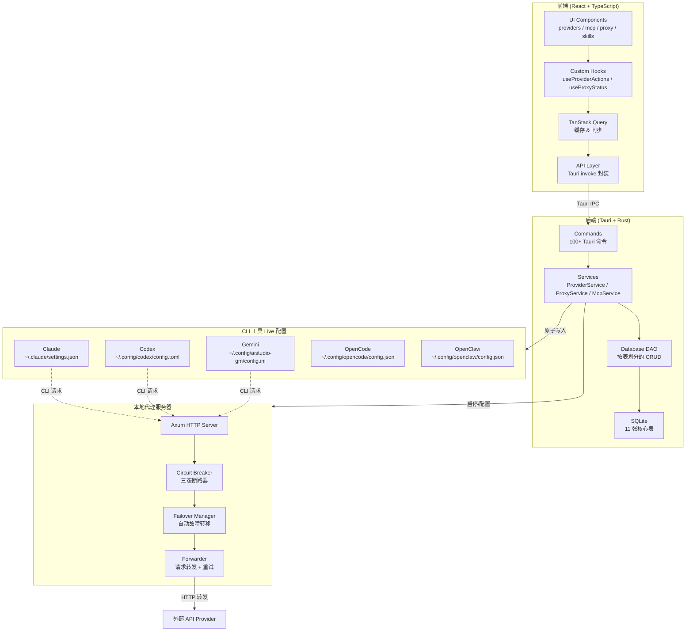
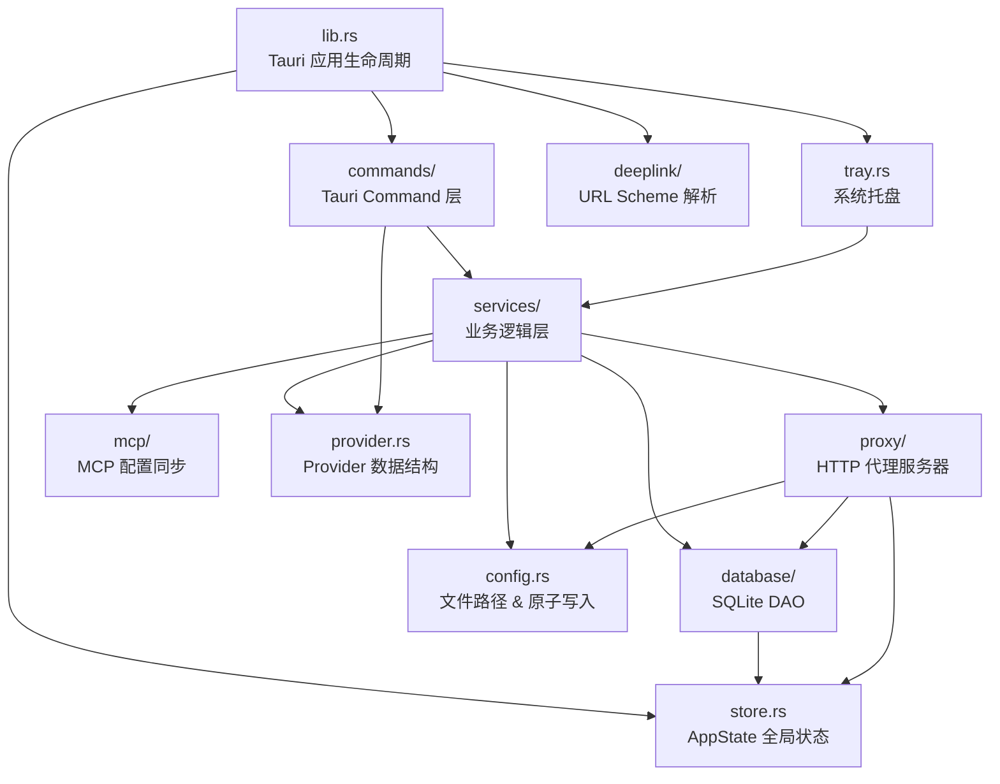
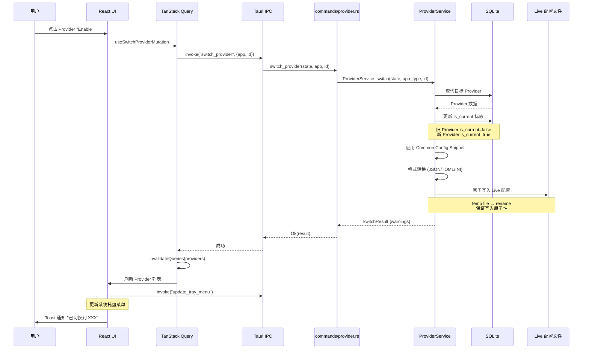
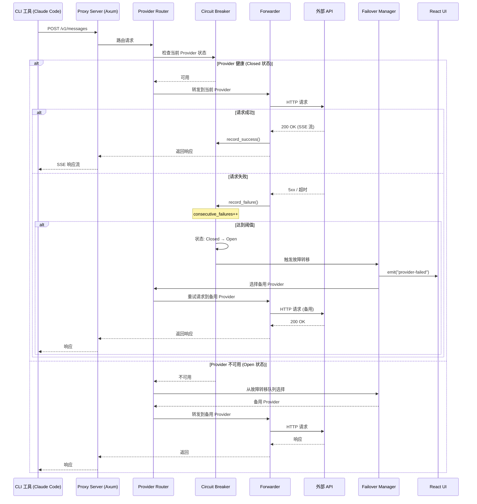
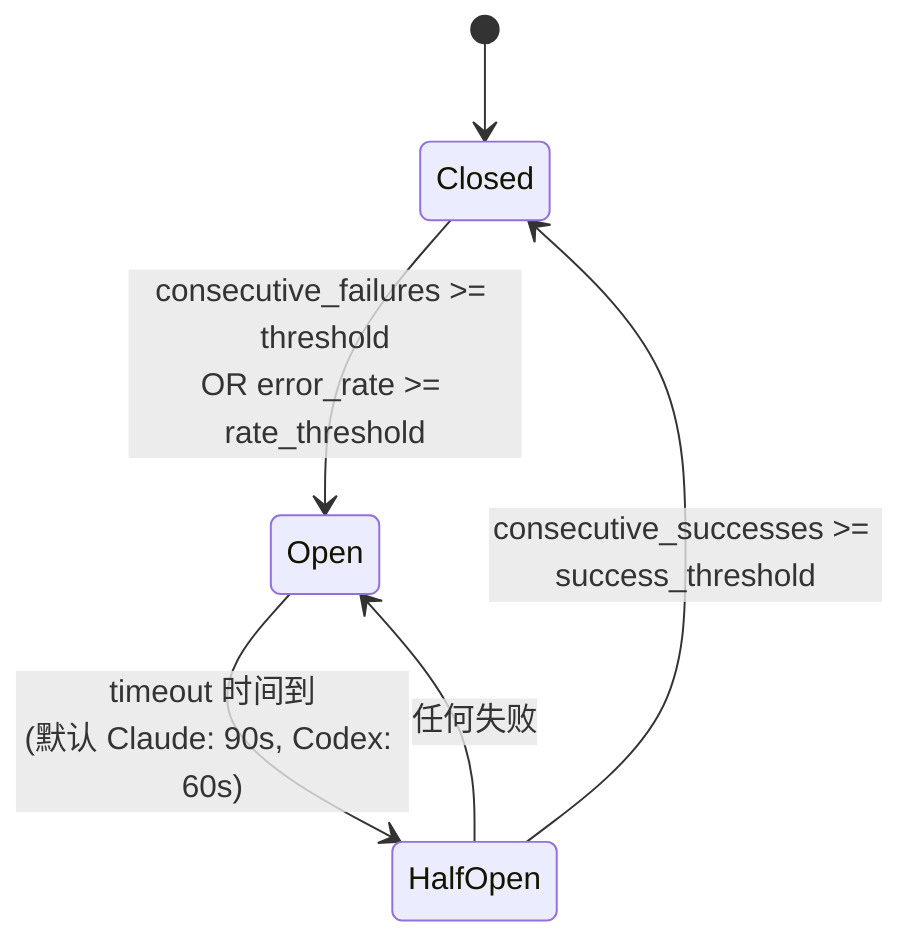

# cc-switch 源码学习笔记

> 仓库地址：[cc-switch](https://github.com/farion1231/cc-switch)
> 学习日期：2026-04-05

---

> **以下为 AI 源码分析**
>
> ### 一句话概括
>
> CC Switch 是一个基于 Tauri 2 + React 的跨平台桌面应用，为 Claude Code、Codex、Gemini CLI、OpenCode、OpenClaw 五款 AI 编程 CLI 工具提供统一的 Provider 管理、一键切换、本地代理/故障转移、MCP/Prompts/Skills 管理等功能。
>
> ### 要点速览
>
> | 核心模块 | 职责 | 关键文件 |
> |---------|------|---------|
> | ProviderService | Provider CRUD、切换、Live 配置同步 | `src-tauri/src/services/provider/mod.rs` |
> | Proxy Server | 本地 HTTP 代理、请求转发、故障转移 | `src-tauri/src/proxy/server.rs`, `handlers.rs` |
> | Circuit Breaker | 三态断路器、自动健康检测 | `src-tauri/src/proxy/circuit_breaker.rs` |
> | Database (SQLite) | 数据持久化、Schema 迁移 | `src-tauri/src/database/schema.rs`, `migration.rs` |
> | MCP/Skills/Prompts | 跨应用统一管理、双向同步 | `src-tauri/src/services/mcp.rs`, `skill.rs`, `prompt.rs` |
> | React Frontend | 多应用 UI、TanStack Query 缓存 | `src/App.tsx`, `src/lib/api/`, `src/hooks/` |
> | Tray Menu | 系统托盘快速切换 Provider | `src-tauri/src/tray.rs` |
> | Deep Link | `ccswitch://` URL Scheme 导入 | `src-tauri/src/deeplink/` |

---

## 项目简介

现代 AI 辅助编程依赖 Claude Code、Codex、Gemini CLI、OpenCode、OpenClaw 等 CLI 工具，但每个工具都有独立的配置格式（JSON / TOML / INI）。切换 API Provider 需要手动编辑配置文件，且没有统一的方式管理 MCP Server 和 Skills。

CC Switch 提供一个桌面 GUI 来统一管理这五款工具：50+ 内置 Provider 预设、一键导入切换、本地代理与自动故障转移、统一 MCP/Prompts/Skills 面板、系统托盘快捷切换、WebDAV 云同步——所有数据以 SQLite 作为单一数据源（SSOT），通过原子写入保证配置文件不被损坏。

## 技术栈

| 类别 | 技术 |
|------|------|
| 语言 | TypeScript (前端) + Rust (后端) |
| 框架 | React 18 + Tauri 2.8 |
| 构建工具 | Vite 7 + Cargo (Tauri Build) |
| 依赖管理 | pnpm (前端) + Cargo (Rust) |
| 测试框架 | vitest + MSW + @testing-library/react (前端), cargo test (后端) |
| UI 库 | shadcn/ui + TailwindCSS 3.4 + Radix UI + Framer Motion |
| 数据层 | TanStack Query v5 (前端缓存) + rusqlite / SQLite (后端持久化) |
| 网络 | axum + hyper + tokio (代理服务器), reqwest (HTTP 客户端) |
| 国际化 | react-i18next (zh/en/ja) |

## 目录结构

```
cc-switch/
├── src/                          # 前端 (React + TypeScript)
│   ├── App.tsx                   # 主应用入口，视图路由管理
│   ├── components/
│   │   ├── providers/            # Provider 管理 (ProviderList, AddDialog, EditDialog, Card)
│   │   ├── proxy/                # 代理模式面板 (ProxyToggle, FailoverToggle, CircuitBreaker)
│   │   ├── mcp/                  # MCP Server 统一管理面板
│   │   ├── prompts/              # Prompt 管理 (Markdown 编辑器, 跨应用同步)
│   │   ├── skills/               # Skills 管理 (仓库浏览, 一键安装)
│   │   ├── sessions/             # 会话历史浏览器
│   │   ├── settings/             # 设置页 (主题/备份/目录/WebDAV/代理)
│   │   ├── usage/                # 用量统计面板 (趋势图, 请求日志)
│   │   ├── universal/            # Universal Provider (多应用共享)
│   │   ├── deeplink/             # Deep Link 导入确认对话框
│   │   ├── workspace/            # OpenClaw 工作区文件编辑器
│   │   └── ui/                   # shadcn/ui 基础组件库
│   ├── hooks/                    # 业务逻辑 Hooks
│   │   ├── useProviderActions.ts # Provider 切换/增删改核心逻辑
│   │   ├── useProxyStatus.ts     # 代理状态轮询 & 操作
│   │   ├── useMcp.ts             # MCP CRUD 操作
│   │   ├── useSettings.ts        # 设置管理 (含目录、语言、启动项)
│   │   └── useDragSort.ts        # 拖拽排序 (@dnd-kit)
│   ├── lib/
│   │   ├── api/                  # Tauri IPC 封装 (providers, mcp, proxy, settings, skills...)
│   │   └── query/                # TanStack Query 配置 (queryKeys, hooks, mutations)
│   ├── config/                   # Provider 预设 (claudePresets, codexPresets, geminiPresets...)
│   ├── types/                    # TypeScript 类型定义
│   └── i18n/                     # 国际化 (zh.json, en.json, ja.json)
├── src-tauri/                    # 后端 (Rust + Tauri)
│   └── src/
│       ├── lib.rs                # Tauri 应用入口, 插件注册, 命令注册 (100+ commands)
│       ├── main.rs               # 程序入口
│       ├── commands/             # Tauri Command 层 (按领域分文件)
│       │   ├── provider.rs       # Provider CRUD 命令
│       │   ├── proxy.rs          # 代理启停命令
│       │   ├── mcp.rs            # MCP 管理命令
│       │   ├── failover.rs       # 故障转移队列命令
│       │   └── ...               # (30+ 命令文件)
│       ├── services/             # 业务逻辑层
│       │   ├── provider/         # ProviderService (CRUD, 切换, Live 同步)
│       │   ├── mcp.rs            # McpService (跨应用 MCP 同步)
│       │   ├── proxy.rs          # ProxyService (代理生命周期管理)
│       │   ├── skill.rs          # SkillService (技能安装/卸载/SSOT)
│       │   └── webdav_sync.rs    # WebDAV 云同步
│       ├── database/             # SQLite 数据层
│       │   ├── schema.rs         # 11 张核心表定义
│       │   ├── migration.rs      # JSON → SQLite 迁移
│       │   └── dao/              # 按表划分的 DAO 层
│       ├── proxy/                # HTTP 代理服务器实现
│       │   ├── server.rs         # TCP 监听 + Axum Router
│       │   ├── handlers.rs       # 请求处理 (Claude /v1/messages, OpenAI /v1/chat/completions)
│       │   ├── circuit_breaker.rs# 断路器 (Closed → Open → HalfOpen)
│       │   ├── failover_switch.rs# 自动故障转移切换
│       │   ├── forwarder.rs      # 请求转发 + 重试
│       │   └── providers/        # 格式适配器 (Anthropic ↔ OpenAI)
│       ├── deeplink/             # ccswitch:// URL 解析与导入
│       ├── mcp/                  # MCP 配置同步 (claude, codex, gemini, opencode)
│       ├── config.rs             # 配置文件路径管理 + 原子写入
│       ├── provider.rs           # Provider 数据结构定义
│       ├── tray.rs               # 系统托盘菜单构建
│       └── store.rs              # AppState 全局共享状态
├── tests/                        # 前端测试 (vitest + MSW)
└── flatpak/                      # Flatpak 打包配置
```

## 架构设计

### 整体架构

CC Switch 采用 **Tauri 2 分层架构**，前端 React 负责 UI 和交互，后端 Rust 处理所有数据持久化、文件 I/O 和网络代理。两者通过 Tauri IPC（命令 + 事件）通信。

核心设计原则：
- **SSOT（单一数据源）**：SQLite 数据库是所有数据的权威来源，CLI 工具的 Live 配置文件只是数据库的镜像
- **原子写入**：所有文件写入使用 temp file + rename 模式，防止崩溃导致配置损坏
- **最小侵入**：即使卸载 CC Switch，CLI 工具仍可正常使用（Live 配置保持有效状态）
- **双向同步**：切换 Provider 时写入 Live 配置；编辑当前 Provider 时从 Live 配置回填



### 核心模块

#### 1. Provider 管理模块

**职责**：管理五款 CLI 工具的 API Provider 配置，包括 CRUD、切换、Live 配置同步、Common Config 模板。

**核心文件**：
- `src-tauri/src/services/provider/mod.rs`（2495 行）— 业务逻辑核心
- `src-tauri/src/services/provider/live.rs` — Live 配置读写、净化、同步
- `src-tauri/src/provider.rs` — `Provider` / `ProviderMeta` 数据结构
- `src-tauri/src/commands/provider.rs` — Tauri 命令暴露
- `src/hooks/useProviderActions.ts` — 前端 Provider 操作 Hook

**关键接口**：
- `ProviderService::switch(state, app_type, id)` — 切换 Provider 并同步到 Live 配置
- `ProviderService::add(state, app_type, id, provider)` — 添加 Provider
- `ProviderService::extract_common_config_snippet()` — 提取 Common Config 模板
- `ProviderService::apply_common_config_snippet()` — 应用模板到新 Provider

**设计要点**：`Provider` 的 `settings_config` 字段是灵活的 JSON，每种 CLI 工具的配置格式不同（Claude 用 JSON、Codex 用 TOML、Gemini 用 INI），ProviderService 内部处理格式转换。`meta` 字段只存在数据库中，不会写入 Live 配置。

#### 2. 本地代理模块

**职责**：在本地启动 HTTP 代理服务器，拦截 CLI 工具的 API 请求，实现 Provider 热切换、自动故障转移、格式转换、用量统计。

**核心文件**：
- `src-tauri/src/proxy/server.rs` — TCP 监听 + Axum Router
- `src-tauri/src/proxy/handlers.rs` — 请求处理（Claude `/v1/messages`、OpenAI `/v1/chat/completions`）
- `src-tauri/src/proxy/circuit_breaker.rs` — 三态断路器
- `src-tauri/src/proxy/failover_switch.rs` — 自动故障转移切换器
- `src-tauri/src/proxy/forwarder.rs` — 请求转发 + 重试逻辑
- `src-tauri/src/proxy/provider_router.rs` — 根据断路器状态路由请求到可用 Provider
- `src-tauri/src/proxy/providers/adapter.rs` — Anthropic ↔ OpenAI 格式适配
- `src-tauri/src/proxy/usage/` — Token 用量采集与计费

**关键数据结构**：
- `ProxyServer` — 代理服务器实例（config + state + shutdown channel）
- `ProxyState` — 共享状态（DB、当前 Provider 映射、Router、FailoverManager）
- `CircuitBreaker` — 三态断路器（Closed → Open → HalfOpen），使用 `AtomicU32` 无锁计数

#### 3. 数据库模块

**职责**：SQLite 持久化，提供 11 张核心表和按表划分的 DAO 层。

**核心文件**：
- `src-tauri/src/database/schema.rs` — DDL 定义
- `src-tauri/src/database/migration.rs` — JSON → SQLite 迁移
- `src-tauri/src/database/dao/` — 按表的 CRUD（providers, mcp, prompts, skills, proxy, failover...）

**核心表**：

| 表名 | 主键 | 用途 |
|------|------|------|
| `providers` | (id, app_type) | Provider 配置 |
| `provider_endpoints` | (provider_id, app_type, url) | 自定义 Endpoint |
| `mcp_servers` | id | MCP Server 配置 + 每应用启用标志 |
| `prompts` | (id, app_type) | 系统 Prompt |
| `skills` | id | 技能配置 + 每应用启用标志 |
| `proxy_config` | app_type | 每应用代理配置（端口、超时、断路器参数） |
| `provider_health` | (provider_id, app_type) | Provider 健康状态跟踪 |
| `proxy_request_logs` | request_id | 请求遥测（Token 数、延迟、费用） |
| `model_pricing` | model_id | 模型费率配置 |
| `settings` | key | Key-Value 设置存储 |

#### 4. MCP/Prompts/Skills 管理模块

**职责**：统一管理 MCP Server、系统 Prompt、Skills 扩展，支持跨应用双向同步。

**核心文件**：
- `src-tauri/src/services/mcp.rs` — MCP 业务逻辑
- `src-tauri/src/mcp/` — 每应用的 MCP 配置读写（claude.rs, codex.rs, gemini.rs, opencode.rs）
- `src-tauri/src/services/prompt.rs` — Prompt 管理
- `src-tauri/src/services/skill.rs` — Skill 安装/卸载/SSOT 迁移

**设计要点**：MCP Server 在数据库中统一存储，每条记录有 `enabled_claude`/`enabled_codex`/`enabled_gemini`/`enabled_opencode` 四个布尔标志，实现"一处管理、按需同步"。Skills 使用 SSOT 模式，安装目录为 `~/.cc-switch/skills/`，通过 symlink 链接到各应用的 Skills 目录。

#### 5. 前端 UI 层

**职责**：React SPA，多视图切换，TanStack Query 缓存与同步。

**核心文件**：
- `src/App.tsx`（1354 行）— 主视图路由、事件监听、键盘快捷键
- `src/lib/api/` — Tauri IPC 封装（providers, mcp, proxy, settings, skills...）
- `src/lib/query/` — TanStack Query 配置（queryKey、Hooks、Mutations）
- `src/hooks/` — 业务逻辑 Hooks（useProviderActions, useProxyStatus, useMcp...）

**视图结构**：`App.tsx` 通过 `currentView` state 实现视图路由，支持 12 种视图。`activeApp` 控制当前操作哪款 CLI 工具。Provider 列表支持 @dnd-kit 拖拽排序。代理状态使用 5 秒轮询。

### 模块依赖关系



## 核心流程

### 流程一：Provider 切换

用户在 UI 上点击"Enable"切换 Provider 时的完整调用链：



**关键逻辑说明**：
1. **格式适配**：Claude 的 `settings.json` 是 JSON，Codex 的 `config.toml` 是 TOML，ProviderService 内部处理格式转换
2. **Common Config**：切换时自动应用用户保存的通用配置片段（如 MCP 设置、模型映射等），避免每次切换丢失公共配置
3. **原子写入**：先写临时文件再 rename，即使崩溃也不会产生半写入状态
4. **托盘更新**：切换成功后前端主动调用 `update_tray_menu` 刷新系统托盘快捷切换菜单

### 流程二：代理请求转发与自动故障转移

当启用代理模式后，CLI 工具的 API 请求经过本地代理被路由、转发、并在失败时自动切换到备用 Provider：



**断路器三态转换**：



**关键逻辑说明**：
1. **Live Config Takeover**：代理启动时，将 CLI 工具的 Live 配置中的 API 地址改写为本地代理地址，CLI 不感知代理存在
2. **无锁计数**：断路器使用 `AtomicU32` 进行失败/成功计数，避免锁竞争
3. **HalfOpen 限流**：半开状态只允许 1 个并发探测请求，防止雪崩
4. **用量采集**：每次请求的 Token 数、延迟、费用异步记录到 `proxy_request_logs` 表

## 关键设计亮点

### 1. SSOT（单一数据源）+ Live 配置镜像

**解决的问题**：五款 CLI 工具各有独立配置文件，格式不同，容易出现数据不一致。

**实现方式**：
- SQLite 数据库（`~/.cc-switch/cc-switch.db`）是唯一权威数据源
- CLI 工具的 Live 配置文件（`settings.json`、`config.toml`、`config.ini`）只是数据库的只读镜像
- 切换 Provider 时，`ProviderService::switch()` 先更新数据库再通过 `live.rs` 写入 Live 配置
- 编辑当前活跃 Provider 时，从 Live 配置回填（backfill）最新状态到数据库

**为什么这样设计**：消除多配置文件之间的同步问题，确保即使 Live 配置被外部修改也能恢复到正确状态。同时遵循"最小侵入"原则——卸载 CC Switch 后 Live 配置仍然有效。

### 2. 原子文件写入

**解决的问题**：应用崩溃或意外退出可能导致配置文件半写入，使 CLI 工具无法启动。

**实现方式**（`config.rs` 中的 `atomic_write`）：
1. 写入临时文件 `{filename}.tmp.{纳秒时间戳}`
2. 保留原文件权限（Unix）
3. 调用 `rename` 原子替换
4. 在 Windows 上处理 rename 边缘情况

**为什么这样设计**：文件系统的 rename 操作是原子的（同一文件系统内），保证任何时刻 Live 配置文件要么是旧状态要么是新状态，不会出现中间态。

### 3. 断路器 + 自动故障转移

**解决的问题**：API Provider 可能临时不可用，手动切换 Provider 效率低，且用户可能在长时间请求中才发现故障。

**实现方式**（`circuit_breaker.rs` + `failover_switch.rs` + `provider_router.rs`）：
- 三态断路器（Closed → Open → HalfOpen）跟踪每个 Provider 的健康状态
- 使用 `AtomicU32` 无锁计数器避免高并发下的锁竞争
- 故障转移队列由用户配置优先级顺序
- Open 状态后自动路由到队列中下一个可用 Provider
- HalfOpen 状态只允许 1 个并发探测请求，成功后恢复

**为什么这样设计**：借鉴微服务领域的断路器模式，在 AI API 场景中实现透明的故障转移。用户无需干预，代理自动在多个 Provider 间切换，保证 CLI 工具始终可用。

### 4. 代理模式的 Live Config Takeover

**解决的问题**：CLI 工具不支持代理配置，无法直接拦截其 API 请求。

**实现方式**（`services/proxy.rs` + `proxy/server.rs`）：
1. 代理启动时，备份当前 Live 配置到数据库 `proxy_live_backup` 表
2. 改写 Live 配置中的 API 地址为本地代理地址（如 `http://127.0.0.1:19876`）
3. CLI 工具"认为"自己在请求真实 API，实际上请求到了本地代理
4. 代理根据 Provider Router 选择真实的 API Provider 转发请求
5. 代理停止时，从备份恢复原始 Live 配置
6. **崩溃恢复**：应用重启时检查 `proxy_live_backup` 表，如发现未恢复的备份则自动恢复

**为什么这样设计**：在不修改 CLI 工具代码的前提下实现请求拦截，是一种经典的"透明代理"策略。配合备份/恢复机制，即使代理异常退出也能保证 Live 配置的正确性。

### 5. 多格式配置适配器

**解决的问题**：Claude 用 JSON、Codex 用 TOML、Gemini 用 INI、OpenCode/OpenClaw 用 JSON，格式各异。

**实现方式**（`services/provider/live.rs` + `codex_config.rs` + `gemini_config.rs`）：
- `ProviderService` 内部根据 `AppType` 分发到不同的序列化/反序列化逻辑
- Claude/OpenCode/OpenClaw：直接 JSON 操作
- Codex：使用 `toml` / `toml_edit` crate 读写 TOML，保留注释和格式
- Gemini：自定义 INI 解析器处理 `config.ini`
- 代理中的格式转换：Anthropic 格式 ↔ OpenAI Chat/Responses 格式通过 `proxy/providers/adapter.rs` 实现

**为什么这样设计**：将格式差异封装在 Service 层内部，上层（Commands、前端）只需处理统一的 `Provider` 数据结构，降低复杂度。对于代理场景，格式适配器使得任何 Provider 都能为任何 CLI 工具服务（如用 OpenAI 兼容的 Provider 服务 Claude Code）。
