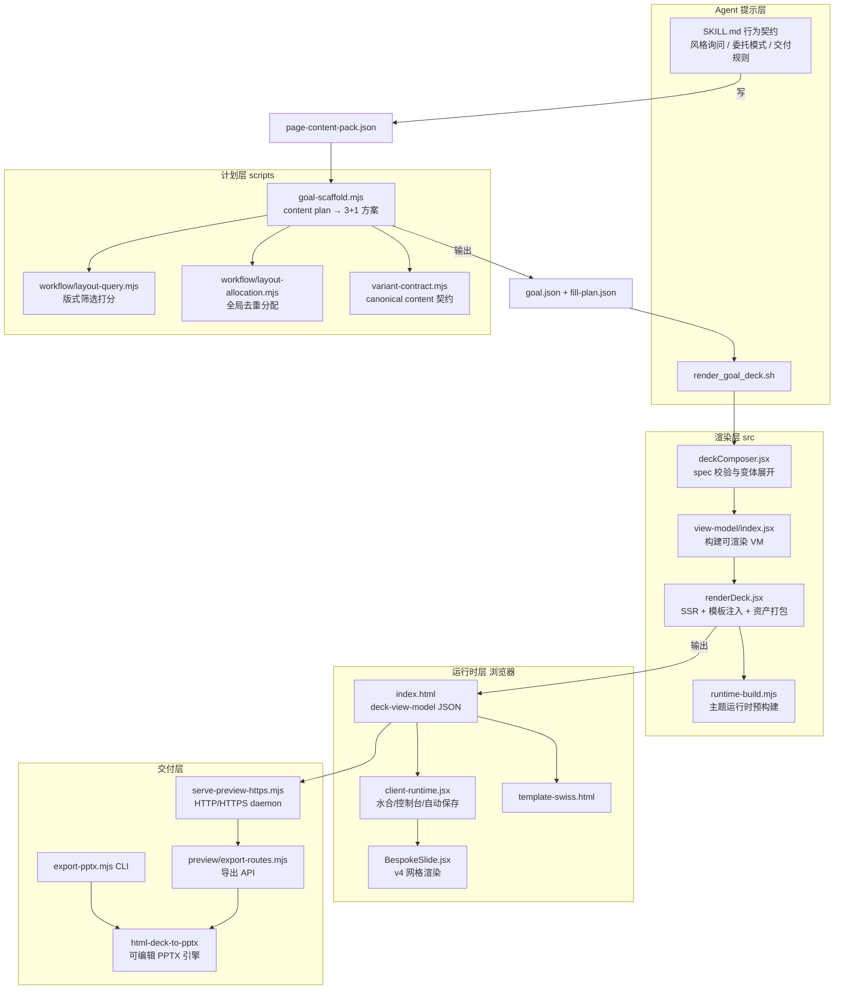
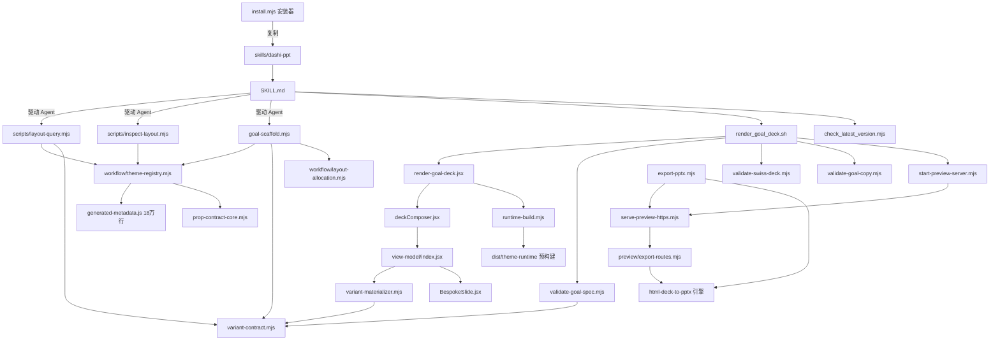
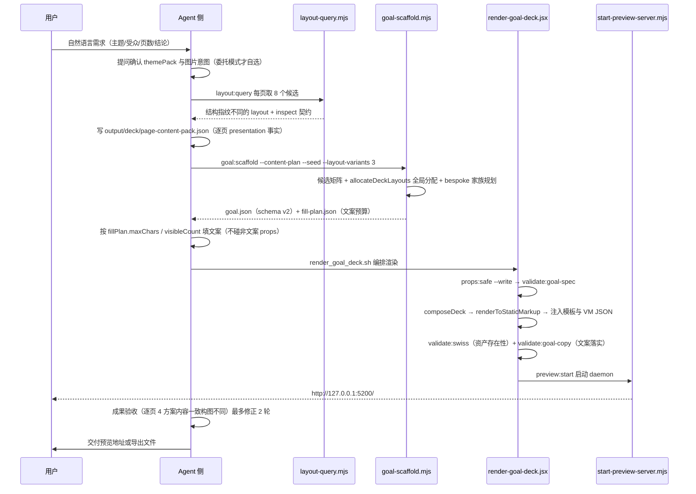
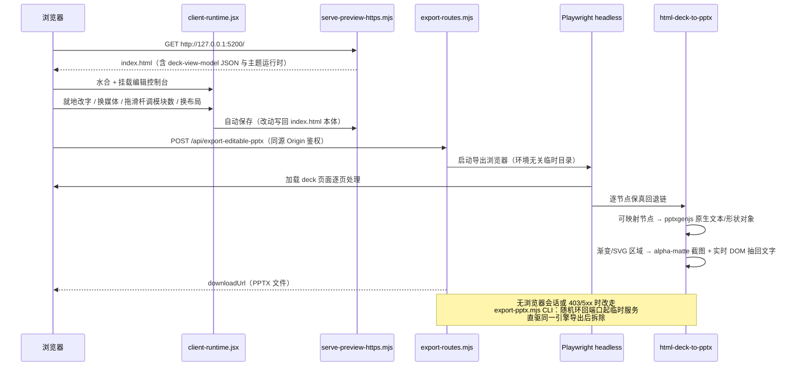

# dashi-ppt-skill 源码学习笔记

> 仓库地址：[dashi-ppt-skill](https://github.com/chuspeeism/dashi-ppt-skill)
> 学习日期：2026-09-30

---

> **以下为 AI 源码分析**
>
> ### 一句话概括
>
> 一个面向 AI Agent 的 PPT 生成 Skill：把自然语言需求整理成结构化 JSON 计划，由内置 Node.js 生成器从 12 套主题、1020 个版式中为每个逻辑页选出"3 个模板方案 + 1 个 Agent 定制方案"，React SSR 渲染成可离线打开、可在浏览器就地编辑、可导出可编辑 PPTX 的 HTML 演示文稿。
>
> ### 要点速览
>
> | 模块 | 职责 | 关键文件 |
> |------|------|----------|
> | Skill 入口层 | Agent 行为契约、渲染编排、版本检查 | `skills/dashi-ppt/SKILL.md`、`scripts/render_goal_deck.sh`、`scripts/check_latest_version.mjs` |
> | 计划层 | PageContentPack → goal.json（schema v2 的 3+1 方案） | `project/scripts/goal-scaffold.mjs`、`project/scripts/workflow/*` |
> | 数据契约层 | canonical content 校验、bespoke composition DSL、版式契约 | `project/src/variant-contract.mjs`、`project/src/prop-contract-core.mjs`、`project/layout-manifest.json` |
> | 渲染层 | React SSR 输出 index.html + 主题运行时打包 | `project/src/renderDeck.jsx`、`project/src/deckComposer.jsx`、`project/src/view-model/index.jsx` |
> | 客户端运行时 | 水合、编辑控制台、就地改字、自动保存 | `project/src/components/themes/client-runtime.jsx`、`project/src/components/bespoke/BespokeSlide.jsx` |
> | 预览/导出层 | 本地 HTTP/HTTPS 服务 + 导出 API + 无头导出 CLI | `project/scripts/start-preview-server.mjs`、`project/scripts/preview/export-routes.mjs`、`project/scripts/export-pptx.mjs` |
> | 导出引擎 | HTML → 可编辑 PPTX（逐节点保真回退链，专有子包） | `project/packages/html-deck-to-pptx/src/editable.mjs`、`src/screenshot.mjs` |
> | 分发层 | npx 一键安装/原子更新、npm 打包发布 | `npm-dist/install.mjs`、`npm-dist/prepare-skill.mjs`、`.claude-plugin/marketplace.json` |

---

## 项目简介

dashi-ppt-skill 解决的核心问题是：让 AI Agent 产出"结构完整、视觉统一、还能继续改"的演示文稿。传统做法（生成一堆 Markdown 或手写 HTML）要么不可编辑，要么视觉失控。本项目把 PPT 生成拆成两条约束路径——**锁模板填文案**（保留预置版式的视觉、结构、数量与显隐，只替换可见文字）与 **Agent 定制方案**（在 12×8 网格受限 DSL 内自由构图）——并以 HTML deck 为中间产物，附带浏览器编辑控制台与可编辑 PPTX 导出。内容零上传：生成、编辑、导出全部在本机完成。整个系统对 Agent 的"不可信输出"设计了完整的校验链（goal-spec / swiss / goal-copy 三道校验），这是它区别于一般"提示词工程"项目的工程化价值所在。

## 技术栈

| 类别 | 技术 |
|------|------|
| 语言 | JavaScript（ESM，`.mjs` / `.jsx`，Node.js 20+） |
| 框架 | React 18（`renderToStaticMarkup` SSR + 客户端 `createRoot` 水合）、GSAP 3（翻页/入场动画） |
| 构建工具 | esbuild（主题运行时打包）、tsx（直接执行 JSX 渲染脚本） |
| 依赖管理 | npm（含 npmmirror 探测与锁源策略） |
| 导出依赖 | pptxgenjs 4（PPTX 结构）、pdf-lib（PDF 组装）、playwright-core + chromium-headless-shell（无头渲染） |
| 测试框架 | 无集中测试框架；发布链路用 `npm pack --dry-run` 与 skill 指纹（sha256）校验，导出引擎有 `scripts/benchmark` 基线（editableFidelity 0.851） |

## 目录结构

```
dashi-ppt-skill/
├── .claude-plugin/marketplace.json     # Claude Code 插件市场清单（plugin/skill 声明）
├── npm-dist/                           # npm 分发三件套
│   ├── install.mjs                     # npx 安装器：探测技能目录、原子替换、保留 node_modules
│   ├── prepare-skill.mjs               # 打包前源码指纹与清理（git 状态 + sha256）
│   └── publish-npm-skill.mjs           # 发布器：已发布版本跳过、dry-run tarball
├── skills/dashi-ppt/                   # ★ Skill 本体
│   ├── SKILL.md                        # Agent 行为契约（唯一提示词真源，frontmatter + 271 行规则）
│   ├── README.md                       # 面向人的使用说明（由生成流程产出）
│   ├── agents/openai.yaml              # OpenAI 型宿主的界面元数据（图标/默认 prompt）
│   ├── scripts/
│   │   ├── render_goal_deck.sh/.ps1    # 渲染编排：装依赖→校验→渲染→校验→起预览
│   │   └── check_latest_version.mjs    # 静默版本检查（npmmirror→npm→GitHub 三端点）
│   ├── references/                     # Agent 按需查阅的参考文档
│   │   ├── layout-roles.md             # 20 种页面角色语义
│   │   ├── options.md                  # themePack 清单与 schema v2 说明
│   │   ├── goal-spec.schema.json       # goal.json 的 JSON Schema
│   │   └── examples/                   # 两份完整 PageContentPack 示例
│   └── project/                        # ★ 内置生成器（独立 npm 包 dashi-ppt-runtime）
│       ├── package.json                # 12 个 npm scripts（layout:query…export:pdf）
│       ├── layout-manifest.json        # 136k 行：1020 个版式的控件/count 绑定契约
│       ├── scripts/                    # 命令行入口层（scaffold/渲染/校验/预览/导出）
│       │   ├── workflow/               # 选页域：layout-query / allocation / media-slots…
│       │   └── preview/                # 预览服务子模块（路由/TLS/静态服务）
│       ├── src/                        # 核心库
│       │   ├── view-model/             # deck → 可渲染 view model 的中间层
│       │   ├── components/
│       │   │   ├── themes/             # 12 套主题 + client-runtime + 元数据生成
│       │   │   ├── bespoke/            # v4 定制方案渲染器（BespokeSlide）
│       │   │   └── shell/              # SlideShell 页面外壳
│       │   └── variant-contract.mjs    # canonical content / composition 契约（730 行）
│       ├── packages/html-deck-to-pptx/ # 专有导出引擎子包（MIT 之外授权）
│       ├── assets/                     # 字体/vendor JS/unicorn 动效/HTML 模板
│       ├── i18n/zh-en.json             # 7947 行双语界面词典
│       └── dist/theme-runtime/         # 12 个预构建主题模块（安装版免编译）
```

## 架构设计

### 整体架构

整体是"**Agent 提示层 + 本地生成器**"的双层架构：SKILL.md 只负责约束 Agent 的决策行为（选风格、写内容计划、调哪些命令、何时校验），所有确定性工作全部下沉到 `project/` 里的 Node.js 工具链。数据自上而下经过三次形态转换：自然语言 → **PageContentPack**（Agent 写的逐页语义事实）→ **goal.json schema v2**（scaffold 生成的结构目标与绑定，不含业务值副本）→ **HTML deck**（React SSR + 内嵌 view model JSON，浏览器水合后成为编辑器）。



三层关键设计决策：

1. **单一事实源（SSOT）**：业务值只存在于 `slide.content.presentation`（PageContentPack）。goal.json 里 3 个模板方案只保存 `{kind:"template", layout, contentMap, projection}` 的结构目标与绑定，v4 只保存 `{kind:"bespoke", composition, contentMap, projection}`；渲染时由 `variant-materializer.mjs` 即时物化 props。修改 canonical content 后 4 个方案自动一致。
2. **提示词与代码各司其职**：SKILL.md 不试图教 Agent "怎么渲染"，只规定"哪些字段可写、先查什么、何时校验"；版式契约（copyKeys/fillPlan/mediaSlots）由 `inspect:layout` 在运行时从主题元数据惰性计算，提示词永远引用命令输出而不是记忆字段清单。
3. **产物即编辑器**：交付物 HTML 内嵌完整 view model + 客户端运行时，预览服务（非静态服务器）提供 `/api/export-*` 接口与自动保存，编辑状态直接写回 `index.html` 本体。

### 核心模块

**1. Skill 入口层**

- 职责：定义 Agent 使用规则；编排一次完整渲染；静默版本提醒。
- 核心文件：`SKILL.md`（271 行规则）、`scripts/render_goal_deck.sh`（53 行编排）、`scripts/check_latest_version.mjs`。
- 关键点：`render_goal_deck.sh` 依次执行 `.npmrc` 重建 → `ensure-registry.mjs` 源探测 → `npm install`（带 mtime 哨兵判断）→ `npx playwright-core install chromium-headless-shell`（沙箱宿主兼容，失败不阻塞）→ `props:safe --write` → `validate:goal-spec` → `render:goal` → `validate:swiss` → `validate:goal-copy` → `preview:start`。`check_latest_version.mjs` 按国内可达性排序三个端点（npmmirror → npmjs → GitHub raw），全部失败保持静默，5 秒超时。

**2. 计划层（scaffold 工作流）**

- 职责：把 Agent 写的逐页内容计划变成合法的 schema v2 goal.json。
- 核心文件：`project/scripts/goal-scaffold.mjs`（760 行）+ `project/scripts/workflow/`（layout-query 1484 行、inspect-fillplan 1631 行、layout-allocation 229 行、theme-registry 417 行、media-slots 372 行、copy-contract 412 行）。
- 关键函数：`run()`（参数校验 + 校验后写出 spec）；`buildContentPlanSlides()`（核心路径：`planBespokeFamilies` 为每页挑 bespoke 家族 → `listLayoutsForContentPacks` 生成每页至多 50 个候选 → `allocateDeckLayouts` 全局分配 → `materializeTemplateProjection` 生成绑定）；`buildBespokeFamily()`（按 statement/metric/chart/media/ledger 五个家族 × 3 种构图 × 镜像，在 12×8 网格上程序化生成 v4 composition 与 itemBindings/chartBindings/mediaBindings）；`writeChunks()`（`--chunk-size 5` 把长 deck 拆成多个 part 文件分批渲染）；`writeFillPlan()`（旁路产出 `<goal>.fill-plan.json`，把每页的 copyKeys/文案预算摊给 Agent 填写）。
- 与其他模块关系：消费 `variant-contract.mjs` 的 `normalizePageContentPack`/`classifyPageIntent`；产出被 `render-goal-deck.jsx` 与 `validate-goal-spec.mjs` 消费。

**3. 数据契约层**

- 职责：定义合法数据的边界，拦住 Agent 的一切越界输出。
- 核心文件：`project/src/variant-contract.mjs`（730 行）、`project/src/prop-contract-core.mjs`（1648 行）、`project/layout-manifest.json`（1020 个版式的控制契约）、`project/src/components/themes/generated-metadata.js`（18 万行，从 12 套主题源码生成的页面元数据）。
- 关键函数：`validatePageContentPack()`（id 唯一性、label/value 类型、chartData 与 items 的事实一致性）；`validateBespokeComposition()`（元素类型白名单 `text/metric/list/quote/media/shape/chart`、字段白名单 `ELEMENT_FIELDS`、网格 1-12 列 × 1-8 行、列表 ≤ 8 项、图表 ≤ 12 点且单位必须一致、`FORBIDDEN_COMPOSITION_KEYS` 封杀 `html/jsx/style/classname/controls`）；`validateContentMap()`/`resolveContentMap()`（contentMap 路径解析与物化，`UNSAFE_KEYS` 防 `__proto__` 注入，`safeDeepClone` 防循环引用与非 JSON 值）；`parsePath()` 用 `PATH_PATTERN` 白名单正则限制点路径与数字下标。
- `layout-manifest.json` 顶层是 `countArrayBindings`（`cardCount → cards` 等数量控件与数组字段的绑定表）+ `layouts`（每个版式的 controls/countBindings/lengthBindings/numberBounds/freeTextFields）。注意它**不含** copyKeys/fillPlan——那些由 `inspect-fillplan.mjs` 从 `generated-metadata.js` 惰性计算，避免把巨型契约摊在磁盘上。

**4. 渲染层**

- 职责：goal.json → 单文件 HTML + 主题资产。
- 核心文件：`project/src/deckComposer.jsx`（486 行，spec 结构校验与 4 变体展开）、`project/src/view-model/index.jsx`（826 行，`buildDeckViewModel`/`renderDeckView`/`serializeDeckViewModel`）、`project/src/renderDeck.jsx`（349 行）、`project/src/components/themes/runtime-build.mjs`。
- 关键函数：`composeDeck()`（schemaVersion 校验、每变体结构断言、`assertSlideIdentities` 防 id 重复与保留分隔符 `::`）；`renderDeck()`（`renderToStaticMarkup` 生成 slides HTML → 注入 `template-swiss.html` 的 `<div id="deck">` 区块 → 注入 `preview-options` 与 `deck-view-model` 两个 JSON script → `copyRuntimeAssets` 拷贝 gsap/pptxgenjs/pdf-lib vendor 与主题资产）；`buildImportedThemeRuntime()`（JAD-201：按 deck 实际用到的主题裁剪运行时——有源码走 esbuild 源路径，安装版无源码走 `dist/theme-runtime/` 预构建模块，单主题直接拷贝自包含 bundle）。
- 细节：`escapeScriptJson()` 把 `<`、U+2028/U+2029 转义，防 `</script>` 注入截断；`INIT_CWD` 处理 `npm --prefix` 把 cwd 切到项目根导致相对路径漂移的问题。

**5. 客户端运行时层**

- 职责：水合 SSR 输出，提供编辑器全部交互。
- 核心文件：`project/src/components/themes/client-runtime.jsx`（1451 行）、`project/src/components/bespoke/BespokeSlide.jsx`（883 行）、`project/assets/template-swiss.html`（10409 行 HTML 外壳）。
- 关键点：client-runtime 通过 `@dashi/theme-registry` 别名模块取主题页（打包时别名被指向全主题或裁剪版注册表，实现"同一份 React、水合一致"）；`canonicalizeThemePageRuntime` 把生成元数据规范化为运行时契约；图片上传压缩上限 1400px / 质量 0.78；运行时动作抑制（`data-runtime-motion-suppressed` 注入全局 CSS 关动画，供导出截图用）。`BespokeSlide` 用 12×8 网格 + `TEXT_ROLES` 排版表渲染 composition 元素，`theme-profiles.mjs` 为每套主题提供 v4 的配色/内边距/编辑风 profile，保证定制页与模板页视觉同语言。
- 大量 `data-vm-*` / `data-editable-pptx-*` DOM 注解是导出引擎的契约（引擎自行打标、从实时 DOM 抽回文字保持可编辑）。

**6. 预览与导出层**

- 职责：常驻本地服务、导出 API、无头 CLI 导出。
- 核心文件：`project/scripts/start-preview-server.mjs`（496 行）、`project/scripts/serve-preview-https.mjs`（280 行）、`project/scripts/preview/export-routes.mjs`（625 行）、`project/scripts/export-pptx.mjs`（171 行）、`project/scripts/preview-export-auth.mjs`（环回鉴权）。
- 关键点：`start-preview-server.mjs` 是启动器——扫描端口（5200 起，4178/4300/4400 为用户保留）、端口锁 + serveRoot 起始锁（防并发启动）、daemonize 后剥离 `TMPDIR/TMP/TEMP`（沙箱型 Agent App 的临时目录会随会话被清理，导致导出时 Playwright `mkdtemp` ENOENT）、`isPidAlive` 不只看 PID 存活还校验命令行含 `start-preview-server|serve-preview-https`（防 PID 复用误判）。`export-routes.mjs` 提供 `/api/export-editable-pptx`、`/api/export-pdf`、`/api/export-pdf-assemble`（不需要浏览器、对宿主沙箱免疫）及对应 download 端点；鉴权要求同源 Origin/Referer（`isLoopbackHost`），纯脚本 curl 打不通，这是 `export-pptx.mjs` CLI 存在的原因——它起随机环回端口的临时静态服务直接驱动引擎，导完即拆。

**7. 导出引擎（专有子包）**

- 职责：把已渲染的 HTML deck 转成**可编辑** PPTX 或截图 PDF。
- 核心文件：`project/packages/html-deck-to-pptx/src/editable.mjs`（`exportEditablePptxFromUrl`/`exportEditablePptxFromPage`）、`src/screenshot.mjs`、`index.mjs` 公共入口、`dist/` 预构建 min 版。
- 关键点：README 自述"与又一个 HTML→pptx 的不同点"——**逐节点保真回退链**：能映射的 DOM 节点用 pptxgenjs 生成原生可编辑对象，映射不了的渐变/SVG/复杂背景区域截图成图，但从实时 DOM 把文字重新抽回来叠加，保持可编辑（无 OCR），外加 alpha-matte 透明背景捕获。DOM 契约为 `#deck > .slide.active` + 一组 `data-editable-pptx-*` 注解。**许可证例外**：整个仓库 AGPL-3.0，唯此子包为专有组件（仅授权作为本 skill 组成部分使用，不得单独提取再分发）。

**8. 分发层**

- 职责：npx 一键安装与原地更新。
- 核心文件：`npm-dist/install.mjs`（186 行）、`npm-dist/prepare-skill.mjs`、`.claude-plugin/marketplace.json`。
- 关键点：候选技能目录探测（`~/.agents/skills`、`~/.claude/skills`、`~/.codex/skills`、`~/.config/agents/skills`），多安装检测后要求 `--dir`/`--all` 显式裁决；`installInto()` 用 staging 目录构建 → `rename` 原子交换新旧（中断最多残留带 PID 前缀的临时目录，下次安装开头清理）；旧 `dashiai-ppt` 目录自动迁移（node_modules 同盘 rename 瞬时移交）；`.npmrc` 决策链（镜像安装即锁镜像并打探测标 → 旧探测结果保留 → 模板重建）；依赖变化以新旧 `package-lock.json` 内容比对判断（mtime 不可信），变化时删 `node_modules/.package-lock.json` 哨兵让渲染脚本重跑 install。

### 模块依赖关系



## 核心流程

### 流程一：从自然语言到 HTML PPT（生成主流程）



关键逻辑说明：

- **选页阶段**：`layout:query`（SKILL.md 规定用 `node scripts/layout-query.mjs` 而非 `npm run`，因为 npm 生命周期 banner 会污染 stdout 的 JSON）按 role 关键词匹配 + 媒体槽容量过滤 + 内容契合打分，同分候选用 `--seed` 打散保证可复现且不成片雷同。
- **scaffold 阶段**：`--layout-variants 3` 与 `--content-plan` 强制成对出现（互相校验）；封面候选有专门规则——仅当前 5 页能组成 3 个结构不同模板时才整页用封面布局，否则回退正文布局，同页禁止混用。
- **填充阶段**：Agent 只写 `copyKeys` 列出的字段、按 `fillPlan.text[].maxChars` 控制长度、按 `fillPlan.arrays[].visibleCount` 控制数量；`display`/`metric` 超长会被 goal-spec 拦截；`contentLocked: true` 的版式换页而非硬填。
- **渲染阶段**：React SSR 输出的是 4N 个方案页（`variantOutputMode:"comparison"`），`selected-only` 则只导出 N 页；v4 页无属性控件但可被选择、保存和导出。
- **验收阶段**：机器校验通过只是技术基线，SKILL.md 要求按"目标一致性/内容覆盖/逐页检查/叙事完整性/交付完整性"做成果验收，最多 2 轮返工，之后标记"阻塞"并如实说明。

### 流程二：浏览器内编辑与可编辑 PPTX 导出



关键逻辑说明：

- 预览服务必须用自带的 `preview:start`（含导出与自动保存接口），SKILL.md 明确禁止 `python -m http.server`、`npx serve` 等静态服务器替代。
- `file://` 打开的本地 HTML 不自动保存也不能导出可编辑 PPTX——导出能力绑定在本机 HTTP 服务上。
- 预览地址只给用户 `http://127.0.0.1:<port>/`（HTTPS/.local 变体只作内部用途）；局域网地址仅供浏览，导出接口仅对本机开放。
- 静默版本检查发生在"准备最终回复前"，有新版本才在回复末尾提醒。

## 关键设计亮点

**1. 单一事实源 + 声明式绑定，消灭四方案内容漂移**

- 问题：每页 4 个方案如果各自保存文案副本，改一处漏三处，交付物必然不一致。
- 实现：`slide.content.presentation` 是唯一业务事实源；3 个模板方案保存 `contentMap`（目标路径 → canonical 路径）与 `projection.structure`，v4 保存 `projection.itemBindings/chartBindings/mediaBindings`；渲染时 `variant-materializer.mjs` 的 `materializeTemplateVariantProps()` / `materializeBespokeComposition()` 即时物化（`project/src/variant-materializer.mjs:7,53`）。goal.json 不持久化 props 或文案副本，`composeExpandedVariantSlide` 甚至显式拒绝 variant 上出现 `content` 字段（`project/src/deckComposer.jsx:181`）。
- 为什么：内容与结构正交后，"锁模板填文案"变成纯数据投影，Agent 改内容永远不会破坏视觉；也使 `validate:goal-copy` 能机器化核对"canonical 里的每个事实是否出现在 HTML"。

**2. 受限 composition DSL，让 Agent 自由设计而不失控**

- 问题：v4 要给 Agent 定制自由，但自由 HTML/JSX 意味着不可校验、不可导出、安全隐患。
- 实现：`validateBespokeComposition()`（`project/src/variant-contract.mjs:363`）把定制页限制为 12×8 网格上的 7 种元素类型、字段白名单、≤32 元素、列表 ≤8 项、图表 ≤12 点同单位；`scanForbiddenKeys()` 递归封杀 `html/jsx/style/classname/controls` 键名；`safeDeepClone` + `UNSAFE_KEYS` 防原型污染，`PATH_PATTERN` 白名单正则限制绑定路径语法。
- 为什么：DSL 化后"自由设计"退化为可枚举的结构空间，`BespokeSlide.jsx` 一个渲染器即可消费所有 v4 页，且导出引擎可以按 `data-vm-*` 注解稳定识别节点。

**3. 把 Agent 当不可信输入源的三道校验链**

- 问题：LLM 填 JSON 的字段幻觉、长度超限、残留模板 demo 文案（README 里点名的 AI Capital/SoundWave 等泄漏）都是真实失败模式。
- 实现：渲染前 `validate:goal-spec`（1819 行，结构/长度/自由 HTML 拦截，scaffold 内部也复用它自校验）；渲染后 `validate:swiss-deck.mjs`（扫描 HTML 与运行时 JS 的所有本地资产引用并核对文件存在，防交付缺图缺字体）；`validate:goal-copy.mjs`（核对 canonical 事实是否真实落进 HTML，防模板默认文案残留）。SKILL.md 另有规则：出现无关默认文案必须重写 JSON 重新渲染，不能交付。
- 为什么：校验前置到生成管线内而不是事后人工看，等于给 LLM 输出加了类型系统与 CI 门禁。

**4. 1020 版式的"重元数据 + 惰性契约"分层**

- 问题：12 套主题 × 平均 85 页，若把完整 props 契约全部摊在磁盘/提示词里，Agent 上下文与 scaffold 内存都爆炸。
- 实现：签入的 `generated-metadata.js`（18 万行）+ `layout-manifest.json` 只保存控件与 count 绑定；`copyKeys/fillPlan/mediaSlots/propShapes` 由 `workflow/theme-registry.mjs` 的 `createLazyLayoutContracts` 与 `inspect-fillplan.mjs` 按需计算并缓存（`project/scripts/workflow/theme-registry.mjs:26`）。SKILL.md 要求普通生成不读 manifest，一律走 `layout:query`/`inspect:layout` 的摘要输出。
- 为什么：契约随主题源码生成（`theme-registry-codegen.mjs`），主题迭代不需要手工同步文档；Agent 只看到当前页需要的最小契约面。

**5. 面向真实安装环境的防御性工程**

- 问题：宿主是各类 Agent App（豆包等沙箱型），常见坑：npm 源不通、Chrome 单例锁被拦、daemon 继承沙箱 TMPDIR、PID 复用导致端口锁误判、`npm --prefix` 的 cwd 漂移。
- 实现：源探测锁 npmmirror（`ensure-registry.mjs` + `.npmrc` 决策链）、chromium-headless-shell 替代完整 Chrome（无 ProcessSingleton，`render_goal_deck.sh:35`）、daemonize 前剥离 TMPDIR（`start-preview-server.mjs:62`）、端口锁校验命令行归属（`isPidAlive`，`start-preview-server.mjs:341`）、全仓脚本统一用 `INIT_CWD` 解析用户相对路径；安装器用 staging+rename 原子替换并以 lock 内容比对判断依赖变化（mtime 不可信）。
- 为什么：这些不是抽象洁癖，每一条注释都对应一个被观测到的线上失败模式；对一个"跑在别人机器上"的 skill，环境鲁棒性就是产品力。

**6. 产物即编辑器，导出引擎做可编辑性而非截图**

- 问题：HTML PPT 表现力高但职场交付格式是 PPTX；全页截图导出会得到"图片 PPT"，不可编辑。
- 实现：预览 HTML 内嵌完整 view model + 控制台运行时（改字/换图/调模块/换配色自动保存回 index.html）；`html-deck-to-pptx` 用逐节点保真回退链——可映射节点生成 pptxgenjs 原生对象，复杂视觉区域 alpha-matte 截图，文字从实时 DOM 抽回叠加（无 OCR），基准 editableFidelity 0.851。
- 为什么：把"编辑能力"作为导出的第一目标而不是视觉 100% 还原，是"可编辑 PPTX"承诺（README FAQ 第一条）的技术根基；代价是该子包以专有许可保护（AGPL 主仓库的唯一例外）。

## 未深入分析的部分

- `src/components/themes/theme01..theme12/` 各主题的 1020 个版式源码（每套是独立的 React 组件树 + 资产，量级占仓库大头，学习时按"元数据消费方"理解即可）。
- `i18n/zh-en.json`（7947 行界面词典）与 `i18n-core.mjs` 的词条裁剪策略细节。
- `preview/tls.mjs`（HTTPS 自签证书生成）、`openssl-path.mjs` 的跨平台 OpenSSL 探测。
- `assets/unicorn/`（UnicornStudio 动效场景 JSON 与 vendor 运行时）。
- GitHub Actions / Issue 模板（`.github/`）。
