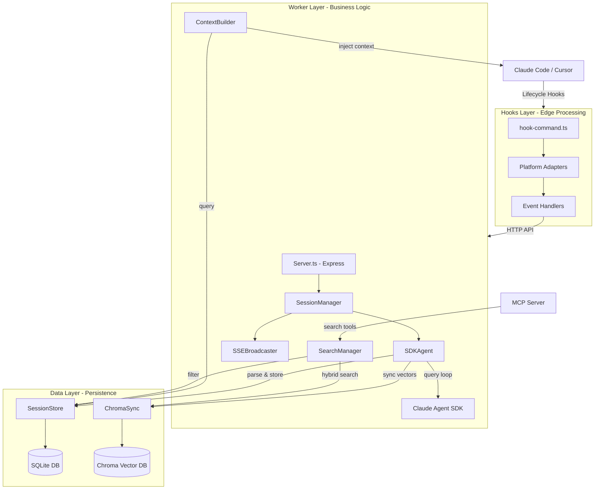
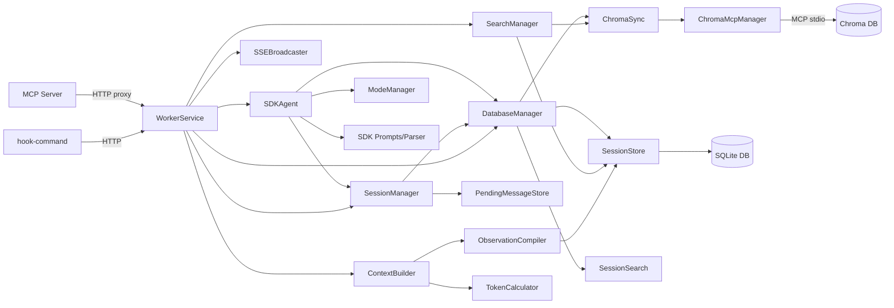
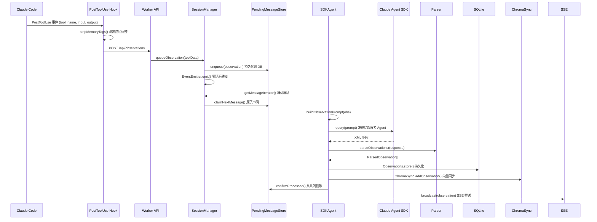
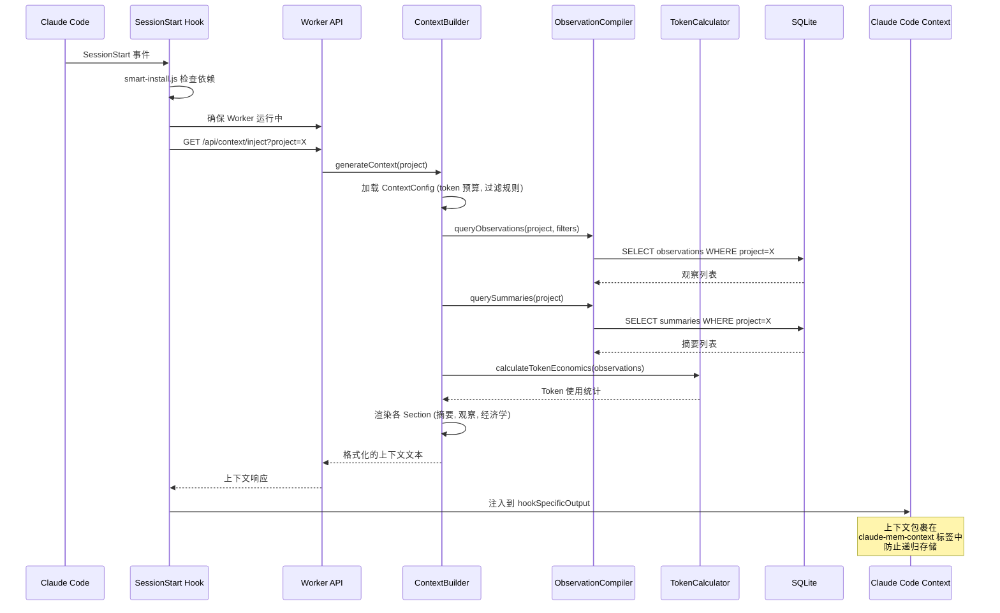

# claude-mem 源码学习笔记

> 仓库地址：[claude-mem](https://github.com/thedotmack/claude-mem)
> 学习日期：2026-03-22

---

> **以下为 AI 源码分析**
>
> ### 一句话概括
>
> Claude-Mem 是为 Claude Code 构建的持久化记忆压缩系统，通过 Lifecycle Hooks 自动捕获工具使用观察、生成语义摘要，并在未来会话中注入相关上下文，实现跨会话的知识连续性。
>
> ### 要点速览
>
> | 核心模块 | 职责 | 关键文件 |
> |---------|------|---------|
> | Lifecycle Hooks | 拦截 Claude Code 生命周期事件，桥接主会话与 Worker | `src/cli/hook-command.ts`, `plugin/hooks/hooks.json` |
> | Worker Service | HTTP API 服务器，编排所有业务逻辑 | `src/services/worker-service.ts`, `src/services/server/Server.ts` |
> | SDK Agent | 通过 Claude Agent SDK 运行观察者子进程 | `src/services/worker/SDKAgent.ts`, `src/sdk/prompts.ts` |
> | Session Manager | 事件驱动的会话生命周期和消息队列管理 | `src/services/worker/SessionManager.ts` |
> | SQLite 数据层 | 持久化存储会话、观察、摘要 | `src/services/sqlite/SessionStore.ts` |
> | Chroma 向量搜索 | 语义搜索和混合检索 | `src/services/sync/ChromaSync.ts`, `src/services/sync/ChromaMcpManager.ts` |
> | Context 生成 | 渐进式上下文注入到新会话 | `src/services/context/ContextBuilder.ts` |
> | MCP Server | 提供 search/timeline/get_observations 工具 | `src/servers/mcp-server.ts` |

---

## 项目简介

Claude-Mem 是一个 Claude Code 插件，解决了 AI 编程助手跨会话"失忆"的核心问题。它通过 Claude Code 的 Lifecycle Hooks 机制，在每次工具调用后自动捕获观察（observations），在会话结束时生成进度摘要（summaries），并将这些记忆持久化到 SQLite 和 Chroma 向量数据库中。当新会话启动时，系统自动检索并注入与当前项目相关的历史上下文，使 Claude 能够延续先前的工作认知。核心价值在于零人工干预的记忆持久化、Token 高效的渐进式上下文注入、以及支持自然语言的语义搜索能力。

## 技术栈

| 类别 | 技术 |
|------|------|
| 语言 | TypeScript (ES2022, ESM) |
| 框架 | Express.js (HTTP API), Claude Agent SDK, MCP SDK |
| 构建工具 | esbuild (Hook 打包), Node.js scripts |
| 依赖管理 | npm, Bun (Worker 运行时) |
| 测试框架 | Bun Test |
| 数据库 | SQLite3 (持久存储) + Chroma (向量搜索) |
| UI | React (Web Viewer, 打包为单文件 HTML) |

## 目录结构

```
claude-mem/
├── src/                        # TypeScript 源码
│   ├── cli/                    # CLI 钩子入口和适配器
│   │   ├── hook-command.ts     # 钩子命令主入口
│   │   ├── adapters/           # 平台适配器 (claude-code, cursor, raw)
│   │   └── handlers/           # 事件处理器 (context, observation, summarize...)
│   ├── hooks/                  # 钩子响应定义
│   ├── sdk/                    # Claude Agent SDK 集成
│   │   ├── parser.ts           # XML 观察/摘要解析器
│   │   └── prompts.ts          # SDK Agent 提示词构建
│   ├── servers/                # MCP 搜索服务器
│   ├── services/               # 核心业务逻辑
│   │   ├── worker-service.ts   # Worker Service 编排器
│   │   ├── worker/             # 业务模块 (SDKAgent, SessionManager, DatabaseManager...)
│   │   ├── server/             # HTTP 服务器和中间件
│   │   ├── context/            # 上下文生成 (ContextBuilder, TokenCalculator...)
│   │   ├── sqlite/             # SQLite 数据层 (SessionStore, SessionSearch...)
│   │   ├── sync/               # Chroma 向量同步
│   │   ├── domain/             # 域模型 (ModeManager, 模式配置)
│   │   └── infrastructure/     # 进程管理、健康检查
│   ├── shared/                 # 共享工具 (paths, hook-constants, EnvManager...)
│   ├── supervisor/             # 进程监督器 (信号处理, 优雅关闭)
│   ├── types/                  # TypeScript 类型定义
│   ├── ui/                     # Web Viewer React UI
│   └── utils/                  # 工具函数 (logger, tag-stripping...)
├── plugin/                     # 构建产物 (安装到 ~/.claude/plugins/)
│   ├── hooks/hooks.json        # 钩子注册配置
│   ├── scripts/                # 运行时脚本 (worker-service, bun-runner...)
│   ├── modes/                  # 模式配置文件 (多语言支持)
│   ├── skills/                 # 插件技能 (mem-search, make-plan, do)
│   └── ui/                     # 打包后的 Viewer UI
├── scripts/                    # 开发和运维脚本
├── tests/                      # 测试套件
├── ragtime/                    # Ragtime 独立模块 (非商业许可)
├── openclaw/                   # OpenClaw 网关集成
├── installer/                  # 安装器
└── cursor-hooks/               # Cursor IDE 集成
```

## 架构设计

### 整体架构

Claude-Mem 采用**事件驱动的观察者模式**架构。系统的核心思路是：不修改 Claude Code 本身，而是通过其 Lifecycle Hooks 机制拦截关键事件（会话开始、用户提示、工具调用、会话结束），将这些事件发送到一个独立运行的 Worker Service 处理。Worker Service 运行一个 SDK Agent 子进程作为"观察者"，它观察主会话的行为并生成结构化的记忆记录。

整体分为三大层：**Hooks 层**（边缘处理，轻量快速）→ **Worker 层**（HTTP API，业务编排）→ **Data 层**（SQLite + Chroma，持久化与检索）。



### 核心模块

#### 1. Lifecycle Hooks 层

**职责**：拦截 Claude Code 的生命周期事件，作为主会话与 Worker Service 之间的桥梁。采用边缘处理模式——隐私标签（`<private>`）在此层剥离，不传入 Worker。

**核心文件**：
- `src/cli/hook-command.ts` — 钩子命令主入口，读取 stdin JSON，分派到适配器和处理器
- `src/cli/adapters/` — 平台适配器（claude-code, cursor, raw），归一化不同平台的输入/输出格式
- `src/cli/handlers/` — 6 种事件处理器：context、session-init、observation、summarize、session-complete、user-message
- `plugin/hooks/hooks.json` — 注册 5 个 Lifecycle Hook（Setup, SessionStart, UserPromptSubmit, PostToolUse, Stop, SessionEnd）

**关键接口**：
- `hookCommand(platform, event, options)` — 主入口函数
- `isWorkerUnavailableError(error)` — 错误分类（Worker 不可用 → 优雅降级 exit 0 vs 处理器 bug → 阻塞 exit 2）

**与其他模块关系**：通过 HTTP 调用 Worker Service API，不直接访问数据库。

#### 2. Worker Service

**职责**：核心业务编排器，承载 Express HTTP API（端口 37777），管理所有服务组件的生命周期。从原先 2000 行的单体重构为约 300 行的编排器。

**核心文件**：
- `src/services/worker-service.ts` — `WorkerService` 类，初始化所有服务组件、注册路由、管理启动/关闭
- `src/services/server/Server.ts` — Express 应用封装，中间件配置、路由注册
- `src/services/worker/http/routes/` — 模块化路由（Session, Data, Search, Settings, Logs, Viewer, Memory）

**关键类**：`WorkerService` — 持有 DatabaseManager、SessionManager、SDKAgent、SSEBroadcaster 等所有核心服务实例

**与其他模块关系**：作为中央编排器，组合所有业务模块；由 Hooks 层通过 HTTP 调用。

#### 3. SDK Agent

**职责**：通过 Claude Agent SDK 启动观察者子进程，运行事件驱动的查询循环，将工具观察转化为结构化记忆。

**核心文件**：
- `src/services/worker/SDKAgent.ts` — 会话启动、查询循环管理、Token 追踪
- `src/sdk/prompts.ts` — 提示词构建（初始化提示、观察提示、摘要提示、继续提示）
- `src/sdk/parser.ts` — XML 响应解析（`<observation>` 和 `<summary>` 标签）

**关键方法**：
- `startSession()` — 启动 SDK Agent（查找 Claude CLI 路径、环境隔离、Resume 逻辑）
- `createMessageGenerator()` — 异步生成器，产生初始化/继续提示和待处理消息

**核心机制**：
- Resume 策略：仅在 memorySessionId 存在且 promptNumber > 1 时恢复已有会话
- 多供应商支持：Claude SDK、Gemini、OpenRouter（通过 GeminiAgent/OpenRouterAgent）
- 上下文溢出检测和 Token 累计追踪

#### 4. Session Manager

**职责**：管理活跃会话生命周期，协调消息队列的入队和消费，提供零延迟事件通知。

**核心文件**：
- `src/services/worker/SessionManager.ts` — 会话初始化、观察排队、摘要排队、会话删除
- `src/services/sqlite/PendingMessageStore.ts` — 持久化消息队列（Claim-Confirm 模式）

**关键方法**：
- `initializeSession()` — 创建或查找活跃会话
- `queueObservation()` — 先持久化到 DB，再通过 EventEmitter 通知 SDK Agent
- `getMessageIterator()` — 异步迭代器，SDK Agent 从中消费消息
- `deleteSession()` — 中止 SDK Agent，等待生成器完成，清理资源（防止僵尸进程）

#### 5. Context 生成

**职责**：在新会话启动时，检索历史上下文并格式化注入。采用渐进式披露（Progressive Disclosure）策略，控制 Token 成本。

**核心文件**：
- `src/services/context/ContextBuilder.ts` — 主编排器，协调加载配置 → 查询数据 → 渲染输出
- `src/services/context/ObservationCompiler.ts` — 数据库查询和过滤（按类型/概念/日期）
- `src/services/context/TokenCalculator.ts` — Token 预算计算和经济学分析
- `src/services/context/sections/` — 各部分渲染器
- `src/services/context/formatters/` — 输出格式化器

#### 6. 数据层

**职责**：SQLite 负责结构化存储和过滤查询，Chroma 负责语义向量搜索，两者通过 ChromaSync 保持同步。

**核心文件**：
- `src/services/sqlite/SessionStore.ts` — 会话、观察、摘要的 CRUD 操作，迁移系统
- `src/services/sqlite/SessionSearch.ts` — 结构化过滤查询
- `src/services/sqlite/PendingMessageStore.ts` — 持久化工作队列
- `src/services/sync/ChromaSync.ts` — 观察自动同步到 Chroma
- `src/services/sync/ChromaMcpManager.ts` — 通过 MCP stdio 协议连接 chroma-mcp

**数据库 Schema 核心表**：
- `sdk_sessions` — 会话元数据（content_session_id, memory_session_id, project, status）
- `observations` — 观察记录（type, title, narrative, facts, concepts, files_read/modified）
- `session_summaries` — 进度摘要（request, investigated, learned, completed, next_steps）
- `pending_messages` — 持久工作队列（状态：pending → processing → processed/failed）

### 模块依赖关系



## 核心流程

### 流程一：观察捕获与持久化

这是 Claude-Mem 最核心的数据流——每当 Claude Code 调用工具后，如何自动捕获、压缩和存储观察。



**关键逻辑说明**：
1. **边缘处理**：Hook 层在发送数据前剥离 `<private>` 和 `<claude-mem-context>` 标签，保护隐私
2. **持久化优先**：观察先写入 `pending_messages` 表，再通过 EventEmitter 通知 SDK Agent。即使 Worker 崩溃，消息不丢失
3. **Claim-Confirm 模式**：PendingMessageStore 使用原子声明机制——`claimNextMessage()` 将状态从 pending 改为 processing，处理完成后 `confirmProcessed()` 删除记录。超过 60 秒的 processing 消息会自愈回 pending
4. **XML 结构化输出**：SDK Agent 产出 `<observation>` XML 块，Parser 提取 type/title/narrative/facts/concepts/files 等字段
5. **双写存储**：解析后的观察同时写入 SQLite（结构化查询）和 Chroma（语义搜索）

### 流程二：上下文注入（SessionStart）

当新会话启动时，Claude-Mem 自动检索并注入与当前项目相关的历史记忆。



**关键逻辑说明**：
1. **自动启动**：SessionStart Hook 先运行 `smart-install.js` 检查依赖，然后确保 Worker Service 正在运行（如未运行则自动 spawn daemon）
2. **渐进式披露**：ContextBuilder 按 Token 预算裁剪上下文，优先注入最近的摘要和高相关性观察，避免浪费 Token
3. **防递归标签**：注入的上下文被 `<claude-mem-context>` 标签包裹。当 PostToolUse Hook 捕获工具输出时，`stripMemoryTags()` 会自动过滤这些标签，防止记忆的递归存储
4. **Worktree 支持**：ContextBuilder 支持多项目查询，可以合并父仓库和 worktree 的观察
5. **优雅降级**：如果 Worker 不可用或初始化未完成，返回空上下文，不阻塞用户

## 关键设计亮点

### 1. Claim-Confirm 持久化队列

**解决的问题**：Worker 崩溃时观察数据丢失。

**实现方式**：`PendingMessageStore`（`src/services/sqlite/PendingMessageStore.ts`）使用 SQLite 作为持久队列。消息生命周期：`enqueue()` → pending → `claimNextMessage()` → processing → `confirmProcessed()` → 删除。超过 60 秒的 processing 消息自动重置为 pending（最多重试 3 次）。

**为什么这样设计**：纯内存队列在 Worker 崩溃时丢失数据。SQLite 提供事务保证，且 WAL 模式确保读写不互锁。这个设计让系统在任何时刻崩溃都能自愈，是可靠性的基石。

### 2. 边缘处理的隐私控制

**解决的问题**：用户希望某些内容不被记忆系统存储。

**实现方式**：`stripMemoryTags()`（`src/utils/tag-stripping.ts`）在 Hook 层（边缘）完成所有标签剥离——`<private>` 用于用户手动标记、`<claude-mem-context>` 防止递归存储、`<system_instruction>` 过滤系统指令。包含 ReDoS 防护（MAX_TAG_COUNT = 100）。

**为什么这样设计**：在数据进入 Worker/存储之前就过滤，遵循"数据在边缘清洗"的单向数据流原则。Worker Service 无需关心隐私逻辑，保持简洁。

### 3. 环境隔离防止 API Key 污染

**解决的问题**：项目 `.env` 文件中的 `ANTHROPIC_API_KEY` 会被 SDK 自动发现，导致记忆操作计费到用户个人账户而非 CLI 订阅（Issue #733）。

**实现方式**：`EnvManager`（`src/shared/EnvManager.ts`）使用 BLOCKLIST 方式构建隔离环境——继承完整进程环境，仅剥离 `ANTHROPIC_API_KEY` 和 `CLAUDECODE`。如果 `~/.claude-mem/.env` 中配置了专用 Key，则重新注入。

**为什么这样设计**：Blocklist 比 Allowlist 更安全——只阻断已知有害变量，所有其他系统变量（PATH、代理配置、平台变量等）正常传递，不会破坏 CLI 认证和基础设施。

### 4. 事件驱动的零延迟观察处理

**解决的问题**：轮询机制导致观察处理延迟。

**实现方式**：`SessionManager` 使用 Node.js EventEmitter 实现零延迟通知。`queueObservation()` 在持久化到 PendingMessageStore 后立即触发事件，SDK Agent 的 `getMessageIterator()` 异步迭代器立刻唤醒并消费消息。每个活跃会话有独立的 EventEmitter 实例。

**为什么这样设计**：与定时轮询相比，事件驱动模式只在有新消息时才唤醒处理器，既降低了延迟又减少了无意义的 CPU 消耗。结合持久化队列，实现了"快但不丢"的目标。

### 5. 多平台适配器模式

**解决的问题**：Claude Code 和 Cursor 的钩子输入/输出格式不同。

**实现方式**：`src/cli/adapters/` 目录下的平台适配器工厂，每个适配器实现 `normalizeInput()` 和 `formatOutput()` 接口。`hook-command.ts` 先通过适配器归一化输入，执行统一的事件处理器，再通过适配器格式化输出。还支持 raw 适配器用于 Codex CLI。

**为什么这样设计**：将平台差异封装在适配器层，业务逻辑（handlers）完全与平台无关。新增平台支持只需添加一个适配器文件，不影响核心流程。这是经典的策略模式应用。
