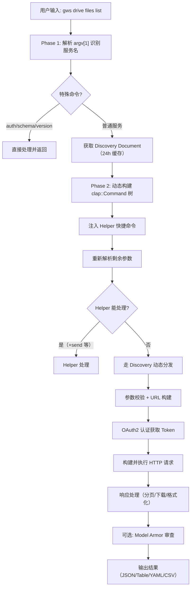
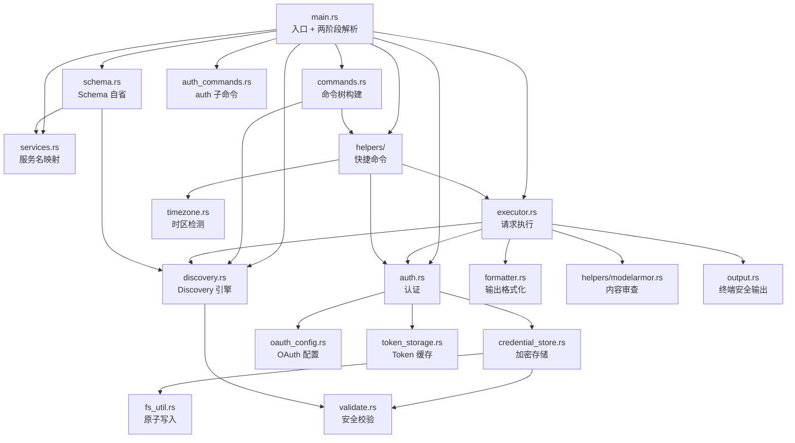
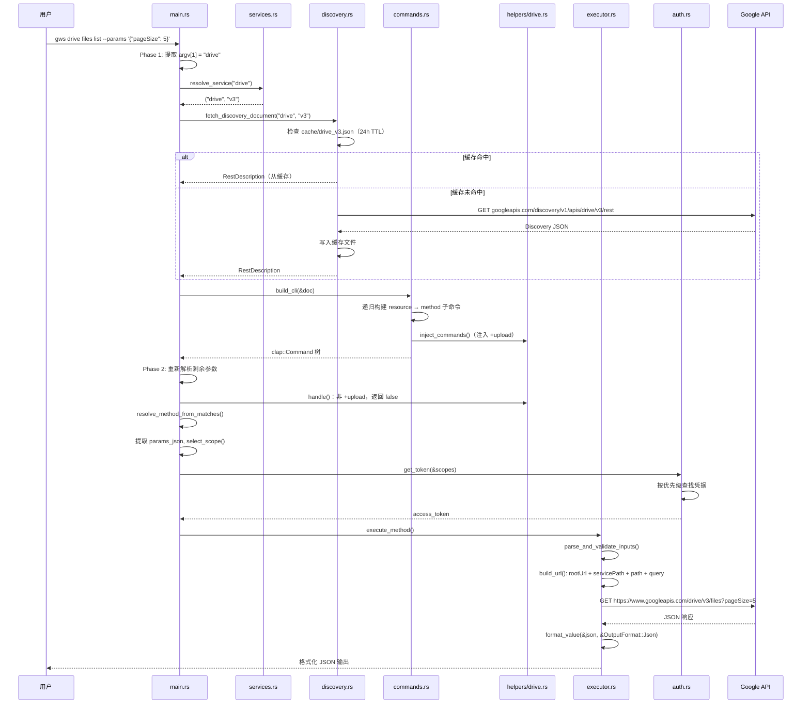
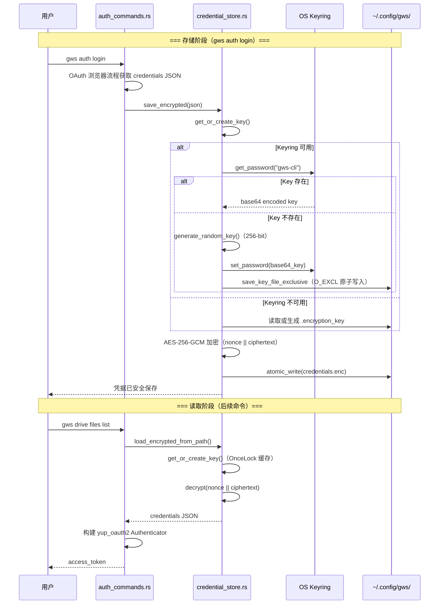

# googleworkspace/cli 源码学习笔记

> 仓库地址：[googleworkspace/cli](https://github.com/googleworkspace/cli)
> 学习日期：2026-03-22

---

> **以下为 AI 源码分析**
>
> ### 一句话概括
>
> 一个用 Rust 编写的动态 CLI 工具，通过运行时解析 Google Discovery Document 自动生成覆盖所有 Google Workspace API 的命令行接口。
>
> ### 要点速览
>
> | 核心模块 | 职责 | 关键文件 |
> |---------|------|---------|
> | Discovery 引擎 | 运行时获取并缓存 Google API 描述文档 | `src/discovery.rs` |
> | 命令树构建 | 从 Discovery Document 动态生成 clap 命令树 | `src/commands.rs` |
> | 请求执行器 | 构建 HTTP 请求、分页、文件上传、响应处理 | `src/executor.rs` |
> | 认证系统 | OAuth2 / Service Account / Token 多策略认证 | `src/auth.rs`, `src/credential_store.rs` |
> | Helper 系统 | 为各服务注入人性化快捷命令（`+send`, `+triage` 等） | `src/helpers/` |
> | Schema 自省 | 支持用户查看任意 API 方法的请求/响应 Schema | `src/schema.rs` |
> | 输出格式化 | JSON / Table / YAML / CSV 多格式输出 | `src/formatter.rs` |

---

## 项目简介

`gws`（Google Workspace CLI）是一个统一的 Google Workspace 命令行工具，面向人类用户和 AI Agent 双重场景。它的核心创新在于**不维护静态命令列表**，而是在运行时通过 Google Discovery Service 动态构建命令。当 Google 新增 API 端点时，`gws` 无需更新即可自动支持。项目还附带 100+ Agent Skills（SKILL.md 文件），供 AI Agent 直接调用 Google Workspace 服务。

## 技术栈

| 类别 | 技术 |
|------|------|
| 语言 | Rust (Edition 2021) |
| 框架 | clap 4（CLI 解析）, tokio（异步运行时）, reqwest（HTTP 客户端） |
| 构建工具 | Cargo, cargo-dist（发布二进制）, Nix flake |
| 依赖管理 | Cargo（Rust 依赖）, pnpm（npm 发布包装） |
| 测试框架 | cargo test, serial_test（串行化环境变量测试） |

## 目录结构

```
gws/
├── src/                        # Rust 源码
│   ├── main.rs                 # 入口：参数解析、两阶段解析调度
│   ├── discovery.rs            # Discovery Document 获取、缓存、反序列化
│   ├── commands.rs             # 从 Discovery 动态构建 clap 命令树
│   ├── executor.rs             # HTTP 请求构建、执行、分页、上传
│   ├── auth.rs                 # 多策略 OAuth2 认证（Token/文件/加密/ADC）
│   ├── credential_store.rs     # AES-256-GCM 凭据加密存储
│   ├── schema.rs               # `gws schema` 自省命令实现
│   ├── services.rs             # 服务名 → API 名 + 版本号映射表
│   ├── error.rs                # 结构化错误类型与退出码
│   ├── formatter.rs            # JSON/Table/YAML/CSV 输出格式化
│   ├── output.rs               # 终端安全输出（防注入、防 bidi）
│   ├── helpers/                # 各服务的快捷命令（Helper trait 实现）
│   │   ├── mod.rs              # Helper trait 定义与服务分发
│   │   ├── gmail/              # Gmail +send, +reply, +triage, +watch 等
│   │   ├── calendar.rs         # Calendar +insert, +agenda
│   │   ├── drive.rs            # Drive +upload
│   │   ├── sheets.rs           # Sheets +append, +read
│   │   ├── docs.rs             # Docs +write
│   │   ├── chat.rs             # Chat +send
│   │   ├── workflows.rs        # 跨服务工作流（+standup-report 等）
│   │   ├── events/             # Workspace Events 订阅
│   │   ├── modelarmor.rs       # Model Armor 内容审查集成
│   │   └── script.rs           # Apps Script +push
│   ├── setup.rs / setup_tui.rs # `gws auth setup` TUI 向导
│   ├── auth_commands.rs        # auth 子命令（login/logout/export/setup）
│   ├── validate.rs             # 路径遍历防护、API 标识符校验
│   ├── timezone.rs             # Google 账户时区检测与缓存
│   └── logging.rs              # 结构化日志（tracing）
├── skills/                     # 100+ AI Agent Skills（SKILL.md 文件）
├── registry/                   # recipes.yaml / personas.yaml 索引
├── scripts/                    # 版本同步、覆盖率、发布脚本
├── templates/                  # Model Armor 模板
└── docs/                       # 文档、logo、贡献指南
```

## 架构设计

### 整体架构

`gws` 采用**两阶段解析**（Two-Phase Parsing）架构。第一阶段仅识别服务名，第二阶段根据该服务的 Discovery Document 动态构建完整命令树后重新解析参数。这种设计使得 CLI 命令完全由 Google 的 API 描述驱动，无需硬编码端点。

在两阶段解析之上，Helper 系统为高频操作提供了人性化的快捷命令（如 `+send`, `+triage`），这些命令在 Discovery 生成的命令旁边注入，通过 `+` 前缀区分。



### 核心模块

#### 1. Discovery 引擎 (`src/discovery.rs`)

**职责**：从 Google Discovery Service 获取 API 描述文档，并反序列化为 Rust 类型。

- **核心数据结构**：`RestDescription` → `RestResource` → `RestMethod` → `MethodParameter`，完整映射 Discovery Document 的层次结构
- **缓存策略**：24 小时本地文件缓存（`~/.config/gws/cache/`），命中时直接反序列化跳过网络请求
- **双 URL 容错**：先尝试标准 Discovery URL，失败后尝试 `$discovery/rest` 模式（Forms、Keep、Meet 等较新 API 使用该模式）
- **安全校验**：通过 `validate::validate_api_identifier()` 防止路径遍历攻击

#### 2. 命令树构建 (`src/commands.rs`)

**职责**：将 Discovery Document 转化为 clap 命令树。

- **核心函数**：`build_cli()` → 递归调用 `build_resource_command()`
- **递归结构**：支持任意深度的子资源嵌套（如 `drive > files > permissions > list`）
- **智能标志**：根据方法属性动态添加 `--json`（仅 POST/PUT/PATCH）、`--upload`（仅支持上传的方法）
- **全局标志**：`--sanitize`, `--dry-run`, `--format` 在根命令注入，所有子命令继承

#### 3. 请求执行器 (`src/executor.rs`)

**职责**：将解析后的参数转化为 HTTP 请求并处理响应。

- **URL 构建**：从 Discovery Document 的 path 模板和参数位置（path/query）构造完整 URL
- **Multipart 上传**：支持文件流式上传（`UploadSource::File`）和内存数据上传（`UploadSource::Bytes`）
- **自动分页**：`--page-all` 模式下自动跟踪 `nextPageToken`，输出 NDJSON 格式
- **Dry Run**：`--dry-run` 模式在本地完成校验后打印请求详情，不实际发送
- **Model Armor**：可选地将 API 响应发送到 Model Armor 进行 prompt injection 检测

#### 4. 认证系统 (`src/auth.rs` + `src/credential_store.rs`)

**职责**：多策略 OAuth2 认证，按优先级选择凭据来源。

- **凭据优先级**（高到低）：
  1. `GOOGLE_WORKSPACE_CLI_TOKEN` 环境变量（直接 access token）
  2. `GOOGLE_WORKSPACE_CLI_CREDENTIALS_FILE`（明文 JSON）
  3. `~/.config/gws/credentials.enc`（AES-256-GCM 加密凭据）
  4. `~/.config/gws/credentials.json`（明文凭据）
  5. Application Default Credentials（ADC）
- **加密存储**：使用 AES-256-GCM 加密凭据，密钥优先存储在 OS Keyring（macOS Keychain / Windows Credential Manager），回退到文件存储
- **竞态安全**：密钥文件创建使用 `O_EXCL` 原子操作，多进程竞争时 loser 使用 winner 的密钥
- **Token 刷新**：`AccessTokenProvider` trait 抽象让长运行 helper 在每次 API 调用前获取新 token

#### 5. Helper 系统 (`src/helpers/`)

**职责**：为各服务提供人性化的快捷命令。

- **核心 trait**：`Helper` 定义 `inject_commands()`（注入子命令）和 `handle()`（处理逻辑）
- **服务分发**：`get_helper()` 根据服务名返回对应 Helper 实现
- **命名约定**：所有 helper 命令以 `+` 前缀标识，与 Discovery 自动生成的命令互不冲突
- **跨服务工作流**：`WorkflowHelper` 组合 Calendar + Gmail + Tasks API，提供 `+standup-report`、`+weekly-digest` 等高级命令
- **Gmail 完整套件**：`+send`, `+reply`, `+reply-all`, `+forward`, `+triage`, `+watch`，使用 `mail-builder` 构建 RFC 5322 消息

### 模块依赖关系



## 核心流程

### 流程一：命令执行（从用户输入到 API 响应）

以 `gws drive files list --params '{"pageSize": 5}'` 为例，追踪完整调用链：



**关键逻辑说明**：

1. `parse_service_and_version()`：支持 `drive:v2` 语法和 `--api-version v2` 标志覆盖默认版本
2. `filter_args_for_subcommand()`：剥离服务名和 `--api-version`，仅保留子命令参数
3. `select_scope()`：选择 Discovery Document 中列出的第一个（最宽）scope，避免窄 scope 限制
4. `build_url()`：从 path 模板替换路径参数，剩余参数作为 query string

### 流程二：凭据加密存储与读取

以 `gws auth login` 保存凭据，后续命令读取为例：



**关键设计**：

1. **密钥存储双保险**：keyring 为主 → 文件为备，keyring 损坏（如 OS 升级）时自动降级
2. **竞态安全**：`save_key_file_exclusive()` 使用 `O_EXCL` 标志确保多进程不覆盖
3. **原子写入**：凭据文件通过 sibling `.tmp` + rename 写入，防止 Ctrl-C 导致文件损坏
4. **腐败恢复**：加密文件解密失败时自动删除并清理关联 token cache，回退到其他凭据源

## 关键设计亮点

### 1. 运行时 Schema 驱动的命令生成

**解决的问题**：传统 CLI 工具需要为每个 API 端点硬编码命令，Google Workspace 有数百个端点且持续新增。

**实现方式**：`commands.rs` 中的 `build_cli()` 递归遍历 `RestDescription.resources`，为每个 resource 创建子命令，为每个 method 创建叶子命令。方法的 `request` 字段控制是否添加 `--json` 标志，`supports_media_upload` 控制是否添加 `--upload` 标志。

**为什么这样设计**：Google Discovery Service 是 API 的唯一事实源（single source of truth），将其作为 CLI 的唯一输入避免了手动维护和版本不同步问题。24 小时缓存在性能和时效性之间取得平衡。

### 2. Helper trait 的扩展机制

**解决的问题**：Discovery 自动生成的命令功能完整但不够友好（如发邮件需要手动构造 base64 编码的 RFC 5322 消息）。

**实现方式**（`src/helpers/mod.rs`）：`Helper` trait 定义三个方法：`inject_commands()` 注入快捷命令，`handle()` 拦截匹配的子命令，`helper_only()` 控制是否隐藏 Discovery 命令。`get_helper()` 按服务名分发到具体实现。所有 helper 命令用 `+` 前缀标识。

**为什么这样设计**：trait 模式允许每个服务独立实现 helper 而不侵入核心解析逻辑。`+` 前缀保证与 Discovery 自动生成的命令名永不冲突。`helper_only()` 让 workflow 这种纯合成服务完全由 helper 驱动。

### 3. 凭据加密的分层容错

**解决的问题**：凭据安全存储需要在不同环境（桌面/Docker/CI/跨平台）都能可靠工作。

**实现方式**（`src/credential_store.rs`）：`resolve_key()` 实现三级回退：OS Keyring → 文件 → 生成新密钥。`KeyringBackend` 枚举通过环境变量 `GOOGLE_WORKSPACE_CLI_KEYRING_BACKEND` 控制策略（`keyring` 或 `file`）。密钥文件使用 `O_EXCL` + 0600 权限保护。keyring 读取成功后同步备份到文件，确保 keyring 丢失时仍可恢复。

**为什么这样设计**：OS Keyring 在桌面环境最安全，但在 Docker/CI 中不可用。文件备份作为 durable fallback 确保凭据在 keyring 失效（OS 升级、容器重启）后仍可访问。`OnceLock` 缓存避免重复 I/O。

### 4. 终端输出安全防护

**解决的问题**：API 响应中的恶意内容可能包含终端转义序列（ANSI escape）、bidi 覆盖字符、零宽字符等，导致终端注入攻击。

**实现方式**（`src/output.rs`）：`sanitize_for_terminal()` 过滤 ASCII 控制字符（保留 `\n` 和 `\t`）、bidi 覆盖字符（U+202A-202E）、零宽字符（U+200B-200D）、行/段落分隔符等。`is_dangerous_unicode()` 使用 `matches!` 宏实现 O(1) 检测。`colorize()` 尊重 `NO_COLOR` 环境变量标准。

**为什么这样设计**：CLI 工具直接向终端输出不受信内容是经典攻击面。逐字符过滤成本低且覆盖全面，比正则更可靠。保留换行和制表符维持可读性。

### 5. 结构化错误码与 JSON 错误输出

**解决的问题**：脚本和 AI Agent 需要通过退出码和机器可读的错误输出来判断失败类型。

**实现方式**（`src/error.rs`）：`GwsError` 枚举区分 5 种错误类型（Api/Auth/Validation/Discovery/Other），每种映射到固定退出码（1-5）。`to_json()` 统一输出 JSON 格式错误信息到 stdout，同时 stderr 输出彩色人类可读摘要。`accessNotConfigured` 错误还会打印 GCP Console 启用链接。

**为什么这样设计**：分离 stdout（机器可读 JSON）和 stderr（人类可读提示）是 CLI 最佳实践。固定退出码让脚本通过 `$?` 快速分支而无需解析文本。`EXIT_CODE_DOCUMENTATION` 常量表确保帮助文档与代码始终一致。
