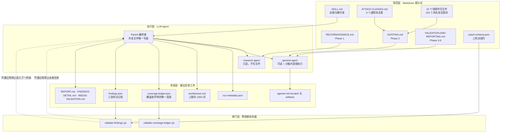
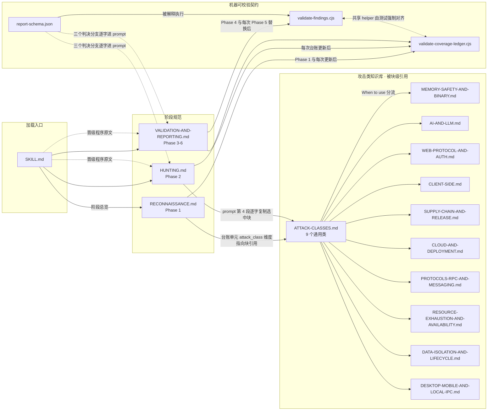
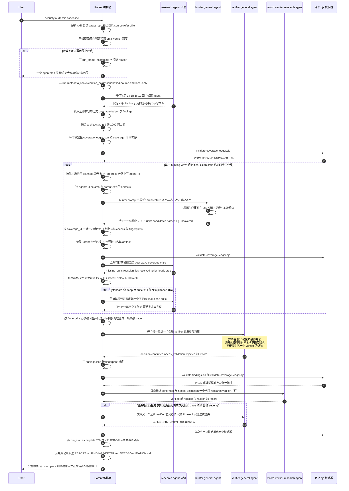
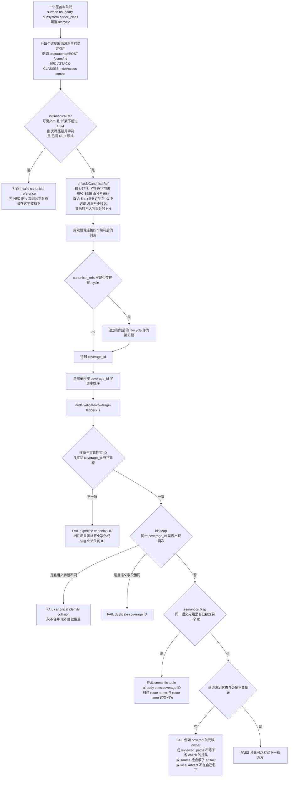
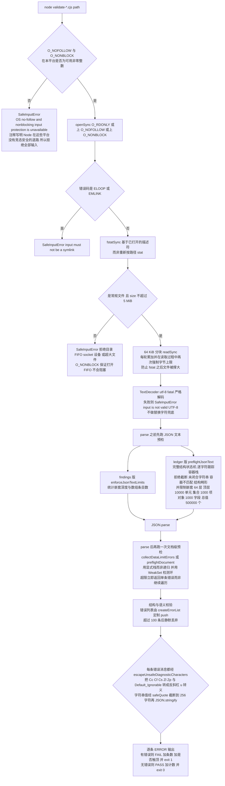

# security-audit-skill 源码学习笔记

> 仓库地址：[cloudflare/security-audit-skill](https://github.com/cloudflare/security-audit-skill)
> 学习日期：2026-09-29
> 分析版本：`c1c8a8c`（Clarify guidance and full audit modes，2026-09-14）

---

> **以下为 AI 源码分析**
>
> ### 一句话概括
>
> Cloudflare 开源的 coding-agent 安全审计 skill——用「确定性覆盖率台账 + 对抗式独立验证 + 零依赖硬化校验器」三件套，把 LLM agent 从"凭感觉给安全建议"强行约束成"只能报出有源码证据、可复现、经过另一个 agent 反驳的漏洞"。
>
> ### 要点速览
>
> | 层 | 模块 | 职责 | 关键文件 |
> |------|------|------|----------|
> | 规范层 | 总纲 | 运行模式、执行安全边界、写隔离、profile、预算、核心原则、反模式 | `SKILL.md`（192 行） |
> | 规范层 | Phase 1 侦察 | 4 个并行只读侦察 agent + 确定性覆盖率台账定义 | `RECONNAISSANCE.md`（156 行） |
> | 规范层 | Phase 2 狩猎 | hunter prompt 的 9 段固定结构、候选闸门、critic 波次循环 | `HUNTING.md`（251 行） |
> | 规范层 | 攻击类知识库 | 9 个通用攻击类 + 10 个领域伴生文件（44 小节 / 153 个具名攻击类块） | `ATTACK-CLASSES.md` + 9 个 `*-AND-*.md` |
> | 规范层 | Phase 3-6 | 对抗式验证、结构化输出、独立记录复核、目标中立报告 | `VALIDATION-AND-REPORTING.md`（186 行） |
> | 契约层 | 判决 schema | `confirmed` / `needs_validation` / `rejected` 三态 `oneOf` 分支，全量 `additionalProperties: false` | `report-schema.json`（461 行） |
> | 闸门层 | 台账校验器 | 覆盖率单元结构、身份规范化、证据归属、状态机不变量、重指派归档 | `validate-coverage-ledger.cjs`（872 行） |
> | 闸门层 | 结论校验器 | 零依赖 JSON Schema 解释器 + 跨记录语义检查 | `validate-findings.cjs`（773 行） |
> | 执行层 | LLM Agent | Parent（编排）/ `research`（只读）/ `general`（可读 + 受限执行） | 由宿主 coding agent 提供 |
> | 状态层 | 运行工件 | `run-metadata.json`、`architecture.md`、`coverage-ledger.json`、`findings.json`、三份报告 | 输出目录，Parent 是唯一写者 |

---

## 项目简介

这是一个 **Agent Skill**（不是应用、不是库、不是服务）：安装到 Claude Code / Cursor / Qoder 这类 coding agent 后，用户说一句 "security audit this codebase"，agent 就会加载这 22 个文件并按其中定义的六阶段流程编排一批相互隔离的子 agent 去审计当前代码库。它是 Cloudflare 内部漏洞发现 harness 的开源起点，官方博客 [Build your own vulnerability harness](https://blog.cloudflare.com/build-your-own-vulnerability-harness) 描述了它后来演化成的多阶段、全车队规模系统。

它要解决的核心问题不是"让 LLM 更懂安全"，而是**"如何让 LLM 的安全输出可信"**。朴素做法（丢一句 prompt 让模型找漏洞）会产生三类废物：把 checklist 偏差当漏洞报、把"建议加一层防御"当发现报、把猜测的部署行为当事实报。这个 skill 的全部设计都在压制这三类噪音：

1. **把"覆盖率"从形容词变成可计数的状态机。** 审计前先生成 `coverage-ledger.json`——一个由「入口面 × 信任边界 × 子系统 × 攻击类」四维笛卡尔积派生的确定性单元列表，每个单元的 `coverage_id` 由规范化编码算出，跨 run 稳定可比。Phase 2 只能从台账里领任务，"覆盖率完整"必须由一个独立的 critic agent 返回空工作集才算数，而不是由父 agent 写一句"auth 已审查"。
2. **把"发现"从散文变成机器可校验的三态判决。** `confirmed` 必须有完整源码 trace + 有界本地观测结果；`needs_validation` 必须有精确的未解决事实且**没有 severity**；`rejected` 记录被证伪的候选以免下次重犯。两个零依赖 Node 校验器在每个阶段后被强制执行，校验不过就不许往下走。
3. **把"独立性"从美德变成架构约束。** 找到候选的 agent 永远不是验证它的 agent；Phase 5 若产生实质性替换，还要再交给第三个既没狩猎过、也没做过 Phase 3 验证的 agent。台账校验器甚至会拒绝重指派后复用旧 owner 的 `agent_id` 或 artifact。

README 里给的效果数据是：**单次 run 找到的漏洞约等于重复 run 累计总量的一半**——所以台账被设计成可累加的，多次 run 之间通过 fingerprint 复用证据、定向补漏，而不是每次从零开始。

## 技术栈

| 类别 | 技术 |
|------|------|
| 语言 | Markdown（约 1500 行提示词规范，占仓库 3/4 篇幅）+ CommonJS JavaScript（Node.js） |
| 框架 | Agent Skill 规范（`SKILL.md` 的 YAML frontmatter：`name` + `description`），无应用框架 |
| 构建工具 | 无。源码即产物，`npx skills add <url> --skill security-audit` 直接安装 |
| 依赖管理 | **无 `package.json`、无 `node_modules`**。两个校验器零运行时依赖，只用 Node 内置 `fs` / `path` / `util` |
| 测试框架 | `node:test` + `node:assert/strict`，65 个用例（含 CLI 端到端与敌意输入测试），`node --test *.test.cjs` 直接跑 |

值得一提的反常识点：仓库里**没有 CI 配置**（无 `.github/`）、没有 lint 配置、没有任何清单文件。测试全部通过 `spawnSync` 起真实子进程跑 CLI，因此不需要测试 runner 依赖。这是刻意的——skill 会被安装到用户机器上，多一个依赖就多一个供应链风险面。

## 目录结构

```text
security-audit-skill/
├── LICENSE                                          # MIT
├── README.md                                        # 106 行：能力说明 / 安装 / 用法 / 设计原则
└── skills/
    └── security-audit/                              # 唯一交付物：一个 Agent Skill
        ├── SKILL.md                                 # 192 行 总纲：模式 / 执行安全 / 写隔离 / profile / 预算 / 原则 / 反模式
        ├── RECONNAISSANCE.md                        # 156 行 Phase 1：4 个侦察 agent prompt + 确定性覆盖率台账定义
        ├── HUNTING.md                               # 251 行 Phase 2：hunter prompt 契约 / 候选闸门 / critic 波次
        ├── ATTACK-CLASSES.md                        # 130 行 9 个通用攻击类（含 Wildcard 与 Obvious things）
        │
        │   # ↓ 10 个领域伴生文件，结构完全同构：When to use / Core discipline / 攻击类小节 / Universal moves / Validation rules
        ├── MEMORY-SAFETY-AND-BINARY.md              # 101 行 20 类：越界、整数、UAF、类型混淆、FFI/ABI、加载器、内核接口
        ├── WEB-PROTOCOL-AND-AUTH.md                 # 105 行 20 类：请求分帧、缓存投毒、CSRF、JWT/OAuth/SAML、MFA、passkey、mTLS
        ├── DESKTOP-MOBILE-AND-LOCAL-IPC.md          #  89 行 16 类：deep link、webview bridge、导出组件、特权 helper、本地 IPC
        ├── CLOUD-AND-DEPLOYMENT.md                  #  86 行 15 类：workload identity、IAM、ingress、容器编排、IaC、edge
        ├── DATA-ISOLATION-AND-LIFECYCLE.md          #  84 行 15 类：租户隔离、派生数据泄露、导出/备份/迁移、删除与恢复
        ├── AI-AND-LLM.md                            #  83 行 14 类：间接注入、记忆投毒、动作绑定、工具 schema、MCP 身份
        ├── CLIENT-SIDE.md                           #  83 行 14 类：DOM XSS、原型污染、postMessage、service worker、XS-Leaks
        ├── PROTOCOLS-RPC-AND-MESSAGING.md           #  81 行 14 类：分帧规范化、RPC 身份、broker 隔离、重放与顺序
        ├── RESOURCE-EXHAUSTION-AND-AVAILABILITY.md  #  78 行 13 类：超线性解析、放大、配额、worker 饥饿、重试风暴
        ├── SUPPLY-CHAIN-AND-RELEASE.md              #  73 行 12 类：依赖来源、CI 特权流、签名与晋级、更新元数据、插件
        │
        ├── VALIDATION-AND-REPORTING.md              # 186 行 Phase 3-6：对抗验证 / 结构化输出 / 独立复核 / 报告
        ├── report-schema.json                       # 461 行 三判决 oneOf 契约
        ├── validate-findings.cjs                    # 773 行 findings.json 校验器
        ├── validate-findings.test.cjs               # 652 行
        ├── validate-coverage-ledger.cjs             # 872 行 coverage-ledger.json 校验器
        └── validate-coverage-ledger.test.cjs        # 740 行
```

代码/文档比例约 3000 : 2400 行，但语义权重完全相反：**Markdown 是"程序"，`.cjs` 是"运行时断言"**。

## 架构设计

### 整体架构

这个项目的架构可以概括为**「规范即程序、校验器即闸门」（specification-as-software with hard gates）**。真正的执行体是 LLM agent，它们读取 Markdown 规范来决定行为；而两个 `.cjs` 校验器是唯一不可协商的硬边界——任何阶段的产物只要通不过校验，流程就不允许前进。



三条关键的架构决策：

**1. 三种角色，权限严格递减。** `SKILL.md:19-29` 定义了 agent 中立的术语：Parent 拥有共享状态；`research` agent 只读源码、返回结构化事实、**不写任何文件**（用于侦察、coverage critic、Phase 5 记录复核）；`general` agent 可读 + 在 OS 级沙箱内受限执行（用于 hunter 和 Phase 3 候选验证）。规范只约束**角色、写隔离、prompt、独立性**这四个边界，宿主平台用什么机制实现子 agent 都可以替换。

**2. 共享状态单写者 + 每 agent 私有 scratch。** `SKILL.md:54-66` 规定 7 个共享文件（`run-metadata.json`、`architecture.md`、`coverage-ledger.json`、`findings.json`、三份报告）只有 Parent 能写。每个 hunter / verifier 拿到唯一的 `<output-dir>/agents/<agent-id>/`，下分 `scratch/`（agent 和目标代码可写）和 `artifacts/`（Parent 独占，永不暴露给沙箱）。agent ID 必须匹配 `^[a-z0-9][a-z0-9_-]{0,63}$` 且不能是 Windows 设备名——强制小写是为了消除大小写折叠冲突。

**3. 从 scratch 到 artifacts 的晋级是一段 11 步的竞态安全程序。** `SKILL.md:68-81` 逐条写明：Parent 先持有不可继承的目录描述符 → 沙箱进程全部退出后才晋级 → 逐个文件校验相对路径（拒绝绝对路径、`.`、`..`、symlink 组件）→ 用 no-follow 的目录相对操作逐级 walk → `O_NOFOLLOW | O_NONBLOCK` 打开叶子 → `fstat` 验证是 link count 恰为 1 的常规文件且在字节上限内 → 从描述符读取时再次强制上限 → 拷完重复 `fstat` 拒绝身份变化 → 目标端同样 no-follow walk + 独占创建。这段文字在 `HUNTING.md:99-136` 和 `VALIDATION-AND-REPORTING.md:48-85` 里作为**逐字相同的 fenced block** 复制到每个 hunter / verifier prompt 中（并明确标注"仅供参考，这些步骤由 Parent 执行，你永不执行"）。

### 核心模块

#### 模块 1：`SKILL.md` — 契约总纲

**职责**：定义 skill 的触发条件、两种运行模式、不可协商的执行安全边界、写隔离与晋级程序、run profile、成本预算、核心判决原则、反模式清单。它是唯一带 YAML frontmatter 的文件，也是 skill 加载入口。

**关键设计点**：

- **默认是 guidance 模式**（`SKILL.md:10-17`）。加载 skill ≠ 授权跑完整审计。只有用户明确说"审计 / 渗透测试这个代码库"、要"全面 / 端到端"审查、或明确要报告产物时才进入 full audit 模式。语义模糊时**必须先问一个聚焦问题再创建任何文件**。这个设计直接对应一个真实痛点：用户问"这个 JWT 校验安全吗"，结果 agent 建了个目录写了 7 个文件。
- **通用执行安全**（`SKILL.md:31-42`）。源码审查是只读的；任何目标控制的构建/测试/进程/浏览器/模拟器/fuzzer 只能在满足全部 4 项控制的 OS 沙箱里跑：无外网（仅隔离 loopback 命名空间）、从显式白名单构造的空环境、目标与工具链只读且只能写自己的 `scratch/`、显式的低 CPU/内存/进程数/文件大小/磁盘/墙钟限制。**任何一项无法强制就不许执行目标代码**，而是把缺失的沙箱能力作为 `needs_validation` 的阻塞点上报，并给出安全验证计划。
- **三档 run profile**（`SKILL.md:107-117`）。`quick` 粗化台账单元（子系统维度用固定标识 `profile/quick/all-in-scope-subsystems`）、恰好一个 hunter 波次 + 恰好一次 critic、每个候选只用一个 verifier 同时兼任 Phase 3 和 Phase 5；`standard` 照规范执行；`deep` 按子系统和生命周期模式拆分单元、critic 波次跑到干净、Phase 3 与 Phase 5 严格分离、对 `prior_covered_same_source` 单元做独立第二遍。**profile 只改变广度和冗余度，永不改变证据标准**——候选闸门、源码/本地执行边界、`needs_validation` 纪律、schema 校验、`confirmed` 记录的独立验证都不能被 profile 缩减掉。
- **成本预算是一等公民**（`SKILL.md:119-134`）。台账让开销可计数：一个单元≈一次 hunter 派发，一个存活候选≈1-2 次 verifier 派发。启动任何侦察 agent **之前**必须先过严格预算闸门，预留 4 次基线侦察 + critic + 至少 1 次 verifier；预留不够就一个 agent 都不发，转而要求更大预算 / 更窄范围 / 更粗 profile；用户坚持则落 `run_status: "incomplete"` + `incomplete_reason: "budget_cannot_fund_reconnaissance_and_reserves"`。后续每一波 hunter 前都要重新预留该波的 post-wave critic，留不下就把计划单元标 `deferred`。
- **severity 锚点**（`SKILL.md:154-162`）。critical = 未认证方获得代码执行 / 全量数据访问 / 任意账户接管；high = 完全击穿一个显式安全控制并产生真实后果；medium = 真实边界违反但爆炸半径有限或前置条件罕见；low = 非机密内部信息泄露或高投入低收益；informational = 已确认但影响极小。**high/medium 的判别式**：已演示的结果是完全击穿了一个显式控制，还是只削弱了它？"如果说不出具体损害，severity 就该比感觉低一档"。
- **10 条反模式**（`SKILL.md:181-193`），每条都对应一种真实的 LLM 失败模式，例如"把 checklist 偏差当漏洞"、"防御纵深建议但没有可达的边界违反"、"猜测源码里不存在的 provider/proxy/浏览器/身份/部署行为"、"把同主体的预期权限或自伤当跨边界结果"、"给 `needs_validation` 记录打 severity"、"在独立验证之前写报告，或让散文和 JSON 互相矛盾"。

#### 模块 2：`RECONNAISSANCE.md` — Phase 1 侦察与台账生成

**职责**：并行发起 4 个只读 `research` agent 摸清目标，读取历史 run，综合出 `architecture.md`，并生成确定性覆盖率台账。

**4 个侦察 agent 的分工**（`RECONNAISSANCE.md:9-55`）：

| Agent | 关注面 | 关键约束 |
|-------|--------|----------|
| 1a 产品/栈/本地运行 | 产品类型、语言框架、入口点、可离线跑的构建测试命令、可比软件基线、缺失的本地工具链 | **侦察期间不许执行**这些命令，只记录 |
| 1b 主体/权限/控制 | 每个低信任主体及其设计内动作、每个入口面的认证、逐资源授权与租户范围、进程/浏览器/workload/CI/插件/模型工具/设备/本地 IPC 权限、提权与撤销路径 | 必须区分"源码可见的控制"和"依赖未观测部署事实的控制"；**不许推断线上可达性** |
| 1c 入口面/副本/sink | 全部外部或低信任输入的进入点：HTTP/浏览器、RPC/消息/协议、文件/归档/文档、CLI/env/config、插件/依赖/CI、云事件/IAM 选择器、模型上下文/工具参数、移动/deep link/webview、本地 IPC | 追踪主要变换、存储副本、派生副本、安全相关 sink，记录到同一效果的并行路径 |
| 1d 本地执行与部署可见性 | 可在沙箱内用假数据验证信任边界的小型离线测试、可用隔离 loopback 的进程、**必须禁止**的命令（拉依赖/发布产物/调付费 API/影响共享状态）、源码无法确定的已部署控制、平台能否强制全部沙箱控制与晋级控制 | 第 6、7 项直接决定本次 run 能否执行目标代码；缺控制就阻塞执行 |

如果这四个 agent 覆盖不到某个实质性不同的部署模式或子系统，必须追加聚焦侦察 agent；若预算闸门拦住了它，**不许静默省略**——要把未映射区域种成一个 `deferred` 台账单元并在报告里披露。

**`architecture.md` 的 8 项内容 + 约 1000 词硬上限**（`RECONNAISSANCE.md:73-88`）。上限的存在是为了让"逐字复制进每个 hunter prompt"这件事在大项目上仍然可行。刻意**不放进** `architecture.md` 的是：单元级的普通攻击类块、选中的伴生块、被排除的块及理由——这些留在台账单元里，从而使 hunter prompt 的精确内容**机器可校验**。伴生文件的选择标准也被写死：不是因为出现了某种语言或依赖名就选，而是因为侦察发现了该文件 `When to use this file` 段落描述的那个信任敏感边界。

**确定性覆盖率台账**（`RECONNAISSANCE.md:90-156`）是整个项目最核心的数据结构，`coverage-ledger.json` 是一个顶层 JSON 数组，每个单元记录 4 个语义维度的人类标签 + 对应的 `canonical_refs` 稳定值、起始路径、攻击类块映射、历史状态、`attempts` 归档、波次号、状态、owner、已审路径、本地检查、结果 fingerprint、未解决事实。

台账的**状态 × 证据不变量表**（`RECONNAISSANCE.md:141-151`，被 `validate-coverage-ledger.cjs:518-566` 逐条强制）：

| status | 单元 `agent_id` | `reviewed_paths` / `local_checks` | `result_fingerprints` | `unresolved` |
|---|---|---|---|---|
| `planned` | null | 空 | 空 | 空 |
| `not_applicable` / `out_of_scope` / `deferred` | null | 空 | 空 | 非空（原因） |
| `in_progress` | 规范 owner | 空 | 空 | 空 |
| `blocked` | 规范 owner | 两者非空（owned 部分证据） | 空 | 非空（阻塞点） |
| `covered` | 规范 owner | 两者非空 | 空 | 空 |
| `candidate` | 规范 owner | 两者非空 | 非空 | 可选 |

**证据归属规则**（`RECONNAISSANCE.md:152`）：每个 check 记录自己的 `agent_id` 和非空 `reviewed_paths`，单元级 `reviewed_paths` 必须**恰好等于所有 check 的并集**（校验器双向检查，见 `validate-coverage-ledger.cjs:453-469`）。源码检查用 `method: "source"` + `artifact: null`；本地检查用 `method: "local"` 且 artifact 必须是**由可信 Parent 侧代码晋级到 `agents/<check.agent_id>/artifacts/` 下的常规文件**。这套设计让 hunter 和 verifier 的检查能在同一单元里共存而互不夺取所有权——单元保留原始 assignment owner，但每个 check 有自己的 owner。

`RECONNAISSANCE.md:154` 一句话点明台账的地位：**"台账就是覆盖率声明。架构摘要、agent 数量、或一句泛泛的'auth 已审查'都不是覆盖率证据。"**

#### 模块 3：`HUNTING.md` — Phase 2 编排与 hunter prompt 契约

**职责**：把台账单元派发给隔离的 hunter，规定 hunter prompt 的精确组成，定义 hunter 必须返回的结构化 JSON，并驱动 coverage-critic 波次循环直到收敛。

**hunter prompt 的 9 段固定顺序**（`HUNTING.md:13-23`）——这是"提示词即接口"的典型体现：

1. 两句话角色前言（目标是在分配的单元里找源码支撑的安全不变量失败；必须返回恰好一个符合末尾结构化契约的 JSON 对象）
2. `architecture.md` **逐字**
3. 分配的 coverage ID、子系统、边界、仓库相对起始路径、每个单元的 assignment block map
4. 选中的块**逐字复制**：每个选中的普通攻击类块，以及每个选中伴生文件的 `Core discipline` + 选中的攻击类小节 + `Universal moves` + `Validation rules`。**不许只发块名或文件名**
5. 显式列出的被排除块 + 每个排除的理由
6. 核心狩猎方法（下方）+ 晋级程序块
7. 核心验证规则（候选闸门）
8. 历史同源码 `confirmed` 排除项（每条只给 fingerprint、标题、根因三项，避免锚定效应）+ 同伴已拥有的 coverage ID（本 hunter 不得重复）
9. 唯一 scratch/artifacts 路径、安全 agent ID、预声明的晋级白名单与字节上限、结构化结果契约（含 `report-schema.json` 的 `confirmed` 与 `needs_validation` 分支**逐字复制**）

**核心狩猎方法**（`HUNTING.md:29-97`）是一段约 70 行的 fenced text，逐字进每个 hunter prompt。它的骨架是一个 6 步不变量驱动法：

```text
1. 说出低信任主体和它的起始能力
2. 说出被接受的值 / 动作 / 状态迁移 / 资源选择器
3. 定位本应拒绝、绑定、隔离、限制或撤销它的控制
4. 追踪该决策点之后的精确源码路径
5. 停在最小的受影响假记录、错误返回值、进程完整性效果或本地可观测的共享资源效果
6. 给出强制该不变量的源码级改动和回归用例
```

配套的三条纪律：**READ THE CODE AT DEPTH**（追踪 sibling、legacy、batch、retry、cancellation、migration、error 路径，比较同级控制的等价性而不只是存在性，比较一个组件的保证和下一个组件的假设）；**DEPTH BOUND**（只追踪能到达所分配边界的路径，不变量一旦有结论就立刻停止并记录处置，而不是继续搜）；**TEST SAD PATHS AND DISAGREEMENTS**（只在接口确实接受的前提下检查缺失/空/零/负数/最大值/超限/重复/混合编码/过期/撤销/乱序/并发/迁移中/依赖失败/回滚状态，在每个 parser 或 policy 交接处比较规范化和单位）。

**候选闸门**（`HUNTING.md:140-157`）是 7 条硬规则，其中第 3 条专门压制 LLM 最常见的夸大倾向：**"不要把 crash 强化成代码执行，不要把普通工作强化成共享可用性问题，不要把同主体动作强化成权限提升。"** 第 6 条要求同一根因在所有状态下使用同一个源码派生 fingerprint，必须匹配 `^[A-Za-z0-9][A-Za-z0-9._:/@+-]*$`，且**不得包含行号、波次、agent、severity 或判决**——这样 fingerprint 才能跨 run、跨状态稳定。

**结构化 hunter 结果**（`HUNTING.md:172-205`）：一个 JSON 对象，含 `units[]`（每个分配的 coverage ID 恰好出现一次，带 `disposition: covered|candidate|blocked`、`reviewed_paths`、`checks[]`、`candidate_fingerprints`、`unresolved`）、`candidates[]`（schema 形状，但用 `proposed_verdict` 代替 `verdict`）、`hardening[]`（具体的非发现类建议）、`uncovered[]`（发现的新边界，供 Parent 建单元下一波派发）。

这个"per-unit 契约"有个精妙后果（`HUNTING.md:217`）：**一个 hunter 可以在关闭一个单元的同时，为另一个单元返回候选或阻塞点**。失败、格式错误、或无法支撑的结论让那个单元保持 `planned` 等待重派发，而不是污染整批结果。

**coverage-critic 波次循环**（`HUNTING.md:221-251`）：每个 hunter 波次结束后**立刻**花掉预留的额度，起一个全新的只读 `research` critic。它拿到 `architecture.md`、完整台账（含每个 assignment block map）、当前候选 fingerprint 与状态、历史台账缺口摘要，检查 7 类遗漏：未映射的入口点、未检查的并行路径、缺失的生命周期模式、有选中伴生类但没有对应单元、无正当理由的排除、没有路径/检查就被关闭的单元、以及没有单元处理的历史 `needs_validation` 或变更源码缺口。它**只提议覆盖率，不提议发现**，返回固定 JSON（`missing_units` / `reassign_ids` / `resolved_prior_leads` / `stop`）。

关键细节：`stop` 只是 critic 自己的评估（仅当它既不接受任何 `missing_units` 也不接受任何 `reassign_ids` 时才为 `true`），**决定是否再跑一波的是 Parent 的循环条件，不是 `stop` 单独说了算**。在 `standard` / `deep` 下，post-wave critic 报告无工作且无 `planned` 单元时，还要花掉**另外单独预留**的额度起一个**不同的** final-clean critic；只有它也返回无工作，覆盖率才算完整。`HUNTING.md:247` 明确禁止：**"永不把静默的波次上限或 agent 上限当作完整覆盖率的证据。"**

**`attempts` 归档机制**（`RECONNAISSANCE.md:139` + `validate-coverage-ledger.cjs:568-644`）：critic 重开一个带证据的单元时，必须把该单元当前的 `wave`/`status`/`agent_id`/`reviewed_paths`/`local_checks`/`result_fingerprints`/`unresolved` 连同 critic 的源码支撑理由**追加**进 `attempts` 归档，然后 `wave` 自增、换新 owner、live 证据清空。只有 `blocked`/`covered`/`candidate` 三个状态可归档。校验器强制：归档波次严格递增且都小于当前波次、每个 attempt 的 owner 必须是全新的、归档 owner 的证据不得出现在 live 状态或后续 attempt 里、artifact 不得跨 attempt 复用。

#### 模块 4：攻击类知识库（`ATTACK-CLASSES.md` + 10 个伴生文件）

**职责**：提供可被**块级引用**的攻击类知识，构成台账 `attack_class` 维度和 hunter prompt 第 4 段的内容来源。

`ATTACK-CLASSES.md` 提供 9 个通用类：Injection、Access control、Resource and file handling、Cryptography and secrets、Business logic、Feature abuse and data leakage、Chained vulnerabilities and trust boundaries、**Wildcard**、**Obvious things**。后两个特别有意思：

- **Wildcard**（`ATTACK-CLASSES.md:92-109`）：不给类别，专找标准分类之外的漏洞。给出的起点包括"代码库里最奇怪的代码是什么、为什么存在"、"哪些功能感觉半成品/实验性/后补的——它们安全性最弱因为审查最少"、"如果以前端从不会的方式使用 API 会怎样"、"git 历史里有什么有趣的——被回滚的安全修复、注释掉的 auth 检查、提交后又删除但仍在历史里的密钥"、"看看测试文件——它们**没有**测什么"。
- **Obvious things**（`ATTACK-CLASSES.md:111-130`）：专查"因为大家都以为别人已经查过所以被漏掉"的基础暴露面，给出约 15 条字面检查项（硬编码密钥 grep 词表、`TODO: add auth` 类注释、debug 模式能否在生产通过 env/query/header 打开、未保护的 `/debug` `/admin` `/metrics` `/env` 端点、签入仓库的 `.env` / `*.pem`、lockfile 是否 pin、`eval` / `child_process`、CORS 通配符 + credentials、cookie 缺 `HttpOnly`/`Secure`/`SameSite`、开放重定向参数名清单、TLS 是否强制、生产错误响应是否泄露栈轨迹）。明确要求 **"这个 agent 不需要有创造力，它需要彻底和字面。检查每一项，报告每个结果。"** 但紧接着一条硬性限制：**"一个 flag 不是一个 finding——报告前先追踪影响。"** cookie 缺 `HttpOnly` 要查这个 cookie 是否真含敏感数据、JS 是否本来就需要读它。

10 个领域伴生文件（`MEMORY-SAFETY-AND-BINARY`、`AI-AND-LLM`、`WEB-PROTOCOL-AND-AUTH`、`CLIENT-SIDE`、`SUPPLY-CHAIN-AND-RELEASE`、`CLOUD-AND-DEPLOYMENT`、`PROTOCOLS-RPC-AND-MESSAGING`、`RESOURCE-EXHAUSTION-AND-AVAILABILITY`、`DATA-ISOLATION-AND-LIFECYCLE`、`DESKTOP-MOBILE-AND-LOCAL-IPC`）**结构完全同构**，共 5 段：

1. `#### When to use this file` — 触发条件，描述的是**信任敏感边界**而非语言或依赖名
2. `## Core discipline (include in every agent prompt for this domain)` — fenced 块，该领域的判决纪律
3. 若干个 `## ... attack classes (subagent_type: general)` 小节，内含合计 153 个 `**具名攻击类**` 块
4. `## Universal moves (apply across the above)` — 跨类通用手法
5. `## Validation rules (apply before reporting ANY finding here)` — 报告前的强制检查清单

以 `AI-AND-LLM.md:9-18` 的 Core discipline 为例，它的第一条就是 **"Prompt injection 本身不是 finding"**：必须存在代码级边界失败——内容进入了另一个主体的上下文、调用了请求者不具备的权限、泄露了其无权读取的数据、或驱动了其无法直接到达的 sink。第三条 **"guardrail prompt 不是安全边界"**：只承认确定性检查、资源范围授权、隔离、绑定和受限凭证。第五条区分了两个常被混淆的控制：**授权**与**动作绑定**——攻击者控制的内容导致某动作在受害者的有效权限下执行，当受害者并未有意请求或批准那个精确动作时，这是动作绑定失败，即使通用授权允许受害者执行该动作。

这种"块级引用 + 逐字复制"的设计（`RECONNAISSANCE.md:94`）要求块引用格式为 `FILE.md#` + 该文件中以粗体或标题写出的**精确类名**，是一个与文件文本匹配的稳定标识符，**不是渲染后的 HTML 锚点**；伴生小节块用括号限定词之前的标题文本（例如 `Core discipline`）；**明确禁止通过小写化或 slug 化显示标签来派生引用**。

#### 模块 5：`VALIDATION-AND-REPORTING.md` — Phase 3-6

**职责**：把候选变成经过对抗验证的判决，写 `findings.json`，用新 agent 复核最终记录，派生目标中立的报告。

- **Phase 3 对抗式候选验证**（`:5-93`）：在 critic 干净通过（或明确记录的提前停止）后，按 fingerprint 和根因合并候选，把**每一个**唯一的 `proposed confirmed` 和 `proposed needs_validation` 交给一个**没有参与狩猎的全新 `general` verifier**。verifier 可以读 hunter 或历史 artifact，但必须**重读每一处被引用的当前源码位置**，并独立重跑任何它能安全复现的决定性检查。它只收到：候选本身、关联的台账 check 与 artifact 路径、解读路径所需的架构事实、精确相关的伴生 `Validation rules` 块、晋级程序块、源码/本地执行边界、schema 的三个分支逐字、同 fingerprint 的历史记录。**它不得收到另一个 verifier 的结论**（防止串供）。prompt 的开场白是 `:11-12`：**"这个候选不是你写的。试着从仓库源码和有界本地证据出发反驳它。"**
- **Phase 4 写 `findings.json`**（`:95-118`）：按 fingerprint 排序写入全部三类记录。**写之前立刻重读 `report-schema.json`**（因为它用 `additionalProperties: false`，不许把 hunter 的包装字段带进记录）。三种判决的字段集严格互斥，`:103-107` 逐条列明：`confirmed` 用 `root_cause`/`intended_behavior`/`conditions`/`execution`/`remediation`/`severity`/`confidence`，**不得**用 `claimed_root_cause`/`blockers`/`validation_plan`/`reason`；`needs_validation` 用 `claimed_root_cause`/`trace`/`evidence`/`blockers`/`validation_plan`（至少一个非空 `local` 或 `deployment`），**不得**用 severity/execution/remediation/reason/已确认根因；`rejected` 用 `claimed_root_cause`/`trace`/`evidence`/`reason`，**不得**用 severity/execution/remediation/blockers/validation_plan/已确认根因。`rejected` 记录被刻意保留，`:101` 说明理由：**"这样未来的 run 不会在没有新证据的情况下重复这个不受支撑的断言。"**
- **Phase 5 独立记录复核**（`:120-149`）：为每条最终 `confirmed` 和 `needs_validation` 记录**并行**起一个全新的 `research` verifier，它检查的是**结构化记录本身**而非 hunter 的叙述，且仍在源码/本地边界内。`confirmed` 要查 6 项（每个路径/行号/作用域/描述、真实入口接口与精确本地输入形状、每个条件与 parser/policy 步骤与源码可见的阻止层与观测到的本地结果、受影响主体/资源与已演示影响、severity 三分离即 likelihood 现实性 + impact 已演示 + overall 不超过 impact、修复策略与 `code_changes` 是否真的强制了不变量而非只是转移信任）；`needs_validation` 要查 5 项。**`quick` profile 下 Phase 3 与 Phase 5 合并**，但 `:124` 写死底线：**"任何 profile 下都不许跳过对 `confirmed` 记录的独立复核。"**
- **Phase 5 的实质性替换要再过一关**（`:145`）：当替换把记录提升到更强判决（包括任何提升到 `confirmed`）、或实质改变根因/trace/执行输入/观测结果/已演示影响/severity 时，**不得直接采纳**，必须把这个完整替换交给一个既没狩猎过、也没做过 Phase 3 验证、也没提出这次 Phase 5 替换的全新 verifier；它重查当前源码并独立复现决定性本地结果。若又产生实质性替换，再用新 verifier 重复。若预算或独立性不可得，则把争议记录**从 `findings.json` 移除**、台账单元保留为未解决候选、置 `run_status: "incomplete"` + 精确 `incomplete_reason`。只有非实质性的措辞或行号修正可以直接应用。
- **`:149` 一条容易被忽略的要求**：**"不要只验证 `confirmed` 记录。一个误导性的 `needs_validation` 交接会浪费 owner 的时间，并可能保留一个错误前提。"**
- **Phase 6 目标中立报告**（`:151-186`）：只有 Phase 5 对 `findings.json` 中每条保留记录都通过后才派生散文。散文文件**永不改变判决、severity、阻塞点或已演示影响**。`REPORT.md` 7 个必备段落，第 1 段就要交代 profile、范围、预算（实际花费 vs 计划）、源码 ref、沙箱化执行声明、历史 run 使用情况、显式的 deferred 与 out-of-scope 覆盖。`:184` 强调 **HTTP 只是一种可能的原生接口，不是默认**：库的 finding 用函数调用、parser 用 fixture、CLI 用命令、桌面应用用 IPC 或文件动作、基础设施用本地渲染的 policy；**不要要求目标本来就没有的端点、外部账户或线上环境**。`:186` 收尾：**"报告要与证据成比例。一次干净的 run 可以零 confirmed 记录。陈述这个结果和剩余的覆盖/验证限制，不要发明 LOW 级发现。"**

#### 模块 6：`report-schema.json` + 两个校验器

**职责**：把上述所有文字约束变成可执行断言。

`report-schema.json`（461 行）是一个顶层 `array`，`items` 是三分支 `oneOf`，每个分支 `additionalProperties: false`。它用了一个**非标准关键字 `visibleContent`**（`:23` 等）：要求字符串除满足 `minLength` 外，还必须是有效 Unicode 标量值序列且含至少一个可见字符——这挡掉了用空白、控制符、格式符（如 `U+200B` 零宽空格、`U+034F` 组合字形连接符、`U+FE0F` 变体选择符、`U+202E` 右到左覆盖）伪造"非空"字段的攻击。`validate-findings.cjs` 在加载 schema 时会先校验 schema 自身，遇到 `SUPPORTED_KEYWORDS`（`:17-34`，16 个）之外的关键字直接报错——所以 `visibleContent` 是被显式实现的一等关键字，不是被静默忽略的拼写错误。

`validate-findings.cjs`（773 行）由两部分组成：

1. **一个约 300 行的零依赖 JSON Schema 解释器**（`validate()` `:361-459`），支持 `type`/`const`/`enum`/`properties`/`required`/`additionalProperties`/`items`/`minItems`/`uniqueItems`/`minLength`/`minimum`/`pattern`/`oneOf` + 自定义 `visibleContent`。`oneOf` 的实现有个体验优化（`:363-380`）：当零个分支通过时，用 `findDiscriminator()`（`:350-359`，找出分支里带 `const` 的那个属性，这里就是 `verdict`）定位用户实际想匹配的那个分支，把**该分支的具体错误**也输出，而不是只甩一句"matched 0"。
2. **一层代码化的语义检查**（`collectFindingSemanticErrors()` `:485-583`），做 schema 表达不了的事：fingerprint 全局唯一 + 必须字典序排序；`trace`/`evidence`/`remediation.code_changes[].file_name` 必须是安全的仓库相对路径；trace 的形状约束（长度 1 时 kind 只能是 `entrypoint` 或 `sink`；长度 >1 时首必须 `entrypoint`、尾必须 `sink`、中间必须全是 `propagation`）；三种判决的禁用字段互斥；`confirmed` 必须有可见的 `execution.observed_result` 和 `remediation.strategy`；**`severity.overall_severity` 不得超过 `severity.impact.score`**（用 `SEVERITY_RANK` 映射比较，`:35-41` 与 `:559-563`）。

`validate-coverage-ledger.cjs`（872 行）不走 JSON Schema，而是纯手写结构 + 状态机校验，因为它要表达的约束（跨单元身份唯一性、证据归属并集、attempt 归档的 owner 新鲜度与 artifact 不复用）远超 JSON Schema 能力。它的核心函数链是：`preflightJsonText()`（`:141-275`，parse 前的手写 JSON 文本状态机）→ `preflightDocument()`（`:277-319`，parse 后的深度/规模遍历）→ `validateDocument()`（`:761-806`，逐单元 + 全局身份检查）→ `collectUnitErrors()`（`:646-719`）→ `validateStateInvariants()` / `validateChecks()` / `validateAttempts()` / `validateReviewedPathOwnership()`。

**规范化 coverage_id 的派生**（`:348-375`）是这个文件最有价值的部分：

```javascript
function isCanonicalRef(value) {
  return isVisibleText(value, 1024) &&
    !PATH_FORBIDDEN_CHARACTER.test(value) &&
    value.normalize("NFC") === value;          // 拒绝非 NFC 形式
}

function encodeCanonicalRef(value) {           // RFC 3986 百分号编码 UTF-8 字节
  // 仅 A-Z a-z 0-9 - . _ ~ 不转义，其余每字节转成 %HH 大写
}

function canonicalCoverageId(refs) {
  const fields = hasOwn(refs, "lifecycle") ? [...REF_FIELDS, "lifecycle"] : REF_FIELDS;
  return fields.map((field) => encodeCanonicalRef(refs[field])).join("::");
}
```

校验器不满足于"ID 格式对"，而是**自己重算一遍期望 ID 并逐字比较**（`:677-687`）；同时维护两张 Map 做双向检查（`:784-799`）：`ids` 检测重复 ID（若语义字段还不同，报更严重的 `canonical identity collision`），`semantics` 检测同一语义元组（`[surface, boundary, subsystem, attack_class, lifecycle]` 的 JSON 序列化）被不同 ID 别名化。测试 `validate-coverage-ledger.test.cjs:201-238` 覆盖了这三条：`encodeCanonicalRef("route:POST /users") === "route%3APOST%20%2Fusers"`、`"route name"` 与 `"route-name"` 编码后**必须不同**（这正是 lossy slug 会制造的冲突）、非 NFC 的 `"e\u0301"` 与含 `\u0000` / `\u200b` 的引用直接抛错。

### 模块依赖关系



注意这张图里的三种边：实线是"引用/调用"，虚线是"逐字复制进 prompt"或"由测试强制一致"。后一类是这个项目最特别的地方——**`SKILL.md`、`HUNTING.md`、`VALIDATION-AND-REPORTING.md` 三处各自持有一份逐字相同的 11 步晋级程序**（`SKILL.md:82` 明确说明这是刻意的，并声明它"以相同顺序陈述与列表相同的规则"）。这不是 DRY 违规，而是因为 hunter 和 verifier 的 prompt 必须自包含——它们运行在隔离上下文里，读不到 `SKILL.md`。

## 核心流程

### 流程一：六阶段全审计主流程



`SKILL.md:179` 规定了唯一的两种终局：**"(a) 全部 Phase 6 产物已写且两个校验器都通过，或 (b) 记录了 `run_status: "incomplete"` 及其精确原因且缺口已在报告中披露。永不在阶段中途停止。"**

### 流程二：coverage_id 规范化派生与台账身份校验

这是全流程中"确定性"的来源，也是多次 run 能够累加的前提。



`RECONNAISSANCE.md:102` 对这套机制的意图说得很直白：**"不要把波次号、agent、判决、severity 或行号放进引用或 ID 里"**——ID 只编码"这是哪块工作"，不编码"这块工作进展如何"，所以同一块工作在不同 run、不同波次、不同判决下都有同一个 ID，跨 run diff 才有意义。

### 流程三：校验器的防御式读取管线

两个校验器被设计成**假设输入是敌意的**——它们处理的是 LLM 生成的 JSON，而 LLM 可能生成任意字节。



这条管线上的每一层都对应一类具体攻击，测试文件里有对应的端到端用例（全部 65 个用例实测通过）：

| 威胁 | 防御位置 | 对应测试 |
|------|----------|----------|
| symlink 指向敏感文件 | `O_NOFOLLOW` + `ELOOP` 捕获 | `CLI rejects a symlink without following it` |
| FIFO 导致读阻塞挂死 | `O_NONBLOCK` | `CLI rejects a FIFO without blocking` |
| 超深嵌套导致栈溢出 | parse 前文本预检 + parse 后显式栈遍历 | `rejects deeply nested input without recursion failure`、`CLI rejects input above the nesting-depth limit without an exception trace` |
| 超大文档耗尽内存 | 5 MiB 上限（读前 fstat + 读中累加双重） | `CLI rejects input above the byte limit without an exception trace` |
| 受限堆下被放大输入打爆 | 全部上限在 parse 前生效 | `rejects multi-megabyte nesting under a constrained Node heap`、`caps amplified in-limit findings output under a constrained Node heap` |
| 终端控制符注入（把 ANSI 转义、响铃、`U+202E` 双向覆盖打进错误输出以操纵审计者的终端） | `UNSAFE_DIAGNOSTIC_CHARACTER` 转义 + `safeQuote` 截断 | `quotes input-derived controls in CLI validation errors`、`does not reflect controls from a failed CLI input path` |
| 无效 UTF-8 被静默替换后改变语义 | `TextDecoder(fatal: true)` | `CLI rejects invalid UTF-8 without replacement or an exception trace` |
| 原型链污染（把继承属性当 schema 属性或数据字段） | 全程用 `hasOwn` 即 `Object.prototype.hasOwnProperty.call` | `does not treat inherited or Object-prototype properties as schema properties`、`requires canonical references to be own properties` |
| 错误消息无限增长 | `createErrorList()` 重写 `push`，硬上限 100 条 | `caps malformed 1000-finding validation output`、`caps malformed 10000-unit validation output` |

## 关键设计亮点

### 亮点 1：用无损规范化编码消灭"ID 漂移"，让覆盖率可跨 run 累加

**问题**：LLM 每次生成的标签措辞都会漂移（`"POST /users/:id 路由"` vs `"用户更新端点"`），若用标签的小写 slug 当 ID，同一块工作在不同 run 里会得到不同 ID——于是"上次审过没有"变成不可判定的问题，多次 run 无法累加，覆盖率声明也无法验证。

**实现**：`RECONNAISSANCE.md:94-102` 规定引用必须是**源码派生的稳定值**（仓库相对入口路径 + 导出作用域、源码里定义的路由或消息标识、定义边界的源码控制点、仓库包路径、精确的攻击类块引用），并明确禁止"通过小写化或 slug 化显示标签来派生引用"。`validate-coverage-ledger.cjs:348-375` 实现三步：NFC 校验 + 逐 UTF-8 字节 RFC 3986 百分号编码 + 双冒号连接，然后 `:677-687` **重算期望 ID 与输入逐字比较**，`:784-799` 再用两张 Map 做双向唯一性检查。

**为什么这样设计**：百分号编码是**单射**的——`"route name"` 和 `"route-name"` 编码后必然不同（测试 `:203` 专门断言这一点），而任何 slug 方案都会把它们撞在一起。加上 NFC 归一化检查，视觉相同的两个引用不会因 Unicode 组合形式不同而被当成两块工作。这套设计把"覆盖率是否完整"从一个需要人判断的语义问题，降维成了一个可以 `assert` 的字符串比较问题。人类可读标签（`surface`/`boundary`/`subsystem`/`attack_class` 四个明文字段）与机器 ID（`canonical_refs` + `coverage_id`）**并存而非二选一**，兼顾了报告可读性与跨 run 稳定性。

### 亮点 2：三态判决 + 字段级互斥，把"不确定"从"低危"里剥离出来

**问题**：安全扫描工具的经典失败模式是把所有不确定的东西都报成 LOW，导致真实高危被淹没在噪音里；而 LLM 更糟——它会自信地给一个基于猜测部署行为的结论打上 severity。

**实现**：三层防线层层加码。

1. `report-schema.json` 用三分支 `oneOf` + 全量 `additionalProperties: false`，`needs_validation` 分支的 `required` 里**根本没有 `severity` 字段**，且不允许出现。
2. `VALIDATION-AND-REPORTING.md:103-107` 用自然语言把三套字段集和各自的禁用字段写明，并要求写文件前**立刻重读 schema**。
3. `validate-findings.cjs:564-568` 在 schema 之外**再手写一遍**禁用字段检查：`needs_validation` 出现 `severity`/`execution`/`remediation`/`reason`/`root_cause` 任一个都直接报错。

配套的语义定义在 `SKILL.md:152`：**"`needs_validation` 意味着一个具体的、有源码支撑的边界假设被阻塞了，它不是一个低置信度的已确认漏洞，而且它没有 severity。"** 加上 `HUNTING.md:152`：**"被源码证伪的候选不是 `needs_validation`"** 和 `VALIDATION-AND-REPORTING.md:87`：**"`needs_validation` 绝不是给投机想法停车的地方"**——三条规则一起把这三个状态封成互斥且穷尽的划分。

**为什么这样设计**：schema 已经禁止了，为什么还要在代码里重复检查？因为 `oneOf` 的错误消息在零分支通过时很难读（"must match exactly one schema in oneOf; matched 0"），而 `collectFindingSemanticErrors` 能给出 `"$[3]: needs_validation finding must not contain \"severity\""` 这样可操作的定位。更重要的是 `:559-563` 那条 severity 排序检查（`overall_severity` 不得超过 `impact.score`）——这是 JSON Schema 无法表达的跨字段约束，把 `SKILL.md:152` 的"整体严重度不得超过已演示影响"从口号变成了断言。

### 亮点 3：把"独立性"编码进数据结构，而不只是写进提示词

**问题**：告诉 LLM "请客观验证这个发现"几乎无效——同一个上下文里的模型会锚定在自己刚写的结论上。多 agent 系统里，如果验证者能看到发现者的推理过程，验证就退化成了背书。

**实现**：这个 skill 把独立性拆成了 4 个可机械检查的约束。

- **信息隔离**：`VALIDATION-AND-REPORTING.md:7` 精确列出 verifier **只**收到什么，并以 **"它不得收到另一个 verifier 的结论"** 收尾。prompt 开场白 `:11-12` 是"这个候选不是你写的，试着反驳它"——把角色设定成对抗者而非评审者。
- **prompt 内容隔离**：hunter prompt 第 8 段（`HUNTING.md:22`）规定历史同源码 `confirmed` 排除项**每条只给 fingerprint、标题、根因三项**，`SKILL.md` 反模式第 8 条更直接禁止"把它们当作锚定狩猎的范例"。给得越少，锚定越弱。
- **数据结构强制新鲜 owner**：`validate-coverage-ledger.cjs:599-643` 用一个 `priorOwners` Set 追踪归档 attempt 的所有者，一旦发现当前 live `agent_id` 或任何 check 的 `agent_id` 落在里面，报 `"current assignment owner must be fresh after reassignment"`；再用 `priorArtifacts` Set 阻止跨 attempt 复用同一个 artifact 路径。测试 `rejects reassignment owner reuse and evidence mixing` 覆盖这一条。
- **升级要过第三关**：`VALIDATION-AND-REPORTING.md:145` 规定实质性替换必须交给一个既没狩猎过、也没做过 Phase 3 验证、也没提出这次 Phase 5 替换的全新 verifier，且**循环直到收敛**；预算或独立性不可得时，宁可把记录移出 `findings.json` 并置 run 为 incomplete，也不接受未经第三方复核的升级。

**为什么这样设计**：`quick` profile 允许把 Phase 3 和 Phase 5 合并成一个 verifier（省一半开销），但 `:124` 划了死线——**"任何 profile 下都不许跳过对 `confirmed` 记录的独立复核"**。这体现了 `SKILL.md:117` 的总原则：**"profile 改变广度和冗余度，永不改变证据标准。"** 可以少跑几遍，但每一遍都不能自己审自己。

### 亮点 4：`attempts` 归档——一个 append-only 的证据链，防止重指派擦除历史

**问题**：critic 判定某个 `covered` 单元其实没审透、要重开时，如果直接清空 live 字段，前一个 agent 的真实工作（它读了哪些路径、跑了哪些检查、产出了哪些 artifact）就永久丢失了。更糟的是，如果新 agent 把旧 agent 的 check 复制进自己的 live 状态，就等于**用别人的证据给自己的覆盖率背书**。

**实现**：`RECONNAISSANCE.md:139` 把 `attempts` 定义为**append-only 归档**，重指派前必须追加前一个单元的精确 `wave`/`status`/`agent_id`/`reviewed_paths`/`local_checks`/`result_fingerprints`/`unresolved` 加上 critic 的源码支撑理由 `reassignment_reason`。只有 `blocked`/`covered`/`candidate` 三个**带证据**的状态可归档。校验器（`:568-644`）对归档条目施加与 live 单元**完全相同**的状态与证据不变量（直接复用 `validateStateInvariants()` `validateChecks()` `validateReviewedPathOwnership()`），外加三条归档专属约束：波次严格递增且都小于当前波次、owner 必须全新、**"永不把归档 owner 的 check 或 artifact 复制进 live 状态"**。若 profile 或预算不允许再次派发，则 `wave` 自增、live 状态置为无 owner 的 `deferred`、证据清空、记录停止原因——测试 `preserves candidate provenance when reassignment must be deferred` 专门验证这条路径下候选来源不被丢失。

**为什么这样设计**：这让"这块工作被重开过几次、每次谁做的、各自查出了什么"成为可审计的历史，而不是一次覆盖写。它同时封死了一条隐蔽的作弊路径：一个想尽快收敛的 Parent 无法通过把旧证据挪到新 owner 名下来伪造"新 agent 独立确认了旧结论"。

### 亮点 5：预算不是软提示，而是启动前的硬闸门 + 精确的失败语义

**问题**：agent 编排最容易失控的地方是开销——一波 hunter 派出去，critic 又提议新一波，token 账单指数增长；或者反过来，预算花完了，Parent 悄悄少跑一遍 critic，然后照样宣称"覆盖率完整"。

**实现**：`SKILL.md:119-134` 把台账变成一台可计数的账本（一个单元≈一次 hunter 派发，一个存活候选≈1-2 次 verifier 派发），然后规定：

- **闸门在派发之前**：启动任何侦察 agent 前，先预留 4 次基线侦察 + critic（`quick` 一个，`standard`/`deep` 两个：post-wave 与 final-clean）+ 至少 1 次 verifier。每加一个聚焦侦察 agent 都要重跑一遍闸门。预留不够就**一个 agent 都不发**。
- **每一波都要重新预留**：波次 N+1 派发前，必须确认剩余预算能覆盖该波 hunter + 验证预留 + 该波 post-wave critic + 保留的 final-clean critic。留不下就不发这一波任何 hunter，把计划单元标 `deferred` + `reason: budget_cannot_reserve_critics_and_validation`，并**用保留下来的 final-clean critic 去记录这个缺口**（`SKILL.md:130`）——预算不足时依然要产出可审计的缺口陈述。
- **失败语义是枚举而非描述**：`budget_cannot_fund_reconnaissance_and_reserves`（连最小开销都不够）、`critic_budget_exhausted`（必需的 final critic 预留被吃掉）、`validation_budget_exhausted`（候选数超过验证预留）、`quick_profile_final_critic`（quick 的预声明提前停止）。每种都对应 `run_status: "incomplete"` 和一段强制的报告披露。
- **超支时的确定性降级**：`SKILL.md:134` 规定，若候选集意外过大，停止狩猎、**按 fingerprint 顺序**验证到预算耗尽、把未验证 fingerprint 保持在 `candidate` 台账单元上并附未解决原因。三条禁令紧跟其后：**不许把未验证候选写进 `findings.json`、不许把它改标成 `needs_validation`、不许把 run 报成 complete**。Phase 6 只有在报告首段声明验证不完整并列出受影响 fingerprint 与单元时，才可以出部分报告。

**为什么这样设计**：`SKILL.md:132` 一句话说明了取舍——预算不够时要"**提议更紧的范围或更粗的 profile，而不是悄悄稀释证据**"。这把"预算不足"从一个会降低输出质量的因素，变成了一个会显式改变声明范围的输入。`HUNTING.md:247` 与 `:249` 反复强调的那句"**永不把静默的波次上限或 agent 上限当作完整覆盖率的证据**"，是这条设计线的收口。

### 亮点 6：两个校验器把自己当作攻击目标来加固

**问题**：校验器的输入是 LLM 生成的 JSON——本质上是不受信任的输入。一个天真的 `JSON.parse(fs.readFileSync(...))` 会被超深嵌套打爆栈、被超大文件耗尽内存、被 FIFO 挂死、被 symlink 骗去读敏感文件、被无效 UTF-8 静默替换掉语义。更微妙的是：**校验器打印的错误消息本身是一个注入面**——如果它把输入里的原始字节回显到终端，攻击者（或被审计代码里的恶意字符串）就能用 ANSI 转义、响铃、`U+202E` 双向覆盖来篡改审计者在终端上看到的内容。

**实现**：见流程三的管线图。几个特别值得学的细节：

- **能力缺失即拒绝**（`:721-727`）：如果平台没有可用的 `O_NOFOLLOW`/`O_NONBLOCK`，不是退化成普通 `readFileSync`，而是**拒绝全部输入**，注释写明"Node 在这些平台上没有暴露竞态安全的退路"。这与 `SKILL.md:40` 的沙箱原则同构：**任何一项控制无法强制，就不做那件事，并把缺失能力作为阻塞点上报。**
- **parse 之前的文本预检**（`preflightJsonText` `:141-275`）：一个约 130 行的手写 JSON 结构状态机，逐字符跟踪容器栈和状态（`firstValueOrEnd` / `value` / `colon` / `commaOrEnd` / `key`），在 `JSON.parse` 看到数据**之前**就拒绝超深嵌套、超大数组、超多字段、截断结构、未闭合字符串。这是必要的，因为 `JSON.parse` 自己就会在深嵌套上爆栈——上限必须在解析器之前生效。
- **显式栈 + WeakSet 环检测**（`collectDataLimitErrors` `:207-245`、`preflightDocument` `:277-319`）：遍历用数组栈而非函数递归，超限时**立即返回单条错误**而不是继续走完；`WeakSet` 检测重复或循环对象引用。
- **错误输出净化 + 截断**（`escapeUnsafeDiagnosticCharacters` `:97-104`、`safeQuote` `:106-121`、`createErrorList` `:123-135`）：把 `Cc`/`Cf`/`Cs`/`Zl`/`Zp`/`Default_Ignorable_Code_Point` 全类转成 `\uXXXX` 转义；字符串值截断到 256 字符再 `JSON.stringify`；重写数组的 `push` 方法让错误条数硬顶在 100。
- **两份实现的漂移用测试锁死**（`validate-findings.test.cjs:574-652`）：因为两个校验器都零依赖、不能抽公共模块（抽了就变成需要打包或相对路径耦合），共享的正则和 helper 只能各写一份。这个测试逐个断言 `VISIBLE_CONTENT`、`PATH_FORBIDDEN_CHARACTER`、`WINDOWS_RESERVED_COMPONENT`、`UNSAFE_DIAGNOSTIC_CHARACTER` 四个正则的 `source` 与 `flags` 完全相同；断言两边 `LIMITS` 的**共享键集合恰好是** `["inputBytes", "nestingDepth", "validationErrors"]` 且取值相等（`assert.deepEqual` 锁死集合，防止一边悄悄加了新的共享语义）；再用 25 条路径语料和 10 条散文语料断言 `isSafeRelativeSourcePath` 与 `isSafeRelativePath`、`hasVisibleProse` 与 `hasVisibleProse` 的判决**逐条一致**。语料里包含 `src/cloc\u212a$.txt`（Kelvin 符号，NFC 下会折叠成 `CLOCK$` 这个 Windows 保留名）——两个实现都必须拒掉它。

**为什么这样设计**：这是"零依赖"承诺的直接代价与收益。代价是重复代码；收益是 skill 被安装到任意用户机器上时不引入任何供应链风险，且 `node validate-x.cjs file.json` 一条命令就能跑。测试锁漂移的做法把重复的维护成本压到了最低——它不阻止重复，但阻止**不一致的重复**。

### 亮点 7：路径与 ID 的安全性检查覆盖到了 Unicode 与 Windows 边角

**问题**：台账和 findings 里的路径会被后续代码拿去拼目录、开文件；agent ID 会被拿去建目录名。这两处都是路径穿越与文件系统边角 case 的入口。

**实现**：`isSafeRelativePath`（`validate-coverage-ledger.cjs:377-386`）与 `isSafeRelativeSourcePath`（`validate-findings.cjs:473-483`）逐条拒绝：空串、非有效 Unicode 标量值序列（孤立代理项）、首尾空白、`PATH_FORBIDDEN_CHARACTER`（控制符、格式符、行/段分隔符、默认忽略码位）、反斜杠、冒号、POSIX 或 Win32 绝对路径、`^[A-Za-z]:` 盘符前缀、`~` 开头；然后按 `/` 切段，每段不得为空、`.`、`..`，不得以空格或点结尾（Windows 会静默剥掉），且不得匹配 `WINDOWS_RESERVED_COMPONENT`：

```javascript
/^(?:con|prn|aux|nul|clock\$|conin\$|conout\$|com[1-9\u00b9\u00b2\u00b3]|lpt[1-9\u00b9\u00b2\u00b3])(?:\.|$)/iu
```

这个正则里的 `\u00b9\u00b2\u00b3`（上标 ¹²³）是精华：在 `i` 标志下，JavaScript 正则的 Unicode 大小写折叠会把 `COM¹` 匹配到 `com1`——因为 `COM¹` 在某些规范化路径下会被 Windows 视作 `COM1`。测试语料里的 `src/COM\u00b9.log` 和 `src/lpt\u00b3` 就是专门验证这一点的。`isOwnedArtifactPath`（`:394-398`）在此之上再要求 artifact 路径以 `agents/<该 check 自己的 agent_id>/artifacts/` 开头且后面还有内容——这就是"证据必须在自己名下"的机械表达。

**为什么这样设计**：一个跑在开发者机器上、会把 LLM 生成的字符串拼进文件系统操作的审计工具，如果路径校验只挡 `../`，那它在 Windows 上会因为 `CON`/`NUL` 这类设备名直接崩，在 Unicode 环境下会被同形异义字符绕过。把这些边角写进零依赖校验器并用测试钉住，比在每个使用点各自防御要可靠得多。

---

## 附：可复现的验证记录

以下命令在分析时实际执行过（Node.js v26.3.0，Linux）：

```bash
# 两个测试套件全绿：65 tests / 65 pass / 0 fail / 0 skipped，耗时约 0.98 s
cd skills/security-audit && node --test validate-findings.test.cjs validate-coverage-ledger.test.cjs

# 仓库无任何清单文件或 CI 配置，22 个 git 跟踪文件全部为 Markdown / JSON / .cjs
git ls-files
```
