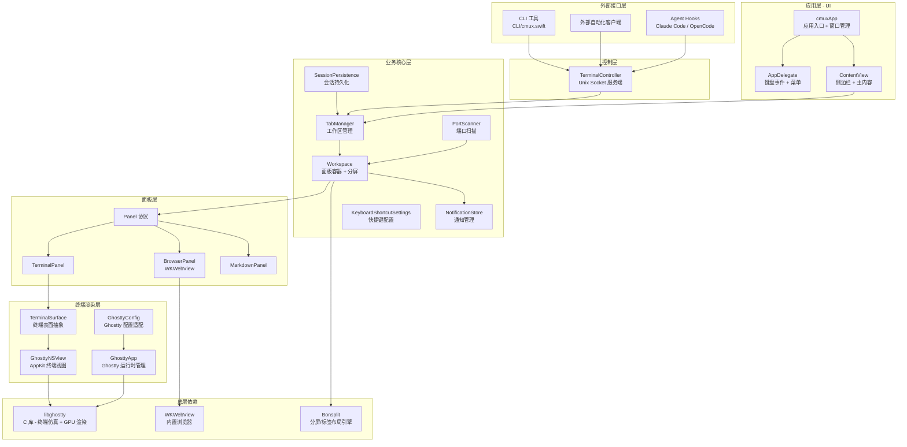
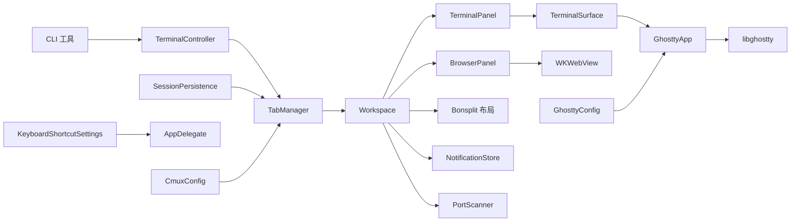
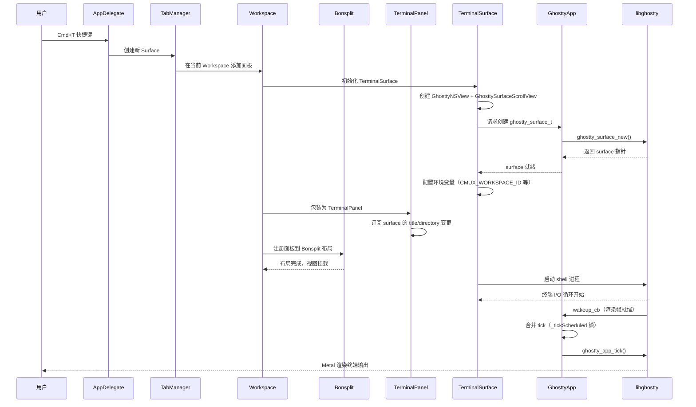
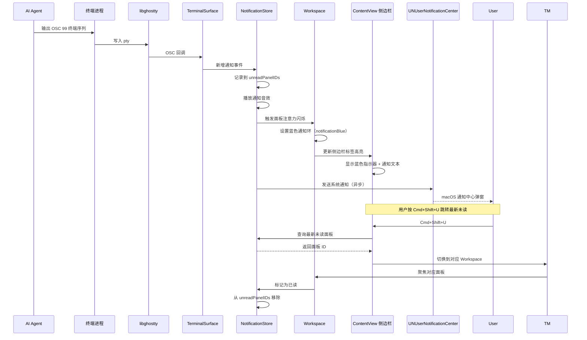

# cmux 源码学习笔记

> 仓库地址：[cmux](https://github.com/manaflow-ai/cmux)
> 学习日期：2026-04-05

---

> **以下为 AI 源码分析**
>
> ### 一句话概括
>
> cmux 是一个基于 Ghostty 的原生 macOS 终端应用，专为 AI coding agent 并行工作场景设计，提供垂直标签页、通知系统、内置浏览器和 Unix socket 控制 API。
>
> ### 要点速览
>
> | 核心模块 | 职责 | 关键文件 |
> |---------|------|---------|
> | GhosttyApp | 封装 libghostty 运行时，管理终端渲染引擎生命周期 | `Sources/GhosttyTerminalView.swift` |
> | TabManager | Workspace（工作区）的 CRUD 与切换管理 | `Sources/TabManager.swift` |
> | Workspace | 单个工作区内的 Panel 布局（分屏、标签页） | `Sources/Workspace.swift` |
> | Panel 体系 | Terminal / Browser / Markdown 三种面板的统一抽象 | `Sources/Panels/` |
> | TerminalController | Unix socket 服务端，提供 CLI/外部自动化控制 | `Sources/TerminalController.swift` |
> | 通知系统 | 捕获 OSC 9/99/777 终端序列，提供蓝色环和侧边栏提示 | `Sources/TerminalNotificationStore.swift` |
> | SessionPersistence | 窗口/工作区/面板布局的持久化与恢复 | `Sources/SessionPersistence.swift` |
> | Update 模块 | 基于 Sparkle 的自动更新系统 | `Sources/Update/` |

---

## 项目简介

cmux 是由 Manaflow AI 开发的原生 macOS 终端应用，使用 Swift/AppKit 构建（非 Electron）。它基于 Ghostty 的 libghostty 库进行 GPU 加速终端渲染，专门解决开发者同时运行多个 AI coding agent（如 Claude Code、Codex）时的管理痛点：原生 macOS 通知缺乏上下文、标签页过多无法辨识、缺少自动化控制接口。cmux 提供垂直侧边栏标签页（显示 git 分支、PR 状态、监听端口、通知文本）、蓝色通知环提示 agent 等待输入、内置可脚本化浏览器、SSH 远程工作区、以及完整的 CLI/Unix socket 控制 API，让开发者构建自己的 agent 工作流。

## 技术栈

| 类别 | 技术 |
|------|------|
| 语言 | Swift (主体), Zig (GhosttyKit 构建), Go (远程 daemon), TypeScript (文档站) |
| 框架 | AppKit + SwiftUI (混合), Bonsplit (分屏布局库), libghostty (终端渲染) |
| 构建工具 | Xcode / xcodebuild, Zig Build System, Swift Package Manager |
| 依赖管理 | Swift Package Manager (`Package.swift`), Git Submodules (ghostty, bonsplit) |
| 测试框架 | XCTest (单元/UI 测试), Python (socket 端到端测试) |

## 目录结构

```
cmux/
├── Sources/                    # Swift 主应用源码
│   ├── cmuxApp.swift           # 应用入口、窗口管理、菜单配置
│   ├── AppDelegate.swift       # NSApplicationDelegate，键盘事件监听
│   ├── TabManager.swift        # 工作区管理器（增删切换排序）
│   ├── Workspace.swift         # 单个工作区（Panel 容器、分屏、状态元数据）
│   ├── ContentView.swift       # 侧边栏 + 工作区内容视图（SwiftUI）
│   ├── GhosttyTerminalView.swift  # Ghostty 终端渲染核心（GhosttyApp/TerminalSurface/GhosttyNSView）
│   ├── GhosttyConfig.swift     # 读取 ~/.config/ghostty/config 的配置适配
│   ├── TerminalController.swift   # Unix socket 控制服务端
│   ├── TerminalNotificationStore.swift  # 通知存储与分发
│   ├── SessionPersistence.swift   # 会话持久化（布局恢复）
│   ├── PortScanner.swift       # 批量端口扫描（侧边栏展示监听端口）
│   ├── KeyboardShortcutSettings.swift  # 可自定义快捷键系统
│   ├── CmuxConfig.swift        # cmux.json 自定义命令解析
│   ├── Panels/                 # 面板子系统
│   │   ├── Panel.swift         # Panel 协议定义
│   │   ├── TerminalPanel.swift # 终端面板实现
│   │   ├── BrowserPanel.swift  # 浏览器面板实现（WKWebView）
│   │   └── BrowserPanelView.swift  # 浏览器面板视图
│   ├── Update/                 # Sparkle 自动更新系统
│   └── Find/                   # 终端/浏览器查找功能
├── CLI/
│   └── cmux.swift              # CLI 工具入口（通过 socket 与 app 通信）
├── daemon/remote/              # 远程 SSH daemon（Go 语言）
│   └── cmd/cmuxd-remote/       # Go 二进制，SSH 工作区的远程代理
├── vendor/bonsplit/            # Git submodule：分屏/标签页布局引擎
├── ghostty/                    # Git submodule：Ghostty fork（libghostty 终端渲染）
├── Resources/                  # Info.plist、shell-integration、terminfo
├── web/                        # Next.js 文档站点
├── tests/                      # Python socket 测试（v1 协议）
├── tests_v2/                   # Python socket 测试（v2 JSON-RPC）
├── cmuxTests/                  # XCTest 单元测试
├── cmuxUITests/                # XCTest UI 测试
└── scripts/                    # 构建/测试/发布脚本
```

## 架构设计

### 整体架构

cmux 采用经典的 macOS 原生应用分层架构。最底层是 libghostty（C 库）提供终端仿真和 GPU 渲染；中间层是 Swift 封装的 `GhosttyApp` 单例管理运行时生命周期；上层是 AppKit + SwiftUI 混合 UI，通过 `TabManager` → `Workspace` → `Panel` 的层次结构组织界面。独立的 `TerminalController` 通过 Unix domain socket 暴露控制 API，CLI 工具和外部自动化客户端均通过此 socket 与应用通信。



### 核心模块

#### 1. GhosttyApp — 终端渲染引擎封装

- **职责**：封装 libghostty C 库的运行时，管理 `ghostty_app_t` 和 `ghostty_config_t` 生命周期，处理终端 I/O 回调（剪贴板读写、wakeup tick 合并）
- **核心文件**：`Sources/GhosttyTerminalView.swift`（约 6000+ 行）
- **关键类/函数**：
  - `GhosttyApp.shared` — 全局单例，持有 `ghostty_app_t`
  - `TerminalSurface` — 单个终端表面的抽象，持有 `ghostty_surface_t` 指针，管理搜索状态、端口分配、键盘输入
  - `GhosttyNSView` — AppKit NSView 子类，桥接 Ghostty 的 Metal 渲染到 macOS 窗口
  - `GhosttySurfaceScrollView` — 滚动容器
- **设计要点**：I/O 线程的 wakeup 回调通过 `_tickScheduled` 锁合并，避免每秒数千次 main queue dispatch

#### 2. TabManager — 工作区管理

- **职责**：管理所有 Workspace 的生命周期（创建、删除、切换、排序、固定），处理工作区放置策略
- **核心文件**：`Sources/TabManager.swift`
- **关键类/函数**：
  - `NewWorkspacePlacement` 枚举（Top / AfterCurrent / End）
  - `WorkspacePlacementSettings.insertionIndex()` — 计算新工作区插入位置
  - `WorkspaceAutoReorderSettings` — 通知触发的自动重排序
  - `SidebarActiveTabIndicatorStyle` — 侧边栏活动标签指示样式

#### 3. Workspace — 工作区与面板容器

- **职责**：单个工作区内的所有面板管理，使用 Bonsplit 库实现分屏/标签页布局，维护 git 分支、端口、通知、状态条等元数据
- **核心文件**：`Sources/Workspace.swift`
- **关键类/函数**：
  - `CmuxSurfaceConfigTemplate` — 终端 surface 配置模板（字体大小、工作目录、环境变量）
  - `SidebarStatusEntry` — 侧边栏状态条目（key/value/icon/color）
  - `WorkspaceRemoteDaemonManifest` — SSH 远程工作区的 daemon 清单
  - `sessionSnapshot()` — 将工作区状态序列化为持久化快照

#### 4. Panel 体系 — 统一面板抽象

- **职责**：定义 Terminal / Browser / Markdown 三种面板类型的统一协议
- **核心文件**：`Sources/Panels/Panel.swift`, `TerminalPanel.swift`, `BrowserPanel.swift`
- **关键接口**：
  - `Panel` 协议 — 定义 `id`、`panelType`、`displayTitle`、`isDirty`、`close()`、`focus()`、`triggerFlash()` 等
  - `PanelType` 枚举 — `.terminal` / `.browser` / `.markdown`
  - `PanelFocusIntent` — 面板焦点意图（terminal surface / browser webView / address bar / find field）
  - `WorkspaceAttentionFlashPresentation` — 面板注意力闪烁（蓝色通知 / 青色导航）

#### 5. TerminalController — Socket 控制服务端

- **职责**：Unix domain socket 服务端，接收 CLI 和外部客户端的命令，支持 v1 文本协议和 v2 JSON-RPC 协议
- **核心文件**：`Sources/TerminalController.swift`
- **关键设计**：
  - `SocketControlMode` — 五种安全模式（Off / CmuxOnly / Automation / Password / AllowAll）
  - Socket 命令线程策略：高频遥测命令在后台线程处理，UI 操作命令在 main actor 执行
  - Socket 焦点策略：非焦点命令不会抢占 macOS 应用焦点

#### 6. 通知系统

- **职责**：捕获终端 OSC 9/99/777 序列和 `cmux notify` CLI 命令，管理未读状态，触发蓝色通知环和侧边栏标签高亮
- **核心文件**：`Sources/TerminalNotificationStore.swift`
- **关键设计**：
  - `NotificationSoundSettings` — 支持系统音效、自定义音效文件、自定义命令
  - `UNUserNotificationCenter` 扩展 — 异步移除通知避免 XPC 阻塞主线程
  - 每个面板独立的 `unreadPanelIDs` 跟踪

### 模块依赖关系



## 核心流程

### 流程一：终端面板创建与渲染

从用户按下 `Cmd+T`（新建 Surface）到终端可交互的完整流程：



### 流程二：通知捕获与展示

当 AI coding agent 触发通知（如 Claude Code 等待用户输入）的完整处理流程：



## 关键设计亮点

### 1. libghostty 的 Wakeup Tick 合并

- **解决的问题**：libghostty 的 I/O 线程在大量终端输出时每秒可能触发数千次 wakeup 回调，如果每次都 dispatch 到主线程会导致严重的 UI 卡顿
- **实现方式**：`GhosttyApp` 使用 `_tickScheduled` 布尔值 + `NSLock` 进行合并。wakeup 回调只在没有 pending tick 时才 dispatch 一次 `DispatchQueue.main.async`，确保主线程上始终只有一个待执行的 tick（`Sources/GhosttyTerminalView.swift:960`）
- **设计原因**：在不引入节流延迟的前提下最大化吞吐量——任何新 wakeup 都会被已排队的 tick 覆盖

### 2. 类型安全的 Panel 协议与 Bonsplit 集成

- **解决的问题**：需要在同一个分屏布局中统一管理 Terminal、Browser、Markdown 三种完全不同的面板类型
- **实现方式**：定义 `Panel` 协议（`Sources/Panels/Panel.swift:220`）要求所有面板实现统一的 `id`、`panelType`、`focus()`、`close()`、`triggerFlash()` 等接口。通过 `PanelFocusIntent` 枚举区分不同面板的焦点语义（terminal 的 surface vs browser 的 webView vs address bar）
- **设计原因**：让 Workspace 和 Bonsplit 布局引擎无需关心面板具体类型，实现 OCP（对扩展开放、对修改关闭）

### 3. Socket 控制的分层安全模型

- **解决的问题**：需要同时支持 app 内部 CLI 调用、外部自动化脚本、SSH 远程转发等不同信任级别的客户端
- **实现方式**：`SocketControlMode` 五级安全模式（`Sources/SocketControlSettings.swift`）——Off 完全关闭、CmuxOnly 只允许 cmux 进程树内的调用、Automation 允许同用户本地进程、Password 要求 HMAC 认证、AllowAll 全开放。配合 `SocketControlPasswordStore` 的文件密码 + 已弃用 Keychain 迁移
- **设计原因**：Unix socket 默认开放给所有本地进程，但 AI agent 场景需要精细化的访问控制以防止意外的跨会话干扰

### 4. 打字延迟敏感路径的性能守卫

- **解决的问题**：在 macOS 应用中，每次键盘事件都会触发大量视图更新链路，稍有不慎就会引入可感知的打字延迟
- **实现方式**：在 CLAUDE.md 中明确标记三条性能敏感路径并设立代码准则——`hitTest()` 将非指针事件短路返回、`TabItemView` 使用 `Equatable` + `.equatable()` 跳过 SwiftUI body 重算、`forceRefresh()` 禁止分配/IO/格式化。DEBUG 构建有完整的 `CmuxTypingTiming` 探针记录事件延迟和处理耗时（`Sources/AppDelegate.swift:76`）
- **设计原因**：作为终端应用，打字延迟是用户最直接感知的性能指标，必须在架构层面设防

### 5. SSH 远程工作区的认证中继架构

- **解决的问题**：`cmux ssh` 需要让远程机器上的 CLI 命令安全地控制本地应用，同时浏览器面板需要通过远程网络路由
- **实现方式**：本地 app 启动一个 loopback relay server，通过 SSH 反向端口转发（`ssh -N -R`）暴露给远程。远程 Go daemon（`daemon/remote/cmd/cmuxd-remote/`）实现 busybox 风格的多命令入口，支持 SOCKS5 + HTTP CONNECT 代理和 JSON-RPC 的 `proxy.*` 流式传输。认证使用 per-workspace 的 relay ID + HMAC-SHA256 challenge-response
- **设计原因**：远程 shell 永远不直接访问本地 Unix socket，所有流量经过认证中继，既安全又支持多实例并存
