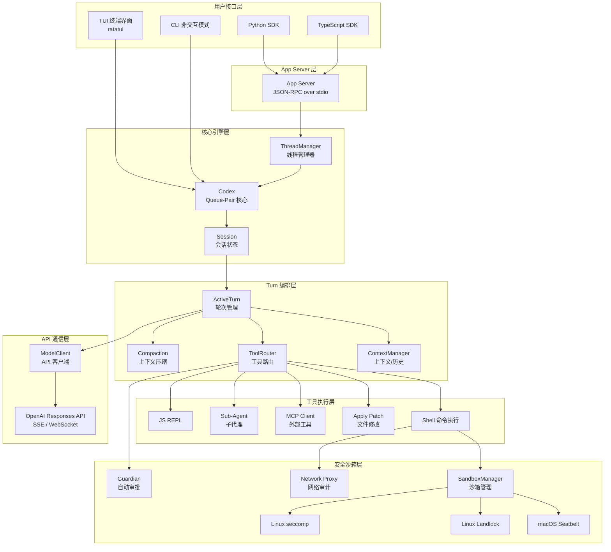
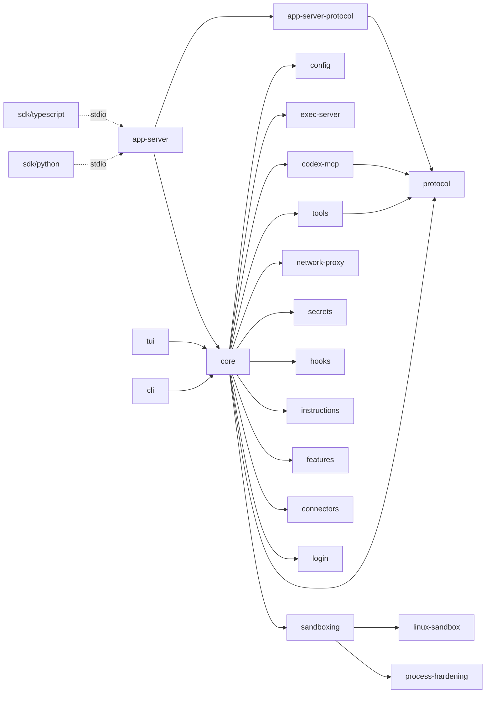
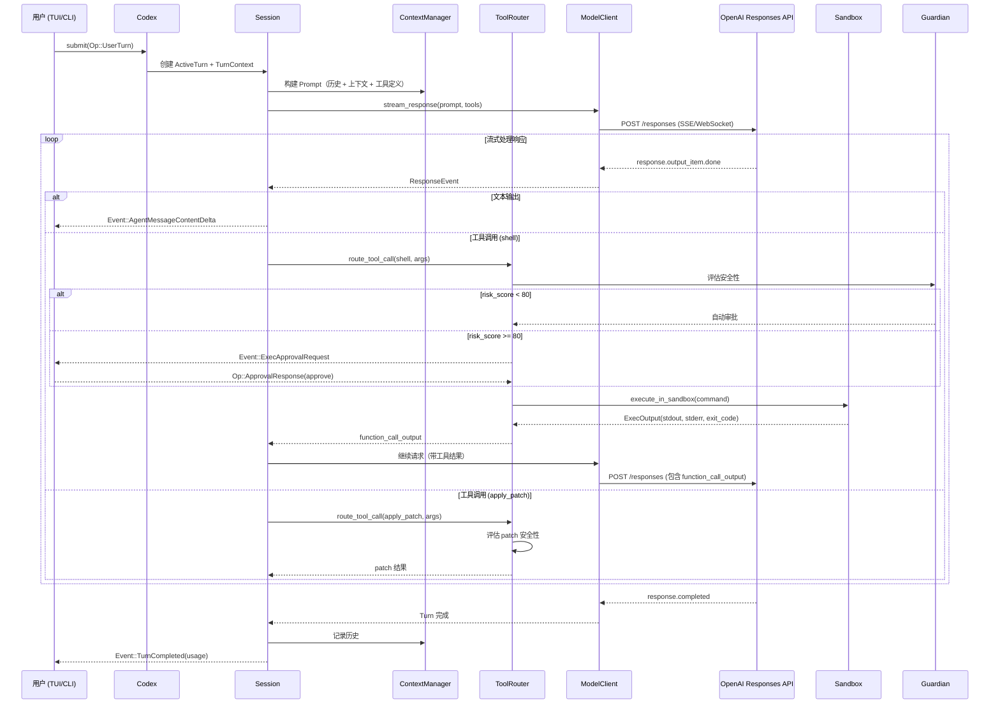
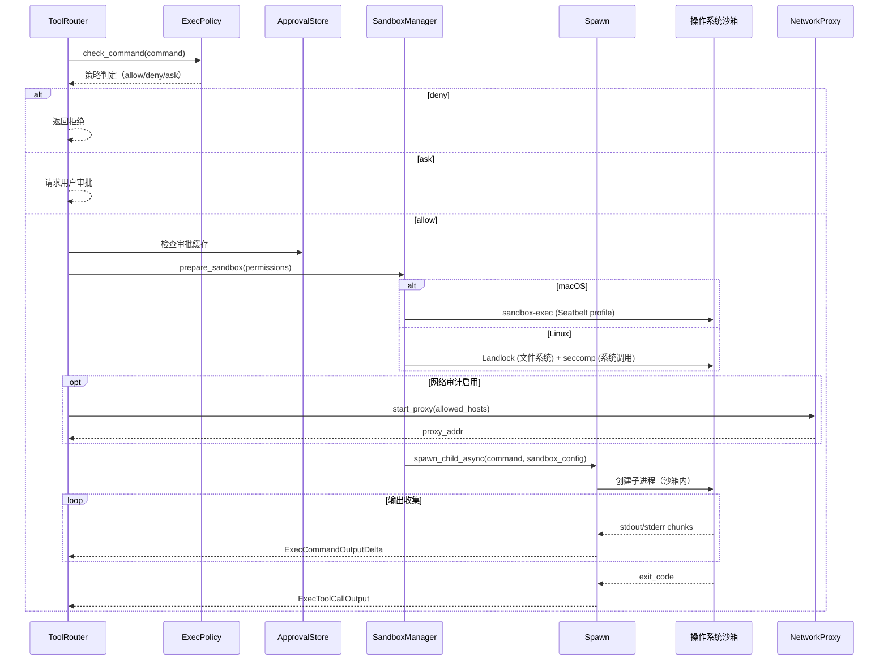

# openai/codex 源码学习笔记

> 仓库地址：[openai/codex](https://github.com/openai/codex)
> 学习日期：2026-04-05

---

> **以下为 AI 源码分析**
>
> ### 一句话概括
>
> OpenAI Codex CLI 是一个本地运行的 AI 编程助手，通过沙箱化命令执行和 OpenAI Responses API 实现安全的自主编码能力。
>
> ### 要点速览
>
> | 核心模块 | 职责 | 关键文件/目录 |
> |----------|------|---------------|
> | `codex-rs/core` | 会话管理、Turn 编排、工具路由、上下文管理 | `core/src/codex.rs`, `core/src/tools/` |
> | `codex-rs/tui` | 终端交互界面（ratatui） | `tui/src/app.rs`, `tui/src/chatwidget.rs` |
> | `codex-rs/cli` | CLI 入口、命令行参数解析 | `cli/src/main.rs` |
> | `codex-rs/protocol` | 事件/操作协议类型定义 | `protocol/src/protocol.rs` |
> | `codex-rs/tools` | 工具定义（shell、apply-patch、MCP 等） | `tools/src/lib.rs` |
> | `codex-rs/sandboxing` | 跨平台沙箱抽象层 | `sandboxing/src/` |
> | `codex-rs/exec` | 命令执行引擎 | `core/src/exec.rs` |
> | `codex-rs/app-server` | App Server（SDK 通信协议） | `app-server-protocol/src/` |
> | `sdk/python` | Python SDK | `sdk/python/src/codex_app_server/` |
> | `sdk/typescript` | TypeScript SDK | `sdk/typescript/src/` |

---

## 项目简介

OpenAI Codex CLI 是 OpenAI 推出的本地编程 Agent 工具。它运行在用户本地计算机上，通过 OpenAI 的 Responses API 与大语言模型交互，能够理解代码库、执行 shell 命令、修改文件，从而协助开发者完成编码任务。项目的核心价值在于：将 AI 编程能力下沉到本地终端，通过多层沙箱机制保障安全性，同时提供丰富的工具生态（MCP 协议、插件系统）和多种交互方式（TUI、CLI、SDK 嵌入）。

## 技术栈

| 类别 | 技术 |
|------|------|
| 语言 | Rust（主体）、TypeScript（旧版 CLI、TS SDK）、Python（Python SDK） |
| 框架 | ratatui（TUI）、tokio（异步运行时）、axum（HTTP 服务） |
| 构建工具 | Cargo + Bazel（Rust）、pnpm（TypeScript）、hatch（Python） |
| 依赖管理 | Cargo workspace（90+ crate）、pnpm workspace |
| 测试框架 | cargo-nextest + insta（快照测试）、wiremock（HTTP mock）、jest（TS） |

## 目录结构

```
codex/
├── codex-rs/                    # Rust 核心代码（Cargo workspace）
│   ├── cli/                     # CLI 二进制入口
│   ├── tui/                     # 终端 UI（ratatui）
│   ├── core/                    # 核心引擎（会话、Turn、工具编排）
│   ├── protocol/                # 协议类型定义（Event、Op、Items）
│   ├── tools/                   # 工具定义与序列化
│   ├── config/                  # 配置加载与类型
│   ├── connectors/              # LLM 提供商连接器
│   ├── codex-mcp/               # MCP 客户端实现
│   ├── mcp-server/              # MCP 服务端实现
│   ├── exec-server/             # 统一执行服务器
│   ├── sandboxing/              # 跨平台沙箱抽象
│   ├── linux-sandbox/           # Linux 沙箱（Landlock + seccomp）
│   ├── process-hardening/       # macOS 沙箱（Seatbelt）
│   ├── network-proxy/           # 网络代理审计
│   ├── secrets/                 # 密钥检测
│   ├── app-server/              # App Server（SDK 后端）
│   ├── app-server-protocol/     # App Server JSON-RPC 协议
│   ├── plugin/                  # 插件系统
│   ├── instructions/            # AGENTS.md 加载
│   ├── hooks/                   # 钩子系统
│   ├── features/                # Feature flag 管理
│   └── utils/                   # 工具集（路径、缓存、PTY 等）
├── codex-cli/                   # 旧版 TypeScript CLI（渐被 Rust 替代）
├── sdk/
│   ├── python/                  # Python SDK（codex-app-server）
│   └── typescript/              # TypeScript SDK（@openai/codex-sdk）
├── docs/                        # 文档
├── scripts/                     # 构建/发布脚本
└── .github/                     # CI/CD workflows
```

## 架构设计

### 整体架构

Codex CLI 采用**事件驱动的 Queue-Pair 架构**：核心 `Codex` 结构体作为双向消息队列，上游（TUI/CLI/SDK）通过提交 `Op`（操作）驱动系统，下游通过接收 `Event`（事件）获取结果。整个系统围绕"会话-轮次-工具调用"三层结构组织，Turn 内部通过异步 Task 并发执行工具调用。



### 核心模块

#### 1. Codex 核心引擎（`codex-rs/core/src/codex.rs`）

**职责**：系统的中枢，管理会话生命周期和 Turn 编排。

- **核心文件**：
  - `codex.rs` — `Codex` 结构体定义，`spawn()` 初始化，`submit()` 提交操作
  - `codex_thread.rs` — `CodexThread` 对外接口封装
  - `thread_manager.rs` — `ThreadManager` 多线程（对话）管理
  - `state/session.rs` — `SessionState` 会话级状态
  - `state/turn.rs` — `ActiveTurn` 轮次级状态

- **关键接口**：
  - `Codex::spawn()` — 创建新会话，初始化所有子系统
  - `Codex::submit(Op)` — 提交用户操作（消息、审批响应等）
  - `Codex::next_event()` — 接收系统事件
  - `ThreadManager::new_thread()` — 创建新对话线程

- **设计模式**：`Codex` 使用 `async_channel` 的 `Sender<Submission>` / `Receiver<Event>` 组成双向队列，内部有一个后台 submission loop 处理所有操作。

```rust
pub struct Codex {
    pub(crate) tx_sub: Sender<Submission>,    // 提交操作
    pub(crate) rx_event: Receiver<Event>,      // 接收事件
    pub(crate) agent_status: watch::Receiver<AgentStatus>,
    pub(crate) session: Arc<Session>,
    pub(crate) session_loop_termination: SessionLoopTermination,
}
```

#### 2. 协议层（`codex-rs/protocol/`）

**职责**：定义系统中所有通信的类型契约。

- **核心文件**：
  - `protocol.rs` — `Op`（操作枚举）和 `Event`（事件枚举）
  - `items.rs` — `TurnItem`、`UserMessageItem` 等业务实体
  - `models.rs` — `ResponseItem`、`ContentItem` 等 API 模型映射
  - `approvals.rs` — 审批相关类型
  - `permissions.rs` — 沙箱权限策略

- **关键类型**：
  - `Op` — 用户发起的操作（`UserTurn`、`ApprovalResponse`、`Abort` 等）
  - `Event` — 系统发出的事件（`TurnStarted`、`ItemCompleted`、`ExecApprovalRequest` 等）
  - `ResponseItem` — 对应 Responses API 的响应项

#### 3. 工具系统（`codex-rs/tools/` + `codex-rs/core/src/tools/`）

**职责**：定义、注册、路由和执行所有工具调用。

- **核心文件**：
  - `tools/src/local_tool.rs` — Shell 命令工具定义
  - `tools/src/apply_patch_tool.rs` — 文件修改工具（apply_patch）
  - `tools/src/agent_tool.rs` — 子 Agent 工具（spawn、wait、send）
  - `tools/src/mcp_tool.rs` — MCP 工具桥接
  - `core/src/tools/router.rs` — `ToolRouter` 路由分发
  - `core/src/tools/registry.rs` — `ToolRegistry` 注册与查找
  - `core/src/tools/parallel.rs` — `ToolCallRuntime` 并发执行

- **工具类型**：
  - **Shell** — 执行 shell 命令（`create_shell_tool`）
  - **Apply Patch** — 修改文件（freeform/JSON 两种格式）
  - **MCP Tools** — 通过 MCP 协议调用外部工具
  - **Agent Tools** — 生成/管理子 Agent（spawn_agent、wait_agent、send_message）
  - **JS REPL** — JavaScript 代码执行
  - **Request User Input** — 向用户请求输入
  - **Plan Tool** — 更新执行计划
  - **Dynamic Tools** — 运行时动态注册的工具

#### 4. 沙箱安全系统

**职责**：确保 AI 执行的命令不会造成安全风险。

- **核心文件**：
  - `sandboxing/src/` — 跨平台沙箱抽象（`SandboxManager`、`SandboxType`）
  - `process-hardening/src/` — macOS Seatbelt sandbox-exec 集成
  - `linux-sandbox/src/` — Linux Landlock + seccomp-bpf
  - `network-proxy/src/` — 网络请求审计代理
  - `core/src/guardian/` — Guardian 自动审批系统
  - `core/src/safety.rs` — 安全检查逻辑

- **沙箱层次**：
  1. **文件系统隔离** — 限制可读写的目录范围
  2. **网络控制** — 可完全禁用网络或通过代理审计
  3. **进程限制** — seccomp 限制系统调用
  4. **审批机制** — 根据策略决定自动批准、用户审批或拒绝

- **Guardian 系统**：使用独立的 LLM 会话评估命令风险，为 `risk_score < 80` 的操作自动审批，超时或解析失败时默认拒绝（fail-closed）。

#### 5. 上下文管理（`codex-rs/core/src/context_manager/`）

**职责**：管理对话历史和 token 预算。

- **核心文件**：
  - `history.rs` — `ContextManager` 维护有序的 `ResponseItem` 列表
  - `normalize.rs` — 历史项规范化
  - `updates.rs` — 上下文增量更新

- **关键能力**：
  - Token 用量跟踪和预算管理
  - 自动压缩（Compaction）— 当上下文接近窗口上限时，调用 LLM 生成摘要替换历史
  - 支持本地压缩和远程压缩（OpenAI 端）两种模式

#### 6. App Server 与 SDK（`codex-rs/app-server*` + `sdk/`）

**职责**：提供编程接口，让外部应用嵌入 Codex Agent。

- **通信协议**：JSON-RPC v2 over stdio
- **Python SDK**：`codex-app-server` 包，提供 `Codex` 和 `Thread` 高级 API
- **TypeScript SDK**：`@openai/codex-sdk` 包，提供 `Codex`、`Thread` 和流式事件

```python
# Python SDK 示例
from codex_app_server import Codex
with Codex() as codex:
    thread = codex.thread_start(model="gpt-5")
    result = thread.run("Fix the bug")
    print(result.final_response)
```

### 模块依赖关系



## 核心流程

### 流程一：用户输入到 AI 响应的完整 Turn 生命周期

这是 Codex 最核心的流程——从用户发送一条消息到 AI 完成所有工具调用并返回最终回复。



**关键逻辑说明**：

1. **Prompt 构建**：每个 Turn 开始时，`ContextManager` 将全部对话历史 + 初始上下文（系统指令、AGENTS.md、工具定义、环境信息）组装为 Responses API 的 `input` 参数。
2. **流式处理**：通过 SSE 或 WebSocket 接收流式响应，支持文本增量输出和工具调用。
3. **工具调用循环**：模型可能在一个 Turn 中发起多次工具调用，每次工具的输出会作为新的 `function_call_output` 送回 API 继续生成。
4. **并发执行**：`ToolCallRuntime` 支持同一 Turn 内多个工具调用的并发执行（通过 `FuturesOrdered`）。
5. **上下文压缩**：当 token 用量接近模型窗口上限时，自动触发 Compaction，用摘要替换历史记录。

### 流程二：沙箱化命令执行

这是保障安全性的关键流程——如何在受限环境中执行 AI 生成的 shell 命令。



**关键逻辑说明**：

1. **ExecPolicy**：基于用户配置的规则（TOML 格式）判定命令是否被允许执行，支持通配符匹配和正则表达式。
2. **审批策略**（`AskForApproval` 枚举）：
   - `Never` — 永不询问，沙箱内自动执行
   - `OnFailure` — 失败时询问
   - `OnRequest` — 按需询问（可配合 Guardian 自动审批）
   - `UnlessTrusted` — 除信任命令外均询问
3. **平台沙箱**：
   - **macOS**：通过 `sandbox-exec` 生成 Seatbelt profile，限制文件系统和网络访问
   - **Linux**：Landlock 限制文件系统路径，seccomp-bpf 限制系统调用
4. **Network Proxy**：可选的 HTTP/HTTPS 代理，记录所有出站请求并按白名单放行/拒绝
5. **输出限制**：`DEFAULT_OUTPUT_BYTES_CAP` 防止单个命令 OOM，超时默认 10 秒，输出增量通过事件流传输

## 关键设计亮点

### 1. Queue-Pair 事件驱动架构

**解决的问题**：需要一种灵活的方式将核心引擎与多种 UI（TUI、CLI、SDK）解耦。

**实现方式**：`Codex` 结构体由 `Sender<Submission>` 和 `Receiver<Event>` 组成双向异步通道。上游通过 `submit(Op)` 发送操作，通过 `next_event()` 接收事件。核心引擎在后台 tokio task 中运行 submission loop，处理操作并生成事件。

**为什么这样设计**：这种设计使得 TUI、CLI、App Server 都可以用统一的方式驱动同一个引擎，且天然支持异步和并发。`ThreadManager` 在此之上管理多个 `Codex` 实例，实现多会话并发。

关键代码：`codex-rs/core/src/codex.rs`

### 2. 多层安全沙箱体系

**解决的问题**：AI 生成的命令可能危害系统安全，需要多层防护。

**实现方式**：
- **策略层**：`ExecPolicy`（TOML 规则）决定是否执行
- **审批层**：`Guardian`（LLM 风险评估）+ 用户手动审批
- **OS 隔离层**：macOS Seatbelt / Linux Landlock+seccomp
- **网络层**：`NetworkProxy` 审计出站流量
- **密钥层**：`secrets` 模块检测输出中的敏感信息

**为什么这样设计**：纵深防御（Defense in Depth）策略。任何单层被绕过时，其他层仍然有效。Guardian 系统通过 LLM 评估降低用户审批疲劳，同时 fail-closed 设计确保不确定情况下默认安全。

关键代码：`codex-rs/sandboxing/src/`、`codex-rs/core/src/guardian/`

### 3. 上下文自动压缩（Compaction）

**解决的问题**：长对话会超出模型的 context window 限制。

**实现方式**：`ContextManager` 跟踪 token 用量。当接近上限时，自动触发 Compaction：将对话历史发送给 LLM 生成摘要，然后用摘要替换原始历史。支持两种模式：
- **本地 Compaction**：由 Codex 自身调用 LLM 生成摘要
- **远程 Compaction**：由 OpenAI 服务端执行压缩

**为什么这样设计**：让用户无感知地进行超长对话，同时保留关键上下文信息。远程压缩可以利用服务端优化，本地压缩则兼容第三方模型。

关键代码：`codex-rs/core/src/compact.rs`、`codex-rs/core/src/compact_remote.rs`

### 4. MCP 协议集成与插件生态

**解决的问题**：需要扩展 Agent 的能力边界，连接外部工具和数据源。

**实现方式**：
- **MCP Client**（`codex-mcp/`）：连接用户配置的 MCP Server，将其工具注册到 `ToolRouter`
- **MCP Server**（`mcp-server/`）：将 Codex 自身暴露为 MCP Server，供其他系统调用
- **Plugin System**（`plugin/`）：支持运行时发现和加载插件
- **Connectors**（`connectors/`）：连接 ChatGPT App Store 中的应用

**为什么这样设计**：MCP 是行业标准协议，集成后 Codex 可以利用整个 MCP 生态的工具。同时将自身暴露为 MCP Server 实现了双向互操作。

关键代码：`codex-rs/codex-mcp/src/`、`codex-rs/mcp-server/src/`

### 5. 子 Agent 系统（Hierarchical Agents）

**解决的问题**：复杂任务需要拆分为独立子任务并行执行。

**实现方式**：通过 `spawn_agent` 工具创建子 Agent，每个子 Agent 是一个独立的 `Codex` 会话，有自己的 ThreadId 和沙箱环境。父 Agent 通过 `Mailbox` 与子 Agent 通信，子 Agent 完成后结果回传。支持深度限制防止无限递归。

**为什么这样设计**：将大任务拆分为独立子任务可以并行执行，提高效率。独立的会话确保子 Agent 的错误不会影响父 Agent。Mailbox 机制实现了松耦合的 Agent 间通信。

关键代码：`codex-rs/core/src/agent/`、`codex-rs/tools/src/agent_tool.rs`
