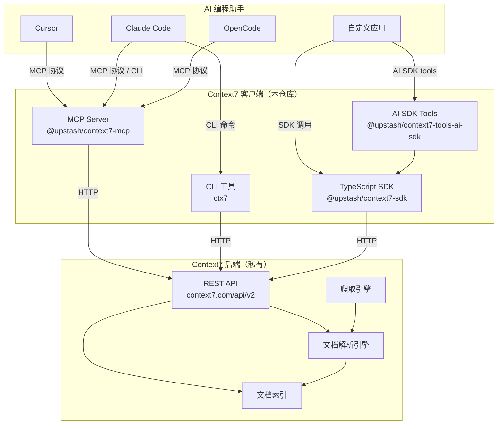
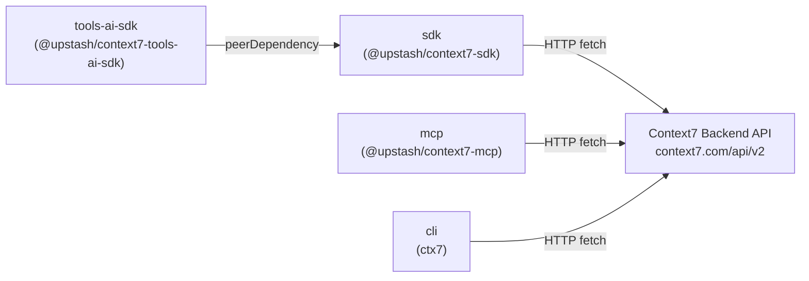
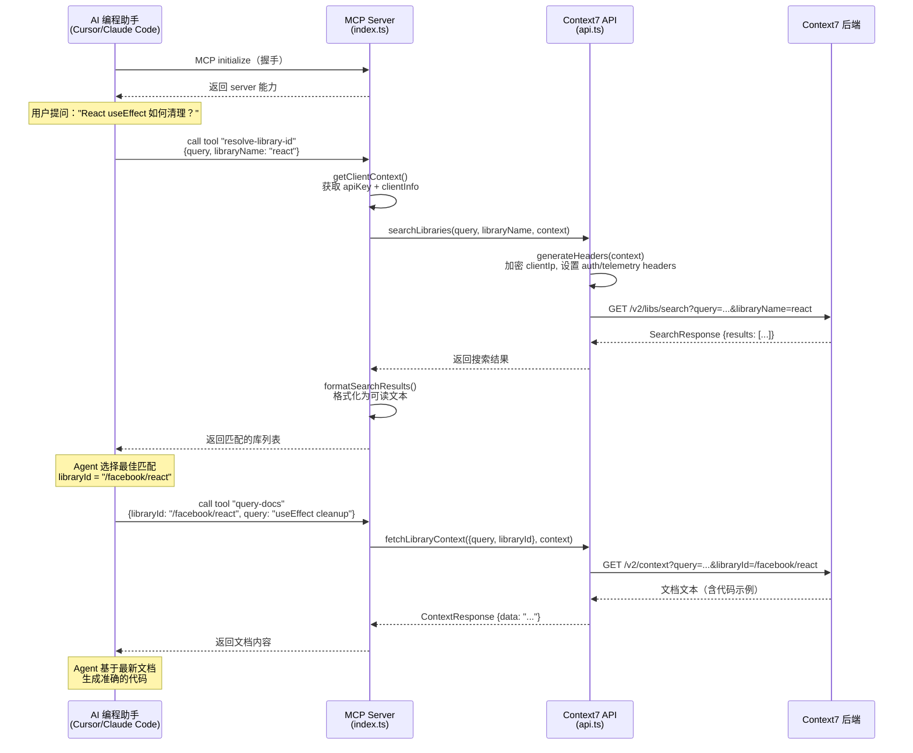
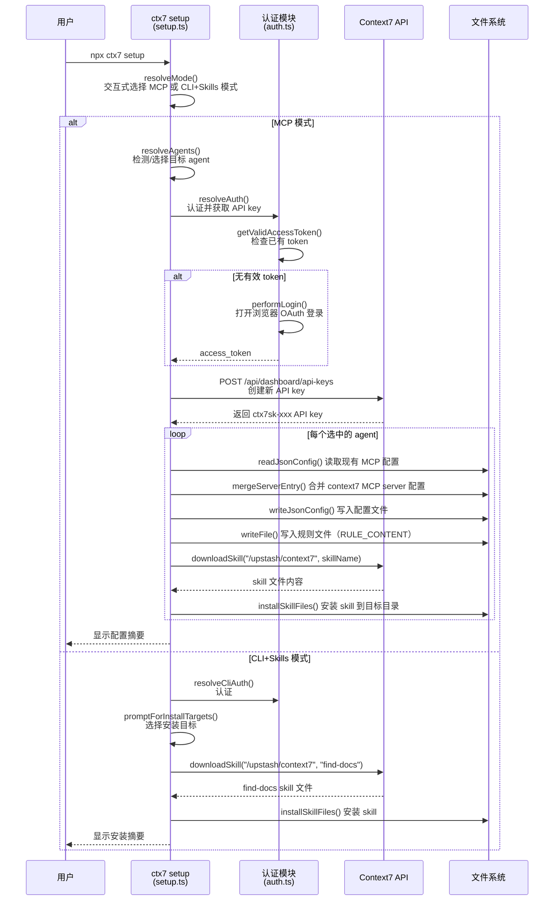

# context7 源码学习笔记

> 仓库地址：[context7](https://github.com/upstash/context7)
> 学习日期：2026-03-22

---

> **以下为 AI 源码分析**
>
> ### 一句话概括
>
> Context7 是一个为 AI 编程助手提供实时、版本准确的库文档和代码示例的平台，通过 MCP Server、CLI、SDK 和 Vercel AI SDK 四种接入方式将最新文档注入 LLM 上下文。
>
> ### 要点速览
>
> | 核心模块 | 职责 | 关键文件 |
> |---------|------|---------|
> | **MCP Server** (`@upstash/context7-mcp`) | 提供 MCP 协议接口，支持 stdio 和 HTTP 两种 transport | `packages/mcp/src/index.ts` |
> | **CLI** (`ctx7`) | 命令行工具，管理 skills、查询文档、一键 setup | `packages/cli/src/index.ts` |
> | **SDK** (`@upstash/context7-sdk`) | TypeScript SDK，封装 Context7 REST API | `packages/sdk/src/client.ts` |
> | **AI SDK Tools** (`@upstash/context7-tools-ai-sdk`) | Vercel AI SDK 集成，提供 tools 和 agent | `packages/tools-ai-sdk/src/index.ts` |

---

## 项目简介

Context7 解决了 AI 编程助手（如 Cursor、Claude Code）在生成代码时依赖过时训练数据的问题。LLM 经常会产生已废弃的 API 调用或根本不存在的幻觉 API。Context7 通过实时从源头拉取最新的、版本特定的文档和代码示例，直接注入到 LLM 的 prompt 上下文中，确保 AI 生成的代码基于准确的当前文档。

该仓库是 Context7 平台的**客户端开源部分**，包含 MCP Server、CLI 工具、TypeScript SDK 和 Vercel AI SDK 集成。后端 API、文档解析引擎和爬取引擎是私有的，不在本仓库中。

## 技术栈

| 类别 | 技术 |
|------|------|
| 语言 | TypeScript |
| 框架 | Express（MCP HTTP transport）、Vercel AI SDK（tools-ai-sdk） |
| 构建工具 | tsc（MCP）、tsup（CLI / SDK / tools-ai-sdk） |
| 依赖管理 | pnpm workspace (monorepo) |
| 测试框架 | vitest |

## 目录结构

```
context7/
├── packages/
│   ├── mcp/                        # MCP Server - 核心 MCP 协议实现
│   │   └── src/
│   │       ├── index.ts            # 入口：注册 MCP tools，启动 stdio/HTTP server
│   │       └── lib/
│   │           ├── api.ts          # Context7 后端 API 调用封装
│   │           ├── constants.ts    # 版本号、API URL 等常量
│   │           ├── encryption.ts   # Client IP 加密 & HTTP headers 生成
│   │           ├── jwt.ts          # JWT 验证（Clerk JWKS）
│   │           ├── types.ts        # SearchResult、ContextRequest 等类型定义
│   │           └── utils.ts        # 搜索结果格式化、User-Agent 解析
│   ├── cli/                        # CLI 工具 (ctx7)
│   │   └── src/
│   │       ├── index.ts            # 入口：注册所有命令
│   │       ├── commands/           # 子命令：setup、docs、skill、auth、generate
│   │       ├── setup/              # Agent 配置模板和 MCP 配置写入
│   │       └── utils/              # API 调用、认证、IDE 检测、安装器
│   ├── sdk/                        # TypeScript SDK (@upstash/context7-sdk)
│   │   └── src/
│   │       ├── client.ts           # Context7 客户端类
│   │       ├── commands/           # Command 模式：SearchLibrary、GetContext
│   │       ├── http/               # HttpClient：重试、缓存、请求封装
│   │       ├── error/              # 错误类
│   │       └── utils/              # 格式化工具
│   └── tools-ai-sdk/              # Vercel AI SDK 集成
│       └── src/
│           ├── index.ts            # 导出 tools、agent、prompts
│           ├── tools/              # resolve-library-id、query-docs tools
│           ├── agents/             # Context7Agent（ToolLoopAgent 子类）
│           └── prompts/            # System prompt 和工具描述
├── skills/                         # Agent skills 定义（SKILL.md）
│   ├── context7-mcp/              # MCP 模式的 skill
│   ├── context7-cli/              # CLI 模式的 skill
│   └── find-docs/                 # find-docs skill（CLI 文档查找指南）
├── docs/                          # Mintlify 文档站点源文件
├── package.json                   # monorepo 根配置
└── pnpm-workspace.yaml            # pnpm workspace 配置
```

## 架构设计

### 整体架构

Context7 采用**多入口单后端**的架构模式。四个客户端包（MCP、CLI、SDK、AI SDK Tools）最终都通过 HTTP 调用同一个后端 REST API（`context7.com/api/v2/`），提供两个核心能力：库搜索（`/v2/libs/search`）和文档查询（`/v2/context`）。后端负责文档的爬取、解析、索引和智能检索，客户端只负责协议适配和用户交互。



### 核心模块

#### 1. MCP Server (`packages/mcp`)

**职责**：实现 Model Context Protocol（MCP）标准，让 AI 编程助手通过标准化协议调用文档检索能力。

**核心文件**：
- `src/index.ts` — 入口文件，注册两个 MCP tools（`resolve-library-id` 和 `query-docs`），支持 stdio 和 HTTP 两种 transport
- `src/lib/api.ts` — 封装对 Context7 后端 API 的调用，包含 `searchLibraries()` 和 `fetchLibraryContext()`
- `src/lib/encryption.ts` — `ClientContext` 接口定义和 HTTP 请求头生成，包含 client IP 的 AES-256-CBC 加密
- `src/lib/jwt.ts` — 基于 Clerk JWKS 的 JWT 验证，用于 OAuth 端点认证

**关键接口**：
- `resolve-library-id` tool — 输入 `query` + `libraryName`，返回匹配的库列表（含 ID、描述、信誉评分等）
- `query-docs` tool — 输入 `libraryId` + `query`，返回相关文档和代码示例

**与其他模块的关系**：独立运行，直接调用后端 API，不依赖 SDK。

#### 2. CLI (`packages/cli`)

**职责**：提供 `ctx7` 命令行工具，支持 skills 管理、文档查询、认证和一键 setup。

**核心文件**：
- `src/index.ts` — 使用 commander 注册所有子命令
- `src/commands/setup.ts` — 一键配置 Context7 到不同 AI agent（Cursor、Claude Code、OpenCode），自动完成 OAuth 认证、生成 API key、写入 MCP 配置和 skill 安装
- `src/commands/docs.ts` — `library` 和 `docs` 子命令，对应库搜索和文档查询
- `src/commands/skill.ts` — skills 的 install / search / list / remove / suggest / info 子命令
- `src/utils/api.ts` — CLI 的 API 调用封装，包含 skills API 和文档 API

**关键功能**：
- `ctx7 setup` — 交互式一键配置，支持 MCP 和 CLI+Skills 两种模式
- `ctx7 library <name> <query>` — 搜索库
- `ctx7 docs <libraryId> <query>` — 查询文档
- `ctx7 skills install/search/suggest` — skills 生态管理

**与其他模块的关系**：直接调用后端 API，不依赖 SDK 包。

#### 3. SDK (`packages/sdk`)

**职责**：提供 `Context7` 客户端类，封装 REST API 为类型安全的 TypeScript 接口。

**核心文件**：
- `src/client.ts` — `Context7` 类，暴露 `searchLibrary()` 和 `getContext()` 方法
- `src/commands/command.ts` — Command 基类，实现命令模式
- `src/commands/search-library/index.ts` — `SearchLibraryCommand`，封装 `/v2/libs/search`
- `src/commands/get-context/index.ts` — `GetContextCommand`，封装 `/v2/context`
- `src/http/index.ts` — `HttpClient` 实现，内置指数退避重试、缓存控制、分页 header 解析

**关键设计**：
- 采用 Command 模式将每个 API 操作封装为独立命令对象
- 支持 `json` 和 `txt` 两种响应格式
- 内置 5 次指数退避重试（`Math.exp(retryCount) * 50` ms）

**与其他模块的关系**：被 tools-ai-sdk 包依赖，作为底层 API 客户端。

#### 4. AI SDK Tools (`packages/tools-ai-sdk`)

**职责**：为 Vercel AI SDK 提供 Context7 集成，包括 tools 和预构建 agent。

**核心文件**：
- `src/tools/resolve-library-id.ts` — 包装 SDK 的 `searchLibrary()` 为 AI SDK `tool()`
- `src/tools/query-docs.ts` — 包装 SDK 的 `getContext()` 为 AI SDK `tool()`
- `src/agents/context7.ts` — `Context7Agent` 类，继承 `ToolLoopAgent`，内置两个 tools 和 agent prompt
- `src/prompts/system.ts` — 系统提示词和 agent 工作流描述

**关键设计**：
- `Context7Agent` 继承 `ToolLoopAgent`，内置 `resolveLibraryId` 和 `queryDocs` 两个 tools，最多执行 5 步
- 提供独立的 tools 函数，可直接嵌入自定义 agent

**与其他模块的关系**：依赖 `@upstash/context7-sdk` 作为底层客户端。

### 模块依赖关系



## 核心流程

### 流程一：MCP 文档查询流程

这是 Context7 最核心的使用场景 —— AI 编程助手通过 MCP 协议实时获取库文档。



**关键逻辑说明**：

1. **Transport 选择**：`index.ts` 通过 `--transport` CLI 参数决定使用 `StdioServerTransport`（本地进程间通信）或 `StreamableHTTPServerTransport`（HTTP 远程访问）
2. **认证机制**：stdio 模式通过 `--api-key` 或 `CONTEXT7_API_KEY` 环境变量；HTTP 模式通过 `Authorization` header，支持 API key 和 JWT（OAuth）两种方式
3. **上下文传递**：使用 `AsyncLocalStorage` 在 HTTP 请求生命周期内传递 `ClientContext`（包含 apiKey、clientIp、clientInfo），确保并发请求的隔离
4. **IP 加密**：`encryption.ts` 使用 AES-256-CBC 加密 client IP 后传给后端，保护用户隐私

### 流程二：CLI Setup 一键配置流程

`ctx7 setup` 是用户上手 Context7 的核心入口，自动完成 OAuth 认证、API key 生成、MCP 配置写入和 skill 安装。



**关键逻辑说明**：

1. **Agent 自动检测**：`detectAgents()` 检查系统中安装了哪些 AI agent，避免用户手动选择
2. **幂等配置**：`mergeServerEntry()` 检查是否已配置，避免重复写入
3. **双模式支持**：MCP 模式写入 MCP 配置文件（如 `.cursor/mcp.json`）；CLI+Skills 模式安装 `find-docs` skill 文件（`SKILL.md`）
4. **多 agent 支持**：一次 setup 可同时配置 Cursor、Claude Code、OpenCode 等多个 agent

## 关键设计亮点

### 1. 双 Transport 架构（MCP Server）

**解决的问题**：不同 AI 编程助手对 MCP 的接入方式不同 —— 有的通过本地进程通信（stdio），有的通过 HTTP 远程调用。

**实现方式**：`packages/mcp/src/index.ts` 通过 commander 解析 `--transport` 参数，运行时动态选择 `StdioServerTransport` 或 Express + `StreamableHTTPServerTransport`。使用 `AsyncLocalStorage` 在 HTTP 模式下为每个请求创建隔离的 `ClientContext`，在 stdio 模式下使用全局变量存储单一上下文。

**设计优势**：一套代码、一套 tool 注册逻辑同时服务两种 transport，HTTP 模式还额外提供了 OAuth 保护端点（`/mcp/oauth`）和匿名端点（`/mcp`），以及 RFC 9728 OAuth 发现。

### 2. Command 模式的 SDK 架构

**解决的问题**：API 操作需要统一的请求/响应处理（重试、错误处理、格式转换），同时每个操作有不同的参数和返回类型。

**实现方式**：`packages/sdk/src/commands/command.ts` 定义 `Command<TResult>` 基类，每个 API 操作（`SearchLibraryCommand`、`GetContextCommand`）继承并实现 `exec()` 方法。`HttpClient` 作为 `Requester` 接口的实现，内置指数退避重试（`Math.exp(retryCount) * 50` ms，最多 5 次）。

**设计优势**：新增 API 操作只需新建一个 Command 子类，复用所有基础设施（重试、错误处理、header 管理）。支持 `json` 和 `txt` 两种响应格式，通过泛型保证类型安全。

### 3. 多层集成策略（MCP / CLI / SDK / AI SDK）

**解决的问题**：不同用户有不同的集成需求 —— IDE 用户需要零配置接入，框架开发者需要编程 SDK，AI agent 构建者需要 tool 抽象。

**实现方式**：四个独立的 npm 包服务四种场景：
- `@upstash/context7-mcp` — 直接作为 MCP server 运行，无需编码
- `ctx7` — CLI 工具，支持脚本和 skill 集成
- `@upstash/context7-sdk` — 底层 SDK，类型安全的 API 客户端
- `@upstash/context7-tools-ai-sdk` — 封装 SDK 为 Vercel AI SDK 的 `tool()` 和 `ToolLoopAgent`

**设计优势**：分层依赖（AI SDK Tools → SDK → Backend API），每层可独立使用和版本化。`Context7Agent` 预构建了完整的多步 agent 工作流（先 resolve library → 再 query docs），开箱即用。

### 4. Skill 生态系统

**解决的问题**：不同 AI agent（Cursor、Claude Code、OpenCode）的 skill/plugin 机制各异，需要统一管理。

**实现方式**：`packages/cli/src/commands/skill.ts` 实现了完整的 skill 管理生命周期（search → install → list → suggest → remove）。`ctx7 skills suggest` 自动扫描项目 `package.json` 等依赖文件，调用后端 `/v2/skills/suggest` API 推荐相关 skills。安装时支持 symlink 优化多 agent 共享。

**设计优势**：一个 skill 文件（`SKILL.md`）可以通过 symlink 同时服务多个 agent，`suggest` 基于项目依赖的智能推荐降低了发现成本。

### 5. 安全与隐私设计

**解决的问题**：MCP Server 暴露为 HTTP 服务时，需要防止滥用和保护用户隐私。

**实现方式**：
- `encryption.ts` 使用 AES-256-CBC 加密 client IP 后再传递给后端，密钥通过环境变量注入
- `jwt.ts` 集成 Clerk JWKS 进行 JWT 验证，支持 token 过期、签名验证等标准检查
- HTTP 模式下的 `/mcp/oauth` 端点强制认证，`/mcp` 端点允许匿名访问（受限 rate limit）
- 所有 tool 描述中明确警告用户不要在 query 中包含敏感信息（API keys、密码、凭证）
- Skill 安装时检测 prompt injection，拒绝安装恶意 skill
