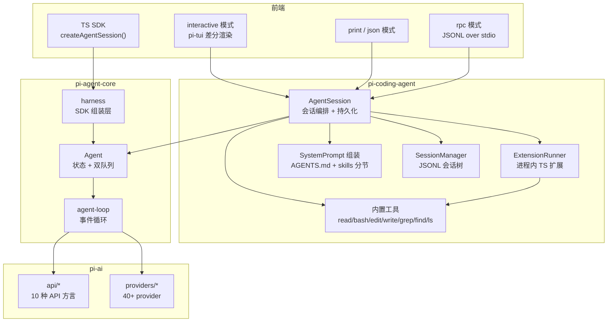
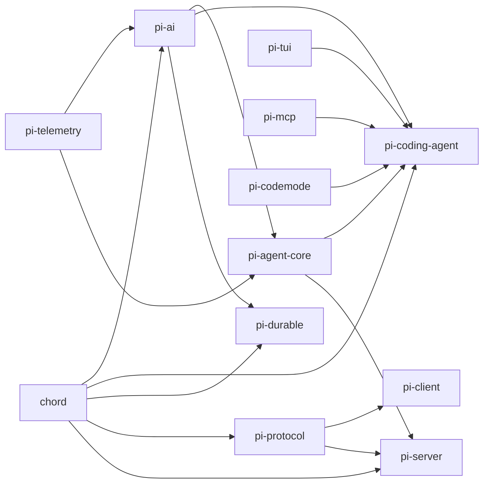
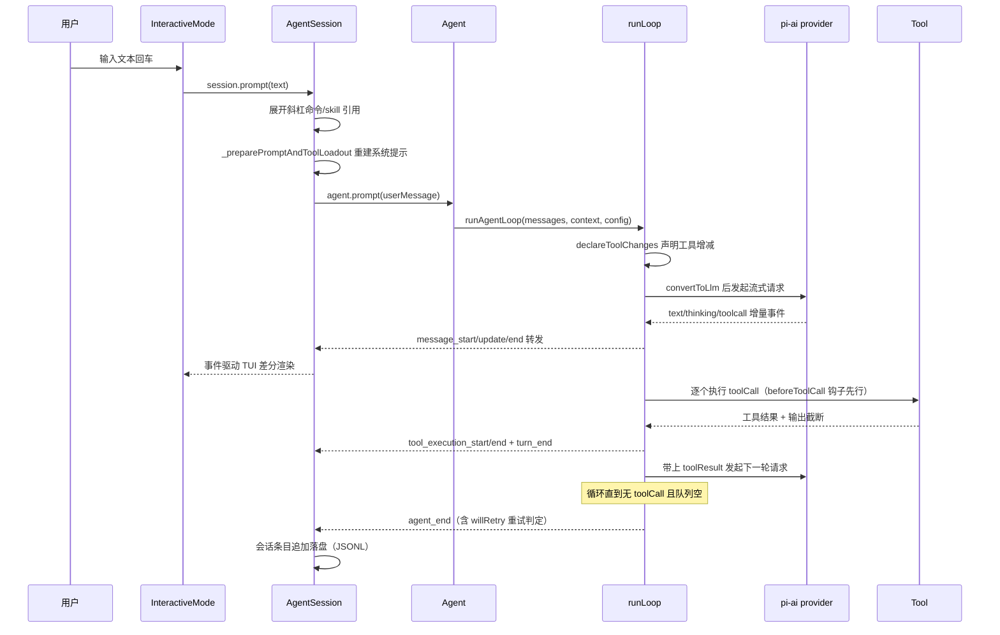
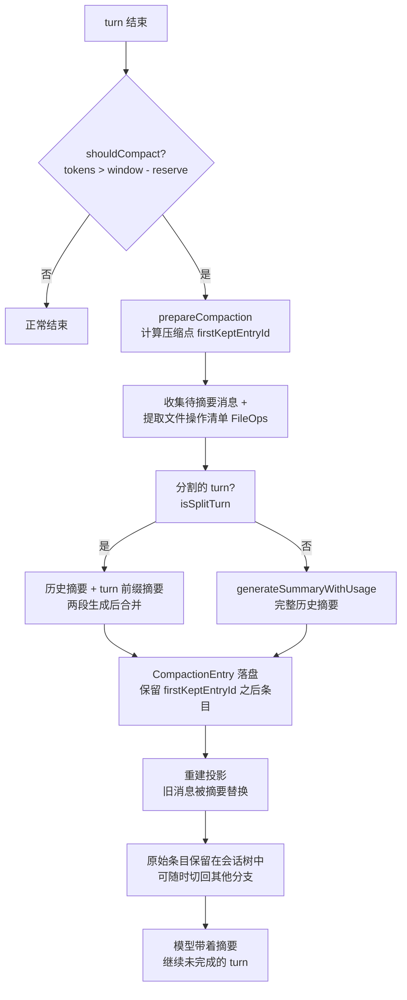

# pi 源码学习笔记

> 仓库地址：[earendil-works/pi](https://github.com/earendil-works/pi)
> 学习日期：2026-09-30

---

> **以下为 AI 源码分析**
>
> ### 一句话概括
>
> Pi 是一个"自扩展"（self-extensible）的开源编码 agent 体系：用 npm workspaces 组织的分层 monorepo，自底向上提供统一多提供商 LLM API（pi-ai）、带工具调用与状态管理的 agent 运行时（pi-agent-core）、以及交互式编码 CLI（pi-coding-agent），并通过进程内 TypeScript 扩展机制让 agent 能够修改自身。
>
> ### 要点速览
>
> | 包名 | 职责 | 关键文件 |
> |------|------|----------|
> | `@earendil-works/pi-ai` | 统一多提供商 LLM API（40+ provider，10 种 API 方言） | `packages/ai/src/types.ts`、`api/*`、`providers/*` |
> | `@earendil-works/pi-agent-core` | agent 运行时：事件循环、工具执行、状态管理 | `packages/agent/src/agent-loop.ts`、`agent.ts` |
> | `@earendil-works/pi-coding-agent` | 交互式编码 agent CLI（`pi` 命令） | `packages/coding-agent/src/main.ts`、`core/agent-session.ts` |
> | `@earendil-works/pi-tui` | 差分渲染终端 UI 库 | `packages/tui/src/tui.ts` |
> | `@earendil-works/pi-mcp` | 独立 MCP client | `packages/mcp/src/client.ts` |
> | `@earendil-works/pi-codemode` | QuickJS-WASI 沙箱化 JS 执行 | `packages/codemode/` |
> | `@earendil-works/chord` | 通用插件化应用组合运行时（非 Pi 专属） | `packages/chord/src/` |
> | `@earendil-works/pi-protocol` | CBOR 远程会话协议 | `packages/protocol/` |

---

## 项目简介

Pi 是 earendil-works（badlogic/Mario Zechner 主导）开源的编码 agent harness，定位与 Claude Code、Aider、OpenCode 同类：在终端里通过自然语言驱动模型读写代码、执行命令。它的差异化在于三点：一是**分层彻底**——LLM API、agent 运行时、CLI 产品三层各自独立发布，都可单独复用；二是**自扩展**——扩展就是加载进 Pi 进程的 TypeScript 模块，可以注册工具、命令、渲染器甚至 UI 组件，Pi 自己的开发流程（`.pi/` 目录下的 skills、prompts、extensions）就建立在这套机制上；三是**不做内置权限系统**——明确声明以启动用户的权限运行，需要隔离时走容器化/沙箱方案（Gondolin 微虚拟机、Docker、OpenShell 三种模式）。

## 技术栈

| 类别 | 技术 |
|------|------|
| 语言 | TypeScript（Node >= 22.19，仅限"可擦除语法"，strip-only 直跑 `.ts`） |
| 框架 | 无 Web 框架；自研 TUI 框架（pi-tui）、自研插件运行时（chord） |
| 构建工具 | esbuild（bundle CLI）+ `tsc --noEmit`（类型检查） |
| 依赖管理 | npm workspaces（`packages/*`），直接依赖精确 pin 版本 + `min-release-age=2` |
| 测试框架 | vitest（多数包）+ `node:test`（tui 包）；`./test.sh` 统一入口 |
| Lint/格式化 | Biome |
| 运行时依赖亮点 | quickjs-wasi（codemode 沙箱）、typebox（工具参数 schema）、CBOR（远程会话协议） |

## 目录结构

```text
pi/
├── packages/                    # npm workspaces monorepo
│   ├── ai/                      # pi-ai：统一 LLM API
│   │   ├── src/api/             #   按 API 方言实现流式调用（anthropic-messages、openai-responses…）
│   │   ├── src/providers/       #   按 provider 组织模型目录与鉴权（anthropic、google、qwen…40+）
│   │   └── src/models.generated.ts  #   由 scripts/generate-models.ts 生成的模型元数据
│   ├── agent/                   # pi-agent-core：agent 运行时
│   │   ├── src/agent-loop.ts    #   核心事件循环（流式响应 + 工具执行）
│   │   ├── src/agent.ts         #   Agent 类：状态、steering/followUp 队列、生命周期
│   │   └── src/harness/         #   面向 SDK 的组装层（hooks、skills、事件、遥测）
│   ├── coding-agent/            # pi-coding-agent：`pi` CLI 产品
│   │   ├── src/main.ts          #   CLI 入口：参数解析 → 会话创建 → 分发到三种模式
│   │   ├── src/core/            #   AgentSession、SessionManager、compaction、tools、extensions
│   │   ├── src/modes/           #   interactive（TUI）/ rpc / print 三种前端
│   │   ├── src/extensions/      #   内置扩展（mcp、codemode、llama、tool-search）
│   │   └── docs/                #   30+ 篇产品文档（how-pi-works.md 等）
│   ├── tui/                     # pi-tui：差分渲染终端 UI
│   ├── mcp/                     # pi-mcp：MCP client（stdio/SSE/streamable-http）
│   ├── codemode/                # pi-codemode：QuickJS 沙箱执行
│   ├── durable/                 # pi-durable：持久化对话/任务/文档运行时
│   ├── protocol/ client/ server/  # CBOR 远程会话协议与实现
│   ├── chord/                   # 独立的插件化组合运行时
│   └── telemetry/               # 厂商中立的遥测契约
├── .pi/                         # Pi 自举资源：skills/、prompts/、extensions/
├── AGENTS.md                    # 面向 agent（和人类）的开发规则
└── test.sh / pi-test.sh         # 测试与源码运行入口
```

## 架构设计

### 整体架构

整体是严格的分层单向依赖：**pi-ai** 只认识"模型 + transcript → 流式 assistant 消息"；**pi-agent-core** 在其上实现"循环 + 工具 + 状态"；**pi-coding-agent** 再叠加会话持久化、扩展系统、系统提示组装、TUI/RPC/SDK 前端。每一层的消费者都拿不到下层的实现细节——例如 agent-loop 只在 LLM 调用边界才把 `AgentMessage[]` 转成 provider 的 `Message[]`。

前端有四种形态但共享同一套 `AgentSession`：interactive（TUI）、print/json（一次性输出）、rpc（stdin/stdout 的 JSONL 命令协议）、以及进程内 TypeScript SDK（`createAgentSession()`）。



### 核心模块

**1. pi-ai —— 统一多提供商 LLM API**

- 职责：把 Anthropic Messages、OpenAI Completions/Responses、Google GenAI、Bedrock、Mistral、WebSocket Codex 等 10 种 API 方言归一到同一个流式契约 `AssistantMessageEventStream`；管理 40+ provider 的模型目录、鉴权（含 OAuth）与代理。
- 关键抽象（`src/types.ts`）：`Model` / `StreamOptions` / `ProviderStreams`（每个 `api/*.ts` 模块都导出统一的 `stream` / `streamSimple`）；模型元数据来自 `scripts/generate-models.ts` 生成的 `models.generated.ts`（规则禁止手改）。
- 值得注意的细节：`src/api/` 里的 `.lazy.ts` 文件是按需加载的包装——核心入口 `index.ts` 只做纯类型导出，不引入任何 provider 工厂，保证 tree-shaking 与启动速度；`samplingParams` 允许把任意采样参数透传给自建 llama.cpp/vLLM 服务。

**2. pi-agent-core —— agent 运行时**

- 职责：与编码场景无关的通用 agent 循环。核心是 `runLoop()`（`src/agent-loop.ts:163`）：流式拿 assistant 响应 → 提取 toolCall → 并行/串行执行 → 把 toolResult 追加进上下文 → 决定是否继续下一轮。
- `Agent` 类（`src/agent.ts`）：有状态包装，维护 `MutableAgentState`（messages/tools/model/isStreaming…），对外暴露 `prompt()` / `steer()` / `followUp()` / `abort()` / `subscribe()`。两条队列语义不同：steering 在当前 assistant turn 结束后插队注入，followUp 在 agent 本应停止时才注入。
- 事件协议：`agent_start → (turn_start → message_start → message_update* → message_end → tool_execution_start/end → turn_end)* → agent_end`。所有监听器按订阅顺序 await，`agent_end` 之后 run 才算 idle。
- `harness/` 子目录是给 SDK 用户的高层组装：把 skills、系统提示、遥测、钩子拼成一个开箱即用的 agent。

**3. pi-coding-agent —— CLI 产品**

- 入口链：`bin: pi → dist/bundle/cli.js → src/cli.ts → main()`（`src/main.ts:567`）。main 负责：auth 子命令 → 包管理命令 → 参数解析 → SessionManager 创建（含 fork/continue/resume 分支）→ 项目信任（ProjectTrustStore）→ `createAgentSessionRuntime()` → 按 TTY 与参数分发到 interactive/rpc/print。
- `core/agent-session.ts`（4299 行）：最核心的 `AgentSession` 类——所有模式共享的会话编排层。负责：订阅 Agent 事件并驱动会话持久化、系统提示重建（工具集变化时分节 diff）、自动/手动 compaction、模型切换与重试、嵌套工具调用（`NestedToolCallRunner`）、扩展事件分发。
- `core/session-manager.ts`：会话是 **append-only 的 JSONL 条目树**。条目类型有 message/modelChange/compaction/branchSummary/customEntry/label 等，每条有 id 和 parentId；`buildSessionProjection()` 沿当前叶子向根遍历出活跃分支，再叠加 ContextEdit（消息改写）得到模型上下文。切换叶子即切换分支，fork 则复制历史到新文件。
- `core/tools/`：8 个内置工具（read/bash/powershell/edit/write/grep/find/ls），每个工具都定义了可替换的 `XxxOperations` 接口（如 `BashOperations.exec`），扩展可以把命令执行重定向到 SSH 或沙箱——这是容器化方案不动核心代码的关键。
- `core/extensions/`：扩展加载器（`loader.ts`）+ 执行器（`runner.ts`，1551 行）+ 完整类型面（`types.ts`，2240 行）。扩展是 TS 模块，默认导出工厂函数 `createExtension(ctx)`，能注册工具、命令、UI 组件、provider、按键，并挂接 30+ 种生命周期事件（session_start/before_compact/agent_end…）。
- `core/skills.ts` + `resource-loader.ts`：skills 从 `~/.pi/skills`（user 级）与 `<project>/.pi/skills`（项目级）发现，遵循 agent skills 规范（frontmatter + 64 字符名限制 + 1024 字符描述限制），尊重 `.gitignore`/`.ignore`。系统提示只注入 skill 列表与"用 read 工具按需加载"的指引，正文按需读取。
- `core/compaction/`：上下文压缩。`shouldCompact()` 判断 `contextTokens > contextWindow - reserveTokens`；`compact()` 用独立请求生成摘要，产出 `CompactionEntry`（记录 firstKeptEntryId + 文件操作清单），投影时替换旧消息但**不删除**原始条目。

**4. pi-tui —— 差分渲染终端 UI**

- 自研 TUI：组件树 + 只重绘变化行的差分渲染 + CSI 2026 同步输出防闪烁；支持 Kitty/iTerm2 内联图片、bracketed paste、鼠标滚动、OKLab 色彩空间。interactive 模式 6904 行的 `interactive-mode.ts` 建立在这套组件上（40+ 组件：diff 渲染、mermaid、工具执行卡片、模型选择器……）。

**5. 其他模块速览**

- `pi-mcp`：独立 MCP client，含 OAuth 与多种 transport；以扩展形式接入 coding-agent（`src/extensions/mcp/`）。
- `pi-codemode`：QuickJS-WASI 沙箱里跑 JS，唯一能力是调用注入的工具——让模型写脚本批量编排工具而无法任意访问系统。
- `pi-protocol`/`client`/`server`：transport 无关的 CBOR 帧协议，支持远程 pi 会话。
- `chord`：与 Pi 无依赖的独立项目——插件 facet + 服务 token + 复制状态 + RPC 的组合运行时，为"同一功能跑在 agent 进程/TUI/WebUI"提供通用机制。

### 模块依赖关系



## 核心流程

### 流程一：一次用户输入的完整 agent 循环

以 interactive 模式为例，从用户按回车到会话落盘的调用链：



关键逻辑：

- `AgentSession.prompt()` 先处理输入的"预处理层"：`_tryExecuteExtensionCommand()` 尝试按斜杠命令交给扩展；`_expandSkillCommand()` 把 `/skill` 展开成 `<skill>` 引用块；都不是才作为用户消息入队（`_queueUserInput`）。
- 每次请求前 `prepareNextTurn` / `prepareRequest` 钩子允许改上下文、换模型、换 thinking 级别——compaction 就挂在 `prepareNextTurn` 上。
- 工具执行前 `beforeToolCall` 扩展钩子可以拒绝或改写调用；工具结果经 `afterToolCall` 后写入上下文。
- `agent_end` 事件的 `willRetry` 字段驱动自动重试：`_isRetryableError` 判定后走 `_prepareRetry()`，可恢复的 `length` 截断会带着恢复提示重放。

### 流程二：自动上下文压缩（auto-compaction）

长会话逼近上下文窗口时的自救流程：



关键逻辑：

- 阈值判断在 `compaction/compaction.ts:267`：`contextTokens > contextWindow - reserveTokens`，token 数用 chars/4 的保守估算（图片固定按 4800 字符计）。
- 摘要不是简单截断：`utils.ts` 里的 `extractFileOpsFromMessage` 会把历史中的文件读写操作单独提取成结构化清单，保证压缩后模型仍然知道自己"动过哪些文件"。
- 压缩发生在 turn 边界（`_checkCompaction` → `_runAutoCompaction(reason, willRetry)`），`agent_end` 的 `willRetry=true` 让压缩后自动续跑，用户看到的是无缝继续。
- 压缩条目插入后，`buildContextEntries()`（`session-manager.ts:476`）在投影时把 `firstKeptEntryId` 之前的消息替换为摘要——原始 JSONL 条目不动，分支/撤销语义完整保留。

## 关键设计亮点

**1. 系统提示分节 + 增量 diff，天然适配 prompt cache**

- 问题：工具集、skills、模型状态会频繁变化，每次全量重写系统提示会击穿 provider 的 prompt cache。
- 实现：`system-prompt.ts` 把提示拆成 `<preamble>/<project_context>/<skills>/<cwd>…` 分节；`diffSystemPromptSections()` 只把变化的节打进 `SystemMessage.sections` 补丁。工具增减同理：`agent-loop.ts` 的 `declareToolChanges()` 在请求前把可执行工具集与 transcript 中已声明集合的差值，作为 `toolsAdded/toolsRemoved` 字段挂在 system 消息上，模型据此增量学习当前工具面。
- 为什么值得学：这是"协议级缓存友好"的典型设计——把状态变化编码成消息流上的增量声明，而不是重发全量状态。

**2. 会话是 append-only 树，compaction/分支/撤销都是投影**

- 问题：编辑型 agent 需要"从历史某点重来"、撤销一轮、压缩历史，若用可变列表实现会互相破坏。
- 实现：JSONL 里每条 entry 带 `parentId`，天然成树；切分支 = 换叶子；撤销 = 附加一条 `ContextEditEntry`（消息改写/删除的 replacement）；compaction = 附加 `CompactionEntry`。`buildSessionProjection()` 每次从叶子向根投影出模型上下文。所有"修改"都是追加，文件永不重写。
- 引用：`session-manager.ts:476`（buildContextEntries）、`:543`（buildSessionProjection）、`agent-session.ts` 的 `_applyBoundaryDrafts`。

**3. 双层消息模型：AgentMessage 到 LLM 边界才降维**

- 问题：会话里除了 user/assistant/toolResult 还有 bash 执行记录、自定义条目、thinking 级别切换等"富类型"，直接发给任何 provider 都不合法。
- 实现：内部统一用 `AgentMessage`（含 custom/扩展消息），`streamAssistantResponse()` 在调用 LLM 前才经 `convertToLlm()`（默认过滤四种标准 role，可替换）和 `transformContext()`（compaction 等上下文手术的挂点）转成 provider 消息。`AgentSession` 注入自己的 `convertToLlm`（`core/messages.ts`）来处理 bash 执行消息的折叠。
- 为什么值得学：把"会话语义"与"线上协议"彻底解耦，任何一端变化都不传染另一端。

**4. steering / followUp 双队列 + 截断防护的防御性设计**

- 问题：用户在模型流式输出时想插话（steering）或追加任务（follow-up），语义完全不同；另外流式 toolCall 的 JSON 参数可能被 token 上限截断却能"侥幸"解析通过。
- 实现：`PendingMessageQueue`（`agent.ts:143`）支持 `one-at-a-time`/`all` 两种排水模式；runLoop 的外层循环专门为 followUp 续命。而 `failToolCallsFromTruncatedMessage()`（`agent-loop.ts:478`）在 `stopReason === "length"` 时**拒绝执行所有工具调用**，逐个返回错误结果让模型重新发起——因为 partial-JSON 抢救解析可能产出"能通过校验但内容残缺"的参数。
- 引用：这是把"流式解析成功"与"语义完整"区分开的安全默认，编码 agent 工具都有副作用，宁可重来不可误执行。

**5. 用"信任 + 可替换 Operations"替代内置权限系统**

- 问题：CLI 型 agent 的权限提示在终端里体验割裂，且模型生态里权限规则永远滞后于攻击面。
- 实现：Pi 明确不内置权限——项目信任（ProjectTrustStore，按 cwd 记忆）决定是否加载项目级配置与资源；需要硬隔离时走文档化的三种容器化模式。技术前提是每个内置工具都定义了 `BashOperations`/`ReadOperations` 这类可替换接口，Gondolin 扩展把 exec 重定向进微虚拟机即可完成整流，核心代码零改动。
- 同族的供应链设计同样成体系：直接依赖精确 pin、`min-release-age=2` 拒绝当日发布的依赖版本、shrinkwrap 的 lifecycle-script 白名单（新依赖带安装脚本直接 fail check）、`npm install --ignore-scripts` 默认化。

**未深入的部分**：`packages/durable`（持久化对话运行时）、`packages/evals`（评测）、`experimental/`（micro/mini/plugins/services 实验特性）、tui 的 native 模块（Rust/平台差分渲染优化）、以及 `chord` 的 delta/replicated-state 实现细节（协议层较深，建议按需再读）。此外 `pi-server`/`pi-client` 的远程会话只梳理了协议定位，未逐行分析。
