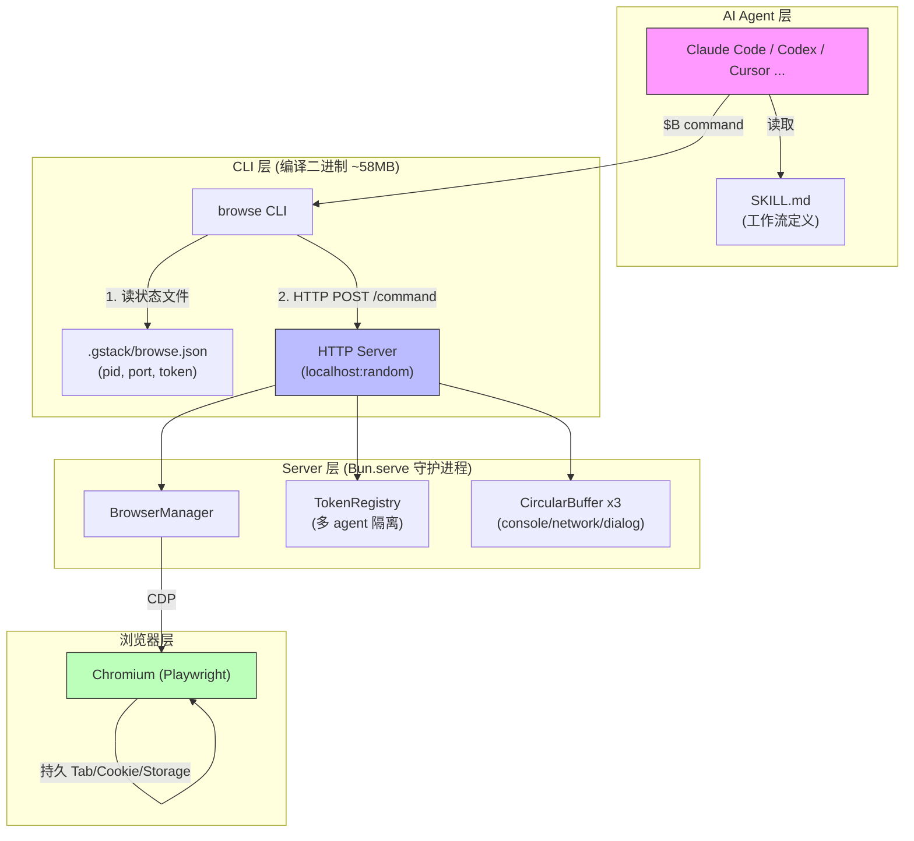
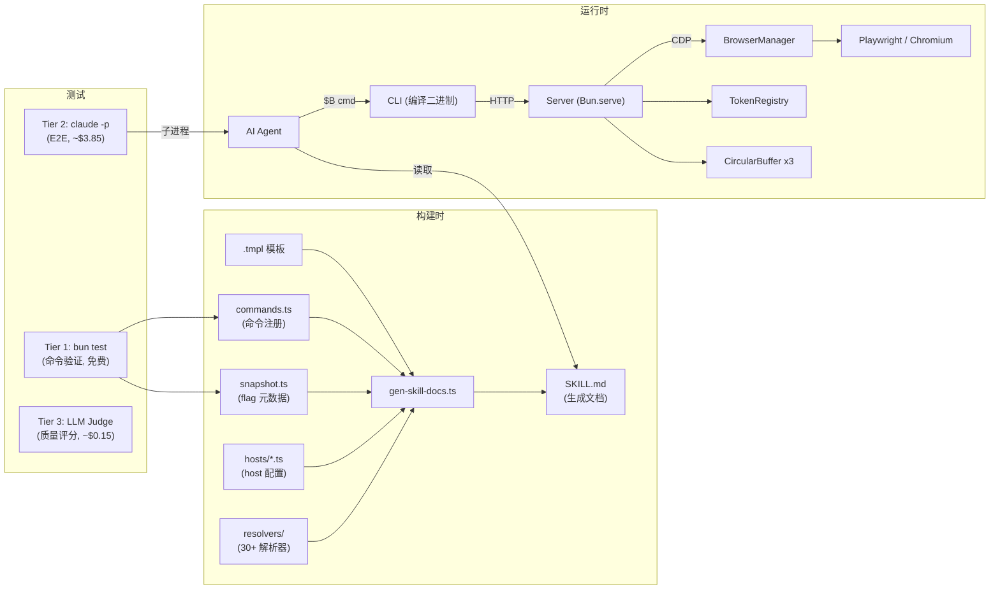
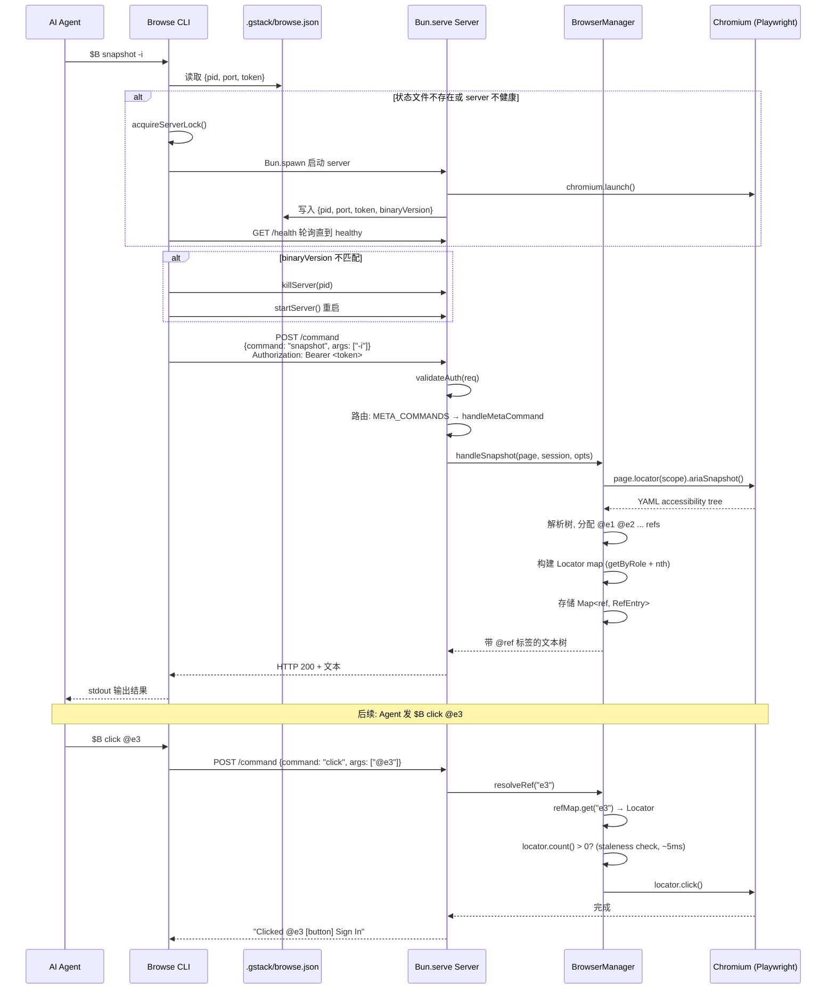
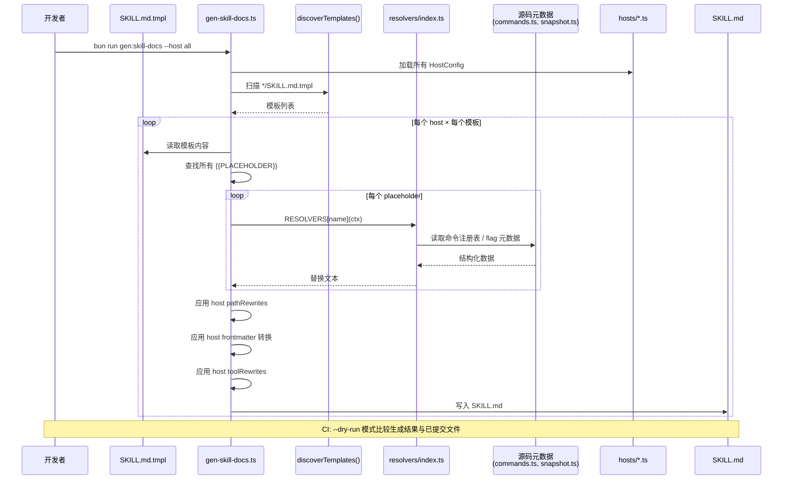

# gstack 源码学习笔记

> 仓库地址：[gstack](https://github.com/garrytan/gstack)
> 学习日期：2026-04-10

---

> **以下为 AI 源码分析**
>
> ### 一句话概括
>
> gstack 是一个基于 Markdown skill 的 AI 工程工作流框架，将 Claude Code 等 AI 编码工具变成一个包含 23 个专家角色的虚拟工程团队，覆盖从产品构思到代码发布的完整 sprint 流程。
>
> ### 要点速览
>
> | 核心模块 | 职责 | 关键文件 |
> |----------|------|----------|
> | browse（浏览器引擎） | 持久化 Chromium 守护进程，提供 sub-second 浏览器操作 | `browse/src/server.ts`, `browse/src/cli.ts`, `browse/src/browser-manager.ts` |
> | skill 系统 | 23+ 个 Markdown 工作流 skill，覆盖完整 sprint | 各 `*/SKILL.md.tmpl` 模板文件 |
> | 模板生成器 | 从 `.tmpl` 模板 + 源码元数据自动生成 SKILL.md | `scripts/gen-skill-docs.ts`, `scripts/resolvers/` |
> | 多 host 适配 | 支持 8 种 AI 编码工具（Claude、Codex、Cursor 等） | `hosts/*.ts`, `scripts/host-config.ts` |
> | Chrome 扩展 + Sidebar | 浏览器 Side Panel 中运行独立 AI agent | `extension/`, `browse/src/sidebar-agent.ts` |
> | 多 agent 协作 | pair-agent Token 隔离体系，跨 AI 工具共享浏览器 | `browse/src/token-registry.ts`, `browse/src/cli.ts` |

---

## 项目简介

gstack 由 Y Combinator CEO Garry Tan 开发，核心理念是"一个人 + AI = 一个 20 人团队"。它将 AI 编码工具（主要是 Claude Code）转变为一个结构化的虚拟工程团队，每个 slash command 代表一个专家角色（CEO、Eng Manager、Designer、QA Lead、CSO 等），按 **Think → Plan → Build → Review → Test → Ship → Reflect** 的 sprint 流程组织工作。

项目分为两个核心层：
1. **Skill 层**：23 个以 Markdown 编写的工作流定义（SKILL.md），通过模板系统自动生成，被 AI agent 在运行时读取并执行
2. **Browse 层**：一个持久化的 headless Chromium 守护进程，提供 ~100ms 延迟的浏览器操作能力，让 AI agent 能像人一样浏览网页、做 QA 测试、截图对比

## 技术栈

| 类别 | 技术 |
|------|------|
| 语言 | TypeScript |
| 运行时 | Bun（编译二进制 + 原生 SQLite + 原生 TypeScript） |
| 浏览器自动化 | Playwright（主），puppeteer-core（辅） |
| 构建工具 | `bun build --compile`（编译为 ~58MB 独立可执行文件） |
| 依赖管理 | Bun（bun.lock） |
| 测试框架 | Bun test（三层：静态验证 / E2E via `claude -p` / LLM-as-judge） |
| 隧道 | @ngrok/ngrok（跨机器 agent 协作） |
| 差异比较 | diff（npm 包，文本差异对比） |
| CI/CD | GitHub Actions（skill-docs 新鲜度检查 + E2E evals） |

## 目录结构

```
gstack/
├── browse/                  # 核心：headless 浏览器引擎
│   ├── src/                 #   CLI + Server + 命令实现
│   │   ├── cli.ts           #   CLI 入口：读状态文件 → 确保 server → 发 HTTP 命令
│   │   ├── server.ts        #   Bun.serve HTTP 守护进程，调度命令到 Playwright
│   │   ├── browser-manager.ts #  Chromium 生命周期 + Tab 管理 + Ref 系统
│   │   ├── commands.ts      #   命令注册表（单一真相源），分 READ/WRITE/META
│   │   ├── snapshot.ts      #   Accessibility tree 快照 + @ref 系统
│   │   ├── token-registry.ts #  多 agent token 隔离：scope/domain/rate limit
│   │   ├── config.ts        #   路径配置解析（git root → .gstack/）
│   │   ├── sidebar-agent.ts #   Chrome Side Panel AI agent 协调
│   │   └── content-security.ts # 防提示注入的内容安全过滤
│   ├── test/                #   集成测试 + 安全测试
│   └── dist/                #   编译后的独立二进制
├── hosts/                   # 多 host 适配（8 种 AI 工具）
│   ├── claude.ts            #   主 host 配置
│   ├── codex.ts             #   OpenAI Codex CLI 适配
│   ├── cursor.ts, factory.ts, kiro.ts, opencode.ts, slate.ts, openclaw.ts
│   └── index.ts             #   注册表：导出所有 host，派生 Host 联合类型
├── scripts/                 # 构建 + 模板生成工具链
│   ├── gen-skill-docs.ts    #   核心：.tmpl → SKILL.md 生成器
│   ├── host-config.ts       #   HostConfig 接口定义 + 验证器
│   └── resolvers/           #   模板占位符解析器（preamble, browse, design, review 等）
├── extension/               # Chrome 扩展（Side Panel + CSS Inspector）
├── design/                  # Design 工具 CLI（GPT Image API 集成）
├── test/                    # skill 验证 + E2E eval 测试
│   ├── helpers/             #   session-runner, eval-store, llm-judge
│   └── skill-e2e-*.test.ts  #   E2E 测试（通过 claude -p 子进程）
├── review/                  # /review skill（含 specialists/）
├── qa/                      # /qa skill
├── ship/                    # /ship skill
├── office-hours/            # /office-hours skill
├── cso/                     # /cso skill（安全审计）
├── supabase/                # 可选遥测后端（Supabase Edge Functions）
├── setup                    # 安装脚本：编译 + symlink skills
├── ARCHITECTURE.md          # 架构设计文档
├── ETHOS.md                 # Builder 哲学（Boil the Lake, Search Before Building）
└── package.json             # 构建脚本 + 依赖
```

## 架构设计

### 整体架构

gstack 采用**分层架构 + 守护进程模型**，核心设计思想是"AI agent 需要 sub-second 延迟和持久状态的浏览器"。整体分为三层：

1. **Skill 层**（Markdown Prompt）：工作流定义，由 AI agent 在运行时读取
2. **CLI 层**（Thin Client）：编译后的二进制，读取状态文件，通过 HTTP 与 server 通信
3. **Server 层**（Persistent Daemon）：长驻 Bun.serve 进程，通过 CDP 驱动 Chromium



### 核心模块

#### 1. Browse 浏览器引擎

**职责**：提供持久化的 headless Chromium 守护进程，支持 ~100ms 的浏览器操作命令。

**核心文件**：
- `browse/src/server.ts` — HTTP 守护进程，绑定 localhost，Bearer token 认证，路由命令到 READ/WRITE/META handler
- `browse/src/cli.ts` — 薄客户端，读 `.gstack/browse.json` 状态文件找到 server，发 HTTP 请求，处理 server 生命周期（自动启动/版本不匹配重启）
- `browse/src/browser-manager.ts` — Chromium 生命周期管理，Tab 会话管理，@ref 定位系统，Dialog 自动处理，Crash Recovery（不自愈，直接退出）
- `browse/src/commands.ts` — 命令注册表（单一真相源），分三类：`READ_COMMANDS`（无副作用）、`WRITE_COMMANDS`（改变页面状态）、`META_COMMANDS`（server 级操作）
- `browse/src/snapshot.ts` — Accessibility tree 快照解析，@ref 分配，Locator 映射（不修改 DOM，避免 CSP/框架冲突）

**关键接口**：
- `BrowserManager.launch()` — 启动 Chromium
- `BrowserManager.getActivePage()` — 获取当前活跃页面
- `handleSnapshot()` — 生成带 @ref 标签的 accessibility tree
- `sendCommand()` — CLI 发送命令到 server

#### 2. Skill 模板系统

**职责**：从 `.tmpl` 模板 + 源码元数据自动生成 SKILL.md 文件，确保文档与代码保持同步。

**核心文件**：
- `scripts/gen-skill-docs.ts` — 主生成器：读模板 → 查找 `{{PLACEHOLDER}}` → 调用 resolver 替换 → 写 `.md`
- `scripts/resolvers/index.ts` — 30+ 个 resolver 函数的注册表
- `scripts/resolvers/preamble.ts` — 每个 skill 的公共前导块（更新检查、session 追踪、learnings、Search Before Building）
- `scripts/resolvers/browse.ts` — 命令参考表、snapshot flags 文档、browse binary 发现逻辑
- `scripts/resolvers/design.ts` — 设计方法论、AI slop 检测、design shotgun loop

**关键接口**：
- `RESOLVERS` — `Record<string, ResolverFn>` 映射占位符名到生成函数
- `discoverTemplates()` — 动态发现所有 `.tmpl` 文件
- `ResolverFn` — `(ctx: TemplateContext) => string`

#### 3. 多 Host 适配系统

**职责**：让 gstack 的 skill 在 8 种不同的 AI 编码工具上运行，每种工具有不同的路径、frontmatter 格式、工具名映射。

**核心文件**：
- `scripts/host-config.ts` — `HostConfig` 接口定义（路径、frontmatter 转换规则、内容重写、安装行为等）
- `hosts/index.ts` — 注册表，导出所有 host config，提供 `getHostConfig()` / `resolveHostArg()`
- `hosts/claude.ts` — 主 host 配置
- `hosts/codex.ts` — OpenAI Codex CLI 适配（不同的 frontmatter、路径、工具名）

**关键设计**：添加新 host 只需创建 `hosts/myhost.ts`，无需修改生成器或安装脚本。参数化测试自动覆盖新 host。

#### 4. 安全与多 Agent Token 系统

**职责**：在多 agent 共享浏览器场景下提供安全隔离（scope 控制、Tab 所有权、rate limiting、domain 限制）。

**核心文件**：
- `browse/src/token-registry.ts` — Token 注册表：root token → scoped sub-tokens → setup key 交换
- `browse/src/content-security.ts` — 防提示注入：untrusted content boundary markers
- `browse/src/url-validation.ts` — URL 验证
- `browse/src/path-security.ts` — 路径安全（限制 /tmp 和 cwd）

**Scope 分类**（重新分类 commands.ts，因为 `js`/`eval`/`cookies` 虽然在 READ 但实际有破坏性）：
- `read` — snapshot, text, html 等安全只读命令
- `write` — goto, click, fill 等修改页面状态的命令
- `admin` — eval, js, cookies 等危险命令（默认拒绝）
- `control` — stop, restart, disconnect 等 server 级命令
- `meta` — tab, diff, frame 等辅助命令

### 模块依赖关系



## 核心流程

### 流程一：浏览器命令执行（$B command）

这是 gstack 最核心的数据流——AI agent 发出一个浏览器命令到获得结果的全过程。



**关键设计决策**：
1. **Locator 而非 DOM 注入**：不向 DOM 注入 `data-ref` 属性，避免 CSP 限制、React/Vue hydration 冲突、Shadow DOM 问题
2. **Ref 在导航时清除**：`framenavigated` 事件触发清除所有 ref，确保过期 ref 快速失败而非点错元素
3. **Staleness 检测**：SPA 路由变化不触发 `framenavigated`，所以 `resolveRef()` 在使用前做 `count()` 检查（~5ms 开销）

### 流程二：SKILL.md 模板生成（build pipeline）

从 `.tmpl` 模板到最终 AI agent 可读的 `SKILL.md` 的完整生成流程。



**关键设计决策**：
1. **提交生成结果而非运行时生成**：因为 Claude 在 skill 加载时直接读 SKILL.md，没有构建步骤
2. **CI 新鲜度检查**：`gen:skill-docs --dry-run` + `git diff --exit-code` 确保提交的文档始终与源码同步
3. **结构正确性保证**：如果命令在代码中存在，它就出现在文档中；如果不存在，就不会出现

## 关键设计亮点

### 1. 守护进程模型 vs 按需启动

**解决的问题**：AI agent 与浏览器交互需要持久状态（cookie、登录会话、Tab）和低延迟（~100ms vs 3-5s 冷启动）。

**实现方式**：
- Server 以后台进程运行（`Bun.spawn` + `unref()`），通过状态文件 `.gstack/browse.json` 暴露 `{pid, port, token}`
- CLI 是编译后的独立二进制，每次调用读取状态文件，通过 HTTP 发送命令
- 自动生命周期：首次使用自动启动（~3s），30 分钟空闲自动关闭
- 版本自动重启：binary 的 git SHA 写入 `.version`，CLI 发现不匹配自动重启 server
- 文件锁防止并发启动竞争（`acquireServerLock()`）

**为什么这样设计**：参见 `ARCHITECTURE.md` — 每次命令冷启动浏览器会产生 40+ 秒的开销（20 个命令 × 2-3s），且丢失所有状态。守护进程模型使 QA 会话中的浏览器操作延迟降至 ~100-200ms。

### 2. @ref 系统（基于 Locator，非 DOM 注入）

**解决的问题**：AI agent 需要一种简单的方式引用页面元素（`click @e3`），而不需要编写 CSS selector 或 XPath。

**实现方式**（`browse/src/snapshot.ts` + `browse/src/browser-manager.ts`）：
1. 调用 Playwright 的 `page.accessibility.snapshot()` 获取 ARIA tree
2. 解析树，为每个元素分配 sequential refs（@e1, @e2, @e3...）
3. 对每个 ref 构建 Playwright Locator：`getByRole(role, { name }).nth(index)`
4. 存储 `Map<string, RefEntry>`（role + name + Locator）在 `TabSession` 实例上
5. 使用时：`resolveRef("e3")` → Locator → `locator.click()`

**为什么不用 DOM 注入**：
- CSP（Content Security Policy）会阻止 DOM 修改
- React/Vue/Svelte hydration 会清除注入的属性
- Shadow DOM 无法从外部访问
- Playwright Locator 基于 accessibility tree，完全外部于 DOM

### 3. 单一真相源的命令注册表

**解决的问题**：避免文档与代码漂移——如果 SKILL.md 列出一个不存在的 flag，agent 会报错。

**实现方式**（`browse/src/commands.ts`）：
- `READ_COMMANDS`、`WRITE_COMMANDS`、`META_COMMANDS` 三个 `Set<string>` 定义所有命令
- `COMMAND_DESCRIPTIONS` 对每个命令提供 category、description、usage
- 加载时验证：`COMMAND_DESCRIPTIONS` 的 key 必须与三个 Set 的并集完全一致，多了或少了都抛异常
- 构建时：`gen-skill-docs.ts` 从这些数据结构自动生成文档表格
- 测试时：`skill-parser.ts` 提取 SKILL.md 中所有 `$B` 命令并对照注册表验证

**关键代码**：
```typescript
// commands.ts 加载时自我验证
for (const cmd of allCmds) {
  if (!descKeys.has(cmd)) throw new Error(`COMMAND_DESCRIPTIONS missing entry for: ${cmd}`);
}
for (const key of descKeys) {
  if (!allCmds.has(key)) throw new Error(`COMMAND_DESCRIPTIONS has unknown command: ${key}`);
}
```

### 4. 多 Agent Token 隔离（Scope 重新分类）

**解决的问题**：多个 AI agent 共享同一个浏览器时，需要安全隔离（不能互相读 cookie、执行 JS、关闭对方的 Tab）。

**实现方式**（`browse/src/token-registry.ts`）：
- Root token（server 启动时生成）→ 可以铸造 scoped sub-tokens
- Setup key 交换协议：`createSetupKey()` → 对方 agent 用 `POST /connect` 交换为 session token
- **关键洞察**：`commands.ts` 的 READ_COMMANDS 包含 `js`/`eval`/`cookies`/`storage`，这些实际上有破坏性，所以 token-registry 重新分类为 `admin` scope
- Tab 所有权：每个 token 只能操作自己创建的 Tab
- Rate limiting：>10 req/s 触发 429
- Domain 限制：可以限制 token 只能访问特定域名

**为什么这样设计**：这是第一个让不同 AI 厂商的 agent 通过共享浏览器协作且具备真正安全隔离（scoped tokens, tab isolation, rate limiting, domain restrictions, activity attribution）的实现。

### 5. 三层测试体系（Free → Expensive → LLM Judge）

**解决的问题**：AI skill 的测试既需要验证文档正确性（命令是否存在），又需要验证端到端行为（skill 是否真的能跑通），还需要评判文档质量（是否清晰可操作）。

**实现方式**：
- **Tier 1（免费，<5s）**：静态验证——解析 SKILL.md 中所有 `$B` 命令，对照 `commands.ts` 注册表验证。每次 `bun test` 运行
- **Tier 2（~$3.85）**：E2E——通过 `claude -p` 子进程生成真实 Claude 会话，运行每个 skill，扫描是否有 browse 错误。需要 `EVALS=1` 环境变量
- **Tier 3（~$0.15）**：LLM-as-judge——用 Claude Sonnet 对生成的 SKILL.md 在 Clarity/Completeness/Actionability 三个维度打分（1-5），阈值 ≥ 4

**关键设计**：95% 的问题用免费的 Tier 1 捕获，LLM 只用于需要判断力的场景。Diff-based test selection 避免无关测试的费用浪费。
