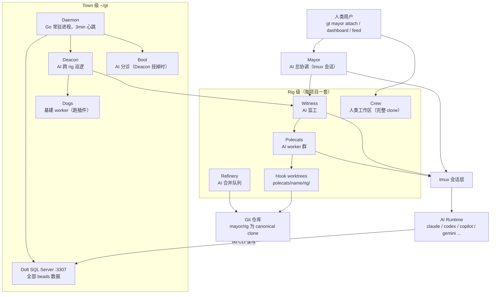
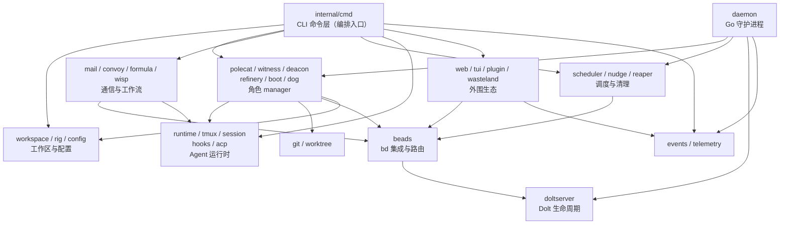
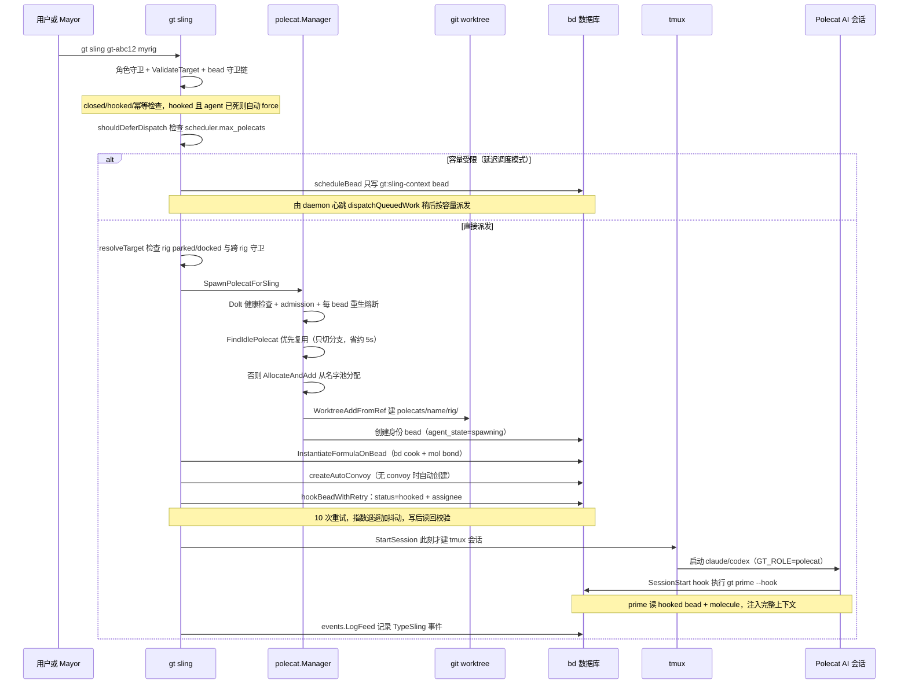
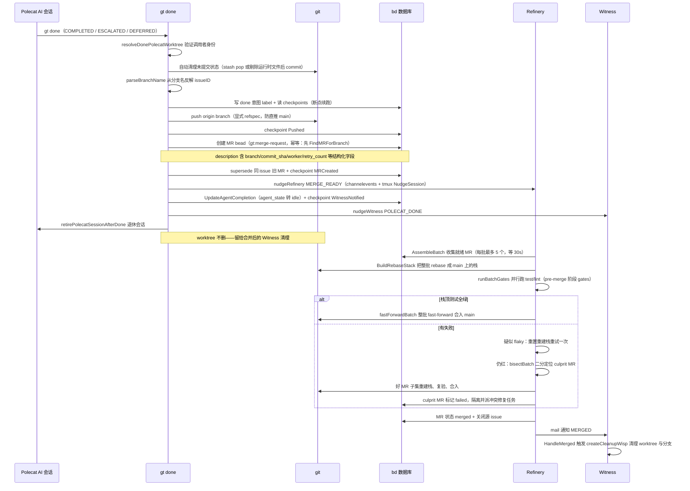

# gastown 源码学习笔记

> 仓库地址：[gastown](https://github.com/gastownhall/gastown)
> 学习日期：2026-10-01
> 分析快照：commit `649b832b`（2026-07-23），版本 v1.2.1+，MIT License，Go module 路径 `github.com/steveyegge/gastown`

---

> **以下为 AI 源码分析**
>
> ### 一句话概括
>
> Gas Town 是 Steve Yegge 开源的多 agent 编排系统：一个 Go 编写的 `gt` CLI 在 tmux 中管理 20-30+ 个 AI coding agent（Claude Code / Copilot / Codex / Gemini 等），把邮件、任务、合并请求、agent 身份等全部工作状态持久化到 Beads（Dolt SQL 数据库）与 git worktree，用「Daemon → Deacon → Witness」三层看门狗和 Bors 式合并队列驱动一张「AI 决策、Go 运输」的自治协作网络。
>
> ### 要点速览
>
> | 模块 | 职责 | 关键文件 |
> |------|------|----------|
> | CLI 命令层 | 全部 `gt` 子命令（cobra），457 个文件约 17 万行 | `internal/cmd/root.go`、`sling.go`、`done.go`、`prime.go` |
> | 工作区与配置 | town root 发现、rig 管理、四层配置解析 | `internal/workspace/find.go`、`internal/rig/manager.go`、`internal/config/` |
> | 数据层 | beads 前缀路由 / redirect 解析、Dolt server 生命周期 | `internal/beads/routes.go`、`internal/doltserver/doltserver.go` |
> | Agent 运行时 | 13+ 种 runtime preset、tmux 会话、hooks 注入、ACP 协议 | `internal/config/agents.go`、`internal/tmux/`、`internal/hooks/`、`internal/acp/` |
> | 编排与监督 | daemon 心跳、AI 角色驱动、polecat 生命周期、合并队列、调度器 | `internal/daemon/daemon.go`、`internal/polecat/manager.go`、`internal/refinery/batch.go` |
> | 通信与工作流 | mail 协议、convoy、formula/molecule DAG、事件流 | `internal/mail/types.go`、`internal/formula/embed.go`、`internal/events/events.go` |
> | 外围生态 | web dashboard、feed TUI、OTEL 遥测、插件、Wasteland 联邦、沙箱 proxy | `internal/web/`、`internal/tui/feed/`、`internal/plugin/`、`internal/wasteland/` |

---

## 项目简介

Gas Town 是一个「多 agent 工作区管理器」，解决的核心问题是：当你同时运行 4-10 个以上 AI coding agent 时，agent 重启即丢失上下文、人工协调成本高、工作状态散落在各 agent 的会话记忆里。Gas Town 的答案是把一切状态外置——工作进度存进 Beads（`bd`，git-backed issue 数据库，底层是 Dolt SQL Server），代码进度存进 git worktree（称为 Hook），agent 之间用「邮件」（也是 beads）通信，由一个 Go 守护进程加一组 AI 监督角色（Mayor / Deacon / Witness / Refinery）维持整个「小镇」的秩序，使多 agent 协作可以舒适地扩展到 20-30 个。项目本身约 1231 个 Go 文件、47 万行代码，且用自己的工具开发自己（仓库根有 `.beads/`，CHANGELOG 里满是 `gt-xxxx` bead 引用）。

## 技术栈

| 类别 | 技术 |
|------|------|
| 语言 | Go 1.26.2（CGO，查询层依赖 ICU4C） |
| 框架 | cobra（CLI）、bubbletea / lipgloss / glamour（TUI）、`net/http` + `html/template` + htmx（dashboard） |
| 构建工具 | Makefile + GoReleaser（5 平台产物）+ Nix flake |
| 依赖管理 | Go Modules |
| 测试框架 | testify + testcontainers-go（Dolt 容器集成测试） |
| 外部运行时依赖 | `bd`（Beads CLI）、Dolt SQL Server、tmux 3.0+、sqlite3、各 agent CLI（claude / codex / copilot…） |
| 可观测性 | OpenTelemetry SDK（OTLP HTTP → VictoriaMetrics / VictoriaLogs） |

## 目录结构

```
gastown/
├── cmd/
│   ├── gt/                     # 主 CLI 入口，main.go 仅调 internal/cmd.Execute()
│   ├── gt-proxy-server/        # 沙箱代理服务端（宿主侧，mTLS + 命令白名单）
│   └── gt-proxy-client/        # 装进沙箱容器、冒充 gt/bd 的转发客户端
├── internal/                   # 全部核心代码，约 70 个包
│   ├── cmd/                    # cobra 命令实现（457 个文件，业务编排入口）
│   ├── workspace/ rig/ config/ state/    # 工作区发现、rig 管理、四层配置、机器级状态
│   ├── beads/ doltserver/                # 数据层：bd 集成、routes.jsonl 路由、Dolt 生命周期
│   ├── git/ worktree/                    # git 与 worktree 封装（含完整性校验）
│   ├── runtime/ tmux/ session/ hooks/ acp/ wrappers/  # Agent 运行时与会话
│   ├── daemon/ boot/ deacon/ dog/ witness/ refinery/   # 守护进程与 AI 监督角色
│   ├── polecat/ scheduler/ nudge/ reaper/ convoy/      # worker 生命周期、调度、清理
│   ├── mail/ formula/ wisp/ events/ channelevents/     # 通信、工作流、事件
│   ├── web/ tui/ feed/ telemetry/ plugin/ wasteland/ proxy/  # 外围生态
│   └── templates/              # 角色 prompt 模板（go:embed 进二进制，gt prime 消费）
├── plugins/                    # 13 个官方插件（plugin.md + 可选 run.sh，由 dog 执行）
├── templates/                  # polecat-CLAUDE.md 等工作区模板
├── docs/                       # 设计文档（architecture / escalation / scheduler / convoy…）
├── gt-model-eval/              # promptfoo 模型评测（为巡逻角色换便宜模型提供证据）
├── npm-package/                # @gastown/gt npm wrapper（postinstall 下载平台二进制）
├── pr-sheriff-evidence/        # PR 审查机器人产出的证据工件
└── Makefile / .goreleaser.yml / docker-compose.yml / flake.nix
```

## 架构设计

### 整体架构

Gas Town 的空间模型是两级：**Town**（`~/gt`，一个工作区）包含多个 **Rig**（项目容器，包裹一个 git 仓库）。数据模型也是两级：town 级 beads（`hq-*` 前缀，存组织协调数据）与 rig 级 beads（项目前缀，存实现工作），全部落在每 town 一个的 Dolt SQL Server（端口 3307）里。agent 分两层：town 级（Mayor 协调者、Deacon 巡逻、Boot 分诊、Dogs 基建 worker）与 rig 级（Witness 监工、Refinery 合并队列、Polecats 工人、Crew 人类工作区）。所有 AI 角色都跑在 tmux 会话里，由一个 Go daemon 负责「保活」；唯一例外是 daemon 自己——它是纯 Go 进程。



关键设计约定（`docs/design/architecture.md`）：

- **两级 beads + 前缀路由**：`~/gt/.beads/routes.jsonl` 把 ID 前缀映射到 rig 路径（`{"prefix":"gt-","path":"gastown/mayor/rig"}`），`bd show gt-xyz` 在 town 任何位置都能透明路由到正确数据库。
- **redirect 共享数据库**：polecat / refinery 等 worktree 没有自己的 beads 库，靠 `.beads/redirect` 文件指回 canonical 位置（`ResolveBeadsDir` 限深 3 层解析并检测环）。
- **单写主分支**：所有 agent 直接写 Dolt 的 `main` 分支，用 `BEGIN / DOLT_COMMIT / COMMIT` 事务纪律保证原子性与跨 agent 即时可见，避免分支泛滥。
- **无散落配置文件**：不生成每目录 CLAUDE.md，上下文统一由 `gt prime` 经 SessionStart hook 注入。

### 核心模块

#### 1. CLI 命令层（internal/cmd）

- **职责**：实现全部 `gt` 子命令，是业务编排的唯一入口；457 个文件、约 17 万行。
- **核心文件**：`root.go`（根命令与 `persistentPreRun`）、`sling*.go`（约 20 个文件）、`done.go`、`prime*.go`、`convoy*.go`、`mail_*.go`、`patrol*.go`。
- **关键接口/函数**：`Execute()` 初始化 OTEL 后执行 cobra 根命令；`persistentPreRun` 在每条命令前统一做：macOS 未签名二进制拦截、主题初始化、`gt done` 的 worktree 所有权证明、town root 分支检查、polecat 心跳 touch（凭 `GT_SESSION`/`GT_ROLE` 环境变量）、beads 版本检查（`beadsExemptCommands` 豁免表保证 estop/doctor 等在 Dolt 挂掉时仍可用）。命令按 7 个 group 组织（Work / Agents / Comm / Services / Workspace / Config / Diag），启用前缀匹配（`gt ref at` → `gt refinery attach`）。
- **与其他模块的关系**：只做参数解析、守卫与流程编排，领域逻辑下沉到 `internal/polecat`、`internal/refinery` 等包；`sling_dispatch.go` 的 `executeSling` 是单发/批量/调度器复用的统一派发路径。

#### 2. 工作区与配置（internal/workspace、rig、config、state）

- **职责**：town root 发现、`gt install` 初始化、rig 增删与配置、四层属性解析。
- **核心文件**：`workspace/find.go`、`cmd/install.go`、`rig/manager.go`、`rig/types.go`、`config/agents.go`、`config/types.go`、`state/state.go`。
- **关键接口/函数**：`workspace.Find` 从 cwd 逐级向上找 `mayor/town.json` 标记并取**最外层**匹配（处理 rig 内嵌套 mayor 目录的歧义），失败回退 `GT_TOWN_ROOT` 环境变量；`runInstall` 创建 `mayor/`（town.json、rigs.json、daemon.json）、`deacon/`、`boot/`、`plugins/`、`settings/escalation.json`，并初始化 hq beads 库与路由；`rig.AddRig` 把项目 bare clone 到 `<rig>/.repo.git`（worktree 的共享对象库）；`config.GetConfigWithSource` 实现四层属性查找：wisp 级 → rig identity bead label → town settings → `SystemDefaults`。
- **与其他模块的关系**：几乎所有命令都以 `workspace.FindFromCwd` 开场；rig 的 `config.json`（含 `beads.prefix`、`polecat_pool_size`）被 polecat / sling / convoy 消费。

#### 3. 数据层（internal/beads、doltserver）

- **职责**：封装对外部 `bd` CLI / beadsdk 的调用，实现前缀路由与 redirect；管理 Dolt SQL Server 进程的启动、健康与恢复。
- **核心文件**：`beads/routes.go`、`beads/beads_redirect.go`、`beads/beads.go`、`doltserver/doltserver.go`、`daemon/dolt.go`。
- **关键接口/函数**：`ResolveBeadsDirForID` 按 bead ID 前缀查 `routes.jsonl` 定位数据库；`ComputeRedirectTarget` 决定 worktree 的 `.beads/redirect` 指向（rig 自有库 → rig 级，否则 → `mayor/rig`）；`Beads` struct 包装进程内 beadsdk store，执行时强制覆盖 `BEADS_DIR` 环境变量；`doltserver.Start()` 用 flock 防并发、杀端口占用者、派生 `dolt sql-server` 并把 `State{pid,port,databases}` 持久化到 `daemon/dolt-state.json`；daemon 侧 `DoltServerManager` 每 30s 做读健康 + 写健康（检测 read-only）+ 身份校验（`KillImposters`），故障走 `restartWithBackoff`（5s→5min 指数退避，10 分钟窗口超 5 次即邮件升级给 Mayor）。
- **与其他模块的关系**：mail / convoy / MR / agent 身份全部经此层落库；daemon 心跳第一步就是 `ensureDoltServerRunning`——Dolt 是整个系统的数据平面基石。

#### 4. Agent 运行时（internal/config/agents、tmux、session、hooks、acp、runtime）

- **职责**：把「启动一个 AI agent 会话」抽象成可配置动作，支持 13+ 种 runtime。
- **核心文件**：`config/agents.go`（preset 注册表）、`config/loader.go`（per-rig 解析）、`tmux/`（会话封装）、`hooks/`（Claude/Copilot 钩子安装）、`acp/proxy.go`、`acp/propulsion.go`、`cmd/prime.go`、`events/events.go`。
- **关键接口/函数**：
  - `builtinPresets`：每个 `AgentPresetInfo` 定义 `Command/Args/ProcessNames`（存活探测）、`ResumeFlag/ResumeStyle`（会话恢复）、`SupportsHooks/SupportsForkSession`、`PromptMode`、`HooksProvider/HooksSettingsFile`、`ReadyPromptPrefix/ReadyDelayMs`（就绪判定）、`ACP` 配置。
  - 会话启动链：`BuildStartupPrompt` → `BuildStartupCommandFromConfig`（生成 `env GT_ROLE=… GT_AGENT=… claude --dangerously-skip-permissions "<prompt>"`）→ `tmux.NewSessionWithCommandAndEnv`（`new-session -d -e…` + `remain-on-exit` + `respawn-pane`）→ `WaitForCommand` / `AcceptStartupDialogs`。
  - hooks：`hooks.InstallForRole` 向 `.claude/settings.json` 写入 SessionStart/PreCompact → `gt prime --hook`、UserPromptSubmit → `gt mail check --inject`（巡逻角色豁免）、PreToolUse → `gt tap guard`（拦 `gh pr create`、`sudo` 等）、Stop → `gt costs record`；Copilot 对应 `.github/hooks/gastown.json`。
  - `gt prime`（`runPrime`）按固定顺序拼接上下文：会话元数据 → 角色模板（`templates.RenderRole`，go:embed）→ town/rig directives → CONTEXT.md → handoff 内容 → slung 工作与 hooked bead → molecule/checkpoint → memory 与 mail 注入。
  - ACP：`acp.Proxy` 以 JSON-RPC 2.0 双向转发包裹 agent 子进程（`initialize` → `session/new` 握手、`injectStartupPrompt`、keepalive）；`acp.Propeller` 实现「推进原则」——监听 nudge 队列并注入会话使其不空转；Mayor 可以 ACP 模式替代 tmux 运行。
  - 事件：`events.LogFeed` 带 flock 追加写 `~/gt/.events.jsonl`（`Event{ts,source,type,actor,payload,visibility}`）；`gt seance` 靠它发现历史会话，`--talk` 用 `claude --fork-session --resume <id>` 与前任对话。
- **与其他模块的关系**：polecat / deacon / witness 等 manager 全部经此层起会话；prime 是「上下文即数据」的注入点，把嵌入式模板 + 数据库状态 + 邮件拼装成 agent 的世界观。

#### 5. 编排与监督（internal/daemon、boot、deacon、witness、refinery、polecat、dog、scheduler、nudge、reaper）

- **职责**：维持整个小镇的存活与秩序——这是 Gas Town 最有特色的部分。
- **核心文件**：`daemon/daemon.go`、`boot/boot.go`、`deacon/manager.go`、`witness/manager.go`、`witness/handlers.go`、`refinery/batch.go`、`refinery/engineer.go`、`polecat/manager.go`、`polecat/namepool.go`、`scheduler/capacity/`、`nudge/queue.go`、`reaper/reaper.go`。
- **关键接口/函数**：
  - `Daemon.Run()`：flock `daemon.lock` → 启动 feed Curator 等内嵌服务 → 注册 11 个独立 ticker（Dolt 健康 30s、备份 15m、wisp reaper、各类 dog…）+ 主 timer（默认 3min），单 `select` 消费。
  - `heartbeat(state)` 每轮顺序执行 20+ 步：estop 守卫 → `ensureDoltServerRunning` → `ensureDeaconRunning` / `ensureBootRunning` / `checkDeaconHeartbeat` → `ensureWitnessesRunning` / `ensureRefineriesRunning` / `ensureMayorRunning` → `handleDogs` → `checkGUPPViolations` → `checkPolecatSessionHealth` → `reapIdlePolecats` → `dispatchQueuedWork` → `SaveState`；高开销步骤前有 `checkPressure(role)` 系统压力闸门，per-rig 并发由 `RigWorkerPool` 限流。
  - AI 角色驱动（「Agent decides. Go transports.」）：Deacon 心跳写 `deacon/heartbeat.json`，daemon 分级响应（stale 5-20min → tmux nudge；≥20min → `restartStuckDeacon` + `RestartTracker` 指数退避熔断）；Boot 是一次性分诊会话，三重节流（cooldown、idle guard、`gt-idle-check`），空闲时降级为零 token 的机械分诊 `runDegradedTriage`；Witness 杀僵尸会话前经 `ZombieKillGracePeriod` 二次确认防 TOCTOU 误杀。
  - `polecat.Manager.AllocateAndAdd()`：锁池 → `namePool.Allocate`（默认 50 个 mad-max 主题名，保留基建角色名）→ `buildBranchName`（`polecat/<name>/<bead>+<ts>`，分支名即身份）→ `WorktreeAddFromRef` → `setupSharedBeads`（写 redirect）→ `EnsureSettingsForRole`（装 hooks）→ 创建身份 bead（`agent_state=spawning`）；失败全链路回滚。心跳 `TouchSessionHeartbeatWithState`（working/idle/exiting，3min 阈值）。
  - Refinery 合并队列：`ProcessBatch` 六步 batch-then-bisect（见流程二）；gates 插件化（`GateConfig{Cmd,Timeout,Phase}`，pre-merge / post-squash 两阶段，默认并行）；MR v2 相位机 `ready→claimed→preparing→prepared→merging→merged/rejected/failed`，claim TTL 30min。
  - Scheduler：`capacity.SchedulerConfig{MaxPolecats,BatchSize,SpawnDelay}`，`max_polecats>0` 即启用延迟派发；`PlanDispatch` 结合容量快照（tmux 会话集 + agent bead 状态 + admission 预约文件）与熔断过滤（`FilterCircuitBroken`）生成计划，`DispatchCycle` 执行；daemon 通过 **shell out `gt scheduler run` 子进程**驱动它——刻意规避 daemon↔cmd 循环依赖并隔离故障。
  - nudge：消息以 JSON 文件落 `events/nudges/<session>/`，`Drain` 用 rename→`.claimed.<rand>` 抢占式声明（超时自动 requeue）；每会话一个 detached poller 进程（fsnotify + 100ms 合并），只在 agent 空闲时 `send-keys` 注入。
  - reaper：直连 Dolt 的 SQL 级 GC（`Scan/Reap/Purge/AutoClose`），由 daemon 的 wispReaper ticker 驱动。
- **与其他模块的关系**：daemon 是「Go 侧总调度」，把 AI 角色、Dolt、调度器、清理器全部串起来；各角色 manager 依赖 tmux/session 层起会话、beads 层读写状态。

#### 6. 通信与工作流（internal/mail、convoy、formula、wisp、events、channelevents）

- **职责**：agent 间通信（mail）、批量工作追踪（convoy）、多步工作流模板（formula/molecule）。
- **核心文件**：`mail/types.go`、`mail/router.go`、`mail/delivery.go`、`cmd/convoy_stage.go`、`cmd/convoy_launch.go`、`formula/embed.go`、`formula/overlay.go`、`cmd/molecule_dag.go`、`channelevents/`。
- **关键接口/函数**：
  - mail：邮件就是 `type=message` + `gt:message` label 的 bead（无独立邮箱存储），`Message{From,To,Priority,Type,ThreadID,Queue,Channel,ClaimedBy,DeliveryState}`，元数据编码进 beads labels（`from:` / `thread:` / `queue:` / `claimed-by:`）；queue 语义靠 `claimed-by` 抢占实现单副本消费；投递两阶段 `pending→acked`；`notifyRecipient` 优先 tmux `WaitForIdle` + `NudgeSession` 直投，agent 忙则入 nudge 队列等下次 UserPromptSubmit hook 时 `gt mail check --inject` 以 `<system-reminder>` 格式注入。
  - convoy：`gt:convoy` label 的 bead，ID `hq-cv-<shortid>`，字段序列化进 description，与成员 issue 用 `tracks` 依赖边关联；状态机 open / closed / staged_ready / staged_warnings；`stage` 收集 beads → 构建 DAG → 检测环 → 按依赖分 wave；`launch` 派发 Wave 1；成员 issue 关闭时 `CheckConvoysForIssue → feedNextReadyIssue` 反应式喂料；`mountain` 模式累计 3 次失败自动 skip（epic 级自治）。
  - formula：48 个 TOML 工作流模板经 `//go:embed formulas/*.formula.toml` 打进二进制；`ResolveFormulaContent` 三级解析（rig → town → embedded）；支持 `{{var}}` 变量渲染与 overlay 覆盖（replace / append / skip 三种模式，rig 级整体优先于 town 级）。
  - wisp/molecule：formula 实例化为 wisp（DAG 根节点），默认 root-only——步骤不物化，`gt prime` 时内联渲染（轻量）；`pour=true` 则每步物化为 sub-wisp 并支持 checkpoint 恢复；`buildDAG/computeTiers/findCriticalPath` 做可视化与关键路径分析；`await signal` 靠 tail `.events.jsonl` + agent bead 的 `idle:N`/`backoff-until` label 实现跨进程指数退避；`channelevents` 用 `~/gt/events/<channel>/*.event` 文件实现单消费者事件通道（Refinery 的 MQ_SUBMIT 即走此通道）。
- **与其他模块的关系**：mail 是 sling / done / witness / daemon 之间所有协议消息（POLECAT_DONE、MERGE_READY、LIFECYCLE:Shutdown）的载体；formula 被 sling 自动挂载（`mol-polecat-work`）；events 同时服务 seance、feed TUI 与 molecule await。

#### 7. 外围生态（internal/web、tui、telemetry、plugin、wasteland、proxy）

- **dashboard**（`cmd/dashboard.go` + `internal/web/`）：纯标准库 `net/http` + `html/template`，htmx 1.9.10 走 SSE + 30s 轮询双通道自动刷新；`LiveConvoyFetcher` 跑 `bd`/`tmux` 子进程取数，10s 响应缓存 + 串行 fetch 防子进程风暴；Cmd+K command palette 经 `/api/` 直接执行 gt 命令。
- **feed TUI**（`internal/tui/feed/`）：bubbletea Model 管四个 viewport（agent tree / convoy / event stream / problems），三数据源合流（tail `.events.jsonl`、bd activity、MQ）；`StuckDetector.CheckAll` 基于 beads 数据判定健康状态：tmux 会话死 → zombie，hooked 且 idle ≥30min → GUPP violation，≥15min → stalled，支持在 problems 视图一键 nudge / handoff。
- **telemetry**（`internal/telemetry/`）：opt-in（设 `GT_OTEL_*_URL` 才启用）；约 25 个 `Record*` 函数同时打 counter、histogram 与结构化日志；`SetProcessOTELAttrs` 在进程环境写入 `OTEL_RESOURCE_ATTRIBUTES`，使所有 `bd` 子进程自动继承 gt 上下文上报。
- **plugin**（`internal/plugin/` + `plugins/`）：插件 = `plugin.md`（TOML frontmatter 声明 gate/tracking/execution + Markdown 指令正文，由 dog agent 解释执行）+ 可选 `run.sh`（确定性脚本）；`DiscoverAll` 扫 town 级与 rig 级插件目录；执行时机是 Deacon 巡逻 formula（`mol-deacon-patrol`）的 plugin-run 步骤，按 gate（cooldown/cron/condition/event/manual）评估后派给 dog；运行结果写 wisp 收据，cooldown 判定直接查账本（「Discover, Don't Track」——不维护独立状态）。
- **wasteland**（`internal/wasteland/`）：跨 Gas Town 联邦，DoltHub 即传输层——`wl join` fork 上游库到本地，`claim/post/done` 直接 SQL 写本地 fork 再 push；声誉用多维 stamps（quality/reliability/creativity 0-5 分），数据库层 `CHECK(NOT(author=subject))` 强制不能给自己盖章，另有反串谋 SQL 审计与四级信任 tier。
- **proxy**（`cmd/gt-proxy-server` / `gt-proxy-client`）：让沙箱容器（如 Daytona）里的 polecat 在不接触宿主文件系统与凭据的前提下调用 gt/bd：客户端冒充真身，服务端 mTLS 校验（证书 CN 必须是 `gt-<rig>-<name>`）+ 子命令白名单 + git smart-HTTP 只放行本人分支。

### 模块依赖关系



依赖方向自上而下：`internal/cmd` 与 `daemon` 是两个「总编排者」，领域 manager 居中，beads/doltserver/git/tmux 是基础设施。值得注意的两条纪律：daemon 调 scheduler 走子进程而非 Go 调用（打破循环依赖）；所有对 `bd` 的调用集中封装在 `internal/beads`（统一覆盖 `BEADS_DIR`、统一路由）。

## 核心流程

### 流程一：`gt sling <bead-id> <rig>` —— 任务派发全链路

sling 是 Gas Town 最核心的动词：把一个 bead（issue）「甩」给一个 rig，自动完成 worker 复用/孵化、worktree 创建、工作流实例化、原子接管与会话启动。入口 `runSling`（`internal/cmd/sling.go`）。



文字说明关键点：

1. **守卫链先行**（步骤 5-6）：`getBeadInfo` 后依次检查 flag-like 标题、closed/tombstone、deferred、已 hooked（若 hooked 但 agent 会话已死则自动 force 接管）、`matchesSlingTarget` 幂等 no-op——同一命令重放不会重复派发。
2. **spawning 与 session 启动解耦**：`SpawnPolecatForSling` 只创建 worktree 与身份 bead 就返回 `SpawnedPolecatInfo`，tmux 会话要等 formula 实例化、bead 置 hooked **之后**才由 `StartSession` 启动——保证 agent 睁眼（`gt prime`）时能看到自己的 molecule 和任务，而不是先启动再补数据。
3. **原子接管**：`bd update <bead> --status=hooked --assignee=<agent>` 经 `hookBeadWithRetryFn` 执行，10 次重试 + 指数退避 ±25% jitter（上限 30s）+ 读回校验，dispatcher/args/convoy 等附加字段用单次 read-modify-write 存入 bead。
4. **全程可回滚**：任何一步失败触发 `rollbackSlingArtifacts` + `cleanupSpawnedPolecat`（删 worktree、释放名字、恢复 bead 原状）。

### 流程二：`gt done` —— 完成提交与 Refinery 合并队列

polecat 干完活跑 `gt done`：推分支、建 MR bead、通知 Refinery；Refinery 用 Bors 式 batch-then-bisect 队列把多个 MR 安全合入 main。入口 `runDone`（`internal/cmd/done.go`），队列在 `internal/refinery/batch.go`。



文字说明关键点：

1. **断点续跑**：done 的三个 checkpoint（`CheckpointPushed` / `CheckpointMRCreated` / `CheckpointWitnessNotified`）持久化在 agent bead 上，`gt done` 中途崩溃后重跑会跳过已完成阶段——push、建 MR、通知全部幂等。
2. **push 安全**：用显式 refspec `branch:branch` 推送（绝不直推 main），push 后 `verifyPushedCommitWithBareFallback` 到 bare 库验证提交确实落地；子模块变更先行 `pushSubmoduleChanges`。
3. **MR 即 bead**：MR 不是 GitHub PR 而是 beads 里的 `gt:merge-request` issue，description 是结构化字段块（branch / target / commit_sha / worker / agent_bead / retry_count / conflict_task_id…），v2 相位机（ready→claimed→preparing→prepared→merging→merged）存在 checkpoint/claim 字段而非 beads status，claim TTL 30min 防止 Refinery 崩溃后 MR 被永久锁死。
4. **batch-then-bisect 经济学**：全绿时一次栈顶测试合入最多 5 个 MR（摊薄验证成本）；红时先按 flaky 重试一次，再二分——`bisectRight` 用 knownGood 累积上下文，最终只隔离一个 culprit，好 MR 照常合入。polecats 永远不直接推 main。
5. **通知走双通道**：对 Refinery/Witness 的 nudge 绕过普通 mail 队列（空闲 agent 不会主动 drain），直接 `channelevents.EmitToTown` 写事件文件 + `tmux.NudgeSession` send-keys——确保「有活立刻醒」。

## 关键设计亮点

### 1. 「Agent decides. Go transports.」——AI 角色全部是 tmux 会话

- **解决的问题**：多 agent 系统需要大量「智能决策」（分诊、巡逻、监工、合并裁决），用 Go 硬编码这些逻辑既写不完也会随模型能力迭代而过时。
- **具体实现**：Mayor / Deacon / Boot / Witness / Refinery / Dogs 没有一个是 Go 里的业务状态机——它们全是 tmux 里跑着的 Claude（或其他 runtime）会话，「代码」就是嵌入二进制的角色 prompt 模板（`internal/templates` + `gt prime` 注入）。Go 侧（`internal/daemon/daemon.go`、`internal/deacon/manager.go` 等）只做三件机械事：spawn（带环境变量与启动提示词）、nudge（tmux send-keys / nudge 队列）、读心跳文件判死活（如 `deacon/heartbeat.json`，5-20min stale 先 nudge，≥20min 重启并经 `RestartTracker` 指数退避熔断）。
- **为什么这样设计**：决策逻辑放进 prompt/formula 后，升级 = 换二进制（模板 go:embed），无需改架构；同时 Go 层保留了严格可验证的兜底——Boot 空闲时降级为零 token 的机械分诊 `runDegradedTriage`，AI 全挂时 daemon 仍能维持 Dolt、清理僵尸。这是「AI 优先、机械兜底」的分层可靠性设计。

### 2. Everything is Beads：邮件、convoy、MR、agent 身份共用一个 issue 数据库

- **解决的问题**：多 agent 系统的状态种类极多（消息、任务批、合并请求、agent 生命周期、插件收据……），每类单独建存储会造成数据平面碎片化与一致性噩梦。
- **具体实现**：全部建模为 beads issue，用 type + labels 区分：邮件 = `type=message` + `gt:message`（`internal/mail/types.go`，路由元数据编码进 `from:`/`thread:`/`claimed-by:` 等 label）；convoy = `gt:convoy` label + `tracks` 依赖边；MR = `gt:merge-request` + description 结构化字段块；polecat 身份 = 带 `agent_state`/`hook_bead` 字段的 agent bead。存储是每 town 一个 Dolt SQL Server，所有 agent 直接写 main 分支，靠 `BEGIN/DOLT_COMMIT/COMMIT` 事务纪律保证原子可见。
- **为什么这样设计**：单一数据平面带来三重红利——SQL 可查询（`reaper` 直接用 SQL 做 GC；dashboard/feed 直接聚合）、事务一致（队列抢占、两阶段投递都落在同一库）、agent 天然会用（`bd` CLI 就是 AI 的通用数据 API，prompt 里教一次即可）。前缀路由（`routes.jsonl`）+ redirect 机制又让「一个库群」对使用者呈现为「每个 rig 一个本地库」。

### 3. Git worktree = 持久工作状态，分支名 = 身份编码（Propulsion Principle）

- **解决的问题**：agent 会话是易失的（崩溃、重启、compact），工作进度不能只活在会话记忆里。
- **具体实现**：每个带任务的 polecat 拥有一个 hook（`polecats/<name>/<rigname>/` 下的 git worktree，基于 `<rig>/.repo.git` bare 库共享对象存储，秒级创建）；分支名 `polecat/<name>/<bead>+<ts>` 把 worker 身份与任务 ID 编码进 git 引用（`buildBranchName` / `parseBranchName` 互为逆运算），`gt done` 崩溃后光看分支名就能恢复上下文；worktree 完整性 fail-closed 校验（`internal/worktree/integrity.go` 的 `Validate`）；空闲 polecat 不销毁而是复用（`ReuseIdlePolecat` 只切分支）；人类 crew 用完整 clone、机器 worker 用 worktree，各取所需。
- **为什么这样设计**：git 免费提供持久化、版本化、回滚、多 agent 共享四件套；「工作状态 = 一个分支 + 一个 worktree」让崩溃恢复退化为文件系统操作，也让 Witness 清理有明确抓手（合并后删 worktree 即回收一切）。

### 4. Bors 式 batch-then-bisect 合并队列 + 可插拔 gates

- **解决的问题**：20-30 个 agent 并发产 MR，逐个串行验证太慢，直接各自合入则互相踩踏。
- **具体实现**：`internal/refinery/batch.go` 的 `ProcessBatch` 六步：`AssembleBatch`（≤5 个，30s 等待窗）→ `BuildRebaseStack`（整批 rebase 成栈）→ 只测栈顶 → 全绿 `fastForwardBatch` 整批合入 → 红则先按 flaky 重建重试一次 → 仍红 `bisectBatch` 二分找 culprit，好子集重验合入、坏 MR 隔离并自动派冲突修复任务。验证命令是配置不是代码：`engineer.go` 的 `GateConfig{Cmd,Timeout,Phase}` 从 rig `settings/config.json` 读取，分 pre-merge / post-squash 两阶段默认并行执行。
- **为什么这样设计**：常见情况（全绿）下测试成本被整批摊薄，这是队列吞吐的关键；二分保证单个坏 MR 的阻塞半径最小化；「gates 可插拔、批处理策略是核心」的边界划分让每个项目自定义验证而不 fork 队列逻辑。

### 5. 防御性工程工具箱：锁、checkpoint、退避抖动、熔断、双重确认

- **解决的问题**：几十个 AI agent + 多个 Go 进程并发读写共享状态，且 agent 默认不可靠（随时可能卡死、崩溃、被 OOM kill）。
- **具体实现**（散布全库的一致手法）：
  - **flock 无处不在**：`daemon.lock`、`dolt.lock`、`scheduler-dispatch.lock`、`.events.jsonl` 追加锁、nudge 的 rename→`.claimed.<rand>` 抢占式声明；
  - **checkpoint 断点续跑**：`gt done` 三阶段 checkpoint 存 agent bead，重放幂等；
  - **指数退避 + 抖动**：sling 的 hooked 写 10 次重试（±25% jitter）、Dolt `restartWithBackoff`（5s→5min）、Deacon `RestartTracker` crash-loop 熔断；
  - **熔断与升级**：每 bead 重生熔断（`ShouldBlockRespawn`）、mass-death 检测（30s 窗口 ≥3 个会话死亡即 `emitMassDeathEvent` 停手并升级人类）、Dolt 重启超限邮件通知 Mayor；
  - **TOCTOU 双重确认**：杀「僵尸」会话前经 `ZombieKillGracePeriod` 复查，防止把刚复活的 agent 误杀；
  - **fail-closed 校验**：worktree 完整性、push 后到 bare 库验证提交、bead 写后读回校验。
- **为什么这样设计**：Gas Town 的规模承诺（20-30 agents）本质上是可靠性承诺。这套工具箱没有发明新理论，但把分布式系统的老纪律（幂等、租约、退避、熔断）系统性地贯彻到了每条写路径——这正是「AI decides」能成立的前提：决策可以模糊，运输必须严格。

---

## 未深入部分说明

以下模块本次学习仅做了定位级了解，未逐文件深入：`internal/krc`、`internal/quota`、`internal/estop`、`internal/bitbucket` / `internal/github`（forge 集成细节）、`internal/doctor`（约几十项健康检查的实现）、`internal/checkpoint` 与 `internal/wisp` 的完整状态机、`docs/gas-city`（下一代架构设想）。gt-model-eval、pr-sheriff-evidence 属于运营工件而非核心代码。
