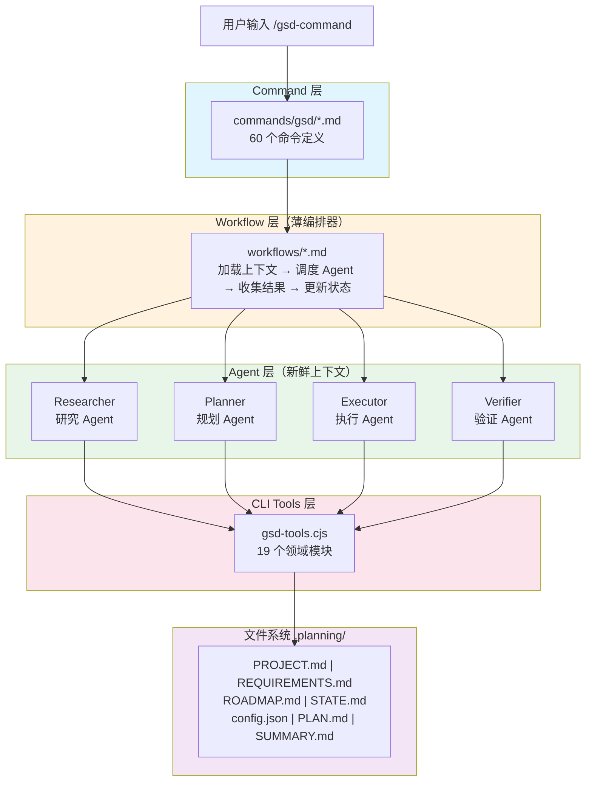
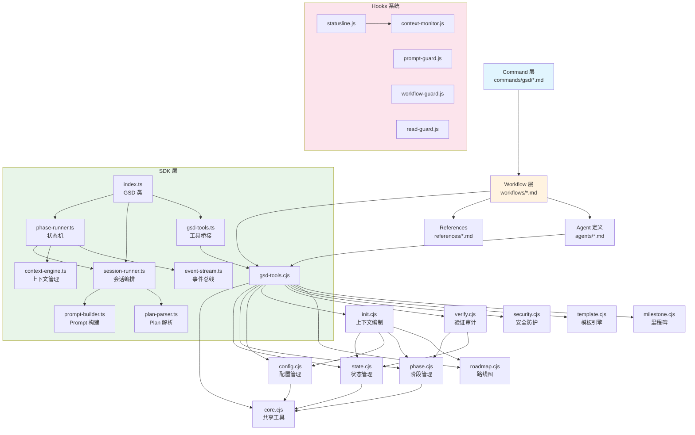
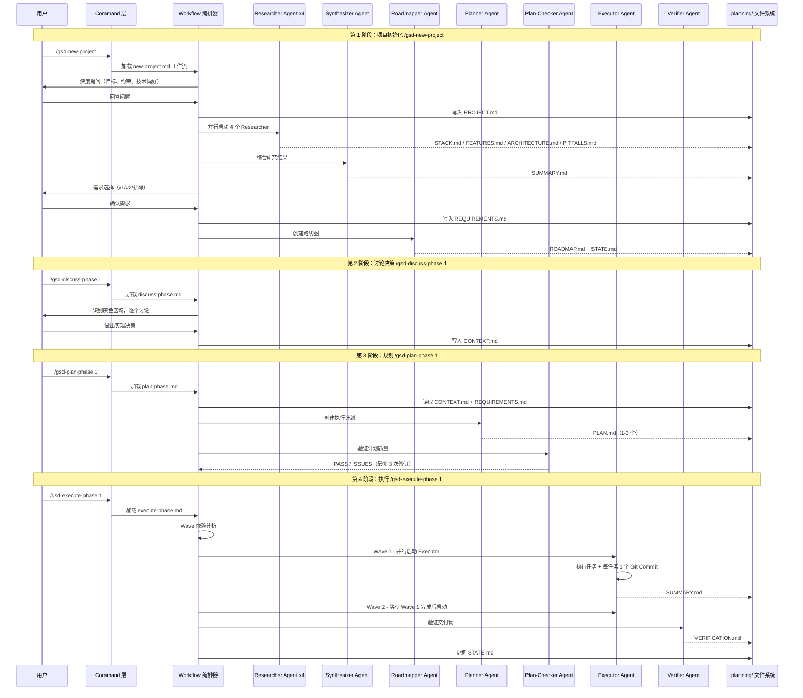
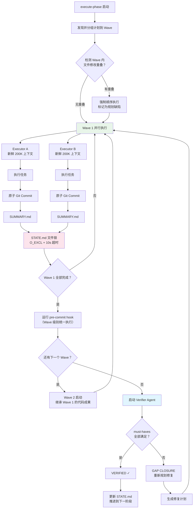

# get-shit-done 源码学习笔记

> 仓库地址：[get-shit-done](https://github.com/gsd-build/get-shit-done)
> 学习日期：2026-04-05

---

> **以下为 AI 源码分析**
>
> ### 一句话概括
>
> GSD 是一个轻量级元提示（meta-prompting）与上下文工程框架，通过多 Agent 编排和规范驱动开发流程，解决 AI 编码代理在长会话中的上下文衰变（context rot）问题，让 Claude Code 等工具能可靠地完成大型软件项目。
>
> ### 要点速览
>
> | 核心模块 | 职责 | 关键文件 |
> |---------|------|---------|
> | Command 层 | 用户入口，60 个斜杠命令 | `commands/gsd/*.md` |
> | Workflow 层 | 编排逻辑，加载上下文、调度 Agent | `get-shit-done/workflows/*.md` |
> | Agent 层 | 21 个专用 Agent（研究、规划、执行、验证等） | `agents/*.md` |
> | CLI Tools 层 | 状态管理、配置、模板、安全等 19 个模块 | `get-shit-done/bin/lib/*.cjs` |
> | Hooks 系统 | 上下文监控、提示注入防护、工作流守卫 | `hooks/*.js` |
> | SDK | TypeScript 实现的无头自动化 SDK | `sdk/src/*.ts` |
> | Templates | 所有规划工件的 Markdown 模板 | `get-shit-done/templates/*.md` |
> | References | 共享知识文档，Agent 契约和行为参考 | `get-shit-done/references/*.md` |

---

## 项目简介

GSD（Get Shit Done）是一个面向 AI 编码代理（Claude Code、Gemini CLI、OpenCode、Codex、Copilot 等 12 种运行时）的**元提示框架**。它解决了一个核心问题：当 AI 编码代理在长对话中逐渐填满上下文窗口时，输出质量会严重下降（称为"上下文衰变"）。

GSD 的核心方案是将大型项目拆分为原子化的阶段和计划，每个计划由一个**全新上下文窗口**（200K tokens）的子 Agent 执行，编排器只负责调度和状态管理。用户只需运行几个简单命令（`/gsd-new-project` → `/gsd-plan-phase` → `/gsd-execute-phase`），背后的复杂上下文工程、多 Agent 并行执行、原子 Git 提交和自动验证全部由框架处理。

## 技术栈

| 类别 | 技术 |
|------|------|
| 语言 | JavaScript (CommonJS) + TypeScript (SDK) |
| 框架 | Node.js CLI（无 Web 框架） |
| 构建工具 | esbuild（Hooks 构建）、tsc（SDK 编译） |
| 依赖管理 | npm |
| 测试框架 | vitest + node:assert/strict |
| 运行要求 | Node.js >= 22.0.0 |

## 目录结构

```
get-shit-done/
├── bin/                          # npm 安装入口
│   └── install.js                # ~3000 行安装器，支持 12 种运行时
├── commands/gsd/                 # 60 个用户命令定义（Markdown + YAML frontmatter）
│   ├── new-project.md            # 项目初始化命令
│   ├── plan-phase.md             # 阶段规划命令
│   ├── execute-phase.md          # 阶段执行命令
│   ├── quick.md                  # 快速任务命令
│   └── ...
├── get-shit-done/                # 核心框架
│   ├── bin/
│   │   ├── gsd-tools.cjs         # CLI 工具路由器（Agent 调用的桥接层）
│   │   └── lib/                  # 19 个领域模块
│   │       ├── core.cjs          # 共享工具、路径、错误处理（1533 行）
│   │       ├── state.cjs         # STATE.md 操作、进度追踪（1353 行）
│   │       ├── init.cjs          # 工作流上下文编制（1522 行）
│   │       ├── phase.cjs         # 阶段 CRUD、十进制编号（931 行）
│   │       ├── verify.cjs        # 验证和审计（1032 行）
│   │       ├── config.cjs        # 配置管理
│   │       ├── security.cjs      # 路径/注入/JSON 安全防护
│   │       ├── template.cjs      # 模板选择和填充
│   │       └── ...
│   ├── workflows/                # 60 个工作流编排定义
│   │   ├── new-project.md        # 项目初始化编排（1653 行）
│   │   ├── plan-phase.md         # 阶段规划编排（1031 行）
│   │   ├── execute-phase.md      # 阶段执行编排
│   │   └── ...
│   ├── references/               # 25 个共享知识文档
│   │   ├── model-profiles.md     # Agent 模型分配策略
│   │   ├── questioning.md        # 项目初始化提问哲学
│   │   ├── verification-patterns.md
│   │   └── ...
│   └── templates/                # 规划工件 Markdown 模板
│       ├── project.md
│       ├── roadmap.md
│       ├── phase-prompt.md
│       └── ...
├── agents/                       # 21 个专用 Agent 定义
│   ├── gsd-planner.md            # 规划 Agent
│   ├── gsd-executor.md           # 执行 Agent
│   ├── gsd-verifier.md           # 验证 Agent
│   ├── gsd-project-researcher.md # 项目研究 Agent
│   └── ...
├── hooks/                        # 运行时 Hooks
│   ├── gsd-context-monitor.js    # 上下文使用监控
│   ├── gsd-prompt-guard.js       # 提示注入检测
│   ├── gsd-statusline.js         # 状态栏显示
│   └── ...
├── sdk/                          # TypeScript SDK（无头自动化执行）
│   └── src/
│       ├── index.ts              # GSD 类，SDK 入口
│       ├── phase-runner.ts       # 阶段执行状态机（核心）
│       ├── plan-parser.ts        # YAML+XML 计划解析器
│       ├── event-stream.ts       # 事件总线
│       └── ...
├── scripts/                      # 构建和安全扫描脚本
├── tests/                        # 90+ 个测试文件
└── docs/                         # 多语言文档
```

## 架构设计

### 整体架构

GSD 采用**四层分离架构**，核心设计理念是"薄编排器 + 专用 Agent + 文件系统状态"：

1. **Command 层**：用户入口，每个命令是一个 Markdown 文件，包含 YAML frontmatter（工具权限）和指向 Workflow 的引用
2. **Workflow 层**：编排逻辑，负责加载上下文、调度 Agent、收集结果、更新状态，**永远不做重活**
3. **Agent 层**：21 个专用 Agent，每个获得**全新上下文窗口**，执行具体的研究/规划/执行/验证任务
4. **CLI Tools 层**：Node.js 工具集，提供状态管理、配置操作、模板填充等基础能力



### 核心模块

#### 1. 安装器（`bin/install.js`）

- **职责**：~3000 行安装脚本，将 GSD 部署到 12 种 AI 运行时
- **核心文件**：`bin/install.js`
- **关键功能**：
  - 运行时检测与选择（Claude Code / Gemini / OpenCode / Codex 等）
  - 文件部署与运行时适配（工具名映射、Hook 事件名转换、路径规范化）
  - 设置集成（注册 Hooks 到运行时的 `settings.json`）
  - 补丁备份（`gsd-local-patches/`）和清单追踪（`gsd-file-manifest.json`）
  - 卸载模式（`--uninstall`）

#### 2. CLI 工具路由器（`get-shit-done/bin/gsd-tools.cjs`）

- **职责**：Agent 与文件系统之间的桥接层，所有 Agent 通过 Bash 调用它来操作状态
- **核心文件**：`gsd-tools.cjs`
- **关键接口**：
  - `init <workflow> <phase>` — 为指定工作流编制上下文 JSON（包含项目信息、配置、状态、阶段详情）
  - `resolve-model <agent-name>` — 根据 model profile 解析 Agent 应使用的模型
  - `state update/patch/advance-plan` — 操作 STATE.md
  - `config-new-project` — 创建初始配置
  - `template fill/scaffold` — 模板填充和脚手架

#### 3. 状态管理模块（`lib/state.cjs`）

- **职责**：管理 STATE.md 的读写、进度追踪、性能指标，是整个系统的"记忆中枢"
- **核心文件**：`get-shit-done/bin/lib/state.cjs`（1353 行）
- **关键功能**：
  - STATE.md 解析与写入（文件锁定，`O_EXCL` 原子创建 + 10 秒超时）
  - 阶段进度追踪和推进
  - 性能指标记录（执行速度、持续时间）
  - 决策和阻塞记录
- **与其他模块关系**：被所有 Agent 和 Workflow 读取/更新

#### 4. 阶段管理模块（`lib/phase.cjs`）

- **职责**：阶段 CRUD 操作和十进制编号管理
- **核心文件**：`get-shit-done/bin/lib/phase.cjs`（931 行）
- **关键功能**：
  - 阶段目录创建、插入、删除、重编号
  - 十进制子阶段编号（`01`, `01.1`, `01.2`）
  - 计划索引和 Wave 分组分析
  - 文件修改重叠检测（防止并行执行冲突）

#### 5. 安全模块（`lib/security.cjs`）

- **职责**：三层防御 — 路径验证、提示注入检测、安全 JSON 解析
- **核心文件**：`get-shit-done/bin/lib/security.cjs`（384 行）
- **关键功能**：
  - 路径穿越防护（验证文件路径在项目目录内）
  - 30+ 提示注入模式检测（正则匹配）
  - 安全 JSON 解析（防止畸形输入破坏状态）
  - Shell 参数验证（防止命令注入）

#### 6. SDK 阶段执行引擎（`sdk/src/phase-runner.ts`）

- **职责**：阶段生命周期状态机，控制 Discuss → Research → Plan → Execute → Verify → Advance 的完整流程
- **核心文件**：`sdk/src/phase-runner.ts`
- **关键设计**：
  - 状态机驱动：每个步骤有条件跳过逻辑（如 `skip_discuss=true`）
  - retry-once 模式：未预期异常只重试一次
  - 研究门控（Research Gate）：阻塞有未解决开放问题的研究
  - 计划检查失败自修复：最多 3 次迭代修订循环
  - 人类门控回调接口（`onDiscussApproval`, `onVerificationReview`, `onBlockerDecision`）

#### 7. 事件总线（`sdk/src/event-stream.ts`）

- **职责**：SDK 事件系统，支持 20+ 事件类型和多 Transport 消费
- **核心文件**：`sdk/src/event-stream.ts`
- **关键设计**：
  - `GSDEventStream` 继承 `EventEmitter`，发射判别式联合事件
  - Transport 接口隔离：单个坏 Transport 不影响其他消费者
  - 内建成本追踪：每个 Session 独立成本桶，累积 USD

### 模块依赖关系



## 核心流程

### 流程一：项目初始化到阶段执行（核心主流程）

这是 GSD 最核心的端到端流程，从用户的一个想法到代码交付的完整链路：



**关键设计要点：**

1. **新鲜上下文**：每个 Agent 获得 200K tokens 的全新上下文窗口，Workflow 编排器主窗口仅消耗 30-40%
2. **深度提问**（`questioning.md` 哲学）：不满足于表面回答，跟随线索深入挖掘用户真实意图
3. **Goal-Backward 方法**：路线图从"阶段完成时什么必须为真？"出发，派生成功标准而非任务列表
4. **Wave 并行化**：独立计划在同一 Wave 并行执行，有依赖的计划在后续 Wave 顺序执行
5. **修订循环**：Plan-Checker 最多 3 次迭代验证计划质量，确保 100% 需求覆盖

### 流程二：Wave 并行执行与状态同步

这是 `/gsd-execute-phase` 的内部执行引擎，展示了多 Agent 并行执行的核心机制：



**关键设计要点：**

1. **文件修改重叠检测**：同一 Wave 中两个计划修改同一文件 → 强制顺序执行，避免 worktree 冲突
2. **STATE.md 文件锁**：`O_EXCL` 原子创建 + 自旋等待 + 抖动（jitter），防止并行 Agent 的读-改-写竞态
3. **Wave 级 pre-commit hook**：并行 Agent 跳过 hook（`--no-verify`），编排器在 Wave 完成后统一运行
4. **Gap Closure**：Verifier 发现缺口后，自动生成修复计划并重新执行，形成闭环

## 关键设计亮点

### 1. 上下文工程（Context Engineering）— 解决 AI 长对话质量衰减

- **解决的问题**：AI 代理在长对话中逐渐填满上下文窗口，输出质量严重下降
- **实现方式**：每个 Agent 获得全新的 200K tokens 上下文窗口，Workflow 编排器只做轻量调度。上下文通过结构化文件（PROJECT.md、CONTEXT.md、PLAN.md 等）传递给每个 Agent，而非堆积在单一会话中
- **关键文件**：`sdk/src/context-engine.ts`（按阶段类型定义文件清单）、`sdk/src/prompt-builder.ts`（构建精确的 Agent Prompt）
- **为什么这样设计**：200K tokens 是 Claude 质量稳定的甜区，超过后输出开始退化。通过"薄编排器 + 新鲜子 Agent"模式，主窗口仅消耗 30-40%，工作全在子窗口完成

### 2. 防浅层执行规则（Anti-Shallow Execution）— 让 AI 真正"做深"

- **解决的问题**：AI 倾向于生成表面代码（"对齐 X 与 Y"而非具体值），导致功能不完整
- **实现方式**：每个 PLAN.md 任务强制包含三个块 — `<read_first>`（执行前必读文件）、`<action>`（含具体值的操作指令）、`<acceptance_criteria>`（可验证条件如 `grep`/测试输出）。Plan-Checker Agent 检测并拒绝模糊指令
- **关键文件**：`agents/gsd-planner.md`（深度工作规则定义）、`get-shit-done/references/universal-anti-patterns.md`
- **为什么这样设计**：Executor Agent 从计划文本工作，模糊指令 → 浅层代码 → Bug。具体指令 → 完整实现 → 通过验证

### 3. 决策保真度系统（Decision Fidelity）— 用户决策不可被 AI 覆盖

- **解决的问题**：AI 可能"聪明地"用更简单的方案替代用户锁定的决策（如用户选了库 X，AI 用了库 Y）
- **实现方式**：`CONTEXT.md` 中标记 `D-01`, `D-02` 等锁定决策，Planner 必须引用决策 ID（如 "per D-03"），Plan-Checker 验证每个决策都被计划覆盖。如果研究建议替代方案，仍必须使用用户选择
- **关键文件**：`get-shit-done/workflows/discuss-phase.md`（决策捕获）、`get-shit-done/templates/context.md`（CONTEXT.md 结构）
- **为什么这样设计**：用户花时间讨论的决策是"锁定"的。AI 代理的自由度仅限于"Claude's Discretion"区域

### 4. 文件系统状态管理（File-Based State）— 无数据库的持久化

- **解决的问题**：需要在 AI 会话重启（`/clear`）、上下文压缩后保持项目记忆
- **实现方式**：所有状态保存在 `.planning/` 目录的 Markdown 和 JSON 文件中。`STATE.md` 记录当前位置、决策、阻塞和指标。使用 `O_EXCL` 文件锁实现并行安全的原子写入
- **关键文件**：`get-shit-done/bin/lib/state.cjs`（文件锁定、原子写入）、`get-shit-done/bin/lib/phase.cjs`（十进制阶段编号）
- **为什么这样设计**：无需数据库或外部依赖，状态对人类和 AI 都可读，可 Git 提交实现团队可见性。"缺失即启用"（absent = enabled）模式简化配置

### 5. 多层安全防护（Defense in Depth）— 防止提示注入和数据泄露

- **解决的问题**：GSD 生成的 Markdown 文件会成为 LLM 系统提示，用户输入可能包含间接提示注入
- **实现方式**：三层防护 — (1) `security.cjs` 在入口点验证路径、检测 30+ 注入模式、安全解析 JSON (2) `gsd-prompt-guard.js` Hook 在 PreToolUse 阶段扫描写入 `.planning/` 的内容 (3) 隐形 Unicode 检测（零宽空格、RTL 标记等）。所有防护均为 advisory（建议而非阻止），避免误杀合法操作
- **关键文件**：`get-shit-done/bin/lib/security.cjs`、`hooks/gsd-prompt-guard.js`、`hooks/gsd-read-guard.js`
- **为什么这样设计**：Planning 工件是 LLM 提示的一部分，任何用户输入都是潜在注入向量。多层检测在不同阶段拦截，advisory 模式平衡安全性和可用性
