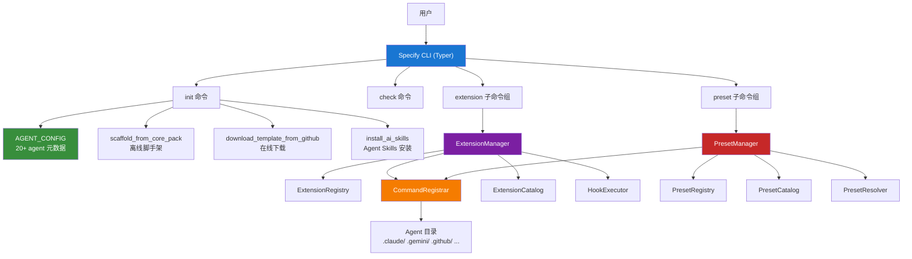
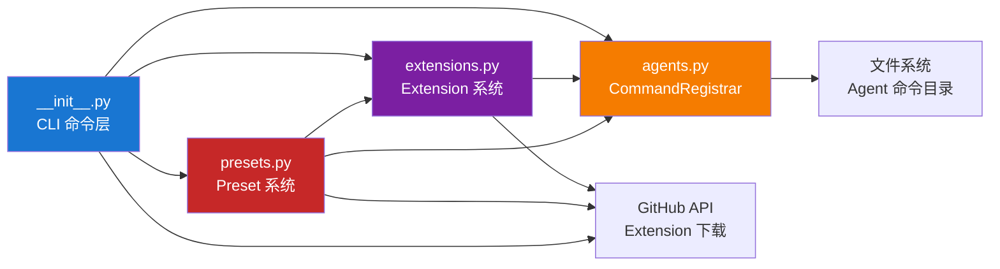
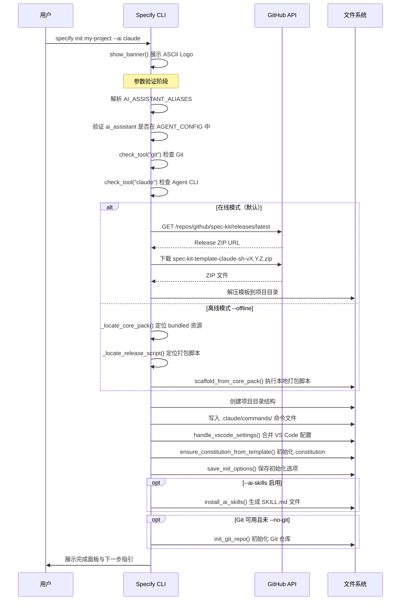
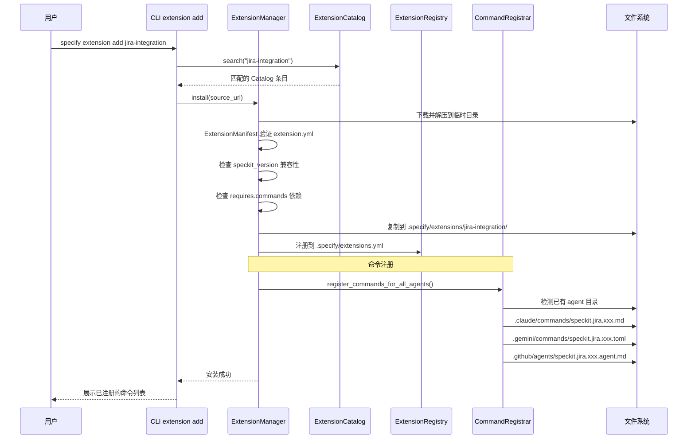

# spec-kit 源码学习笔记

> 仓库地址：[spec-kit](https://github.com/github/spec-kit)
> 学习日期：2026-03-22

---

> **以下为 AI 源码分析**
>
> ### 一句话概括
>
> GitHub 官方开源的 Spec-Driven Development (SDD) 工具包，通过 Specify CLI 将自然语言需求规格转化为可执行的开发计划和任务，支持 20+ 种 AI 编码助手。
>
> ### 要点速览
>
> | 核心模块 | 职责 | 关键文件 |
> |---------|------|---------|
> | Specify CLI | 项目初始化与 AI agent 集成 | `src/specify_cli/__init__.py` |
> | Extension System | 插件化扩展管理（安装/卸载/Catalog） | `src/specify_cli/extensions.py` |
> | Preset System | 模板预设管理与解析 | `src/specify_cli/presets.py` |
> | Command Registrar | 跨 agent 命令注册与格式转换 | `src/specify_cli/agents.py` |
> | Templates | SDD 工作流命令模板（specify/plan/tasks 等） | `templates/commands/*.md` |
> | Scripts | 跨平台辅助脚本（Bash + PowerShell） | `scripts/bash/`, `scripts/powershell/` |

---

## 项目简介

GitHub Spec Kit 是一个实现 **Spec-Driven Development (SDD)** 方法论的开源工具包。SDD 的核心思想是"规格驱动代码"——将需求规格（Specification）作为开发的第一公民，让 AI 根据精确的规格文档生成实现代码，而非传统的"先写代码、再补文档"模式。

Spec Kit 通过 `specify` CLI 工具为项目生成标准化的目录结构、模板和 AI agent 命令文件，使开发者能通过 `/speckit.specify`、`/speckit.plan`、`/speckit.tasks`、`/speckit.implement` 等 slash command 驱动完整的 SDD 工作流。项目支持 Claude Code、GitHub Copilot、Gemini CLI、Cursor 等 20+ 种 AI 编码助手，且通过 Extension 和 Preset 系统实现了高度可扩展性。

## 技术栈

| 类别 | 技术 |
|------|------|
| 语言 | Python 3.11+ |
| 框架 | Typer (CLI) + Rich (终端 UI) |
| 构建工具 | Hatchling |
| 依赖管理 | uv / pip |
| 测试框架 | pytest + pytest-cov |
| HTTP 客户端 | httpx (支持 SOCKS 代理) |
| 配置解析 | PyYAML + json5 |
| 版本管理 | packaging (SemVer 兼容性检查) |

## 目录结构

```
spec-kit/
├── src/specify_cli/          # CLI 核心源码
│   ├── __init__.py           # 主入口：CLI 命令定义、AGENT_CONFIG、init/check 逻辑（4400+ 行）
│   ├── agents.py             # CommandRegistrar：跨 agent 命令注册与格式转换
│   ├── extensions.py         # Extension 系统：Manifest 验证、Registry、Manager、Catalog
│   └── presets.py            # Preset 系统：模板预设的安装/解析/优先级管理
├── templates/                # SDD 模板文件
│   ├── commands/             # AI agent 命令模板（specify.md、plan.md、tasks.md 等）
│   ├── spec-template.md      # 需求规格模板
│   ├── plan-template.md      # 技术计划模板
│   └── tasks-template.md     # 任务分解模板
├── scripts/                  # 跨平台辅助脚本
│   ├── bash/                 # Bash 脚本（create-new-feature.sh、setup-plan.sh 等）
│   └── powershell/           # PowerShell 脚本（对应 Bash 的等价实现）
├── extensions/               # Extension 系统文档与模板
│   ├── RFC-EXTENSION-SYSTEM.md  # Extension 系统 RFC 设计文档
│   ├── catalog.json          # 官方 Extension 目录
│   └── template/             # Extension 开发模板
├── presets/                  # Preset 系统
│   ├── ARCHITECTURE.md       # Preset 架构文档
│   ├── catalog.json          # 官方 Preset 目录
│   └── scaffold/             # 内置 scaffold preset
├── tests/                    # 测试文件
├── docs/                     # 项目文档（DocFX 格式）
├── .github/workflows/        # CI/CD（lint、test、release、CodeQL）
└── pyproject.toml            # 项目配置与依赖声明
```

## 架构设计

### 整体架构

Spec Kit 采用 **分层架构 + 插件化** 设计。最上层是 Typer CLI 框架提供的命令行入口，中间层是核心业务逻辑（项目初始化、模板处理、agent 命令生成），底层是 Extension 和 Preset 两个可插拔的扩展系统。所有 agent 的差异通过统一的 `AGENT_CONFIG` 字典和 `CommandRegistrar` 抽象层屏蔽。



### 核心模块

#### 1. Specify CLI 主模块 (`src/specify_cli/__init__.py`)

**职责**：定义所有 CLI 命令、AGENT_CONFIG 元数据、项目初始化与脚手架逻辑。

这是项目最核心也最庞大的文件（4400+ 行），包含：

- **AGENT_CONFIG 字典**（L129-L312）：所有 AI agent 的元数据注册表，包括名称、目录、命令子目录、安装 URL 和 CLI 工具要求。以**实际 CLI 工具名**为 key（如 `cursor-agent` 而非 `cursor`），避免特殊映射。
- **`init()` 命令**（L1714-L2244）：项目初始化的核心流程，支持在线下载模板（GitHub Release）和离线脚手架（`--offline` 从 bundled core_pack 生成），交互式 AI agent 选择，模板解压和命令文件安装。
- **`check()` 命令**（L2245-L2288）：检查开发环境中所需工具的安装状态。
- **`scaffold_from_core_pack()`**（L1153-L1335）：离线模式的核心——调用 bundled 的 release script 在临时目录中生成项目结构，保证与 GitHub Release ZIP 字节级一致。
- **`install_ai_skills()`**（L1502-L1672）：将 Prompt.MD 命令模板转换为符合 agentskills.io 规范的 SKILL.md 文件。
- **StepTracker**（L359-L442）：基于 Rich Tree 的进度追踪渲染器，支持 Live 自动刷新。
- **`select_with_arrows()`**（L464-L537）：基于 Rich Live + readchar 的交互式箭头键选择 UI。

#### 2. Command Registrar (`src/specify_cli/agents.py`)

**职责**：将命令模板注册到不同 AI agent 的目录中，处理格式转换。

- **`CommandRegistrar` 类**：核心类，维护 `AGENT_CONFIGS` 字典（与主模块的 `AGENT_CONFIG` 不同，这个专注于命令文件格式），定义每个 agent 的命令目录、文件格式（Markdown/TOML）、参数占位符（`$ARGUMENTS`/`{{args}}`）和文件扩展名。
- **`register_commands()`**：为指定 agent 注册命令，处理 frontmatter 解析、参数占位符转换、SKILL.md 渲染等。
- **`register_commands_for_all_agents()`**：自动检测项目中已有的 agent 目录，为所有检测到的 agent 批量注册命令。
- **格式转换**：Markdown 格式（Claude、Cursor 等大多数 agent）、TOML 格式（Gemini、Tabnine）、SKILL.md 格式（Codex、Kimi）、Copilot 特殊的 `.agent.md` + `.prompt.md` 双文件格式。

#### 3. Extension System (`src/specify_cli/extensions.py`)

**职责**：模块化扩展管理，允许集成 Jira、Linear、Azure DevOps 等外部工具。

关键类：
- **`ExtensionManifest`**：加载和验证 `extension.yml` 清单文件，校验 schema 版本、必填字段和版本兼容性。
- **`ExtensionRegistry`**：管理 `.specify/extensions.yml` 注册表，记录已安装 extension 的元数据。
- **`ExtensionManager`**：核心管理器，处理 extension 的安装（从 GitHub/本地 ZIP）、卸载、启用/禁用、优先级调整，安装时自动调用 `CommandRegistrar` 注册命令。
- **`ExtensionCatalog`**：多 Catalog 栈支持，允许叠加官方目录和社区目录，按优先级搜索和发现 extension。
- **`ConfigManager`**：Extension 配置管理，处理 `.specify/extensions/<id>/config.yml` 的读写和合并。
- **`HookExecutor`**：Extension hook 执行器，在 SDD 工作流的关键节点（before_specify、after_tasks 等）触发 extension 定义的命令。

#### 4. Preset System (`src/specify_cli/presets.py`)

**职责**：可版本化、可叠加的模板预设管理。

关键类：
- **`PresetManifest`**：验证 `preset.yml` 清单文件。
- **`PresetRegistry`**：管理 `.specify/presets.yml` 注册表。
- **`PresetManager`**：处理 preset 的安装/卸载，支持三种模板类型：template（页面模板覆盖）、command（命令模板覆盖）、script（脚本覆盖）。
- **`PresetResolver`**：模板解析优先级链——Override > Preset > Extension > Core，多个 preset 按 priority 数值排序（越小优先级越高）。
- **`PresetCatalog`**：Preset 目录的多 Catalog 栈管理。

### 模块依赖关系



## 核心流程

### 流程一：`specify init` 项目初始化

这是用户使用 Spec Kit 的第一个也是最关键的命令，负责完整的项目脚手架搭建。



**关键实现细节**：
- `download_template_from_github()` (L837) 使用 httpx 下载 GitHub Release 中预打包的 ZIP 文件，根据 agent 类型和脚本类型（sh/ps）选择对应的包。
- `scaffold_from_core_pack()` (L1153) 是离线模式的核心——它在临时目录中构建一个仿 repo 的目录结构，然后调用与 CI 相同的 `create-release-packages.sh` 脚本生成项目，保证线上线下**字节级一致**。
- `handle_vscode_settings()` (L689) 使用 json5 库解析 JSONC 格式，执行"礼貌合并"——新 key 添加，已有 key 保留，嵌套字典递归合并。

### 流程二：Extension 安装流程

Extension 系统的安装流程展示了 Spec Kit 的插件化架构设计。



**关键实现细节**：
- Extension manifest 要求 `schema_version: "1.0"` 和四个必填顶层字段（`schema_version`、`extension`、`requires`、`provides`）。
- `CommandRegistrar.register_commands_for_all_agents()` 自动扫描项目中已存在的 agent 目录，只为已配置的 agent 注册命令，无需用户手动指定。
- 命令名遵循 `speckit.<ext-id>.<cmd-name>` 的三段式命名规范，系统通过 dot 段数判断是核心命令（2 段）还是 extension 命令（3+ 段）。

## 关键设计亮点

### 1. AGENT_CONFIG 单一事实来源

**解决的问题**：支持 20+ 种 AI agent，每种有不同的目录结构、命令格式和参数占位符，如何避免特殊映射逻辑散落在代码各处。

**实现方式**：在 `__init__.py` 中维护一个 `AGENT_CONFIG` 字典（L129-L312），以**实际 CLI 可执行文件名**为 key（如 `cursor-agent` 而非 `cursor`），包含 `name`、`folder`、`commands_subdir`、`install_url`、`requires_cli` 五个字段。所有 CLI 命令（init、check）通过遍历这个字典实现通用逻辑，不需要任何 agent-specific 的 if-else 分支。

**为什么这样设计**：使用实际 CLI 工具名作为 key，让 `shutil.which(tool)` 的工具检测"开箱即用"，无需在 `check_tool()` 中维护名称映射表。这是项目通过 Cursor agent 命名问题（`cursor` vs `cursor-agent`）总结出的经验。

### 2. 离线脚手架与 CI 复用同一脚本

**解决的问题**：离线模式（`--offline`）生成的项目结构必须与 GitHub Release 中下载的 ZIP 包完全一致。

**实现方式**：`scaffold_from_core_pack()` (L1153) 在临时目录中重建一个"迷你 repo"的目录结构（templates/commands/、scripts/ 等），然后调用与 GitHub Actions 完全相同的 `create-release-packages.sh` 脚本生成 ZIP 包。通过 Hatchling 的 `force-include` 机制将模板和脚本打包到 wheel 中的 `specify_cli/core_pack/` 目录。

**为什么这样设计**：避免维护两套模板处理逻辑，保证线上线下一致性，适合企业环境和 air-gapped 网络场景。

### 3. 多格式 CommandRegistrar 抽象

**解决的问题**：不同 agent 需要不同格式的命令文件（Markdown vs TOML vs SKILL.md），以及不同的参数占位符（`$ARGUMENTS` vs `{{args}}`）。

**实现方式**：`CommandRegistrar`（`agents.py`）维护独立的 `AGENT_CONFIGS`，为每个 agent 定义 `dir`、`format`、`args`、`extension` 四个属性。`register_commands()` 方法自动执行 frontmatter 解析、参数占位符转换、格式渲染，对 Copilot 还额外生成伴生的 `.prompt.md` 文件。Extension 和 Preset 系统都通过这个 Registrar 注册命令，确保格式一致。

**为什么这样设计**：一次编写命令模板（Markdown 格式），自动适配所有 agent，大幅降低了新增 agent 支持的工作量。

### 4. Preset 模板解析优先级链

**解决的问题**：多个 preset 可叠加安装，项目还可能有本地覆盖，需要明确的模板解析顺序。

**实现方式**：`PresetResolver` 实现四级优先级链——Override（本地覆盖）> Preset（按 priority 数值排序）> Extension > Core（默认模板）。解析逻辑在 Python、Bash、PowerShell 三处同步实现以确保一致性。

**为什么这样设计**：允许用户从最具体（项目级 override）到最通用（core template）灵活定制 SDD 工作流，同时保持可预测的行为。

### 5. Extension Hook 系统

**解决的问题**：Extension 需要在 SDD 工作流的关键节点（specify 之前、tasks 之后等）注入自定义逻辑。

**实现方式**：Extension manifest 的 `hooks` 字段声明 hook 点（如 `before_specify`、`after_tasks`），每个 hook 定义 `command`、`optional`、`prompt`、`condition` 属性。命令模板（如 `specify.md`）在执行前后主动检查 `.specify/extensions.yml` 中注册的 hook，mandatory hook 自动执行，optional hook 展示给用户选择。

**为什么这样设计**：将 hook 执行的职责分散到各个命令模板中（而非集中在 CLI 代码中），使得 AI agent 能通过阅读 Markdown 模板理解 hook 语义，实现"规格即执行"的 SDD 理念。
