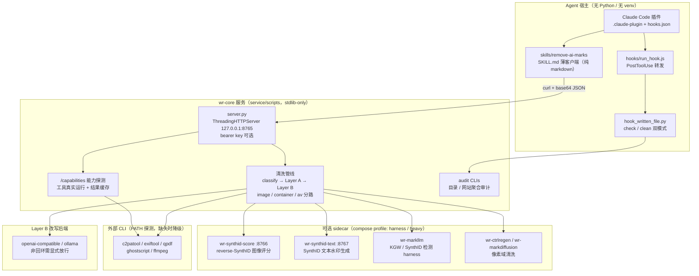
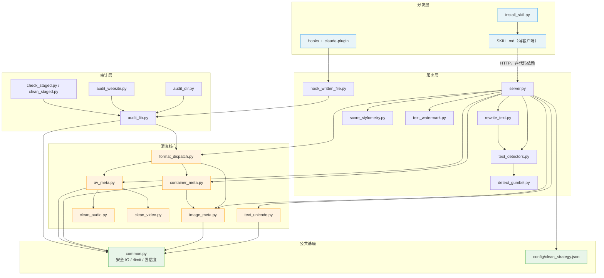
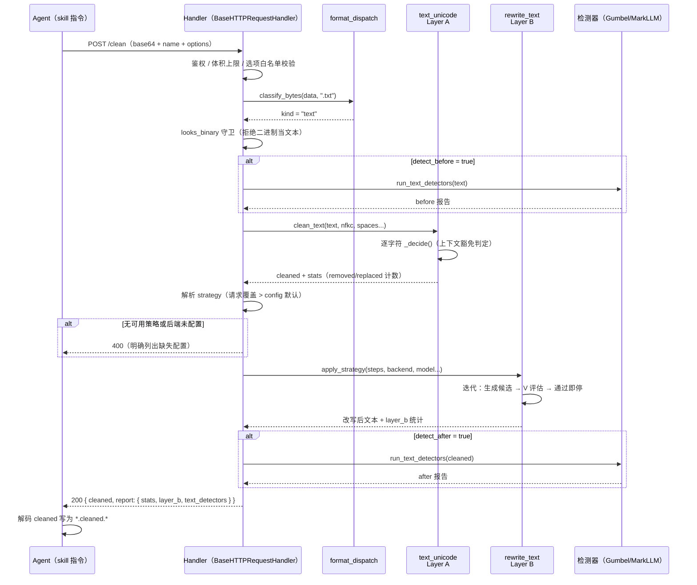
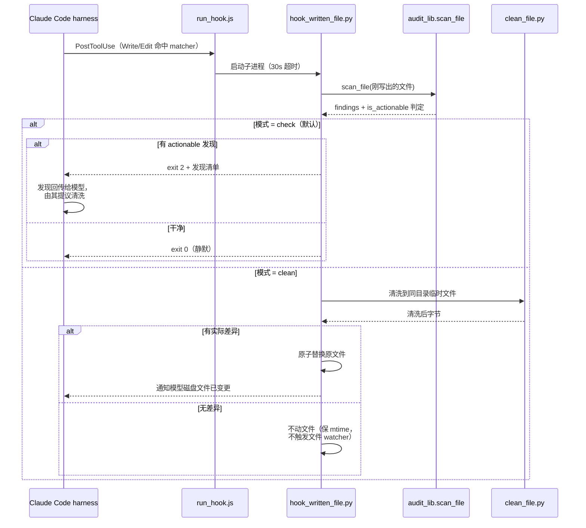

# watermarks-remover 源码学习笔记

> 仓库地址：[guillaumemeyer/watermarks-remover](https://github.com/guillaumemeyer/watermarks-remover)
> 学习日期：2026-09-30

---

> **以下为 AI 源码分析**
>
> ### 一句话概括
>
> 一套"薄 skill + 厚 service"的 Agent Skill 工程范本：skill 只是一份教 agent 用 curl 调 HTTP 服务的 markdown 指令，所有确定性清洗逻辑在零第三方依赖的 stdlib Python 服务里，按三层（Layer A 不可见 Unicode / Layer B 统计水印改写 / 文件元数据）从自有内容上剥离多厂商 AI 溯源标记。
>
> ### 要点速览
>
> | 模块 | 职责 | 关键文件 |
> |------|------|----------|
> | Agent Skill（薄客户端） | 教 agent 检查服务健康、inspect 后再 clean，绝不本地清洗 | `skills/remove-ai-marks/SKILL.md` |
> | 自包含轻量 skill | 无服务依赖的纯文本 Layer A 清洗版 | `skills/clean-user-facing-text/` |
> | HTTP 服务入口 | 8 个端点 + 4 个 batch 变体，ThreadingHTTPServer | `service/scripts/server.py` |
> | 格式分发 | 扩展名优先、magic bytes 兜底的唯一分类真源 | `service/scripts/format_dispatch.py` |
> | Layer A 引擎 | 不可见 Unicode / 空格同形字 / bidi 的检测与清洗 | `service/scripts/text_unicode.py` |
> | Layer B 引擎 | 策略化文本改写（paraphrase / mlm / humanize …）驱动统计水印失效 | `service/scripts/rewrite_text.py` |
> | 检测器协议 | fail-soft 的统一 `name/available/detect` 协议（MarkLLM / Gumbel / claude-text 占位） | `service/scripts/text_detectors.py` |
> | 三类媒体清洗 | 图像 / 文档容器 / 音视频的元数据剥离 | `image_meta.py`、`container_meta.py`、`av_meta.py` |
> | 聚合审计 | 目录 / 网站级扫描，四档置信度 + SARIF 输出 | `audit_lib.py`、`audit_dir.py`、`audit_website.py` |
> | 水印窃取研究 | SynthID 类文本水印的黑盒 s* 估计器（query → count → scrub） | `stealer/` |
> | Skill 安装器 | 跨 5 种 host 安装 + Agent Skills 规范校验 + 原子替换 | `install_skill.py` |
> | Claude Code 插件 | plugin marketplace 分发 + PostToolUse 确定性 hook | `.claude-plugin/`、`hooks/` |

---

## 项目简介

watermarks-remover 解决的问题是：AI 生成的内容（无论 Claude、Gemini/SynthID 还是 open-LLM）会携带多层溯源标记——文本里埋不可见 Unicode、token 采样级统计水印，图像和文档里写 C2PA / EXIF / XMP 元数据。当你想清理**自己拥有**的内容（隐私、卫生、研究）时，需要一套不依赖特定 agent 宿主、能覆盖"文本 + 17 种文件格式"的机械化清洗管线。

它的核心价值在于架构选择而非算法突破：把清洗能力做成**独立 HTTP 服务**（stdlib-only，无 venv 依赖），把 agent 侧做成**纯 markdown 指令的 skill**（教模型 curl 服务），两者用 base64-over-JSON 的 OpenAPI 契约连接。agent 宿主不需要 Python 环境，服务可以跑在 Docker 或裸机上，重后端（MarkLLM 检测、CtrlRegen 像素清洗、reverse-SynthID 评分）全部外置成 compose profile 的可选 sidecar。同时项目对"不确定性"极度诚实：所有检测结论分四档置信度，能力探测（`/capabilities`）驱动 agent 只承诺服务真实拥有的能力，vendor 检测器不可用时占位报告 unavailable 而非假装干净。

## 技术栈

| 类别 | 技术 |
|------|------|
| 语言 | Python 3.10+（核心管线 stdlib-only，零第三方运行时依赖） |
| 框架 | `http.server.ThreadingHTTPServer`（无 Web 框架）+ `argparse` CLI |
| 构建工具 | Makefile（test/lint/serve/compose/bench 目标）+ Docker multi-Dockerfile |
| 依赖管理 | 仅 dev 依赖（`requirements-dev.txt`：pytest + ruff）；重后端各配独立 requirements |
| 测试框架 | pytest（约 80 个测试文件，`pytest.ini` 收敛 rootdir） |
| 可选外部 CLI | c2patool / exiftool / qpdf / ghostscript / ffmpeg（能力探测 + 降级路径） |
| 可选 ML 后端 | MarkLLM（KGW/SynthID 检测）、CtrlRegen / MarkDiffusion（像素清洗）、reverse-SynthID（评分） |
| 分发渠道 | Claude Code plugin marketplace、`install_skill.py`（claude-code/cursor/cowork）、GHCR 镜像 |

## 目录结构

```text
watermarks-remover/
├── skills/                        # Agent Skill 定义（薄客户端，不含清洗代码）
│   ├── remove-ai-marks/           # 完整版：curl 驱动 HTTP 服务的全流程指令
│   │   ├── SKILL.md               # 主文档：API 契约、分层路由表、改写 prompt 库
│   │   └── references/            # mark-classes / vendor-notes / removal-matrix / ethics
│   └── clean-user-facing-text/    # 轻量自包含版：自带精简清洗脚本，无需服务
├── service/                       # stdlib Python 服务（清洗逻辑唯一真源）
│   ├── scripts/
│   │   ├── server.py              # HTTP 入口：/health /capabilities /inspect /detect /clean /watermark + batch
│   │   ├── format_dispatch.py     # text/image/container/av/unknown 分类路由
│   │   ├── text_unicode.py        # Layer A：不可见 Unicode 检测/清洗
│   │   ├── rewrite_text.py        # Layer B：策略化改写引擎（LLM 后端）
│   │   ├── text_detectors.py      # 检测器统一协议（fail-soft）
│   │   ├── detect_gumbel.py       # keyed-Gumbel（Aaronson EXP）同密钥重放检测
│   │   ├── image_meta.py          # 11 种图像格式的元数据 inspect/strip
│   │   ├── container_meta.py      # SVG/PDF/DOCX/ODT/EPUB/HTML/MD 容器清洗
│   │   ├── av_meta.py             # MP4/MOV/WAV/MP3/FLAC 等媒体元数据
│   │   ├── clean_audio.py / clean_video.py   # 音频水印链 / 逐帧视频净化
│   │   ├── audit_lib.py / audit_dir.py / audit_website.py   # 聚合审计
│   │   ├── hook_written_file.py   # PostToolUse hook 入口（check/clean 模式）
│   │   └── bench_synthid_text.py  # 策略搜索基准（3828 行）
│   ├── Dockerfile*                # core + 4 个重后端镜像定义
│   └── compose.yaml               # wr-core + harness/heavy profile sidecar 拓扑
├── stealer/                       # SynthID 文本水印黑盒窃取研究（query/count/detect）
├── hooks/                         # Claude Code plugin hook 定义（run_hook.js）
├── .claude-plugin/                # plugin.json + marketplace.json
├── install_skill.py               # 跨 host skill 安装器（规范校验 + 原子替换）
├── config/clean_strategy.json     # Layer B 默认策略：paraphrase@0.8,mlm@0.2
├── tests/                         # 约 80 个 pytest 文件（含安全加固专项）
└── benchmarks/                    # 语料 + benchmark 脚本
```

## 架构设计

### 整体架构

项目采用**三层部署 + 单向依赖**的架构。最上层是 agent 宿主（Claude Code / Cursor / Cowork），只持有 markdown 指令和 hook 脚本，不含任何清洗逻辑；中间是 stdlib HTTP 服务（`wr-core`），持有全部确定性管线；最底层是按 compose profile 按需启用的重后端 sidecar 和外部 CLI 工具。层间通信全部是显式契约：agent → 服务是 HTTP + base64 JSON（附 `/openapi.json`），服务 → sidecar 是 loopback HTTP + bearer key，服务 → CLI 是带 rlimit 的 subprocess。



设计意图非常清晰：**skill 是指令，hook 是兜底**。README 明言"模型既产出水印又是执行清洗的决策者，所以 hook 才是确定性的一半"——skill 靠模型自觉调用，hook 由 harness 在每次 Write/Edit 后强制执行，两者覆盖同一套 `audit_lib.scan_file` 判定逻辑，保证 hook、pre-commit gate、CI SARIF 三处对"什么算 actionable"口径一致。

### 核心模块

**1. HTTP 服务 `server.py`（1712 行，服务唯一入口）**

- 职责：8 个端点（`/health`、`/capabilities`、`/openapi.json`、`/inspect`、`/detect`、`/clean`、`/watermark` 及各自 `/batch` 变体）的请求解析、鉴权、选项白名单校验和响应组装。
- 关键函数：`_clean_payload()`（server.py:1226，四路分发 + 各格式的前后探测）、`_apply_layer_b()`（server.py:963，Layer B 策略执行 + 未配置即 400）、`_tool_usable()`（server.py:170，不只查 PATH 还真实运行 `--version`，用 `@cache` 缓存）。
- 防御细节：`ALLOWED_CLEAN_OPTIONS` 白名单（含类型校验）、`MAX_BODY_BYTES`（输入上限 + 50% base64 膨胀）、`MAX_BATCH_FILES=50`（防单请求塞 50 个小文件打满 CPU）、batch 中单文件失败只标记该条 `ok:false` 不中断整批。

**2. 格式分发 `format_dispatch.py`（189 行，消除三份漂移）**

- 职责：回答"这份数据归哪条管线"。模块 docstring 直说了动机——inspect_file / clean_file / audit_lib 曾各持一份微妙的扩展名表，此模块收编为唯一接口。
- 核心逻辑：`classify_bytes()` 扩展名优先（`IMAGE_EXTS`/`CONTAINER_EXTS`/`TEXT_EXTS`/`AV_EXTS` 四张表，TEXT 表刻意宽——60+ 种代码/配置/本地化扩展名），扩展名不识别再 sniff magic bytes；zip 类容器的签名在文件末尾的 central directory，所以 `PK\x03\x04` 头触发整文件读取，其他只读 4096 字节头。

**3. Layer A 引擎 `text_unicode.py`（730 行，文本 Unicode 清洗核心）**

- 职责：不可见 Unicode 的检测与清洗。两张数据表 + 一个判定函数：
  - `STRIP_CODEPOINTS`（60+ 个）：ZW 家族、bidi 控制符、variation selector、Hangul/Khmer/Mongolian 填充符等隐写载体；
  - `SPACE_HOMOGLYPHS`（16 个）：与 U+0020 视觉相同的空格字符，默认替换而非删除；
  - `_decide()`（text_unicode.py:454）：**inspect 和 clean 共用同一个字符级决策函数**，返回 `(action, out_char, kind)` 三元组。
- 精华在上下文豁免逻辑：ZWJ 夹在两个 emoji base 之间保留（emoji 合成）、tag 字符构成合法旗帜序列保留（`_valid_flag_tag_indices`）、bidi 嵌入符构成合法配对保留（`_valid_bidi_embedding_indices`）、Mongolian FVS 跟在蒙古字母后保留、同文字系统的 joiner 保留。也就是"删除隐写载体的同时不破坏正常排版"。

**4. Layer B 引擎 `rewrite_text.py`（1460 行，统计水印改写）**

- 职责：对付 token 采样级水印（KGW green-list / keyed-Gumbel / SynthID-Text）。策略语法是 `"tactic@intensity"` 列表（如 `paraphrase@0.8,mlm@0.2`），`parse_strategy` 解析后 `apply_strategy` 顺序执行。
- 迭代式评估驱动：每轮生成 N 个候选改写，用检测器（Gumbel 同钥重放 > MarkLLM 同配置 > bigram-Jaccard 词汇分歧度）评估，通过即停，最多 `--max-loops` 轮。
- 后端三种：`print-prompt`（默认，CI 安全）、`ollama`、`openai-compatible`；API key 只走 env 不走 argv；非 loopback 端点拒绝重定向（防 Authorization 头被发往未验证主机）。
- `humanize_pass.py` 提供确定性人性化后处理（直引号、去 em-dash、折叠填充短语），且基准测试发现 humanize 策略反而让 human_like 指标从 0.44 跌到 0.02——"让 LLM 写得像人"会产生检测器敏感的公式化过渡——这类诚实的负结果直接写进 docstring。

**5. 检测器协议 `text_detectors.py`（433 行，fail-soft 统一接口）**

- 职责：把异构检测器（MarkLLM 子进程 / 常驻 worker TCP / Gumbel 纯 stdlib / claude-text 占位）藏在 `name / available() / detect()` 三方法协议后面。检测器未配置、超时、出错都返回 `{"available": False, "error": ...}`，**永远不会阻塞清洗**。
- 值得注意：gemini-synthid-text 检测器因 Google 2026 年 8 月退役 API 水印而移除，`claude-text` 是为 Anthropic 已宣布未公开的检测 API 预留的占位实现。

**6. 三类媒体清洗（图像 / 容器 / 音视频）**

- `image_meta.py`（2355 行）：PNG chunk 级 / JPEG APPn 段级 / WebP AVIF HEIC ISOBMFF 盒级 / BMP GIF TIFF 的手写解析与 strip，不依赖 Pillow；可选 c2patool / exiftool 做深度探测。
- `container_meta.py`（4548 行，最大文件）：SVG（`<metadata>` 节点）、PDF（结构级改写 + qpdf / ghostscript 管线 + 嵌入图像递归 + 附件递归清洗）、OOXML 家族（docx/xlsx/pptx 直接改 zip 内 XML）、HTML / Markdown frontmatter（含 JSON-LD 扫描）。
- `av_meta.py` + `clean_audio.py` / `clean_video.py`：MP4/MOV 盒级元数据 + 音频水印破坏链（tempo/pitch/EQ/低码率重编码，明确标注是破坏性变换且输出容器固定 M4A）+ 视频逐帧像素清洗。

**7. 聚合审计 `audit_lib.py` / `audit_dir.py` / `audit_website.py`**

- 把单文件扫描归一化成统一 per-item dict；四档置信度（`confirmed` / `probable` / `informational` / `likely_false_positive`）由 `classify_finding_confidence()` 启发式分类（common.py:426）；退出码 0/1/2/3 语义固定，**3（partial scan）优先于 1（有发现）**——"不完整的审计比有发现更重要"。
- `c2patool_probe_note()`（common.py:516）专治一个危险方向：c2patool 对"无 manifest"和"二进制跑不起来"都退出非零，把后者报成 `has_c2pa: False` 就是在死探针旁边签发健康证明。

**8. 水印窃取研究 `stealer/`**

- 独立研究模块（不进服务镜像）：对 SynthID 类文本水印做黑盒"偷钥"——不对，偷的是估计量不是密钥。三步：`query`（大量良性 prompt 换水印文本）、`build`（对每个短上下文统计水印回复 vs 基线的 next-token 提升比，产出 `s*(token|context)` 表）、下游 paraphraser 在 logits 上减 `delta * s*` 压制 green token。`build`/`detect` 完全 model-free（确定性计数）。

**9. Skill 安装器 `install_skill.py`（437 行）**

- 跨 5 种 host（claude-code personal/project、cowork zip、cursor、grok symlink）的统一安装入口。装之前先 `validate_skill()` 对照 Agent Skills 规范硬校验（frontmatter 只允许 6 个键、name 小写连字符 ≤64 字符且必须匹配目录名、description ≤1024 字符且禁 XML 标签）。
- 替换是安全的：stage 到临时目录 → 原子 `os.replace` → 旧安装改名备份，`--link` 可 symlink 直连 checkout。

### 模块依赖关系



依赖关系有两个值得注意的特征：① `container_meta` 依赖 `image_meta`（容器内嵌图像递归清洗复用图像模块的 inspect/strip 函数族），这是合理的复用方向——容器包含图像，而非反过来；② 审计层（`audit_lib`）与格式分发（`format_dispatch`）都收编了原本散落的路由逻辑，`audit_lib` 只依赖 `classify` 而不依赖 server，因此 hook、pre-commit、CI 能共享同一套判定。

## 核心流程

### 流程一：POST /clean 文本端到端清洗（含 Layer B 强制策略）

agent 发送 `{"file": "<base64>", "name": "notes.txt", "options": {...}}` 后，服务内部完成分类、双层层清洗、可选前后检测，返回清洗后 base64 与结构化报告。文本路径的特殊之处在于 Layer B 是**必需步骤**：无可用策略直接 400 拒绝，而不是静默跳过。



关键点：`_clean_payload()`（server.py:1238-1272）中文本分支显式写死"Layer B is a required step"——清洗文本只做 Layer A 等于没处理统计水印，宁可 400 也不给用户一个看似成功的半吊子结果。而 Markdown/HTML 等容器走 `/clean` 时**不**做 Layer B（改写会破坏文档结构），skill 指令教 agent 单独抽出正文再走文本路径。

### 流程二：PostToolUse hook 确定性清洗（skill 之外的兜底通道）

skill 是"模型自觉"，hook 是"harness 强制"。Claude Code 插件在每次 Write/Edit/MultiEdit/NotebookEdit 后触发 `run_hook.js` → `hook_written_file.py`，按 `check`（默认）或 `clean` 模式处理刚写出的文件。这条通道与 skill、pre-commit、CI 共享 `audit_lib.scan_file` 的判定逻辑。



两个防御细节让这条链路很稳：① 模式读取用 `CLAUDE_PLUGIN_OPTION_HOOK_MODE` 环境变量而非在 hook 命令里插值 `${user_config.hook_mode}`——README 解释了原因：Claude Code 拒绝运行引用了用户从未设置过的选项的 hook，插值会让全新安装的 hook **静默永不运行**；② `clean` 模式只在有真实差异时替换文件，已干净的文件保持 mtime 不变，避免反复触发编辑器的文件监听。

## 关键设计亮点

**1. 薄 skill / 厚 service 的关注点分离——"agent 宿主零依赖"**

- 解决的问题：清洗逻辑需要 Python + 外部工具 + 可选 ML 后端，但 agent 宿主（Claude Code / Cursor / claude.ai 云会话）环境不可控、不可装包。
- 实现：`skills/remove-ai-marks/` 只有 SKILL.md 和 references（纯 markdown），教模型用 curl 调 `$WATERMARKS_SERVICE_URL`；清洗能力全部在 `service/`。skill 里甚至写死了行为契约："service 不可达就停下告诉用户怎么启动，**绝不本地清洗**"（SKILL.md:368-372）。
- 为什么好：分发面和计算面彻底解耦。skill 可以装进 30MB 上传限制的 claude.ai，服务可以跑 GHCR 镜像或 `make serve`，重后端按 compose profile 按需拉起。这也是对"Agent Skill 该多厚"这个问题的一个可复用答案：指令进 skill，机器进服务。

**2. 能力诚实原则——`/capabilities` 驱动一切承诺**

- 解决的问题：optional 工具（c2patool 等）和 optional 后端（SynthID 评分）可能缺失或干脆跑不起来；agent 若按"应该有"去承诺，就会输出虚假的干净结论。
- 实现：`_tool_usable()`（server.py:170）不只 `which` 还真实执行版本命令——因为 PATH 上的二进制可能是异架构的（docstring 举例：arm64 宿主拉到只含 x86_64 c2patool 的镜像），`@cache` 缓存结果避免 `/capabilities` 每次被轮询都 spawn 进程。skill 指令要求"先查 `/capabilities` 再推荐像素清洗 / SynthID 评分"。`c2patool_probe_note()`（common.py:516）把"探针没跑起来"显式报告成 informational 而非冒充 `has_c2pa: False`。
- 为什么好：把"未知"与"干净"在数据结构上分开，是所有检测类系统的第一防线；这个项目把该原则贯彻到了 API 契约层（`synthid_probe_failed` 字段）。

**3. 单函数双用：`_decide()` 同时服务 inspect 与 clean**

- 解决的问题：检测和清洗如果各写一套规则，必然漂移——inspect 报的字符 clean 不删，或 clean 删了 inspect 从未标记的字符。
- 实现：`_decide()`（text_unicode.py:454）是唯一的字符级裁决点，inspect 拿 `kind` 做统计，clean 拿 `action` 做变换，同一次遍历产出两者。`format_dispatch.py` 的模块注释表明同样的思路用在格式路由上（"该决策曾存在于三份微妙不同的副本里"）。
- 为什么好：这是"单一真源"在字符粒度的落地。配上上下文豁免表（emoji ZWJ、旗帜 tag 序列、合法 bidi 嵌入、蒙古文 FVS……），清洗才敢默认开启而不会打碎正常文本。

**4. 防御性 IO 一以贯之——从 CLI 到 HTTP 同一套加固**

- 解决的问题：清洗工具本身处理不可信输入（用户上传的任意文件、精心构造的文件名），任何一处松懈都是 RCE / 路径穿越 / DoS 入口。
- 实现（全部集中在 `common.py`）：`safe_write_bytes()` 用临时文件 + `os.replace` 原子写并拒绝穿透 symlink（防预置软链把清洗输出重定向到任意受害文件）；`read_text_input()` 拒绝非普通文件（FIFO 的 st_size 是 0，直接读会无限阻塞）；`subprocess_rlimits()` 给 exiftool/c2patool 子进程设 RLIMIT_AS/RLIMIT_FSIZE；`safe_arg()` 给 `-` 开头的文件名加 `./` 前缀防 argv 注入；`_read_stdin_capped()` 先读原始字节再 sniff 二进制（走文本层会让 cp1252 把 PNG 头变成别的字节，magic number 在 sniff 前就丢了）。Windows 侧用 `CREATE_NO_WINDOW` 抑制无控制台父进程的窗口闪烁。
- 为什么好：这些约束在 CLI 脚本和 HTTP 服务里**复用同一实现**，加固一次覆盖所有入口（服务里 `MAX_BODY_BYTES = MAX_INPUT_BYTES + 50%` 就是对同一常数的 base64 换算）。

**5. 策略即配置：Layer B 的 `tactic@intensity` 组合语言**

- 解决的问题：统计水印没有万能解——不同水印方案、不同文本长度需要不同的改写强度组合，硬编码单一策略不可调。
- 实现：`config/clean_strategy.json` 里一行 `"paraphrase@0.8,mlm@0.2"` 就是默认策略；`parse_strategy()` 解析成有序步骤列表，`_apply_layer_b()`（server.py:963）逐步执行并在任何一步后端缺失时整体 400；`bench_synthid_text.py`（3828 行）用同一策略语法做网格搜索基准，`Makefile` 的 `bench-full` 把策略搜索、语义保持轴、鲁棒边际全部参数化。
- 为什么好：运维改一行 JSON 就能调整清洗策略的行为，基准脚本和线上服务消费同一种策略表达，实验结论可以直接落到生产配置，不需要翻译层。

**6. 模式收窄的反思与迭代痕迹**

- 代码里保留了大量"负结果驱动的设计修正"，这本身就是可学习的工程习惯：`backup_path()`（common.py:342）的 `O_EXCL` 原子保留 `.bak` 源于 #172——自动修复 hook 第二轮曾把已清洗输出备份覆盖唯一原始副本；`_apply_layer_b` 的 400 策略源于"静默跳过 Layer B"；audio 链的 `out-audio.m4a` 独立命名源于 `.m4a` 输入让两个路径同名导致 ffmpeg 拒绝原地编辑而清洗被静默跳过；hook 模式用环境变量而非配置插值源于新装插件 hook 静默不跑。每条注释都指向一个真实事故。
- 为什么好：事故 → 约束 → 注释留档的闭环，让后来者不会把防御当噪音删掉。
