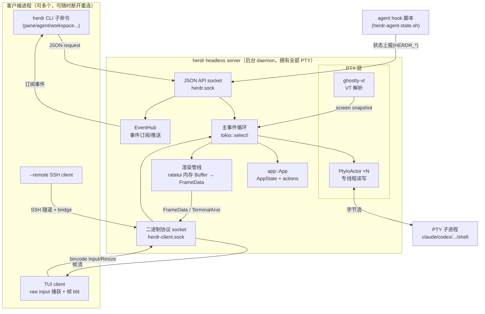
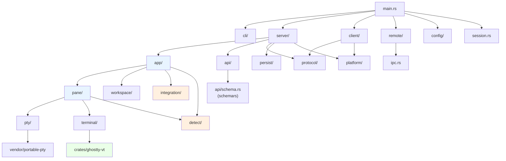
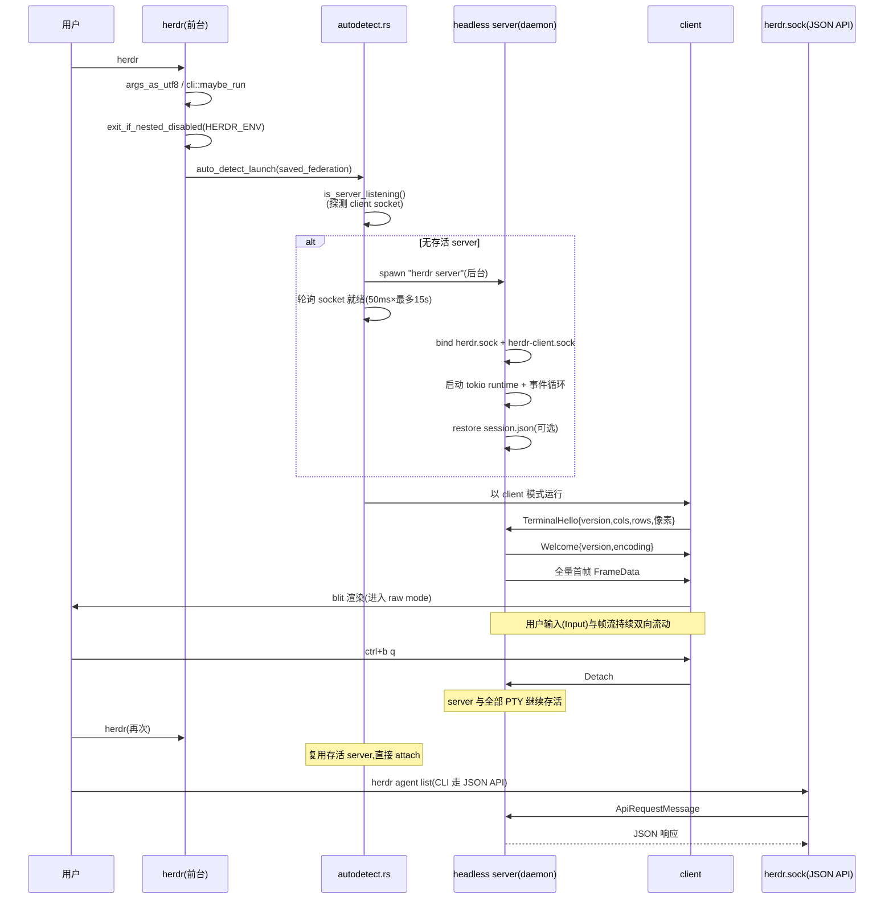
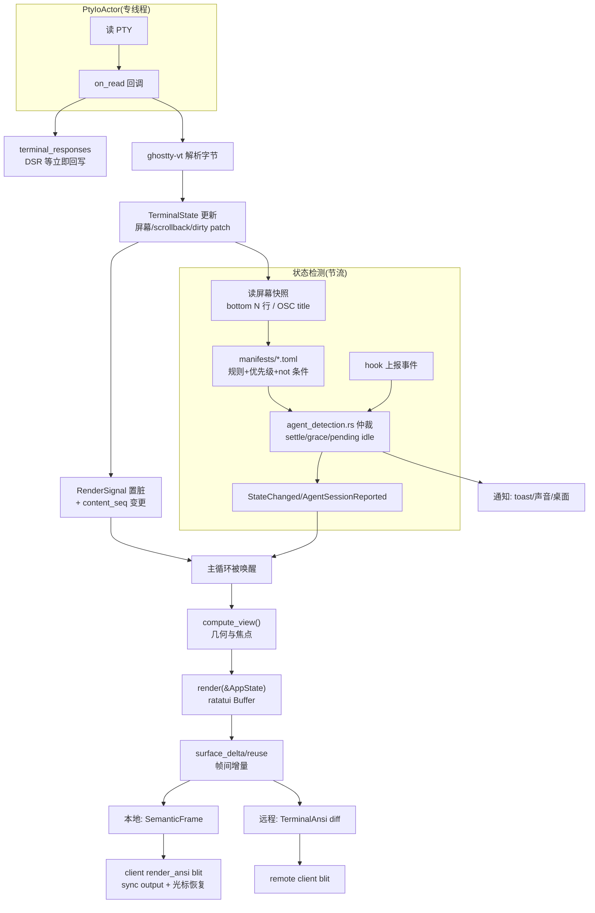
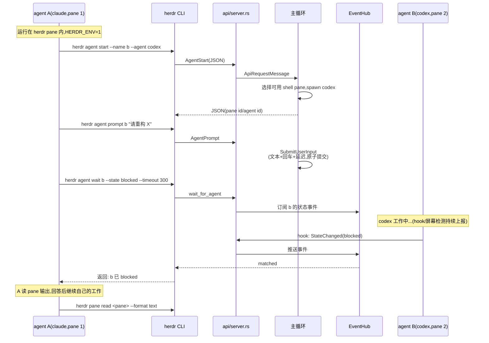

# herdr 源码学习笔记

> 仓库地址：[herdr](https://github.com/herdrdev/herdr)
> 学习日期：2026-09-30

---

> **以下为 AI 源码分析**
>
> ### 一句话概括
>
> herdr 是一个用 Rust 编写的 AI coding agent 终端运行时——本质是 tmux 式的 client-server 终端多路复用器，但围绕 agent 的生命周期（working / blocked / idle 状态检测、会话持久恢复、agent 间协作）做了深度特化。
>
> ### 要点速览
>
> | 模块 | 职责 | 关键文件 |
> |------|------|----------|
> | `main.rs` / `cli/` | 入口分发：CLI 子命令、server/client 模式选择、防嵌套 | `src/main.rs` |
> | `server/` | headless 后台服务器：主事件循环、双 socket 监听、帧广播 | `src/server/headless.rs` (3392 行)、`bootstrap.rs` |
> | `app/` | 应用核心：AppState 纯数据 + actions 状态变更 + API 桥接 | `src/app/state.rs`、`src/app/actions.rs` (4744 行) |
> | `pane/` + `pty/` | 面板运行时：PTY IO actor、进程管理、VT 数据入口 | `src/pane.rs` (6032 行)、`src/pty/actor/unix.rs` |
> | `terminal/` | 终端仿真：基于 ghostty-vt 的屏幕状态、scrollback、增量 dirty patch | `src/terminal/state.rs` (6439 行) |
> | `detect/` | agent 状态检测：24 种 agent 的声明式 TOML 规则 | `src/detect/manifests/*.toml` |
> | `integration/` | 官方集成：向 agent 安装 hook 脚本主动上报状态 | `src/integration/assets/*` |
> | `api/` | JSON socket API：100+ 方法、事件订阅、wait 语义 | `src/api/server.rs`、`src/api/schema.rs` |
> | `protocol/` | client 二进制协议：FrameData、ANSI 增量编码 | `src/protocol/wire.rs` (3705 行) |
> | `persist/` | 会话持久化：session.json 快照、agent 会话恢复 | `src/persist/snapshot.rs`、`restore.rs` |
> | `remote/` | SSH 多机联邦：remote bridge、keepalive 注入 | `src/remote/attach.rs` (5633 行) |
> | `crates/ghostty-vt` | 从 Ghostty 抽取的 VT 解析器（vendored C + FFI） | `crates/ghostty-vt/src/lib.rs` |

---

## 项目简介

herdr 自称 "the runtime your coding agents live on"。它解决的核心问题是：**AI coding agent（Claude Code、Codex、OpenCode 等）都跑在终端里，而普通终端会话脆弱**——SSH 断开、窗口关闭、机器重启都会杀死正在工作的 agent；同时管理多个并行 agent 时，用户无法一眼看出哪个 agent 卡在等待确认、哪个正在干活。

herdr 的答案是把 tmux 的"终端会话与客户端分离"模型搬到 agent 场景，并加三层增值：

1. **持久性**：后台 daemon 拥有所有 PTY，client 只是显示器；server 重启后可恢复布局，甚至通过 `--resume` 类命令让 agent 恢复原生的对话会话
2. **可观测性**：每个 pane 被持续标注 working / blocked / idle 状态，agent 需要人输入时主动提醒（toast / 声音 / 桌面通知）
3. **agent 原生 API**：agent 自己也能通过 CLI / socket API 驱动 herdr——spawn pane、互相 prompt、等待对方真正 blocked，实现 agent 间协作

它不包装不替代任何 agent，只是"拥有它们的终端"。单个 Rust 二进制，无 Electron，跑在任何已有终端里。

## 技术栈

| 类别 | 技术 |
|------|------|
| 语言 | Rust 2021 edition（rust-toolchain.toml 固定版本） |
| 异步运行时 | tokio（multi-thread，`select!` 事件循环） |
| TUI 渲染 | ratatui + crossterm（服务端渲染到内存 Buffer） |
| PTY | portable-pty 0.9（vendored + 自维护补丁，`[patch.crates-io]`） |
| 终端仿真 | ghostty-vt（从 Ghostty 项目抽取的 C 库 + bindgen FFI） |
| IPC | interprocess（本地 socket，Unix domain socket / Windows named pipe） |
| 序列化 | serde + serde_json（API）、bincode（client 协议）、schemars（JSON Schema 导出） |
| 日志 | tracing + tracing-subscriber（env-filter） |
| 构建工具 | cargo + just（任务编排）+ build.rs |
| 测试框架 | cargo-nextest + Python unittest（维护契约测试）+ bun test（docs / TS 资产测试） |
| 平台特定 | zbus（Linux logind inhibitor）、wmi / windows-sys（Windows）、WMI ConPTY |

## 目录结构

```
herdr/
├── src/
│   ├── main.rs            # 入口：参数解析、模式分发、防嵌套
│   ├── server/            # headless server：事件循环、client 接入、帧广播
│   │   └── headless/      # bootstrap / lifecycle / render / notifications 子模块
│   ├── client/            # 瘦客户端：raw input 捕获、帧 blit、endpoint 管理
│   │   ├── shell/         # 客户端 shell 模式（本地终端直连 pane）
│   │   ├── input/         # Windows VTI / 输入解析
│   │   └── endpoint/      # 多机器 endpoint 目录与激活
│   ├── app/               # 应用核心：state（纯数据）+ actions（变更）+ api 桥
│   │   └── api/           # API 请求在 server 侧的执行（panes/plugins/worktrees）
│   ├── pane/              # PaneRuntime：PTY 读回调 + agent 检测编排
│   ├── pty/               # PtyIoActor：专线程 PTY IO + 读写控制命令
│   ├── terminal/          # TerminalState/Runtime：VT 屏幕、scrollback、快照
│   ├── detect/            # agent 检测：manifest 规则引擎 + 线程检测
│   │   └── manifests/     # 24 个 agent 的 TOML 检测规则（数据可热更新）
│   ├── integration/       # 官方集成：hook 脚本安装到各 agent
│   │   └── assets/        # claude/codex/pi/... 的 hook 脚本（include_str! 内嵌）
│   ├── api/               # JSON socket API：schema、server、event_hub、wait
│   │   └── schema/        # 按 panes/tabs/workspaces/... 分域的方法定义
│   ├── protocol/          # client 二进制协议 + ANSI/surface_delta 增量编码
│   ├── persist/           # session.json 快照与恢复
│   ├── remote/            # SSH 联邦：--remote attach、双 bridge、控制 socket
│   ├── workspace/         # 工作区（git 状态缓存）
│   ├── platform/          # linux/macos/windows 平台隔离层
│   └── config/            # config.toml 模型 + keybinds 解析
├── crates/
│   └── ghostty-vt/        # workspace 成员：vendored libghostty-vt 的 Rust 封装
├── skills/herdr/          # 内嵌进二进制的 agent skill（herdr --skill 打印）
├── vendor/                # portable-pty 与 libghostty-vt 的补丁化源码
├── docs/next/             # 发布文档（en/ja/zh-CN 三语对齐，契约测试保证）
├── scripts/               # 维护测试与发布脚本（Python + TS）
└── justfile               # test / lint / ci / release 全流程任务
```

## 架构设计

### 整体架构

herdr 采用 **tmux 同款的 client-server 架构**，但把渲染也搬到了服务端：server 把整个 UI 渲染成内存中的 ratatui `Buffer`，序列化为 `FrameData` 帧推给所有连接的客户端；客户端是"哑终端"——只负责把帧 blit 到真实终端、把原始输入字节转发回服务端。这样客户端断开、重连、跨机器 attach 都不影响 UI 状态。

单个 `herdr` 进程通过 `server/autodetect.rs` 自动决定角色：探测 client socket → 没有存活 server 就 spawn 后台 daemon（轮询 socket 最多 15 秒等就绪）→ 以 client 身份 attach。

服务端暴露**两条独立的本地 socket**，服务两类消费者：

- `herdr.sock` — 稳定 JSON API（`herdr` CLI 子命令、外部程序、agent 用的就是它），schemars 导出 `herdr-api.schema.json`
- `herdr-client.sock` — 二进制协议（bincode 序列化的 `ClientMessage`/`ServerMessage`），TUI 客户端专用，承载高吞吐帧流



### 核心模块

**1. 入口与分发（`src/main.rs`，798 行）**

入口逻辑刻意保持"手写、扁平、全可见"：先 `args_as_utf8` 校验参数（非 UTF-8 给出行号报错而非 panic），再依次尝试 `cli::maybe_run_machine`（`--machine` 远程机分发）→ `session::configure_from_args`（`--session`）→ `remote::extract_remote_args`（`--remote`）→ `cli::maybe_run`（约 15 个 CLI 子命令组）。随后按字符串匹配分支到隐藏模式：`server`（headless daemon）、`client`（连接已有 server 的瘦客户端）、`remote-api-bridge` / `remote-client-bridge`（SSH 桥）、`update`。默认走 `server::autodetect::auto_detect_launch`。

两个防御细节值得注意：`HERDR_ENV=1` 环境变量 + `exit_if_nested_disabled` 阻止在 herdr pane 里再启动 herdr（彩蛋式错误消息数组）；`--default-config` 与 `--skill` 分别把内嵌的 `DEFAULT_CONFIG` 常量和 `include_str!("../skills/herdr/SKILL.md")` 打印出来，保证配置样例和 agent skill 与二进制版本严格同步。

**2. headless server（`src/server/headless.rs`，3392 行 + 子模块）**

服务端不进 raw mode、不读 stdin。`bootstrap.rs::run_server` 完成：进程上下文准备（可选持久用户服务上下文）、日志初始化、nofile 上限提升、JSON API socket 启动、tokio 多线程 runtime 构建，然后进入 `HeadlessServer` 事件循环。

主循环是整个系统的中枢，五路 `tokio::select!`：

- `app.api_rx.recv()` → `LoopEvent::Api`（JSON API 请求）
- `app.event_rx.recv()` → `LoopEvent::Internal`（`AppEvent`：PTY 退出、状态变化、git 刷新等后台事件）
- `server_event_rx.recv()` → `LoopEvent::ServerEvent`（client 连接/断开、输入）
- `sleep_until_or_pending(next_deadline)` → `LoopEvent::Timer`（节拍器，聚合各定时任务的最小 deadline）
- `app.render_notify.notified()` → `LoopEvent::RenderRequested`（渲染信号）

事件处理后按 `RenderImpact` 分类决定是否重渲染。外部队列有 `EXTERNAL_EVENT_DRAIN_LIMIT=64` 的批次上限，防止生产者持续灌满 channel 时饿死定时任务和渲染。client 监听器是非阻塞的、不进 `select!`，靠 250ms 的低频 `CLIENT_ACCEPT_POLL_INTERVAL` 轮询发现新 attach——这是刻意压低空闲 CPU 的设计。关闭时若 `persist_session`，走 `save_session_on_shutdown` 落盘。

**3. 应用核心（`src/app/`）**

`app::App` 是 server 侧的"完整应用"：`AppState`（纯数据）+ 事件通道 + `TerminalRuntimeRegistry` + git 状态缓存 + 会话保存线程 + 插件注册表 + 渲染信号。工程原则（见仓库 `AGENTS.md`）明确要求：**State 与 runtime 分离**——`AppState` 不含 PTY/异步，可在无终端环境单测；**渲染纯函数化**——`compute_view()` 做几何与变更，`render()` 只接受 `&AppState` 只画不改。`AppPolicy`（PRODUCTION / TEST / HANDOFF_REPLACEMENT）控制恢复、持久化、后台更新等副作用的开关，让同一套代码在测试与生产中行为可切换。

**4. PTY 与终端仿真（`src/pty/`、`src/pane/`、`src/terminal/`、`crates/ghostty-vt`）**

每个 pane 的 PTY IO 由独立的 `PtyIoActor`（unix/windows 两实现）承担：内部三条 channel（data / write / control）分离"用户输入写入""分步提交（SubmitUserInput 支持文本+回车+延迟+deadline 的原子提交，服务于 `agent prompt`）""resize/shutdown 控制"。读侧通过 `on_read` 回调把字节交回 pane，回调返回 `PtyReadResult { terminal_responses }` 让 DSR 等终端查询响应立即回写。

字节流进入 `ghostty-vt`（`crates/ghostty-vt`）做 VT 解析。这个 workspace 成员是对 vendored C 库 `libghostty-vt` 的 Rust 封装：`bindings.rs` 是 bindgen 生成的 FFI，`native_source.rs` 管理 C 侧 `Source` 生命周期，`pane_graphics_files.rs` 处理图形导出。`vendor/libghostty-vt` 目录 + `vendor.json` + `patches.md` 记录上游抽取与补丁。child 看到的 `TERM=xterm-256color`（`crates/ghostty-vt/src/lib.rs` 常量）。解析结果进入 `TerminalState`（6439 行）维护屏幕网格、scrollback（默认 10MB/pane，匹配 Ghostty 行为）、`TerminalDirtyPatch` 增量补丁。

**5. agent 状态检测（`src/detect/`、`src/pane/agent_detection.rs`、`src/integration/`）——本项目最核心的领域逻辑**

状态机是四态的 `AgentState`：`Idle`（完成、提示符可见）/ `Working` / `Blocked`（等人回答）/ `Unknown`（普通 shell 或无法分类）。24 种 `Agent`（Pi、Claude、Codex、Gemini、Cursor、Devin、Antigravity、Cline、Omp、Mastracode、OpenCode、GithubCopilot、Kimi、Kiro、Droid、Amp、Grok、Hermes、Kilo、Qodercli、Qwen、Letta、Maki、Muse）。

检测有**两条互补路径**，靠"证据仲裁"融合：

- **被动屏幕检测**：`detect/manifests/<agent>.toml` 是声明式规则库（带版本号、可后台热更新）。每条规则指定 `region`（如 `bottom_non_empty_lines(12)`、`osc_title`、`last_non_empty_above_prompt_box`）、`regex`/`line_regex`、`state`、`priority`、可选 `not` 排除条件和 `visible_working/visible_blocker` 置信度标记。例如 claude.toml 用盲文/半圆 spinner 字符区间的 OSC title 正则判 working，用否定词表（"do you want to proceed?" 等）防止把提问误判为活动。检测器只读屏幕快照，从不触碰 parser/viewport（AGENTS.md 的"Detection is decoupled"原则）。
- **主动 hook 上报**：`integration/assets/<agent>/herdr-agent-state.{sh,ps1,ts}` 在 `herdr integration install` 时写入 agent 自己的 hook 体系（Claude hooks、Codex notify、pi/omp 的 TS 扩展）。pane 进程由 `integration/env.rs::apply_pane_base_env` 注入 `HERDR_ENV`/`HERDR_SOCKET_PATH`/`HERDR_PANE_ID`/`HERDR_TAB_ID`/`HERDR_WORKSPACE_ID`。hook 触发时用 python3 直接向 socket 写 JSON 上报精确状态与会话引用（`AgentSessionRef`）——比屏幕正则权威。

`pane/agent_detection.rs` 负责仲裁与防抖：`AgentStart` 有 settle 延迟与 grace window；`PendingIdleConfirmation` 避免状态闪烁；`HookAuthorityCleared`/`HookAgentReleased` 处理 hook 生命周期；`AppState` 变更打包为 `AppEvent::StateChanged` 进主循环。

**6. socket API（`src/api/`）**

`herdr.sock` 上的 JSON API 有 100+ 方法（`api/schema.rs` 的 `Method` 枚举，按 panes/tabs/workspaces/worktrees/agents/commands/integrations/plugins 分域放在 `schema/` 子目录），schemars 生成机器可读 schema。超出"读"的方法由 `request_changes_ui` 归类触发 UI 重渲染。四个特色原语（`api/wait.rs`）：`wait_for_agent`、`prompt_agent`、`wait_for_event`、`wait_for_output`——把"等这个 agent 真正 blocked/完成再继续"变成 API 级原语，这是 agent 间协作的地基。`EventHub` + `subscriptions.rs` 提供订阅推送。socket 权限 0o600，带 `SocketFileIdentity` 防 stale socket 误删。

**7. client 二进制协议与渲染编码（`src/protocol/`）**

`wire.rs` 定义 `ClientMessage`（TerminalHello 握手带版本/尺寸/像素网格/pixel-mouse 能力 → Input/Resize/ClipboardImage/Detach/AttachTerminal/AttachScroll/ObserveTerminal）与 `ServerMessage`（Welcome 握手选编码 → 帧流/Graphics/Notify/Clipboard/WindowTitle/MouseCapture/TerminalBell/ServerShutdown...）。注释明确 **"Variant order is frozen for endpoint generation 1"**——枚举变体冻结，兼容性演进走 `EndpointControl` 命名控制字段，这是把 wire 协议当 ABI 管理的纪律。

帧传输有双编码（`RenderEncoding`）：本地用 `SemanticFrame`（完整 FrameData 语义帧），远程/弱带宽用 `TerminalAnsi`（服务端已 diff 的 ANSI 字节流）。`surface_delta/scroll/reuse.rs` 做帧间增量复用。客户端 `protocol/render_ansi.rs` 负责 blit：首帧全量、后续帧 diff 写变更 cell、包在 `CSI ?2026` 同步输出里、隐藏光标避免中间态、结束后按 `frame.cursor` 恢复（Windows 特判跳过光标重锚以免 VTI 闪烁）。

**8. 持久化与恢复（`src/persist/`、`src/agent_resume.rs`、`app/agent_resume.rs`）**

`~/.config/herdr/session.json` 保存 Workspace/Tab/Layout 快照（目录、cwd、布局、pane 身份），写入按 5s debounce（`SESSION_SAVE_DEBOUNCE`），独立线程序列化避免阻塞主循环。恢复时 `restore.rs` 重建布局并 respawn shell。agent 会话恢复是进阶能力：hook 上报的 `AgentSessionRef`（id 或 path）+ 各 agent 的 resume argv 模板生成 `AgentResumePlan`，按 `startup_per_agent_delay_ms` 间隔逐个恢复，`--continue` 这类无 id 命令把目录并入 dedupe_key 防串会话。原进程当然不能存活——重启后是"新进程续旧对话"。

**9. 多机联邦与远程（`src/remote/`、`src/client/endpoint/`）**

`herdr --remote <ssh-target>` 通过 SSH 连到远端机器的 herdr server。两个隐藏 bridge 模式支撑隧道：`remote-api-bridge`（把远端 herdr.sock 桥到本地 stdio）与 `remote-client-bridge`（帧流桥）。细节相当工程化：生成组合 ssh config（先 include 用户 `~/.ssh/config` 再补 ServerAliveInterval 兜底）、每次 attach 私有 OpenSSH control socket 复用首条已认证连接、重启策略 `restart_policy.rs`、host key 严格校验及对应错误提示。本地保存的 SSH 机器（`herdr machine`）进 `EndpointCatalog`，多机 pane 与本地 pane 混排在同一 UI，独立重连。

**10. 平台层（`src/platform/`）**

`linux.rs`（2175 行）/ `macos.rs` / `windows.rs`（5035 行）承载全部 OS 特异：Linux 用 zbus 的 logind delay inhibitor 在主机关机前给 server 一点时间保存会话；Windows 侧巨大——ConPTY、JobObjects、WMI 输入、SDDL 安全描述符（widestring UTF-16）、IME 处理。AGENTS.md 强制核心模块不得出现 `#[cfg(target_os)]`，平台差异全部收口于此。

### 模块依赖关系



蓝底是应用核心层（单线程事件循环内），橙底是 herdr 区别于普通终端复用器的领域层，绿底是 vendored 基础设施。依赖整体单向向下，`detect` 只依赖 `terminal` 的屏幕快照类型，`integration` 产出的是安装到外部 agent 的脚本资产。

## 核心流程

### 流程一：`herdr` 启动 → daemon spawn → client attach



关键点：检测"server 是否存活"靠 connect 探测（`ConnectionRefused` 即 stale socket），而不是看 socket 文件存在性；spawn 的 daemon 用 `HERDR_STARTUP_CWD` 传递启动目录作为新会话的种子 cwd；两次 `herdr` 之间的行为差异完全由 socket 探测结果决定，对用户是同一个命令。

### 流程二：PTY 字节流 → 状态检测 → 增量帧（数据主管线）



这条管线的每一环都是 AGENTS.md 所说的"乘法路径"（per byte × per pane × per client），因此充满早退：hidden pane 仍解析输出但不触发展示工作（`hidden-source early exit`）、`retained-render` 复用未变帧、渲染循环内禁止聚合快照/文件 IO/进程树查询。`just bench-render-scale` 基准在 1 与 15 个 pane 两档几何下测扩展系数，作为 PR 性能证据。

### 流程三：agent 通过 socket API 协作（agent-native 能力）



`wait` 语义建立在 EventHub 订阅上而不是轮询；`agent prompt` 的输入注入走 PtyIoActor 的 `SubmitUserInput`（带 deadline 的分步写入），保证"文字落屏→回车提交"顺序正确；`AgentStart` 只认"已存在的可用 shell pane"，从不替用户创建/分裂布局——把布局权留给用户、把驱动权给 agent，是刻意的权限边界。

## 关键设计亮点

**1. 服务端渲染 + 哑客户端——把"attach"做成无损操作**

问题：终端 UI 状态通常活在前台进程里，detach 即丢失，多客户端必然分歧。herdr 让 server 持有 ratatui Buffer 并渲染，客户端只 blit 帧（`server/headless.rs` 顶部注释即职责声明）。结果：多 client 同时 attach 看到一致 UI、`--remote` 跨机 attach 体验与本地一致（只是帧编码换成 `TerminalAnsi` 压缩带宽）、client 崩溃零影响。对照 tmux 的做法（server 也渲染但协议更偏字节），herdr 的 `FrameData` 语义帧保留了 hyperlink、Kitty graphics、光标形状等结构化信息，客户端 blit 侧（`protocol/render_ansi.rs`）再用 diff + 同步输出落地。

**2. wire 协议当 ABI 管理——"Variant order is frozen"**

`protocol/wire.rs` 的 `ClientMessage`/`ServerMessage` 枚举注释明确变体顺序冻结（endpoint generation 1），兼容演进通过 `EndpointControl` 命名控制与 advertised API 方法完成。配合 `herdr --skill` 打印的与二进制同版本 skill、`schemars` 导出的 `herdr-api.schema.json`（Cargo.toml 甚至把 schema 文件列进打包 `include`），三个消费面（TUI client、CLI、外部 agent）的契约全部可版本化验证。这在"server 与 client 可能来自不同安装渠道"的场景下是必需品。

**3. 双路径状态检测 + 证据仲裁——agent 生态的兼容性核心**

单纯 hook 上报要求每个 agent 官方支持（24 个 agent 做不到）；单纯屏幕正则脆弱（agent 改 UI 就失效）。herdr 两者都要：hook 是权威（`HookStateReported` 带精确状态与 `AgentSessionRef`），manifests TOML 是兜底（`visible_blocker`/`visible_working` 置信度字段 + `not` 否定条件 + priority 排序），`pane/agent_detection.rs` 做仲裁（grace window、pending idle confirmation 防"完成→闪烁"）。且 manifest 是**数据不是代码**——`detect/manifests/*.toml` 带 `version`/`min_engine_version`，可后台从 herdr.dev 热更新（`AppEvent::AgentDetectionManifestsUpdated`），agent 改版 UI 时无需发二进制。仓库 AGENTS.md 甚至规定了改规则的证据流程：先用 `herdr agent read <pane> --source detection --format text/ansi` 抓真实底部缓冲，再决定哪些控件是不变量。

**4. vendored 上游 + 补丁清单——基础设施的可控 fork**

`vendor/` 收纳 portable-pty 与 libghostty-vt 两个依赖，各有 `.patches.md`（补丁用途说明）与 `.vendor.json`（来源元数据），`[patch.crates-io]` 把 portable-pty 指到本地副本，`just maintenance-test` 里有专门的 `test_vendor_*` 契约测试防止 vendor 悄悄漂移。ghostty-vt 的取舍尤其聪明：终端仿真是 herdr 正确性的地基，与其自己写 VT 解析器（或依赖上游 Ghostty 的整体发布节奏），不如抽取 libghostty-vt C 核心（性能久经考验）+ bindgen 封装 + 补丁留痕。`just libghostty-bindings`/`build-libghostty-vt` 可再生成。

**5. 纯数据 AppState + 单线程事件循环——可测试的 TUI**

TUI 程序的常见死穴是状态、IO、渲染纠缠导致无法测试。herdr 的解法是三层纪律（AGENTS.md "Universal Project Rules"）：`AppState` 纯数据可脱离 PTY/async 单测（`app/actions.rs` 4744 行状态变更全部"testable without PTYs"）；所有并发通过 channel 汇入单线程主循环（五路 `select!`），无锁共享，`PtyIoActor` 专线程只做 IO 字节搬运；渲染拆成 `compute_view()`（几何+变更）与 `render()`（只读绘制）。配套 `AppPolicy::TEST` 关掉全部副作用。这解释了为什么 `server/headless/tests/` 能有 7840 行集成测试，以及 justfile 里的 `ui-hot-path-architecture-test` 能用架构断言（而非计时）守住热路径纪律。

**6. 面向 agent 的 API 原语——wait/prompt 让 agent 协作成为一等公民**

普通终端复用器的 API 止步于"创建/发送/读取"。herdr 的 `api/wait.rs` 把**等待**做成了四种原语（`wait_for_agent`/`prompt_agent`/`wait_for_event`/`wait_for_output`），建立在 EventHub 订阅而非轮询之上；`AgentStart` 被刻意约束为"只认已存在的 shell pane，绝不创建布局"（SKILL.md 明文）；输入注入走 `SubmitUserInput` 的分步原子提交而非裸写字节。`herdr --skill` 把同版本的使用说明直接递给 agent 的 skill 系统。整套设计承认了一个新事实：**API 的消费者一半是人，一半是 agent**，于是命令的输出全是 JSON、状态语义（idle vs done vs blocked）被精确定义、防呆规则（不要裸跑 `herdr` 做 discovery）写进 skill。

---

> 未深入分析的部分：`kitty_graphics/`（Kitty 图形协议的完整实现，surface.rs 2455 行）、`copy_mode.rs`/`selection.rs`（选择与复制模式）、`platform/windows.rs` 大部分细节（ConPTY/VTI 输入链路 4363 行）、插件系统运行时（`app/api/plugins/` 4058 行）、`distribution/`+`scripts/` 发布流水线全貌。这些模块体量与主流程相当，值得二次学习。
