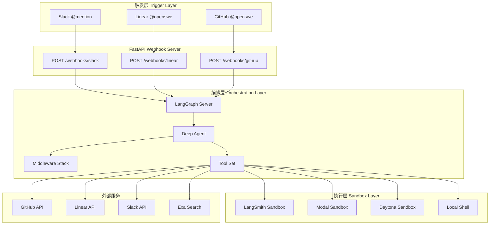
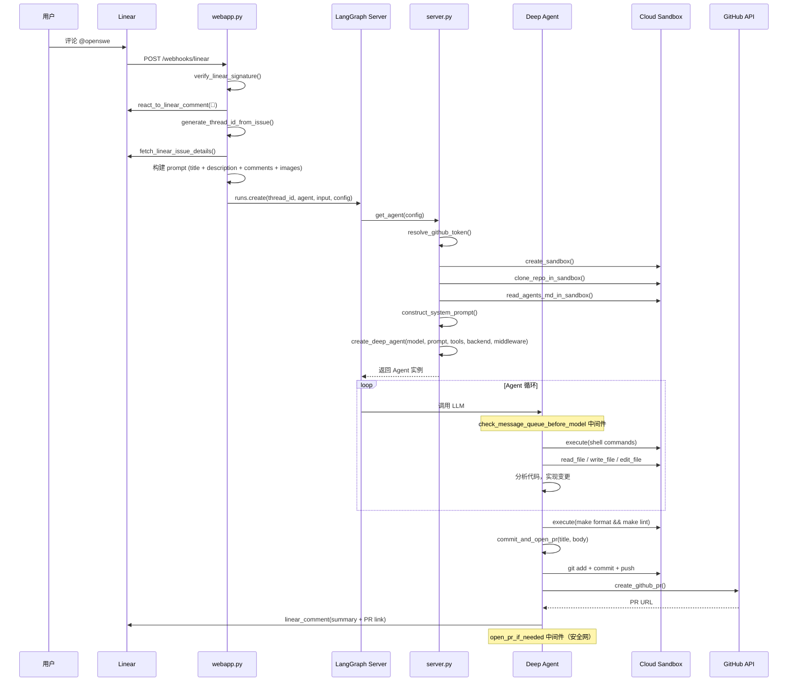
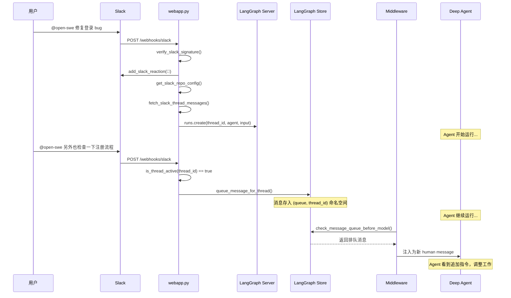

# open-swe 源码学习笔记

> 仓库地址：[open-swe](https://github.com/langchain-ai/open-swe)
> 学习日期：2026-04-05

---

> **以下为 AI 源码分析**
>
> ### 一句话概括
>
> Open SWE 是一个基于 LangGraph 和 Deep Agents 的开源框架，用于构建组织内部的自动化编程 Agent，支持从 Slack/Linear/GitHub 触发任务，在隔离沙箱中执行代码变更并自动提交 PR。
>
> ### 要点速览
>
> | 核心模块 | 职责 | 关键文件 |
> |---------|------|---------|
> | Agent Server | Agent 生命周期管理、沙箱创建与仓库克隆 | `agent/server.py` |
> | Web App | Webhook 端点，处理 Slack/Linear/GitHub 事件 | `agent/webapp.py` |
> | Tools | Agent 可调用的工具集（PR 创建、HTTP 请求等） | `agent/tools/` |
> | Middleware | Agent 循环中的钩子（消息队列、自动 PR、错误处理） | `agent/middleware/` |
> | Integrations | 多沙箱提供商适配（LangSmith/Modal/Daytona/Runloop） | `agent/integrations/` |
> | Utils | GitHub API、认证、Slack/Linear 集成、沙箱路径等 | `agent/utils/` |
> | Prompt | 模块化 System Prompt 组装 | `agent/prompt.py` |

---

## 项目简介

Open SWE 是 LangChain 团队开源的内部编程 Agent 框架，复刻了 Stripe Minions、Ramp Inspect、Coinbase Cloudbot 等顶级工程团队的内部自动化编程 Agent 架构模式。它基于 [LangGraph](https://github.com/langchain-ai/langgraph) 状态图引擎和 [Deep Agents](https://github.com/langchain-ai/deepagents) 框架构建，提供了云沙箱隔离、多触发源（Slack/Linear/GitHub）、子 Agent 编排、中间件钩子、自动 PR 创建等核心能力。开发者可以 fork 并定制为自己组织的内部编程 Agent。

## 技术栈

| 类别 | 技术 |
|------|------|
| 语言 | Python 3.11+ |
| 框架 | LangGraph + Deep Agents + FastAPI |
| 构建工具 | Hatch (hatchling) / Docker |
| 依赖管理 | uv (pyproject.toml) |
| 测试框架 | pytest + pytest-asyncio |
| LLM | Anthropic Claude Opus 4.6（默认）/ OpenAI / Google Gemini |
| Lint | Ruff |
| CI | GitHub Actions |

## 目录结构

```
open-swe/
├── agent/                          # 核心 Agent 代码
│   ├── server.py                   # Agent 入口：get_agent() 创建 Deep Agent 实例
│   ├── webapp.py                   # FastAPI webhook 端点（Slack/Linear/GitHub）
│   ├── prompt.py                   # 模块化 System Prompt 组装
│   ├── encryption.py               # Token 加密/解密（Fernet）
│   ├── tools/                      # Agent 工具集
│   │   ├── commit_and_open_pr.py   # 核心工具：Git 提交 + 创建 GitHub PR
│   │   ├── fetch_url.py            # 网页抓取转 Markdown
│   │   ├── http_request.py         # HTTP API 请求
│   │   ├── web_search.py           # Exa 搜索引擎
│   │   ├── github_comment.py       # GitHub Issue/PR 评论
│   │   ├── github_review.py        # GitHub PR Review 操作
│   │   ├── slack_thread_reply.py   # Slack 消息回复
│   │   ├── linear_comment.py       # Linear 评论
│   │   └── linear_*.py             # Linear CRUD 操作
│   ├── middleware/                  # Agent 循环中间件
│   │   ├── check_message_queue.py  # 注入排队消息（before_model）
│   │   ├── open_pr.py              # 安全网：自动提交 PR（after_agent）
│   │   ├── ensure_no_empty_msg.py  # 防止空消息（before_model）
│   │   └── tool_error_handler.py   # 工具错误捕获
│   ├── integrations/               # 沙箱提供商适配
│   │   ├── langsmith.py            # LangSmith 沙箱（默认）
│   │   ├── modal.py                # Modal 沙箱
│   │   ├── daytona.py              # Daytona 沙箱
│   │   ├── runloop.py              # Runloop 沙箱
│   │   └── local.py                # 本地沙箱（仅开发用）
│   └── utils/                      # 工具函数
│       ├── auth.py                 # GitHub OAuth + LangSmith 认证
│       ├── github.py               # Git 操作 + GitHub API
│       ├── github_app.py           # GitHub App 安装令牌
│       ├── sandbox.py              # 沙箱工厂（根据 SANDBOX_TYPE 创建）
│       ├── sandbox_state.py        # 全局沙箱后端缓存
│       ├── sandbox_paths.py        # 沙箱路径解析
│       ├── model.py                # LLM 模型初始化
│       ├── slack.py                # Slack API 工具函数
│       ├── linear.py               # Linear API 工具函数
│       ├── repo.py                 # 仓库名解析
│       └── agents_md.py            # AGENTS.md 读取
├── tests/                          # 单元测试
├── scripts/                        # 辅助脚本
├── static/                         # Logo 图片
├── langgraph.json                  # LangGraph 配置（入口点 + HTTP app）
├── pyproject.toml                  # Python 项目配置
├── Makefile                        # 开发/测试/lint 命令
└── Dockerfile                      # 沙箱容器镜像
```

## 架构设计

### 整体架构

Open SWE 采用 **事件驱动 + 沙箱隔离 + Agent 循环** 的三层架构：

1. **触发层（Webhook Endpoints）**：FastAPI 接收来自 Slack/Linear/GitHub 的 webhook 事件，解析上下文（issue 内容、评论、仓库信息），生成确定性 thread ID，通过 LangGraph SDK 创建 Agent 运行。
2. **编排层（LangGraph + Deep Agents）**：LangGraph 管理 Agent 的状态和生命周期。`create_deep_agent()` 将 LLM、工具、沙箱后端和中间件组装为一个完整的 Agent 图。中间件在 Agent 循环的关键节点注入逻辑（消息队列检查、错误处理、自动 PR）。
3. **执行层（Cloud Sandbox）**：每个任务在独立的云沙箱（LangSmith/Modal/Daytona/Runloop）中运行，Agent 通过 `SandboxBackendProtocol` 执行 shell 命令和文件操作，完全隔离，零生产环境访问。



### 核心模块

#### 1. Agent Server (`agent/server.py`)

**职责**：Agent 的入口点和生命周期管理。

- **`get_agent(config)`**：核心函数，根据 `RunnableConfig` 创建或复用 Agent 实例。
  - 从 `config.configurable` 提取 `thread_id`、`repo` 信息
  - 解析 GitHub Token（支持 per-user OAuth 和 bot-token-only 两种模式）
  - 管理沙箱生命周期：缓存命中 → 复用；缓存未命中 → 创建新沙箱；沙箱不可达 → 重建
  - 调用 `_clone_or_pull_repo_in_sandbox()` 克隆/拉取仓库
  - 读取 `AGENTS.md` 注入 System Prompt
  - 调用 `create_deep_agent()` 组装 Agent（LLM + Prompt + Tools + Sandbox + Middleware）

- **`_clone_or_pull_repo_in_sandbox()`**：处理仓库的克隆和增量更新逻辑，支持重连和错误恢复。

- **`_recreate_sandbox()`**：沙箱连接失败时的重建逻辑，清除缓存、设置 `SANDBOX_CREATING` 哨兵值、创建新沙箱。

**关键设计**：沙箱通过 `SANDBOX_BACKENDS` 字典以 `thread_id` 为 key 进行缓存，同一线程的后续消息复用同一沙箱，避免重复创建。

#### 2. Web App (`agent/webapp.py`)

**职责**：FastAPI webhook 端点，处理三种触发源的事件。

- **`linear_webhook()`**：验证 Linear webhook 签名，解析评论事件，提取 issue 数据和 repo 配置
- **`slack_webhook()`**：验证 Slack 签名，处理 `app_mention` 和 DM 事件
- **`github_webhook()`**：验证 GitHub webhook 签名，处理 issue comment 和 PR review comment

**核心处理函数**：
- `process_linear_issue()`：构建完整 prompt（issue 标题 + 描述 + 评论 + 图片），通过 `langgraph_client.runs.create()` 启动 Agent 运行
- `process_slack_mention()`：收集 Slack 线程上下文，解析 `repo:owner/name` 语法指定仓库
- `queue_message_for_thread()`：当 Agent 正在运行时，将后续消息存入 LangGraph Store 队列

**关键设计**：
- 确定性 Thread ID：从 issue ID / Slack channel+thread 通过 SHA256/MD5 哈希生成 UUID，保证同一 issue/线程路由到同一 Agent
- 消息队列机制：当 Agent 忙碌时，新消息入队而非创建新运行，由 `check_message_queue_before_model` 中间件注入

#### 3. Tools (`agent/tools/`)

**职责**：Agent 可调用的外部工具，共 18 个。

核心工具：
- **`commit_and_open_pr`**（`commit_and_open_pr.py`）：核心工作流终点。执行 `git add` → `git commit` → `git push` → GitHub API 创建 Draft PR 的完整流程。支持 branch_name 复用已有分支。
- **`web_search`**（`web_search.py`）：通过 Exa API 进行网页搜索
- **`fetch_url`**（`fetch_url.py`）：抓取网页并转为 Markdown
- **`http_request`**（`http_request.py`）：通用 HTTP 请求

通信工具：
- **`github_comment`**、**`slack_thread_reply`**、**`linear_comment`**：向对应触发源回复结果

PR Review 工具：
- **`github_review.py`** 提供了完整的 PR Review 操作：`list_pr_reviews`、`get_pr_review`、`create_pr_review`、`update_pr_review`、`dismiss_pr_review`、`submit_pr_review`、`list_pr_review_comments`

#### 4. Middleware (`agent/middleware/`)

**职责**：在 Agent 循环的关键节点注入确定性逻辑。

| 中间件 | 装饰器 | 触发时机 | 功能 |
|--------|--------|---------|------|
| `check_message_queue_before_model` | `@before_model` | 每次 LLM 调用前 | 从 LangGraph Store 读取排队消息，注入为新的 human message |
| `ensure_no_empty_msg` | `@before_model` | 每次 LLM 调用前 | 过滤空消息，防止 LLM 报错 |
| `ToolErrorMiddleware` | Tool error handler | 工具调用出错时 | 捕获并格式化工具错误 |
| `open_pr_if_needed` | `@after_agent` | Agent 运行结束后 | 安全网：如果 Agent 未提交 PR，自动执行 commit + push + create PR |

#### 5. Integrations (`agent/integrations/`)

**职责**：多沙箱提供商的适配层，实现 `SandboxBackendProtocol`。

- **LangSmith**（默认）：`LangSmithBackend` 继承 `BaseSandbox`，通过 LangSmith SDK 的 `Sandbox` 执行命令。`LangSmithProvider` 管理沙箱模板的创建和生命周期。
- **Modal**：通过 `langchain_modal.ModalSandbox` 适配
- **Daytona**：通过 `langchain_daytona.DaytonaSandbox` 适配
- **Runloop**：通过 `langchain_runloop` 适配
- **Local**：`LocalShellBackend` 直接在宿主机执行，无隔离，仅开发用

**工厂模式**：`agent/utils/sandbox.py` 中 `SANDBOX_FACTORIES` 字典映射 `SANDBOX_TYPE` 环境变量到对应的创建函数。

#### 6. Prompt (`agent/prompt.py`)

**职责**：模块化组装 System Prompt。

将 prompt 拆分为 12 个独立 section（`WORKING_ENV_SECTION`、`TASK_EXECUTION_SECTION`、`CODING_STANDARDS_SECTION` 等），通过字符串拼接组装为完整 `SYSTEM_PROMPT`。`construct_system_prompt()` 函数注入运行时变量（`working_dir`、`linear_project_id`）和仓库的 `AGENTS.md` 内容。

### 模块依赖关系

```mermaid
graph TD
    Server["server.py<br/>Agent 入口"]
    WebApp["webapp.py<br/>Webhook 端点"]
    Prompt["prompt.py<br/>System Prompt"]
    Encryption["encryption.py<br/>Token 加密"]

    subgraph Tools["tools/"]
        CommitPR["commit_and_open_pr"]
        FetchURL["fetch_url"]
        WebSearch["web_search"]
        HttpReq["http_request"]
        GHComment["github_comment"]
        GHReview["github_review"]
        SlackReply["slack_thread_reply"]
        LinearComment["linear_comment"]
    end

    subgraph MW["middleware/"]
        MsgQueue["check_message_queue"]
        OpenPR["open_pr_if_needed"]
        EmptyMsg["ensure_no_empty_msg"]
        ToolErr["ToolErrorMiddleware"]
    end

    subgraph Integrations["integrations/"]
        LSBox["langsmith.py"]
        ModalBox["modal.py"]
        DaytonaBox["daytona.py"]
        LocalBox["local.py"]
    end

    subgraph Utils["utils/"]
        Auth["auth.py"]
        GH["github.py"]
        GHApp["github_app.py"]
        SBFactory["sandbox.py"]
        SBState["sandbox_state.py"]
        Model["model.py"]
        SlackUtil["slack.py"]
        LinearUtil["linear.py"]
        AgentsMD["agents_md.py"]
    end

    Server --> Prompt
    Server --> Tools
    Server --> MW
    Server --> Auth
    Server --> Model
    Server --> SBFactory
    Server --> SBState
    Server --> AgentsMD
    Server --> GH

    WebApp --> Auth
    WebApp --> SlackUtil
    WebApp --> LinearUtil
    WebApp --> GHApp

    CommitPR --> GH
    CommitPR --> GHApp
    CommitPR --> SBState
    OpenPR --> GH
    OpenPR --> GHApp
    OpenPR --> SBState

    SBFactory --> LSBox
    SBFactory --> ModalBox
    SBFactory --> DaytonaBox
    SBFactory --> LocalBox

    Auth --> Encryption
    Auth --> GHApp
    Auth --> SlackUtil
    Auth --> LinearUtil
```



## 核心流程

### 流程一：Linear Issue 触发 Agent 完整运行

从用户在 Linear issue 中评论 `@openswe` 到 Agent 自动提交 PR 的完整流程。



### 流程二：Slack 消息触发 + 中间消息队列

展示 Slack 触发场景下，用户在 Agent 运行过程中发送追加消息的处理流程。



## 关键设计亮点

### 1. 确定性 Thread ID 实现消息路由

**问题**：同一 issue/线程的多条消息需要路由到同一个 Agent 运行，保持上下文连续。

**实现**：`webapp.py` 中通过哈希函数从外部标识符生成确定性 UUID：
- Linear: `SHA256("linear-issue:{issue_id}")` → UUID
- GitHub: `SHA256("github-issue:{issue_id}")` → UUID
- Slack: `MD5("{channel_id}:{thread_ts}")` → UUID

**优势**：无需维护外部映射表，同一 issue 的后续消息自动路由到同一 Agent 线程。

### 2. 消息队列 + Middleware 实现 "边运行边接收指令"

**问题**：Agent 可能运行数分钟，期间用户可能发送补充指令。

**实现**：
- `webapp.py` 中 `is_thread_active()` 检测 Agent 是否忙碌
- 忙碌时调用 `queue_message_for_thread()` 将消息存入 LangGraph Store（`namespace=("queue", thread_id)`）
- `check_message_queue_before_model` 中间件在每次 LLM 调用前检查队列，将排队消息注入为新的 human message

**优势**：Agent 无需重启即可接收新指令，实现类似人机对话的交互体验。

### 3. 沙箱工厂模式 + 协议抽象

**问题**：需要支持多种隔离环境（云沙箱、本地开发），且易于扩展。

**实现**：
- `SandboxBackendProtocol`（来自 Deep Agents）定义统一接口：`execute()`、`read()`、`write()`、`ls_info()` 等
- `agent/utils/sandbox.py` 中 `SANDBOX_FACTORIES` 字典映射 `SANDBOX_TYPE` 到工厂函数
- 添加新沙箱提供商只需：创建 `integrations/xxx.py` + 注册到工厂字典

**优势**：Agent 代码完全不感知底层沙箱实现，切换提供商只需改环境变量。

### 4. after_agent 安全网中间件

**问题**：LLM 可能 "忘记" 调用 `commit_and_open_pr`，导致工作成果丢失。

**实现**：`open_pr_if_needed`（`middleware/open_pr.py`）使用 `@after_agent` 装饰器，在 Agent 运行结束后检查：
- 如果 `commit_and_open_pr` 工具已成功调用 → 跳过
- 如果有未提交的变更或未推送的 commit → 自动执行 commit + push + create PR

**优势**：将关键步骤从 LLM 的不确定性行为降级为确定性的程序逻辑，确保工作成果不丢失。

### 5. 模块化 System Prompt 工程

**问题**：复杂 Agent 的 System Prompt 通常超长且难以维护。

**实现**：`agent/prompt.py` 将 prompt 拆分为 12 个语义独立的 section（`WORKING_ENV_SECTION`、`TASK_EXECUTION_SECTION`、`CODING_STANDARDS_SECTION`、`COMMIT_PR_SECTION` 等），每个 section 专注一个维度的指令。运行时通过 `construct_system_prompt()` 注入动态变量和仓库级 `AGENTS.md`。

**优势**：每个 section 可独立修改和测试，新增指令只需添加新 section，`AGENTS.md` 机制让每个仓库可以有自己的定制化指令。
