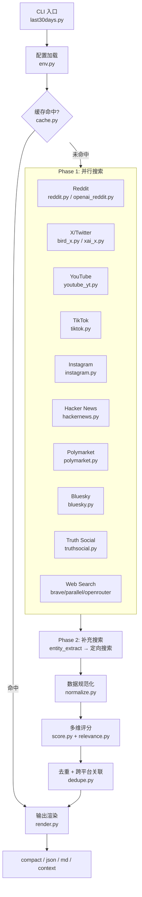
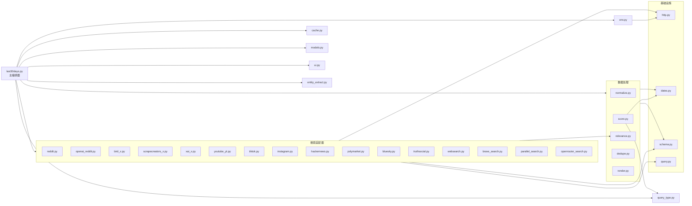
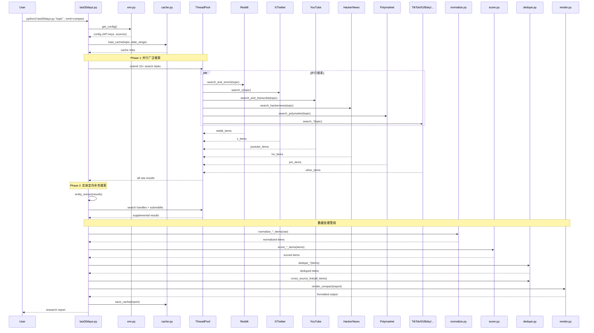
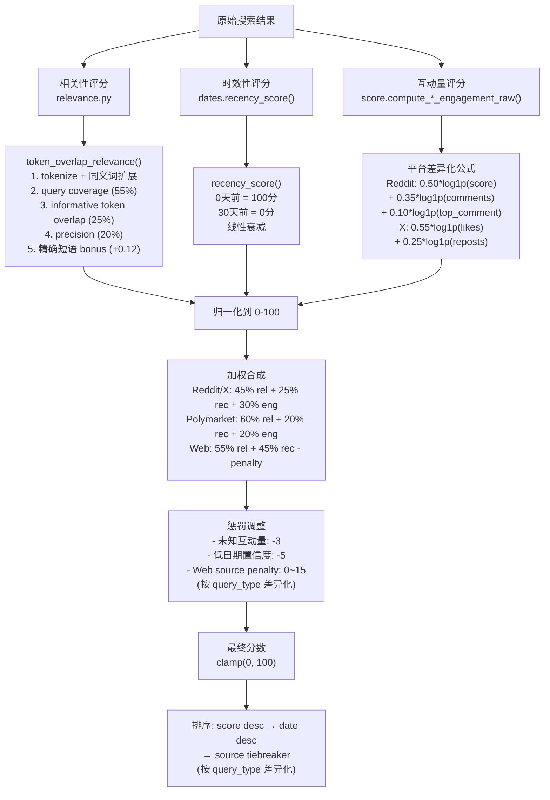

# last30days-skill 源码学习笔记

> 仓库地址：[last30days-skill](https://github.com/mvanhorn/last30days-skill)
> 学习日期：2026-03-29

---

> **以下为 AI 源码分析**
>
> ### 一句话概括
>
> 一个 Claude Code / Gemini CLI skill，跨 10+ 社交平台（Reddit、X、YouTube、TikTok、Instagram、Hacker News、Polymarket、Bluesky、Truth Social、Web）并行搜索指定话题最近 30 天的讨论内容，通过多信号评分、去重和跨平台关联，生成结构化研究报告。
>
> ### 要点速览
>
> | 核心模块 | 职责 | 关键文件 |
> |----------|------|----------|
> | CLI Orchestrator | 命令行入口，解析参数，调度搜索并编排完整管线 | `scripts/last30days.py` |
> | 环境与配置 | 多层 API Key 加载（全局 / 项目 / 环境变量 / Codex auth） | `scripts/lib/env.py` |
> | 多源搜索 | 10+ 平台搜索适配器，各自封装 API 交互和结果解析 | `scripts/lib/reddit.py`, `bird_x.py`, `youtube_yt.py`, `tiktok.py` 等 |
> | 数据规范化 | 将各平台原始数据转为统一 schema | `scripts/lib/normalize.py`, `scripts/lib/schema.py` |
> | 评分与排序 | 多维度加权评分（相关性 + 时效性 + 互动量） | `scripts/lib/score.py`, `scripts/lib/relevance.py` |
> | 去重与关联 | 近似重复检测 + 跨平台内容关联 | `scripts/lib/dedupe.py` |
> | 输出渲染 | 多格式输出（compact / json / md / context） | `scripts/lib/render.py` |
> | 缓存 | 24h TTL 缓存 + 7天模型选择缓存 | `scripts/lib/cache.py` |

---

## 项目简介

last30days-skill 是一个面向 Claude Code / Gemini CLI / OpenAI Codex 的 AI skill（插件），用于对任意话题进行跨平台深度调研。它通过并行搜索 Reddit、X/Twitter、YouTube、TikTok、Instagram、Hacker News、Polymarket 预测市场、Bluesky、Truth Social 和 Web 等 10+ 数据源，聚合社区讨论、互动数据和预测市场赔率，经过多维度评分、去重和跨平台关联后，生成有数据支撑的结构化研究报告。核心价值在于让用户在 2-8 分钟内获得一份涵盖多平台真实社区声音的话题调研，解决了"AI 世界每月都在重塑，如何快速了解人们在讨论什么"的问题。

## 技术栈

| 类别 | 技术 |
|------|------|
| 语言 | Python 3 + Node.js (Bird X search client) |
| 框架 | 无框架，纯 stdlib 构建 |
| 构建工具 | 无（脚本直接运行），`sync.sh` 部署脚本 |
| 依赖管理 | 零外部 Python 依赖（stdlib only），Node.js 用于 Bird X 搜索 |
| 测试框架 | pytest（455+ 测试用例） |

## 目录结构

```
last30days-skill/
├── SKILL.md                    # skill 定义文件（frontmatter + 完整 prompt）
├── SPEC.md                     # 架构规格说明文档
├── CLAUDE.md                   # Claude Code 项目指令
├── scripts/
│   ├── last30days.py           # 主编排器：CLI 入口 + 研究管线
│   ├── watchlist.py            # 话题监控/看板模式
│   ├── store.py                # SQLite 持久化（watchlist 用）
│   ├── sync.sh                 # 部署到 ~/.claude/skills 等目录
│   └── lib/                    # 核心库模块
│       ├── env.py              # 环境/API Key/配置管理
│       ├── schema.py           # 所有平台的数据结构定义（dataclass）
│       ├── score.py            # 多维评分引擎
│       ├── relevance.py        # token-overlap 相关性评分
│       ├── dedupe.py           # 近似重复检测 + 跨平台关联
│       ├── normalize.py        # 原始数据 → 统一 schema 转换
│       ├── render.py           # 多格式输出渲染
│       ├── cache.py            # 24h TTL 缓存系统
│       ├── dates.py            # 日期范围计算与时效评分
│       ├── http.py             # stdlib-only HTTP client（重试/超时）
│       ├── models.py           # AI 模型自动选择与缓存
│       ├── query.py            # 查询预处理（去噪/核心词提取）
│       ├── query_type.py       # 查询类型分类（product/concept/how_to 等）
│       ├── entity_extract.py   # 从搜索结果中提取实体（handle/subreddit）
│       ├── ui.py               # 进度显示 UI
│       ├── reddit.py           # ScrapeCreators Reddit 搜索
│       ├── openai_reddit.py    # OpenAI Responses API Reddit 搜索（legacy）
│       ├── reddit_enrich.py    # Reddit 帖子详情富化
│       ├── bird_x.py           # Bird CLI X/Twitter 搜索（免费）
│       ├── scrapecreators_x.py # ScrapeCreators X 搜索
│       ├── xai_x.py            # xAI API X 搜索（付费）
│       ├── youtube_yt.py       # yt-dlp YouTube 搜索 + 字幕提取
│       ├── tiktok.py           # ScrapeCreators TikTok 搜索
│       ├── instagram.py        # ScrapeCreators Instagram 搜索
│       ├── hackernews.py       # Algolia HN 搜索（免费）
│       ├── polymarket.py       # Gamma API 预测市场搜索（免费）
│       ├── bluesky.py          # AT Protocol Bluesky 搜索
│       ├── truthsocial.py      # Mastodon API Truth Social 搜索
│       ├── brave_search.py     # Brave Search Web 搜索
│       ├── parallel_search.py  # Parallel AI Web 搜索
│       ├── openrouter_search.py # OpenRouter/Sonar Web 搜索
│       ├── websearch.py        # Web 搜索结果规范化
│       ├── xiaohongshu_api.py  # 小红书 HTTP API 搜索
│       └── vendor/
│           └── bird-search/    # 内嵌的 Bird X 搜索客户端（Node.js）
├── tests/                      # 455+ pytest 测试用例
├── fixtures/                   # 测试 fixture 数据
├── hooks/                      # Claude Code hooks 配置
├── variants/                   # skill 变体（open-class）
└── docs/plans/                 # 历史实现计划文档
```

## 架构设计

### 整体架构

last30days-skill 采用 **管道式架构（Pipeline Architecture）**，数据从多个平台搜索源流入，经过标准化、评分、去重、关联等处理阶段，最终渲染为统一格式输出。核心设计思想是"一个编排器协调 N 个独立搜索适配器，通过统一 schema 汇合数据流"。



### 核心模块

#### 1. CLI Orchestrator（`scripts/last30days.py`）

- **职责**：程序总入口，解析 CLI 参数、加载配置、调度搜索、编排完整数据管线
- **关键函数**：
  - `run_research()` — 核心编排函数，使用 `ThreadPoolExecutor` 并行调度所有搜索源
  - `_search_reddit()` / `_search_x()` / `_search_youtube()` 等 — 各搜索源的线程入口
  - `_run_supplemental()` — Phase 2 补充搜索，从 Phase 1 结果中提取实体进行定向搜索
  - `main()` — CLI argparse 入口
- **设计特点**：
  - 全局超时看门狗（`SIGALRM` + 子进程追踪清理）
  - 三级深度配置（quick / default / deep），每级有独立超时参数
  - 两阶段搜索策略：Phase 1 广泛搜索 → Phase 2 基于实体定向深挖

#### 2. 环境与配置（`scripts/lib/env.py`）

- **职责**：多源 API Key 管理，支持 20+ 种 API Key 的加载和验证
- **关键函数**：
  - `get_config()` — 三层优先级加载：环境变量 > 项目配置 > 全局配置
  - `get_openai_auth()` — OpenAI auth 解析（API Key / Codex JWT 双通道）
  - `get_x_source()` / `get_reddit_source()` / `get_web_search_source()` — 各源最优后端选择
  - `get_available_sources()` / `validate_sources()` — 源可用性检测与验证
- **设计特点**：
  - 自动 JWT 过期检测（`_token_expired()`）
  - 文件权限安全检查（`_check_file_permissions()`，检测 `0o044` 权限位）
  - 向上遍历目录树查找项目级配置（`_find_project_env()`）

#### 3. 数据 Schema（`scripts/lib/schema.py`）

- **职责**：定义所有平台的统一数据结构
- **关键 dataclass**：
  - `Engagement` — 通用互动指标（score / likes / views / volume 等）
  - `RedditItem` / `XItem` / `YouTubeItem` / `TikTokItem` / `InstagramItem` / `HackerNewsItem` / `BlueskyItem` / `TruthSocialItem` / `PolymarketItem` — 各平台数据项
  - `Comment` — Reddit / HN 评论
  - `SubScores` — 子评分（relevance / recency / engagement）
  - `Report` — 完整研究报告（含所有平台数据 + 元信息 + 错误状态）
  - `Report.from_dict()` — 反序列化支持（缓存恢复）

#### 4. 评分引擎（`scripts/lib/score.py` + `scripts/lib/relevance.py`）

- **职责**：对搜索结果进行多维度加权评分和排序
- **评分公式**（以 Reddit 为例）：
  - `overall = 0.45 * relevance + 0.25 * recency + 0.30 * engagement`
  - engagement 子分通过 `log1p` 归一化：`0.50*log1p(score) + 0.35*log1p(comments) + 0.05*(ratio*10) + 0.10*log1p(top_comment)`
- **按平台差异化权重**：
  - Reddit/X/YouTube/TikTok：标准三维权重（45% / 25% / 30%）
  - Polymarket：语义加权（60% relevance / 20% recency / 20% engagement）
  - WebSearch：无互动数据（55% relevance / 45% recency - penalty）
- **relevance.py** 实现 token-overlap 相关性评分：
  - 同义词扩展（js↔javascript, ai↔artificial intelligence 等）
  - 精确短语匹配奖励（+0.12 / +0.16 bonus）
  - 低信号 token 检测（仅匹配 "best"、"tips" 等泛化词时限制分数 ≤ 0.24）

#### 5. 去重与跨平台关联（`scripts/lib/dedupe.py`）

- **职责**：同源去重 + 跨源内容关联
- **去重策略**：字符 trigram Jaccard 相似度（阈值 0.7），保留得分最高者
- **跨平台关联**：hybrid 相似度（`max(trigram_jaccard, token_jaccard)`），阈值 0.40，双向关联
- **特殊处理**：X 帖子截断到 100 字符以平衡与短标题的对比公平性

#### 6. 查询预处理（`scripts/lib/query.py` + `scripts/lib/query_type.py`）

- **query.py**：去除冗余前缀/噪声词，提取核心搜索关键词，检测复合词以供引号包装
- **query_type.py**：基于正则模式将查询分为 7 类（product / concept / opinion / how_to / comparison / breaking_news / prediction），不同类型影响：
  - 搜索源优先级（Source Tiers）
  - WebSearch 惩罚力度
  - 排序 tiebreaker 优先级

### 模块依赖关系



## 核心流程

### 流程一：完整研究管线

这是用户执行 `/last30days "topic"` 后的完整数据流转过程。



### 流程二：多维评分管线

评分是该项目的核心竞争力，对每条搜索结果计算综合分数决定排序。



## 关键设计亮点

### 1. 零外部依赖的 HTTP 客户端

- **问题**：作为 Claude Code skill 安装到用户环境，不能依赖 `requests` 等第三方包
- **实现**：`http.py` 完全基于 Python stdlib（`urllib.request`），内置 5 次指数退避重试、429 Rate Limit 的 `Retry-After` 头解析、socket 级错误处理
- **为什么**：skill 部署需零依赖安装，任何有 Python 3 的环境都能运行

### 2. 两阶段搜索策略（Phase 1 + Phase 2 补充搜索）

- **问题**：广泛搜索可能遗漏关键内容，比如知名创作者的帖子可能不包含话题关键词
- **实现**：`entity_extract.py` 从 Phase 1 结果中提取高互动 X handle 和活跃 subreddit，Phase 2 对这些实体做定向搜索。对已解析的 X handle（resolved handle），执行无主题过滤的搜索以捕获不含关键词的相关帖子
- **为什么**：例如搜索 "Dor Brothers" 时，他们 5600 赞的病毒帖文字中不含 "dor brothers"，纯关键词搜索会完全遗漏

### 3. Query-Type-Aware 评分调优

- **问题**：不同类型的查询（如 "best tools" vs "how to use X" vs "latest news"）对不同来源的信任度应该不同
- **实现**：`query_type.py` 通过正则模式将查询分为 7 类，每类定义独立的：Source Tiers（搜索源优先级）、WebSearch penalty（Web 结果惩罚力度）、Tiebreaker 排序优先级。例如 `how_to` 类型 YouTube 排第一、`prediction` 类型 Polymarket 排第一
- **为什么**：教程类查询中 YouTube 视频比 Twitter 帖子更有价值，但趋势新闻中 Twitter 更实时

### 4. Hybrid 跨平台内容关联

- **问题**：同一事件在 Reddit、X、HN 上都有讨论，但标题/文本格式差异大，简单字符匹配失效
- **实现**：`dedupe.py` 的 `cross_source_link()` 使用 hybrid 相似度（`max(char_trigram_jaccard, token_jaccard)`），对不同来源文本做差异化处理（X 帖截断到 100 字、HN 标题去 "Show HN:" 前缀），阈值 0.40 双向关联
- **为什么**：trigram 擅长捕捉拼写相似，token Jaccard 擅长捕捉语义相似（词袋重叠），取两者最大值兼顾两种场景

### 5. 多层配置 + 安全加固

- **问题**：用户可能在不同项目中使用不同 API Key，且 secrets 文件需要安全存储
- **实现**：`env.py` 实现三层配置优先级（env vars > 项目 `.claude/last30days.env` > 全局 `~/.config/last30days/.env`），启动时检查文件权限（`0o044` 位），JWT 自动过期检测，Codex auth 双通道（API Key / JWT token）
- **为什么**：skill 运行在用户本机，需要同时支持多种 AI 平台的认证方式，且不能让 secrets 被意外泄露
