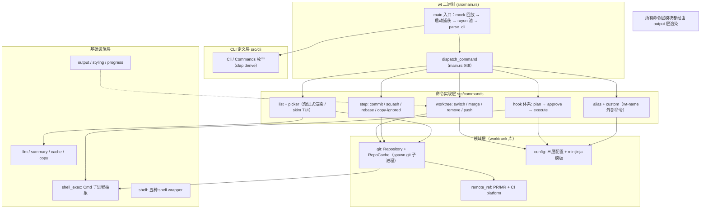
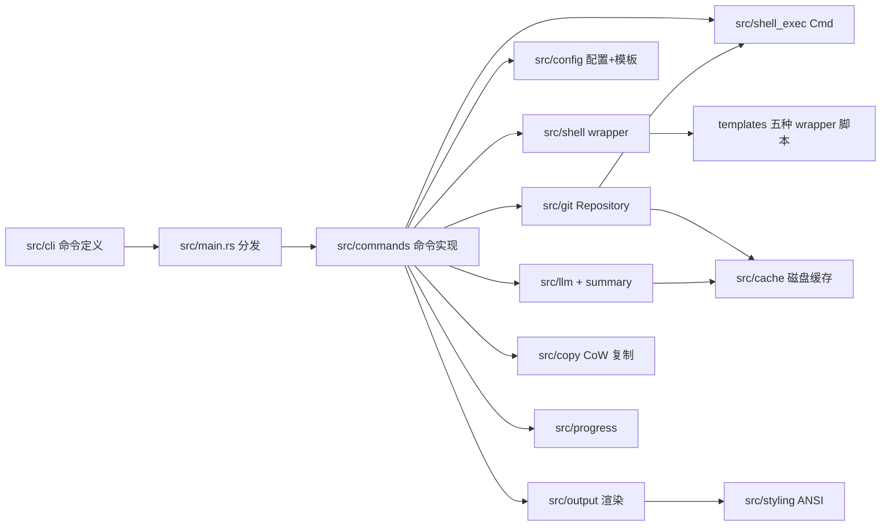
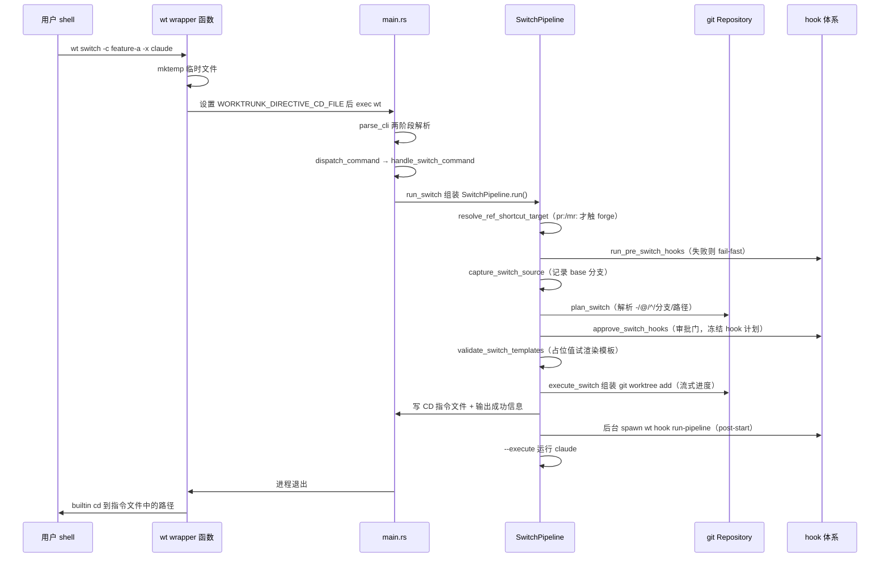
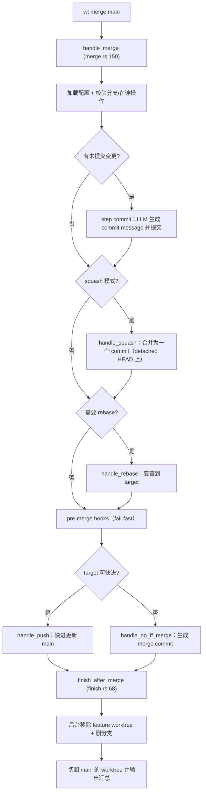

# worktrunk 源码学习笔记

> 仓库地址：[worktrunk](https://github.com/max-sixty/worktrunk)
> 学习日期：2026-09-30

---

> **以下为 AI 源码分析**
>
> ### 一句话概括
>
> Worktrunk（命令名 `wt`）是一个用 Rust 编写的 git worktree 管理 CLI，把 worktree 的创建、切换、合并、清理压缩成三条核心命令，专为"并行运行 5-10 个 AI agent（Claude Code / Codex 等）"的开发工作流设计，是当前最流行的 git worktree 管理器。
>
> ### 要点速览
>
> | 模块 | 职责 | 关键文件 |
> |------|------|----------|
> | `src/cli/` | clap 命令树定义（`Cli`/`Commands` 枚举） | `cli/mod.rs:254,628`、`cli/step.rs:69`、`cli/hook.rs:89` |
> | `src/main.rs` | 参数解析、命令分发、错误渲染、收尾清理 | `main.rs:1120`（main）、`:948`（dispatch） |
> | `src/commands/` | 命令实现层：switch/remove/merge/step/hook/list/picker/alias | `worktree/switch.rs:2051`、`merge.rs:150`、`remove.rs:370` |
> | `src/git/` | git 交互层：spawn git 子进程（不用 git2），Repository + 缓存 | `git/repository/mod.rs:765`、`worktrees.rs:37,378` |
> | `src/git/remote_ref/` | PR/MR 引用解析（gh/glab/tea/az CLI 后端） | `remote_ref/mod.rs:104`、`git/ci_platform.rs:19` |
> | `src/config/` | 三层配置加载 + minijinja 模板引擎 | `config/user/mod.rs:606`、`expansion.rs:1091` |
> | `src/shell/` | 五种 shell 的 wrapper 集成（cd 实现） | `shell/mod.rs:63,97`、`templates/bash.sh` |
> | `src/shell_exec.rs` | 统一子进程抽象 `Cmd`：超时/流式/信号转发/并发限流 | `shell_exec.rs:1088` |
> | `src/output/` + `src/styling/` + `src/progress.rs` | 渲染层：JSON 输出、主题、进度条、cd 指令文件 | `output/global.rs:9`、`progress.rs:140` |
> | `src/commands/list/` + `src/commands/picker/` | 渐进式列表与 skim TUI 选择器 | `list/collect/`、`picker/mod.rs`、`picker/items.rs` |
> | `src/llm.rs` + `src/summary.rs` | LLM commit message 与 branch summary（spawn CLI 工具） | `llm.rs:511,714`、`summary.rs:69,215` |
> | `src/copy.rs` + `src/cache.rs` | copy-on-write 目录复制与磁盘缓存 | `copy.rs:127,316`、`cache.rs:54,105` |
> | `src/trace/` | 自研 span trace + Perfetto/Chrome trace 导出 | `trace/emit.rs`、`trace/chrome.rs:87` |

---

## 项目简介

worktrunk 解决的核心痛点：git 原生 worktree 的 UX 很笨拙——新建一个 worktree 要把分支名打三遍（`git worktree add -b feat ../repo.feat && cd ../repo.feat`），而 AI agent 并行开发需要同时管理 5-10 个 worktree。worktrunk 用 **branch 名作为 worktree 的唯一地址**（路径由可配置模板计算），提供 `wt switch`（创建/切换）、`wt list`（带状态列表）、`wt merge`（squash/rebase/合并/清理一条龙）、`wt remove`（清理）三条核心命令，并围绕多 worktree 场景提供 hook 自动化、LLM commit message、CI status 展示、copy-on-write 构建缓存共享（`wt step copy-ignored`）等质量型功能。项目由 max-sixty（derive_more 作者）主导开发，2026 年初发布，Rust 编写，`unsafe_code = "forbid"`，测试覆盖极其扎实（约 1130 个 insta 快照 + PTY 终端仿真测试）。

## 技术栈

| 类别 | 技术 |
|------|------|
| 语言 | Rust（edition 2024，MSRV 1.97，`unsafe_code = "forbid"`） |
| 框架 | clap 4（derive，CLI）、ratatui + crossterm + skim 5.7（TUI picker）、minijinja（模板）、rayon（数据并行）、tracing + tracing-subscriber（日志） |
| 构建工具 | cargo + `build.rs`（vergen-gitcl 注入 git 信息）+ cargo-dist（`dist-workspace.toml`）+ Taskfile + Nix flake |
| 依赖管理 | Cargo（workspace：主 crate + `tests/helpers/wt-perf`） |
| 测试框架 | insta / insta-cmd（快照）、rstest、criterion（bench）、portable-pty + vt100（终端仿真测试） |

## 目录结构

```
worktrunk/
├── src/
│   ├── main.rs              # wt 二进制入口：解析 → 分发 → 清理
│   ├── lib.rs               # worktrunk 库根（git/config/shell/shell_exec 等对外暴露）
│   ├── cli/                 # clap 命令树：mod.rs + config/step/hook/list 子命令枚举
│   ├── commands/            # 命令实现层
│   │   ├── worktree/        #   核心：switch/merge/remove/push/finish（resolve.rs 算路径）
│   │   ├── step/            #   merge 流水线的原子操作：commit/squash/rebase/copy-ignored/prune/...
│   │   ├── list/            #   wt list：rayon 并行收集 + 渐进式表格 + CI status
│   │   ├── picker/          #   wt switch 交互选择器：skim TUI + 预览 + PR 列表
│   │   ├── config/          #   wt config：配置/state/缓存/插件安装
│   │   ├── hooks.rs / hook_plan.rs / command_executor.rs   # hook 体系（计划→审批→执行）
│   │   ├── alias.rs / custom.rs                            # 别名与 wt-<name> 外部子命令
│   │   └── configure_shell.rs                              # wt config shell install
│   ├── git/                 # git 交互层
│   │   ├── repository/      #   Repository + 子模块：worktrees/branch/diff/remotes/config/...
│   │   ├── remote_ref/      #   PR/MR 解析（github/gitlab/gitea/azure 后端）
│   │   └── error.rs         #   Diagnostic trait + GitError/WorktrunkError 错误体系
│   ├── config/              # 配置与模板
│   │   ├── user/            #   三层配置加载/合并/迁移（系统→用户→项目）
│   │   ├── expansion.rs     #   minijinja 模板展开 + codename/hash_port 等过滤器
│   │   ├── hooks.rs         #   HooksConfig（10 种 hook 类型）
│   │   └── deprecation.rs   #   弃用键迁移规则表
│   ├── shell/               # shell 集成：wrapper 检测/生成/路径
│   ├── shell_exec.rs        # Cmd 子进程抽象：超时、流式、信号、信号量
│   ├── output/              # 输出层：json/global(cd 指令)/handlers/prompt
│   ├── styling/             # ANSI 主题、OSC-8 超链接、ANSI 感知换行
│   ├── llm.rs / summary.rs  # LLM 集成：commit message、branch summary、内容寻址缓存
│   └── trace/               # 自研 span trace + profile + Perfetto 导出
├── templates/               # 五种 shell 的 wrapper 脚本模板（bash.sh/zsh.zsh/fish/nu/ps1）
├── skills/ + plugins/       # 面向 AI agent 的 skill 与插件（Claude/Codex/OpenCode/Pi）
├── tests/                   # 集成测试（63 个主题文件）+ wt-perf 性能 crate
├── dev/                     # config.example.toml 等生成样例模板
└── docs/                    # worktrunk.dev 文档站（Astro/Starlight）
```

## 架构设计

### 整体架构

整体是清晰的四层单向依赖结构：**CLI 定义层 → 命令实现层 → 领域层（git + config）→ 基础设施层（进程/渲染）**。`wt` 二进制（`src/main.rs`）与 `worktrunk` 库（`src/lib.rs`）分离：库暴露 git/config/shell/shell_exec 等领域能力，`cli` feature 把 clap/ratatui/skim 等 CLI 专属依赖挡在库外，库消费者（如 worktrunk-sync）用 `default-features = false` 即可避免拉入 TUI 栈（`Cargo.toml:91`）。



几条贯穿性的设计原则：

1. **branch 名是唯一地址**：所有接受 branch 的命令同样接受 worktree 路径（`git/repository/worktrees.rs:510` 的 `resolve_worktree` 统一解析 `-`/`@`/`^`/分支名/路径五种输入），路径只是模板的派生物。
2. **模板驱动一切**：worktree 路径（默认 `{{ repo_path }}/../{{ repo }}.{{ branch | sanitize }}`）、hook 命令、alias、LLM prompt 都是 minijinja 模板（`config/expansion.rs:1091`），变量体系统一。
3. **不绑定 git2**：git 操作全部 spawn 子进程 + porcelain 输出解析（`git/repository/mod.rs:1970` `run_command`），重量级命令经 `HEAVY_OPS_SEMAPHORE` 限流，进程内 `RepoCache`（OnceCell + DashMap 两级）+ 磁盘 `.git/wt/cache/` sha 缓存兜底。
4. **变更前预检 + 审批冻结**：不可逆操作前先试渲染模板（`validate_switch_templates`）、hook 先审批再冻结执行（`ApprovedHookPlan`），宁可提前失败也不留半成品状态。

### 核心模块

**① CLI 定义与分发（`src/cli/` + `src/main.rs`）**
- `Cli`（`cli/mod.rs:254`）：全局参数 `-C`/`--config`/`--config-set`/`-v`/`-y` + `Commands` 枚举（`:628`：Switch/List/Remove/Merge/Step/Hook/Config/Select(弃用)/Custom）。
- `Custom(Vec<OsString>)` 用 `#[command(external_subcommand)]` 捕获未知子命令，交给 alias/外部命令机制处理（`commands/custom.rs:60`）。
- 解析是两阶段的（`main.rs:772` `parse_cli`）：先 `parse_early_globals`（`:857`）提前取 `-C/--config` 并识别 help 场景（分页器渲染帮助），再正式 `try_get_matches_from`；clap 错误经 `enhance_and_exit_error`（`:104`）加"是不是想输 `wt step squash`"的嵌套子命令提示。
- `main()`（`:1120`）顺序：mock 回放（测试钩子）→ `init_startup`（捕获 CWD/前台线程）→ 补全提前返回 → rayon 线程池（`available_parallelism() * 2`）→ 解析 → `Repository::prewarm` → `dispatch_command`（`:948`）→ 成功 `finish_command`（`:1097`，写诊断日志 + 重置 ANSI），失败 `handle_command_failure`（`:1103`，保留子进程退出码，Ctrl-C 时遵循 `128+signal` 惯例）。

**② git 交互层（`src/git/`）**
- `Repository`（`repository/mod.rs:765`）：持有 discovery_path、git_common_dir、`Arc<RepoCache>`、worktree 注册锁。所有 git 调用走 `run_command` 家族（`:1970` 起：`run_command_check`/`run_command_output`/`run_command_delayed_stream`）。
- worktree 增删查：`list_worktrees`（`worktrees.rs:37`，porcelain 解析 + 过滤 bare + rebase 中 detached 修正）、`remove_worktree`（`:378`，submodule 自动补 `--force`）、`prune_worktree_entry`（`:258`）**刻意不调** `git worktree prune`，而是手工复刻单条 prune（删 `.git/wt/worktrees/<id>`），避免误删挂载卷上的旁观 worktree。
- `remote_ref/`：`wt switch pr:123` 经 `fetch_info`（`mod.rs:104`）调 `gh`/`glab`/`tea`/`az` CLI 取 PR 元数据，四个 forge 各一个后端文件；`parse_ref_url`（`:367`）从 URL 反推 `pr:N`/`mr:N`。
- 错误体系（`error.rs`）：`Diagnostic` trait（`:95`）把"短单行 Display"与"富样式多行渲染"分离；`GitError`（`:383`）是覆盖分支/工作树/合并等场景的大枚举；`ErrorExt`（`:110`）为 `anyhow::Error` 提供 `render_diagnostic`/`exit_code`/`interrupt_signal`，让 main 层统一渲染。

**③ 配置与模板（`src/config/`）**
- 三层加载：系统 `/etc/xdg/worktrunk/config.toml` → 用户 `~/.config/worktrunk/config.toml` → 项目 `<repo>/.config/wt.toml`（`config/mod.rs:3`），再叠 `WORKTRUNK__A__B` 环境变量层和 `--config-set` CLI 层（`user/mod.rs:606` `load_with_warnings`）。
- `merge_layer`（`user/mod.rs:325`）：高层全局键先从低层 `[projects."…"]` 条目里删除同键叶子再深合并，保证"用户全局键压过系统 projects 条目"这种反直觉但正确的优先级；`[projects]` 键支持 `*` 通配按特异性排序（`user/project_match.rs:53`）。
- `expansion.rs`：模板变量分 `ACTIVE_VARS`（branch/worktree_path/commit…）、`REPO_VARS`（repo/repo_path/owner/default_branch…）、hook 专属 `hook_extras`（pr_number/target/base…）；过滤器有 `sanitize`（`/`→`-`）、`hash_port`（确定性端口 10000-19999，给每个 worktree 一个独立 dev server 端口）、`codename(n)`（petname 词表 + SHA256，生成 `malleable-opah` 这类稳定代号）；`validate_template`（`:1009`）用占位值试渲染，用于变更前预检。

**④ hook 体系（`src/commands/hooks.rs` + `hook_plan.rs` + `command_executor.rs`）**
- `HookType`（`git/mod.rs:501`）共 10 种：pre/post × switch/start(别名 create)/commit/merge/remove；`is_pre`（`:531`）决定语义——pre hook 失败即中止（fail-fast），post hook 默认后台运行只告警。
- 执行链：`HookPlanBuilder`（`hook_plan.rs:90`）构建计划 → `approve` 审批 → `ApprovedHookPlan`（冻结的选择）→ 前台 `execute_pipeline_foreground`（`command_executor.rs:465`，串行步顺序执行，并发组先全展开再 spawn）或后台 `spawn_detached_exec` 拉起分离进程 `wt hook run-pipeline`，从 stdin 读 `PipelineSpec` JSON 逐命令执行，日志写 `.git/wt/logs/{branch}-{source}-{hook}-{name}.log`。
- 审批机制：项目级 hook 是任意代码，必须过审批门（`~/.config/worktrunk/approvals.toml` 按 project_id + 模板字符串匹配，`config/approvals.rs:36`），用户级免审批。

**⑤ shell 集成与 cd 实现（`src/shell/` + `src/output/global.rs`）**
- 支持 bash/zsh/fish/nushell/powershell 五种（`shell/mod.rs:63`）。`wt config shell install`（`commands/configure_shell.rs:353`）：eval 型 shell（bash/zsh/pwsh）向 rc 文件追加 `eval "$(wt config shell init …)"`；wrapper 型（fish/nu）写整文件函数。
- **cd 原理**（最巧妙的部分）：子进程无法改变父 shell 的目录。wrapper 函数（`templates/bash.sh`）mktemp 一个临时文件，经环境变量 `WORKTRUNK_DIRECTIVE_CD_FILE`（`shell_exec.rs:534`）传给 wt；wt 把目标路径写进文件（`output/global.rs`）；wrapper 读出后 `builtin cd -- "$(<file)"`（用 builtin 绕过 zoxide 等用户 cd 别名）。

**⑥ 渲染与 TUI（`src/output/` + `styling/` + `commands/list/` + `commands/picker/`）**
- `wt list`：`rayon::scope` 并行收集每个 worktree 的状态（`list/collect/execution.rs:59` `WorkItem`），`DrainEvent`（Result/Reveal/Stall，`results.rs:48`）驱动 `progressive_table.rs` 自研 crossterm 原地更新表格——骨架行先上屏，慢列（CI status、LLM summary）后台补齐，`--full` 才启用慢列。
- picker（`picker/mod.rs`，4794 行）：基于 skim 公共 API（`Skim::init`/`run`，拿 `event_sender()` 主动 push Render 事件）。预览 8 个 tab（diff/working tree/log/PR/comments/summary…）由 `preview_orchestrator.rs` 编排两级缓存（内存 DashMap + 磁盘 `preview_cache.rs`），`preview_notify.rs` 在后台填充完成后 poke 重绘。快捷键 alt-y 复制分支名、alt-o 打开 PR、alt-x 同步删行。

**⑦ LLM 集成（`src/llm.rs` + `summary.rs`）**
- 不绑任何 SDK/API——配置任意 shell 命令模板（用户 config `[commit.generation] command`），`execute_llm_command`（`llm.rs:511`）经平台 shell spawn CLI 工具（claude/codex/opencode…），diff 走 stdin。首次使用时 `detect_llm_tool`（`output/commit_generation.rs:178`）按 claude > codex > opencode 顺序探测并写入推荐配置。
- 缓存用 SHA-256 内容寻址：`hash_diff`（`summary.rs:215`）对 diff 内容做哈希作为文件名，存 `.git/wt/cache/summary/{branch}/{diff_hash}.json`，`sweep_lru` 每分支只留 1 条。

### 模块依赖关系



依赖方向严格单向：`commands` 是唯一同时接触 git/config/llm 的编排层；`git` 与 `config` 互不依赖（git 层读项目配置走 `git/repository/config.rs` 的 git config 通道）；渲染层被所有命令层消费但不反向依赖。

## 核心流程

### 流程一：`wt switch -c feature-a -x claude`（创建 worktree 并启动 agent）

这是整个项目最核心的链路，覆盖 plan → approve → validate → execute → cd → 后台 hook 的完整模式：



关键逻辑逐段说明（对应 `commands/worktree/switch.rs:1776` 的 `SwitchPipeline::run`）：

1. **两阶段解析**：`parse_early_globals` 先扫 `-C/--config`——因为配置覆盖必须在 `Repository::prewarm`（预热 worktree 列表缓存）之前生效，否则用户指定的 `--config` 会被预热时读的默认配置抢跑。
2. **PR 解析前置**（`:1804`）：`pr:N`/`mr:N` 在 hook 之前解析，这样 pre-switch hook 的 `{{ branch }}`/`{{ pr_number }}` 变量已经是具体分支而非原始 token；且解析被限制在"显式给了 pr: 参数"这一种形式，不让普通 switch 触发 forge 网络。
3. **"Approve at the Gate"**（`:1848`）：hook 审批在命令入口一次性完成，用户拒绝则跳过 hook 但继续 worktree 操作（不让 hook 阻塞核心动作）。
4. **模板预检**（`:1854` `validate_switch_templates`）：在真正创建 worktree **之前**用占位值试渲染所有将用到的模板，语法错误/未定义变量在这里抛出——半创建的 worktree 会阻塞后续重跑，属于典型的"不可逆操作前预检"。
5. **指令文件 cd**（`output/global.rs`）：wt 把目标路径写进 wrapper 传来的临时文件后退出，wrapper 执行 `builtin cd`。`--execute` 的子进程（claude）则在 wt 内部以 worktree 为 cwd 直接运行，两不冲突。
6. **后台 hook**：post-start hook（如装依赖、起 dev server）经 `spawn_detached_exec` 拉起分离进程 `wt hook run-pipeline`，stdin 传 `PipelineSpec` JSON，日志独立落盘——用户终端不被长任务占用。

### 流程二：`wt merge main`（合并一条龙：commit → squash → rebase → merge → 清理）



关键逻辑：

- **commit 阶段**（`llm.rs:714` `generate_commit_message`）：把 staged diff 经 stdin 喂给用户配置的 LLM 命令（默认模板在 `llm.rs:804` `build_commit_prompt`），拿回 message 后走 `git commit`；失败时保留分支与 staged 状态可从 reflog 恢复（CHANGELOG 0.80.0 明确修复过"squash 提交失败弄丢分支"的问题）。
- **squash 在 detached HEAD 上做**：这是为了隔离 `pre-commit` hook 的副作用——即便用户的 git hook 失败，feature 分支本身不动。
- **基线选择**：`wt step diff` 与 merge 共用同一个 merge-base 计算，保证本地 `main` 落后 `origin/main` 时 diff 不会混入上游提交。
- **收尾清理**（`worktree/finish.rs:68`）：删 worktree 走 `stage_worktree_removal`（先锁 + 移入回收站再后台 `rm -rf`），删分支若与 target 同 commit 则直接删，否则保留提示。

## 关键设计亮点

**1. 指令文件模式实现"子进程改父 shell 目录"**
- 问题：CLI 子进程原则上无法改变父 shell 的 cwd，所以 `wt switch` 做完工作后用户还站在原目录。
- 实现：shell wrapper 函数 mktemp 一个文件，经 `WORKTRUNK_DIRECTIVE_CD_FILE` 环境变量传给 wt（`shell_exec.rs:534` 定义常量，`output/global.rs:9` 写入，`templates/bash.sh` 读取后 `builtin cd`）。
- 妙处：`builtin cd` 绕过 zoxide/fzf 等用户给 `cd` 设置的别名与函数；wrapper 每次运行时 source `wt config shell init` 的最新输出（fish 版），升级 wt 不需要重装集成；`invocation.rs:163` 通过 argv[0] 是否含路径分隔符判断 wrapper 是否生效，决定 cd 指令是否可用，并给出对应安装提示。

**2. Approve-at-the-Gate + 冻结计划，封堵 hook 审批的 TOCTOU**
- 问题：项目级 hook（`.config/wt.toml`）是任意代码，必须用户审批；但"审批通过"与"实际执行"之间存在时间窗，窗口内的 merge/rebase/remove 可以改写 wt.toml，偷换将要执行的命令（经典 TOCTOU）。
- 实现：`HookPlan::approve`（`hook_plan.rs:90` 附近）是构造 `ApprovedHookPlan` 的**唯一**入口，审批通过即冻结 hook 命令字符串，执行器（`command_executor.rs`）只消费冻结值、不再读配置。审批持久化按 project_id + 模板字符串精确匹配（`config/approvals.rs:36`）。
- 借鉴价值：任何"先批准后执行"的系统（CI 门禁、部署审批）都该这么设计——批准的应是不可变的快照，而不是对可变配置的引用。

**3. 弃用 git2，spawn git 子进程 + 双层缓存 + 手工 prune**
- 权衡：git2（libgit2 绑定）省去进程开销，但版本行为与 git CLI 有微妙偏差（worktree/prune 语义尤甚），且 C FFI 与 `unsafe_code = "forbid"` 冲突。
- 实现：`Repository::run_command`（`git/repository/mod.rs:1970`）统一 spawn `git` 子进程，porcelain 格式机器解析（`git/parse.rs`）；进程内 `RepoCache`（OnceCell + DashMap，`mod.rs:232`）缓存 worktree 列表/分支表，磁盘 `.git/wt/cache/`（`sha_cache.rs`、`cache.rs:105` 带 LRU 清扫）缓存跨进程结果；`HEAVY_OPS_SEMAPHORE`（`git/mod.rs:38`）限制并发重命令。prune 尤其体现功力：不调 `git worktree prune`（会误删挂载卷上的合法 worktree），而是手工复刻"删单条 `.git/worktrees/<id>`"（`worktrees.rs:258`）。

**4. 渐进式渲染：先给骨架，慢数据流式补齐**
- 问题：`wt list --full` 要查每个分支的 CI status（spawn gh/glab）和 LLM summary（秒级），等齐再渲染在 50 个 worktree 的仓库上不可接受。
- 实现：`list/collect/` 用 `rayon::scope` 并行收集，`DrainEvent`（Result/Reveal/Stall，`list/results.rs:48`）驱动 `progressive_table.rs` 在 crossterm 上原地重绘表格——先上骨架行占位，后台结果到一条补一条；skim picker 同理（`picker/progressive_handler.rs`），且利用 skim 4+ 按需渲染的特性，由 `preview_notify.rs` 在预览缓存填充完后主动 poke 重绘。配合"从未 push 的分支不查 CI"的跳过逻辑（239 个本地分支只发 25 次 gh 调用而非 249 次，CHANGELOG 0.80.0）。
- 借鉴价值：CLI 产品的感知性能来自"尽快给部分真相"，这需要输出层从"拼完整字符串再 print"升级为"事件驱动的原地重绘"，worktrunk 为此自研了表格渲染而不是用 indicatif。

**5. 测试策略：快照 + 终端仿真 + 源码守卫三件套**
- insta 约 1130 个快照覆盖命令输出；`tests/common/pty.rs` 用 portable-pty + vt100 做真实终端仿真测试（picker 的键盘渐进增强、旧 Windows console 行为都靠它兜住）；`tests/integration_tests/readme_sync.rs` 反向校验 README/docs 与 `src/cli/mod.rs` 中实际命令定义同步，`Cargo.toml:19-55` 的 `workspace.metadata.affected.rule` 把"运行时才读、coverage 看不见"的文件（快照、README、PKGBUILD）手动映射回对应测试，让 `cargo affected` 增量测试不漏。测试基建本身就是一套值得抄的工程。

**未深入分析的部分**：`src/trace/` 的 Perfetto 导出细节、`benches/`（criterion 基准 7 组）、`docs/`（Astro 文档站构建）、`plugins/` 与 `skills/`（面向各 AI agent 的集成分发）、Nix/dist 发布链、`wt-perf` 性能采集 crate、fsmonitor/reap 等 macOS 专用优化（`git/fsmonitor.rs`、`git/reap.rs`）。
