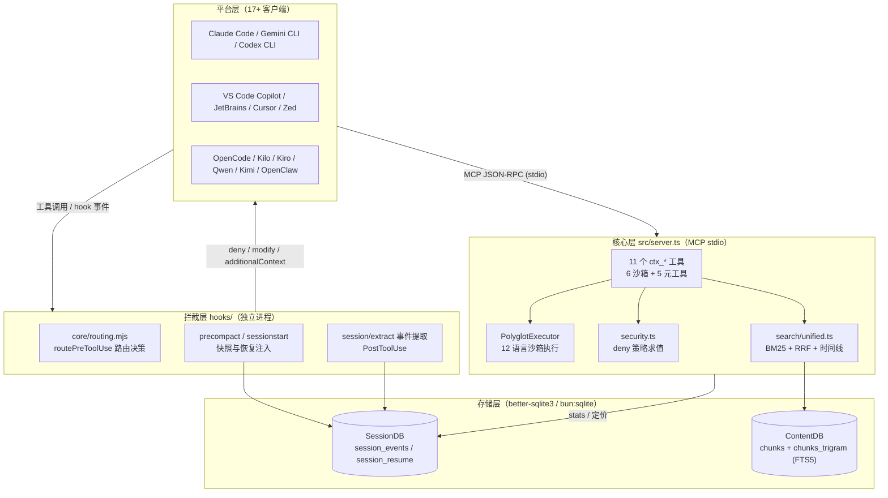
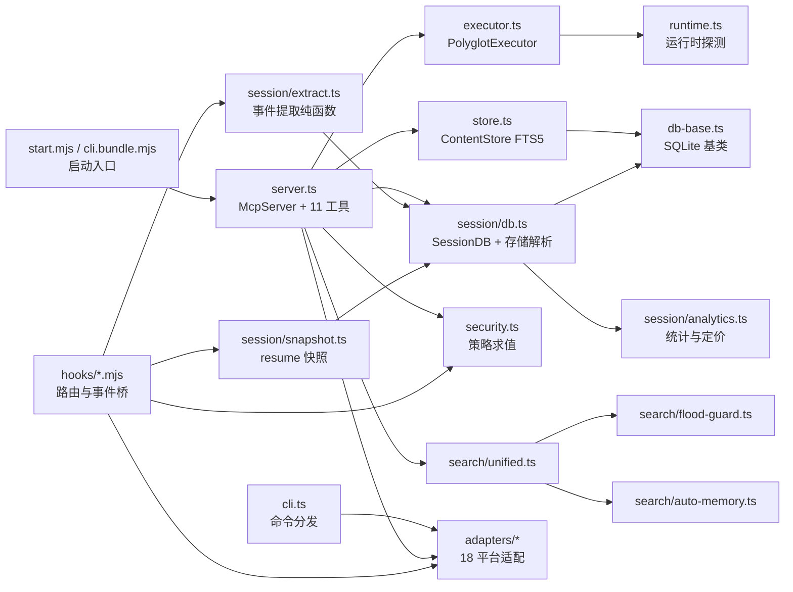
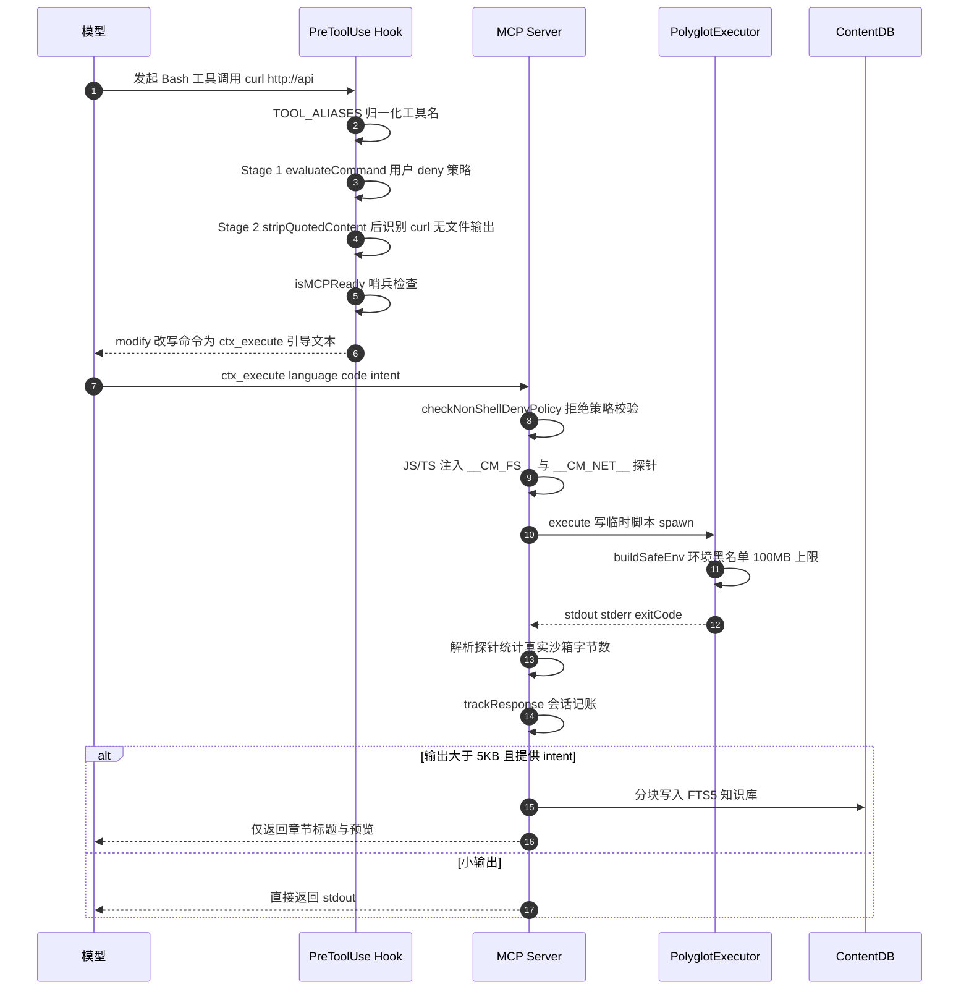
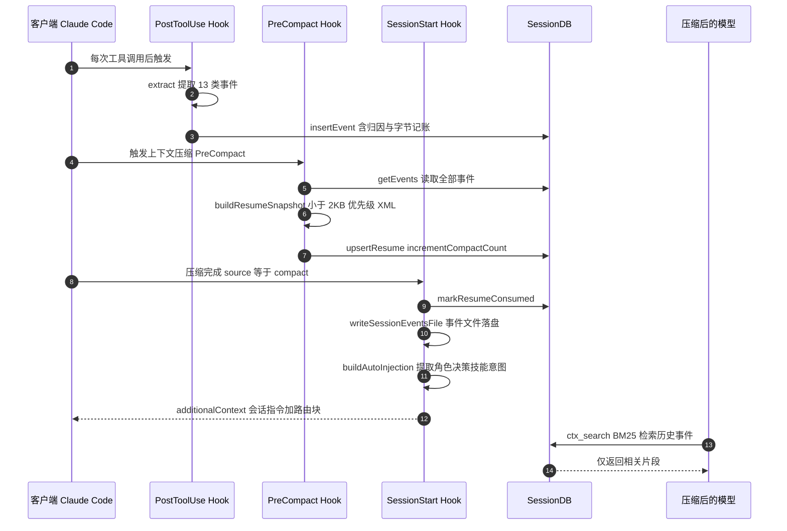
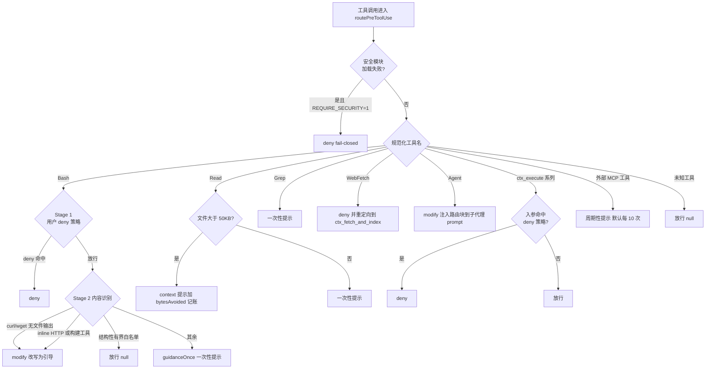

# context-mode 源码学习笔记

> 仓库地址：[mksglu/context-mode](https://github.com/mksglu/context-mode)
> 学习日期：2026-09-30
> 版本：v1.0.169 · License：Elastic-2.0 · 作者：Mert Koseoğlu

---

> **以下为 AI 源码分析**
>
> ### 一句话概括
>
> context-mode 是一个跨 17+ 客户端的 MCP 插件型服务器，通过「沙箱代码执行 + FTS5 会话记忆」把原始数据挡在模型上下文窗口之外，官方口径节省 98% 上下文（315 KB → 5.4 KB）。
>
> ### 要点速览
>
> | 模块 | 职责 | 关键文件 |
> |------|------|----------|
> | MCP 服务器 | 注册 11 个 `ctx_*` 工具、stdio 传输、统计追踪 | `src/server.ts`（4991 行） |
> | 沙箱执行器 | 12 语言子进程执行、env 黑名单、100MB 输出上限 | `src/executor.ts` |
> | 安全层 | 解析平台权限模式、deny 求值、防链式/子 shell 逃逸 | `src/security.ts` |
> | 知识库 | FTS5 双索引（porter + trigram）、RRF 融合检索 | `src/store.ts`（2071 行） |
> | 会话连续性 | 13 类事件提取、压缩快照、恢复注入 | `src/session/`（extract/db/snapshot…） |
> | 统一检索 | BM25 + 时间线 + auto-memory 三源合并、防刷限流 | `src/search/` |
> | 路由拦截 | PreToolUse 决策：deny/modify/context/nudge | `hooks/core/routing.mjs` |
> | 平台适配 | 18 个客户端的存储路径与配置差异归一 | `src/adapters/` |
> | CLI | index/search/doctor/upgrade/hook/statusline | `src/cli.ts`（2040 行） |
> | 构建编排 | tsc + esbuild 六个 bundle + 漂移断言 | `package.json` scripts、`scripts/` |

---

## 项目简介

context-mode 自称「上下文问题的另一半」：MCP 工具调用的原始输出（Playwright 快照 56 KB、20 个 GitHub issue 59 KB、访问日志 45 KB）直接灌进上下文窗口，30 分钟就能吃掉 40% 的窗口；压缩（compaction）之后模型又忘记正在编辑的文件与未完成任务。它用四件事解决：

1. **Context Saving**——`ctx_execute` 等沙箱工具让字节级原始数据留在子进程里，只有 `console.log()` 的结果进入上下文；
2. **Session Continuity**——每个文件编辑、git 操作、错误、用户决策都以事件形式写入 SQLite，压缩后不回灌数据，而是索引进 FTS5、按需 BM25 检索；不用 `--continue` 时旧会话数据立即清除（fresh session = clean slate）；
3. **Think in Code**——强制范式：模型生成分析代码而不是自己当数据处理器，47 次 `Read()`（700 KB）换成 1 次 `ctx_execute()`（3.6 KB）；
4. **不管文风**——路由块只决定「数据流向哪里」，不约束模型怎么说话（项目作者认为激进的简洁提示词会损害编码/推理基准）。

工程上的核心价值在于**一份 TypeScript 源码同时服务 17+ 客户端**（Claude Code / Gemini CLI / Codex CLI / VS Code Copilot / Cursor / OpenCode / Kilo / Kiro / Qwen Code / Kimi / JetBrains / Zed / Antigravity / OpenClaw / OMP / Pi…），通过 hooks 拦截层实现「自动强制路由」。

## 技术栈

| 类别 | 技术 |
|------|------|
| 语言 | TypeScript（ESM，Node >= 22.5，也支持 Bun 运行） |
| 框架 | @modelcontextprotocol/sdk ^1.26.0（stdio 传输） |
| 数据库 | better-sqlite3（FTS5 全文索引，Bun 下走 `bun:sqlite`） |
| 关键依赖 | zod（工具入参校验）、turndown + turndown-plugin-gfm（HTML→Markdown）、@mixmark-io/domino（DOM 解析）、picocolors、@clack/prompts（CLI 交互） |
| 构建工具 | tsc（类型检查 + build/）+ esbuild（六个 bundle） |
| 依赖管理 | pnpm 10.23.0（仓库同时携带 bun.lock） |
| 测试框架 | vitest ^4（另有 tsx 驱动的 benchmark / ecosystem 脚本） |

## 目录结构

```text
context-mode/
├── src/                    TypeScript 源码（约 2.7 万行）
│   ├── server.ts           MCP 服务器：11 个 ctx_* 工具注册、main() 启动（4991 行）
│   ├── cli.ts              CLI 入口：index/search/doctor/upgrade/hook/statusline（2040 行）
│   ├── executor.ts         PolyglotExecutor：12 语言沙箱执行
│   ├── runtime.ts          Node/Bun 及各语言运行时探测、buildCommand 命令组装
│   ├── security.ts         权限模式解析、deny 求值、链式命令/子 shell 拆分
│   ├── store.ts            ContentStore：FTS5 知识库与降级检索（2071 行）
│   ├── db-base.ts          SQLite 连接、预编译语句基类
│   ├── lifecycle.ts        父进程存活探测、bridge 子进程 idle 自杀守卫
│   ├── runPool.ts          并发批执行池
│   ├── session/            会话连续性：extract（事件提取）、db、snapshot、analytics、
│   │                       pricing、purge、project-attribution、error-classifier
│   ├── search/             unified（三源合并）、flood-guard、auto-memory、ctx-search-schema
│   ├── adapters/           18 个平台适配器 + client-map（clientInfo→PlatformId）+ detect
│   └── util/               project-dir、jsonc、claude-config、plugin-cache-integrity
├── hooks/                  各平台 hook 脚本（无构建依赖的 .mjs）
│   ├── core/routing.mjs    路由决策引擎 routePreToolUse（约 1000 行）
│   ├── core/               mcp-ready、tool-naming、formatters、platform-detect、stdin
│   ├── <platform>/         claude-code/codex/gemini-cli/cursor/kimi/kiro/... 每平台入口
│   ├── formatters/         各平台 hook 输出格式差异适配
│   ├── hooks.json          Claude Code 插件的 7 类 hook 事件注册
│   └── *.bundle.mjs        esbuild 产物：marketplace 安装无需构建即可运行
├── configs/                19 个平台的配置模板（settings.json / GEMINI.md / plugin.json）
├── skills/                 context-mode 主 skill + ctx-doctor/index/insight/purge/search/stats/upgrade
├── scripts/                构建编排：assert-bundle、assert-asymmetric-drift、version-sync、
│                           postinstall、heal-better-sqlite3、plugin-cache-integrity
├── tests/                  vitest 套件：adapters/session/security/executor/hooks/integration/plugins
├── web/                    Insight 仪表盘（托管在 context-mode.com/insight）
├── bin/statusline.mjs      状态栏：本会话/累计节省金额、效率百分比
├── start.mjs               npx 启动入口：项目目录锚定、Linux 下 Bun 重执行、缓存自愈
├── server.bundle.mjs       预构建 MCP 服务器（745 KB）
├── cli.bundle.mjs           预构建 CLI（743 KB）
├── .claude-plugin/ .codex-plugin/ .cursor-plugin/ .openclaw-plugin/ .pi/ .agents/
│                           各平台插件 manifest（版本由 version-sync 统一同步）
└── docs/                   ADR、platform-support、UPSTREAM-CREDITS
```

## 架构设计

### 整体架构

整体是典型的**端口-适配器（六边形）+ AOP 拦截**结构，自上而下分四层：

- **平台层**：17+ 客户端，每个都有各自的工具命名（`run_shell_command` / `bash` / `shell`…）和 hook 事件名（BeforeTool / PreToolUse…）；
- **拦截层**：hooks 以独立进程运行（如 `node hooks/pretooluse.mjs`），在工具调用**之前**做安全检查与路由改写，在**之后**提取事件；没有 hook 能力的平台退化为一次性复制路由文件（`configs/<platform>/`）；
- **核心层**：MCP server 通过 stdio JSON-RPC 暴露 11 个工具；沙箱执行、安全求值、检索都在这层；
- **存储层**：两个 SQLite 库——SessionDB（会话事件，按项目哈希分目录）与 ContentDB（FTS5 知识库）。



关键设计选择：

- **拦截层与核心层进程隔离**：hook 每次调用都是新进程（crash-resilient，`runHook` 包装 #414），核心层 MCP server 常驻 stdio。两者通过 SQLite（而非内存）共享状态——hook 写事件，server 读事件/写索引；
- **MCP 工具注册被猴补丁包装**（server.ts:277-292）：所有 `registerTool` 调用先进入 `REGISTERED_CTX_TOOLS` 注册表并包一层 `wrapToolHandler`（请求计时 + 存储错误转译），这让 OpenCode/Kilo 原生插件能在**进程内**复用同一批工具（`CONTEXT_MODE_EMBEDDED_PLUGIN_TOOLS=1`），同时抑制遗留 MCP 子进程的重复注册（#623/#637）；
- **严格客户端 schema 兼容**（server.ts:367-413）：Gemini 函数调用拒绝 JSON Schema 的 `const` 与 `additionalProperties`，因此 `tools/list` 响应出站前统一洗成 `enum:[X]` 并剥掉 `additionalProperties`——否则工具会被客户端静默丢弃；
- **生命周期防御**：lifecycle guard 探测父进程死亡 + stdin 关闭防止孤儿进程（#103）；MCP 就绪哨兵文件带 90s 新鲜度窗口，hook 路由改写前先确认 server 已就绪，否则放行原命令防卡死（#230）。

### 核心模块

**1. MCP 服务器（src/server.ts）**

- 职责：注册 11 个工具、stdio 传输、会话统计持久化、版本检查、路径解析。
- 工具清单（全部在 server.ts 内联注册，无独立文件）：

| 工具 | 行号 | 类型 | 说明 |
|------|------|------|------|
| `ctx_execute` | 1647 | 沙箱 | 执行代码，只返回 `console.log` 内容；`intent` 参数触发大输出自动索引 |
| `ctx_execute_file` | 2042 | 沙箱 | 把文件内容包装成 `FILE_CONTENT` 变量后执行；路径受项目边界约束（#852） |
| `ctx_batch_execute` | 3678 | 沙箱 | 批量命令并行执行（runPool），可附 `query_scope: "global"` 跨源检索 |
| `ctx_index` | 2236 | 索引 | 本地文件/目录分块索引进持久知识库 |
| `ctx_search` | 2553 | 检索 | BM25/时间线检索，受 FloodGuard 限流 |
| `ctx_fetch_and_index` | 3412 | 索引 | 抓取 URL → turndown 转 Markdown → 索引（带 TTL fetch 缓存） |
| `ctx_stats` | 3936 | 元工具 | 节省统计、per-tool 分解、金额换算 |
| `ctx_doctor` | 4139 | 元工具 | 运行时/hook/FTS5/插件注册诊断 |
| `ctx_upgrade` | 4270 | 元工具 | 拉最新版本、重建、迁移缓存、修 hook |
| `ctx_purge` | 4445 | 元工具 | 清空知识库 |
| `ctx_insight` | 4816 | 元工具 | 打开 Insight 仪表盘 |

- 关键函数：`getProjectDir()`（env 级联解析，插件安装路径防污染）、`trackResponse()`（把每次调用的节省字节写进会话统计并节流持久化）、`persistStats()`（sidecar JSON，供 statusline 消费）、`withProjectDirOverride()`（AsyncLocalStorage 实现的每调用项目目录覆写）。

**2. 沙箱执行器（src/executor.ts）**

- 职责：`PolyglotExecutor.execute()` 把代码写进 OS 真实临时目录（`.ctx-mode-*`，绕过被覆写的 `TMPDIR`），按语言选择运行时 spawn，cwd 统一为项目根（#788）。
- 12 语言：javascript / typescript / python / shell / ruby / go / rust / php / perl / r / elixir / csharp；rust 走「先 rustc 编译再运行」，go 缺 `package` 时自动包 `main`，elixir 在 Mix 项目里预挂 BEAM 路径。
- `#buildSafeEnv()`（executor.ts:573-745）：**70+ 环境变量 denylist**，按 MITRE T1574.006 分类——shell 注入（`BASH_ENV`/`ENV`/`PROMPT_COMMAND`）、Node（`NODE_OPTIONS`/`NODE_PATH`）、Python（`PYTHONSTARTUP`/`PYTHONHOME`）、Ruby/Perl/Erlang/Go/Rust/PHP/R/.NET（含全部 `CORECLR_PROFILER*`、`COMPlus_` 前缀扫描、`DOTNET_DiagnosticPorts`）、动态链接器（`LD_PRELOAD`/`DYLD_INSERT_LIBRARIES`）、OpenSSL、编译器替换（`CC`/`CXX`/`RUSTC`）、Git（`GIT_SSH`/`GIT_CONFIG_GLOBAL` 等），再叠加 `BASH_FUNC_*` 函数导出清理。
- 输出治理：100 MB 流式硬上限（`yes`/`cat /dev/urandom` 场景即时 kill）、Unix 杀整个进程组（`process.kill(-pid)`）、Windows `taskkill /F /T`；超时策略默认不设服务端定时器（#406：超时属于 MCP host 的 RPC 层职责），`background: true` 时超时改为 detach 并排水 stdout/stderr 防止 SIGPIPE 杀死子进程。

**3. 安全层（src/security.ts）**

- 职责：把用户在各平台 settings 里写的 `Bash(sudo *)` / `Read(.env)` 权限模式解析成 `SecurityPolicy{allow,deny,ask}`，并在命令/路径上求值。
- 防逃逸三件套：`splitChainedCommands()`（在引号/反引号/`$()` 嵌套感知下拆 `&& ; | &`）、`extractSubshellCommands()`（递归提取子 shell）、`collectCommandElements()`（合并两者）——deny 判定对**每个片段**独立执行，杜绝「前置无害命令 + 危险尾命令」绕过。
- `evaluateFilePath()` 同时匹配原始路径、词法解析路径与 `realpathSync` 规范路径，堵 `..` 穿越与符号链接逃逸；`evaluateProjectContainment()`（#852）纯算法实现项目边界约束，防止 `ctx_execute_file` 的绝对路径参数越界读宿主任意文件。
- 跨边界复用：同一模块被 server（工具入参侧）和 hooks（PreToolUse 侧）引用——hooks 加载的是 `hooks/security.bundle.mjs`（esbuild 产物），因为 marketplace 安装没有 build/ 目录（#558 解析顺序：bundle 优先，tsc 产物兜底）。

**4. 知识库（src/store.ts + src/db-base.ts）**

- ContentDB 四张表：`sources`（来源与内容哈希）、`chunks`（FTS5，`tokenize='porter unicode61'` 词干索引）、`chunks_trigram`（FTS5，`tokenize='trigram'` 支持子串/近似匹配）、`vocabulary`（模糊纠错词典）。FTS5 虚表不支持 `ALTER TABLE ADD COLUMN`，迁移走 DROP+重建，靠 sentinel 列 `source_category` 判断新旧 schema。
- `searchWithFallback()`（store.ts:1340）四级降级：Step 0 刷新过期文件源（mtime 快速门 + SHA-256 比对 + 重读前**复查 deny 策略** #442）→ Step 1 RRF 融合（porter 与 trigram 两路 OR 查询合并，`matchLayer: "rrf"`）→ Step 2 模糊纠错（levenshtein 对照 vocabulary，改写查询后重跑 RRF）→ Step 3 LIKE 兜底。结果再经邻近度重排（`#applyProximityReranking`）。
- 项目隔离（#737）：`projectScope` 先在 SessionDB 里把 `project_dir` 翻译成 session id 集合，再以 IN 子句过滤 chunk 归属；`null` 表示显式跨项目召回。

**5. 会话连续性（src/session/）**

- `extract.ts`（2960 行，纯函数零副作用）：从 PostToolUse 的 stdin JSON 提取 13 类事件（file / cwd / error / git / task / decision / rule / env / role / skill / subagent / data / intent），带优先级 1-5、`bytes_avoided` / `bytes_retrieved` 字节记账、以及 model_id / input_tokens / cost_usd 等用量字段（由 `pricing.ts` + model-prices.json 定价）。
- `db.ts`（1726 行）：SessionDB 四表——`session_events`（含归因列 attribution_source/confidence 与 data_hash 去重）、`session_meta`、`session_resume`（快照）、`tool_calls`（per-tool 计数）；存储根支持 `CONTEXT_MODE_DIR` 覆盖。
- `snapshot.ts`：`buildResumeSnapshot()` 把全部事件蒸馏成**优先级排序的 <2KB XML**。
- `analytics.ts`（3085 行）：跨会话统计聚合、token→美元换算、多适配器 lifetime 统计。

**6. 统一检索（src/search/）**

- `unified.ts`：`searchAllSources()` 按模式聚合——`relevance`（默认，仅 ContentStore BM25）与 `timeline`（ContentStore + SessionDB 先前会话事件 + auto-memory，按时间排序）；任一数据源失败只记日志，部分结果照常返回。
- `flood-guard.ts`：滚动窗口限流，`softCapAfter` 后每查询只剩 1 条结果、`blockAfter` 后硬拒；计数按 agent-context key 分桶（#769：并行多 agent 扇出不再共享一个预算），key 上限 4096、超限逐出最旧桶（fail-open）。
- `auto-memory.ts`：适配器感知的持久记忆目录检索（`<configDir>/memory/<projectHash>`）。

**7. 平台适配（src/adapters/）**

- `BaseAdapter`（base.ts:63）：模板方法——`getSessionDir()` / `getConfigDir()` / `getInstructionFiles()` / `getMemoryDir()` / `backupSettings()`；`CONTEXT_MODE_DATA_DIR` 是**只迁移 context-mode 自有状态**的统一覆盖（#649），绝不碰平台原生配置位置。
- `client-map.ts`：来自 Apify MCP Client Capabilities Registry 的 `clientInfo.name → PlatformId` 映射（含 Pi 改名 OMP 的兼容 #542）。
- `detect.ts`（737 行）：握手时依据 clientInfo / 环境变量识别平台；特殊适配器如 opencode/kilo 走进程内插件（`plugin.ts` 直接注册工具并抑制遗留 MCP 子进程）、pi/omp 走 extension + mcp-bridge、openclaw 有 workspace-router 与独立 session-db。

**8. 路由拦截（hooks/core/routing.mjs）**

- `routePreToolUse()`（routing.mjs:670）返回五种归一化决策：`deny` / `ask` / `modify`（改写 toolInput）/ `context`（追加 additionalContext）/ `null`（放行）。
- 工具名归一：`TOOL_ALIASES` 把 15+ 平台的原生工具名折叠到 Claude Code 规范名（Bash/Read/Grep/WebFetch/Agent），MCP 前缀三种形态（`mcp__<server>__<tool>`、Cursor `MCP:<tool>`、Kiro `@<server>/<tool>`）统一识别。
- 一次性提示防刷：`guidanceOnce()` 用 `O_CREAT|O_EXCL` 原子建标记文件实现跨进程的「每会话一次」；外部 MCP 工具的提示则按周期触发（默认每 10 次调用，`CONTEXT_MODE_EXTERNAL_MCP_NUDGE_EVERY` 可调）。
- hooks.json（Claude Code）注册 7 类事件：PostToolUse（宽 matcher 覆盖几乎所有工具 + `mcp__`）、PreCompact、PreToolUse（Bash/WebFetch/Read/Grep/Agent + 3 个 ctx_* + 全部 `mcp__`）、UserPromptSubmit、SessionStart、Stop。

### 模块依赖关系



依赖方向干净：`extract` / `snapshot` / `flood` / `security` 是纯函数或纯策略模块，被 hooks 与 server 两侧共享；SQLite 访问全部收敛到 `db-base.ts`；平台差异全部被 `adapters/` 吸收，核心层不感知具体客户端（只在握手时通过 `detectPlatform(clientInfo)` 选一次适配器）。

## 核心流程

### 流程一：ctx_execute 沙箱调用链（PreToolUse 拦截 → 执行 → 字节记账）

这是「Think in Code」的完整闭环：模型想跑 `curl`，被 hook 改写成引导信息，随后改走沙箱工具，输出自动索引。



逐步说明：

1. **PreToolUse 拦截**（routing.mjs:704-840）：先做用户 deny 策略安全检查；然后 `stripQuotedContent()` 剥掉引号内容防止误判（`gh issue edit --body "text with curl"` 不算 curl #63），按链式分段独立判定——curl/wget 只有「输出到文件 + 静默 + 无 verbose」才放行，否则 `modify` 改写成一条 echo 引导；inline HTTP（`fetch(...)`/`requests.get`）与构建工具（gradle/mvn/sbt）同理重定向；
2. **白名单防误伤**：`isStructurallyBounded()`（routing.mjs:347）——`pwd`/`whoami`/`git status`/`--version` 等结构性有界命令直接放行，但任何管道、重定向、命令替换、换行注入（`SHELL_CONTROL_OPERATORS`）都会取消白名单资格；
3. **服务端二次校验**：handler 内再做一次 deny 求值（hook 可能被绕过，纵深防御），JS/TS 代码被包进 IIFE：影子化 `require`、拦截 `globalThis.fetch` 与 `http/https.get/request`，在 `process.on('exit')` 时向 stderr 写 `__CM_NET__:`/`__CM_FS__:` 标记（server.ts:1761-1819），server 解析后计入 `bytesSandboxed` 并从 stderr 清除；
4. **执行**：临时目录、安全 env、进程组、超时由 host RPC 层管理；`background: true` 时超时 detach 返回已有输出；
5. **intent 自动索引**：输出 >5KB 且带 `intent` 时不回传原文，只回传章节标题 + 预览，原文分块进 FTS5，之后 `ctx_search(queries)` 按主题取回——这是「大输出转知识库」的核心机制。

### 流程二：compaction 会话连续性（事件 → 快照 → 恢复注入 → 按需检索）

压缩不丢上下文的关键：事件早已在 SQLite 里，压缩点只需生成轻量快照，恢复后靠检索而非回灌。



逐步说明：

1. **事件采集**（posttooluse.mjs → extract.ts）：每次工具调用后提取 file/error/git/task/decision 等事件，附 `bytes_avoided`（被挡住的字节）与 `bytes_retrieved`（模型为访问被挡内容付出的字节，即 ctx_search 的 tool_response 大小）——两者之比就是节省率；
2. **快照**（precompact.mjs:49）：压缩前把全部事件按优先级蒸馏成 <2KB XML 存进 `session_resume`，同时写 `compaction_summary` / `snapshot-built` 事件供仪表盘消费；
3. **恢复注入**（sessionstart.mjs:189-250）：`source=compact` 时标记快照已消费、把事件写成文件供自动索引、`buildAutoInjection()` 提取行为状态（角色/决策/技能/意图）追加进 additionalContext，并写入 `snapshot-consumed`（bytes_returned = 快照字节——回灌的部分诚实计入返回字节）；
4. **三种恢复语义**：`resume`（--continue）优先读活跃 session 的实时事件，空表则 `claimLatestUnconsumedResume()` 取最近的未消费快照（#413）；`startup`（全新会话）执行 7 天清理（UUID 形态的孤儿事件受保护，防断电误删 #311）并主动捕获 CLAUDE.md 规则事件；`clear` 不做任何事——fresh session 即 clean slate；
5. **按需检索**：模型恢复后不持有历史数据，而是用 `ctx_search` 对 FTS5 索引做 BM25 查询——「数据在磁盘，不在窗口」。

### 流程三：PreToolUse 路由决策分支



要点：`modify`/`deny` 类的重定向动作都包在 `mcpRedirect()` 里——MCP server 未就绪（哨兵过期）时直接退化为放行，保证工具链永远不被 context-mode 自身卡死。

## 关键设计亮点

**1. 「数据在沙箱，结论进上下文」的双向记账**

- 问题：上下文节省效果需要可度量，否则卖点无法验证、也无法给用户反馈。
- 实现：JS/TS 用户代码被 IIFE 包装后，`fs.readFileSync`/`readFile`、`globalThis.fetch`、`http/https.get/request` 全部被代理计数，进程退出时以 `__CM_NET__:`/`__CM_FS__:` stderr 标记回传（server.ts:1761-1843）；PostToolUse 侧另有 `bytes_avoided`（curl 重定向估 8192、WebFetch 估 16384、Read 用真实 `st.size`）与 `bytes_retrieved`（ctx_search 响应字节）双向入账，最终在 ctx_stats / statusline 汇成「省了多少 KB、多少美元」。
- 为什么值得学：**注入探针 + 退出时标记**是无需改运行时代码就能给任意用户代码装上指标的手段，成本几乎为零且对用户透明。

**2. 双 FTS5 索引 + 四级降级检索**

- 问题：BM25 词干匹配对错拼/子串无能为力，纯 LIKE 又不可扩展。
- 实现：`chunks`（porter unicode61）与 `chunks_trigram`（trigram）两张虚表同 schema，先 RRF 融合两路结果，空结果时用 vocabulary + levenshtein 纠错重查，最后 LIKE 兜底（store.ts:1340-1405）；文件型来源在每次搜索前自动 mtime+SHA-256 刷新，且刷新前复查 Read deny 列表（#442：索引后新增的 deny 也生效）。
- 为什么值得学：**多 tokenizer 并联 + 融合排序 + 纠错回退**是 SQLite 全文检索工程化的完整范式，FTS5 虚表不支持 ALTER 的迁移问题也用「sentinel 列 + DROP 重建」给出了标准答案。

**3. 环境变量级沙箱 denylist（fail-open 可切 fail-closed）**

- 问题：spawn 子进程继承父 env，是 MITRE T1574.006 描述的经典注入面（`BASH_ENV`、`NODE_OPTIONS`、`LD_PRELOAD`…）。
- 实现：`#buildSafeEnv()`（executor.ts:573）一份 70+ 变量、覆盖 12 语言运行时 + 动态链接器 + 编译器 + Git 的分类 denylist，另扫 `BASH_FUNC_*` 与 `COMPlus_` 前缀别名；安全**模块加载失败**时默认 fail-open 但在 stderr 与 SessionStart additionalContext 双通道高声告警（#558），`CONTEXT_MODE_REQUIRE_SECURITY=1` 可切 fail-closed。
- 为什么值得学：明确区分「模块缺失」与「策略不匹配」两种失效，并为前者保留用户可感知的信号通道——比静默吞错或一刀切 crash 都更可运维。

**4. 一份源码、18 个平台：双通道分发 + bundle 化 hooks**

- 问题：各客户端的 hook 事件名、配置文件、工具命名、安装机制完全不同；marketplace 安装（git clone 路径）没有 build/ 目录。
- 实现：核心 TS 经 esbuild 打成**六个独立 bundle**（server/cli/session-extract/session-snapshot/session-db/security），hook 脚本是零构建 .mjs、运行时动态 import 这些 bundle（routing.mjs:385-443 的解析顺序即为此设计）；平台差异全部压进 `adapters/`（路径/配置/指令文件名）+ `configs/`（19 套配置模板）+ 各平台 manifest（版本由 version-sync.mjs 同步十份文件）；无 hook 能力的平台由 `context-mode hook <platform> <event>` CLI runner 桥接。
- 为什么值得学：**把「构建产物」本身当作分发单元**，让同一核心在 npm 包、marketplace 插件、进程内插件三种安装形态下都能免构建运行；`assert-bundle.mjs` 与 `assert-asymmetric-drift.mjs` 在 CI 里守住 bundle 与源码的一致性。

**5. Hook 提示的「每会话一次」与防卡死门**

- 问题：PreToolUse 每次工具调用都触发，无节制地注入提示反而训练模型忽略警告（提示疲劳），而路由改写在 MCP server 未启动时会卡死工具链。
- 实现：`guidanceOnce()` 以 `O_CREAT|O_EXCL` 原子创建标记文件实现跨进程幂等（routing.mjs:121-144），Windows ppid 漂移问题用 hook payload 的 sessionId 做目录键（#298）；所有 deny/modify 类重定向包在 `mcpRedirect()` 中，`isMCPReady()` 检查哨兵文件 + 90 秒 mtime 新鲜度，未就绪一律放行（#230）；外部 MCP 工具的提示改为周期性（每 10 次）以对抗压缩后的遗忘（#567）。
- 为什么值得学：**干预的成本核算**——每条 85 token 的提示值不值得注入，取决于它出现的频率与时机；原子文件标记 + 哨兵新鲜度是两个极小但极准的机制。

**6. 大量 issue 编号锚定的防御性注释**

- 全仓注释以 `#NNN` 锚定缺陷史（#406 超时归属层、#413 resume 快照回退、#637 空 tools/list、#782 Windows mvn、#854 idle 收割……），每条非显然行为都写明「为什么」与失效模式；测试目录按域分层（adapters/session/security/hooks/plugins），还有 `truncate-removal.test.ts` 这类「删除回归」守卫。
- 为什么值得学：跨平台进程间协调代码的复杂度主要来自边角案例，把每个边角案例锚定到可追溯的缺陷编号，是这类项目长寿命的真正工程手段。

## 未深入分析的部分

- `src/session/analytics.ts`（3085 行）：跨会话统计引擎与 180 个仪表盘模式的细节未逐行展开；
- `web/` Insight 仪表盘与 `ctx_insight` 的托管端协议；
- OpenClaw 网关集成（workspace-router、mcp-tools）、pi/omp 的 extension 桥接细节；
- `scripts/assert-asymmetric-drift.mjs` 的具体断言逻辑与 BENCHMARK.md 的完整测量方法（结论：315 KB → 5.4 KB）。

## 学习收获小结

context-mode 展示了「MCP 插件」这个新物种的完整工程形态：**工具层管数据流（沙箱）、拦截层管行为（路由）、存储层管记忆（FTS5）、适配层管分发（18 平台）**。它最值得反复咀嚼的不是某个算法，而是三处取舍：超时策略归属 host 而非 server（#406）、安全失效默认 fail-open 但保持双通道告警、干预提示做成本核算（每会话一次/周期性）。对想做 MCP 工具或 hook 体系的人，这份代码同时是模式库和边角案例目录。
