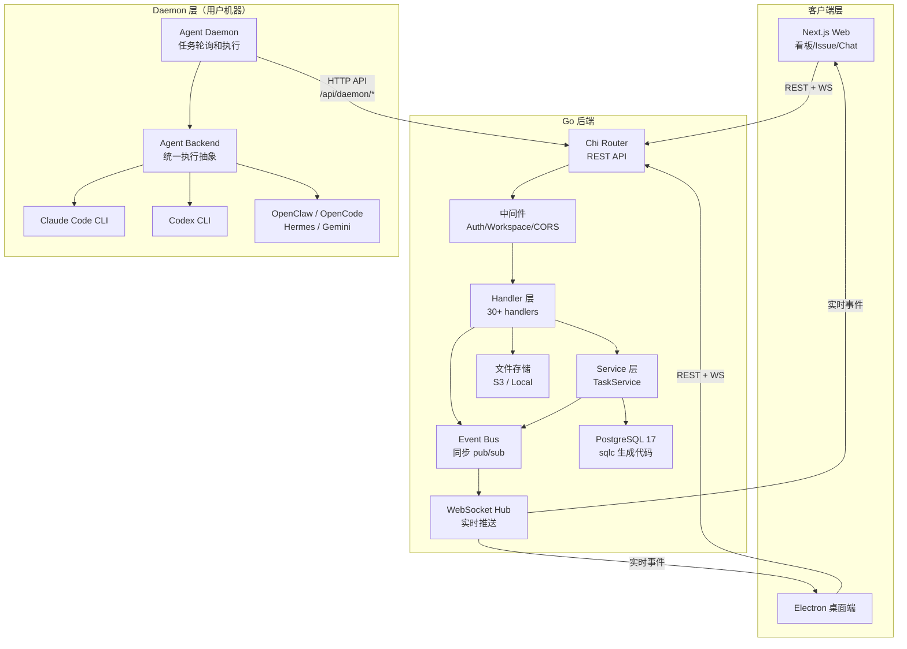
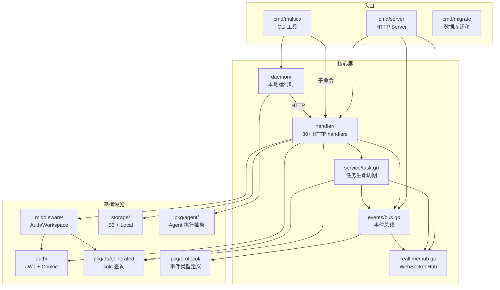
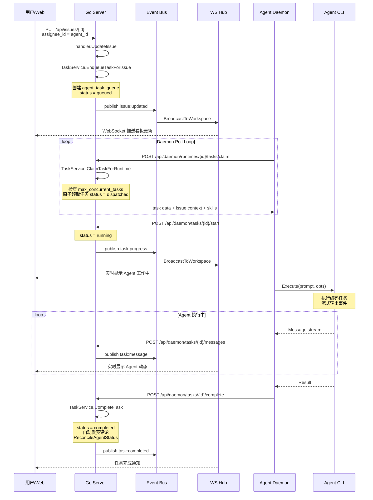
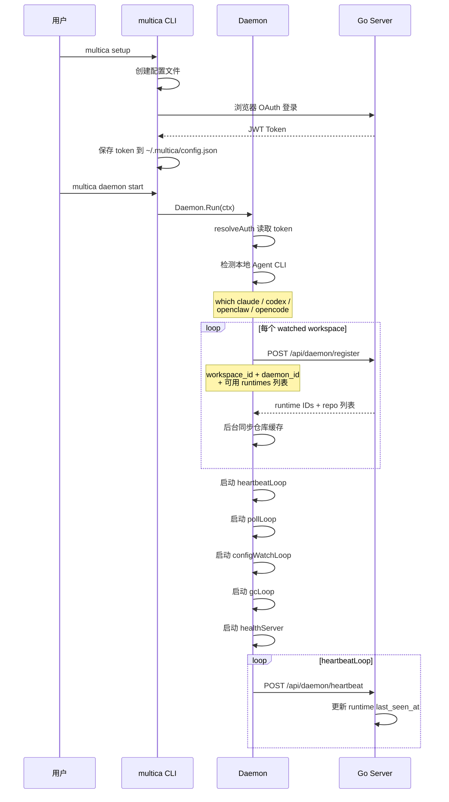

# multica 源码学习笔记

> 仓库地址：[multica](https://github.com/multica-ai/multica)
> 学习日期：2026/04/14

---

> **以下为 AI 源码分析**
>
> ### 一句话概括
>
> 一个开源的 AI Agent 管理平台，让编码 Agent（Claude Code / Codex / OpenClaw / OpenCode 等）像真正的团队成员一样，在看板上领取任务、自主执行、报告进度、积累可复用 Skill。
>
> ### 要点速览
>
> | 核心模块 | 职责 | 关键文件 |
> |----------|------|----------|
> | Go 后端 (Chi + WebSocket) | REST API + 实时推送 + 业务逻辑 | `server/cmd/server/`, `server/internal/` |
> | Agent Daemon | 本地运行时：认证、注册 runtime、轮询任务、执行 Agent CLI | `server/internal/daemon/` |
> | Agent Backend 抽象 | 统一接口封装 Claude/Codex/OpenClaw/OpenCode/Hermes/Gemini CLI | `server/pkg/agent/` |
> | CLI (multica) | 命令行工具：login/setup/daemon/issue/project 等 | `server/cmd/multica/` |
> | TaskService | 任务生命周期管理：enqueue/claim/start/complete/fail | `server/internal/service/task.go` |
> | Event Bus | 进程内同步 pub/sub，驱动 WebSocket 广播和通知 | `server/internal/events/bus.go` |
> | Realtime Hub | WebSocket 连接管理与消息分发 | `server/internal/realtime/hub.go` |
> | Next.js Web 前端 | 看板、Issue 管理、Agent 配置、Chat、Inbox | `apps/web/` |
> | Electron 桌面端 | 桌面应用（复用 web 前端） | `apps/desktop/` |
> | Shared Packages | UI 组件、视图层、核心 hooks/types | `packages/ui/`, `packages/views/`, `packages/core/` |

---

## 项目简介

Multica 是一个开源的 Managed Agents 平台，核心理念是"将编码 Agent 变为真正的团队成员"。用户可以像分配任务给同事一样，将 Issue 分配给 AI Agent。Agent 会自动领取任务、在本地或云端执行编码工作、通过 WebSocket 实时报告进度、发表评论汇报结果，并能积累可复用的 Skill。

平台支持多种 Agent 运行时（Claude Code、Codex、OpenClaw、OpenCode、Hermes、Gemini），提供统一的看板视图管理人类和 AI 团队成员的协作。支持多 Workspace 隔离、角色权限管理、自托管部署和云托管两种模式。

## 技术栈

| 类别 | 技术 |
|------|------|
| 语言 | Go 1.26+ (后端/CLI/Daemon) + TypeScript (前端) |
| 框架 | Chi (HTTP router) + Next.js 16 (App Router) + Electron |
| 构建工具 | Make + Turborepo + pnpm + GoReleaser |
| 依赖管理 | Go Modules + pnpm Workspace |
| 测试框架 | Go testing + Vitest + Playwright (E2E) |

后端核心依赖：
- `go-chi/chi` — HTTP 路由
- `gorilla/websocket` — WebSocket 实时通信
- `jackc/pgx` — PostgreSQL 驱动
- `sqlc` — 类型安全的 SQL 代码生成
- `spf13/cobra` — CLI 框架
- `golang-jwt/jwt` — JWT 认证
- `resend` — 邮件发送
- `aws-sdk-go-v2` — S3 存储

前端核心依赖：
- `next` — React SSR 框架
- `@tanstack/react-query` — 数据获取
- `shadcn/ui` — UI 组件库
- `tiptap` — 富文本编辑器

## 目录结构

```
multica/
├── server/                         # Go 后端 + CLI + Daemon
│   ├── cmd/
│   │   ├── server/                 # HTTP Server 入口
│   │   │   ├── main.go             # 启动：DB连接、EventBus、Hub、Router
│   │   │   ├── router.go           # Chi 路由定义（完整 REST API）
│   │   │   ├── listeners.go        # EventBus -> WebSocket 广播监听
│   │   │   └── runtime_sweeper.go  # 定时扫描下线 Runtime
│   │   ├── multica/                # CLI 入口 (cobra)
│   │   │   ├── main.go             # rootCmd 注册所有子命令
│   │   │   ├── cmd_daemon.go       # daemon start/stop/status
│   │   │   ├── cmd_issue.go        # issue list/create/update
│   │   │   ├── cmd_setup.go        # 一键配置+认证+启动
│   │   │   └── ...                 # agent/workspace/skill/login 等
│   │   └── migrate/                # 数据库迁移工具
│   ├── internal/
│   │   ├── daemon/                 # Agent Daemon 核心
│   │   │   ├── daemon.go           # Daemon 主循环：认证、注册、轮询
│   │   │   ├── client.go           # Daemon -> Server HTTP 客户端
│   │   │   ├── config.go           # Daemon 配置（agents、workspaces）
│   │   │   ├── gc.go               # 任务结果垃圾回收
│   │   │   ├── prompt.go           # 构建 Agent 执行 prompt
│   │   │   └── execenv/            # 执行环境管理
│   │   ├── handler/                # HTTP Handler 层（30+ 个 handler）
│   │   │   ├── handler.go          # Handler 基础设施、actor 解析
│   │   │   ├── issue.go            # Issue CRUD + 搜索
│   │   │   ├── agent.go            # Agent 管理
│   │   │   ├── daemon.go           # Daemon API（register/heartbeat/task）
│   │   │   ├── comment.go          # 评论
│   │   │   ├── chat.go             # 聊天会话
│   │   │   ├── skill.go            # Skill 管理
│   │   │   └── ...                 # inbox/project/runtime/auth 等
│   │   ├── events/bus.go           # 进程内同步 EventBus
│   │   ├── realtime/hub.go         # WebSocket Hub（workspace room）
│   │   ├── service/task.go         # TaskService 任务生命周期
│   │   ├── middleware/             # Auth、Workspace、CORS 中间件
│   │   ├── auth/                   # JWT、Cookie、CloudFront 签名
│   │   └── storage/                # 文件存储（S3 / Local）
│   ├── pkg/
│   │   ├── agent/                  # Agent Backend 统一抽象
│   │   │   ├── agent.go            # Backend 接口定义
│   │   │   ├── claude.go           # Claude Code 实现
│   │   │   ├── codex.go            # Codex 实现
│   │   │   └── ...                 # opencode/openclaw/hermes/gemini
│   │   ├── protocol/               # WebSocket 事件类型和消息结构
│   │   ├── db/generated/           # sqlc 生成的数据库查询代码
│   │   └── redact/                 # 敏感信息脱敏
│   └── migrations/                 # SQL 迁移文件（040+）
├── apps/
│   ├── web/                        # Next.js Web 前端
│   ├── desktop/                    # Electron 桌面应用
│   └── docs/                       # 文档站（Fumadocs）
├── packages/
│   ├── core/                       # 共享核心：hooks、types、API 调用
│   ├── views/                      # 共享视图组件（Issues、Agents、Chat等）
│   ├── ui/                         # shadcn/ui 组件库
│   ├── eslint-config/              # 共享 ESLint 配置
│   └── tsconfig/                   # 共享 TypeScript 配置
├── e2e/                            # Playwright E2E 测试
├── Makefile                        # 开发/构建/部署命令
├── docker-compose.yml              # 开发环境 Docker
├── docker-compose.selfhost.yml     # 自托管 Docker
└── turbo.json                      # Turborepo 管道配置
```

## 架构设计

### 整体架构

Multica 采用 **前后端分离 + 本地 Daemon 代理** 的三层架构。Go 后端负责业务逻辑和数据持久化，Next.js 前端负责 UI 展示，Daemon 运行在用户本地机器上作为 Agent 执行的运行时。三者通过 REST API + WebSocket 实时通信。

后端内部采用 **Handler -> Service -> DB (sqlc)** 的分层，辅以 **Event Bus** 实现事件驱动的实时通知。



### 核心模块

#### 1. Go 后端服务 (`server/cmd/server/`)

**职责**：HTTP 服务入口，连接数据库、初始化 Event Bus 和 WebSocket Hub，注册路由。

**关键文件与函数**：
- `main.go:main()` — 连接 PostgreSQL、创建 `events.Bus`、启动 `realtime.Hub`、注册 listener、创建 Router、启动 HTTP Server、优雅关闭
- `router.go:NewRouter()` — 完整的 Chi 路由定义，包含公共路由 (auth)、Daemon API (`/api/daemon/*`)、受保护路由 (`/api/*`) 三大区域
- `listeners.go:registerListeners()` — 将 Event Bus 事件桥接到 WebSocket 广播，区分个人事件 (inbox) 和 workspace 事件

**路由结构**：
- 公共：`/health`、`/ws`、`/auth/*`
- Daemon API：`/api/daemon/register`、`/api/daemon/heartbeat`、`/api/daemon/runtimes/{id}/tasks/*`
- 受保护 (需 JWT)：`/api/me`、`/api/workspaces/*`、`/api/issues/*`、`/api/agents/*`、`/api/skills/*`、`/api/chat/*`、`/api/inbox/*`、`/api/projects/*`

#### 2. Agent Daemon (`server/internal/daemon/`)

**职责**：在用户本地机器上运行的后台进程，负责认证、注册运行时、轮询待执行任务、调用 Agent CLI 执行、上报结果。

**关键文件与函数**：
- `daemon.go:Daemon.Run()` — 主循环：resolveAuth -> loadWatchedWorkspaces -> 启动 heartbeatLoop/pollLoop/gcLoop/configWatchLoop/usageScanLoop
- `daemon.go:Daemon.registerRuntimesForWorkspace()` — 检测本地安装的 Agent CLI，向 Server 注册 Runtime
- `client.go` — Daemon 到 Server 的 HTTP 客户端封装
- `prompt.go` — 根据 Issue 内容和 Agent Skill 构建执行 prompt
- `gc.go` — 清理已完成任务的临时文件

**生命周期**：
1. 从 CLI 配置加载认证 token
2. 读取 watched workspaces，为每个 workspace 注册 runtime（每个可用的 Agent CLI 注册一个）
3. 进入 pollLoop：定期向 Server 请求待执行任务
4. 领取任务后调用 `agent.Backend.Execute()` 执行
5. 通过 heartbeat 保持在线状态
6. 退出时 deregister 所有 runtime

#### 3. Agent Backend 抽象 (`server/pkg/agent/`)

**职责**：统一封装多种 Agent CLI 的执行接口。

**关键接口**：
- `Backend` 接口：`Execute(ctx, prompt, opts) -> (*Session, error)`
- `Session`：包含 `Messages <-chan Message`（流式事件）和 `Result <-chan Result`（最终结果）
- `Message`：统一消息类型（Text / Thinking / ToolUse / ToolResult / Status / Error / Log）
- `Result`：执行结果（Status / Output / Error / DurationMs / SessionID / Usage）

**实现**：
- `claudeBackend`：通过 `--output-format stream-json --input-format stream-json` 与 Claude Code CLI 交互，解析 streaming JSON 事件
- `codexBackend`、`openclawBackend`、`opencodeBackend`、`hermesBackend`、`geminiBackend`：各自封装对应 CLI

#### 4. TaskService (`server/internal/service/task.go`)

**职责**：管理任务的完整生命周期。

**关键方法**：
- `EnqueueTaskForIssue()` — 为 Agent 分配的 Issue 创建排队任务
- `EnqueueTaskForMention()` — 为评论中 @提及的 Agent 创建任务
- `EnqueueChatTask()` — 为 Chat 会话创建任务
- `ClaimTask()` — 原子性地为 Agent 领取下一个任务（尊重 `max_concurrent_tasks`）
- `ClaimTaskForRuntime()` — 为 Runtime 领取任务（跨多个 Agent）
- `StartTask()` — dispatched -> running
- `CompleteTask()` — 标记完成，自动发表评论，更新 Agent 状态
- `FailTask()` — 标记失败，发表错误评论
- `CancelTask()` — 取消任务
- `ReconcileAgentStatus()` — 根据运行中任务数更新 Agent 状态（idle/working）

#### 5. Event Bus (`server/internal/events/bus.go`)

**职责**：进程内同步 pub/sub 事件总线，解耦 Handler 和实时推送。

**设计**：
- `Subscribe(eventType, handler)` — 订阅特定类型事件
- `SubscribeAll(handler)` — 订阅所有事件（用于 WebSocket 广播）
- `Publish(event)` — 同步分发，先 type-specific handler，后 global handler
- 每个 handler 用 `recover()` 隔离 panic

事件类型定义在 `pkg/protocol/events.go`，涵盖 Issue / Comment / Agent / Task / Inbox / Workspace / Member / Skill / Chat / Project / Pin / Daemon 等 30+ 种事件。

#### 6. WebSocket Realtime Hub (`server/internal/realtime/hub.go`)

**职责**：管理 WebSocket 连接，按 Workspace Room 分组广播消息。

**关键能力**：
- `BroadcastToWorkspace(workspaceID, data)` — 向 workspace 内所有连接广播
- `SendToUser(userID, data)` — 向特定用户的所有连接发送（inbox 等个人事件）
- 连接认证：支持 JWT token 和 Personal Access Token
- Origin 检查：防止跨域 WebSocket 连接

### 模块依赖关系



## 核心流程

### 流程一：Issue 分配给 Agent 并执行

这是 Multica 最核心的场景——用户在看板上将 Issue 分配给 Agent，Agent 自动执行任务。



**关键逻辑**：

1. **任务入队**：Issue 的 `assignee_id` 设为 Agent 后，`TaskService.EnqueueTaskForIssue()` 创建 `agent_task_queue` 记录，关联 agent_id、runtime_id、issue_id
2. **任务领取**：Daemon 的 `pollLoop` 定期调用 `/api/daemon/runtimes/{id}/tasks/claim`，`ClaimTaskForRuntime()` 遍历所有待处理任务，为每个 agent 检查 `max_concurrent_tasks` 后原子领取
3. **Agent 执行**：Daemon 通过 `agent.Backend.Execute()` 启动 CLI 进程，传入构建好的 prompt（包含 Issue 内容、Agent 指令、Skills）
4. **实时消息**：Agent CLI 的 streaming JSON 输出被解析为 `Message`，通过 `/api/daemon/tasks/{id}/messages` 上报，经 Event Bus 推送到 WebSocket
5. **任务完成**：`CompleteTask()` 更新状态、自动将 Agent 输出发表为评论、`ReconcileAgentStatus()` 更新 Agent 状态（working -> idle）

### 流程二：Daemon 启动与 Runtime 注册

Daemon 是连接用户本地机器和 Multica Server 的桥梁。



**关键逻辑**：

1. **认证**：Daemon 从 `~/.multica/config.json` 读取 JWT token，所有后续请求都带上此 token
2. **CLI 检测**：通过 `agent.DetectVersion()` 检测本地可用的 Agent CLI，检查最低版本要求
3. **Runtime 注册**：向 Server 注册每个 workspace 的 runtime（一个 Agent CLI 对应一个 runtime），Server 返回 runtime ID
4. **多 Workspace**：Daemon 支持 watch 多个 workspace，为每个 workspace 独立注册 runtime
5. **热重载**：`configWatchLoop` 监听配置文件变化，`workspaceSyncLoop` 发现新 workspace 自动注册
6. **健康检查**：绑定本地端口防止重复启动，Server 端 `runtime_sweeper` 定期检测无心跳的 runtime 标记为 offline

## 关键设计亮点

### 1. Agent Backend 统一抽象——多 Agent 运行时支持

**问题**：不同的 Agent CLI（Claude Code、Codex、OpenCode 等）有不同的命令行接口、输入格式和输出格式。

**实现**（`server/pkg/agent/agent.go`）：定义统一的 `Backend` 接口，每种 Agent CLI 实现为独立的 backend（`claudeBackend`、`codexBackend` 等）。所有 backend 都返回 `*Session`，包含统一的 `Message` 流和 `Result`。

```go
type Backend interface {
    Execute(ctx context.Context, prompt string, opts ExecOptions) (*Session, error)
}
```

以 Claude Code 为例（`claude.go`），通过 `--output-format stream-json --input-format stream-json --permission-mode bypassPermissions` 启动 CLI，解析 streaming JSON 事件并映射为统一的 `Message` 类型。

**设计理由**：Daemon 的 pollLoop 无需关心具体是哪种 Agent CLI，只需调用 `Backend.Execute()`。新增 Agent 只需实现 `Backend` 接口并在 `New()` 工厂方法中注册。

### 2. Event Bus 驱动实时推送——解耦业务逻辑和通知

**问题**：Issue 更新、Agent 状态变更、评论创建等操作需要实时推送到所有前端，如果在每个 Handler 中手动广播，代码耦合严重。

**实现**（`server/internal/events/bus.go` + `server/cmd/server/listeners.go`）：进程内同步 Event Bus + WebSocket Hub 组合。Handler 和 Service 通过 `bus.Publish()` 发布领域事件，`listeners.go` 中的 `SubscribeAll` 将非个人事件广播到 workspace room，个人事件（inbox）通过 `SendToUser` 精确投递。

**设计理由**：Event Bus 是同步的（非消息队列），保证事件顺序和注册顺序的可控性——例如 subscriber listener 必须在 notification listener 之前注册，确保订阅者先写入再通知。

### 3. 任务生命周期状态机——原子性并发控制

**问题**：多个 Daemon 可能同时为同一个 Agent 领取任务，需要防止并发问题和超出 Agent 最大并发数。

**实现**（`server/internal/service/task.go`）：`ClaimTask()` 先查询 Agent 的 `max_concurrent_tasks`，再调用 sqlc 生成的 `ClaimAgentTask()`（底层是带有 `WHERE status = 'queued' ... FOR UPDATE SKIP LOCKED` 的 SQL），实现原子领取。任务状态机：`queued -> dispatched -> running -> completed/failed/cancelled`。

**设计理由**：利用 PostgreSQL 的 `SKIP LOCKED` 实现无锁并发领取，避免 Daemon 间的竞争。`ReconcileAgentStatus()` 在每次任务状态变更后自动更新 Agent 状态。

### 4. Daemon 本地执行——零信任的混合架构

**问题**：Agent 编码需要访问本地文件系统和 Git 仓库，不能将代码上传到云端执行。

**实现**：Daemon 运行在用户机器上，通过 HTTP API 向 Server 注册 Runtime、轮询任务、上报结果。Agent CLI 在本地直接执行，操作用户的代码仓库。Daemon 自行管理仓库缓存（`repocache`），在后台同步 workspace 配置的仓库。

**设计理由**：代码不离开用户机器，Agent 执行环境完全由用户控制。Server 只负责任务调度和状态管理，是一个"管理平面"而非"执行平面"。

### 5. Monorepo + 跨平台共享——Web/Desktop 代码复用

**问题**：Web 前端和 Desktop 应用有大量相同的 UI 和业务逻辑，如何避免重复代码。

**实现**：采用 pnpm Workspace + Turborepo 的 monorepo 结构。`packages/core/` 提供共享 hooks 和 types，`packages/views/` 提供完整的视图组件（Issues、Agents、Chat、Inbox 等），`packages/ui/` 基于 shadcn/ui 提供基础 UI 组件。Web（`apps/web/`）和 Desktop（`apps/desktop/`）都引用这些共享包。

**设计理由**：视图层和业务逻辑只写一次，Web 和 Desktop 各自只需处理平台特定的路由和 shell。新增功能自动在两个平台同时可用。
