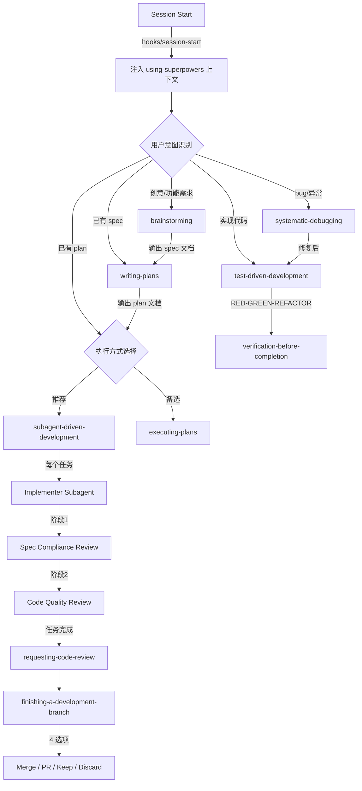
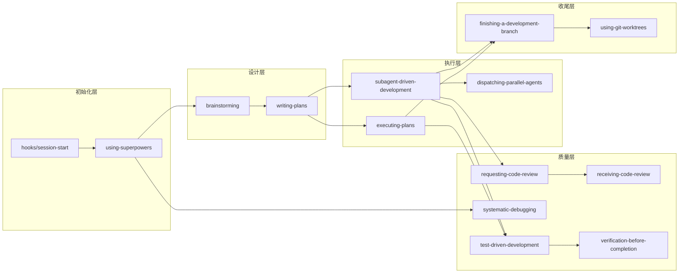
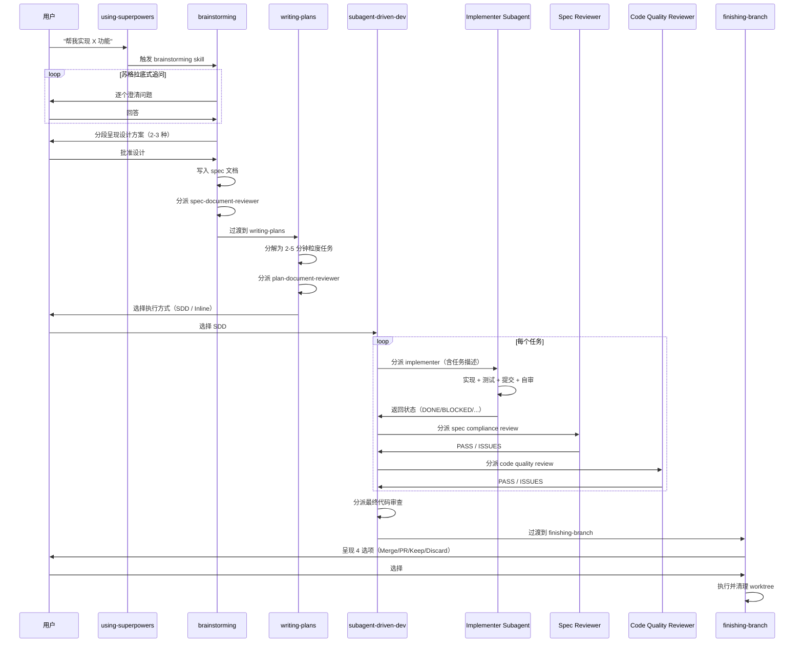
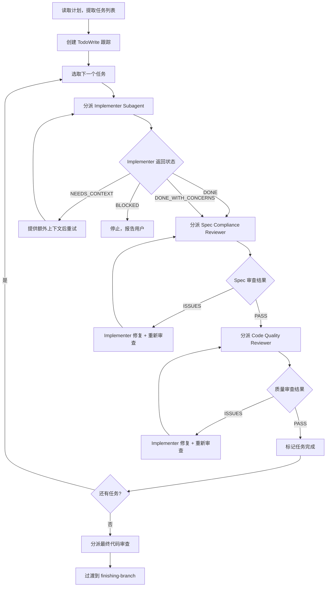

# superpowers 源码学习笔记

> 仓库地址：[superpowers](https://github.com/obra/superpowers)
> 学习日期：2026-03-22

---

> **以下为 AI 源码分析**
>
> ### 一句话概括
>
> Superpowers 是一套面向 AI 编程代理的完整软件开发工作流框架，通过 14 个可组合的 "skills" 将创意→设计→计划→实现→审查→交付全流程自动化。
>
> ### 要点速览
>
> | 核心模块 | 职责 | 关键文件 |
> |---------|------|---------|
> | brainstorming | 创意→设计文档的苏格拉底式引导 | `skills/brainstorming/SKILL.md` |
> | writing-plans | 设计→可执行计划的分解 | `skills/writing-plans/SKILL.md` |
> | subagent-driven-development | 子代理驱动的任务实现+双阶段审查 | `skills/subagent-driven-development/SKILL.md` |
> | test-driven-development | RED-GREEN-REFACTOR 强制循环 | `skills/test-driven-development/SKILL.md` |
> | systematic-debugging | 4 阶段根因分析调试 | `skills/systematic-debugging/SKILL.md` |
> | hooks/session-start | Session 初始化，注入 skills 上下文 | `hooks/session-start` |
> | agents/code-reviewer | 5 维度代码审查 agent | `agents/code-reviewer.md` |

---

## 项目简介

Superpowers 是为 AI 编程代理（Claude Code、Cursor、Codex、OpenCode、Gemini CLI）打造的完整软件开发工作流框架。它不是单一工具，而是一组可组合的 "skills"（技能），让代理在接到开发任务时不会直接写代码，而是按照 **创意头脑风暴 → 设计文档 → 实现计划 → 子代理驱动开发 → 代码审查 → 分支完成** 的标准流程工作。核心价值在于将 AI 代理从"冲动编码"转变为"流程化工程"，强调 TDD、YAGNI、DRY 原则，通过多阶段审查保障代码质量。

## 技术栈

| 类别 | 技术 |
|------|------|
| 语言 | Markdown（skill 定义）、Bash（hooks/scripts）、JavaScript（辅助脚本） |
| 框架 | Claude Code Plugin System / Cursor Plugin / Gemini Extension |
| 构建工具 | Shell scripts（无编译构建） |
| 依赖管理 | npm（package.json，无生产依赖） |
| 测试框架 | Shell-based skill triggering tests + Python token 分析 |

## 目录结构

```
superpowers/
├── skills/                          # 核心：14 个可组合技能
│   ├── brainstorming/               #   创意→设计引导
│   │   ├── SKILL.md                 #     主技能文件
│   │   ├── visual-companion.md      #     可视化头脑风暴指南
│   │   ├── spec-document-reviewer-prompt.md  # spec 审查 prompt
│   │   └── scripts/                 #     浏览器可视化服务
│   ├── writing-plans/               #   设计→计划分解
│   │   ├── SKILL.md
│   │   └── plan-document-reviewer-prompt.md  # 计划审查 prompt
│   ├── subagent-driven-development/ #   子代理驱动开发（核心引擎）
│   │   ├── SKILL.md
│   │   ├── implementer-prompt.md    #     实现者 prompt
│   │   ├── spec-reviewer-prompt.md  #     spec 合规审查 prompt
│   │   └── code-quality-reviewer-prompt.md   # 代码质量审查 prompt
│   ├── executing-plans/             #   计划内联执行（SDD 的简化版）
│   ├── test-driven-development/     #   TDD 强制循环
│   │   ├── SKILL.md
│   │   └── testing-anti-patterns.md #     反模式参考
│   ├── systematic-debugging/        #   4 阶段系统化调试
│   │   ├── SKILL.md
│   │   ├── root-cause-tracing.md    #     根因追踪技术
│   │   ├── defense-in-depth.md      #     纵深防御
│   │   └── condition-based-waiting.md #   条件等待
│   ├── using-git-worktrees/         #   Git worktree 隔离开发
│   ├── finishing-a-development-branch/ # 分支完成决策
│   ├── requesting-code-review/      #   请求代码审查
│   ├── receiving-code-review/       #   接收审查反馈
│   ├── dispatching-parallel-agents/ #   并行子代理调度
│   ├── verification-before-completion/ # 完成前强制验证
│   ├── writing-skills/              #   技能开发元技能
│   └── using-superpowers/           #   框架使用总入口
├── hooks/                           # Session 生命周期 hooks
│   ├── hooks.json                   #   hook 事件配置
│   ├── session-start                #   启动脚本（注入 skills 上下文）
│   └── run-hook.cmd                 #   Windows 兼容包装
├── commands/                        # 旧版命令（已废弃，指向 skills）
│   ├── brainstorm.md
│   ├── write-plan.md
│   └── execute-plan.md
├── agents/                          # Agent 定义
│   └── code-reviewer.md             #   5 维度代码审查 agent
├── tests/                           # 测试套件
│   ├── skill-triggering/            #   技能触发测试
│   ├── explicit-skill-requests/     #   显式技能请求测试
│   ├── subagent-driven-dev/         #   SDD 集成测试
│   └── claude-code/                 #   Claude Code 集成测试
├── docs/                            # 设计文档与计划
├── .claude-plugin/plugin.json       # Claude Code 插件配置
├── gemini-extension.json            # Gemini CLI 扩展配置
└── package.json                     # npm 包声明（v5.0.4）
```

## 架构设计

### 整体架构

Superpowers 采用 **事件驱动 + 技能调度** 的架构模式。Session 启动时通过 hooks 注入框架上下文，`using-superpowers` 作为技能调度器，根据用户意图自动匹配并激活相应技能。技能之间通过明确的前置/后续关系形成工作流链，而非硬编码的状态机。



### 核心模块

#### 1. 技能调度器 — `using-superpowers`

**职责：** 框架入口，所有用户交互的第一层过滤器

- **核心文件：** `skills/using-superpowers/SKILL.md`
- **关键逻辑：** 即使只有 1% 的可能性某技能适用，也**必须调用**该技能（非可选）
- **优先级：** 流程技能（brainstorming、debugging）优先于实现技能
- **与其他模块关系：** 所有技能的上游调度器，通过 `session-start` hook 在每次会话开始时注入

#### 2. 创意引导 — `brainstorming`

**职责：** 将模糊需求转化为结构化设计文档

- **核心文件：** `skills/brainstorming/SKILL.md`、`visual-companion.md`、`spec-document-reviewer-prompt.md`
- **关键接口：** 输出 `docs/superpowers/specs/YYYY-MM-DD-<topic>-design.md`
- **硬门槛：** 设计未获用户批准前，**禁止任何实现工作**
- **设计模式：** Socratic method（苏格拉底式追问），每次只问一个问题
- **子代理审查：** 通过 `spec-document-reviewer-prompt.md` 分派审查子代理，最多 3 轮迭代

#### 3. 计划编写 — `writing-plans`

**职责：** 将设计文档分解为可执行的工程任务列表

- **核心文件：** `skills/writing-plans/SKILL.md`、`plan-document-reviewer-prompt.md`
- **关键设计：** 每个任务 2-5 分钟，包含精确文件路径、完整代码、验证命令
- **任务粒度原则：** 自包含（"写完整实现"而非"添加验证"）
- **子代理审查：** 通过 `plan-document-reviewer-prompt.md` 验证计划可构建性

#### 4. 子代理驱动开发 — `subagent-driven-development`

**职责：** 框架核心引擎，通过子代理执行计划并进行双阶段审查

- **核心文件：** `SKILL.md`、`implementer-prompt.md`、`spec-reviewer-prompt.md`、`code-quality-reviewer-prompt.md`
- **关键流程：** 每个任务经历 Implement → Spec Review → Code Quality Review 三步
- **子代理状态模型：** `DONE` / `DONE_WITH_CONCERNS` / `NEEDS_CONTEXT` / `BLOCKED`
- **模型选择策略：** 机械任务用廉价模型 → 集成用标准模型 → 架构用最能干模型
- **铁律：** 绝不并行分派多个 implementer、绝不跳过审查、绝不让子代理读计划文件

#### 5. TDD 引擎 — `test-driven-development`

**职责：** 强制 RED-GREEN-REFACTOR 循环

- **核心文件：** `skills/test-driven-development/SKILL.md`、`testing-anti-patterns.md`
- **铁律：** NO PRODUCTION CODE WITHOUT A FAILING TEST FIRST（无例外）
- **验证：** 每个阶段（RED / GREEN）都必须运行测试并观察输出
- **反驳系统：** 内置常见理由反驳表（太简单/先写后测/手动测试…）

#### 6. 系统化调试 — `systematic-debugging`

**职责：** 4 阶段根因分析，替代 ad-hoc 猜测式修复

- **核心文件：** `SKILL.md`、`root-cause-tracing.md`、`defense-in-depth.md`、`condition-based-waiting.md`
- **4 阶段：** 根因调查 → 模式分析 → 假设测试 → 实现修复
- **铁律：** NO FIXES WITHOUT ROOT CAUSE INVESTIGATION FIRST
- **升级条件：** ≥3 次修复失败时停止并质疑架构

#### 7. 代码审查 — `requesting-code-review` + `receiving-code-review`

**职责：** 双向代码审查流程

- **核心文件：** `skills/requesting-code-review/SKILL.md`、`code-reviewer.md`、`agents/code-reviewer.md`
- **审查维度（5 个）：** 计划对齐、代码质量、架构设计、文档规范、问题分类
- **问题分级：** Critical（阻塞）→ Important（修复后继续）→ Suggestions（记录）
- **接收审查原则：** 禁止表演式同意，支持有理由的技术推回

### 模块依赖关系



## 核心流程

### 流程一：完整开发工作流（Design → Ship）

这是 Superpowers 最核心的端到端流程，从用户提出需求到代码合并。



**关键逻辑说明：**

1. **brainstorming 阶段**：不急于编码，通过追问理解真实需求。每次只问一个问题，避免信息过载。设计方案分段呈现（而非一次性长文），确保用户真正阅读
2. **writing-plans 阶段**：任务粒度控制在 2-5 分钟，每个任务包含完整代码而非描述性指令。目标是让"一个无经验的初级工程师"也能照做
3. **SDD 执行阶段**：每个任务分派独立子代理（保持 context 清洁），双阶段审查确保 spec 合规性和代码质量。子代理返回 4 种状态，BLOCKED 时立即停止而非猜测
4. **finishing 阶段**：强制验证测试通过后才呈现选项，"丢弃"选项需要额外确认

### 流程二：子代理驱动开发（SDD）任务执行

SDD 是框架最核心的执行引擎，其单个任务的执行流程值得深入分析。



**关键逻辑说明：**

1. **Implementer Prompt 设计**：5 步流程（实现→测试→验证→提交→自审→报告），强调 TDD 和最小实现
2. **双阶段审查分离**：先验证 "做对了没有"（spec compliance），再验证 "做好了没有"（code quality）。两个审查者互不知晓对方结果
3. **状态驱动控制流**：4 种状态覆盖所有情况，避免子代理卡死或静默失败
4. **Context 隔离**：每个子代理是全新实例，只接收当前任务描述（非完整计划文件），防止 context 污染

## 关键设计亮点

### 1. Prompt-as-Code 架构

**解决的问题：** 如何让 AI 代理稳定遵循复杂工作流，而非随机发挥

**实现方式：** 每个 skill 是一个 Markdown 文件（`SKILL.md`），通过 YAML frontmatter 声明元数据（name、description），正文是详尽的行为规范。关键在于：
- **铁律（Iron Rules）**：如 `NO PRODUCTION CODE WITHOUT A FAILING TEST FIRST`，用全大写 + 粗体强调不可违反的规则
- **反驳表（Excuse Refutation）**：预判代理可能找的借口并提前反驳，如 TDD skill 中列举了 "太简单不需要测试" 等常见借口及其驳斥
- **负面列表（Never Do）**：明确列出禁止行为，比正面指令更有效

**设计原因：** LLM 倾向于走捷径，纯正面指令容易被"合理化"绕过。铁律 + 反驳表 + 负面列表形成三层约束，大幅降低代理偏离工作流的概率。

**关键文件：** `skills/test-driven-development/SKILL.md`（铁律示范）、`skills/writing-skills/SKILL.md`（元技能：如何写好 skill prompt）

### 2. 双阶段审查的职责分离

**解决的问题：** 单一审查者容易"顾此失彼"，同时检查 spec 合规和代码质量效果差

**实现方式：** SDD 中每个任务经历两个独立审查子代理：
- **Spec Reviewer**（`spec-reviewer-prompt.md`）：只关注"做对了没有"——遗漏需求、多余功能、理解偏差
- **Code Quality Reviewer**（`code-quality-reviewer-prompt.md`）：只关注"做好了没有"——文件职责、单元独立性、代码增长

两者独立运行、互不知晓对方结果，审查范围互斥。

**设计原因：** 参考软件工程中的"关注点分离"原则。单一审查者在检查 spec 合规时会不自觉忽略代码质量问题（认知负荷），拆分后每个审查者聚焦单一维度，审查深度显著提升。

**关键文件：** `skills/subagent-driven-development/spec-reviewer-prompt.md`、`code-quality-reviewer-prompt.md`

### 3. Session-Start Hook 的上下文注入

**解决的问题：** 如何在不修改 AI 代理底层的情况下，让每次会话自动具备 Superpowers 能力

**实现方式：** 通过 `hooks/hooks.json` 配置 `SessionStart` 事件，触发 `hooks/session-start` 脚本。该脚本：
1. 检测 legacy 目录并发出迁移警告
2. 读取 `using-superpowers/SKILL.md` 的完整内容
3. 以 JSON 格式注入到 session context 中

这意味着每次新会话启动时，代理自动获得技能调度器的完整指令，无需用户手动触发。

**设计原因：** 插件级别的集成需要"零摩擦"——用户安装后无需任何额外操作。Hook 机制是各平台（Claude Code、Cursor、Gemini）共有的扩展点，选择它作为注入方式最大化了跨平台兼容性。

**关键文件：** `hooks/hooks.json`、`hooks/session-start`

### 4. 技能的 TDD 开发方法论（元技能）

**解决的问题：** 如何保证 skill prompt 的质量——写出的指令能否真的让代理正确行为

**实现方式：** `writing-skills` skill 将 TDD 理念应用于 prompt 开发：
- **RED**：在无 skill 的情况下运行压力场景，记录 baseline（代理会犯什么错）
- **GREEN**：编写 skill，运行相同场景，验证代理遵守指令
- **REFACTOR**：找新漏洞、添加显式计数器、重新测试

同时提出 **CSO（Claude Search Optimization）** 概念：skill 的 description 字段不是工作流摘要，而是"何时使用"的关键词优化，类似 SEO 但面向 AI 技能检索。

**设计原因：** Prompt engineering 本质上是软件开发——需要测试、迭代、回归验证。没有测试的 prompt 就像没有测试的代码，看起来能用但无法保证在边界情况下的行为。

**关键文件：** `skills/writing-skills/SKILL.md`、`skills/writing-skills/persuasion-principles.md`

### 5. 多平台插件化适配

**解决的问题：** 同一套 skills 需要在 5 个不同平台（Claude Code、Cursor、Codex、OpenCode、Gemini CLI）上工作

**实现方式：** 采用"核心不变 + 适配层薄"的策略：
- 核心资产是 `skills/` 目录下的 Markdown 文件，平台无关
- 每个平台有自己的适配配置：`.claude-plugin/plugin.json`、`.cursor-plugin/plugin.json`、`gemini-extension.json`
- `hooks/session-start` 通过 shell 脚本注入上下文，兼容所有支持 hook 的平台
- `commands/` 下的旧版命令标记为 Deprecated，指向新的 skills 系统

**设计原因：** Markdown 是最大公约数——所有 AI 平台都能读取和理解。将 skill 定义与平台配置解耦，新增平台支持只需添加薄适配层，核心 skills 零修改。

**关键文件：** `.claude-plugin/plugin.json`、`gemini-extension.json`、`hooks/session-start`
