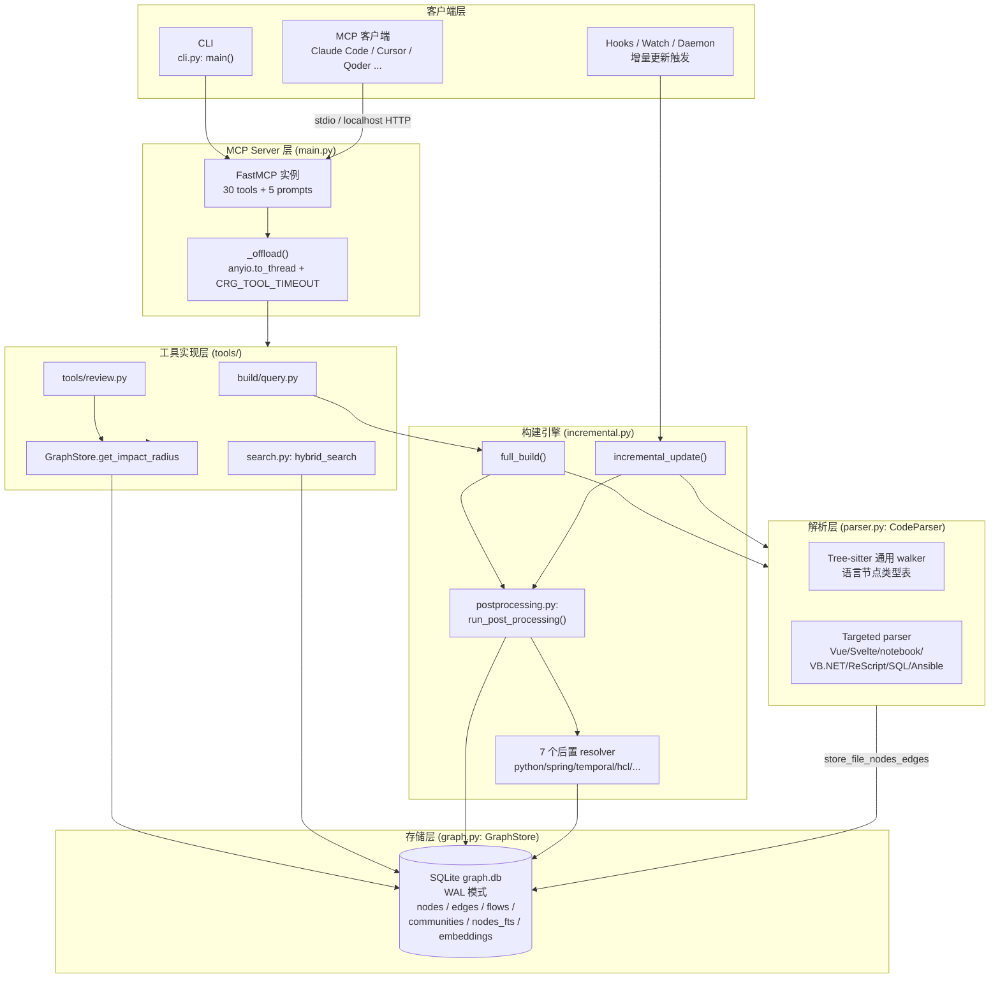
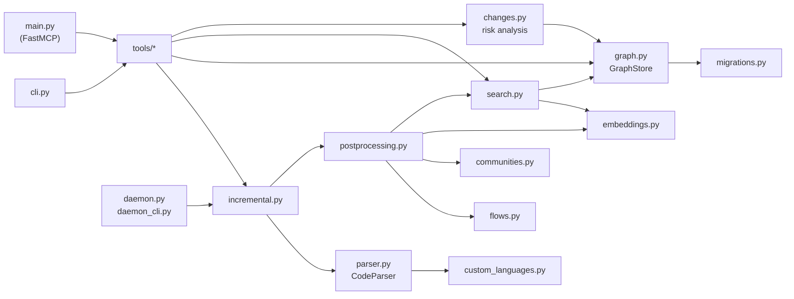
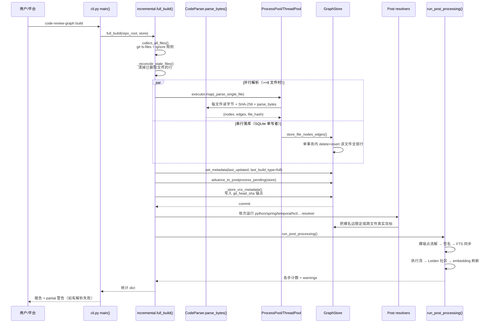
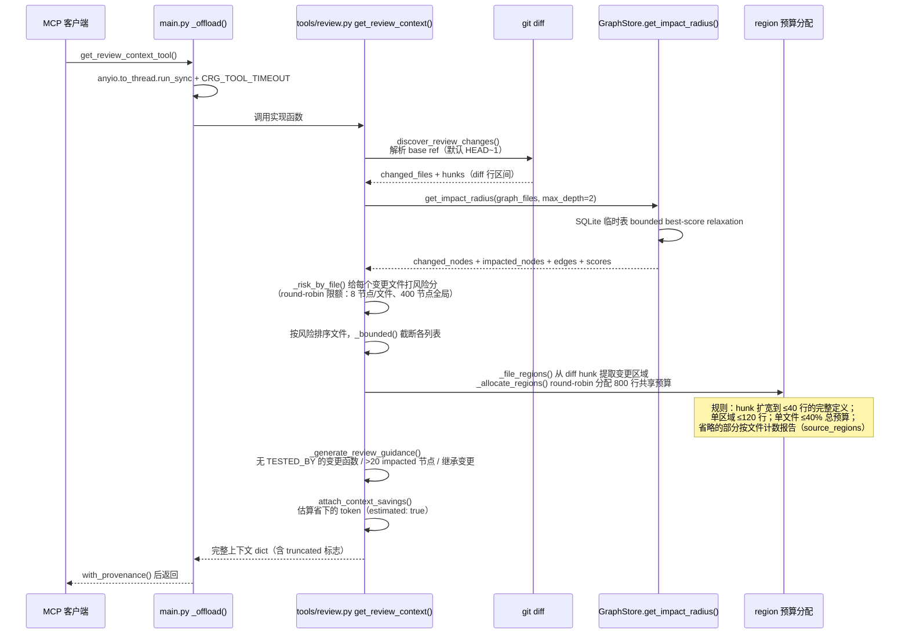

# code-review-graph 源码学习笔记

> 仓库地址：[code-review-graph](https://github.com/tirth8205/code-review-graph)
> 学习日期：2026-10-01（分析版本 v2.3.9）

---

> **以下为 AI 源码分析**
>
> ### 一句话概括
>
> 一个本地优先的代码知识图谱：用 Tree-sitter 把代码库解析成"函数/类/调用/继承"的图存进 SQLite，增量维护，再通过 MCP 把"一个变更到底波及哪些文件"的精准上下文喂给 AI 编码工具，把 review 时的 token 消耗降低约 65 倍。
>
> ### 要点速览
>
> | 模块 | 职责 | 关键文件 |
> |------|------|---------|
> | 解析器 | Tree-sitter 多语言 AST 提取节点/边 + 无文法语言的 fallback 解析 | `code_review_graph/parser.py`（19k 行） |
> | 图存储 | SQLite WAL 单库存储节点/边/FTS/embeddings，schema v13 | `code_review_graph/graph.py`、`migrations.py` |
> | 构建引擎 | 全量构建、增量更新（git diff + 依赖闭包 + hash 比对） | `code_review_graph/incremental.py` |
> | 后处理 | 裸调用名消解、签名、FTS 同步、执行流、社区、embedding | `code_review_graph/postprocessing.py` + 7 个 `*_resolver.py` |
> | MCP server | FastMCP 实现 30 tools + 5 prompts，stdio/HTTP 双传输 | `code_review_graph/main.py`、`tools/` |
> | CLI | 30+ 子命令（build/update/watch/serve/impact/review 等） | `code_review_graph/cli.py` |
> | 平台集成 | 一条命令向 16 个 AI 编码平台写 MCP 配置 + hooks + skills | `code_review_graph/skills.py` |
> | 守护进程 | 多仓库 watchdog 监听 + flock 单例 + 增量更新 | `code_review_graph/daemon.py` |
> | 周边交付物 | VSCode 扩展、GitHub composite Action、7 个 Agent Skills | `code-review-graph-vscode/`、`action.yml`、`skills/` |

---

## 项目简介

AI 编码工具在 review 一个变更时，往往要重读代码库的一大片文件来理解上下文（flask 全库约 14 万 token）。`code-review-graph` 的答案是：先用 Tree-sitter 把整个代码库解析成结构图（节点 = 文件/函数/类，边 = 调用/继承/导入/测试覆盖），存进一个 SQLite 文件 `.code-review-graph/graph.db`，之后通过 git hook、watch 模式增量维护；review 时图被反向查询——沿着边找出"谁调用了改动的函数、谁导入了改动的文件、哪些测试覆盖了它"——只返回助手需要读的最小文件集（约 2-3k token）。查询通过 MCP 暴露给 Claude Code、Cursor、Qoder 等 16 个客户端，同时提供完整 CLI。核心价值主张是"结构化上下文 + 精准 blast radius 分析"，官方基准：每问题 token 减少中位数约 63x，impact F1 约 0.69。

## 技术栈

| 类别 | 技术 |
|------|------|
| 语言 | Python 3.10+（核心包约 55k 行）；VSCode 扩展为 TypeScript |
| 框架 | FastMCP（MCP server）、Tree-sitter + tree-sitter-language-pack（解析） |
| 存储 | SQLite（WAL 模式，FTS5 全文索引 + 自定义 embedding 表） |
| 图分析 | NetworkX（legacy BFS、模块依赖图）、igraph（Leiden 社区检测，可选） |
| 文件监听 | watchdog（watch 模式与 daemon） |
| 构建工具 | hatchling（wheel 打包时把 `skills/` 强制包含为 `_bundled_skills`） |
| 依赖管理 | uv（`uv.lock`）+ pip/pipx 安装；MCP server 条目自动适配 poetry/uv/uvx |
| 测试框架 | pytest（15+ 自定义 marker：e2e/browser/action_e2e/determinism/concurrency 等） |
| 可选依赖 | sentence-transformers + numpy（本地 embedding）、google-genai、ollama（wiki） |

## 目录结构

```text
code-review-graph/
├── code_review_graph/          # 核心 Python 包（CLI + MCP + 引擎）
│   ├── cli.py                  # CLI 入口，main() + 30+ 子命令
│   ├── main.py                 # MCP server 入口（FastMCP，30 tools + 5 prompts）
│   ├── parser.py               # Tree-sitter 多语言解析器（19,039 行，最大模块）
│   ├── graph.py                # GraphStore：SQLite 存储/查询/impact radius
│   ├── migrations.py           # 版本化 schema 迁移（当前 v13）
│   ├── incremental.py          # 文件收集、变更检测、全量/增量构建、watch
│   ├── postprocessing.py       # 构建后六步处理管线
│   ├── *_resolver.py           # 跨文件消解（python/jedi/spring/temporal/hcl/...）
│   ├── tools/                  # MCP tool 实现，按域拆 12 个文件
│   ├── skills.py               # 16 平台的安装/卸载配置生成
│   ├── daemon.py / daemon_cli.py  # 多仓库 watch 守护进程
│   ├── search.py               # FTS5 BM25 + 向量 RRF 混合搜索
│   ├── embeddings.py           # embedding 提供者（本地/Google）
│   ├── flows.py / communities.py  # 执行流检测、Leiden 社区
│   ├── changes.py / refactor.py / analysis.py  # 变更风险分析、重构建议、hub/bridge/gap
│   └── visualization.py / exports.py / wiki.py  # D3 可视化、多格式导出、wiki 生成
├── code-review-graph-vscode/   # VSCode 扩展（TypeScript + esbuild）
├── skills/                     # 7 个 Agent Skills（build-graph/review-changes/...）
├── hooks/                      # session-start hook（供各平台注入）
├── evaluate/                   # 评估框架与结果 CSV
├── action.yml                  # GitHub composite Action（PR 风险评审）
├── docs/                       # architecture.md / schema.md / COMMANDS.md 等
└── tests/                      # 大型测试套件（fixtures + 多 marker 分层）
```

## 架构设计

### 整体架构

整体是**单进程分层管线 + 单文件存储**的架构：解析层把源码变成 (nodes, edges)，存储层落 SQLite，构建层管增量，查询层做 impact/search，最上面 CLI 与 MCP 两个入口共享同一套工具实现。没有服务端、没有外部数据库、没有网络依赖（除可选的 embedding API）——"local-first" 是刻意的定位：源码不出本机，GitHub Action 模式下也只在 CI runner 上跑。



要点：

- **两个入口共享工具层**：CLI 的 `build/impact/review` 子命令和 MCP 的 `build_or_update_graph_tool/get_impact_radius_tool` 调用同一批函数（`tools/` 目录），CLI 只是包了 argparse 输出格式。这避免了双入口行为漂移。
- **存储即边界**：所有模块只通过 `GraphStore` 读写 SQLite，WAL 模式保证读不被写阻塞（hook 触发的更新与 MCP 查询并发安全）。
- **单写者纪律**：并行解析只在 parse 阶段并行，落库统一走 `store_file_nodes_edges()`（graph.py:990），在单个事务里整体替换一个文件的行——这是 SQLite 单写者模型下的正确姿势。

### 核心模块

#### 1. 解析器 `parser.py`（CodeParser，parser.py:2935）

职责：把一个文件的字节流变成 `list[NodeInfo] + list[EdgeInfo]`。

- **入口 `parse_bytes()`（parser.py:3161）**：刻意接收已读入的字节而不是路径——调用方反正要算 SHA-256，同一段字节既做 hash 又做解析，消除 TOCTOU 间隙（issue #746），保证"存储的 hash 永远描述被解析的字节"。
- **语言分发 `_extract_bytes()`（parser.py:3184）**：先 `detect_language()`（扩展名 + shebang + 内容嗅探），然后两级分发：
  - **Targeted parser**：Vue/Svelte SFC、Jupyter/Databricks notebook、VB.NET、ReScript、SQL、Ansible YAML、Spring config、Blade 模板——这些要么没有 bundled 文法，要么是"代码 + 标记"的混合格式，各写专用提取器（例如 `_parse_vue()` 挖出 `<script>` 块再交给 JS/TS 文法）。
  - **Tree-sitter 通用 walker**：其余 30+ 语言共用一个 walker，行为由**语言节点类型表**驱动（`_CLASS_TYPES`、`_FUNCTION_TYPES`、`_IMPORT_TYPES`、`_CALL_TYPES` 等按语言映射）。不用 tree-sitter query 文件，是刻意选择——各文法 query 语法版本漂移大，直接走树 + 类型表更稳。
- **预扫描再遍历**：先 `_collect_file_scope()` 建立 import 映射和本文件定义名集合，再收集 typed call 目标，最后才 walk 树——call 边的目标限定名靠这两张表推导。
- **测试判定三层**（`_is_test_function`，parser.py:2351）：命名模式（`^test_`/`_test$` 等）→ 测试文件路径 + 测试运行器调用名（`describe`/`it`）→ 测试注解（JUnit `@Test`、Rust `#[test]`）。且 `parse_bytes()` 在最后把测试文件里**所有**节点标 `is_test`（parser.py:3179），防止测试夹具类被报告为"未测试的生产代码"（issue #1014）。
- **用户可扩展语言**：`.code-review-graph/languages.toml` 声明扩展名 → grammar + 四类节点类型，通用 walker 直接消费（`custom_languages.py`）。

#### 2. 图存储 `graph.py`（GraphStore，graph.py:691）

职责：SQLite 上的图数据库 + 查询引擎。

- **节点标识**：qualified name——文件节点是绝对路径，符号是 `path::name`，方法是 `path::Class.method`。朴素但够用：一条 `(source_qualified, target_qualified)` 边表 + 两列索引就是图。
- **写入**：`_replace_file_data()`（graph.py:1017）在**一个事务**里 delete + insert 一个文件的全部行并写入 file_hash，原子性保证"一个文件要么是旧版本要么是新版本，不存在半解析状态"。
- **impact radius**：`get_impact_radius_sql()`（graph.py:2792）——见下文亮点一。
- **边带元数据**：每条边有 `confidence`/`confidence_tier`，`CALLS`/`REFERENCES` 边有 `target_resolution`（裸名 or 已限定），查询时可按解析状态过滤，区分"确定的关系"和"推断的关系"。
- **健壮性**：打开数据库时校验 schema 兼容性与可读性（`_assert_usable_database`），损坏库抛 `CorruptGraphDatabaseError` 而不是让 SQLite 错误裸奔；migrations.py 维护 v1→v13 的顺序迁移。

#### 3. 构建引擎 `incremental.py`

职责：决定"哪些文件需要解析"以及把管线跑完。

- **`full_build()`（incremental.py:1744）**：`collect_all_files()`（`git ls-files` + `.code-review-graphignore`，天然跳过 untracked/ignored）→ 并行解析 → 串行落库 → 写 VCS anchor（`_store_vcs_metadata`）→ 跑 7 个跨文件 resolver。执行器自动选择：CLI 场景用进程池，MCP stdio 场景用线程池——进程池在 stdio server 下会有管道句柄继承死锁问题（issues #46/#136）。
- **`incremental_update()`（incremental.py:1889）**：`get_changed_files()`（git diff）∪ 内容 hash 不匹配的文件 → `find_dependents()` 沿 `IMPORTS_FROM`/`CALLS`/`INHERITS`/`IMPLEMENTS` 边找依赖者（2 跳、上限 500 文件）→ hash 相同的直接跳过 → 只重解析真正变化的文件。3000 文件的仓库改 2 个文件，重索引约 2.5 秒（其中 1.4 秒是进程启动）。
- **错误分类**：解析失败的文件进 `errors` 列表保留旧行；**写失败**则让异常向上传播终止构建——因为 VCS anchor 只在完整构建后写入，失败不写 anchor，下次运行会自动重建（详见亮点三）。

#### 4. 后处理管线 `postprocessing.py` + resolvers

`run_post_processing()`（postprocessing.py:32）是六步顺序管线，每步非致命（失败记 warning，不丢构建结果）：

1. 解析裸调用名端点（`resolve_bare_call_targets`）+ C++ 作用域边
2. 计算人类可读签名（Function/Test/Class）
3. FTS 索引同步（增量更新只重写变更文件的条目）
4. 执行流追踪（flows.py：入口 → 调用链 → criticality 评分）
5. Leiden 社区检测（igraph，缺依赖时退化到文件级 fallback）
6. embedding 刷新（有 provider 时）

7 个 resolver（`python_resolver`/`jedi_resolver`/`spring_resolver`/`event_resolver`/`temporal_resolver`/`hcl_resolver`/`scoped_resolver`/...）在构建后把解析阶段只能产出"裸名"的边限定成跨文件的真实目标——例如 Spring 的 `@Autowired` 注入边、Kafka topic 的 CONSUMES/PRODUCES 边、Temporal workflow stub 的调用边。

#### 5. MCP server `main.py` + `tools/`

`main.py` 用 FastMCP 注册 30 个 tool 和 5 个 prompt，每个 tool 都是薄壳：resolve repo_root → `_offload()` 把阻塞的实现函数扔到工作线程 → `with_provenance()` 盖上图版本戳。真正的实现都在 `tools/` 按域拆分：`build.py`（build/postprocess/embed）、`query.py`（query/traverse/impact）、`review.py`（review context/affected flows/detect changes）、`analysis_tools.py`（hubs/bridges/gaps/large functions）、`flows_tools.py`、`community_tools.py`、`refactor_tools.py`、`registry_tools.py`（多仓库）、`docs.py`。

`_offload()`（main.py:130）的注释是全仓库最值得细读的工程论证之一：为什么用 `anyio.to_thread.run_sync` 而不是 `asyncio.to_thread`（保持与 FastMCP 派发同步 tool 相同的 40 槽位 limiter，避免把并发度降到 CPU 数相关的小池）；为什么 `abandon_on_cancel=True`（否则超时永远无法触发）；为什么写类工具（build/apply_refactor）不设超时（超时只取消 await 不取消线程，写了一半报告失败会诱发并发重试，造成两个进程同时写同一个 graph.db）。

#### 6. 平台集成 `skills.py`（2978 行）

`PLATFORMS` 字典（skills.py:164）是 16 个平台的声明式配置：每个平台一条 `config_path`（lambda）、配置键名（`mcpServers`/`context_servers`/...）、`detect` 探测函数、配置格式（`object`/`toml`/`yaml`/`array`）。`install` 命令据此探测已装平台，向各自配置文件合并 MCP server 条目（`_merge_toml_mcp_server`/`_merge_yaml_mcp_server` 等），有针对性地写 hooks、skills 和 rules 文件。server 启动命令自适应环境：Poetry 项目用 `poetry run`、uv 项目用 `uv run`、有 uvx 用 `uvx code-review-graph serve`、否则用当前解释器。`uninstall` 反向清理时保留他人配置和 JSONC 注释，共享配置文件原子替换。

### 模块依赖关系



依赖方向基本单向向下：`tools/`（含 CLI/MCP 壳）→ 引擎（incremental/postprocessing）→ 存储（graph）→ 解析（parser）。`search.py` 与 `graph.py` 之间有少量绕过封装直接用 `store._conn` 的"文档化耦合"（FTS5 虚拟表操作，search.py:904 注释明说）。

## 核心流程

### 流程一：全量构建 `full_build()`



关键逻辑：

- **锚点顺序是故障安全设计**：`advance_to_postprocess_pending()` 和 VCS anchor 都在解析全部落库**之后**、post-processing **之前**写入。中途被 kill 的构建留下"可被 postprocess 补完"的图，与"只能重建"的图可区分。
- **< 8 个文件走串行路径**，省掉进程池启动开销；`CRG_SERIAL_PARSE=1` 强制串行用于调试。
- 解析失败不阻塞构建：结果 status 为 `partial`，失败文件保留旧图行，CLI 在 stderr 打 `Warning:`。

### 流程二：`get_review_context()`（review 上下文生成）



关键逻辑：

- **风险优先**：所有列表（文件、节点、边、源码行）都"先按风险排序，再截断"，Git 的输出顺序只是 fallback。风险打分 `_risk_by_file()`（tools/review.py:184）按节点类型（Function/Test/Class）评分，且有防热点设计——每文件最多评 8 个节点、全局最多 400 个，超出部分保持原序，评分降级而不是失败。
- **预算买"完整变更区域"而非"文件头部"**：源码预算按 diff hunk 划分 region（跨 40 行以内的扩成完整函数定义），风险排序后的文件间 round-robin 授予——一个只有 1 处小改动的文件只花 1 次小授予，6 个 hunk 的文件拿 6 轮。没买到的部分显式报告在 `source_regions.incomplete`，"评审者看到 41 个区域缺 38 个，知道要追问，而不是以为读过了"。
- **`detail_level="minimal"`** 短路路径：只返回风险级别、计数、top5 实体名和 next_tool_suggestions，给 agent 的多轮探索留廉价第一步。

### 流程三（补充）：增量更新与 watch

`incremental_update()` 的核心是"三层收敛"：git diff 报告的变更 ∪ 存储hash不匹配的文件（防 git 漏报）∪ 沿图边找 2 跳依赖者（防改了被依赖方），对并集做 hash 比对，未变的直接跳过。watch 模式（`start_watch_thread`，incremental.py:3325）与 daemon（多仓库 + flock 单例锁 + watchdog 事件）都最终落到这条路径，只是 watch 批次会关闭全库 stale 校验以保持开销与事件量成正比。

## 关键设计亮点

### 1. Impact radius：用 SQL 临时表做 bounded best-score relaxation

**问题**：blast radius 分析本质是图上带权 BFS。networkx 版本要把整张图载入 Python 内存（kubernetes 级别的库上一次 82 秒）；SQL 递归 CTE 在稠密有环图上会枚举指数级路径。

**做法**（graph.py:2792 `get_impact_radius_sql`）：种子文件全部节点以分数 1.0 进入 `_impact_best`/`_impact_frontier` 临时表；每轮迭代用一条 UPDATE-SELECT 从 frontier 沿边扩展出 `_impact_next`，**每个节点只保留最优分数**（`prev_score × 边权 × 深度衰减`，默认 0.5 × 0.6），比当前 best 分数低的候选直接删除——这就是 relaxation 而非路径枚举，环和重边自然收敛。边的方向按类型查表（`constants.IMPACT_EDGE_DIRECTIONS`）：`CALLS`/`IMPORTS_FROM` 从被调方流向调用方（review 关心的是"谁会被影响"），`TESTED_BY` 从生产代码流向测试，`CONTAINS` 不扩展（文件已整文件作种子）。

**为什么值得学**：把图算法下推进 SQL 引擎是性能与表达力的经典权衡案例——`_impact_frontier_dirs` 表的注释甚至记录了性能考古（把目录展开内联进查询会让 SQLite 驱动错 join 顺序，82s vs 6s）。同时保留 `CRG_BFS_ENGINE=networkx` 环境变量逃生舱。

### 2. Token 预算作为一等公民贯穿查询层

**问题**：这个工具的卖点就是省 token，但"图查询结果"本身也可能巨大（一个 whole-repo diff 的 review context 最坏 134k token，其中 109k 是源码片段）。

**做法**：查询层每个输出列表都配**硬顶 + 软参数 + 显式截断报告**三元组。`tools/review.py` 顶部 30 行常量全部来自实测的每行 token 成本（`node dict ~60 tok, flow with full steps ~980 tok`），预算分配算法（region round-robin、单文件份额上限 0.4）在注释里完整论证了为什么"先到先得"和"均分"都不对。`_bound_flow_steps()` 按关键度顺序花共享 step 预算，花不完的 flow 保留元数据并标记 `steps_omitted`。

**为什么值得学**：多数工具把截断当防御性编程，这里把它当产品行为设计——每个截断都必须"可观测"（`*_total` 计数、`truncated` 标志、`incomplete` 明细），因为 agent 消费者需要知道自己没看到什么才能决定是否追问。

### 3. 写失败 ≠ 解析失败：VCS anchor 的故障安全语义

**问题**：增量系统最危险的故障模式是"静默不一致"——构建中途挂掉但看起来成功，图从此带着旧数据服务所有查询。

**做法**（incremental.py:1790 与 cli.py:760 的注释）：解析失败进 `errors` 列表、构建继续（文件保留旧行）；**写失败**（典型：另一个进程持有 SQLite 写锁）让异常传播终止构建。锚点（`git_head_sha`、`last_updated`、postprocess-pending 标志）只在构建完整跑完后写入，所以半途而废的构建不会被误认为最新，下次运行自然重建。CLI 的 `main()` 把锁竞争单独归类报告（"另一个进程正在更新此图…图未改变"），并刻意不重试等锁——hook 场景里挂住比失败更糟。

**为什么值得学**：这是把 SQLite 事务语义外推到"跨调用的状态机语义"——用元数据当两阶段提交的标记，代价是偶尔多一次重建，换来的是永不服务半新半旧的数据。

### 4. MCP server 的线程模型论证

**问题**：stdio MCP server 是单事件循环，任何一个多秒的阻塞 tool 调用都会让 server 对其他请求无响应，客户端最终收到 error -32001。

**做法**（main.py:111-201）：所有阻塞工具统一过 `_offload()`。三处细节各有完整论证：(a) 用 `anyio.to_thread.run_sync` 而非 `asyncio.to_thread`，与 FastMCP 派发同步 tool 的 40 槽 limiter 共池，而不是掉进 asyncio 默认 executor 的 `min(32, cpu+4)` 小池；(b) `abandon_on_cancel=True` 让 `asyncio.wait_for` 的超时真正能触发；(c) **写类工具刻意不设超时**——超时只取消 await 不取消线程，`build` 报告超时后客户端重试，就是两个进程并发写同一个 graph.db；`apply_refactor` 报告超时后重试会撞上"not found or expired"，留下改了一半的文件树和两个错误。读类工具超时只是浪费一个 worker 线程，写类工具超时是数据风险。

**为什么值得学**：这是 async 服务里 sync 工作负载的教科书处理，而且展示了"注释记录决策链"的价值——`(a)` 的依据是 FastMCP 版本区间内的实现细节，没有这段注释，下一个人会理所当然改成 `asyncio.to_thread`。

### 5. 声明式多平台集成：PLATFORMS 表驱动 16 个客户端

**问题**：支持 N 个 AI 编码平台，每个的 MCP 配置文件路径、格式（JSON/TOML/YAML）、键名、type 字段要求都不同，手写 N 份 if-else 会在维护中漂移。

**做法**（skills.py:164）：一个 dict 声明全部差异（`config_path` lambda + `key` + `detect` lambda + `format` + `needs_type`），通用安装逻辑消费它；三种格式的配置合并各自实现为"保留他人条目和注释的文本级 splice"（`_merge_toml_mcp_server`/`_merge_yaml_mcp_server`），卸载逻辑靠 `_is_generated_server_entry()` 识别自己写过的条目，只删自己的。平台探测混合目录存在性与 PATH 探测（`gemini`）。甚至处理了 Copilot CLI 旧版本读 `servers` 新版本读 `mcpServers` 的兼容坑（`legacy_keys`）。

**为什么值得学**：差异全部数据化后，新增平台是加一个 dict 条目 + 一条测试；而"写配置必须保留用户已有内容和注释"这一卸载可逆性要求，把它和一票"直接 json.dump 覆盖配置"的工具区分开。

### 6. （附）全链路防 TOCTOU 的 `parse_bytes`

hash 和解析消费同一段内存字节（parser.py:3161），连 shebang 语言检测都从 `source` 而不是重新读文件——文件在 hash 之后、解析之前被改写这种极小窗口也不会让"存储的 hash 描述的不是图里的字节"。这种把并发正确性推到 API 形状上的做法（`parse_file(path)` 只是 `read_bytes + parse_bytes` 的薄壳）比事后加锁便宜得多。

---

**未深入的部分**（标注以备后续学习）：`visualization.py` 的 2720 行 D3 可视化与 webview、`evaluate/` 评估框架的统计口径、VSCode 扩展（`code-review-graph-vscode/src`）的前端实现、`wiki.py` 的 Ollama 集成、`daemon.py` 的完整生命周期管理、`exports.py` 的五种导出格式、tests/ 中的并发与确定性测试策略。
