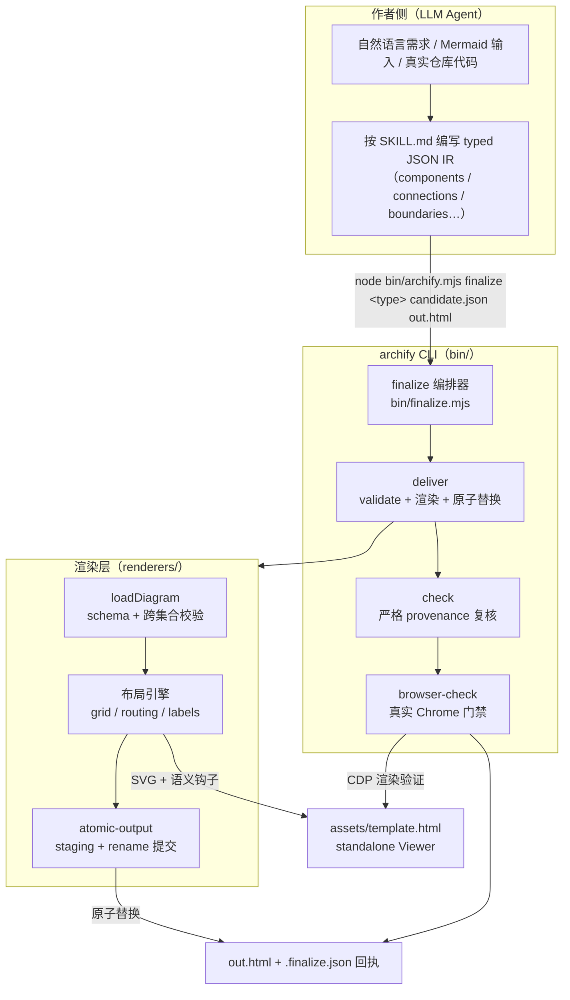
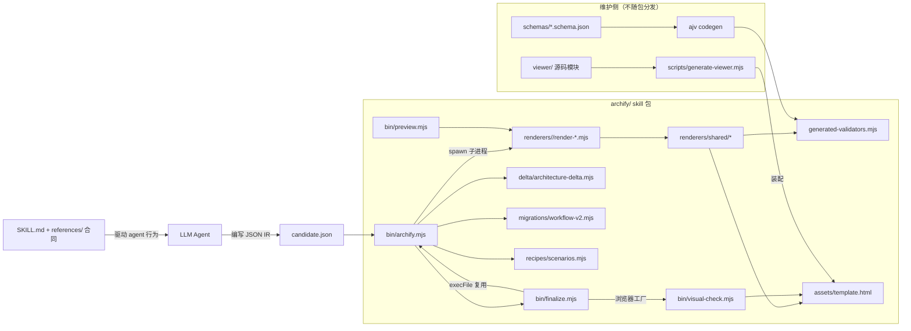
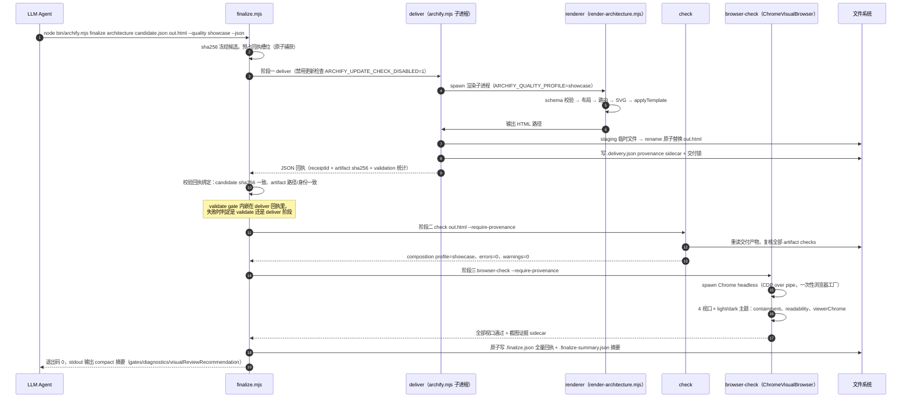
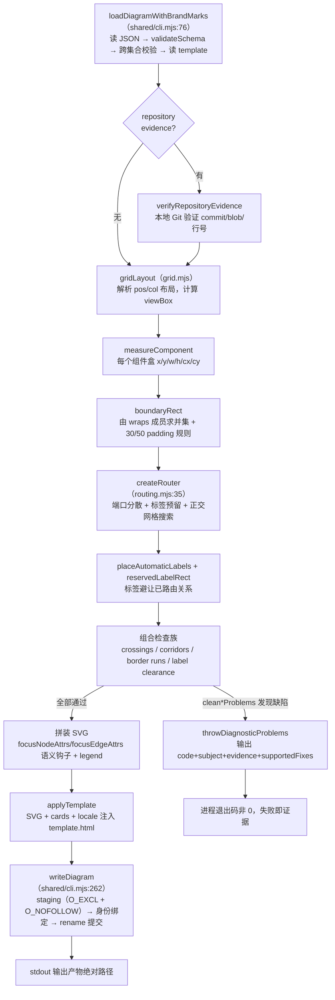

# archify 源码学习笔记

> 仓库地址：[tt-a1i/archify](https://github.com/tt-a1i/archify)
> 学习日期：2026-09-30
> 版本：v3.0.1（2026-09-28 发布）

---

> **以下为 AI 源码分析**
>
> ### 一句话概括
>
> Archify 是一个 Agent Skill：把自然语言描述或真实仓库代码变成**经过 schema 校验、原子交付、真实浏览器验证**的交互式 standalone HTML 架构图，核心是一个零运行时依赖的 Node.js CLI（`node bin/archify.mjs`），遵循"Agent 负责创作、代码负责验证"的分工哲学。
>
> ### 要点速览
>
> | 模块 | 职责 | 关键文件 | 规模 |
> |------|------|----------|------|
> | `archify/bin/` | CLI 命令层：16 个命令（validate/deliver/finalize/check/browser-check/preview/compare/guide…） | `archify.mjs`（6936 行）、`finalize.mjs`、`visual-check.mjs`、`preview.mjs` | ~11.6K 行 |
> | `archify/renderers/` | 5 种类型渲染器（architecture/workflow/sequence/dataflow/lifecycle）+ shared 几何/原子写/诊断基础设施 | `architecture/routing.mjs`、`workflow/workflow-compiler.mjs`（4913 行）、`shared/atomic-output.mjs`、`shared/geometry.mjs`（1941 行） | ~22.6K 行 |
> | `archify/schemas/` | typed JSON IR 契约：JSON Schema draft 2020-12，全层级 `additionalProperties: false` | 5 个类型 schema + `common.schema.json`（共享 `$defs`） | ~1.4K 行 |
> | `archify/assets/template.html` | 生成的 standalone Viewer（内联 CSS/JS、主题、导出、可达性） | 由 `viewer/` 源码装配生成 | 13709 行 |
> | `archify/references/` | 8 份机器可读的合同文档（authoring/delivery/layout repair 契约） | `delivery-contract.md`、`authoring-contract.md` 等 | — |
> | `archify/` 外围 | 仓库运营：viewer 维护源码、网站、构建脚本、基准测试、研究日志 | `viewer/`、`website/`、`scripts/`、`benchmarks/`、`journal/` | — |
> | 测试 | 单包 167 个测试文件，含真实 Chrome 浏览器门禁 | `archify/test/` | 167 文件 |
>
> **核心数据流**：自然语言 → Agent 编写 typed JSON IR → `finalize` 四道 gate（validate → deliver → check → browser-check）→ 原子交付的 standalone HTML + 机器可读回执（receipt）。

---

## 项目简介

Archify 解决的问题是：让 AI agent 生成的系统图**可信、可复现、可分享**。传统 agent 画图（如让 LLM 直接吐 Mermaid 或 SVG）的痛点是——输出质量靠运气、语法错误难修复、无法验证图中关系是否真实。Archify 把"画图"改造成一条工程流水线：Agent 只负责**编写一份带 schema 约束的 typed JSON IR**（Intermediate Representation，中间表示），剩余全部由确定性代码接管——schema 校验、布局组合检查、SVG 渲染、原子文件交付、真实 Chrome 浏览器渲染验证，每一步失败都返回带稳定错误码（code）、证据（evidence）和可执行修复建议（supportedFixes）的 JSON 诊断，让 Agent 能机器化地自我修复。

支持 5 种图类型：architecture（组件/服务/边界）、workflow（流程/泳道/审批）、sequence（时序/调用链）、dataflow（数据管道/血缘）、lifecycle（状态机）。产出是一个零依赖的 standalone HTML 文件——下载即用、发送即走，内置暗/亮主题、节点聚焦、上下游追溯（Upstream/Downstream reach）、路径探测（Route Probe）、PNG/SVG/WebM 导出。可选的 evidence-backed 模式能把节点锚定到 Git commit 的具体文件行号。

分发形态是 Agent Skill（`npx skills add tt-a1i/archify -g`），兼容 Cursor、Claude Code、Codex CLI、opencode；曾登顶 GitHub Trending 周榜全语言第一。SKILL.md 的 frontmatter 显示它基于 `Cocoon-AI/architecture-diagram-generator`（MIT）演化而来。

## 技术栈

| 类别 | 技术 |
|------|------|
| 语言 | Node.js >= 18，纯 ESM（全部 `.mjs`），**运行时零 npm 依赖** |
| 核心框架 | 无——CLI 手写命令分发，渲染器手写 SVG 生成 |
| 校验 | JSON Schema draft 2020-12；开发期用 ajv 8 standalone codegen 预编译成 `generated-validators.mjs` 随包分发 |
| 浏览器自动化 | 自研 `ChromeVisualBrowser`：spawn Chrome headless + CDP over pipe（`--remote-debugging-pipe`，不开网络端口） |
| Viewer 前端 | 原生 JS + 内联 SVG + CSS（JetBrains Mono），无前端框架 |
| 测试框架 | `node --test`（node:test）；浏览器测试独立 gate（`npm run test:browser`） |
| 开发期依赖 | ajv（validator codegen）、parse5/saxes（HTML/XML 解析）、simple-icons（brand marks） |
| 网站 | Astro 7 + React 19 + Tailwind 4（`website/`，GitHub Pages） |
| 包管理 | npm（`archify/package-lock.json`）；分发经 `scripts/build-zip.sh` + 确定性 zip |
| CI | GitHub Actions：`ci.yml`（浏览器门禁必过）、`release.yml`、`dsh.yml` 等 5 个 workflow |

## 目录结构

```text
archify/（仓库根）
├── archify/                     # 核心 skill 包（可独立分发，零运行时依赖）
│   ├── SKILL.md                 # Skill 入口：agent 的完整工作流指令（5 步 fast authoring path）
│   ├── bin/                     # CLI 层
│   │   ├── archify.mjs          # 主入口，16 个命令分发（6936 行）
│   │   ├── finalize.mjs         # 四道 gate 编排器（validate/deliver/check/browser-check）
│   │   ├── visual-check.mjs     # ChromeVisualBrowser + CDP 浏览器验证（2667 行）
│   │   ├── preview.mjs          # loopback-only 实时预览（last-good 语义）
│   │   └── delivery-update.mjs / open-artifact.mjs / recover-output.mjs
│   ├── renderers/               # 渲染层
│   │   ├── architecture/        # render-architecture.mjs + routing.mjs + grid.mjs + labels.mjs
│   │   ├── workflow/            # workflow-compiler.mjs（v2 可读性编译器，4913 行）+ render-workflow.mjs
│   │   ├── sequence/ dataflow/ lifecycle/  # 各自的 render-*.mjs
│   │   └── shared/              # 22 个共享模块：cli/geometry/atomic-output/diagnostics/i18n/legend…
│   ├── schemas/                 # 5 个 JSON Schema + common $defs + README（契约文档）
│   ├── assets/                  # template.html（13709 行生成的 Viewer）+ 字体许可
│   ├── references/              # 8 份合同文档（agent 按触发条件阅读）
│   ├── examples/                # 每种类型的 showcase 示例 IR + 渲染产物
│   ├── migrations/              # workflow v1→v2 迁移
│   ├── delta/                   # architecture-delta.mjs（Before/Delta/After 对比 + 机器回执）
│   ├── recipes/                 # scenarios.mjs（guide 命令的场景路由，en/zh 双语信号打分）
│   ├── scripts/                 # generate-validators / generate-brand-marks / render-examples
│   └── test/                    # 167 个测试文件 + fixtures + helpers
├── viewer/                      # template.html 的维护源码（15 个 JS 模块 + viewer.css + shell）
├── website/                     # Astro + React 文档站（tt-a1i.github.io/archify）
├── docs/                        # specs / gallery（Proof Lab）/ cases / evidence / assets
├── scripts/                     # 仓库级构建：build-gallery / build-guide / generate-viewer / ci-scope / run-tests
├── integrations/                # 社区集成（deepseek-harness、hermes-agent）
├── benchmarks/                  # ordinary-model-floor（普通模型下限基准）、repair-rounds
├── experiments/                 # v3-mermaid-validation 等实验记录
├── journal/                     # 49 轮 visual-evolution 研究日志 + 功能研究笔记
├── .agents/skills/archify-review/  # 仓库自用 review skill（value/cost/impact 决策框架）
├── PRODUCT.md / DESIGN.md / ROADMAP.md / REVIEWING.md / CONTRIBUTING.md
└── .github/workflows/           # ci / release / dsh / contributor-cards / star-history
```

注意一个刻意设计：`viewer/`（维护源码）在**打包目录 `archify/` 之外**，`archify/assets/template.html` 是**提交进仓库的生成产物**——装了 skill 的最终用户拿到的渲染器"原样消费"它，维护者改 viewer 后要跑 `npm run generate:viewer` 重新装配，`npm test` 会校验产物新鲜度。

## 架构设计

### 整体架构

整体是一个**"编译器 + 验证流水线"**形态，而不是画图工具。Agent（LLM）扮演前端编译器：读 `SKILL.md` 与 references 合同，把自然语言"编译"成 typed JSON IR；Archify 代码扮演后端：IR 先过 schema 与组合规则校验，再渲染成 SVG，注入 template.html Viewer，最后经四道独立 gate 验证后原子交付。所有失败都以 `diagnostics[]`（code/subject/evidence/supportedFixes）返回，供 Agent 机器化修复（SKILL.md 约束最多两轮修复）。



四个值得记住的架构决策：

1. **Agent 只写 JSON，不碰 SVG**。所有视觉判断（布局、间距、路由）由确定性代码执行，输出可复现（同一 JSON 渲染出字节级可比较的 HTML）。
2. **失败是一等公民**。每道 gate 的失败都携带稳定错误码、精确 subject（哪个节点/哪条边）、测量证据（如具体像素冲突）和 `supportedFixes`（只列支持的修复动作），把"Agent 瞎猜重试"变成"定向修复"。
3. **fail-closed 证据哲学**。不确定的事实必须标明而不是编造；reach（上下游追溯）只声明"authored relationships"绝不声称运行时影响；repository evidence 必须 pin 到具体 Git commit 并由本地 Git 验证 blob 和行号。
4. **生成的产物即发布物**。validator（ajv codegen）、template.html（viewer 装配）、brand-marks（simple-icons 提取）都在开发期生成、提交进仓库、随包分发，运行时因此零依赖、零网络。

### 核心模块

**1. CLI 命令层（`archify/bin/`）**

- 职责：参数解析、命令分发、交付锁与 sidecar 命名空间、进程编排。
- 核心文件：`archify.mjs`（6936 行、104 个函数，是绝对的巨石入口——但注意它前 2000 行几乎全是交付锁与文件身份的基础设施）；`finalize.mjs`（895 行编排器）；`visual-check.mjs`（2667 行）；`preview.mjs`（969 行）。
- 关键接口：
  - 命令分发（`archify.mjs:6865-6928` 的 switch）：`render / compare / deliver / finalize / preview / validate / migrate / inspect / check / visual-check / browser-check / guide / brands / examples / doctor / demo`。
  - `runNode()` + `rendererPath(type)`（`archify.mjs:2217`）：把渲染委托给子进程 `node renderers/<type>/render-<type>.mjs`，通过环境变量 `ARCHIFY_QUALITY_PROFILE` / `ARCHIFY_REPO_ROOT` / `ARCHIFY_DIAGNOSTIC_JSON` 传参——CLI 与渲染器是**进程隔离**的。
  - 交付锁体系：`.delivery.json`（provenance）/ `.delivery-pending.json` / `.delivery-lock.json` / 目录级 `.archify-delivery-lock.json`，配 `acquireDeliveryLock`（`archify.mjs:520`）、`releaseDeliveryOwnership`、进程存活检测 `processIsRunning`（SIG-0 probe）——防止两个并发交付写同一输出路径。
- 与其他模块的关系：`finalize.mjs` import 自 `renderers/shared/` 的原子输出与路径模块，`visual-check.mjs` 的 `ChromeVisualBrowser` 被 finalize 复用为一次性浏览器工厂（一次启动跑完全部视口）。

**2. 渲染层（`archify/renderers/`）**

- 职责：JSON IR → 布局 → SVG → standalone HTML。
- 核心文件：
  - `shared/cli.mjs`（451 行）：渲染器公共入口。`loadDiagram()`（第 76 行）做读入 → JSON parse → `validateSchema` → locale/翻译注册 → `validateCrossCollectionContracts`（重复 ID 等跨集合事实）→ `verifyRepositoryEvidence` → 读 template；`writeDiagram()`（第 262 行）做 `applyTemplate` → staging 临时文件（`O_EXCL|O_NOFOLLOW`）→ 身份绑定 → rename 原子提交。
  - `shared/geometry.mjs`（1941 行）：纯几何算法库——矩形相交、线段-矩形清空检测、`automaticPortSpread`（共享端口的确定性分散，避免箭头堆在一条边中点）、`polylinePath`、以及一族 `clean*Problems` 检查器（crossings / ambiguous corridors / border runs / route rhythm / label clearance）。
  - `shared/atomic-output.mjs`（1982 行）：原子交付的心脏，下文详述。
  - `shared/diagnostics.mjs`：`installRendererDiagnosticBoundary()` 把渲染器进程的任何崩溃翻译成结构化诊断，而不是 Node stack trace。
  - `architecture/routing.mjs`（1157 行）：`createRouter()`（第 35 行）实现正交网格路由：端口分散（port spreading）、标签预留（已路由关系的标签矩形会预留给后续路由避让）、边界框 border-runs 检测、最短正交网格路由搜索。
  - `architecture/render-architecture.mjs`（1001 行）：measure → boundary 推导 → 路由 → 标签 → 图例 → SVG 拼装，并把 `focusNodeAttrs`/`focusEdgeAttrs`（`shared/cli.mjs:414`）写进每个 SVG 元素，形成 Viewer 可交互的语义钩子。
  - `workflow/workflow-compiler.mjs`（4913 行）：schema v2 的"可读性编译器"——不是固定布局，而是以 11 项成本优先级（`READABLE_CANDIDATE_COST_PRIORITY`，第 54 行：交叉数 > 共享走廊 > 标签清空 > 折弯数 > 画布增长…）做多轮候选搜索（最多 `MAX_READABLE_LAYOUT_FEEDBACK_ROUNDS = 3` 轮反馈），这本质是一个小型布局优化器。
  - `shared/route-quality.mjs`（614 行）：`shortestOrthogonalGridRoute` 与 route review 指标（crossings/detours/crowdedSides），被 finalize 转化为 `visualReviewRecommendation` 的布局修复提示。
- 与其他模块的关系：所有渲染器类型共享 `shared/`（几何、图例、文本适配、i18n、brand marks）；schema 校验依赖 `shared/generated-validators.mjs`（ajv codegen 产物）。

**3. 契约层（`schemas/` + `references/` + `SKILL.md`）**

- 职责：把"什么算合法输入、什么算合格输出、怎么修"写成机器可读的合同。
- 核心内容：
  - 5 个 schema 全部 `additionalProperties: false`——未知字段直接拒绝而非静默忽略；`meta.output` 强制 portable POSIX 相对路径。
  - `workflow`/`lifecycle` 有 schema v1/v2 双版本共存（v1 固定布局兼容，v2 可读性编译器），`migrations/workflow-v2.mjs` 提供显式迁移。
  - `references/` 8 份文档不是普通文档，而是 SKILL.md 工作流**按触发条件引用的分支合同**（例如"多路由纠缠时读 architecture-layout-repair.md；finalize 失败时读 delivery-contract.md 的 failed-finalize 章节"）。
  - `recipes/scenarios.mjs`：`guide` 命令的场景路由器，11 个配方各带 en/zh 双语信号词权重表（如 `['agent tool call', 16]`），对用户输入打分选出推荐图型并给出 starter prompt。

**4. Viewer 运行时（`assets/template.html` + 维护源码 `viewer/`）**

- 职责：standalone HTML 里的全部交互——主题/视觉预设、节点聚焦（Semantic Passport）、上下游 reach、Route Probe、Semantic Lens、语义雷达（semantic-radar）、导出（PNG/剪贴板/WebM/Share Cards）、自适应阅读布局（adaptive reader layout）。
- 关键文件：`viewer/` 下 15 个源模块（`focus.js`、`route-probe.js`、`export.js`、`reader-layout.js`、`motion-governor.js`……）+ `viewer.css` + `template.source.html`；由根目录 `scripts/generate-viewer.mjs` 按固定 marker 装配（JS 原样插入、CSS 重缩进 4 空格），生成 `archify/assets/template.html`。
- 关键约束（见 `viewer/README.md`）：**装配保持字节级兼容**——多数抽取"preserve delivered HTML bytes"，产物不是第二编辑面；`npm run check:viewer` 校验新鲜度。
- 与渲染层关系：渲染器把 SVG 与 cards 注入模板占位符；`visual-check.mjs` 在浏览器里等 `Archify.layoutStability.whenStable()` 再截图，说明 Viewer 暴露了专门的稳定性 API 供验证消费。

**5. 质量基建（`test/` + 浏览器门禁 + benchmarks）**

- 167 个测试文件覆盖：原子输出恢复、交付锁竞争、schema 生成新鲜度、每种图型的浏览器测试（`*-browser.test.mjs`）、导出清理、WebM 冒烟。
- 铁律（CONTRIBUTING.md 原文）："A browser test skipped because Chrome was unavailable is **skipped**, not passed."——CI 的 `test:browser` gate 在无可用 Chrome 时直接失败而非跳过。
- `benchmarks/ordinary-model-floor`：用固定 prompt 测"普通模型"使用本 skill 的产出下限，防止 skill 优化只对旗舰模型有效。

### 模块依赖关系



两条清晰的依赖方向：**运行时**（CLI → renderers → shared → validators/template）全部在包内零依赖；**维护时**（viewer 源码、schema 源 → 生成器 → 提交产物）只存在于开发环境。

## 核心流程

### 流程一：finalize 交付流水线（主路径）

`finalize` 是 SKILL.md 规定的标准交付命令，一条命令串起四道 gate。`bin/finalize.mjs` 的 `runFinalize()`（第 613 行）是编排核心：



关键逻辑（对应 `finalize.mjs` 源码）：

- **候选冻结**（第 639-649 行）：读入 candidate 后立即记 sha256；若调用方传 `--candidate-sha256`，不匹配直接抛 `finalize/candidate-changed`——防止编排期间 Agent 偷偷改文件导致"验证的和交付的不是同一份"。
- **回执先行**（第 669-696 行）：先原子捕获回执与摘要的文件槽位再跑 gate，gate 失败也留下 `status: fail` 的证据文件；`writeJsonAtomic` 保证回执自身也是原子写（staging + rename + 提交后再验证槽位未被偷换）。
- **gate 间绑定验证**（`stageBindingDiagnostic`，第 255 行）：每道 gate 的回执都要验证 `artifact.sha256` 与 deliver 阶段记录一致、`deliveryReceiptId` 一致——防止中间有别的进程替换了产物。最终 `finalArtifactDiagnostic`（第 326 行）在所有 gate 通过后**再**重读一次磁盘文件做终验。
- **首战即败的语义**（第 771-782 行）：showcase 质量要求 `warnings === 0`，deliver 报 warning 时把每个 warning 翻译成 error 级诊断并列出修复项。
- **修复闭环**：失败回执里 `nextAction: {action: 'edit-in-place', then: 'finalize-once'}`，配合 SKILL.md 的"最多两轮修复"约束形成有限循环；`compactFinalizeReceipt`（第 493 行）最多展示 8 条去重后的诊断，避免 Agent 上下文爆炸。

### 流程二：architecture 渲染（IR → SVG → 原子落盘）

以 `renderers/architecture/render-architecture.mjs` 为例，一个渲染器的完整内部流程：



关键逻辑：

- **schema 先于一切**（`shared/cli.mjs:110`）：`validateSchema` 在任何布局工作之前执行；输入不可读、JSON 语法错都翻译成 `input/read`、`input/json-parse` 诊断而非裸异常。
- **几何检查是渲染器的职责**（schemas/README.md 明确分工）：schema 管"形状对不对"，渲染器管"排得下不下"——overlap、label 碰撞、路由交叉全是渲染期的 `clean*Problems` 检查器（`shared/geometry.mjs`）。
- **原子写细节**（`shared/cli.mjs:195-259` + `shared/atomic-output.mjs`）：`stageRenderedHtml` 在目标同目录用 `O_EXCL|O_NOFOLLOW|O_CREAT` 创建 `.archify-render-<pid>-<seq>.tmp`，`fstat` 拿 device/inode 身份，写入后经 `captureRegularFileBinding`（校验 sha256/bytes/inode/nlink===1）再 rename 到目标；提交前**重跑一次**输出路径解析（第 292 行注释：防止渲染耗时期间路径被 alias 偷换指向输入文件）。
- **诊断边界**（`shared/diagnostics.mjs` 的 `installRendererDiagnosticBoundary`）：渲染器作为独立子进程运行，任何未捕获错误都会被翻译成结构化诊断，主 CLI 的 `rendererFailure()`（`archify.mjs:2561`）再包装成统一 JSON。

## 关键设计亮点

**1. "Agent 创作、代码验证"的责任划分**

- 解决的问题：LLM 直接生成 SVG/Mermaid 时，质量不可复现、错误不可机读，Agent 只能盲目重试。
- 实现方式：`SKILL.md` 把 agent 的职责压缩为"编写合法 typed JSON"；`schemas/`（全层级 `additionalProperties: false`）+ 渲染器 `clean*Problems` 检查器 + `diagnostics[]`（稳定 code/subject/evidence/supportedFixes）构成验证闭环；SKILL.md 进一步规定"两轮修复上限"和"references 按触发条件阅读"防止 agent 无限循环或上下文爆炸。
- 为什么这样设计：把不确定的智能放在输入端（理解需求、抽象组件），把确定性放在输出端（布局、验证、交付）。整个仓库 167 个测试守护的正是"确定性后端"这个契约。

**2. 零运行时依赖的"生成即发布"形态**

- 解决的问题：skill 要装进 Claude Code / Cursor / Codex 等环境，不能假设目标机器有 npm install 能力和网络。
- 实现方式：三处 dev-time codegen + committed artifact——ajv standalone 生成 `renderers/shared/generated-validators.mjs`（`scripts/generate-validators.mjs`，`npm test` 用 check 模式防漂移）；`viewer/` 15 个源模块装配成 `assets/template.html`（`scripts/generate-viewer.mjs`，字节级兼容）；simple-icons 提取成 `generated-brand-marks.mjs`（2003 行）。`archify/package.json` 的 `dependencies` 字段是空的，devDependencies 只在开发机存在。
- 为什么这样设计：分发面（`npx skills add`、Claude.ai 上传 zip、Dsh plugin）千差万别，唯一可靠公约数是"一个目录 + node"。代价是维护纪律：改源必须重新生成，由 CI 强制。

**3. 原子交付与文件身份绑定（`shared/atomic-output.mjs`，1982 行）**

- 解决的问题：交付瞬间是最脆弱的窗口——并发交付、symlink 攻击、hardlink 语义、进程崩溃都可能留下"半个 HTML"，或让验证过的内容和实际落盘的内容不一致。
- 实现方式：以 `fs.openSync(path, O_NOFOLLOW|O_NONBLOCK)` + `fstat(bigint)` 建立文件身份（device/inode/nlink），任何阶段发现 `nlink !== 1`（hardlink）或身份漂移即 fail-closed（`target-hardlinked`、`target-changed` 等错误码）；写入永远走"同目录 staging 临时文件 → sha256/bytes/身份三重绑定验证 → rename 原子提交"；提交后**重验证**槽位未被替换。上层 `archify.mjs` 再叠交付锁（`.delivery-lock.json` 记录 PID，配合 `processIsRunning` 的信号探测）与 pending/provenance sidecar、崩溃恢复 journal。
- 为什么这样设计：这是"验证过的才允许存在"哲学的物理保障——README 宣称的 "Atomic validation before delivery" 和 "last-good" 不是口号，而是文件系统原语级别的实现。代价是这层代码极端防御（连 Windows lstat 目录回退、`fstat`/`lstat` 不一致都处理了），可读性让位于正确性。

**4. 真实浏览器作为强制质量门禁（`bin/visual-check.mjs`）**

- 解决的问题：静态 SVG/XML 检查无法发现字体未就位、视口溢出、布局不稳定等真实渲染问题。
- 实现方式：自研 `ChromeVisualBrowser`（第 1524 行）spawn `chrome --headless=new --remote-debugging-pipe`，用**CDP over pipe**（不开 TCP 端口，`chrome-pipe-transport.test.mjs` 专测）驱动；`inspect()` 导航到产物 URL（带 `?theme=` 参数），先等 `document.fonts.ready` 与 Viewer 暴露的 `Archify.layoutStability.whenStable()`，再在 4 个视口（desktop readability 基准 + 1600/1920/2048）× 2 主题下检查 containment（图不溢出画布）、readability（节点文字投影尺寸 ≥ `MIN_PROJECTED_NODE_TEXT_PX`）、viewerChrome；截图落为证据 sidecar（带 sha256）。`finalize` 复用同一浏览器实例跑完全部 gate（一次性浏览器工厂，第 703-722 行）。
- 为什么这样设计：CONTRIBUTING.md 把这条写成了文化——"skipped, not passed"。浏览器门禁在 CI 里是必过项（`npm run test:browser` 无 Chrome 直接失败），普通 `npm test` 才允许跳过。

**5. 机器可读的布局修复建议（`compactFinalizeReceipt` + `placementHints`）**

- 解决的问题：自动布局检查发现"交叉/绕路"后，如何让 Agent 知道**具体挪哪个节点**，而不是整图重画（会破坏已验证的语义）。
- 实现方式：`finalize.mjs:473` 的 `placementHints()` 把 route review 的测量结果翻译成自然语言提示——例如"`A→B` 与 `C→D` 在 `X` 旁交叉：把分支那条的端点移到主路径另一侧"；配 `visualReviewRecommendation` 里的 `repair` 字段指向 `references/architecture-layout-repair.md`，并强制"只改坐标与尺寸，节点/关系/标签/来源一字不动"，重跑限定 `--out-dir review-2` 一次性收束（不许第二轮重排）。workflow 编译器同思路：11 项成本优先级的候选搜索 + 最多 3 轮反馈。
- 为什么这样设计：把"人看图觉得乱"的主观判断分解为可测量的信号（crossings/detours/crowdedSides），再编码为有限、定向、语义保持的修复流程——这是 Agent 友好工程（agent-ergonomics）的教科书式样本。

---

## 学习收获与未深入部分

**值得借鉴到自家 skill 的做法**：diagnostics 的四元组契约（code/subject/evidence/supportedFixes）比"报错 + 让 agent 自己看"有效得多；generated-artifact + freshness check 解决了 skill 的零依赖分发；finalize 的"冻结候选 → gate 间身份绑定 → 终验"三层防篡改值得任何"验证后交付"场景参考。

**未深入分析的部分**（规模所限）：`workflow-compiler.mjs` 的 4913 行只读了成本函数与反馈框架，候选生成算法细节未展开；`sequence/dataflow/lifecycle` 渲染器只读了 README；`viewer/` 15 个交互模块只梳理了职责分工；`website/`（Astro 站点）、`benchmarks/`、`integrations/`（Dsh/Hermes 集成）与 `journal/` 的 49 轮视觉演化研究均只做了定位性了解。如需深入，优先级建议：`workflow-compiler.mjs`（布局优化器思想）> `viewer/focus.js`（语义交互）> `benchmarks/ordinary-model-floor`（普通模型可用性下限的评估方法）。
