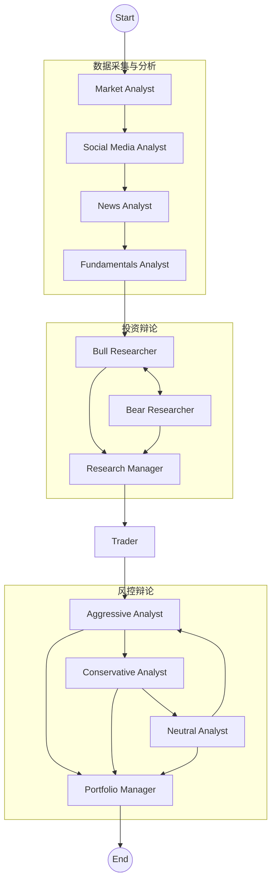
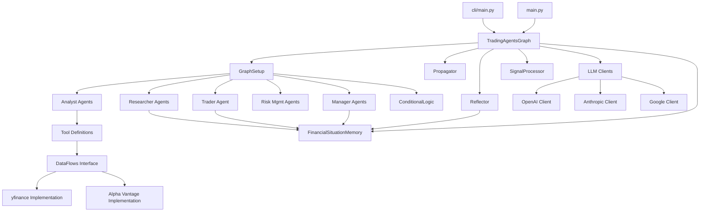
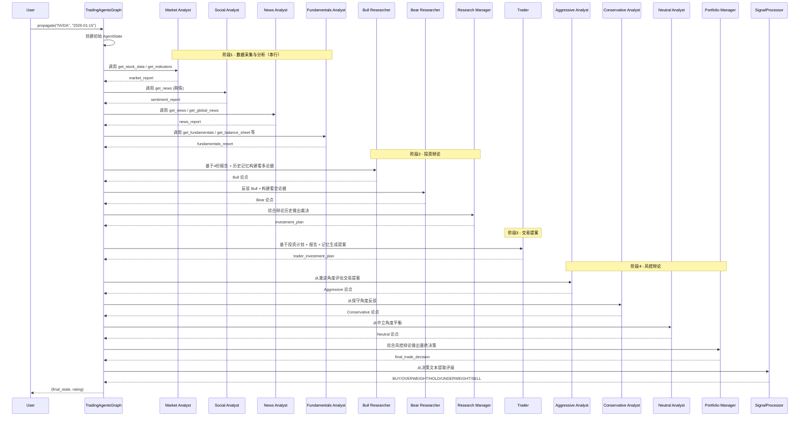
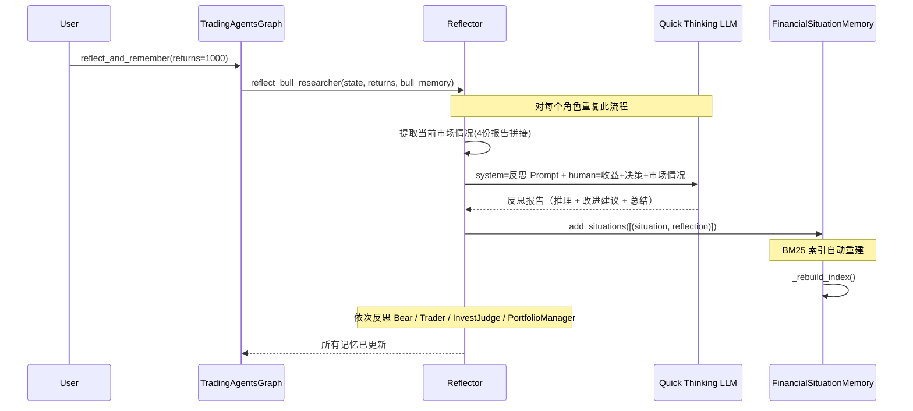

# TradingAgents 源码学习笔记

> 仓库地址：[TradingAgents](https://github.com/TauricResearch/TradingAgents)
> 学习日期：2026-03-29

---

> **以下为 AI 源码分析**
>
> ### 一句话概括
>
> 一个基于 LangGraph 构建的多 Agent 金融交易决策框架，通过模拟真实交易公司中分析师、研究员、交易员、风控团队的协作与辩论流程，由 LLM 驱动生成股票交易建议。
>
> ### 要点速览
>
> | 核心模块 | 职责 | 关键文件 |
> |----------|------|----------|
> | Graph 编排层 | 定义 Agent 拓扑与状态机流转 | `tradingagents/graph/trading_graph.py`, `setup.py` |
> | Analyst 团队 | 4 类分析师采集并分析市场数据 | `tradingagents/agents/analysts/*.py` |
> | Researcher 团队 | Bull/Bear 双方辩论投资方向 | `tradingagents/agents/researchers/*.py` |
> | Trader Agent | 综合研报生成交易提案 | `tradingagents/agents/trader/trader.py` |
> | Risk Management 团队 | 激进/保守/中性三方风控辩论 | `tradingagents/agents/risk_mgmt/*.py` |
> | Portfolio Manager | 最终交易决策与评级输出 | `tradingagents/agents/managers/portfolio_manager.py` |
> | DataFlows 数据层 | 多数据源抽象（yfinance / Alpha Vantage） | `tradingagents/dataflows/interface.py` |
> | LLM Clients | 多供应商 LLM 统一接入 | `tradingagents/llm_clients/factory.py` |
> | Memory 记忆系统 | BM25 检索历史经验指导决策 | `tradingagents/agents/utils/memory.py` |

---

## 项目简介

TradingAgents 是 Tauric Research 开源的多 Agent LLM 金融交易框架（v0.2.2），灵感来源于真实交易公司的组织架构。它将复杂的交易决策分解为多个专业角色——基本面分析师、技术分析师、舆情分析师、新闻分析师、看多/看空研究员、交易员、激进/保守/中性风控分析师和投资组合经理——每个角色由 LLM 驱动，通过结构化辩论和协作，最终输出 BUY / OVERWEIGHT / HOLD / UNDERWEIGHT / SELL 五级评级。框架基于 LangGraph 状态图引擎构建，支持 OpenAI、Anthropic、Google、xAI、OpenRouter、Ollama 六大 LLM 供应商，数据源可在 yfinance 和 Alpha Vantage 之间灵活切换。

## 技术栈

| 类别 | 技术 |
|------|------|
| 语言 | Python >= 3.10 |
| 框架 | LangGraph + LangChain |
| 构建工具 | setuptools (pyproject.toml) |
| 依赖管理 | pip / uv |
| CLI 框架 | Typer + Rich |
| 数据源 | yfinance, Alpha Vantage API |
| 技术指标 | stockstats |
| 记忆检索 | BM25 (rank_bm25) |
| LLM 供应商 | OpenAI, Anthropic, Google, xAI, OpenRouter, Ollama |

## 目录结构

```
TradingAgents/
├── main.py                          # Python API 使用入口示例
├── pyproject.toml                   # 项目元数据与依赖定义
├── cli/                             # CLI 交互界面
│   ├── main.py                      #   Typer 应用主入口（tradingagents 命令）
│   ├── config.py                    #   CLI 配置（LLM 供应商选择等）
│   ├── models.py                    #   数据模型（AnalystType 等枚举）
│   ├── stats_handler.py             #   LLM/工具调用统计回调
│   └── utils.py                     #   CLI 工具函数
├── tradingagents/                   # 核心包
│   ├── default_config.py            #   全局默认配置
│   ├── graph/                       #   LangGraph 编排层
│   │   ├── trading_graph.py         #     TradingAgentsGraph 主类
│   │   ├── setup.py                 #     StateGraph 节点与边定义
│   │   ├── propagation.py           #     状态初始化与图执行参数
│   │   ├── conditional_logic.py     #     条件路由（辩论轮次控制）
│   │   ├── reflection.py            #     交易后反思与记忆更新
│   │   └── signal_processing.py     #     最终信号提取（LLM 解析评级）
│   ├── agents/                      #   所有 Agent 实现
│   │   ├── analysts/                #     4 类分析师 Agent
│   │   ├── researchers/             #     Bull/Bear 研究员
│   │   ├── trader/                  #     交易员 Agent
│   │   ├── risk_mgmt/               #     3 类风控辩论 Agent
│   │   ├── managers/                #     Research Manager + Portfolio Manager
│   │   └── utils/                   #     共享工具（状态定义、记忆、Tool 定义）
│   ├── dataflows/                   #   数据获取与路由层
│   │   ├── interface.py             #     多供应商路由与 Fallback
│   │   ├── config.py                #     运行时配置管理
│   │   ├── y_finance.py             #     yfinance 数据实现
│   │   ├── yfinance_news.py         #     yfinance 新闻实现
│   │   ├── alpha_vantage*.py        #     Alpha Vantage 系列实现
│   │   └── stockstats_utils.py      #     技术指标计算工具
│   └── llm_clients/                 #   多供应商 LLM 客户端
│       ├── factory.py               #     工厂函数 create_llm_client()
│       ├── base_client.py           #     抽象基类 + 内容归一化
│       ├── openai_client.py         #     OpenAI/xAI/OpenRouter/Ollama
│       ├── anthropic_client.py      #     Anthropic Claude
│       ├── google_client.py         #     Google Gemini
│       └── validators.py            #     模型名校验
└── tests/                           # 测试
    └── test_ticker_symbol_handling.py
```

## 架构设计

### 整体架构

TradingAgents 采用**多 Agent 协作 + 辩论驱动**的架构设计。整个决策流程可分为四个阶段：

1. **数据采集与分析阶段**：四类分析师 Agent 串行执行，各自调用数据工具生成专业报告
2. **投资辩论阶段**：Bull/Bear 研究员基于分析报告进行多轮对抗辩论，Research Manager 裁决
3. **交易提案阶段**：Trader Agent 综合研报和投资计划，生成具体交易建议
4. **风控辩论阶段**：激进/保守/中性三位风控分析师对交易提案进行多轮辩论，Portfolio Manager 做出最终决策

框架使用 LangGraph 的 `StateGraph` 编排所有节点，通过 `AgentState` 在节点间传递共享状态。



### 核心模块

#### 1. Graph 编排层 (`tradingagents/graph/`)

**职责**：定义整个多 Agent 工作流的拓扑结构，管理状态流转，控制辩论轮次。

**核心文件**：
- `trading_graph.py`：`TradingAgentsGraph` 主类，初始化 LLM 客户端、记忆系统、Tool 节点，暴露 `propagate()` 和 `reflect_and_remember()` 两个核心 API
- `setup.py`：`GraphSetup` 类，构建 `StateGraph`，添加所有 Agent 节点和条件边
- `propagation.py`：`Propagator` 类，创建初始 `AgentState` 和图执行参数
- `conditional_logic.py`：`ConditionalLogic` 类，4 个分析师的 tool_call 循环判断 + 投资辩论轮次控制 + 风控辩论轮次控制
- `reflection.py`：`Reflector` 类，交易完成后对各角色进行反思并将经验写入记忆
- `signal_processing.py`：`SignalProcessor` 类，用 LLM 从完整决策文本中提取 BUY/OVERWEIGHT/HOLD/UNDERWEIGHT/SELL 评级

**关键接口**：
- `TradingAgentsGraph.propagate(ticker, date)` → `(final_state, decision_rating)`
- `TradingAgentsGraph.reflect_and_remember(returns_losses)` → 更新所有角色记忆

#### 2. Analyst 团队 (`tradingagents/agents/analysts/`)

**职责**：每个分析师是一个 LangChain Agent，绑定特定数据工具，通过 Tool Calling 获取数据后生成专业分析报告。

**四类分析师**：

| 分析师 | 文件 | 绑定工具 | 输出字段 |
|--------|------|----------|----------|
| Market Analyst | `market_analyst.py` | `get_stock_data`, `get_indicators` | `market_report` |
| Social Media Analyst | `social_media_analyst.py` | `get_news` | `sentiment_report` |
| News Analyst | `news_analyst.py` | `get_news`, `get_global_news` | `news_report` |
| Fundamentals Analyst | `fundamentals_analyst.py` | `get_fundamentals`, `get_balance_sheet`, `get_cashflow`, `get_income_statement` | `fundamentals_report` |

**共同模式**：所有分析师采用相同的 `ChatPromptTemplate` → `llm.bind_tools(tools)` → 循环调用工具直到无 `tool_calls` → 将最终 `content` 写入 state 对应 report 字段。

#### 3. Researcher 团队 (`tradingagents/agents/researchers/`)

**职责**：看多研究员（Bull）和看空研究员（Bear）基于所有分析报告进行对抗辩论，从不同角度评估投资价值。

**核心文件**：
- `bull_researcher.py`：`create_bull_researcher(llm, memory)` — 构建看多论据，反驳看空观点
- `bear_researcher.py`：`create_bear_researcher(llm, memory)` — 构建看空论据，反驳看多观点

**辩论机制**：通过 `InvestDebateState` 中的 `count` 字段和 `ConditionalLogic.should_continue_debate()` 控制轮次，Bull → Bear → Bull → Bear... 交替发言，达到 `2 * max_debate_rounds` 次后流转至 Research Manager。

#### 4. Managers (`tradingagents/agents/managers/`)

**职责**：
- `research_manager.py`：作为投资辩论的裁判，综合 Bull/Bear 辩论历史做出 Buy/Sell/Hold 决策，生成投资计划
- `portfolio_manager.py`：作为风控辩论的裁判，综合三方风控意见输出最终五级评级（Buy/Overweight/Hold/Underweight/Sell）

#### 5. Trader Agent (`tradingagents/agents/trader/`)

**职责**：接收 Research Manager 的投资计划，结合所有分析报告和历史记忆，生成具体交易提案（含 FINAL TRANSACTION PROPOSAL）。

#### 6. Risk Management 团队 (`tradingagents/agents/risk_mgmt/`)

**职责**：三位风控分析师从不同风险偏好角度评估 Trader 的交易提案。

| 角色 | 文件 | 风格 |
|------|------|------|
| Aggressive Analyst | `aggressive_debator.py` | 高风险高回报导向，强调增长机会 |
| Conservative Analyst | `conservative_debator.py` | 低风险稳健导向，强调资产保护 |
| Neutral Analyst | `neutral_debator.py` | 平衡视角，兼顾收益与风险 |

**辩论机制**：通过 `RiskDebateState` 和 `should_continue_risk_analysis()` 控制，Aggressive → Conservative → Neutral 循环发言，达到 `3 * max_risk_discuss_rounds` 次后流转至 Portfolio Manager。

#### 7. DataFlows 数据层 (`tradingagents/dataflows/`)

**职责**：提供统一的金融数据获取接口，支持多数据供应商和 Fallback 机制。

**核心设计**：
- `interface.py`：定义 `VENDOR_METHODS` 映射表和 `route_to_vendor()` 路由函数，支持按类别或按工具粒度配置数据源
- `y_finance.py`：yfinance 实现（股价、技术指标、基本面、内部人交易）
- `alpha_vantage*.py`：Alpha Vantage API 实现
- Tool 定义层（`agents/utils/*_tools.py`）：用 `@tool` 装饰器定义 LangChain 工具，内部调用 `route_to_vendor()`

#### 8. LLM Clients (`tradingagents/llm_clients/`)

**职责**：统一封装多供应商 LLM 访问，处理各供应商的差异（API 格式、Responses API、thinking 配置等）。

**核心设计**：
- `BaseLLMClient`：抽象基类，定义 `get_llm()` 和 `validate_model()` 接口
- `normalize_content()`：将各供应商返回的结构化 content（list of blocks）归一化为纯字符串
- `NormalizedChat*` 子类：重写 `invoke()` 方法自动归一化输出
- `factory.py`：`create_llm_client()` 工厂函数，按 provider 名称路由到对应 Client

#### 9. Memory 记忆系统 (`tradingagents/agents/utils/memory.py`)

**职责**：使用 BM25 算法存储和检索历史金融场景的经验教训，让 Agent 从过往交易中学习。

**关键类**：`FinancialSituationMemory`
- `add_situations([(situation, recommendation)])`：添加场景-建议对
- `get_memories(current_situation, n_matches)` → 返回 BM25 评分最高的历史经验
- 五个独立实例：`bull_memory`, `bear_memory`, `trader_memory`, `invest_judge_memory`, `portfolio_manager_memory`

### 模块依赖关系



## 核心流程

### 流程一：交易决策全流程（propagate）

这是框架最核心的流程，从输入股票代码和日期到输出最终交易评级。



**关键逻辑说明**：

1. **分析师 Tool Calling 循环**：每个分析师节点通过 `llm.bind_tools()` 绑定工具，`ConditionalLogic.should_continue_*()` 检查最后一条消息是否有 `tool_calls`，有则路由到 `ToolNode` 执行，无则进入 `Msg Clear` 节点清除消息历史后流转到下一个分析师
2. **消息清理机制**：`create_msg_delete()` 在分析师之间清除消息历史，避免上下文窗口膨胀，仅保留一条 "Continue" 占位消息（兼容 Anthropic API 要求）
3. **辩论轮次控制**：投资辩论 `count >= 2 * max_debate_rounds` 时结束；风控辩论 `count >= 3 * max_risk_discuss_rounds` 时结束

### 流程二：反思与记忆更新（reflect_and_remember）

交易执行后，根据实际收益反思决策质量并更新记忆，用于未来决策参考。



**记忆检索机制**：当新交易执行时，各 Agent 调用 `memory.get_memories(current_situation, n_matches=2)` 使用 BM25 算法从历史经验中检索最相似的场景，将过去的教训注入 Prompt 中指导当前决策。

## 关键设计亮点

### 1. 辩论驱动的决策机制

**解决的问题**：单一 LLM Agent 容易产生偏见（如过度乐观），决策缺乏多角度审视。

**实现方式**：框架设计了两级辩论机制：
- 投资辩论（`researchers/`）：Bull vs Bear 二元对抗，强制从正反两面评估投资价值
- 风控辩论（`risk_mgmt/`）：Aggressive vs Conservative vs Neutral 三元辩论，从不同风险偏好评估交易提案

辩论轮次通过 `ConditionalLogic` 的计数器精确控制，避免无限循环。

**设计理由**：模仿真实交易公司中投研团队和风控团队的决策流程，通过对抗性讨论减少单一视角偏差，提高决策质量。

### 2. 多供应商数据路由与 Fallback

**解决的问题**：金融数据来源不稳定（API 限流、服务不可用），需要优雅降级。

**实现方式**（`dataflows/interface.py`）：
- `VENDOR_METHODS` 映射表定义每个工具方法的多供应商实现
- `route_to_vendor()` 支持主备切换：先尝试配置的主供应商，Alpha Vantage 限流时自动 Fallback 到 yfinance
- 支持类别级和工具级两层配置粒度

**设计理由**：生产环境中 Alpha Vantage 免费 API 有严格的速率限制，yfinance 免费但数据覆盖范围不同。双层配置 + 自动 Fallback 保证了系统的可靠性和灵活性。

### 3. BM25 离线记忆系统

**解决的问题**：传统方案使用 Embedding API 做相似度检索，增加 API 调用成本和延迟，且依赖特定供应商。

**实现方式**（`agents/utils/memory.py`）：
- 使用 `rank_bm25` 的 BM25Okapi 算法进行词汇级相似度匹配
- 纯本地计算，无需 API 调用，支持任何 LLM 供应商
- 每次添加新记忆后自动重建索引

**设计理由**：金融报告中包含大量特征性词汇（股票代码、指标名称、行业术语），BM25 的词频统计特性天然适合此场景，同时消除了对 Embedding API 的依赖。

### 4. LLM 输出归一化层

**解决的问题**：不同 LLM 供应商的响应格式不一致——OpenAI Responses API 返回 `[{type: 'reasoning', ...}, {type: 'text', text: '...'}]`，Gemini 3 也有类似的结构化输出。

**实现方式**（`llm_clients/base_client.py`）：
- `normalize_content()` 函数统一将 list-of-blocks 格式提取为纯字符串
- 每个供应商客户端通过 `NormalizedChat*` 子类重写 `invoke()`，在返回前自动归一化
- 下游所有 Agent 代码无需关心供应商差异

**设计理由**：让 Agent 层代码与 LLM 供应商解耦，新增供应商只需实现 Client 子类即可，不影响业务逻辑。

### 5. 分析师间的消息隔离机制

**解决的问题**：四个分析师串行执行时，前一个分析师的工具调用消息会污染后一个分析师的上下文，导致 Token 浪费和可能的混淆。

**实现方式**（`agents/utils/agent_utils.py`）：
- `create_msg_delete()` 在每个分析师完成后清除所有消息历史
- 使用 LangGraph 的 `RemoveMessage` 操作批量删除
- 添加一条 `HumanMessage("Continue")` 占位消息（Anthropic API 要求消息列表非空且以 human 消息开头）
- 分析结果通过 `AgentState` 的 report 字段传递，不依赖消息历史

**设计理由**：每个分析师关注不同数据维度，不需要看到其他分析师的工具调用过程。消息隔离既节省 Token 又避免了跨分析师的上下文干扰。
