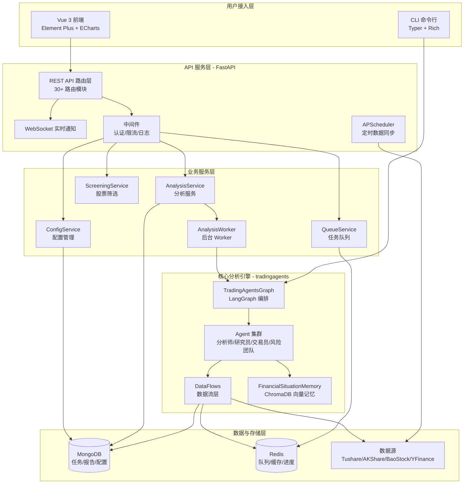
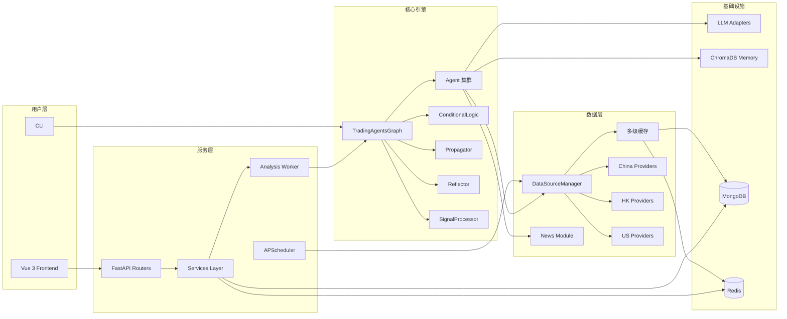
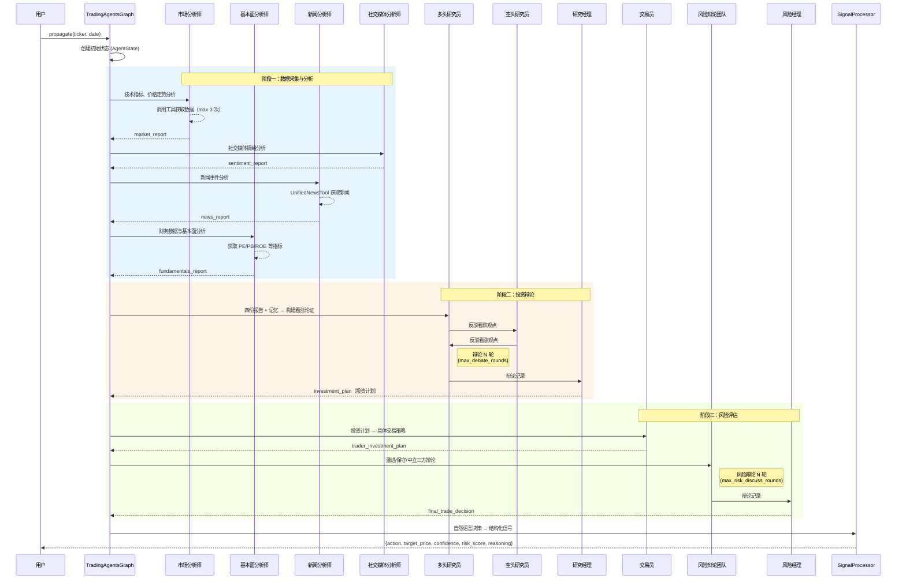
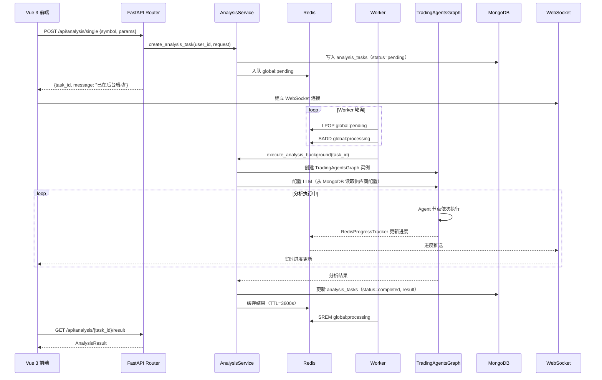

# TradingAgents-CN 源码学习笔记

> 仓库地址：[TradingAgents-CN](https://github.com/hsliuping/TradingAgents-CN)
> 学习日期：2026-03-29

---

> **以下为 AI 源码分析**
>
> ### 一句话概括
>
> 基于 LangGraph 多智能体框架的中文股票分析学习平台，通过市场/基本面/新闻/情绪四大分析师 Agent 协作辩论，输出结构化的投资决策建议。
>
> ### 要点速览
>
> | 核心模块 | 职责 | 关键文件 |
> |---------|------|---------|
> | tradingagents/graph | 多智能体工作流编排（LangGraph StateGraph） | `trading_graph.py`, `setup.py`, `propagation.py` |
> | tradingagents/agents | 4 类分析师 + 2 研究员 + 交易员 + 3 风险辩论者 | `analysts/`, `researchers/`, `trader/`, `risk_mgmt/` |
> | tradingagents/dataflows | 多数据源管理、缓存、A股/港股/美股数据提供者 | `data_source_manager.py`, `providers/`, `cache/` |
> | app (FastAPI) | REST API + WebSocket 实时通知 + 定时任务调度 | `main.py`, `routers/`, `services/`, `worker/` |
> | frontend (Vue 3) | Element Plus UI、Pinia 状态管理、ECharts 图表 | `src/views/`, `src/stores/`, `src/api/` |
> | cli | Typer + Rich 交互式命令行分析工具 | `cli/main.py` |

---

## 项目简介

TradingAgents-CN 是面向中文用户的多智能体与大模型股票分析学习平台，基于 [TauricResearch/TradingAgents](https://github.com/TauricResearch/TradingAgents) 二次开发。项目通过 LangGraph 编排多个 AI Agent（市场分析师、基本面分析师、新闻分析师、社交媒体分析师、多空研究员、交易员、风险辩论团队），对指定股票进行多维度分析并通过辩论机制产出投资决策建议。支持 A 股/港股/美股，集成 Tushare、AKShare、BaoStock 等国内数据源，提供 FastAPI + Vue 3 的 Web 界面和 CLI 两种交互方式。定位为学习与研究用途，不提供实盘交易指令。

## 技术栈

| 类别 | 技术 |
|------|------|
| 语言 | Python 3.10+, TypeScript |
| 后端框架 | FastAPI + Uvicorn |
| 前端框架 | Vue 3 + Vite + Element Plus |
| AI 编排 | LangGraph (StateGraph) + LangChain |
| LLM 适配 | OpenAI / Anthropic / Google / 阿里百炼 / DeepSeek / 智谱 等 |
| 数据库 | MongoDB (Motor 异步驱动) + Redis |
| 向量数据库 | ChromaDB（Agent 历史记忆） |
| 数据源 | Tushare / AKShare / BaoStock / YFinance / Finnhub |
| CLI 框架 | Typer + Rich + Questionary |
| 容器化 | Docker Compose（多架构 amd64 + arm64） |
| 定时调度 | APScheduler (AsyncIOScheduler) |
| 构建工具 | Vite (前端), uv/pip (后端) |
| 依赖管理 | pyproject.toml / package.json + yarn |

## 目录结构

```
TradingAgents-CN/
├── main.py                          # 脚本入口示例（直接调用 TradingAgentsGraph）
├── app/                             # FastAPI 后端应用（专有代码）
│   ├── main.py                      #   应用入口、生命周期管理、路由注册、定时任务
│   ├── core/                        #   核心配置：Settings、数据库连接、Redis 客户端
│   ├── routers/                     #   API 路由层（~30 个路由模块）
│   ├── services/                    #   业务逻辑层（分析、筛选、队列、配置等服务）
│   ├── worker/                      #   后台 Worker（数据同步、分析执行）
│   ├── middleware/                   #   中间件（请求 ID、限流、操作日志、错误处理）
│   ├── models/                      #   数据模型（用户、股票、分析、通知等）
│   └── schemas/                     #   Pydantic 请求/响应模型
├── tradingagents/                   # 核心多智能体分析引擎（开源部分）
│   ├── graph/                       #   LangGraph 工作流编排
│   │   ├── trading_graph.py         #     TradingAgentsGraph 主类
│   │   ├── setup.py                 #     GraphSetup 图构建
│   │   ├── propagation.py           #     状态初始化与传播
│   │   ├── conditional_logic.py     #     条件流转控制（防死循环）
│   │   ├── reflection.py            #     决策反思与记忆更新
│   │   └── signal_processing.py     #     最终决策信号结构化
│   ├── agents/                      #   Agent 节点实现
│   │   ├── analysts/                #     4 个分析师（市场/基本面/新闻/社交媒体）
│   │   ├── researchers/             #     多空研究员（Bull/Bear Researcher）
│   │   ├── managers/                #     研究经理 + 风险经理
│   │   ├── trader/                  #     交易员
│   │   ├── risk_mgmt/              #     3 个风险辩论者（激进/中立/保守）
│   │   └── utils/                   #     AgentState、Toolkit、Memory
│   ├── dataflows/                   #   数据流层
│   │   ├── interface.py             #     统一数据接口（A 股/港股/美股）
│   │   ├── data_source_manager.py   #     数据源管理器（优先级 + 降级）
│   │   ├── providers/               #     数据提供者（china/hk/us）
│   │   ├── cache/                   #     多级缓存（MongoDB/Redis/文件）
│   │   ├── news/                    #     新闻获取（Google/Reddit/中文财经）
│   │   └── technical/               #     技术指标计算
│   ├── llm_adapters/               #   LLM 适配器（DashScope/DeepSeek/Google 等）
│   ├── tools/                       #   Agent 工具（统一新闻工具等）
│   ├── config/                      #   配置管理（数据库配置、运行时设置）
│   └── utils/                       #   工具类（日志、股票类型检测、新闻过滤）
├── frontend/                        # Vue 3 前端应用（专有代码）
│   └── src/
│       ├── views/                   #   页面视图（17 个模块）
│       ├── stores/                  #   Pinia 状态管理（auth/app/notifications）
│       ├── api/                     #   API 请求模块（24 个文件）
│       ├── router/                  #   路由配置
│       └── components/              #   通用组件
├── cli/                             # CLI 交互式分析工具
│   ├── main.py                      #   Typer 命令定义 + Rich Live Display
│   ├── models.py                    #   数据模型（AnalystType 枚举）
│   └── utils.py                     #   交互工具函数
├── config/                          # 配置文件（日志配置 TOML）
├── scripts/                         # 运维脚本（数据库迁移、调试、测试等）
└── docker-compose.yml               # Docker 编排（backend/frontend/MongoDB/Redis）
```

## 架构设计

### 整体架构

TradingAgents-CN 采用**前后端分离 + 多智能体编排引擎**的三层架构设计。前端 Vue 3 通过 REST API 和 WebSocket 与 FastAPI 后端通信；后端服务层负责任务队列管理、配置管理和定时数据同步；核心分析引擎基于 LangGraph StateGraph 编排多个 AI Agent 完成从数据采集到投资决策的完整流程。



### 核心模块

#### 1. 多智能体工作流引擎（tradingagents/graph/）

**职责**：基于 LangGraph StateGraph 编排 10+ 个 AI Agent 节点，实现从数据采集→分析→辩论→决策的完整工作流。

**核心文件**：
- `trading_graph.py` — `TradingAgentsGraph` 主类，负责 LLM 实例创建（支持混合模式）和图的初始化
- `setup.py` — `GraphSetup` 类，构建 StateGraph 拓扑、添加节点和条件边
- `propagation.py` — `Propagator` 类，创建初始状态、配置递归限制
- `conditional_logic.py` — `ConditionalLogic` 类，控制分析师工具调用循环和辩论轮次
- `reflection.py` — `Reflector` 类，基于历史收益反思决策并更新向量记忆
- `signal_processing.py` — `SignalProcessor` 类，将自然语言决策提取为结构化信号

**关键接口**：
- `TradingAgentsGraph.propagate(ticker, date)` — 执行完整分析流程
- `TradingAgentsGraph.reflect_and_remember(returns)` — 反思并记忆决策
- `create_llm_by_provider(provider, model, ...)` — 统一 LLM 工厂方法

#### 2. Agent 集群（tradingagents/agents/）

**职责**：实现 4 类分析师、2 个研究员、1 个交易员、3 个风险辩论者和 2 个管理者，每个 Agent 作为 LangGraph 节点参与工作流。

**角色分工**：

| Agent | 文件 | 职责 |
|-------|------|------|
| Market Analyst | `analysts/market_analyst.py` | 技术指标分析、价格走势、市场趋势 |
| Fundamentals Analyst | `analysts/fundamentals_analyst.py` | PE/PB/ROE 等财务数据分析 |
| News Analyst | `analysts/news_analyst.py` | 新闻事件影响分析 |
| Social Media Analyst | `analysts/social_media_analyst.py` | 社交媒体情绪分析 |
| Bull Researcher | `researchers/bull_researcher.py` | 看涨论证构建 |
| Bear Researcher | `researchers/bear_researcher.py` | 看跌论证构建 |
| Research Manager | `managers/research_manager.py` | 辩论裁判，产出投资计划 |
| Trader | `trader/trader.py` | 基于投资计划制定具体交易策略 |
| Aggressive Debater | `risk_mgmt/aggresive_debator.py` | 激进风险立场 |
| Conservative Debater | `risk_mgmt/conservative_debator.py` | 保守风险立场 |
| Neutral Debater | `risk_mgmt/neutral_debator.py` | 中立风险立场 |
| Risk Manager | `managers/risk_manager.py` | 风险辩论裁判，产出最终决策 |

**关键数据结构**（`agent_states.py`）：
- `AgentState(MessagesState)` — 主工作流状态，包含股票信息、4 份分析报告、辩论状态、最终决策
- `InvestDebateState` — 投资辩论状态（多空历史、轮次计数）
- `RiskDebateState` — 风险辩论状态（三方历史、最新发言）

#### 3. 数据流层（tradingagents/dataflows/）

**职责**：统一管理多市场（A 股/港股/美股）多数据源的数据获取、缓存和降级。

**核心文件**：
- `data_source_manager.py` — 数据源管理器，支持优先级配置和自动降级
- `interface.py` — 统一数据接口，根据股票代码自动路由到对应市场提供者
- `providers/china/` — 中国 A 股提供者（Tushare/AKShare/BaoStock）
- `providers/hk/` — 港股提供者
- `providers/us/` — 美股提供者（YFinance/AlphaVantage/Finnhub）
- `cache/` — 多级缓存系统（MongoDB → Redis → 文件）

**数据源降级链**：
```
A股: MongoDB缓存 → AKShare → Tushare → BaoStock
港股: MongoDB缓存 → AKShare港股 → YFinance
美股: MongoDB缓存 → YFinance → AlphaVantage → Finnhub
```

#### 4. FastAPI 后端服务（app/）

**职责**：提供 REST API、WebSocket 实时通知、任务队列管理、定时数据同步和系统配置管理。

**核心文件**：
- `main.py` — 应用入口，生命周期管理（数据库初始化、调度器启动）、路由注册、中间件配置
- `services/simple_analysis_service.py` — 分析服务主逻辑，调用 TradingAgentsGraph
- `services/queue_service.py` — Redis 队列服务，支持用户级/全局并发限制
- `worker/analysis_worker.py` — 后台 Worker 进程，消费队列并执行分析
- `services/websocket_manager.py` — WebSocket 连接管理和进度推送
- `services/config_service.py` — 系统配置服务（LLM 配置、数据源配置）

#### 5. Vue 3 前端（frontend/）

**职责**：提供现代化 Web 界面，包括股票分析、筛选、自选股管理、模拟交易、报告查看和系统管理。

**页面模块**：Dashboard（仪表板）、Analysis（单股/批量分析）、Screening（股票筛选）、Favorites（自选股）、Stocks（个股详情）、Reports（分析报告）、PaperTrading（模拟交易）、Learning（学习中心）、Settings（系统管理）

**状态管理（Pinia）**：
- `auth.ts` — JWT 认证、Token 自动刷新、用户信息
- `app.ts` — 主题切换、侧边栏、用户偏好、API 连接检测
- `notifications.ts` — WebSocket 连接管理、实时通知

### 模块依赖关系



## 核心流程

### 流程一：多智能体股票分析工作流

这是项目最核心的流程——从用户提交分析请求到产出最终投资决策的完整 Agent 协作链路。



**关键逻辑说明**：

1. **分析师工具调用循环**：每个分析师通过 `ConditionalLogic.should_continue_*` 控制工具调用次数（最多 3 次），防止 LLM 陷入死循环。当报告长度 > 100 字符或工具调用达到上限时，自动流转到下一节点。

2. **投资辩论机制**：Bull Researcher 和 Bear Researcher 基于四份分析报告 + ChromaDB 历史记忆进行多轮辩论，Research Manager 作为裁判综合双方论点产出投资计划。

3. **风险辩论机制**：三个风险立场的 Agent（激进/保守/中立）对交易员的策略进行多角度风险评估，Risk Manager 产出最终决策。

4. **信号结构化**：`SignalProcessor` 调用 LLM 将自然语言决策提取为 `{action, target_price, confidence, risk_score, reasoning}` 的 JSON 格式。

### 流程二：Web 端股票分析请求处理流程

从前端提交分析请求到接收实时进度更新和最终结果的完整链路。



**关键逻辑说明**：

1. **异步非阻塞**：API 立即返回 `task_id`，分析在 `BackgroundTasks` 中异步执行，避免 HTTP 超时。

2. **并发控制**：`QueueService` 通过 Redis Set 实现用户级（默认 3）和全局级（默认 50）并发限制。

3. **进度追踪**：`RedisProgressTracker` 动态生成分析步骤并计算预估时间，通过 WebSocket 实时推送到前端。

4. **LLM 配置热加载**：每次分析任务从 MongoDB `system_configs` 集合读取最新的 LLM 供应商/模型/API Key 配置，支持运行时动态切换模型。

## 关键设计亮点

### 1. LangGraph 多智能体辩论架构

**解决的问题**：单一 LLM 分析容易产生偏见，缺乏多角度审视。

**实现方式**：基于 LangGraph StateGraph 构建了两轮辩论机制。第一轮是投资辩论——多头研究员和空头研究员基于相同数据从对立角度论证，研究经理作为裁判；第二轮是风险辩论——激进/保守/中立三种风险立场交叉辩论，风险经理综合产出最终决策。通过 `ConditionalLogic` 控制辩论轮次（`max_debate_rounds` / `max_risk_discuss_rounds`），在深度和效率间取得平衡。

**关键文件**：`tradingagents/graph/setup.py`（图构建）、`tradingagents/agents/researchers/`（多空研究员）、`tradingagents/agents/risk_mgmt/`（风险辩论者）

**设计原因**：模拟真实投资机构中多部门交叉审查的决策流程，通过对抗性辩论减少 LLM 的确认偏误。

### 2. 数据源自动降级与多级缓存

**解决的问题**：单一数据源不稳定（限流、API 不可用），频繁网络请求导致分析缓慢。

**实现方式**：`DataSourceManager` 维护按优先级排序的数据源列表（支持从 MongoDB 动态配置）。当主数据源失败或返回质量异常时（结果含 "❌" 标记或长度 < 100 字符），自动切换到下一个数据源。缓存层采用三级架构：MongoDB 缓存 → Redis 缓存 → 文件缓存，通过 `IntegratedCacheManager` 统一管理，按数据类型配置不同 TTL。

**关键文件**：`tradingagents/dataflows/data_source_manager.py`、`tradingagents/dataflows/cache/integrated.py`、`tradingagents/dataflows/cache/adaptive.py`

**设计原因**：金融数据源的免费 API 普遍有限流和不稳定问题，多源降级 + 多级缓存确保分析流程不会因单点数据源故障而中断。

### 3. Agent 死循环防护机制

**解决的问题**：LLM 有时会反复调用同一工具，导致分析流程陷入无限循环。

**实现方式**：在 `AgentState` 中为每个分析师维护独立的工具调用计数器（如 `market_tool_call_count`）。`ConditionalLogic` 的条件判断函数在每次决策时检查计数器是否达到阈值（默认 3 次），达到则强制流转到消息清理节点（`Msg Clear`），结束当前分析师的工具调用循环。

**关键文件**：`tradingagents/agents/utils/agent_states.py`（计数器定义）、`tradingagents/graph/conditional_logic.py`（条件判断）

**设计原因**：不同 LLM 提供商（特别是国产模型）在 function calling 行为上存在差异，部分模型会重复调用工具而不产出最终报告。硬性工具调用上限是最可靠的防护措施。

### 4. 多 LLM 供应商适配与混合模式

**解决的问题**：不同任务适合不同模型（快速任务用小模型、深度推理用大模型），且需要支持国内外多家 LLM 供应商。

**实现方式**：`create_llm_by_provider()` 工厂方法统一创建 LLM 实例，支持 OpenAI/Anthropic/Google/阿里百炼/DeepSeek/智谱/SiliconFlow/OpenRouter/Ollama 等供应商。`TradingAgentsGraph` 支持「混合模式」——快速思考模型（分析师）和深度思考模型（管理者）可以来自不同供应商。通过 `llm_adapters/` 下的适配器（`ChatDashScopeOpenAI`、`ChatGoogleOpenAI`、`ChatDeepSeek`）将非标准 API 统一为 LangChain 接口。

**关键文件**：`tradingagents/graph/trading_graph.py`（LLM 创建逻辑）、`tradingagents/llm_adapters/`（适配器实现）

**设计原因**：中国用户面临 API 访问限制，需要灵活选择国产/国际模型。混合模式允许用低成本模型处理大量分析任务、用高能力模型处理关键决策，优化成本与效果的平衡。

### 5. ChromaDB 向量记忆与决策反思

**解决的问题**：每次分析都是独立的，无法从历史决策的成功/失败中学习。

**实现方式**：`FinancialSituationMemory` 基于 ChromaDB 向量数据库存储历史分析场景和决策反思。每次分析时，Agent 通过语义检索获取最相似的历史情境（`get_memories(situation, n_matches=2)`），将过去的经验教训注入 prompt。分析完成后，`Reflector` 根据实际收益反思每个组件的表现，提取经验教训并更新向量记忆。支持多种嵌入提供商（OpenAI/DashScope/Ollama），失败时优雅降级为零向量。

**关键文件**：`tradingagents/agents/utils/memory.py`（FinancialSituationMemory + ChromaDBManager）、`tradingagents/graph/reflection.py`（Reflector）

**设计原因**：金融市场存在周期性模式，通过语义检索匹配相似历史场景，让 Agent 能够「记住」过去的错误判断并在类似情况下做出更好的决策。
