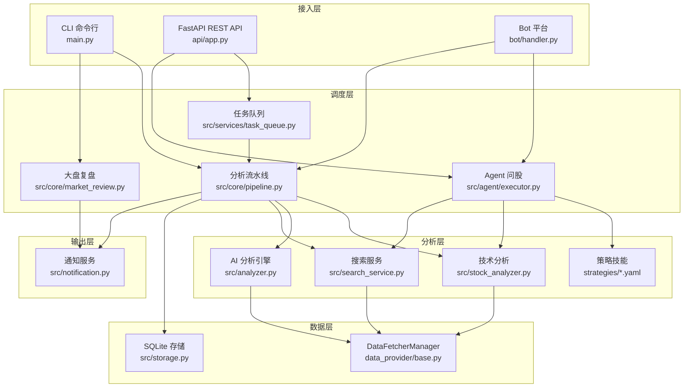
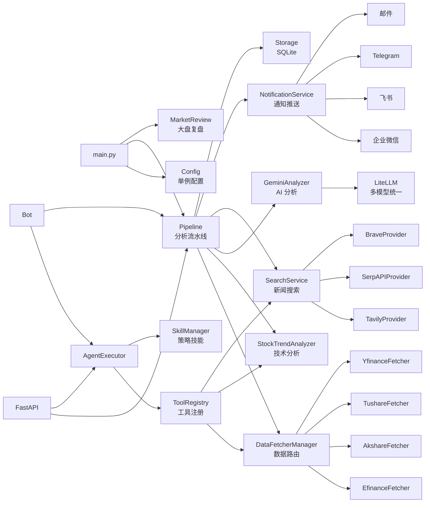
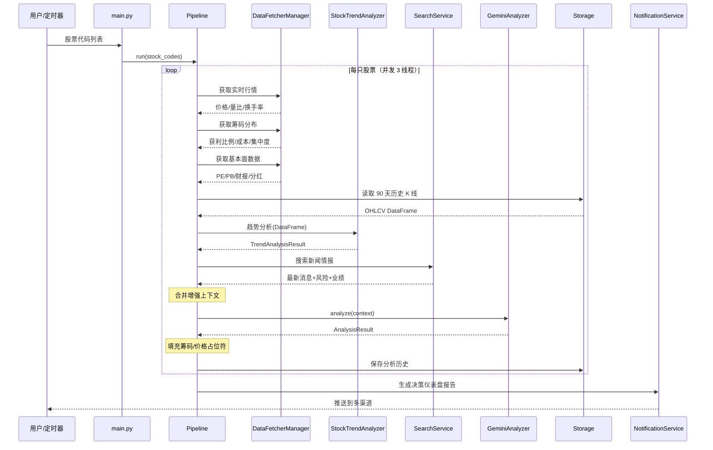

# daily_stock_analysis 源码学习笔记

> 仓库地址：[daily_stock_analysis](https://github.com/ZhuLinsen/daily_stock_analysis)
> 学习日期：2026-03-22

---

> **以下为 AI 源码分析**
>
> ### 一句话概括
>
> 基于 AI 大模型的 A股/港股/美股自选股智能分析系统，每日自动分析并推送「决策仪表盘」到企业微信/飞书/Telegram 等多渠道。
>
> ### 要点速览
>
> | 核心模块 | 职责 | 关键文件 |
> |---------|------|---------|
> | 分析流水线 | 协调数据获取→技术分析→AI分析→推送的完整流程 | `src/core/pipeline.py` |
> | 数据提供层 | 多数据源优先级路由，支持 6 种数据源自动降级 | `data_provider/base.py` |
> | 技术分析器 | MA/MACD/RSI 等指标计算与趋势判断 | `src/stock_analyzer.py` |
> | AI 分析引擎 | 通过 LiteLLM 调用多种大模型生成决策仪表盘 | `src/analyzer.py` |
> | Agent 系统 | ReAct 循环 + 多 Agent 编排，支持策略问股 | `src/agent/executor.py`, `src/agent/orchestrator.py` |
> | 通知服务 | 10+ 推送渠道，支持 Markdown 转图片 | `src/notification.py` |
> | Web 界面 | FastAPI 后端 + Vue 前端，完整管理功能 | `api/app.py`, `apps/dsa-web/` |
> | Bot 平台 | 飞书/钉钉/Discord 等机器人命令交互 | `bot/dispatcher.py` |

---

## 项目简介

daily_stock_analysis 是一个基于 AI 大模型的全球股票智能分析系统，覆盖 A股、港股、美股三大市场。系统通过多数据源聚合实时行情与历史数据，结合技术面分析（MA/MACD/RSI/筹码分布）和 AI 大模型多维度分析（基本面/舆情/风险），自动生成包含核心结论、精确买卖点位和操作检查清单的「决策仪表盘」。支持 GitHub Actions 零成本自动化运行，并将结果推送到企业微信、飞书、Telegram、邮件等 10 余种渠道。同时提供 Web 管理界面和多平台 Bot 交互入口，支持 Agent 策略问股、AI 回测验证等进阶功能。

## 技术栈

| 类别 | 技术 |
|------|------|
| 语言 | Python 3.10+ |
| 框架 | FastAPI（后端）, Vue.js（前端 `apps/dsa-web`） |
| 构建工具 | npm（前端）, Docker/GitHub Actions（部署） |
| 依赖管理 | pip + `requirements.txt` |
| 测试框架 | pytest |
| AI 集成 | LiteLLM（统一 Gemini/Claude/OpenAI/DeepSeek/Ollama） |
| 数据源 | AkShare, efinance, Tushare, pytdx, BaoStock, YFinance, TickFlow |
| 搜索引擎 | Tavily, SerpAPI, Brave, Bocha, SearXNG |
| 数据库 | SQLite + SQLAlchemy ORM |
| 定时调度 | schedule 库 + GitHub Actions Cron |

## 目录结构

```
daily_stock_analysis/
├── main.py                     # 程序主入口，命令行参数解析与模式调度
├── server.py                   # FastAPI 服务独立启动入口
├── webui.py                    # Web UI 启动快捷入口
├── analyzer_service.py         # 分析服务独立启动入口
├── src/                        # 核心业务逻辑
│   ├── config.py               # 全局配置（单例模式，环境变量驱动）
│   ├── analyzer.py             # AI 分析引擎（LLM 调用，AnalysisResult 数据类）
│   ├── stock_analyzer.py       # 技术面分析（MA/MACD/RSI/量能/支撑压力）
│   ├── market_analyzer.py      # 大盘分析器
│   ├── notification.py         # 通知推送服务（10+ 渠道聚合）
│   ├── search_service.py       # 多引擎新闻搜索（负载均衡 + 降级）
│   ├── storage.py              # 数据库操作层
│   ├── core/                   # 核心调度模块
│   │   ├── pipeline.py         # 分析流水线（主调度器）
│   │   ├── market_review.py    # 大盘复盘流程
│   │   ├── market_strategy.py  # 市场策略系统
│   │   ├── trading_calendar.py # 交易日历（A/H/US 节假日判断）
│   │   └── config_manager.py   # 配置管理器
│   ├── agent/                  # Agent 智能问股系统
│   │   ├── executor.py         # 单 Agent ReAct 执行器
│   │   ├── orchestrator.py     # 多 Agent 编排器
│   │   ├── factory.py          # Agent 工厂（缓存 + 原型克隆）
│   │   ├── skills/             # 策略技能系统（YAML/Markdown 定义）
│   │   ├── agents/             # 专门化 Agent（技术/情报/风险/决策）
│   │   └── tools/              # Agent 工具注册中心
│   ├── services/               # 业务服务层
│   │   ├── analysis_service.py # 分析任务服务
│   │   ├── backtest_service.py # 回测服务
│   │   ├── portfolio_service.py# 投资组合管理
│   │   ├── task_queue.py       # 异步任务队列
│   │   └── ...
│   └── notification_sender/    # 各渠道发送器实现
├── data_provider/              # 数据源层（多源路由 + 降级）
│   ├── base.py                 # 基类 + DataFetcherManager 路由器
│   ├── akshare_fetcher.py      # AkShare（优先级 1，东财/新浪/腾讯三层）
│   ├── efinance_fetcher.py     # efinance（优先级 0，东财直连）
│   ├── tushare_fetcher.py      # Tushare Pro（优先级 2）
│   ├── yfinance_fetcher.py     # YFinance（优先级 4，国际兜底）
│   └── ...
├── api/                        # FastAPI REST API
│   ├── app.py                  # 应用工厂 + 中间件
│   └── v1/                     # v1 版本 API
│       ├── router.py           # 路由聚合
│       ├── endpoints/          # 各端点（analysis, agent, stocks...）
│       └── schemas/            # 请求/响应 Schema
├── bot/                        # Bot 平台集成
│   ├── dispatcher.py           # 命令分发 + 频率限制
│   ├── handler.py              # Webhook 统一入口
│   ├── commands/               # 命令处理器（analyze, chat, ask...）
│   └── platforms/              # 平台适配器（飞书, 钉钉, Discord...）
├── strategies/                 # 交易策略技能定义（YAML 格式）
├── templates/                  # Jinja2 报告模板
├── apps/dsa-web/               # Vue.js 前端项目
├── docker/                     # Docker 部署配置
└── tests/                      # 测试用例（90+ 测试文件）
```

## 架构设计

### 整体架构

系统采用**分层架构 + 管道模式**设计，自上而下分为接入层、调度层、分析层、数据层四大层级。接入层包含 CLI、Web API 和 Bot 三种入口，统一调用核心分析流水线。分析层通过技术面量化分析和 AI 大模型多维度分析相结合，生成结构化的决策仪表盘。数据层实现了 6 种数据源的优先级路由和自动降级机制。



### 核心模块

#### 1. 分析流水线（StockAnalysisPipeline）

**职责**：协调整个个股分析流程，管理并发和错误处理

**核心文件**：`src/core/pipeline.py`

**关键方法**：
- `run()` - 批量运行分析，使用 ThreadPoolExecutor 并发控制（默认 3 线程）
- `analyze_stock()` - 单股分析主流程，包含 8 个步骤
- `_enhance_context()` - 上下文增强，将实时行情/筹码/趋势/基本面合并为 AI 输入

**与其他模块关系**：
- 调用 `DataFetcherManager` 获取行情数据
- 调用 `StockTrendAnalyzer` 执行技术面分析
- 调用 `GeminiAnalyzer` 执行 AI 分析
- 调用 `SearchService` 获取新闻情报
- 调用 `NotificationService` 推送结果

#### 2. 数据提供层（DataFetcherManager）

**职责**：多数据源统一管理、优先级路由和自动降级

**核心文件**：`data_provider/base.py`

**关键接口**：
- `get_daily_data()` - 获取历史 K 线数据
- `get_realtime_quote()` - 获取实时行情
- `get_chip_distribution()` - 获取筹码分布
- `get_fundamental_context()` - 获取基本面数据

**数据源优先级**：
| 优先级 | 数据源 | 说明 |
|-------|--------|------|
| 0 | EfinanceFetcher | 东财直连，国内最全 |
| 1 | AkshareFetcher | AkShare 库，东财/新浪/腾讯三层 |
| 2 | TushareFetcher | Tushare Pro API |
| 2 | PytdxFetcher | 通达信行情服务器 |
| 3 | BaostockFetcher | 证券宝数据 |
| 4 | YfinanceFetcher | Yahoo Finance 国际兜底 |

#### 3. 技术分析器（StockTrendAnalyzer）

**职责**：基于历史 K 线数据计算技术指标并生成交易信号

**核心文件**：`src/stock_analyzer.py`

**关键类**：`TrendAnalysisResult` - 趋势分析结果数据类，包含：
- 趋势状态（7 种：强势多头→强势空头）
- MACD 状态（7 种：金叉发散→死叉发散）
- RSI 状态（5 种：超买→超卖）
- 量能状态（5 种：巨量→极度缩量）
- 综合信号评分（0-100 分制，6 档买卖信号）

**评分体系**：趋势(30分) + 乖离率(20分) + 量能(15分) + 支撑(10分) + MACD(15分) + RSI(10分) = 100分

#### 4. AI 分析引擎（GeminiAnalyzer）

**职责**：通过 LiteLLM 统一调用多种大模型，生成结构化决策仪表盘

**核心文件**：`src/analyzer.py`

**关键数据结构**：`AnalysisResult` - 分析结果数据类
- `sentiment_score`（0-100）- 综合评分
- `operation_advice` - 操作建议（买入/加仓/持有/减仓/卖出/观望）
- `dashboard` 字典 - 决策仪表盘（核心结论 + 数据透视 + 情报 + 作战计划）

#### 5. Agent 问股系统

**职责**：支持多轮策略问答，ReAct 循环 + 多 Agent 编排

**核心文件**：
- `src/agent/executor.py` - 单 Agent ReAct 执行器
- `src/agent/orchestrator.py` - 多 Agent 编排器
- `src/agent/factory.py` - Agent 工厂（单例缓存 + 原型克隆）
- `src/agent/skills/base.py` - 策略技能加载与管理

**多 Agent 编排模式**：
| 模式 | Agent 管道 |
|------|-----------|
| quick | 技术分析 → 决策 |
| standard | 技术 → 情报 → 决策 |
| full | 技术 → 情报 → 风险 → 决策 |
| specialist | 技术 → 情报 → 风险 → 专家 → 决策 |

### 模块依赖关系



## 核心流程

### 流程一：个股分析流水线

这是系统最核心的业务流程，从接收股票代码到输出推送报告的完整链路。



**关键步骤说明**：

1. **实时行情获取**：DFM 根据市场类型路由到对应数据源，A 股优先使用 efinance/AkShare 全量缓存（20 分钟 TTL），美股直接使用 YFinance
2. **技术面分析**：`StockTrendAnalyzer.analyze()` 计算 MA/MACD/RSI/量能等 10+ 指标，通过 100 分制评分系统生成 6 档买卖信号
3. **上下文增强**：`_enhance_context()` 将实时行情、筹码、趋势、基本面、盘中实时 MA 合并为结构化上下文
4. **AI 分析**：通过 LiteLLM 调用配置的大模型，输入增强上下文，输出结构化 `AnalysisResult`（含决策仪表盘 JSON）
5. **报告推送**：根据配置的渠道类型生成对应格式（Markdown/图片/精简版），同时推送到所有已配置渠道

### 流程二：Agent 策略问股

Agent 问股是系统的高级交互模式，支持多轮策略对话和多 Agent 协作分析。

```mermaid
sequenceDiagram
    participant User as 用户
    participant API as FastAPI/Bot
    participant Factory as AgentFactory
    participant Exec as AgentExecutor
    participant LLM as LiteLLM
    participant Tools as ToolRegistry
    participant DFM as DataFetcherManager

    User->>API: 用缠论分析 600519
    API->>Factory: 构建 Executor

    Factory->>Factory: 获取 ToolRegistry（单例）
    Factory->>Factory: 克隆 SkillManager（原型+deepcopy）
    Factory-->>Exec: 创建 AgentExecutor

    Note over Exec: 构建系统提示<br/>注入激活技能指令

    loop ReAct 循环（最多 max_steps 步）
        Exec->>LLM: 系统提示 + 用户消息 + 工具声明
        LLM-->>Exec: 思考 + 工具调用请求

        alt 阶段1: 行情与K线
            Exec->>Tools: get_realtime_quote
            Tools->>DFM: 获取实时行情
            DFM-->>Exec: 行情数据
        else 阶段2: 技术与筹码
            Exec->>Tools: analyze_trend
            Tools-->>Exec: 趋势分析结果
        else 阶段3: 情报搜索
            Exec->>Tools: search_stock_news
            Tools-->>Exec: 新闻情报
        else 阶段4: 生成报告
            Note over Exec: LLM 输出决策仪表盘 JSON
        end

        Exec->>LLM: 工具结果反馈
    end

    Exec-->>API: 决策仪表盘
    API-->>User: 分析报告
```



**关键设计说明**：

1. **ReAct 循环**：Agent 遵循"思考→行动→观察"循环，系统提示约束工具调用必须按 4 个阶段顺序执行
2. **技能注入**：激活的交易技能（如缠论、波浪理论）以自然语言指令注入 LLM 系统提示，改变模型分析行为
3. **多 Agent 编排**：配置 `AGENT_ARCH=multi` 后，切换为编排模式，Technical → Intel → Risk → Decision 各 Agent 顺序执行，通过 `AgentContext` 共享状态
4. **工厂模式性能优化**：ToolRegistry 全局单例缓存，SkillManager 通过原型 + deepcopy 克隆保证线程安全

## 关键设计亮点

### 1. 多数据源优先级路由与自动降级

**解决问题**：单一数据源不稳定（限流、宕机、数据缺失），需保证数据获取的高可用性

**实现方式**：`data_provider/base.py` 中 `DataFetcherManager` 实现了 6 种数据源的优先级路由。每个数据源定义优先级（0-4），请求时按优先级依次尝试。A 股数据优先使用 efinance（P0），失败自动降级到 AkShare（P1），再到 Tushare（P2）等。美股直接路由 YFinance。同时引入熔断器模式（circuit breaker），连续失败后自动冷却。AkShare 内部还实现了东财→新浪→腾讯的三层子降级。

**设计理由**：国内行情数据源生态碎片化，单源可靠性不足。通过多层降级 + 熔断保护，在批量分析 30+ 只股票时仍能保持高成功率，同时避免频繁重试加剧限流。

### 2. 技术面量化评分体系

**解决问题**：将主观的技术分析判断转化为可量化、可比较的标准化信号

**实现方式**：`src/stock_analyzer.py` 中 `StockTrendAnalyzer` 实现了 100 分制综合评分系统。将趋势（30分）、乖离率（20分）、量能（15分）、支撑（10分）、MACD（15分）、RSI（10分）六个维度量化打分。趋势状态细分为 7 档（强势多头→强势空头），量能状态 5 档，MACD 状态 7 档。最终根据总分和趋势方向生成 6 档买卖信号。

**设计理由**：技术分析本质是定性判断，不同分析师结论可能完全不同。通过标准化评分体系，既为 AI 分析提供结构化输入（而非原始 K 线数据），又让用户能快速比较不同股票的技术面状况。

### 3. Agent 策略技能的声明式设计

**解决问题**：支持用户自定义交易策略，无需修改代码

**实现方式**：`src/agent/skills/base.py` 的 `SkillManager` 支持从 `strategies/` 目录加载 YAML 文件或 SKILL.md Markdown 束作为策略技能。每个技能定义 name、description、instructions（自然语言指令），在 Agent 运行时动态注入 LLM 系统提示。技能管理器支持按 category（趋势/形态/反转/框架）分组，支持 `activate(["skill1", "skill2"])` 动态激活。工厂层使用原型 + deepcopy 模式，首次加载缓存原型，后续请求克隆副本。

**设计理由**：交易策略千变万化，硬编码无法满足需求。通过声明式 YAML/Markdown 定义，用户只需编写自然语言策略描述即可扩展系统能力，实现了"策略即配置"的设计理念。

### 4. 上下文增强管道

**解决问题**：AI 大模型需要丰富、结构化的输入上下文才能生成高质量分析

**实现方式**：`src/core/pipeline.py` 中 `_enhance_context()` 方法实现了上下文逐层增强。按顺序合并实时行情（价格/量比/换手率/PE）、筹码分布（获利比例/成本/集中度）、技术面分析结果（趋势/信号/评分）、基本面数据（财报/分红/板块）、盘中实时 MA 指标。每层数据独立获取，失败时通过占位符降级（`fill_chip_structure_if_needed`、`fill_price_position_if_needed`），确保 AI 总能收到完整格式的上下文。

**设计理由**：大模型的分析质量直接取决于输入上下文的丰富度和结构化程度。通过管道式增强，将多个异构数据源的信息统一为结构化上下文，同时 fail-open 降级保证了主链路不因单个数据缺失而中断。

### 5. 多渠道通知聚合与报告适配

**解决问题**：不同推送渠道有不同的格式限制和能力差异（如企业微信 4000 字限制、Telegram 不支持 Markdown 表格等）

**实现方式**：`src/notification.py` 中 `NotificationService` 统一管理 10+ 推送渠道，各渠道独立实现在 `src/notification_sender/` 下。报告生成支持多种格式：完整 Markdown、精简版（企微适配）、图片模式（通过 `src/md2img.py` 转换）、纯文本摘要。支持合并推送（个股 + 大盘复盘合并为一条消息），支持股票分组路由到不同邮箱。

**设计理由**：用户可能同时使用多个渠道（如飞书接收即时通知、邮件存档、Telegram 移动端查看），每个渠道的限制不同。通过渠道适配器模式，核心报告生成只写一次，各渠道按自身能力自动适配格式。
