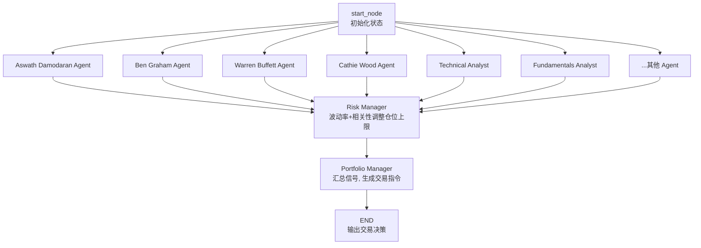
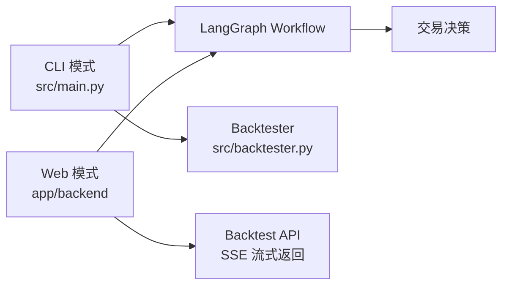
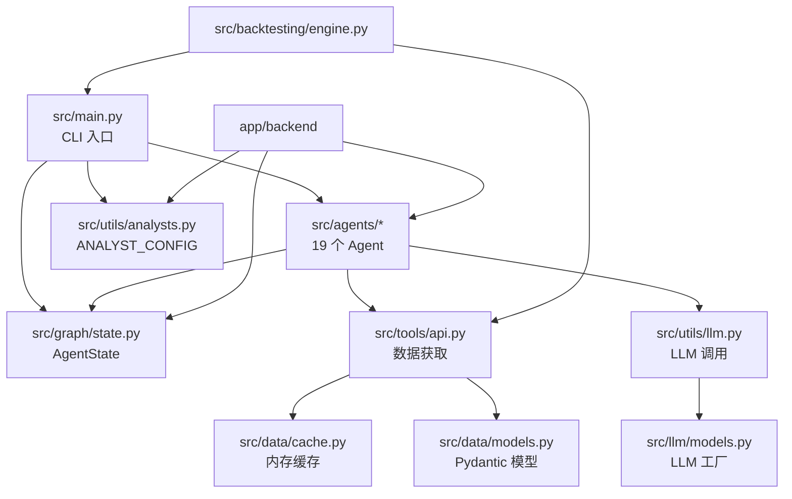
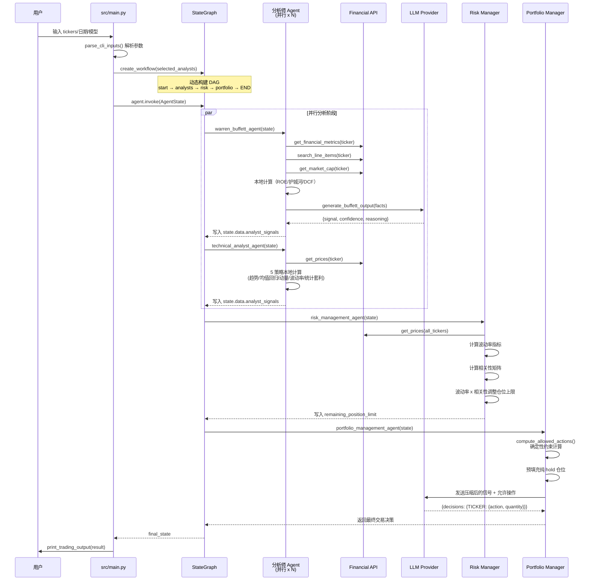
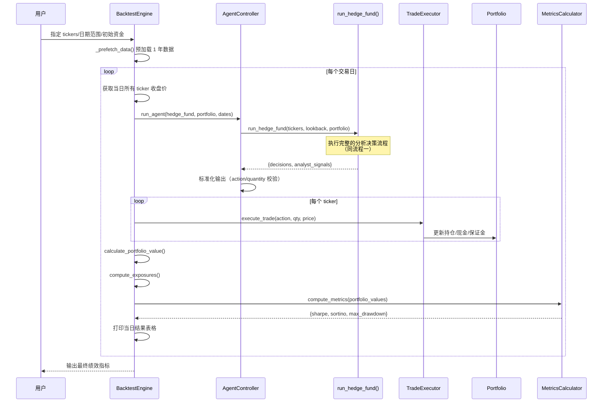

# ai-hedge-fund 源码学习笔记

> 仓库地址：[ai-hedge-fund](https://github.com/virattt/ai-hedge-fund)
> 学习日期：2026-04-05

---

> **以下为 AI 源码分析**
>
> ### 一句话概括
>
> 一个基于 LangGraph 多 Agent 协作的 AI 对冲基金系统，模拟 18 位知名投资大师的投资风格，通过并行分析、风险管理和组合管理三阶段流水线生成股票交易决策。
>
> ### 要点速览
>
> | 核心模块 | 职责 | 关键文件 |
> |---------|------|---------|
> | Agent 系统 | 19 个分析师 Agent，模拟不同投资大师风格 | `src/agents/*.py` |
> | Graph 编排 | 基于 LangGraph 的 DAG 工作流编排 | `src/main.py`, `src/graph/state.py` |
> | 数据层 | Financial Datasets API 数据获取与缓存 | `src/tools/api.py`, `src/data/cache.py` |
> | 回测引擎 | 按交易日循环的历史回测框架 | `src/backtesting/engine.py` |
> | Web 应用 | React + FastAPI 全栈可视化界面 | `app/frontend/`, `app/backend/` |
> | LLM 适配 | 多 LLM 提供商统一接入（13 个 provider） | `src/llm/models.py`, `src/utils/llm.py` |

---

## 项目简介

ai-hedge-fund 是一个教育用途的 AI 对冲基金概念验证项目。它利用 LLM（大语言模型）模拟 18 位世界知名投资大师（如 Warren Buffett、Charlie Munger、Cathie Wood 等）的投资分析风格，对股票进行多维度并行分析，最终由 Risk Manager 和 Portfolio Manager 汇总生成交易决策。系统支持 CLI 命令行和 Web UI 两种运行模式，并提供历史回测功能。**注意：该项目纯为学习研究，不进行实际交易。**

## 技术栈

| 类别 | 技术 |
|------|------|
| 语言 | Python 3.11+, TypeScript |
| 框架 | LangChain + LangGraph（Agent 编排）, FastAPI（后端 API）, React + Vite（前端） |
| 构建工具 | Poetry（Python）, pnpm/npm（前端）, Docker |
| 依赖管理 | Poetry（pyproject.toml）, pnpm（package.json） |
| 测试框架 | pytest |

## 目录结构

```
ai-hedge-fund/
├── src/                          # 核心业务逻辑（CLI 模式入口）
│   ├── main.py                   # CLI 入口，创建 LangGraph 工作流并执行
│   ├── backtester.py             # 回测 CLI 入口
│   ├── agents/                   # 19 个分析师 Agent 实现
│   │   ├── warren_buffett.py     # 巴菲特风格：价值投资 + DCF 估值
│   │   ├── technicals.py         # 技术分析：趋势/均值回归/动量/波动率
│   │   ├── fundamentals.py       # 基本面分析：盈利能力/成长/财务健康
│   │   ├── risk_manager.py       # 风险管理：波动率 + 相关性调整仓位上限
│   │   ├── portfolio_manager.py  # 组合管理：汇总信号生成最终交易决策
│   │   └── ...                   # 其余 14 位投资大师 Agent
│   ├── backtesting/              # 回测引擎组件
│   │   ├── engine.py             # BacktestEngine：按日循环的回测主逻辑
│   │   ├── controller.py         # AgentController：Agent 调用与输出标准化
│   │   ├── trader.py             # TradeExecutor：交易执行
│   │   ├── portfolio.py          # Portfolio：持仓状态管理
│   │   ├── metrics.py            # 绩效指标计算（Sharpe/Sortino/MaxDrawdown）
│   │   └── valuation.py          # 组合估值与敞口计算
│   ├── graph/
│   │   └── state.py              # AgentState：LangGraph 共享状态定义
│   ├── tools/
│   │   └── api.py                # Financial Datasets API 封装（价格/财务指标/内幕交易/新闻）
│   ├── data/
│   │   ├── models.py             # Pydantic 数据模型（Price/FinancialMetrics/InsiderTrade 等）
│   │   └── cache.py              # 内存缓存层
│   ├── llm/
│   │   └── models.py             # LLM 模型注册与工厂（13 个 provider）
│   ├── utils/
│   │   ├── analysts.py           # ANALYST_CONFIG：所有 Agent 的注册配置（单一真相源）
│   │   ├── llm.py                # call_llm()：统一 LLM 调用（重试 + 结构化输出）
│   │   └── progress.py           # 进度追踪
│   └── cli/
│       └── input.py              # CLI 参数解析与交互式选择
├── app/                          # Web 全栈应用
│   ├── backend/                  # FastAPI 后端
│   │   ├── main.py               # FastAPI 应用入口
│   │   ├── routes/               # API 路由（hedge_fund/flows/api_keys 等）
│   │   ├── services/             # 业务服务层（graph/backtest/portfolio）
│   │   ├── database/             # SQLAlchemy 数据库连接
│   │   └── models/               # 请求/响应 Schema
│   └── frontend/                 # React + TypeScript 前端
│       └── src/
│           ├── nodes/            # React Flow 节点组件
│           ├── components/       # UI 组件
│           └── services/         # API 调用服务
├── tests/                        # 测试用例
├── docker/                       # Docker 部署配置
└── pyproject.toml                # Python 项目配置
```

## 架构设计

### 整体架构

ai-hedge-fund 采用 **多 Agent 并行分析 + 串行决策** 的流水线架构。核心思想是将投资分析拆解为多个独立的分析师 Agent，每个 Agent 模拟一位投资大师的风格，并行对目标股票进行分析，最终由 Risk Manager 汇总风险约束、Portfolio Manager 做出最终交易决策。

整个系统基于 LangGraph 的 `StateGraph` 实现 DAG（有向无环图）编排，Agent 之间通过共享的 `AgentState` 传递数据。



系统还提供两种运行入口：



### 核心模块

#### 1. Agent 系统（`src/agents/`）

项目的核心是 19 个 Agent，分为三类：

**投资大师 Agent（13 个）：** 每个模拟一位投资大师的分析风格，输出 `{signal, confidence, reasoning}`：
- `warren_buffett.py` — 价值投资，分析 ROE/护城河/管理层/所有者盈余，计算 DCF 内在价值
- `ben_graham.py` — 安全边际，关注低估值和强基本面
- `cathie_wood.py` — 成长投资，关注创新和颠覆性技术
- `michael_burry.py` — 逆向投资，寻找深度价值
- `charlie_munger.py` — 理性决策，只买优质企业
- 等 8 位其他大师...

**量化分析 Agent（5 个）：**
- `technicals.py` — 技术分析：EMA/ADX/Bollinger Bands/RSI/Hurst 指数等 5 大策略加权组合
- `fundamentals.py` — 基本面分析：盈利能力/成长性/财务健康/估值四维评分
- `sentiment.py` — 市场情绪分析
- `news_sentiment.py` — 新闻情绪分析
- `valuation.py` — 估值分析
- `growth_agent.py` — 成长分析

**管理 Agent（2 个）：**
- `risk_manager.py` — 基于波动率和相关性矩阵计算每只股票的仓位上限
- `portfolio_manager.py` — 汇总所有 Agent 信号，通过 LLM 生成最终交易指令（buy/sell/short/cover/hold）

所有 Agent 的注册统一在 `src/utils/analysts.py` 的 `ANALYST_CONFIG` 字典中管理，这是单一真相源（Single Source of Truth）。

#### 2. LangGraph 编排（`src/main.py` + `src/graph/state.py`）

- **AgentState**（`TypedDict`）：所有 Agent 共享的状态容器，包含 `messages`（消息列表，reducer 为 `operator.add`）、`data`（数据字典，reducer 为 `merge_dicts`）、`metadata`（配置元数据）
- **create_workflow()**：动态构建 `StateGraph`，根据用户选择的 Agent 列表动态添加节点和边
- 关键设计：分析师 Agent 从 `start_node` 扇出并行执行，全部汇聚到 `risk_management_agent`，再串行到 `portfolio_manager`

#### 3. 数据层（`src/tools/api.py` + `src/data/`）

- **API 封装**：统一访问 Financial Datasets API（`api.financialdatasets.ai`），支持获取价格、财务指标、财报行项、内幕交易、公司新闻、市场资本化
- **内存缓存**（`Cache` 类）：以 `{ticker}_{参数}` 为 key，避免重复 API 调用
- **速率限制处理**：线性退避重试（60s/90s/120s），最多 3 次
- **Pydantic 模型**：所有 API 响应都有严格的类型定义（`src/data/models.py`）

#### 4. LLM 适配层（`src/llm/models.py` + `src/utils/llm.py`）

- **13 个 LLM Provider**：OpenAI / Anthropic / Google / DeepSeek / Groq / Ollama / OpenRouter / xAI / GigaChat / Azure OpenAI 等
- **call_llm()**：统一 LLM 调用入口，支持 JSON Mode 结构化输出、重试机制（3 次）、默认回退值工厂
- **Agent 级别模型配置**：每个 Agent 可以独立配置使用不同的 LLM 模型

#### 5. 回测引擎（`src/backtesting/`）

采用组件化设计：
- `BacktestEngine` — 主协调器，按交易日循环
- `AgentController` — 调用 Agent 并标准化输出
- `TradeExecutor` — 执行交易
- `Portfolio` — 维护持仓状态（多空仓位、保证金、已实现损益）
- `PerformanceMetricsCalculator` — 计算 Sharpe/Sortino/MaxDrawdown
- `BenchmarkCalculator` — SPY 基准对比

#### 6. Web 应用（`app/`）

- **后端**（FastAPI）：SSE（Server-Sent Events）流式返回分析进度和结果
- **前端**（React + React Flow）：可视化 Agent DAG 编排界面，用户可拖拽节点组合不同的分析师
- **数据库**（SQLAlchemy + Alembic）：持久化 Flow 配置、运行历史、API Keys

### 模块依赖关系



## 核心流程

### 流程一：股票分析决策流程（CLI 模式）

这是系统最核心的端到端流程，从用户输入到输出交易决策。



**关键逻辑说明：**

1. **并行扇出**：所有分析师 Agent 从 `start_node` 并行启动，互不阻塞
2. **数据共享**：通过 `AgentState.data.analyst_signals` 字典，每个 Agent 写入自己的分析结果，LangGraph 的 `merge_dicts` reducer 自动合并
3. **两阶段 LLM 调用**：大师 Agent 先做本地量化分析（评分），再将结构化 facts 送入 LLM 做最终判断；技术分析 Agent 完全靠本地计算
4. **确定性约束**：Portfolio Manager 先用 `compute_allowed_actions()` 计算每只股票允许的操作和最大数量，LLM 只在约束内选择

### 流程二：历史回测流程



**关键逻辑说明：**

1. **数据预加载**：回测开始前一次性预加载所有 ticker 1 年的价格/财务指标/内幕交易/新闻数据到内存缓存，避免循环中重复 API 调用
2. **滑动窗口**：每个交易日使用过去 1 个月的数据作为 lookback 窗口
3. **组件化设计**：`BacktestEngine` 只负责协调，具体的 Agent 调用（`AgentController`）、交易执行（`TradeExecutor`）、持仓管理（`Portfolio`）、绩效计算（`MetricsCalculator`）各自独立

## 关键设计亮点

### 1. 投资大师人格化的 Agent Prompt 工程

**问题**：如何让 LLM 产出有差异化、符合各投资大师风格的分析信号？

**实现**：采用 "本地量化分析 + LLM 人格化判断" 的两阶段策略。以 Warren Buffett Agent 为例（`src/agents/warren_buffett.py`）：
- 第一阶段：本地函数计算 6 维量化评分（基本面/一致性/护城河/定价权/账面价值/管理层质量），并通过 DCF 三阶段模型计算内在价值
- 第二阶段：将结构化 facts（评分 + 内在价值 + 安全边际）注入 system prompt，LLM 以 Warren Buffett 身份做最终判断

**为什么**：纯 LLM 判断容易"幻觉"出不存在的数据；纯量化又缺乏灵活性。两阶段结合既保证数据可靠，又利用 LLM 的推理能力做综合判断。

### 2. 确定性约束 + LLM 决策的 Portfolio Manager

**问题**：如何避免 LLM 生成非法交易指令（超出可用资金、超出仓位限制）？

**实现**（`src/agents/portfolio_manager.py`）：
- `compute_allowed_actions()` 先确定性地计算每只股票允许的操作和最大数量（考虑现金余额、保证金要求、持仓状态）
- 仅 hold 的 ticker 直接预填充，不发送给 LLM
- LLM 只在预计算的约束范围内选择 action 和 quantity

**为什么**：将"正确性"从 LLM 中剥离，LLM 只负责"选择"，大幅减少非法输出的概率。

### 3. 波动率 + 相关性矩阵的风险管理

**问题**：如何在多资产组合中合理控制仓位大小？

**实现**（`src/agents/risk_manager.py`）：
- 计算每只股票 60 日滚动波动率，映射到仓位上限百分比（低波动 25%、中波动 15-20%、高波动 10-15%）
- 构建所有股票的收益率相关性矩阵，高相关（>0.8）降低到 0.7x，低相关（<0.2）提高到 1.1x
- 两个乘数相乘得到最终仓位上限

**为什么**：纯等权分配无法应对不同资产风险差异；波动率调整确保高风险资产低配，相关性调整避免高度相关资产集中暴露。

### 4. ANALYST_CONFIG 单一真相源

**问题**：19 个 Agent 的注册、显示名称、排序、函数映射散落各处容易不一致。

**实现**（`src/utils/analysts.py`）：所有 Agent 的元数据统一在 `ANALYST_CONFIG` 字典中定义，包含 `display_name`、`description`、`investing_style`、`agent_func`、`order`。`ANALYST_ORDER`、`get_analyst_nodes()`、`get_agents_list()` 均从此字典派生。

**为什么**：新增/移除 Agent 只需修改一处配置，CLI、Web UI、API 自动同步。

### 5. SSE 流式进度反馈的 Web 架构

**问题**：Agent 分析耗时较长（多个 LLM 调用），前端如何实时展示进度？

**实现**（`app/backend/routes/hedge_fund.py` + `src/utils/progress.py`）：
- `progress` 全局对象支持注册 handler 回调
- FastAPI 路由使用 `StreamingResponse` + SSE（Server-Sent Events）
- `run_graph_async()` 在独立线程中运行同步的 LangGraph workflow
- 每个 Agent 内部通过 `progress.update_status()` 发送实时状态
- 前端通过 EventSource 接收流式更新

**为什么**：SSE 比 WebSocket 更轻量，单向推送足够满足进度通知需求；线程池隔离避免同步 LangGraph 阻塞 asyncio 事件循环。
