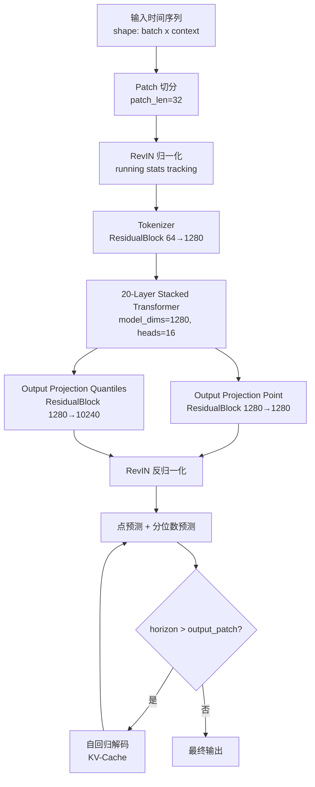
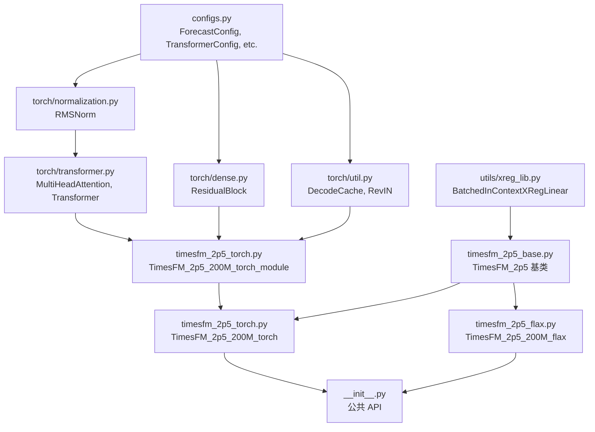
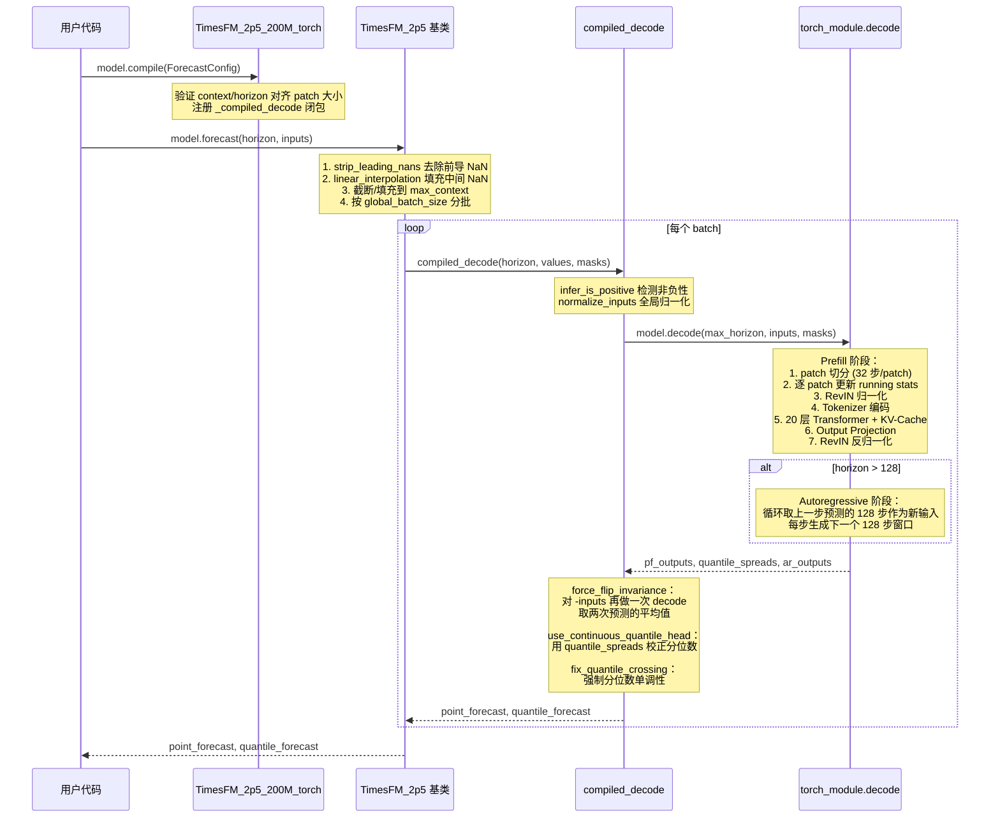
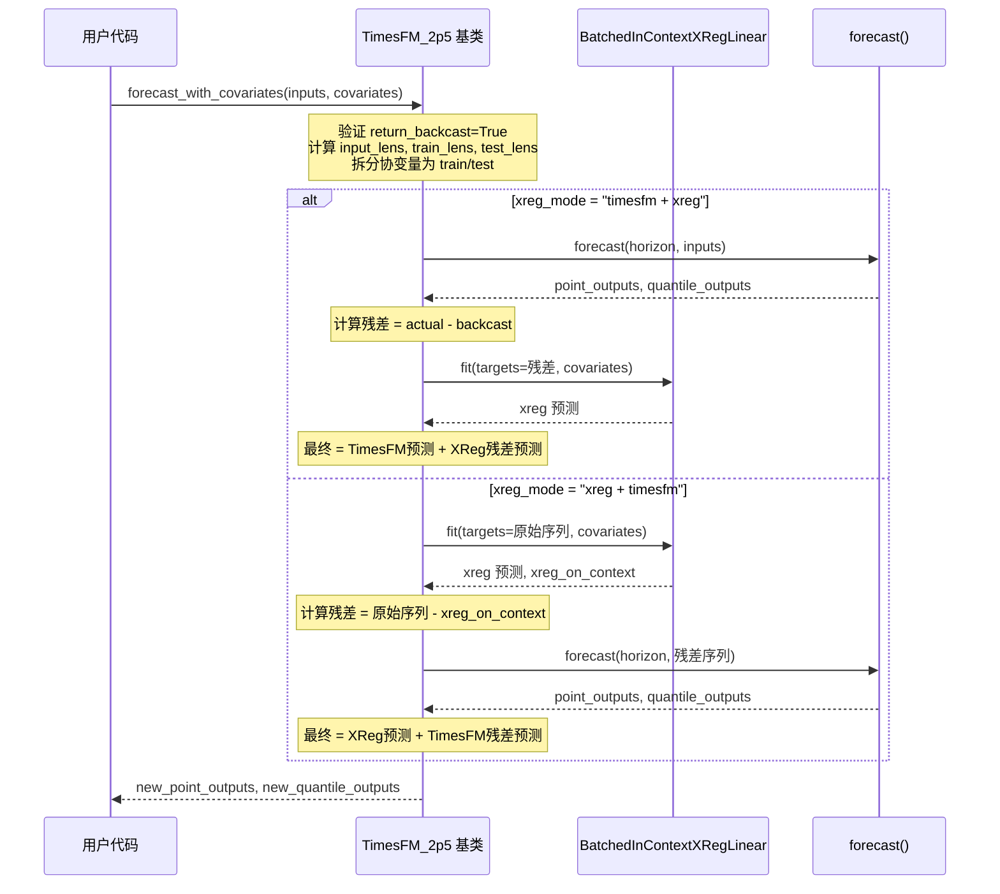

# timesfm 源码学习笔记

> 仓库地址：[timesfm](https://github.com/google-research/timesfm)
> 学习日期：2026-04-05

---

> **以下为 AI 源码分析**
>
> ### 一句话概括
>
> Google Research 开发的时间序列基础模型（200M 参数），采用 decoder-only Transformer 架构，支持零样本（zero-shot）时间序列预测，上下文长度最高 16K。
>
> ### 要点速览
>
> | 核心模块 | 职责 | 关键文件 |
> |----------|------|----------|
> | Tokenizer | 将时间序列 patch 编码为 embedding | `src/timesfm/torch/dense.py` → `ResidualBlock` |
> | Stacked Transformer | 20 层 decoder-only Transformer 主干网络 | `src/timesfm/torch/transformer.py` |
> | Output Projection | 生成点预测和分位数预测 | `src/timesfm/timesfm_2p5/timesfm_2p5_torch.py` |
> | RevIN | 可逆实例归一化，运行时统计量跟踪 | `src/timesfm/torch/util.py` → `revin` |
> | XReg | 协变量支持，线性回归与 TimesFM 预测组合 | `src/timesfm/utils/xreg_lib.py` |
> | Configs | 框架无关的配置定义 | `src/timesfm/configs.py` |

---

## 项目简介

TimesFM（Time Series Foundation Model）是 Google Research 开发的预训练时间序列基础模型，发表于 ICML 2024。它的核心思路是将时间序列预测问题类比 NLP 中的 next-token prediction：将连续时间序列分 patch 编码为 token，然后通过 decoder-only Transformer 自回归生成未来时间步的预测。

当前最新版本 TimesFM 2.5 使用 200M 参数（较 2.0 版的 500M 大幅缩减），支持最高 16K 上下文长度，提供连续分位数预测（最高 1024 步 horizon），同时移除了频率指示器（frequency indicator），简化了使用方式。模型权重托管在 Hugging Face Hub，支持 PyTorch 和 Flax（JAX）两种后端。

## 技术栈

| 类别 | 技术 |
|------|------|
| 语言 | Python >= 3.10 |
| 框架 | PyTorch >= 2.0 / Flax (JAX) |
| 构建工具 | setuptools |
| 依赖管理 | uv / pip, pyproject.toml |
| 测试框架 | pytest |

## 目录结构

```
timesfm/
├── src/timesfm/                    # 核心源码（v2.5）
│   ├── __init__.py                 # 包入口，导出 TimesFM_2p5_200M_torch/flax
│   ├── configs.py                  # 框架无关的配置 dataclass
│   ├── timesfm_2p5/               # TimesFM 2.5 模型实现
│   │   ├── timesfm_2p5_base.py    # 抽象基类 + 模型超参定义 + forecast 逻辑
│   │   ├── timesfm_2p5_torch.py   # PyTorch 后端实现
│   │   └── timesfm_2p5_flax.py    # Flax/JAX 后端实现
│   ├── torch/                      # PyTorch 子模块
│   │   ├── transformer.py          # Multi-Head Attention + Transformer Block
│   │   ├── dense.py                # ResidualBlock, RandomFourierFeatures
│   │   ├── normalization.py        # RMSNorm
│   │   └── util.py                 # DecodeCache, RevIN, running stats
│   ├── flax/                       # Flax/JAX 子模块（与 torch/ 镜像）
│   │   ├── transformer.py
│   │   ├── dense.py
│   │   ├── normalization.py
│   │   └── util.py
│   └── utils/
│       └── xreg_lib.py             # 协变量回归（XReg）
├── v1/                             # 归档的 v1/v2 代码
│   ├── src/timesfm/                # 旧版模型实现
│   ├── notebooks/                  # Jupyter notebooks
│   ├── peft/                       # 微调（LoRA/DoRA）
│   └── experiments/                # 基准测试
├── timesfm-forecasting/            # Agent Skill（SKILL.md）
├── pyproject.toml                  # 项目配置和依赖
└── README.md
```

## 架构设计

### 整体架构

TimesFM 2.5 采用经典的 **decoder-only Transformer** 架构，专为时间序列预测任务设计。其核心思想是：

1. **Patch Tokenization**：将输入时间序列按固定长度（32）切分为 patch，每个 patch 视为一个 "token"
2. **RevIN**：对每个 patch 进行可逆实例归一化（Reversible Instance Normalization），跟踪运行统计量
3. **Stacked Transformer**：20 层 Transformer 编码 patch 间的时序依赖关系
4. **Dual Output Head**：同时输出点预测（128 步）和分位数预测（1024 步）
5. **Autoregressive Decoding**：使用 KV-Cache 进行高效自回归解码，每步生成 128 个时间点



项目采用**分层抽象**的设计模式，将模型定义、推理逻辑和框架实现三层分离：

- **配置层**（`configs.py`）：定义框架无关的 dataclass 配置
- **基类层**（`timesfm_2p5_base.py`）：实现通用的 `forecast()` / `forecast_with_covariates()` 逻辑
- **框架层**（`timesfm_2p5_torch.py` / `timesfm_2p5_flax.py`）：各框架的 `nn.Module` 实现和编译优化

### 核心模块

#### 1. Tokenizer（ResidualBlock）

**职责**：将 patch（32 维时间值 + 32 维 mask = 64 维输入）编码为 1280 维 embedding。

**关键文件**：`src/timesfm/torch/dense.py`

**核心实现**：
- `ResidualBlock`：两层线性变换 + 残差连接
  - `hidden_layer`: Linear(64 → 1280) + SiLU 激活
  - `output_layer`: Linear(1280 → 1280)
  - `residual_layer`: Linear(64 → 1280) 直连
  - 输出 = `output_layer(activation(hidden_layer(x))) + residual_layer(x)`

#### 2. Stacked Transformer

**职责**：20 层 decoder-only Transformer，编码 patch 序列的时序依赖关系。

**关键文件**：`src/timesfm/torch/transformer.py`

**核心组件**：
- `Transformer`：Pre-Norm 结构（RMSNorm → Attention → RMSNorm → FFN）
- `MultiHeadAttention`：16 头注意力，fused QKV 投影
  - **RoPE**（Rotary Positional Embedding）：旋转位置编码
  - **QK Norm**：对 query 和 key 应用 RMSNorm
  - **PerDimScale**：每维度缩放因子（替代传统 `1/sqrt(d_k)`），使用 `softplus` 确保正值
  - **Causal Mask**：自定义 `make_attn_mask` 支持 KV-Cache 和 padding mask
- `RMSNorm`：Root Mean Square 归一化（`src/timesfm/torch/normalization.py`）

**模型超参**：

| 参数 | 值 |
|------|----|
| num_layers | 20 |
| model_dims | 1280 |
| num_heads | 16 |
| head_dim | 80 |
| hidden_dims（FFN） | 1280 |
| ff_activation | SiLU (Swish) |

#### 3. Output Projection

**职责**：将 Transformer 输出映射为预测值。

**关键文件**：`src/timesfm/timesfm_2p5/timesfm_2p5_torch.py`

两个独立的投影头：
- **Point Forecast**：`ResidualBlock(1280 → 1280 → 1280)` → reshape 为 `(batch, n_patches, 128, 10)` 即每个 patch 预测 128 步 x 10 个分位数
- **Quantile Head**：`ResidualBlock(1280 → 1280 → 10240)` → reshape 为 `(batch, n_patches, 1024, 10)` 用于连续分位数预测

其中 10 个输出通道为：mean（index 5） + 9 个分位数（10th ~ 90th percentile）。

#### 4. RevIN（Reversible Instance Normalization）

**职责**：对输入 patch 进行实例级归一化，推理时反归一化恢复原始尺度。

**关键文件**：`src/timesfm/torch/util.py`

**核心函数**：
- `update_running_stats(n, mu, sigma, x, mask)`：Welford 算法逐 patch 更新运行统计量（均值、标准差），支持 mask 跳过 padding
- `revin(x, mu, sigma, reverse)`：前向 `(x - mu) / sigma`，反向 `x * sigma + mu`

#### 5. XReg（协变量回归）

**职责**：支持外生变量（协变量）辅助预测，通过线性回归与 TimesFM 预测组合。

**关键文件**：`src/timesfm/utils/xreg_lib.py`

**两种模式**：
- `"timesfm + xreg"`：先用 TimesFM 预测，再对残差拟合线性模型
- `"xreg + timesfm"`：先用协变量拟合线性模型，再对残差用 TimesFM 预测

**协变量类型**：动态数值型、动态类别型、静态数值型、静态类别型。类别型通过 `sklearn.OneHotEncoder` 编码。

### 模块依赖关系



## 核心流程

### 流程一：模型推理（forecast）

用户调用 `model.forecast(horizon, inputs)` 的完整流程：



**关键逻辑说明**：

1. **输入预处理**（`timesfm_2p5_base.py:forecast`）：去除前导 NaN → 线性插值填充 → 左侧 zero-padding 对齐到 `max_context`
2. **Prefill**（`timesfm_2p5_torch.py:decode`）：将整个 context 一次性送入 Transformer，初始化 KV-Cache
3. **Autoregressive Decode**：如果 `horizon > output_patch_len(128)`，循环使用上一步的预测作为新输入，利用 KV-Cache 增量推理
4. **Flip Invariance**：对输入取负再预测一次，利用 `(f(x) - f(-x)) / 2` 保证 `f(ax+b) = a*f(x)+b` 对 `a < 0` 也成立

### 流程二：协变量预测（forecast_with_covariates）



**XReg 线性回归内部流程**：
1. 将协变量组装为设计矩阵（数值特征归一化，类别特征 One-Hot 编码）
2. 使用 JAX 加速的 Ridge 回归求解：`beta = (X^T X + lambda I)^{-1} X^T y`
3. 预测 `y_hat = X_test @ beta`

## 关键设计亮点

### 1. Patch-based Tokenization — 时间序列的 "分词"

**解决的问题**：时间序列是连续值信号，无法直接使用 NLP 的离散 token 方案。逐点输入效率低且序列过长。

**实现方式**：将时间序列按固定长度 32 切分为 patch，每个 patch 通过 `ResidualBlock`（`dense.py`）编码为 1280 维 embedding。Tokenizer 同时接收原始值和 mask（padding 标记），将 64 维输入映射到高维空间。

**设计原因**：patch 压缩序列长度 32 倍，使 16K 上下文仅需 512 个 token，Transformer 计算开销可控。ResidualBlock 的残差连接保证了信息无损传递。

### 2. RevIN（Reversible Instance Normalization）— 运行时自适应归一化

**解决的问题**：时间序列数据尺度差异巨大（如股价 vs 温度），模型需要处理任意量级的输入。

**实现方式**（`util.py:revin` + `update_running_stats`）：逐 patch 用 Welford 算法增量更新运行均值和标准差，前向 `(x - mu) / sigma` 归一化，输出后反向 `x * sigma + mu` 恢复。每个 patch 使用**截至当前的全局统计量**而非仅当前 patch 的局部统计量。

**设计原因**：RevIN 让模型只需学习"归一化后的时序模式"，不需要关心绝对数值，极大提升了 zero-shot 泛化能力。Welford 在线算法保证了数值稳定性。

### 3. Flip Invariance — 保证对称性

**解决的问题**：TimesFM 默认保证 `f(aX + b) = a * f(X) + b`（对 `a >= 0`），但 `a < 0` 时此性质不自然成立。

**实现方式**（`timesfm_2p5_torch.py:_compiled_decode`）：对输入 `X` 和 `-X` 各做一次推理，点预测取 `(f(X) - f(-X)) / 2`，分位数预测翻转后取平均。

**设计原因**：这是一种简单但有效的 test-time augmentation 策略。额外一次推理的开销换来了更强的输入不变性，特别对含负增长趋势的序列有显著改善。

### 4. Continuous Quantile Head — 解耦分位数预测

**解决的问题**：直接从同一个输出头预测多个分位数容易出现 "quantile collapsing"（不同分位数预测值趋于一致）。

**实现方式**：独立的 `output_projection_quantiles`（ResidualBlock 1280 → 10240）生成 1024 步 x 10 分位数的 spread，以 50th percentile（index 5）为锚点，其他分位数表示为相对偏移：`q_i = spread_i - spread_5 + point_5`。

**设计原因**：将分位数预测拆分为 "中位数预测 + 偏移量预测" 两步，避免了分位数间竞争同一输出空间的问题。配合 `fix_quantile_crossing` 后处理，强制保证分位数的单调性。

### 5. 框架无关的配置层 + 双后端实现

**解决的问题**：同时支持 PyTorch 和 Flax/JAX 两种深度学习框架，避免代码重复。

**实现方式**：`configs.py` 定义纯 Python dataclass 配置（`TransformerConfig`, `ResidualBlockConfig` 等），不依赖任何框架。`timesfm_2p5_base.py` 实现通用推理逻辑（数据预处理、批处理、协变量支持）。`torch/` 和 `flax/` 目录提供镜像的模块实现，各自继承基类。

**设计原因**：PyTorch 生态更广泛（方便用户使用），JAX/Flax 在 TPU 上性能更优（Google 内部训练需求）。配置层解耦使得模型超参定义只需维护一份。
