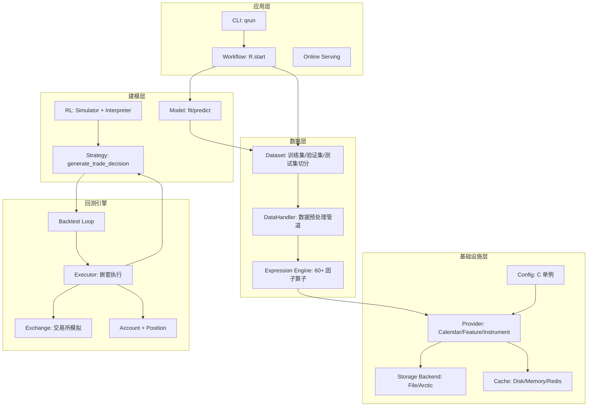
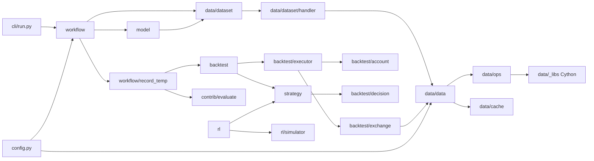
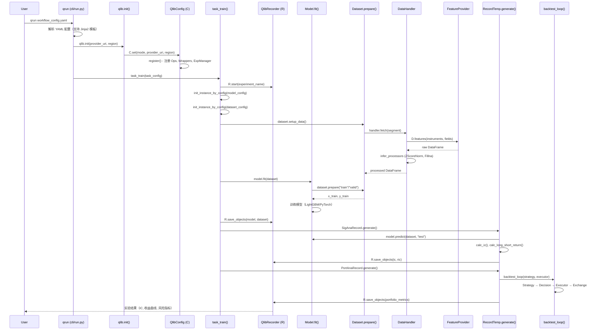
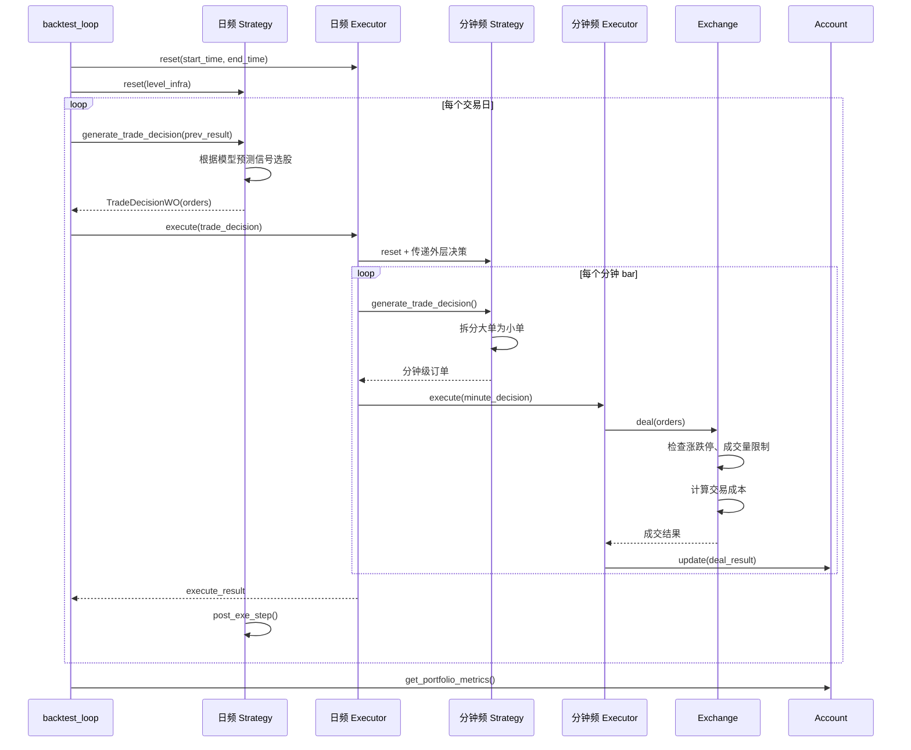

# qlib 源码学习笔记

> 仓库地址：[qlib](https://github.com/microsoft/qlib)
> 学习日期：2026-03-22

---

> **以下为 AI 源码分析**
>
> ### 一句话概括
>
> Qlib 是微软开源的 AI 驱动量化投资平台，覆盖数据处理、因子挖掘、模型训练、回测交易、组合优化全链路。
>
> ### 要点速览
>
> | 核心模块 | 职责 | 关键文件 |
> |---------|------|---------|
> | `qlib/data` | 高性能金融数据引擎，支持表达式计算、缓存、多频数据 | `data.py`, `ops.py`, `cache.py` |
> | `qlib/model` | 模型抽象层，定义 fit/predict 接口 | `base.py`, `trainer.py` |
> | `qlib/contrib/model` | 20+ 内置模型（LightGBM、LSTM、Transformer 等） | `gbdt.py`, `pytorch_nn.py` |
> | `qlib/backtest` | 嵌套决策执行框架，支持多级回测 | `backtest.py`, `executor.py`, `exchange.py` |
> | `qlib/strategy` | 交易策略抽象，支持传统策略与 RL 策略 | `base.py` |
> | `qlib/workflow` | 实验管理系统，基于 MLflow 的 Recorder 模式 | `__init__.py`, `record_temp.py` |
> | `qlib/rl` | 强化学习框架，Simulator-Interpreter 架构 | `simulator.py`, `interpreter.py` |
> | `qlib/cli` | CLI 入口，`qrun` 命令驱动完整 workflow | `run.py` |

---

## 项目简介

Qlib 是微软研究院开源的面向 AI 的量化投资研究平台。它旨在利用 AI 技术释放量化投资的潜力，覆盖从创意探索到生产部署的完整链路。平台支持多种机器学习范式（监督学习、市场动态建模、强化学习），内置 20+ 学术论文模型实现，提供完整的 ML Pipeline：数据处理 → 模型训练 → 回测 → 分析报告。其核心价值在于将量化研究的复杂流程模块化、标准化，降低研究者从想法到验证的门槛。

## 技术栈

| 类别 | 技术 |
|------|------|
| 语言 | Python（核心）+ Cython（高性能算子） |
| 框架 | PyTorch（深度学习模型）、LightGBM/XGBoost/CatBoost（GBDT 模型） |
| 构建工具 | setuptools + Cython + Makefile |
| 依赖管理 | pyproject.toml (pip) |
| 测试框架 | pytest |

## 目录结构

```
qlib/
├── __init__.py              # 入口：qlib.init() 初始化全局配置
├── config.py                # QlibConfig 全局配置管理（C 单例）
├── constant.py              # 常量定义（REG_CN, REG_US 等）
├── data/                    # 【数据引擎】高性能金融数据处理
│   ├── data.py              #   核心 Provider 体系（CalendarProvider, FeatureProvider 等）
│   ├── ops.py               #   表达式算子（Ref, Mean, Std, Corr 等 60+ 算子）
│   ├── cache.py             #   磁盘/内存缓存系统
│   ├── base.py              #   Expression 表达式树基类
│   ├── storage/             #   存储后端抽象（File, Arctic）
│   ├── _libs/               #   Cython 加速的 rolling/expanding 算子
│   └── dataset/             #   Dataset + DataHandler 数据集框架
│       ├── __init__.py      #     Dataset/DatasetH 基类
│       ├── handler.py       #     DataHandler/DataHandlerLP 数据处理管道
│       └── processor.py     #     数据预处理器（ZScoreNorm, Fillna 等）
├── model/                   # 【模型层】模型抽象与训练
│   ├── base.py              #   BaseModel/Model/ModelFT 接口定义
│   ├── trainer.py           #   TrainerR/TrainerRM 训练调度器
│   ├── ens/                 #   模型集成
│   ├── interpret/           #   模型可解释性
│   └── riskmodel/           #   风险模型
├── contrib/                 # 【社区贡献】内置实现集合
│   ├── model/               #   20+ 预训练模型（LightGBM, LSTM, Transformer, HIST 等）
│   ├── data/                #   Alpha158/Alpha360 特征集
│   ├── strategy/            #   TopkDropout/信号策略/成本控制
│   ├── evaluate.py          #   risk_analysis 风险分析工具
│   ├── rolling/             #   滚动训练框架（DDG-DA 等）
│   └── meta/                #   元学习框架
├── backtest/                # 【回测引擎】嵌套决策执行框架
│   ├── backtest.py          #   backtest_loop 核心循环
│   ├── executor.py          #   BaseExecutor 多级执行器
│   ├── exchange.py          #   Exchange 交易所模拟（成本/涨跌停/成交量）
│   ├── decision.py          #   Order/BaseTradeDecision 交易决策
│   ├── account.py           #   Account 账户管理
│   └── position.py          #   Position 持仓管理
├── strategy/                # 【策略层】策略抽象
│   └── base.py              #   BaseStrategy/RLStrategy/RLIntStrategy
├── workflow/                # 【实验管理】MLflow 集成
│   ├── __init__.py          #   QlibRecorder (全局 R 对象)
│   ├── recorder.py          #   Recorder 基类
│   ├── expm.py              #   ExpManager 实验管理器
│   ├── record_temp.py       #   RecordTemp 模板（SigAnaRecord, PortAnaRecord）
│   ├── task/                #   TaskManager (MongoDB) 任务调度
│   └── online/              #   在线服务框架
├── rl/                      # 【强化学习】RL 框架
│   ├── simulator.py         #   Simulator 基类（Generic 泛型设计）
│   ├── interpreter.py       #   StateInterpreter/ActionInterpreter
│   ├── reward.py            #   Reward 函数
│   ├── trainer/             #   RL Trainer
│   └── order_execution/     #   订单执行 RL 环境
└── cli/                     # 【CLI】命令行工具
    ├── run.py               #   qrun 命令入口
    └── data.py              #   数据下载命令
```

## 架构设计

### 整体架构

Qlib 采用**分层松耦合架构**，自底向上分为四层：基础设施层、数据层、建模层、应用层。每层组件可独立使用，也可通过 YAML 配置文件串联为完整 workflow。

核心设计理念：
1. **配置驱动**：通过 `init_instance_by_config` 工厂函数，所有组件均可从 YAML/dict 配置实例化
2. **Provider 模式**：数据层使用 Provider 抽象，支持 Local/NFS/Client-Server 多种部署模式
3. **嵌套决策执行**：回测框架支持 Strategy-Executor 多级嵌套，实现日频策略内嵌分钟频执行
4. **实验可复现**：通过 MLflow 集成的 Recorder 系统管理所有实验产出



### 核心模块

#### 1. 数据引擎 (`qlib/data/`)

**职责**：提供高性能的金融数据访问、表达式计算和缓存能力。

**核心文件**：
- `data.py`：Provider 体系的核心实现，包含 `CalendarProvider`、`InstrumentProvider`、`FeatureProvider` 等抽象基类及其 Local 实现
- `ops.py`：60+ 因子表达式算子，分为 Element-wise（Abs, Log, Power）、Rolling（Mean, Std, Corr, Slope）等类别
- `base.py`：`Expression` 表达式树基类，支持 `$close`、`Ref($close, 1)`、`Mean($close, 3)` 等 DSL 语法
- `cache.py`：`DiskExpressionCache`、`DiskDatasetCache` 缓存加速

**关键接口**：
- `D.calendar(start_time, end_time, freq)` — 获取交易日历
- `D.features(instruments, fields, start_time, end_time)` — 获取因子数据
- `D.instruments(market)` — 获取股票池

**设计亮点**：表达式引擎将 `"Ref($close, 1)"` 字符串解析为表达式树，递归计算出因子值，同时通过 Cython 加速 rolling/expanding 类算子。

#### 2. 模型层 (`qlib/model/` + `qlib/contrib/model/`)

**职责**：定义统一的模型接口，并提供 20+ 内置模型实现。

**核心文件**：
- `model/base.py`：`BaseModel`(predict) → `Model`(fit+predict) → `ModelFT`(finetune) 三级抽象
- `model/trainer.py`：`TrainerR`（简单训练）和 `TrainerRM`（TaskManager 调度训练）
- `contrib/model/gbdt.py`：LightGBM 模型实现（`LGBModel`）
- `contrib/model/pytorch_nn.py`：PyTorch 深度学习基类（`DNNModelPytorch`）

**内置模型清单**（20+ 论文实现）：
- GBDT 系列：LightGBM, XGBoost, CatBoost
- RNN 系列：LSTM, GRU, ALSTM
- Attention 系列：Transformer, Localformer, GATs
- 专用模型：TRA, HIST, ADARNN, ADD, IGMTF, SFM, TabNet, TCN, TCTS, KRNN, Sandwich, DoubleEnsemble

#### 3. 回测引擎 (`qlib/backtest/`)

**职责**：模拟真实交易环境，执行策略并生成绩效报告。

**核心文件**：
- `backtest.py`：`backtest_loop` 核心循环，驱动 Strategy-Executor 交互
- `executor.py`：`BaseExecutor` 多级执行器，支持嵌套决策（日频嵌套分钟频）
- `exchange.py`：`Exchange` 交易所模拟，处理涨跌停、成交量限制、交易成本
- `decision.py`：`Order`（单笔订单）和 `BaseTradeDecision`（交易决策集合）

**核心交互模式**：
```
Strategy.generate_trade_decision() → Executor.execute(decision) → Exchange.deal(orders) → Account.update()
```

#### 4. 策略层 (`qlib/strategy/` + `qlib/contrib/strategy/`)

**职责**：根据模型预测信号生成交易决策。

**核心文件**：
- `strategy/base.py`：`BaseStrategy`（传统策略）、`RLStrategy`（RL 策略）、`RLIntStrategy`（带 Interpreter 的 RL 策略）
- `contrib/strategy/signal_strategy.py`：`TopkDropoutStrategy`（Top-K 调仓策略，最常用）

**关键方法**：
- `generate_trade_decision(execute_result)` — 核心抽象方法，生成每个交易时段的交易决策

#### 5. 实验管理 (`qlib/workflow/`)

**职责**：管理实验生命周期，记录参数、指标、模型产出。

**核心文件**：
- `__init__.py`：`QlibRecorder`（全局 `R` 对象），提供 `R.start()`, `R.log_params()`, `R.save_objects()` 等接口
- `record_temp.py`：`SigAnaRecord`（信号分析：IC）、`PortAnaRecord`（组合分析：回测收益）
- `expm.py`：`MLflowExpManager`，底层对接 MLflow
- `task/manage.py`：`TaskManager`，基于 MongoDB 的分布式任务调度

#### 6. 强化学习 (`qlib/rl/`)

**职责**：将量化交易建模为 MDP，支持 RL 策略训练。

**核心文件**：
- `simulator.py`：`Simulator[InitialStateType, StateType, ActType]` 泛型模拟器
- `interpreter.py`：`StateInterpreter`（Qlib 状态 → RL 观测）、`ActionInterpreter`（RL 动作 → Qlib 订单）
- `order_execution/`：订单执行环境的具体实现

### 模块依赖关系



## 核心流程

### 流程一：qrun 自动化研究 Workflow

这是 Qlib 最常用的流程：用户通过一个 YAML 配置文件驱动完整的量化研究 Pipeline，包含数据准备、模型训练、回测、分析。



**关键步骤说明**：

1. **配置解析**：`cli/run.py:workflow()` 读取 YAML，支持 `BASE_CONFIG_PATH` 继承和 Jinja2 变量替换
2. **初始化**：`qlib.init()` 设置数据路径、注册表达式算子、初始化实验管理器
3. **模型训练**：`trainer.py:_exe_task()` 通过 `init_instance_by_config` 工厂方法从配置创建 Model 和 Dataset 实例
4. **数据流**：Dataset → DataHandler → DataLoader → FeatureProvider → 本地二进制文件
5. **结果记录**：`RecordTemp` 子类（SigAnaRecord, PortAnaRecord）自动生成 IC 分析和回测报告

### 流程二：嵌套决策执行回测

这是 Qlib 回测引擎的核心创新：支持多级 Strategy-Executor 嵌套，例如日频组合策略内嵌分钟频订单执行策略。



**关键设计点**：

1. **`collect_data_loop` Generator**：`backtest.py:52` 使用 Python Generator（`yield from`）实现回测循环与数据收集的统一接口，同一段代码既可用于纯回测，也可用于 RL 训练数据收集
2. **Strategy-Executor 解耦**：Strategy 只负责"做什么决策"，Executor 负责"如何执行"，通过 `LevelInfrastructure` 和 `CommonInfrastructure` 共享交易日历、账户等基础设施
3. **Exchange 交易模拟**：`exchange.py` 精确模拟真实市场约束——涨跌停限制（`limit_threshold`）、成交量限制（`volume_threshold`）、交易成本（`open_cost`, `close_cost`, `impact_cost`）

## 关键设计亮点

### 1. 配置驱动的组件实例化 (`init_instance_by_config`)

**解决的问题**：量化研究需要频繁替换模型、数据处理器、策略等组件，硬编码实例化会导致代码修改成本高。

**实现方式**：`qlib/utils/__init__.py` 中的 `init_instance_by_config` 函数接受 dict 配置（包含 `class`、`module_path`、`kwargs` 字段），通过反射动态实例化任意类。所有组件（Model、Dataset、DataHandler、Strategy、Executor）均支持此模式。

```yaml
# 一个 YAML 配置即可定义完整的 workflow
model:
    class: LGBModel
    module_path: qlib.contrib.model.gbdt
    kwargs:
        loss: mse
        num_boost_round: 1000
```

**为什么这样设计**：使得用户无需编写 Python 代码，仅修改 YAML 配置文件即可切换模型、调整参数、更换策略。

### 2. 表达式引擎与 Cython 加速因子计算

**解决的问题**：量化因子（如 `Mean($close, 20) / Std($close, 20)`）需要高效计算，且因子定义语法要对研究者友好。

**实现方式**：
- `qlib/data/base.py` 定义 `Expression` 表达式树基类
- `qlib/data/ops.py` 实现 60+ 算子（`Ref`, `Mean`, `Std`, `Corr`, `Slope` 等），每个算子是表达式树的一个节点
- `qlib/data/_libs/rolling.pyx` 和 `expanding.pyx` 用 Cython 实现核心 rolling 计算（slope, rsquare, resi），性能接近 C++
- 字符串 `"Ref($close, 1)"` 通过 `parse_field` 解析为 `Ref(Feature("$close"), 1)` 表达式树

**为什么这样设计**：研究者可以用直观的 DSL 语法定义复杂因子，引擎自动处理依赖解析、缓存和并行计算。

### 3. 嵌套决策执行框架 (Nested Decision Execution)

**解决的问题**：真实交易中，日频组合调仓决策需要在分钟级别精细执行（TWAP/VWAP 拆单），两个层级有不同的时间粒度和决策逻辑。

**实现方式**：
- `qlib/backtest/executor.py` 中 `NestedExecutor` 内嵌一个子 Strategy 和子 Executor
- 外层 Executor 将日频 `TradeDecision` 传给内层 Strategy，内层将其拆解为分钟级订单
- 通过 `LevelInfrastructure` 管理各层级的交易日历，`CommonInfrastructure` 共享账户和交易所实例
- `collect_data_loop` 使用 `yield from` 将 Generator 链式组合，支持多级数据收集

**为什么这样设计**：传统回测框架只能在单一频率运行。嵌套执行框架使研究者能在日频做 alpha 选股，分钟频做执行优化，并让 RL agent 在合适的层级学习策略。

### 4. DataHandler 三阶段数据管道 (Raw → Infer → Learn)

**解决的问题**：训练时需要 label 做标准化（如 CSZScoreNorm），但推理时不能使用未来信息的 label。需要区分"训练可用"和"推理可用"的数据。

**实现方式**：`qlib/data/dataset/handler.py` 中 `DataHandlerLP`（Learn & Process）维护三份数据视图：
- `DK_R` (raw)：原始数据
- `DK_I` (infer)：经过 `infer_processors`（ProcessInf, ZScoreNorm, Fillna）处理的推理用数据
- `DK_L` (learn)：经过 `learn_processors`（DropnaLabel, CSZScoreNorm on label）处理的训练用数据

Model 在 `fit()` 时使用 `DK_L` 获取特征和标签，在 `predict()` 时使用 `DK_I` 只获取特征。

**为什么这样设计**：严格防止数据泄漏（look-ahead bias），确保推理路径不依赖未来信息。

### 5. 全局单例 Recorder 模式 (`R` 对象)

**解决的问题**：MLflow 原生 API 需要频繁传递 `run_id`，代码冗长；且实验的参数、指标、产出（模型、预测结果）分散在不同接口。

**实现方式**：
- `qlib/workflow/__init__.py` 定义全局 `R` 对象（`RecorderWrapper` 包装的 `QlibRecorder`）
- 使用 Context Manager（`with R.start(experiment_name='test'):`）自动管理实验生命周期
- `R.log_params()`, `R.log_metrics()`, `R.save_objects()` 自动路由到当前活跃的 Recorder
- `RecordTemp` 模板类（如 `SigAnaRecord`）封装常用的分析流程，一行代码生成 IC/回测报告

**为什么这样设计**：研究者只需关注"记录什么"，无需关心"存在哪里"和"怎么组织"，显著降低实验管理的心智负担。
