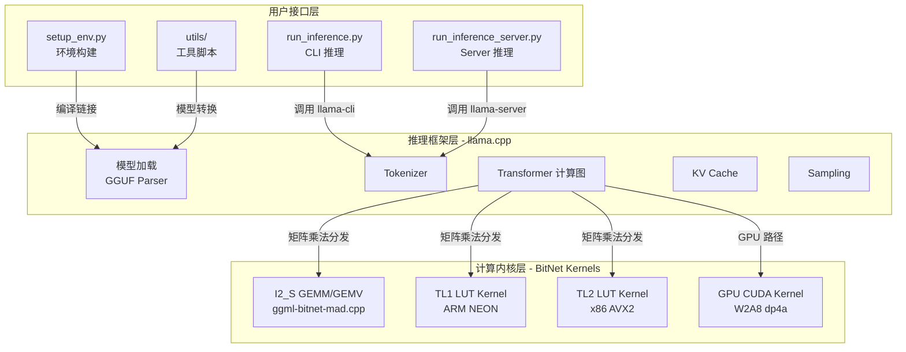
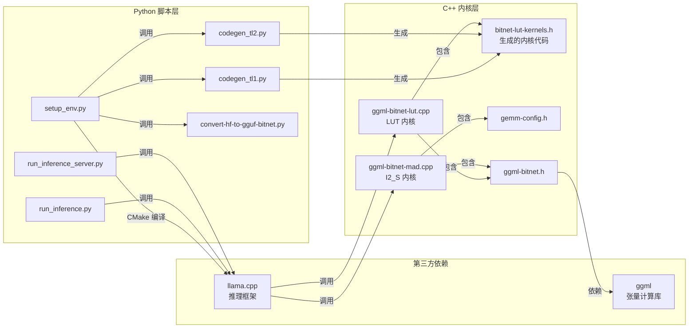
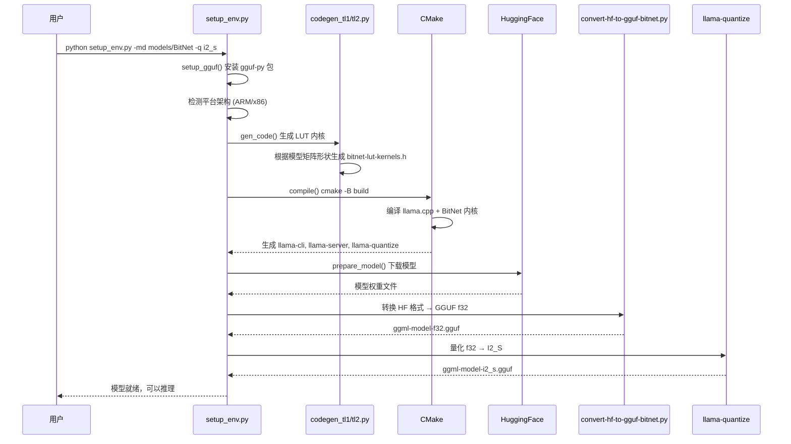
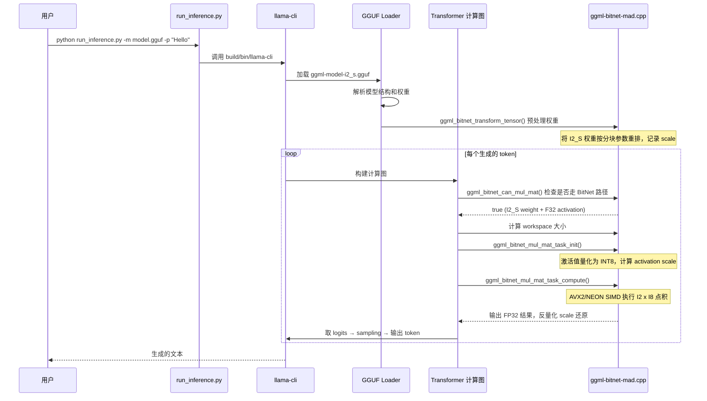

# BitNet 源码学习笔记

> 仓库地址：[BitNet](https://github.com/microsoft/BitNet)
> 学习日期：2026-04-05

---

> **以下为 AI 源码分析**
>
> ### 一句话概括
>
> bitnet.cpp 是微软官方的 1-bit LLM（BitNet b1.58）推理框架，基于 llama.cpp 构建，通过 Lookup Table（LUT）和 SIMD 指令优化，在 CPU 和 GPU 上实现三值权重（{-1, 0, 1}）模型的快速无损推理。
>
> ### 要点速览
>
> | 核心模块 | 职责 | 关键文件 |
> |---------|------|---------|
> | I2_S GEMM/GEMV 内核 | CPU 上基于位运算的三值矩阵乘法 | `src/ggml-bitnet-mad.cpp` |
> | LUT 内核（TL1/TL2） | 基于查找表的高效矩阵乘法 | `src/ggml-bitnet-lut.cpp` |
> | 内核代码生成器 | 为不同模型形状生成优化的 LUT 内核 | `utils/codegen_tl1.py`, `utils/codegen_tl2.py` |
> | 环境构建系统 | 端到端编译、模型下载、量化 | `setup_env.py`, `CMakeLists.txt` |
> | 模型转换工具 | HuggingFace → GGUF 格式转换 | `utils/convert-hf-to-gguf-bitnet.py` |
> | GPU 推理内核 | CUDA W2A8 GEMV 内核 | `gpu/bitnet_kernels/bitnet_kernels.cu` |
> | 推理入口 | CLI 推理和 Server 模式 | `run_inference.py`, `run_inference_server.py` |

---

## 项目简介

bitnet.cpp 是微软研究院开发的 1-bit LLM 官方推理框架，专为 BitNet b1.58 模型设计。BitNet b1.58 的权重仅取 {-1, 0, 1} 三个值（即 1.58 bit），这使得传统的浮点矩阵乘法可以被替换为更简单的加法和查表操作。bitnet.cpp 利用这一特性，在 CPU 上通过 LUT（Lookup Table）方法和 SIMD 向量指令（ARM NEON / x86 AVX2）实现了远超常规推理框架的速度，同时大幅降低能耗。在 GPU 上则通过定制 CUDA kernel 使用 `dp4a` 指令进行 W2A8 加速。该框架能够在单 CPU 上以人类阅读速度（5-7 tokens/s）运行 100B 参数的 BitNet 模型，为在本地设备上运行大语言模型开辟了新路径。

## 技术栈

| 类别 | 技术 |
|------|------|
| 语言 | C/C++（核心内核）、Python（脚本工具）、CUDA（GPU 内核） |
| 框架 | llama.cpp（推理基础框架）、xformers（GPU 推理）、PyTorch（GPU 模型定义） |
| 构建工具 | CMake（C++ 编译）、Python codegen（内核代码生成） |
| 依赖管理 | pip / conda（Python 依赖）、git submodule（llama.cpp） |
| 测试框架 | 自定义 benchmark 脚本（`utils/e2e_benchmark.py`、`gpu/test.py`） |

## 目录结构

```
BitNet/
├── src/                          # 核心 C++ 内核实现
│   ├── ggml-bitnet-mad.cpp       # I2_S 格式的 GEMM/GEMV 内核（直接位运算）
│   ├── ggml-bitnet-lut.cpp       # LUT 方式的矩阵乘法内核（TL1/TL2）
│   └── CMakeLists.txt            # 内核编译配置
├── include/                      # 头文件
│   ├── ggml-bitnet.h             # BitNet 内核公共接口定义
│   ├── gemm-config.h             # GEMM 分块参数配置
│   └── bitnet-lut-kernels.h      # 代码生成器输出的 LUT 内核（生成文件）
├── gpu/                          # GPU 推理实现
│   ├── bitnet_kernels/           # CUDA W2A8 GEMV 内核
│   │   ├── bitnet_kernels.cu     # CUDA 内核入口（按矩阵形状分发）
│   │   └── bitnet_kernels.h      # 模板化的 GEMV 内核实现
│   ├── model.py                  # GPU 推理模型定义（Transformer + BitLinear）
│   ├── generate.py               # GPU 推理入口（交互式生成）
│   └── convert_checkpoint.py     # 权重格式转换和 permutation
├── utils/                        # 工具脚本
│   ├── codegen_tl1.py            # ARM TL1 LUT 内核代码生成器
│   ├── codegen_tl2.py            # x86 TL2 LUT 内核代码生成器
│   ├── convert-hf-to-gguf-bitnet.py  # HuggingFace → GGUF 模型转换
│   ├── e2e_benchmark.py          # 端到端性能基准测试
│   └── quantize_embeddings.py    # Embedding 量化工具
├── preset_kernels/               # 预调优的 LUT 内核参数
├── 3rdparty/
│   └── llama.cpp/                # llama.cpp 子模块（推理基础设施）
├── setup_env.py                  # 一键环境搭建（编译 + 模型准备）
├── run_inference.py              # CLI 推理入口
├── run_inference_server.py       # Server 模式推理入口
└── CMakeLists.txt                # 顶层 CMake 配置
```

## 架构设计

### 整体架构

bitnet.cpp 采用**分层插件式架构**，在 llama.cpp 推理框架的基础上，通过自定义的 BitNet GEMM/GEMV 内核替换标准的矩阵乘法操作。整体分为三层：

1. **用户接口层**：Python 脚本提供环境构建、模型转换、推理启动等功能
2. **推理框架层**：复用 llama.cpp 的模型加载、tokenization、采样、KV Cache 等基础设施
3. **计算内核层**：BitNet 专用的矩阵乘法内核，支持 I2_S（直接位运算）和 TL1/TL2（LUT 查表）两条路径



### 核心模块

#### 1. I2_S GEMM/GEMV 内核（`src/ggml-bitnet-mad.cpp`）

**职责**：实现三值权重的直接位运算矩阵乘法，是 CPU 推理的默认内核。

- **量化函数 `quantize_i2_s()`**：将 FP32 权重映射到 {0, 1, 2}（对应 {-1, 0, 1}），每个权重用 2 bit 编码，4 个权重打包到 1 个 byte
- **GEMV 函数 `ggml_vec_dot_i2_i8_s()`**：x86 使用 AVX2 `_mm256` 指令，ARM 使用 NEON `vdotq_s32` 指令，执行 int8 激活值与 2-bit 权重的点积
- **并行策略**：支持 Weight Parallel 和 Activation Parallel 两种模式，通过 `gemm-config.h` 中的 `ROW_BLOCK_SIZE`、`COL_BLOCK_SIZE`、`PARALLEL_SIZE` 配置

**关键接口**：
- `quantize_i2_s()` — 权重量化
- `ggml_vec_dot_i2_i8_s_1x1()` / `ggml_vec_dot_i2_i8_s_MxN()` — 向量/矩阵点积

#### 2. LUT 内核（`src/ggml-bitnet-lut.cpp` + 生成的 `bitnet-lut-kernels.h`）

**职责**：基于 Lookup Table 的矩阵乘法，将权重-激活值乘法转化为查表操作。

- **核心思想**：由于三值权重只有 {-1, 0, 1}，每个激活值与权重的乘积只有三种可能（-x, 0, x）。将激活值预计算为 LUT，权重作为索引查表，完全消除乘法运算
- **TL1（ARM）**：使用 `vqtbl1q_s8` NEON 查表指令，8-bit 索引 → 16 字节表查询
- **TL2（x86）**：使用 `_mm256_shuffle_epi8` AVX2 指令模拟查表
- **代码生成**：`codegen_tl1.py` / `codegen_tl2.py` 根据模型矩阵形状生成特化的内核代码

**关键接口**：
- `ggml_qgemm_lut()` — LUT 矩阵乘法入口
- `ggml_preprocessor()` — 激活值预处理（量化 + LUT 构建）
- `ggml_bitnet_transform_tensor()` — 权重张量预处理

#### 3. 内核代码生成器（`utils/codegen_tl1.py`, `utils/codegen_tl2.py`）

**职责**：根据模型的矩阵形状（M, K）和分块参数（BM, BK, bm），生成平台特定的 LUT 内核 C 代码。

- 输入：模型名称 → 查询 `ModelShapeDict` 获取权重矩阵维度列表
- 输出：`include/bitnet-lut-kernels.h`（编译时包含的内核代码）+ `include/kernel_config.ini`（内核配置）
- 通过模板化代码生成，为每种矩阵形状生成专用的 `tbl_impl_M_K()` 和 `qgemm_lut_M_K()` 函数

#### 4. GPU CUDA 内核（`gpu/bitnet_kernels/`）

**职责**：在 NVIDIA GPU 上执行 W2A8（2-bit Weight × 8-bit Activation）GEMV 计算。

- **内核模板** `ladder_int8xint2_kernel<M,N,K>`：模板化的 CUDA kernel，每种矩阵形状特化
- **权重布局优化**：16×32 分块 + interleaving 排列，利用 `dp4a` 指令加速点积
- **推理流程**：Prefill 阶段用 BF16 模型，Decode 阶段用 INT2 量化模型

#### 5. 环境构建系统（`setup_env.py`）

**职责**：一键完成编译、代码生成、模型下载和量化的全流程。

- 调用链：`setup_gguf()` → `gen_code()` → `compile()` → `prepare_model()`
- `gen_code()`：根据平台（ARM/x86）和模型调用对应的 codegen 脚本
- `compile()`：通过 CMake 使用 Clang 编译整个项目
- `prepare_model()`：从 HuggingFace 下载模型 → 转换为 GGUF → 量化为 I2_S 或 TL 格式

### 模块依赖关系



## 核心流程

### 流程一：环境搭建与模型准备

这是用户使用 bitnet.cpp 的第一步，`setup_env.py` 编排了从编译到模型就绪的完整流程。



**关键步骤说明**：

1. **代码生成（`gen_code`）**：根据目标平台选择 TL1（ARM）或 TL2（x86）代码生成器，为模型中每种矩阵形状（如 `[3200, 8640]`）生成专用的 SIMD 内核代码，写入 `include/bitnet-lut-kernels.h`
2. **编译（`compile`）**：通过 CMake 用 Clang 编译，编译选项 `-DBITNET_ARM_TL1` 或 `-DBITNET_X86_TL2` 决定启用哪套 LUT 内核
3. **模型量化**：先用 `convert-hf-to-gguf-bitnet.py` 将 HuggingFace 格式转为 GGUF，再用 `llama-quantize` 将 FP32 权重量化为 I2_S（2-bit 整数）格式

### 流程二：CPU 推理执行（I2_S 内核路径）

以 I2_S 量化模型在 CPU 上的 token 生成为例，展示核心计算路径。



**核心计算细节**：

1. **权重预处理**：`ggml_bitnet_transform_tensor()` 在模型加载时执行一次，将权重按 `ROW_BLOCK_SIZE × COL_BLOCK_SIZE` 重排以优化缓存访问
2. **激活值量化**：`mul_mat_task_init()` 将 FP32 激活值量化为 INT8（per-tensor 量化，scale = 127 / max(|x|)）
3. **SIMD 点积**：`mul_mat_task_compute()` 中，每次从 I2_S 权重中解包 2-bit 值，与 INT8 激活值做点积，最后用 `weight_scale * activation_scale` 反量化回 FP32

## 关键设计亮点

### 1. LUT 查表法替代乘法

**问题**：三值权重 {-1, 0, 1} 的矩阵乘法本质上是加减法，浮点乘法运算浪费算力。

**实现**：在 `codegen_tl1.py` 生成的 `lut_ctor()` 模板函数中，对每对激活值 (a, b) 预计算 9 种可能的组合结果（{-a-b, -a, -a+b, -b, 0, b, a-b, a, a+b}），构建查找表。权重的 2-bit 编码直接作为查表索引，用 ARM NEON `vqtbl1q_s8` 或 x86 AVX2 `_mm256_shuffle_epi8` 指令在一个时钟周期内完成查表。

**优势**：完全消除乘法运算，将矩阵乘法转化为查表 + 累加，显著提升吞吐量并降低能耗。

### 2. 编译时代码生成（Codegen）

**问题**：不同模型有不同的矩阵维度，通用内核难以同时优化所有形状。

**实现**：`utils/codegen_tl1.py` 和 `utils/codegen_tl2.py` 在编译前根据模型的 `ModelShapeDict`（如 `bitnet_b1_58-3B: [[3200, 8640], [3200, 3200], [8640, 3200]]`）为每种矩阵形状生成特化的内核函数 `qgemm_lut_M_K()`，包括精确的循环展开、分块大小和 SIMD 寄存器分配。生成的代码写入 `include/bitnet-lut-kernels.h`，通过 `#include` 在编译时静态链接。

**优势**：避免运行时分支和动态分发，每个矩阵形状都有最优的分块和向量化策略。

### 3. I2_S 紧凑位打包格式

**问题**：2-bit 权重需要高效存储和快速解包。

**实现**：在 `ggml-bitnet-mad.cpp` 的 `quantize_i2_s()` 中，将三值 {-1, 0, 1} 编码为 {0, 1, 2}，每 4 个权重打包到 1 个 byte（`packed = (q0 << 6) | (q1 << 4) | (q2 << 2) | q3`）。支持两种布局模式：
- **ACT_PARALLEL 模式**：按行连续存储，每 `QK_I2_S`（128/64）个权重为一组
- **标准模式**：4 行权重交错存储（row-interleaved），优化多行并行解包

**优势**：4x 压缩比（相比 INT8），解包仅需位移和掩码操作（`vshrq_n_u8` / `_mm256_srli_epi16`），无需除法。

### 4. GPU Prefill-Decode 分离架构

**问题**：Prefill 阶段需要处理长序列的 GEMM，量化内核优势不明显；Decode 阶段是 GEMV，量化内核优势巨大。

**实现**：在 `gpu/generate.py` 的 `FastGen.build()` 中，加载两份模型：`prefill_model`（BF16 权重）和 `decode_model`（INT2 量化权重）。Prefill 使用标准 BF16 计算保证精度，Decode 切换到 W2A8 CUDA kernel（`gpu/model.py` 中的 `BitLinearKernel`），通过 `ctypes.CDLL` 调用自定义 CUDA 库。

**优势**：在不牺牲 Prefill 精度的前提下，Decode 阶段获得 3x+ 加速。

### 5. 可配置的 GEMM 分块与并行度

**问题**：不同 CPU 架构的缓存层次和 SIMD 宽度不同，固定参数无法适配所有硬件。

**实现**：`include/gemm-config.h` 提供三个可调参数：`ROW_BLOCK_SIZE`、`COL_BLOCK_SIZE`、`PARALLEL_SIZE`，根据指令集（AVX / ARM NEON / ARM DOTPROD）设置不同默认值。同时在 `preset_kernels/` 目录下为主流模型提供了预调优的 LUT 内核参数（`kernel_config_tl1.ini` / `kernel_config_tl2.ini`），通过 `setup_env.py --use-pretuned` 直接使用。

**优势**：兼顾开箱即用和深度调优，用户可根据 `src/README.md` 中的调优指南为自己的硬件找到最优配置。
