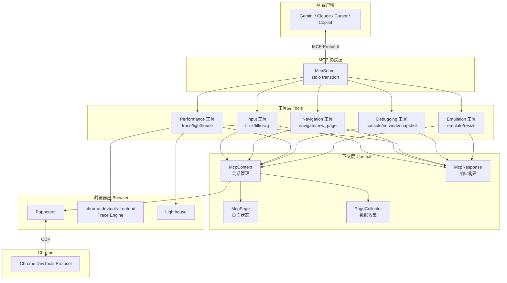
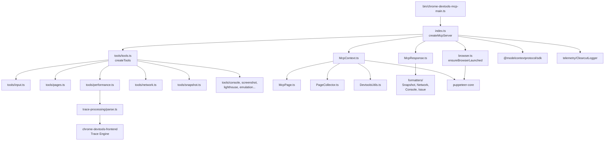
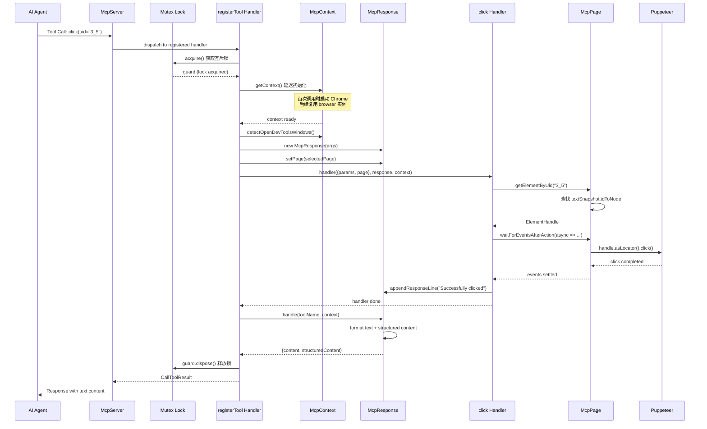
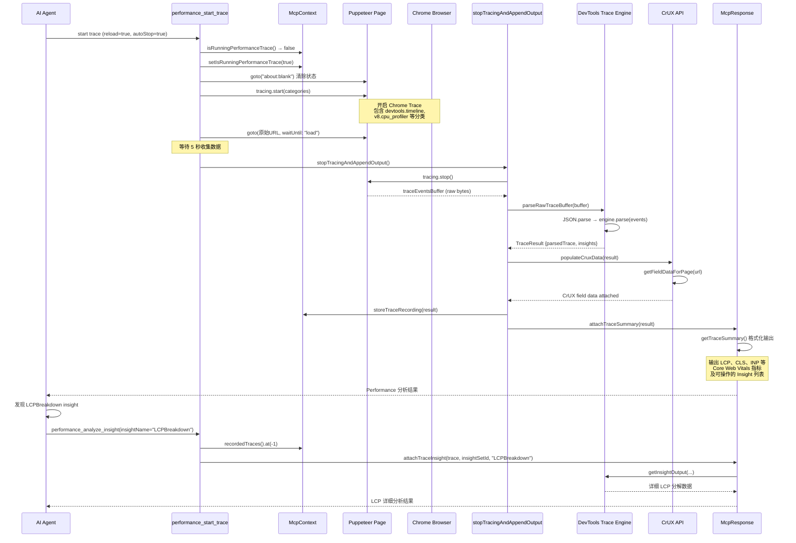

# chrome-devtools-mcp 源码学习笔记

> 仓库地址：[chrome-devtools-mcp](https://github.com/ChromeDevTools/chrome-devtools-mcp)
> 学习日期：2026-04-05

---

> **以下为 AI 源码分析**
>
> ### 一句话概括
>
> 一个 MCP Server，让 AI 编程助手（Gemini、Claude、Cursor 等）能通过 Chrome DevTools Protocol 控制和检查实时 Chrome 浏览器，实现自动化操作、调试和性能分析。
>
> ### 要点速览
>
> | 核心模块 | 职责 | 关键文件 |
> |---------|------|---------|
> | MCP Server | 创建 MCP 服务并注册工具 | `src/index.ts` |
> | Browser 管理 | 启动/连接 Chrome 浏览器 | `src/browser.ts` |
> | McpContext | 浏览器会话上下文管理（页面、网络、控制台） | `src/McpContext.ts` |
> | McpResponse | 工具执行结果格式化与输出 | `src/McpResponse.ts` |
> | Tools 系统 | 29+ 个 MCP 工具的定义与实现 | `src/tools/*.ts` |
> | PageCollector | 按页面收集网络请求和控制台消息 | `src/PageCollector.ts` |
> | Trace 处理 | 性能 trace 解析与 Insight 提取 | `src/trace-processing/parse.ts` |
> | Formatters | 将原始数据格式化为 LLM 友好的输出 | `src/formatters/*.ts` |

---

## 项目简介

chrome-devtools-mcp 是 Google 开源的一个 MCP（Model Context Protocol）服务器，它充当 AI 编程助手与 Chrome 浏览器之间的桥梁。通过该服务器，AI Agent 可以像开发者使用 Chrome DevTools 一样操作浏览器——导航页面、点击元素、分析网络请求、录制性能 trace、运行 Lighthouse 审计等。项目基于 Puppeteer 实现浏览器自动化，集成了 chrome-devtools-frontend 的 trace 引擎和 Lighthouse 用于性能分析，是 AI 驱动的 Web 开发调试的核心基础设施。

## 技术栈

| 类别 | 技术 |
|------|------|
| 语言 | TypeScript (ES2023 target) |
| 框架 | MCP SDK (`@modelcontextprotocol/sdk`)、Puppeteer (`puppeteer-core`) |
| 构建工具 | TypeScript Compiler (`tsc`) + Rollup (bundling) |
| 依赖管理 | npm |
| 测试框架 | Node.js 内置 test runner (`node:test`) |

## 目录结构

```
chrome-devtools-mcp/
├── src/                          # 源代码根目录
│   ├── bin/                      # CLI 入口和命令行参数解析
│   │   ├── chrome-devtools-mcp.ts       # MCP Server 入口（Node 版本检查）
│   │   ├── chrome-devtools-mcp-main.ts  # MCP Server 主启动逻辑
│   │   ├── chrome-devtools.ts           # CLI 工具入口
│   │   └── chrome-devtools-mcp-cli-options.ts  # 命令行参数定义
│   ├── tools/                    # MCP 工具实现（核心功能）
│   │   ├── tools.ts              # 工具注册汇总
│   │   ├── ToolDefinition.ts     # 工具类型定义与辅助函数
│   │   ├── categories.ts         # 工具分类枚举
│   │   ├── input.ts              # 输入自动化（click/fill/drag/type）
│   │   ├── pages.ts              # 页面导航（navigate/new/close/select）
│   │   ├── performance.ts        # 性能 trace 录制与分析
│   │   ├── network.ts            # 网络请求查看
│   │   ├── console.ts            # 控制台消息查看
│   │   ├── screenshot.ts         # 截图
│   │   ├── snapshot.ts           # 页面 Accessibility 快照
│   │   ├── lighthouse.ts         # Lighthouse 审计
│   │   ├── emulation.ts          # 设备/网络模拟
│   │   ├── script.ts             # JavaScript 执行
│   │   ├── memory.ts             # 内存快照
│   │   ├── extensions.ts         # Chrome 扩展管理
│   │   ├── screencast.ts         # 屏幕录制（实验性）
│   │   ├── inPage.ts             # 页面内工具发现
│   │   └── slim/                 # Slim 模式（3 个精简工具）
│   ├── formatters/               # 数据格式化器
│   │   ├── SnapshotFormatter.ts  # Accessibility 快照格式化
│   │   ├── NetworkFormatter.ts   # 网络请求格式化
│   │   ├── ConsoleFormatter.ts   # 控制台消息格式化
│   │   └── IssueFormatter.ts     # 浏览器 Issue 格式化
│   ├── daemon/                   # 后台守护进程（状态管理/自动重连）
│   ├── telemetry/                # 遥测和使用统计
│   ├── trace-processing/         # 性能 trace 解析引擎
│   ├── utils/                    # 通用工具函数
│   ├── third_party/              # 第三方依赖统一导出
│   ├── index.ts                  # 核心入口：createMcpServer()
│   ├── browser.ts                # 浏览器启动/连接管理
│   ├── McpContext.ts             # 浏览器会话上下文
│   ├── McpResponse.ts            # MCP 工具响应构建器
│   ├── McpPage.ts                # 单页面状态封装
│   ├── PageCollector.ts          # 页面级数据收集器（网络/控制台）
│   └── DevtoolsUtils.ts         # DevTools 前端集成工具
├── tests/                        # 测试文件
├── docs/                         # 文档（工具参考、故障排查等）
├── scripts/                      # 构建和辅助脚本
└── skills/                       # AI Agent 技能定义
```

## 架构设计

### 整体架构

chrome-devtools-mcp 采用经典的 **分层架构** 设计，从上到下分为四层：

1. **MCP 协议层**：基于 `@modelcontextprotocol/sdk` 实现标准 MCP Server，通过 stdio 与 AI 客户端通信
2. **工具层（Tools）**：29+ 个独立工具，每个工具对应一个 DevTools 功能，通过 `defineTool` / `definePageTool` 统一注册
3. **上下文层（Context）**：`McpContext` 管理浏览器会话状态，`McpResponse` 统一格式化输出
4. **浏览器层（Browser）**：通过 Puppeteer 操作 Chrome，集成 chrome-devtools-frontend 的 trace 引擎



### 核心模块

#### 1. MCP Server 创建与工具注册 (`src/index.ts`)

- **职责**：创建 MCP Server 实例，注册所有工具，处理工具调用
- **核心函数**：`createMcpServer()` — 整个服务器的启动入口
- **关键机制**：
  - 通过 `Mutex` 确保工具调用串行执行（同一时间只有一个工具在操作浏览器）
  - 根据配置参数（`--slim`、`--category*`、`--experimental*`）动态过滤可用工具
  - 每次工具调用时延迟初始化 `McpContext`（lazy initialization），首次使用才启动浏览器

#### 2. 浏览器管理 (`src/browser.ts`)

- **职责**：管理 Chrome 浏览器的启动和连接
- **核心函数**：
  - `ensureBrowserLaunched()` — 启动新 Chrome 实例（支持 headless、channel 选择、自定义参数）
  - `ensureBrowserConnected()` — 连接已运行的 Chrome（支持 browserURL、wsEndpoint、autoConnect 三种方式）
  - `launch()` — 底层启动逻辑，配置 user data dir、viewport、Chrome args
- **设计要点**：使用单例模式管理 browser 实例，自动复用已连接的浏览器

#### 3. 会话上下文 (`src/McpContext.ts`)

- **职责**：维护浏览器会话的完整状态，是所有工具的共享上下文
- **核心类**：`McpContext` (实现 `Context` 接口)
- **管理的状态**：
  - 页面列表和选中页面（`#pages`、`#selectedPage`、`#mcpPages`）
  - 网络请求收集器（`NetworkCollector`）
  - 控制台消息收集器（`ConsoleCollector`）
  - DevTools 前端集成（`UniverseManager`）
  - Isolated Browser Contexts（用于多上下文隔离）
  - Performance trace 录制状态
  - Chrome 扩展管理
- **关键方法**：`createPagesSnapshot()`、`createTextSnapshot()`、`emulate()`、`newPage()`、`closePage()`

#### 4. 响应构建器 (`src/McpResponse.ts`)

- **职责**：收集工具执行过程中的各类数据，统一格式化为 MCP 响应
- **核心类**：`McpResponse` (实现 `Response` 接口)
- **设计模式**：Builder 模式 — 工具执行时通过 setter 方法声明需要哪些数据（页面列表、快照、网络请求等），`handle()` 方法在最后统一收集和格式化
- **输出格式**：同时生成 `content`（文本 + 图片，给 LLM 阅读）和 `structuredContent`（JSON，给程序解析）

#### 5. 工具系统 (`src/tools/`)

- **职责**：实现所有暴露给 AI 的 MCP 工具
- **工具分类**（`ToolCategory` 枚举）：
  - `INPUT` — click、fill、drag、type_text、press_key 等 9 个
  - `NAVIGATION` — list_pages、navigate_page、new_page 等 6 个
  - `EMULATION` — emulate、resize_page 2 个
  - `PERFORMANCE` — performance_start_trace、performance_stop_trace、performance_analyze_insight、take_memory_snapshot 4 个
  - `NETWORK` — list_network_requests、get_network_request 2 个
  - `DEBUGGING` — evaluate_script、take_screenshot、take_snapshot、lighthouse_audit 等 6 个
- **工具定义方式**：
  - `defineTool()` — 全局工具（不绑定特定页面）
  - `definePageTool()` — 页面级工具（自动注入当前选中页面）
  - Schema 使用 Zod 定义输入参数

#### 6. 页面数据收集器 (`src/PageCollector.ts`)

- **职责**：按页面和导航历史收集事件数据（网络请求、控制台消息、Issue）
- **核心类**：
  - `PageCollector<T>` — 泛型基类，按 "导航" 分段存储数据（保留最近 3 次导航）
  - `NetworkCollector` — 网络请求收集（继承 PageCollector，重写导航分割逻辑）
  - `ConsoleCollector` — 控制台消息收集（集成 CDP 的 Audits/Runtime 协议）
- **关键设计**：为每条数据分配 stable ID（`stableIdSymbol`），确保 LLM 可以通过 ID 引用特定请求或消息

#### 7. 页面状态封装 (`src/McpPage.ts`)

- **职责**：封装单个页面的所有状态（dialog、snapshot、emulation settings）
- **核心类**：`McpPage` (实现 `ContextPage` 接口)
- **关键功能**：
  - 管理 Accessibility Snapshot（text snapshot）及 UID → Element 映射
  - 管理 Dialog 生命周期
  - 通过 `WaitForHelper` 在操作后等待页面稳定
  - 封装 Emulation 设置（网络/CPU 节流、viewport、user agent）

### 模块依赖关系



## 核心流程

### 流程一：MCP 工具调用完整链路

以 AI Agent 调用 `click` 工具为例，展示从 MCP 请求到浏览器操作再到响应返回的完整流程：



**关键步骤说明**：

1. **Mutex 串行化**：通过 `toolMutex.acquire()` 确保所有工具调用串行执行，避免并发操作浏览器导致状态混乱
2. **延迟初始化**：`getContext()` 内部调用 `ensureBrowserLaunched()` 或 `ensureBrowserConnected()`，仅在首次工具调用时启动浏览器
3. **UID 定位元素**：工具使用 `McpPage.getElementByUid()` 从之前的 Accessibility Snapshot 中根据 UID 查找 DOM 元素
4. **等待事件稳定**：`waitForEventsAfterAction()` 在执行操作后等待页面网络请求和事件处理完成
5. **统一响应格式化**：`McpResponse.handle()` 在工具执行完毕后统一收集快照、网络请求、控制台消息等附加数据

### 流程二：Performance Trace 录制与分析



**关键步骤说明**：

1. **状态保护**：通过 `isRunningPerformanceTrace` 标志防止重复录制
2. **预清理**：`reload=true` 时先导航到 `about:blank` 清除页面状态，再导航回原始 URL，确保 trace 完整捕获页面加载
3. **Chrome Trace Categories**：精心选择了与 DevTools Performance Panel 和 Lighthouse 相同的 trace 分类
4. **DevTools Trace Engine**：复用 `chrome-devtools-frontend` 的 `TraceModel.Model` 解析 trace，自动提取 Insights（LCP、CLS、INP 等）
5. **CrUX 集成**：可选地从 Google CrUX API 获取真实用户体验数据（field data），与实验室数据对比
6. **两阶段分析**：先 `performance_start_trace` 获取概览和 Insight 列表，再通过 `performance_analyze_insight` 深入某个具体 Insight

## 关键设计亮点

### 1. Token-Optimized 响应设计

- **问题**：LLM 的上下文窗口有限，直接返回完整 trace 或网络请求原始数据会消耗大量 token
- **实现**：`McpResponse` 的 Builder 模式 + Formatter 体系。工具执行时只声明需要哪些数据（`setIncludeNetworkRequests(true)`），`handle()` 方法统一收集后通过 `NetworkFormatter`、`ConsoleFormatter`、`SnapshotFormatter` 等格式化为语义摘要。例如 Accessibility Snapshot 只输出 `uid=3_5 button "Submit"` 这样的精简格式（`src/formatters/SnapshotFormatter.ts`）
- **设计原则**：`"LCP was 3.2s" is better than 50k lines of JSON`（来自 `docs/design-principles.md`）

### 2. Stable ID 系统

- **问题**：AI Agent 需要在多轮对话中引用同一个网络请求、控制台消息或 DOM 元素
- **实现**：`PageCollector` 通过 `stableIdSymbol` 为每条数据分配单调递增的 stable ID。Accessibility Snapshot 中每个节点通过 `uniqueBackendNodeId` 映射到 `mcpId`（格式如 `3_5`），跨快照保持稳定（`src/McpContext.ts:735-746`）。AI 可以用 `click(uid="3_5")` 这样的方式精确操作元素
- **设计优势**：ID 在导航间保持稳定，减少 AI 的"迷失"

### 3. Mutex 串行化 + waitForEventsAfterAction

- **问题**：AI 可能快速连续发起多个工具调用，而浏览器操作是有状态的
- **实现**：`src/index.ts` 中 `toolMutex` 确保全局同一时间只有一个工具在执行。`McpPage.waitForEventsAfterAction()` 通过 `WaitForHelper` 在每次操作后等待页面稳定（网络空闲 + 事件处理完成），自动适配 CPU/网络节流倍率（`src/WaitForHelper.ts`）
- **设计优势**：AI 无需手动等待，操作结果的快照总是反映最新状态

### 4. PageCollector 按导航分段存储

- **问题**：页面导航后，之前的网络请求和控制台消息可能与当前页面不相关，但有时又需要回溯
- **实现**：`PageCollector` 使用 `storage: WeakMap<Page, Array<Array<T>>>` 按导航分段存储数据，最多保留 3 次导航历史。`getData(page, includePreservedData)` 参数控制是否包含历史数据。`NetworkCollector` 重写了 `splitAfterNavigation()` 以正确处理导航请求的归属（`src/PageCollector.ts:389-413`）
- **设计优势**：默认只返回当前导航的数据（减少噪声），需要时可通过参数获取历史数据

### 5. 渐进式工具复杂度（Progressive Complexity）

- **问题**：不同 AI Agent 和使用场景需要不同级别的工具集
- **实现**：
  - `--slim` 模式：只暴露 3 个基础工具（navigate、execute_script、screenshot），适合简单浏览任务
  - 完整模式：29+ 个工具，按分类可通过 `--category*` flags 单独开关
  - 实验性工具：通过 `--experimentalVision`、`--experimentalScreencast` 等 flag 按需启用
  - 工具注册时根据 `annotations.conditions` 动态过滤（`src/index.ts:118-166`）
- **设计优势**：避免工具列表过长导致 LLM 选择困难，同时保留高级能力
