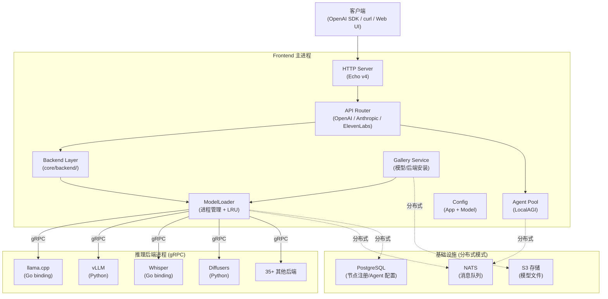
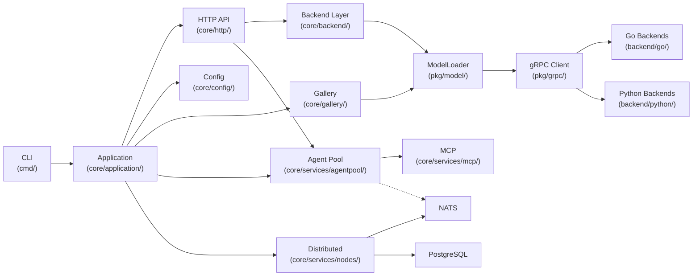
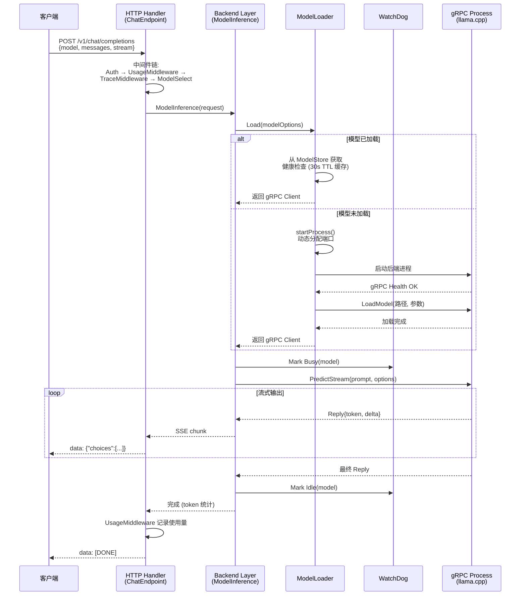
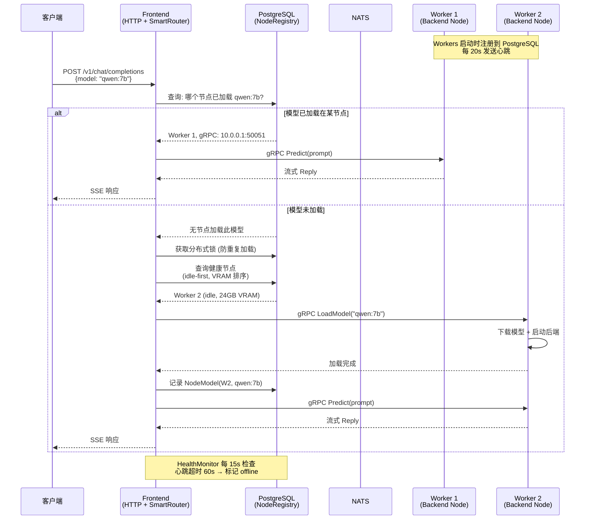

# LocalAI 源码学习笔记

> 仓库地址：[LocalAI](https://github.com/mudler/LocalAI)
> 学习日期：2026-04-05

---

> **以下为 AI 源码分析**
>
> ### 一句话概括
>
> LocalAI 是一个开源的本地 AI 推理引擎，兼容 OpenAI/Anthropic 等 API，通过 gRPC 进程隔离架构统一管理 35+ 后端（llama.cpp、vLLM、Whisper、Diffusers 等），支持 CPU/GPU 多硬件、P2P 和 PostgreSQL+NATS 分布式部署、内置 Agent 系统和 MCP 协议。
>
> ### 要点速览
>
> | 核心模块 | 职责 | 关键文件 |
> |---------|------|---------|
> | CLI & 入口 | 命令行解析、启动流程 | `cmd/local-ai/main.go`, `core/cli/run.go` |
> | Application | 应用生命周期、服务编排 | `core/application/application.go`, `startup.go` |
> | HTTP API | 多协议兼容的 REST API | `core/http/app.go`, `core/http/routes/` |
> | Backend (推理) | LLM/TTS/Image 等推理调用链 | `core/backend/llm.go`, `core/backend/options.go` |
> | ModelLoader | 后端进程管理、LRU 淘汰 | `pkg/model/loader.go`, `pkg/model/watchdog.go` |
> | gRPC 协议 | 进程间通信、后端抽象 | `pkg/grpc/`, `backend/go/`, `backend/python/` |
> | Config | 应用配置 + 模型配置 | `core/config/` |
> | Gallery | 模型/后端的发现、下载、安装 | `core/gallery/`, `core/services/galleryop/` |
> | P2P | libp2p 网络发现与隧道 | `core/p2p/` |
> | 分布式 | PostgreSQL+NATS 多节点协作 | `core/services/distributed/`, `core/services/nodes/` |
> | Agent Pool | 自主 Agent、MCP、知识库 | `core/services/agentpool/`, `core/services/mcp/` |

---

## 项目简介

LocalAI 是一个开源的本地 AI 推理引擎，旨在让用户在自己的硬件上运行各种 AI 模型（LLM、语音、图像、视频），无需 GPU 也可运行。它提供与 OpenAI、Anthropic、ElevenLabs 等商业 API 的 drop-in 兼容接口，支持 35+ 推理后端，覆盖 NVIDIA/AMD/Intel/Apple Silicon/Vulkan/CPU 全平台。核心价值在于隐私优先（数据不离开基础设施）和灵活的部署模式（单机/P2P/分布式集群）。

## 技术栈

| 类别 | 技术 |
|------|------|
| 语言 | Go 1.26（主服务）、Python（部分后端）、C/C++（llama.cpp 等原生后端）、TypeScript（React UI） |
| 框架 | Echo v4（HTTP）、gRPC（后端通信）、libp2p/EdgeVPN（P2P）、NATS（分布式消息）、GORM（ORM） |
| 构建工具 | Makefile、Docker multi-stage、GoReleaser |
| 依赖管理 | Go Modules（`go.mod`）、npm（React UI）、pip（Python 后端） |
| 测试框架 | Ginkgo/Gomega（Go）、testcontainers-go（集成测试） |

## 目录结构

```
LocalAI/
├── cmd/                          # 可执行文件入口
│   ├── local-ai/main.go          #   主服务入口
│   └── launcher/                  #   macOS/Linux 桌面启动器
├── core/                          # 核心业务逻辑
│   ├── application/               #   应用生命周期、启动编排
│   ├── backend/                   #   推理调用链（LLM、TTS、Image 等）
│   ├── cli/                       #   CLI 命令定义和参数绑定
│   ├── config/                    #   ApplicationConfig + ModelConfig
│   ├── gallery/                   #   模型/后端发现与安装
│   ├── http/                      #   HTTP 服务
│   │   ├── endpoints/             #     各 API 的 handler 实现
│   │   ├── routes/                #     路由注册（OpenAI/Anthropic/LocalAI 等）
│   │   ├── middleware/            #     认证、指标、追踪中间件
│   │   ├── auth/                  #     用户认证（OAuth/OIDC/本地）
│   │   └── react-ui/             #     React 前端 SPA
│   ├── p2p/                       #   P2P 网络（libp2p 发现 + 隧道）
│   ├── services/                  #   业务服务
│   │   ├── agentpool/             #     Agent 池（LocalAGI 集成）
│   │   ├── distributed/           #     分布式基础设施
│   │   ├── nodes/                 #     节点注册与健康检查
│   │   ├── mcp/                   #     MCP 协议集成
│   │   ├── jobs/                  #     Job/Task 持久化
│   │   ├── storage/               #     S3 文件管理
│   │   └── galleryop/             #     Gallery 操作服务
│   └── templates/                 #   Prompt 模板引擎
├── pkg/                           # 可复用库
│   ├── model/                     #   ModelLoader、WatchDog、LRU
│   ├── grpc/                      #   gRPC 客户端/服务端抽象
│   └── ...                        #   system、signals 等工具包
├── backend/                       # 后端实现
│   ├── go/                        #   Go 后端（llama、whisper、piper 等）
│   ├── python/                    #   Python 后端（vLLM、transformers、diffusers 等）
│   └── cpp/                       #   C++ 后端（llama-cpp gRPC 服务）
├── gallery/                       # 模型 Gallery 定义文件
├── prompt-templates/              # 内置 prompt 模板
├── tests/                         # 集成测试和 E2E 测试
└── docs/                          # Hugo 文档站源码
```

## 架构设计

### 整体架构

LocalAI 采用**进程隔离 + gRPC 通信**的架构，主进程负责 HTTP API 路由和编排，每个推理后端运行在独立进程中通过 gRPC 通信。支持三种部署模式：单机模式（所有组件在一台机器）、P2P 模式（libp2p 网络发现）、分布式模式（PostgreSQL + NATS 多节点集群）。



### 核心模块

#### 1. CLI & Application 启动

**职责**：解析命令行参数/环境变量，初始化 Application 对象，编排所有服务启动。

- **关键文件**：`cmd/local-ai/main.go`, `core/cli/cli.go`, `core/cli/run.go`, `core/application/startup.go`
- **核心类/函数**：
  - `CLI` struct：Kong 框架定义的命令树（Run/Models/Backends/Agent/Worker 等子命令）
  - `RunCMD.Run()`：主命令处理，构建 `config.AppOption` 列表，调用 `application.New()`
  - `application.New()`：核心启动函数，依次执行目录创建、Auth 初始化、分布式服务初始化、模型预加载、WatchDog 启动
- **与其他模块关系**：是所有模块的入口，组装并启动 Config、Gallery、HTTP、P2P、AgentPool 等

#### 2. HTTP API 层

**职责**：多协议兼容的 REST API 服务器，统一的中间件栈（认证、CORS、CSRF、指标、追踪）。

- **关键文件**：`core/http/app.go`, `core/http/routes/*.go`, `core/http/endpoints/`
- **核心函数**：
  - `http.API(app)`：创建 Echo 实例，注册所有中间件和路由
  - `RegisterOpenAIRoutes`：OpenAI 兼容路由（`/v1/chat/completions` 等）
  - `RegisterAnthropicRoutes`：Anthropic 兼容路由（`/v1/messages`）
  - `RegisterLocalAIRoutes`：LocalAI 原生 API（模型管理、MCP、检测、TTS 等）
- **支持的 API 兼容层**：OpenAI、Anthropic、ElevenLabs、Jina Rerank、Open Responses
- **与其他模块关系**：调用 Backend 层执行推理，调用 Gallery 进行模型管理

#### 3. Backend 推理层

**职责**：将 HTTP 请求转化为 gRPC 调用，管理推理参数和结果格式化。

- **关键文件**：`core/backend/llm.go`, `core/backend/image.go`, `core/backend/tts.go`, `core/backend/options.go`
- **核心函数**：
  - `ModelInference()`：LLM 推理主函数，处理 prompt 构建、token 计算、流式输出
  - `ModelOptions()`：从 ModelConfig + AppConfig 构建 gRPC 加载选项
  - `ImageGeneration()`、`SoundGeneration()`、`Transcript()` 等
- **与其他模块关系**：依赖 ModelLoader 获取/加载后端，依赖 Config 获取模型参数

#### 4. ModelLoader + WatchDog

**职责**：后端进程的启动/停止/健康检查/LRU 淘汰，是进程管理的核心。

- **关键文件**：`pkg/model/loader.go`, `pkg/model/initializers.go`, `pkg/model/process.go`, `pkg/model/watchdog.go`
- **核心类**：
  - `ModelLoader`：管理所有已加载模型，提供 `Load()`/`ShutdownModel()`/`StopAllGRPC()` 等方法
  - `WatchDog`：监控后端空闲/忙碌超时，执行 LRU 淘汰，支持内存阈值回收
  - `Model`：表示一个已加载的后端进程（gRPC 地址 + 进程句柄）
- **进程管理方式**：每个后端为独立 OS 进程，通过 `go-processmanager` 管理，动态分配端口
- **与其他模块关系**：被 Backend 层调用加载模型，被 Application 配置 WatchDog 参数

#### 5. gRPC 后端抽象

**职责**：定义统一的推理接口协议，封装与后端进程的通信。

- **关键文件**：`pkg/grpc/client.go`, `pkg/grpc/backend.go`, `backend/go/*/main.go`, `backend/python/*/backend.py`
- **通信协议**：protobuf 定义 60+ RPC 方法（Health、LoadModel、Predict、PredictStream、Embeddings 等），消息大小限制 50MB
- **Go 后端**：编译为独立可执行文件，链接 C/C++ 库（如 llama.cpp），启动快内存小
- **Python 后端**：运行 `python3 backend.py --addr host:port`，支持 PyTorch/transformers 等框架

#### 6. Gallery 系统

**职责**：模型和后端的发现、下载、安装、配置管理。

- **关键文件**：`core/gallery/gallery.go`, `core/gallery/models.go`, `core/gallery/backends.go`, `core/services/galleryop/service.go`
- **核心概念**：
  - **Model Gallery**：模型定义仓库（YAML 配置 + 权重文件 URL）
  - **Backend Gallery**：后端引擎仓库（OCI 镜像或可执行文件）
  - **Meta Backend**：根据系统能力（GPU 类型）自动选择最佳后端
- **配置覆盖优先级**：安装请求 Overrides > Gallery Overrides > ConfigFile > URL 配置 > 默认值

#### 7. 分布式系统

**职责**：多节点集群的节点注册、健康检查、智能路由、Job 调度。

- **关键文件**：`core/services/nodes/registry.go`, `core/services/nodes/health.go`, `core/services/nodes/smart_router.go`, `core/services/distributed/`
- **核心组件**：
  - `NodeRegistry`：PostgreSQL 存储的节点注册表（BackendNode + NodeModel）
  - `HealthMonitor`：15 秒间隔检查心跳，60 秒超时标记 offline
  - `SmartRouter`：三层路由策略（复用已加载 → 选择最优节点 → 加载新模型）
  - `JobDispatcher`：通过 NATS 分发 Job 到 Worker 节点

#### 8. Agent Pool

**职责**：自主 Agent 管理（LocalAGI 集成），支持工具调用、RAG、MCP、后台任务调度。

- **关键文件**：`core/services/agentpool/`, `core/services/mcp/`
- **两种模式**：
  - **Standalone**：本地 LocalAGI 池，Agent 在 Frontend 进程内执行
  - **Distributed**：NATS 分发到 Worker 执行，PostgreSQL 持久化配置
- **MCP 集成**：支持远程 HTTP MCP 服务器和本地 stdio MCP 服务器

### 模块依赖关系



## 核心流程

### 流程一：LLM 推理请求（`POST /v1/chat/completions`）

这是 LocalAI 最核心的流程——从 HTTP 请求到后端推理再到流式响应。



**关键步骤说明**：

1. **中间件链**：请求先经过 Auth（API Key 验证）→ UsageMW（Token 计量）→ TraceMW（请求追踪）→ ModelSelect（自动选择模型）
2. **模型加载**：ModelLoader 检查 ModelStore，若已加载则直接复用（30 秒健康检查缓存），否则启动新进程
3. **进程启动**：通过 `go-processmanager` 启动独立 OS 进程，分配随机端口，gRPC 健康检查确认就绪
4. **推理执行**：构建 `PredictOptions`（包含 prompt、temperature、top_p 等），发送 gRPC PredictStream
5. **流式返回**：后端逐 token 返回，转换为 OpenAI SSE 格式实时推送给客户端
6. **WatchDog**：追踪模型忙碌/空闲状态，超时自动停止进程，LRU 超限自动淘汰

### 流程二：分布式模式推理路由

在分布式部署中，Frontend 不直接运行后端进程，而是通过 SmartRouter 路由到 Worker 节点。



**SmartRouter 路由策略**：

1. **优先复用**：查找已加载目标模型的健康节点，gRPC 验证后端进程活跃
2. **分布式锁**：获取 PostgreSQL advisory lock 防止并发请求重复加载同一模型
3. **节点选择**：idle-first（空闲节点优先）→ least-loaded（最小负载）→ VRAM 约束过滤
4. **调度配置**：支持 NodeSelector（标签选择器）和 MinReplicas/MaxReplicas（自动扩容）

## 关键设计亮点

### 1. 进程级隔离 + gRPC 统一接口

**解决的问题**：AI 推理后端种类繁多（C++、Python、Go），语言和依赖各异，运行在同一进程中会导致依赖冲突和稳定性问题。

**实现方式**：每个后端运行为独立 OS 进程，通过统一的 gRPC protobuf 接口通信。Go 后端编译为独立可执行文件直接链接 C 库，Python 后端通过 `python3 backend.py --addr host:port` 启动。`pkg/grpc/` 定义了 60+ RPC 方法覆盖所有推理能力。

**为什么这样设计**：
- 进程崩溃不影响主服务
- 不同后端可使用不同 Python 环境 / C 库版本
- 统一接口使新后端只需实现 gRPC service 即可接入
- 支持远程后端（分布式模式天然支持）

### 2. WatchDog + LRU 淘汰 + 内存回收器

**解决的问题**：多模型场景下 GPU/内存资源有限，需要自动管理模型加载和卸载。

**实现方式**（`pkg/model/watchdog.go`）：
- **LRU 淘汰**：`MaxActiveBackends` 限制最大并发后端数，超限时淘汰最久未使用的模型
- **空闲超时**：后端空闲超过 `WatchdogIdleTimeout` 自动停止进程
- **忙碌超时**：后端忙碌超过 `WatchdogBusyTimeout` 强制终止（防止僵死）
- **内存阈值**：`MemoryReclaimer` 监控 GPU VRAM / 系统 RAM 使用率，超过阈值自动驱逐

**为什么这样设计**：单 GPU 设备可能需要在不同时间运行不同模型，自动化内存管理让用户无需手动管理，同时保护系统不会 OOM。

### 3. 多层 API 兼容架构

**解决的问题**：用户已有大量基于 OpenAI/Anthropic SDK 的应用代码，迁移成本高。

**实现方式**（`core/http/routes/`）：
- 每个 API 兼容层独立注册路由（`RegisterOpenAIRoutes`、`RegisterAnthropicRoutes` 等）
- 通过中间件链将不同协议的请求统一转换为内部推理调用
- `RequestExtractor` 中间件负责从请求中提取模型名和配置，屏蔽协议差异
- 路由支持双路径（如 `/v1/chat/completions` 和 `/chat/completions`）确保兼容性

**为什么这样设计**：用户只需改一个 base URL 即可将应用从 OpenAI 切换到 LocalAI，极大降低迁移门槛。

### 4. Meta Backend 自适应后端选择

**解决的问题**：同一功能（如 LLM 推理）在不同硬件上需要不同后端（NVIDIA 用 CUDA 版 llama.cpp，Apple Silicon 用 Metal 版）。

**实现方式**（`core/gallery/backends.go`）：
- Backend Gallery 支持 **Meta Backend** 概念：不指定具体 URI，而是定义 `CapabilitiesMap`（能力映射表）
- `FindBestBackendFromMeta()` 根据系统检测到的 GPU 类型（nvidia/amd/intel/vulkan/metal）自动选择最佳后端
- 自动下载对应平台的 OCI 镜像并安装

**为什么这样设计**：用户无需关心硬件细节，安装模型时自动获取最优后端，开箱即用。

### 5. 双模式分布式设计（P2P + PostgreSQL+NATS）

**解决的问题**：不同场景需要不同的分布式方案——个人用户需要简单的多机协作，企业需要生产级集群。

**实现方式**：
- **P2P 模式**（`core/p2p/`）：基于 libp2p + EdgeVPN，通过 token 连接，自动发现节点，零配置。适合个人多机、家庭实验室
- **分布式模式**（`core/services/nodes/`）：PostgreSQL 存储节点状态和配置，NATS 消息总线传递事件和 Job，S3 存储模型文件。支持 Frontend 多副本、Worker 动态扩缩容、advisory lock 防止冲突

**为什么这样设计**：P2P 模式提供零基础设施的快速启动体验，分布式模式提供企业级的可靠性和可观测性，两者共存满足不同规模需求。
