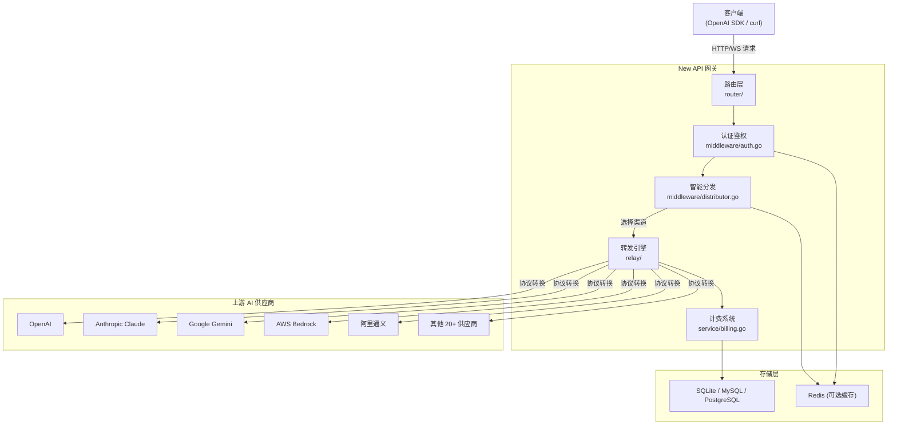
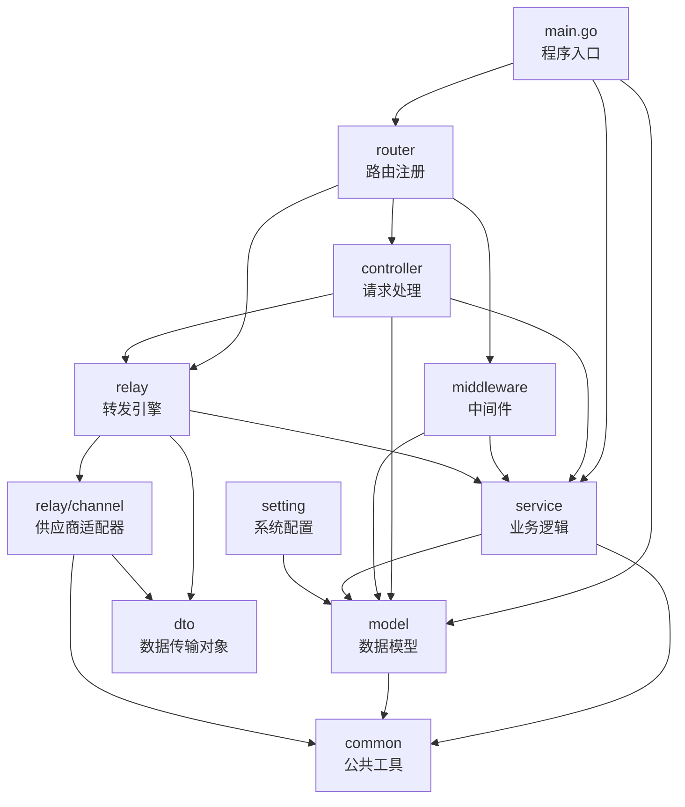
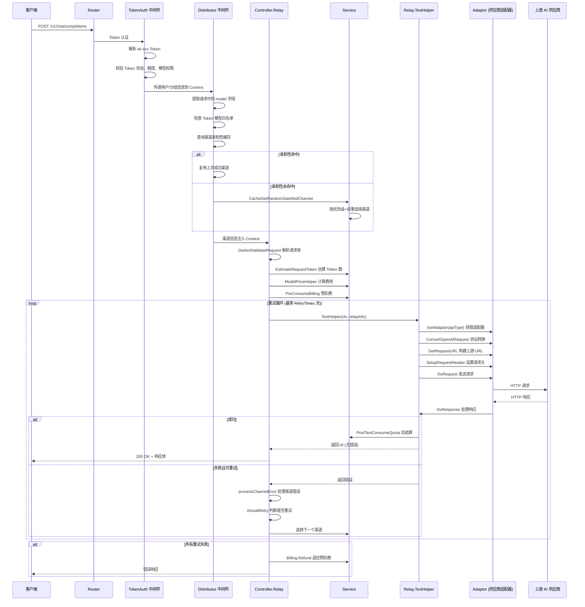
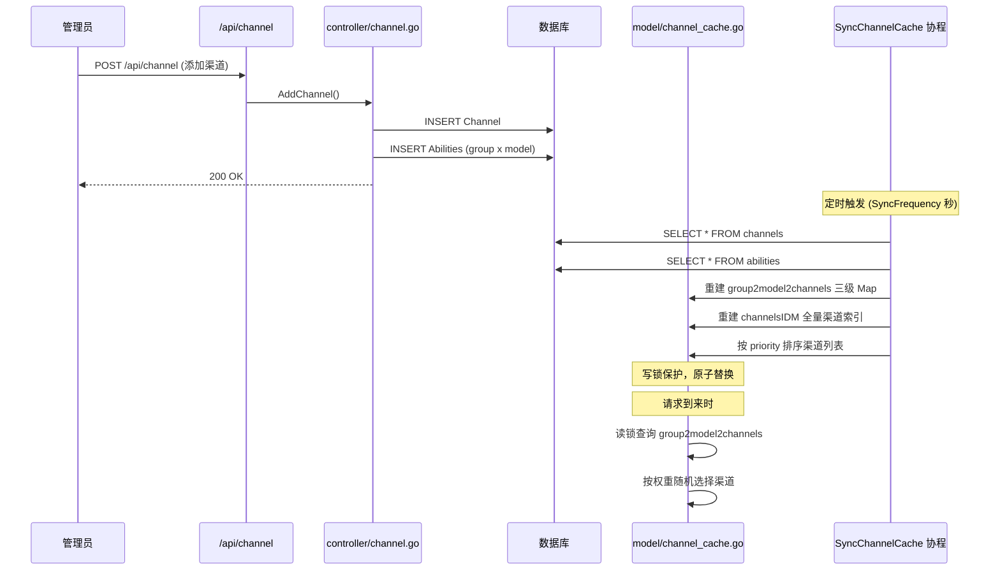

# new-api 源码学习笔记

> 仓库地址：[new-api](https://github.com/QuantumNous/new-api)
> 学习日期：2026-04-05

---

> **以下为 AI 源码分析**
>
> ### 一句话概括
>
> New API 是一个下一代 LLM 网关与 AI 资产管理系统，统一代理 30+ 家 AI 供应商的 API，提供 OpenAI 兼容接口、智能路由、计费管理和多租户权限控制。
>
> ### 要点速览
>
> | 核心模块 | 职责 | 关键文件 |
> |---------|------|---------|
> | relay | API 转发引擎，适配 30+ 供应商协议 | `relay/relay_adaptor.go`, `relay/channel/adapter.go` |
> | controller | HTTP 请求处理与业务编排 | `controller/relay.go`, `controller/channel.go` |
> | middleware | 认证鉴权、渠道分发、限流 | `middleware/auth.go`, `middleware/distributor.go` |
> | model | 数据模型与缓存层 | `model/channel.go`, `model/ability.go`, `model/channel_cache.go` |
> | service | 业务逻辑：计费、渠道选择、Token 计数 | `service/billing.go`, `service/channel_select.go` |
> | router | 路由注册（API / Relay / Dashboard） | `router/api-router.go`, `router/relay-router.go` |
> | web | React 前端（Semi UI） | `web/src/` |

---

## 项目简介

New API（前身基于 One API）是一个开源的 LLM API 网关系统，核心解决"多 AI 供应商统一接入"问题。它将 OpenAI、Claude、Gemini、AWS Bedrock、百度文心、阿里通义等 30 多家 AI 供应商的异构 API 统一封装为 OpenAI 兼容接口，同时提供智能渠道路由（优先级 + 权重 + 自动重试）、按量计费（Token 级精确计费与预扣费/后结算）、多租户权限管理（用户/分组/Token/订阅）以及现代化的 Web 管理后台。适用于企业级 AI 中台、API 分销平台和个人 AI 服务聚合等场景。

## 技术栈

| 类别 | 技术 |
|------|------|
| 语言 | Go 1.25+ (后端), JavaScript/JSX (前端) |
| 框架 | Gin (HTTP), React 18 + Semi UI (前端) |
| 构建工具 | Go Build, Vite (前端), Docker Multi-stage Build |
| 依赖管理 | Go Modules, Bun (前端) |
| 测试框架 | Go testing + testify |
| 数据库 | SQLite / MySQL / PostgreSQL (GORM) |
| 缓存 | Redis (可选), 内存缓存 |
| 其他 | WebSocket (gorilla/websocket), Pyroscope (性能监控), i18n (多语言) |

## 目录结构

```
new-api/
├── main.go                  # 程序入口：初始化资源、启动 Gin HTTP 服务器
├── router/                  # 路由注册
│   ├── main.go              #   路由总入口
│   ├── api-router.go        #   管理 API 路由 (/api/*)
│   ├── relay-router.go      #   AI 转发路由 (/v1/*, /mj/*, /suno/*)
│   ├── dashboard.go         #   Dashboard 路由
│   └── web-router.go        #   前端静态资源路由
├── controller/              # 请求处理器（HTTP Handler）
│   ├── relay.go             #   核心转发控制器
│   ├── channel.go           #   渠道管理
│   ├── user.go              #   用户管理
│   ├── token.go             #   Token 管理
│   └── billing.go           #   计费相关
├── middleware/               # Gin 中间件
│   ├── auth.go              #   Session/AccessToken 认证
│   ├── distributor.go       #   模型→渠道智能分发
│   ├── rate-limit.go        #   全局/模型级限流
│   └── cache.go             #   缓存中间件
├── relay/                   # 转发引擎核心
│   ├── relay_adaptor.go     #   适配器工厂（30+ 供应商）
│   ├── compatible_handler.go#   OpenAI 兼容文本转发
│   ├── claude_handler.go    #   Claude Messages 格式转发
│   ├── gemini_handler.go    #   Gemini 原生格式转发
│   ├── image_handler.go     #   图像生成转发
│   ├── audio_handler.go     #   音频转发
│   ├── channel/             #   各供应商适配器实现
│   │   ├── adapter.go       #     Adaptor 接口定义
│   │   ├── openai/          #     OpenAI 适配器
│   │   ├── claude/          #     Anthropic Claude 适配器
│   │   ├── gemini/          #     Google Gemini 适配器
│   │   ├── aws/             #     AWS Bedrock 适配器
│   │   ├── ali/             #     阿里通义适配器
│   │   └── ...              #     其他 20+ 供应商适配器
│   ├── common/              #   RelayInfo、ChannelMeta 等转发上下文
│   └── constant/            #   转发模式常量
├── model/                   # 数据模型层（GORM）
│   ├── main.go              #   数据库初始化
│   ├── channel.go           #   渠道模型
│   ├── channel_cache.go     #   渠道缓存（group→model→channels）
│   ├── ability.go           #   能力表（group×model×channel 映射）
│   ├── user.go              #   用户模型
│   ├── token.go             #   API Token 模型
│   ├── pricing.go           #   模型定价
│   └── subscription.go      #   订阅模型
├── service/                 # 业务逻辑层
│   ├── billing.go           #   预扣费/后结算计费
│   ├── channel_select.go    #   渠道选择（优先级+权重+分组轮转）
│   ├── channel_affinity.go  #   渠道亲和性（会话保持）
│   ├── token_counter.go     #   Token 计数
│   └── quota.go             #   额度管理
├── dto/                     # 数据传输对象（请求/响应结构体）
├── common/                  # 公共工具（环境变量、Redis、加密等）
├── constant/                # 全局常量（渠道类型、API 类型等）
├── setting/                 # 系统配置模块
├── oauth/                   # OAuth 登录（GitHub/Discord/OIDC 等）
├── i18n/                    # 国际化
├── web/                     # React 前端源码
│   └── src/
│       ├── pages/           #   页面组件
│       ├── components/      #   公共组件
│       └── services/        #   API 调用服务
└── Dockerfile               # 多阶段构建（Bun + Go + Debian）
```

## 架构设计

### 整体架构

New API 采用经典的**反向代理网关**架构，核心思路是"统一入口 + 协议适配 + 智能路由"：

1. **统一入口层**：通过 Gin HTTP Server 接收所有 AI API 请求，支持 OpenAI / Claude / Gemini 多种格式入口
2. **认证鉴权层**：Token 认证 + 用户分组 + 模型权限控制
3. **智能分发层**：根据模型名、用户分组、渠道优先级/权重，选择最优上游渠道
4. **协议适配层**：通过 Adaptor 接口模式，将统一请求转换为各供应商的原生协议
5. **计费结算层**：预扣费 → 转发 → 后结算，精确到 Token 级别



### 核心模块

#### 1. Relay 转发引擎（`relay/`）

**职责**：将客户端请求适配并转发到上游 AI 供应商，处理流式/非流式响应。

**核心接口** — `Adaptor`（`relay/channel/adapter.go`）：

```
Adaptor 接口定义了每个供应商适配器必须实现的方法：
- Init()                      初始化适配器
- GetRequestURL()             构建上游请求 URL
- SetupRequestHeader()        设置请求头（鉴权等）
- ConvertOpenAIRequest()      将 OpenAI 格式请求转为供应商格式
- DoRequest()                 执行 HTTP 请求
- DoResponse()                处理响应并转换回统一格式
- GetModelList()              返回支持的模型列表
```

**适配器工厂**（`relay/relay_adaptor.go`）：`GetAdaptor(apiType)` 根据渠道 API 类型返回对应的适配器实例，当前支持 30+ 供应商。

**转发处理器**：根据请求类型分派到不同的 Handler：
- `TextHelper()` — Chat Completions 文本对话
- `ImageHelper()` — 图像生成
- `AudioHelper()` — 音频处理
- `EmbeddingHelper()` — 向量嵌入
- `RerankHelper()` — Rerank 重排序
- `ClaudeHelper()` — Claude Messages 原生格式
- `GeminiHelper()` — Gemini 原生格式
- `WssHelper()` — WebSocket Realtime API
- `ResponsesHelper()` — OpenAI Responses 格式

#### 2. 智能分发（`middleware/distributor.go` + `service/channel_select.go`）

**职责**：根据请求模型名和用户分组，选择最优上游渠道。

**选择策略**：
1. **渠道亲和性**（Channel Affinity）：优先复用上次成功使用的渠道（会话保持）
2. **优先级分层**：同分组下按 `priority` 降序，高优先级渠道先尝试
3. **权重随机**：同优先级渠道间按 `weight` 做加权随机
4. **自动分组轮转**：`auto` 分组模式下，依次尝试用户可用的多个分组
5. **失败自动重试**：请求失败时自动切换到下一个渠道重试

**核心数据结构** — Ability 表（`model/ability.go`）：
```
Ability { Group, Model, ChannelId, Priority, Weight, Enabled }
```
表达"哪个分组下的哪个模型可以由哪个渠道提供服务"的三维映射关系。

#### 3. 计费系统（`service/billing.go` + `service/text_quota.go`）

**职责**：精确到 Token 级别的预扣费/后结算计费。

**计费流程**：
1. 根据模型定价 + 分组倍率估算请求费用
2. 预扣费（`PreConsumeBilling`）：从用户余额/订阅额度预扣
3. 转发请求到上游
4. 根据上游返回的实际 Usage 后结算（`SettleBilling`）：多退少补
5. 失败时退款（`Refund`）

**计费来源**：支持钱包余额（`wallet`）和订阅额度（`subscription`）两种计费源。

#### 4. 数据模型与缓存（`model/`）

**职责**：数据持久化与高性能缓存。

**核心模型**：
- `Channel` — 上游渠道（支持 Multi-Key 轮询/随机模式）
- `Ability` — 分组×模型×渠道的能力映射
- `User` — 用户（角色：Root/Admin/Common）
- `Token` — API 密钥（可限制模型、设定过期时间）
- `Pricing` — 模型定价（支持按量/按次两种模式）

**缓存机制**（`model/channel_cache.go`）：
- 启动时加载全部渠道和能力数据到内存（`group2model2channels` 三级 Map）
- 定时同步（`SyncChannelCache`，默认周期可配置）
- 读写锁保护（`channelSyncLock`）

### 模块依赖关系



## 核心流程

### 流程一：Chat Completions 请求转发（核心业务流程）

这是 New API 最核心的业务流程 — 将客户端的 `/v1/chat/completions` 请求转发到上游供应商并返回响应。



**关键逻辑说明**：

1. **Token 认证**（`middleware/auth.go:TokenAuth`）：从请求头 `Authorization: Bearer sk-xxx` 提取 Token，查询缓存/DB 验证有效性，将用户 ID、分组、额度等信息写入 Gin Context
2. **智能分发**（`middleware/distributor.go:Distribute`）：先尝试渠道亲和性命中，失败则走 `CacheGetRandomSatisfiedChannel` 按优先级+权重选择
3. **预扣费**（`service/billing.go:PreConsumeBilling`）：创建 `BillingSession`，先扣除预估额度，防止并发超额
4. **协议转换**（`relay/channel/*/adaptor.go`）：每个供应商有独立的 `Adaptor` 实现，负责将 OpenAI 格式的请求/响应转换为供应商原生格式
5. **后结算**（`service/billing.go:SettleBilling`）：根据上游返回的实际 `Usage`（prompt_tokens + completion_tokens）计算真实费用，与预扣费做 delta 结算

### 流程二：渠道管理与能力缓存同步

这是系统管理层面的关键流程 — 管理员添加/修改渠道后，如何同步到内存缓存使其生效。



**关键逻辑说明**：

1. **Ability 表**是渠道分发的核心索引，表达 `(group, model) → [channel_id]` 的映射
2. **内存缓存** `group2model2channels` 是一个三级 Map：`group → model → []channelId`，避免每次请求都查库
3. **缓存同步**通过独立协程定期全量刷新，使用读写锁（`channelSyncLock`）保证并发安全
4. **Multi-Key 模式**：单个渠道可配置多个 API Key，支持轮询（Polling）或随机（Random）模式分担流量

## 关键设计亮点

### 1. Adaptor 适配器模式 — 统一异构 AI API

**解决的问题**：30+ 家 AI 供应商各有不同的 API 协议（OpenAI、Claude Messages、Gemini、百度文心等），如何用统一的代码框架接入？

**实现方式**：定义 `Adaptor` 接口（`relay/channel/adapter.go`），每个供应商实现一个独立的适配器包（如 `relay/channel/openai/`、`relay/channel/claude/`）。工厂函数 `GetAdaptor(apiType)` 根据渠道类型返回对应实例。

**设计优势**：新增供应商只需：①实现 `Adaptor` 接口 ②在 `relay_adaptor.go` 注册 ③添加常量。无需修改核心转发逻辑，完全符合开闭原则。

### 2. 预扣费/后结算的 BillingSession 模式

**解决的问题**：AI API 调用是"先请求后知道费用"的模式（Token 数在响应后才知道），如何防止并发请求超额消费？

**实现方式**（`service/billing.go` + `service/billing_session.go`）：
1. 请求前根据预估 Token 数创建 `BillingSession` 并预扣费
2. 请求成功后根据实际 Usage 做 delta 结算（多退少补）
3. 请求失败时全额退款（`Refund`）
4. 支持钱包和订阅两种计费源，通过 `BillingSession` 抽象统一处理

**设计优势**：既防止超额又保证精确计费，支持并发场景下的额度安全。

### 3. 三维能力映射 + 加权随机选择

**解决的问题**：如何在"多用户分组 × 多模型 × 多渠道"的复杂场景下高效路由？

**实现方式**（`model/ability.go` + `model/channel_cache.go`）：
- `Ability` 表建立 `(Group, Model, ChannelId)` 的三维映射，预计算每个 `(group, model)` 下可用的渠道列表
- 内存缓存 `group2model2channels` 将映射加载到三级 Map，O(1) 查找
- 同优先级渠道间按 `weight` 加权随机选择，实现灵活的流量分配

**设计优势**：将复杂的路由决策从"每次查库 + 过滤"降为"内存 Map 查找 + 加权随机"，适合高并发场景。

### 4. 渠道亲和性（Channel Affinity）

**解决的问题**：部分场景下需要同一用户/会话持续使用同一渠道（如 Realtime API 状态保持、避免不同供应商间的行为差异）。

**实现方式**（`service/channel_affinity.go`）：
- 请求成功后记录 `(user, model, group) → channelId` 的亲和性映射
- 后续请求优先从亲和性缓存查找渠道
- 亲和性失败时降级为正常选择逻辑

**设计优势**：在不牺牲灵活性的前提下提供会话级的渠道一致性保障。

### 5. Multi-Key 渠道模式

**解决的问题**：单个上游渠道可能有多个 API Key（如组织有多个 OpenAI 账号），需要分担流量和限流压力。

**实现方式**（`model/channel.go:ChannelInfo`）：
- `Channel` 支持配置多个 Key（换行分隔或 JSON 数组）
- `ChannelInfo.MultiKeyMode` 支持轮询（Polling）和随机（Random）两种模式
- 每个 Key 独立的状态管理（启用/禁用/禁用原因/禁用时间）
- 轮询模式下维护 `MultiKeyPollingIndex`，缓存同步时保留轮询位置

**设计优势**：在渠道级别实现了 Key 级的负载均衡和故障隔离，无需为每个 Key 创建独立渠道。
