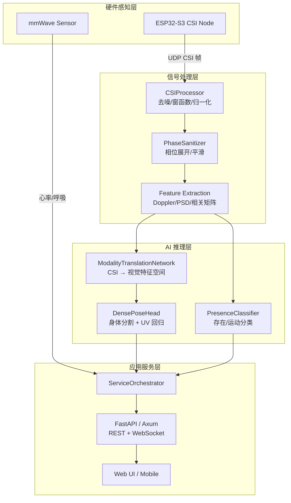
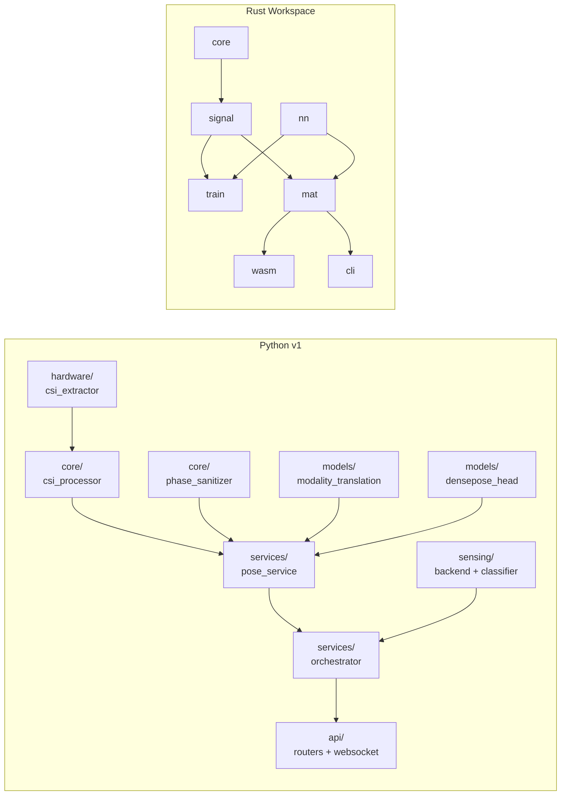
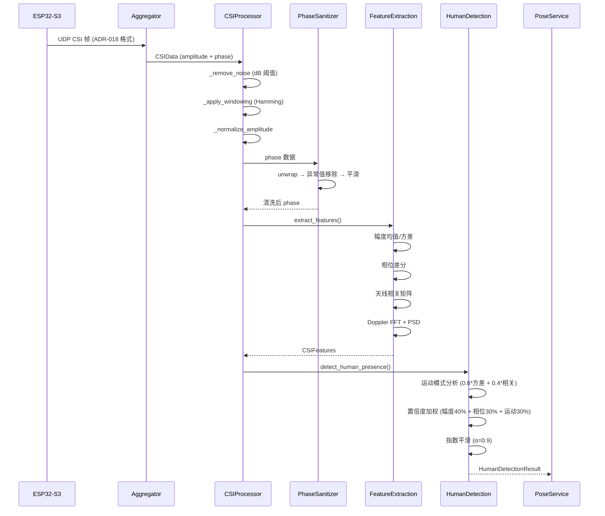
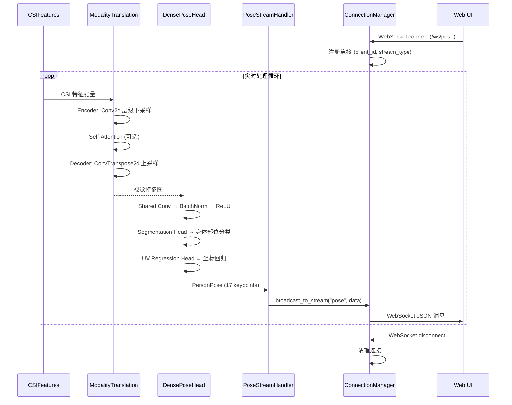

# RuView 源码学习笔记

> 仓库地址：[RuView](https://github.com/ruvnet/RuView)
> 学习日期：2026-04-05

---

> **以下为 AI 源码分析**
>
> ### 一句话概括
>
> RuView 是一个基于 WiFi CSI（Channel State Information）信号的感知平台，能够通过普通 WiFi 信号实现穿墙人体检测、姿态估计、生命体征监测和活动识别，无需摄像头或可穿戴设备。
>
> ### 要点速览
>
> | 核心模块 | 职责 | 关键文件 |
> |---------|------|---------|
> | CSI 信号处理 | 从 ESP32 采集 WiFi CSI 数据并提取特征 | `v1/src/core/csi_processor.py`, `v1/src/hardware/csi_extractor.py` |
> | 姿态估计模型 | 将 CSI 特征映射为人体姿态（17 COCO keypoints） | `v1/src/models/densepose_head.py`, `v1/src/models/modality_translation.py` |
> | Sensing 后端 | RSSI 级别的存在检测和运动分类 | `v1/src/sensing/backend.py`, `v1/src/sensing/classifier.py` |
> | REST API & WebSocket | 提供实时姿态流和管理接口 | `v1/src/app.py`, `v1/src/api/routers/pose.py` |
> | Rust 高性能移植 | 15 个 crate 的 workspace，实现信号处理和推理加速 | `rust-port/wifi-densepose-rs/crates/` |
> | ESP32 固件 | 嵌入式 CSI 采集、UDP 流和边缘推理 | `firmware/esp32-csi-node/main/main.c` |
> | Web UI | 3D 可视化仪表盘、姿态渲染和传感器监控 | `ui/app.js`, `ui/components/` |

---

## 项目简介

RuView 是一个 WiFi 感知平台，将普通 WiFi 路由器发射的无线电波转化为空间智能。当人体在 WiFi 覆盖范围内移动、呼吸甚至静坐时，都会扰动无线电波的 Channel State Information (CSI)。RuView 通过低成本 ESP32-S3 传感器（约 $9/节点）捕获这些扰动，利用信号处理和深度学习将其转化为：人体存在/占用检测、呼吸率和心率等生命体征监测、17 关键点人体姿态估计（WiFlow 架构）、活动识别和跌倒检测、RF 环境指纹和穿墙感知。系统完全运行在边缘硬件上，不依赖云端、不需要摄像头、不需要互联网连接。基于 Carnegie Mellon University 的 *DensePose From WiFi* 研究成果发展而来。

## 技术栈

| 类别 | 技术 |
|------|------|
| 语言 | Python 3.9+, Rust 1.85+, C (ESP-IDF), JavaScript (ES Modules), TypeScript (React Native) |
| 框架 | FastAPI (Python API), Axum (Rust API), PyTorch (神经网络), FreeRTOS (固件) |
| 构建工具 | Makefile, Cargo (Rust workspace), ESP-IDF v5.4, wasm-pack (WASM) |
| 依赖管理 | pip / pyproject.toml, Cargo.toml (workspace), npm (UI) |
| 测试框架 | pytest + pytest-asyncio (Python, 1463 tests), cargo test (Rust, 1031+ tests) |

## 目录结构

```
RuView/
├── v1/                          # Python v1 代码库（核心业务逻辑）
│   ├── src/
│   │   ├── main.py              # 应用入口，启动 FastAPI 服务
│   │   ├── app.py               # FastAPI 应用工厂
│   │   ├── cli.py               # CLI 命令行接口 (click)
│   │   ├── config.py            # 集中配置管理器
│   │   ├── config/              # Settings 和 DomainConfig
│   │   ├── core/                # 核心信号处理（CSI 处理器、相位清洗）
│   │   ├── models/              # 神经网络模型（DensePose Head、模态转换）
│   │   ├── sensing/             # RSSI 感知后端（采集器、特征提取、分类器）
│   │   ├── services/            # 业务服务层（编排器、姿态、硬件、流）
│   │   ├── api/                 # API 路由、WebSocket、中间件
│   │   ├── hardware/            # 硬件接口（CSI 提取、路由器通信）
│   │   ├── middleware/          # 认证、限流、错误处理中间件
│   │   ├── database/            # SQLAlchemy 模型和迁移
│   │   ├── tasks/               # 后台任务（备份、清理、监控）
│   │   └── testing/             # Mock 数据生成器
│   ├── tests/                   # 单元/集成/E2E/性能测试
│   ├── docs/                    # API 文档和用户指南
│   └── data/proof/              # 确定性管线验证（Trust Kill Switch）
├── rust-port/wifi-densepose-rs/ # Rust 高性能移植（15 crate workspace）
│   └── crates/
│       ├── wifi-densepose-core/     # 核心类型和 trait
│       ├── wifi-densepose-signal/   # SOTA 信号处理 + RuvSense 多站感知
│       ├── wifi-densepose-nn/       # 神经网络推理（ONNX/PyTorch/Candle）
│       ├── wifi-densepose-train/    # 训练管线 + RuVector 集成
│       ├── wifi-densepose-mat/      # WiFi-Mat 灾害幸存者检测
│       ├── wifi-densepose-hardware/ # ESP32 聚合器和 TDM 协议
│       ├── wifi-densepose-ruvector/ # 跨视角融合
│       ├── wifi-densepose-api/      # Axum REST API
│       ├── wifi-densepose-wasm/     # WebAssembly 浏览器部署
│       ├── wifi-densepose-vitals/   # 生命体征提取
│       ├── wifi-densepose-wifiscan/ # 多 BSSID WiFi 扫描
│       └── ...                      # cli, db, config, desktop 等
├── firmware/esp32-csi-node/     # ESP32-S3 固件（C / ESP-IDF）
│   └── main/main.c             # 主入口：WiFi STA + CSI 采集 + UDP 流
├── ui/                          # Web 前端（原生 JS + ES Modules）
│   ├── app.js                   # 应用入口
│   ├── components/              # Tab 管理、仪表盘、传感器面板等
│   ├── services/                # API/WebSocket/健康检查服务
│   └── mobile/                  # React Native 移动端
├── docker/                      # Docker 部署（Rust sensing-server + Python）
├── scripts/                     # Node.js 感知脚本（17 个应用）
└── docs/adr/                    # 43 个架构决策记录 (ADR)
```

## 架构设计

### 整体架构

RuView 采用分层架构，从底层硬件到上层应用分为四个主要层次：

1. **硬件感知层**：ESP32-S3 固件通过 WiFi CSI 回调函数捕获子载波级别的信道状态信息，以 ADR-018 二进制格式通过 UDP 流式传输到聚合器。支持多频道跳频、WASM 边缘推理和 OTA 升级。
2. **信号处理层**：Python 的 `CSIProcessor` 和 `PhaseSanitizer`（或 Rust 的 `wifi-densepose-signal`）对原始 CSI 数据进行去噪、Hamming 窗函数、归一化、相位展开、Doppler 特征提取等处理，输出结构化的 `CSIFeatures`。
3. **AI 推理层**：`ModalityTranslationNetwork` 将 CSI 特征空间映射到视觉特征空间，`DensePoseHead` 在此基础上进行身体部位分割和 UV 坐标回归，输出 17 COCO 关键点。同时 `PresenceClassifier` 提供基于规则的存在/运动分类。
4. **应用服务层**：`ServiceOrchestrator` 统一编排所有服务的生命周期，FastAPI/Axum 提供 REST API 和 WebSocket 实时流，Web UI 提供 3D 可视化。



### 核心模块

#### 1. CSI 信号处理管线（`v1/src/core/`）

**职责**：接收原始 CSI 数据帧，经过完整的信号处理管线输出结构化特征。

- **`csi_processor.py`**：核心处理类 `CSIProcessor`，完整管线包括：
  - `preprocess_csi_data()` → 去噪（dB 阈值过滤）→ Hamming 窗函数 → 幅度归一化
  - `extract_features()` → 幅度均值/方差、相位差分、天线相关矩阵、Doppler FFT、PSD
  - `detect_human_presence()` → 运动模式分析 → 置信度计算 → 时序指数平滑
- **`phase_sanitizer.py`**：`PhaseSanitizer` 处理相位数据的展开、异常值移除和平滑
- **关键数据结构**：`CSIData`（原始帧）、`CSIFeatures`（提取特征）、`HumanDetectionResult`（检测结果）

#### 2. 神经网络模型（`v1/src/models/`）

**职责**：跨模态翻译和人体姿态估计。

- **`modality_translation.py`**：`ModalityTranslationNetwork`，编码器-解码器架构，将 CSI 信号特征空间映射到视觉特征空间。支持可选的 Multi-Head Self-Attention 机制。
- **`densepose_head.py`**：`DensePoseHead`，包含共享卷积层、分割头（身体部位分类）和 UV 回归头（坐标预测）。支持可选的 FPN（Feature Pyramid Network）和 Deformable Convolution。

#### 3. 感知后端（`v1/src/sensing/`）

**职责**：基于 RSSI 的轻量级存在检测，适用于无 CSI 硬件的普通 WiFi 设备。

- **`backend.py`**：定义 `SensingBackend` Protocol 和 `CommodityBackend` 实现，将采集器、特征提取器和分类器串联
- **`rssi_collector.py`**：`WifiCollector` 接口 + `LinuxWifiCollector`、`WindowsWifiCollector`、`SimulatedCollector` 实现
- **`classifier.py`**：`PresenceClassifier`，基于 RSSI 方差和运动频段能量的规则分类器，输出 ABSENT / PRESENT_STILL / ACTIVE
- **`feature_extractor.py`**：从 RSSI 时序中提取方差、频谱能量、变化点等特征

#### 4. 服务编排层（`v1/src/services/`）

**职责**：统一管理所有服务的初始化、启动、监控和关闭。

- **`orchestrator.py`**：`ServiceOrchestrator` 核心编排器
  - 管理 7 个服务：health、metrics、hardware、pose、stream、pose_stream_handler、connection_manager
  - 后台任务循环：健康检查和指标收集
  - 支持单服务重启、全服务重置
- **`pose_service.py`**：`PoseService` 整合 `CSIProcessor` + `PhaseSanitizer` + `DensePoseHead` + `ModalityTranslationNetwork`
- **`hardware_service.py`**：管理 WiFi 路由器和 ESP32 硬件连接

#### 5. Rust 高性能移植（`rust-port/wifi-densepose-rs/`）

**职责**：用 Rust 重写核心信号处理和推理管线，实现 ~810x 性能提升。

16 个 crate 的 workspace，关键 crate：
- **`wifi-densepose-signal`**：SOTA 信号处理 + RuvSense 多站感知（14 个模块），包括 multiband 融合、相位对齐、RF 层析、手势 DTW 等
- **`wifi-densepose-nn`**：支持 ONNX Runtime、PyTorch (tch-rs)、Candle 三种推理后端
- **`wifi-densepose-ruvector`**：RuVector v2.0.4 集成，跨视角注意力融合（5 个模块）
- **`wifi-densepose-train`**：训练管线，含对比学习、数据增强、域适应
- **`wifi-densepose-mat`**：Mass Casualty Assessment Tool，灾害场景幸存者检测
- **`wifi-densepose-wasm`**：编译为 WebAssembly，支持浏览器端推理
- **`wifi-densepose-vitals`**：生命体征提取（呼吸率、心率、异常检测）

#### 6. ESP32 固件（`firmware/esp32-csi-node/`）

**职责**：嵌入式 WiFi CSI 数据采集和边缘处理。

- **`main/main.c`**：ESP-IDF 应用入口，初始化 NVS → WiFi STA → CSI 采集 → UDP 流
- 支持 WASM 边缘推理运行时、OTA 更新、功耗管理
- 集成 mmWave 传感器、Swarm Bridge、显示任务
- 符合 ADR-018 二进制帧格式

### 模块依赖关系



## 核心流程

### 流程一：CSI 数据采集与人体检测

从 ESP32 硬件采集 CSI 帧到输出人体检测结果的完整管线。



**关键逻辑说明**：

1. **去噪**：将幅度转为 dB 域，低于 `noise_threshold` 的子载波置零
2. **Doppler 提取**：维护一个 phase 缓存队列（`deque`），对最近 64 帧的时域相位差做 FFT，得到 Doppler 频谱
3. **时序平滑**：使用指数移动平均（EMA, α=0.9）抑制瞬时误检，提高检测稳定性
4. **人体判定**：平滑后置信度 ≥ 阈值（默认 0.8）即判定人体存在

### 流程二：实时姿态估计与 WebSocket 推送

从 CSI 特征到 17 关键点姿态估计并通过 WebSocket 推送给前端的流程。



**关键逻辑说明**：

1. **模态翻译**：`ModalityTranslationNetwork` 是核心创新点，将 WiFi CSI 这一射频域的特征通过编码器-解码器架构映射到与视觉特征同构的空间
2. **双头输出**：`DensePoseHead` 共享底层卷积特征后分叉为分割头（分类 24 个身体部位）和 UV 回归头（每个部位的 UV 坐标）
3. **连接管理**：`ConnectionManager` 维护所有 WebSocket 连接的元数据，支持按 stream_type 和 zone_ids 进行定向广播

## 关键设计亮点

### 1. 跨模态信号翻译：WiFi CSI → 视觉特征空间

**解决问题**：WiFi 信号与视觉图像是完全不同的数据模态，如何在没有摄像头的情况下实现人体姿态估计？

**实现方式**：`ModalityTranslationNetwork`（`v1/src/models/modality_translation.py`）采用编码器-解码器结构，编码器逐层下采样将 CSI 子载波幅度/相位特征压缩到潜在空间，解码器再上采样到与 DensePose 模型兼容的二维特征图。可选的 Multi-Head Self-Attention 机制帮助模型学习子载波间的长程依赖。

**设计原因**：基于 Carnegie Mellon 的 *DensePose From WiFi* 论文（2022），证明 WiFi CSI 信号中蕴含的菲涅尔区多径信息与人体姿态之间存在可学习的映射关系。通过模态翻译而非端到端直接回归，可以复用成熟的视觉 DensePose 头部网络。

### 2. 双语言双代码库架构（Python + Rust）

**解决问题**：Python 适合快速原型验证和模型训练，但实时推理性能不足；Rust 高性能但开发迭代慢。

**实现方式**：Python v1（`v1/`）作为完整功能参考实现，Rust workspace（`rust-port/wifi-densepose-rs/`）包含 16 个 crate 分别对应不同职责。Rust 版本通过 `wifi-densepose-wasm` crate 编译为 WebAssembly 可直接在浏览器或 ESP32 上运行边缘推理。

**设计原因**：Rust 版本在 M4 Pro 上实现 171K embeddings/s 的吞吐量（约 810x 性能提升），单台 Mac Mini 可处理 1600+ ESP32 节点的数据。同时 WASM 编译使得同一份 Rust 代码可以在浏览器端实现零延迟推理，并通过 `wifi-densepose-wasm-edge` crate 部署到 ESP32 的 WASM 运行时。

### 3. Trust Kill Switch 确定性验证管线

**解决问题**：如何验证信号处理管线的正确性，确保没有引入随机数据或 mock 行为？

**实现方式**：`v1/data/proof/verify.py` 是 "Trust Kill Switch"，使用确定性种子（seed=42）生成 1000 帧合成 CSI 数据，通过生产管线处理后 SHA-256 哈希输出，与预先发布的 `expected_features.sha256` 对比。任何管线变化都会导致哈希不匹配。配合 ADR-028 的 Witness Bundle（包含 Rust 测试日志、固件哈希、crate 版本清单）形成完整的可审计证据链。

**设计原因**：WiFi 感知系统的信号处理管线涉及大量浮点运算和数值方法，微小的算法变更可能导致检测性能退化。确定性验证确保每次代码变更后管线行为完全可复现。

### 4. 分层感知能力降级（CSI → RSSI → Simulated）

**解决问题**：不同硬件能力差异巨大（$9 ESP32 vs 普通笔记本 WiFi vs 无硬件），如何优雅地适配？

**实现方式**：`v1/src/sensing/backend.py` 定义了 `SensingBackend` Protocol 和 `Capability` 枚举。`CommodityBackend`（RSSI 级别）只声明支持 PRESENCE 和 MOTION 两种能力，而 CSI 后端支持全部五种（PRESENCE / MOTION / RESPIRATION / LOCATION / POSE）。Docker 容器中 `CSI_SOURCE` 环境变量支持 `auto`（自动探测 ESP32 UDP → RSSI → 模拟数据）降级策略。

**设计原因**：让用户可以零硬件成本通过 Docker 评估系统，用普通笔记本 WiFi 进行基础感知，逐步升级到 ESP32 mesh 获得完整能力，实现平滑的硬件升级路径。

### 5. 43 个 ADR 驱动的架构演进

**解决问题**：项目涉及信号处理、神经网络、嵌入式、Web 多个领域，如何保持架构决策的可追溯性？

**实现方式**：`docs/adr/` 目录包含 43 个架构决策记录（ADR-001 至 ADR-043），涵盖 SOTA 信号处理算法选型（ADR-014）、训练数据集策略（ADR-015）、RuVector 集成（ADR-016/017）、ESP32 能力审计（ADR-028）、RuvSense 多站感知模式（ADR-029）、WASM 边缘推理（ADR-040）等关键决策。每个 ADR 记录了动机、方案、替代方案和实施状态。

**设计原因**：作为一个跨多技术栈的复杂系统，ADR 确保团队成员和新贡献者能理解每个架构选择背后的原因，避免在不了解历史背景的情况下做出冲突决策。
