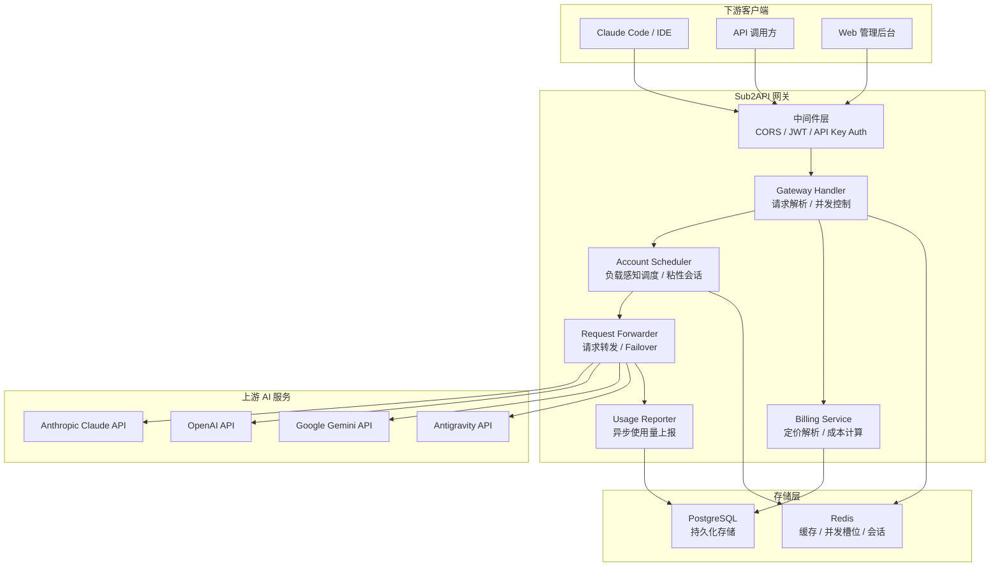
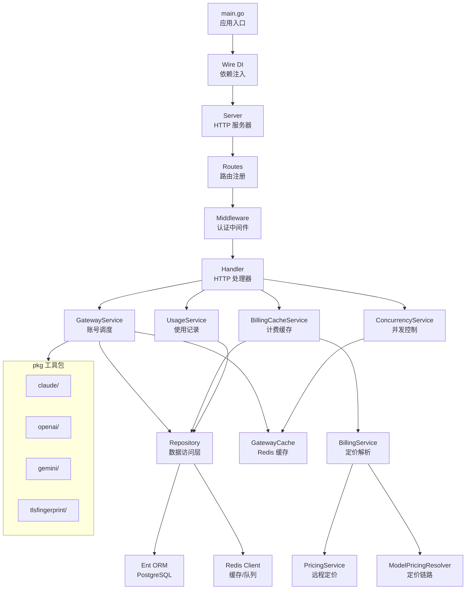
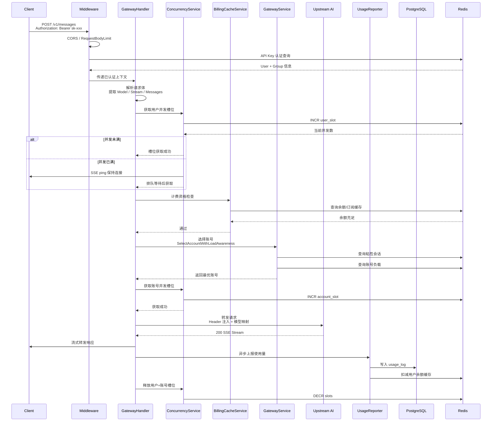
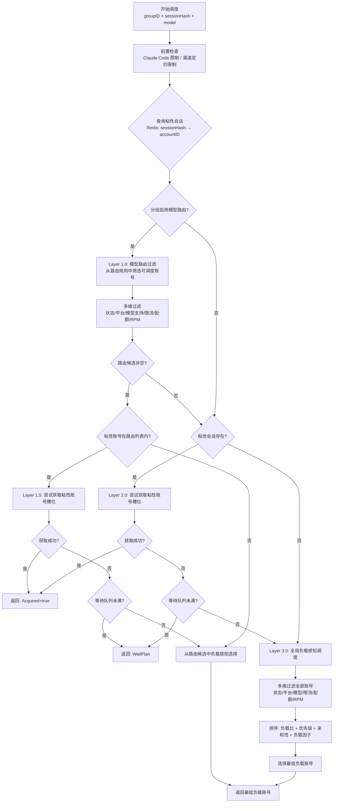

# Sub2API 源码学习笔记

> 仓库地址：[Sub2API](https://github.com/Wei-Shaw/sub2api)
> 学习日期：2026-04-05

---

> **以下为 AI 源码分析**
>
> ### 一句话概括
>
> Sub2API 是一个 AI API 网关平台，将 AI 产品订阅配额转化为标准 API Key 分发给用户，核心解决多账号调度、计费、负载均衡和请求转发问题。
>
> ### 要点速览
>
> | 核心模块 | 职责 | 关键文件 |
> |---------|------|---------|
> | API Gateway | 请求接收、认证、转发、Failover | `backend/internal/handler/gateway_handler.go` |
> | Account Scheduler | 多账号负载感知调度、粘性会话 | `backend/internal/service/gateway_service.go` |
> | Billing | Token 级计费、余额管理、定价解析 | `backend/internal/service/billing_service.go` |
> | Concurrency Control | 用户级+账号级两层并发控制 | `backend/internal/service/concurrency_service.go` |
> | Rate Limiting | RPM/配额/模型级多维限流 | `backend/internal/service/rate_limit_service.go` |
> | Admin Dashboard | Vue 3 管理后台，监控、配置、运维 | `frontend/src/views/admin/` |

---

## 项目简介

Sub2API 是一个面向 AI API 配额分发场景的网关平台。它允许管理员导入多个上游 AI 账号（如 Anthropic Claude、OpenAI、Google Gemini、Antigravity 等），通过平台生成的 API Key 对外提供统一的 API 接口。平台自动处理认证鉴权、请求转发、账号调度（负载均衡 + 粘性会话）、并发控制、Token 级精确计费和 Failover 故障转移，使得一组订阅账号可以安全、高效地服务大量下游用户。

## 技术栈

| 类别 | 技术 |
|------|------|
| 语言 | Go 1.26、TypeScript 5.6 |
| 框架 | Gin (后端 HTTP)、Vue 3.4+ (前端 SPA) |
| 构建工具 | Go Build (后端)、Vite 5+ (前端) |
| 依赖管理 | Go Modules、pnpm |
| 数据库 | PostgreSQL 15+、Redis 7+ |
| ORM | Ent (Schema-based 代码生成) |
| 依赖注入 | Google Wire (编译时 DI) |
| 前端状态管理 | Pinia |
| 前端样式 | TailwindCSS |
| 测试框架 | Go testing + testcontainers、Vitest |

## 目录结构

```
sub2api/
├── backend/                          # Go 后端服务
│   ├── cmd/server/                   # 应用入口，main.go + Wire 依赖注入
│   ├── internal/                     # 内部模块（核心业务逻辑）
│   │   ├── config/                   # 配置加载与管理
│   │   ├── domain/                   # 领域模型（常量、枚举、纯数据结构）
│   │   ├── model/                    # 数据模型定义
│   │   ├── repository/               # 数据访问层（Ent ORM + Redis 缓存）
│   │   ├── service/                  # 业务服务层（~418 个文件，核心逻辑所在）
│   │   ├── handler/                  # HTTP 处理器层 + DTO
│   │   │   ├── admin/                # 管理后台 API 处理器（23 个子处理器）
│   │   │   └── dto/                  # 请求/响应传输对象
│   │   ├── server/                   # HTTP 服务器、路由注册、中间件
│   │   │   ├── routes/               # 路由分组注册
│   │   │   └── middleware/           # JWT/APIKey/CORS 等中间件
│   │   ├── pkg/                      # 通用工具包（Claude/OpenAI/Gemini 客户端等）
│   │   ├── setup/                    # 首次运行初始化向导
│   │   └── web/                      # 前端嵌入（embed 模式）
│   ├── ent/                          # Ent ORM Schema 和生成代码
│   └── migrations/                   # 数据库迁移文件（90+ 个）
│
├── frontend/                         # Vue 3 前端应用
│   └── src/
│       ├── api/                      # API 调用层（Axios 封装 + 20+ 接口模块）
│       ├── stores/                   # Pinia 状态管理（Auth/App/Subscription 等）
│       ├── views/                    # 页面视图（auth/user/admin 三大区域）
│       ├── components/               # 可复用组件库
│       ├── composables/              # Vue 3 组合函数
│       ├── router/                   # 路由配置与守卫
│       ├── i18n/                     # 国际化（英文/中文）
│       └── types/                    # TypeScript 类型定义
│
├── deploy/                           # 部署配置
│   ├── docker-compose.yml            # Docker Compose 编排
│   ├── install.sh                    # 一键安装脚本
│   └── config.example.yaml           # 配置示例文件
│
└── Makefile                          # 顶层构建入口
```

## 架构设计

### 整体架构

Sub2API 采用经典的**分层架构**，后端通过 Google Wire 实现编译时依赖注入，前端采用 Vue 3 + Pinia 的 SPA 架构。整体系统作为 AI API 网关，位于下游用户和上游 AI 服务之间，负责请求鉴权、账号调度、请求转发和计费统计。



### 核心模块

#### 1. Gateway Handler（网关处理器）

**职责**：接收 HTTP 请求，完成认证校验、请求解析、并发控制，协调调度和转发流程。

**核心文件**：
- `backend/internal/handler/gateway_handler.go` — 主入口 `Messages()` 函数
- `backend/internal/handler/gateway_handler_responses.go` — OpenAI Responses API 适配
- `backend/internal/handler/gateway_handler_chat_completions.go` — Chat Completions 适配
- `backend/internal/handler/failover_loop.go` — Failover 循环逻辑
- `backend/internal/handler/gateway_helper.go` — 请求解析辅助函数

**关键函数**：
- `Messages()` — Claude API `/v1/messages` 主处理函数，串联整个请求生命周期
- `handleFailoverLoop()` — 多账号故障转移循环
- `ParseGatewayRequest()` — 统一请求格式解析

**与其他模块关系**：调用 GatewayService（调度）、BillingCacheService（计费校验）、ConcurrencyService（并发控制）。

#### 2. Account Scheduler（账号调度器）

**职责**：从账号池中选出最优账号，支持分层负载感知调度和粘性会话。

**核心文件**：
- `backend/internal/service/gateway_service.go` — 核心调度逻辑 `SelectAccountWithLoadAwareness()`
- `backend/internal/service/openai_account_scheduler.go` — OpenAI 专用调度策略
- `backend/internal/service/concurrency_service.go` — 并发槽位管理

**关键函数**：
- `SelectAccountWithLoadAwareness()` — 分层调度入口（~400 行），包含 Layer 1.0 模型路由 → Layer 1.5 粘性路由 → Layer 2.0 粘性全局 → Layer 3.0 负载感知
- `GenerateSessionHash()` — 基于 ClientIP + User-Agent + APIKeyID 生成会话哈希
- `listSchedulableAccounts()` — 构建可调度账号列表
- `isAccountSchedulableForSelection()` — 多维可调度性检查

**与其他模块关系**：依赖 Repository 层读取账号数据，依赖 Redis 管理粘性会话和并发槽位。

#### 3. Billing Service（计费服务）

**职责**：模型定价解析、成本计算、余额管理、订阅配额检查。

**核心文件**：
- `backend/internal/service/billing_service.go` — 模型定价解析
- `backend/internal/service/billing_cache_service.go` — 余额/订阅缓存检查
- `backend/internal/service/model_pricing_resolver.go` — 定价链路：Channel → LiteLLM → Fallback
- `backend/internal/service/pricing_service.go` — LiteLLM 远程定价数据管理

**关键函数**：
- `CheckBillingEligibility()` — 请求前资格检查（余额、订阅、API Key 限额）
- `Resolve()` — 三级定价解析链路
- `CalculateCost()` — 成本计算（Token 价格 × 用量 × 账号倍率 × 服务等级调整）

**与其他模块关系**：被 Gateway Handler 调用做前置检查；被 Usage Reporter 调用做成本计算。

#### 4. Concurrency Control（并发控制）

**职责**：管理用户级和账号级两层并发槽位，支持等待队列。

**核心文件**：
- `backend/internal/service/concurrency_service.go` — 并发槽位管理
- `backend/internal/repository/gateway_cache.go` — Redis 并发槽位存储

**关键函数**：
- `AcquireUserSlotWithWait()` — 获取用户并发槽位（满时排队等待）
- `AcquireAccountSlotWithWaitTimeout()` — 获取账号并发槽位
- `tryAcquireAccountSlot()` — 非阻塞尝试获取槽位

**设计亮点**：基于 Redis 的分布式槽位管理，支持 TTL 自动过期防止泄漏；Wait Queue 机制在并发满时发送 SSE ping 保持连接活跃。

#### 5. 前端管理后台

**职责**：提供 Web 管理界面，涵盖用户管理、账号管理、使用统计、运维监控等。

**核心文件**：
- `frontend/src/stores/auth.ts` — 认证状态管理（JWT + Refresh Token + 2FA）
- `frontend/src/api/client.ts` — Axios HTTP 客户端（拦截器 + 自动 Token 刷新）
- `frontend/src/router/index.ts` — 路由配置（20+ 路由，含权限守卫）
- `frontend/src/views/admin/` — 管理员视图（12 个管理页面）
- `frontend/src/views/user/` — 用户视图（仪表板、密钥、使用统计等）

**关键设计**：
- **Token 自动刷新**：401 响应触发 Refresh Token 流程，并发请求排队等待刷新完成
- **多语言**：vue-i18n 动态加载，支持英文和中文
- **路由预加载**：`useRoutePrefetch` 在浏览器空闲时预加载下一个可能的路由
- **运维监控**：OpsDashboard 包含 20+ 个监控组件（延迟、吞吐量、错误分布等）

### 模块依赖关系



## 核心流程

### 流程一：API 请求处理全链路（/v1/messages）

这是系统最核心的业务流程，展示了一个 Claude API 请求从进入网关到转发给上游服务的完整调用链。



**关键逻辑说明**：

1. **中间件链**：请求依次经过 CORS、RequestBodyLimit、ClientRequestID、API Key Auth、RequireGroupAssignment 等中间件
2. **两层并发控制**：先获取用户级槽位，再获取账号级槽位；满时进入 Wait Queue 并发送 SSE ping 保持连接
3. **计费前置检查**：在选账号前校验用户余额、订阅状态、API Key 限额
4. **分层账号调度**：Layer 1.0 模型路由优先 → Layer 2.0 粘性会话 → Layer 3.0 负载感知全局调度
5. **Failover**：转发失败（5xx/429）时自动换账号重试，Anthropic 最多重试 10 次；已发送部分响应后不再 Failover
6. **异步计费**：使用量通过 Worker Pool 异步写入数据库，余额扣减通过 Redis 缓存先行扣减再异步同步 DB

### 流程二：多账号负载感知调度

这是 `SelectAccountWithLoadAwareness()` 函数的核心逻辑，展示了分层调度策略如何从账号池中选出最优账号。



**关键设计说明**：

1. **分层策略**：优先走模型路由（精确匹配），其次走粘性会话（保证上下文连续），最后全局负载感知（最优分配）
2. **多维过滤**：每个候选账号需通过状态、平台、模型支持、模型级限流、配额、窗口费用、RPM 共 7 项检查
3. **负载感知排序**：按 `currentConcurrency / targetConcurrency` 负载比排序，结合优先级权重、用户亲和性和负载因子综合评分
4. **粘性会话**：通过 SHA256(ClientIP + UserAgent + APIKeyID) 生成 sessionHash，绑定到账号后在 TTL 内复用，保证多轮对话路由到同一账号

## 关键设计亮点

### 1. 编译时依赖注入（Google Wire）

**解决的问题**：大型 Go 项目中 70+ 个 Service 的依赖关系复杂，手动管理容易出错。

**实现方式**：通过 `backend/cmd/server/wire.go` 声明 ProviderSet，Wire 在编译时生成 `wire_gen.go`，自动构建完整的依赖图。清理函数也自动生成：应用层服务并行清理，基础设施（Redis → Ent）顺序清理。

**为什么这样设计**：相比运行时 DI（反射），Wire 的编译时 DI 提供类型安全、快速启动、循环依赖编译期检测，适合高性能网关场景。

### 2. 两层并发槽位 + Wait Queue

**解决的问题**：用户级和账号级并发需要独立控制，且并发满时不能直接拒绝请求。

**实现方式**：`backend/internal/service/concurrency_service.go` 基于 Redis INCR/DECR 实现分布式槽位管理。并发满时请求进入 Wait Queue，Handler 发送 SSE ping (`backend/internal/handler/gateway_handler.go`) 保持客户端连接活跃，直到槽位释放或超时。

**为什么这样设计**：AI API 请求耗时长（几秒到几分钟），简单拒绝体验差；Wait Queue + SSE ping 让客户端感知到正在排队，且连接不会被中间代理超时断开。

### 3. 分层负载感知调度

**解决的问题**：多账号场景下需要兼顾负载均衡、会话连续性和模型路由精确性。

**实现方式**：`backend/internal/service/gateway_service.go` 中的 `SelectAccountWithLoadAwareness()` 实现了四层调度策略（Layer 1.0 模型路由 → Layer 1.5 粘性路由 → Layer 2.0 粘性全局 → Layer 3.0 负载感知），每层内部有 7 项多维过滤条件，最终按负载比 + 优先级 + 亲和性综合评分排序。

**为什么这样设计**：分层策略让精确匹配优先（模型路由 > 粘性会话），同时保证最终有全局兜底；多维过滤避免将请求分配到状态异常或已超限的账号。

### 4. Failover 循环与已发送数据保护

**解决的问题**：上游 AI 服务可能返回 5xx/429 错误，需要自动切换账号重试；但流式响应中已发送的数据不能重复发送。

**实现方式**：`backend/internal/handler/failover_loop.go` 在转发前记录 `writerSizeBeforeForward`，转发失败后检查是否已向客户端写入数据。未写入则将当前账号加入 `excludedIDs` 后换账号重试（Anthropic 最多 10 次）；已写入则终止 Failover，避免客户端收到不一致的响应。

**为什么这样设计**：流式响应一旦开始写入，客户端已在消费数据，此时换账号重发会导致内容重复或上下文断裂。通过写入检测实现精确的 Failover 边界控制。

### 5. Token 自动刷新与请求队列（前端）

**解决的问题**：JWT Token 过期时，多个并发请求同时收到 401，需要避免重复刷新和请求丢失。

**实现方式**：`frontend/src/api/client.ts` 的响应拦截器中，首个 401 请求触发 Token 刷新并设置 `isRefreshing = true`，后续 401 请求加入 Promise 队列等待。刷新成功后通过 `onTokenRefreshed` 回调通知队列中所有请求重试；刷新失败则清空认证状态并重定向到登录页。使用 `_retry` 标记防止无限刷新循环。

**为什么这样设计**：管理后台和用户面板会同时发起多个 API 请求，单一刷新 + 队列等待机制避免了并发刷新导致的 Race Condition 和多余的网络请求。
