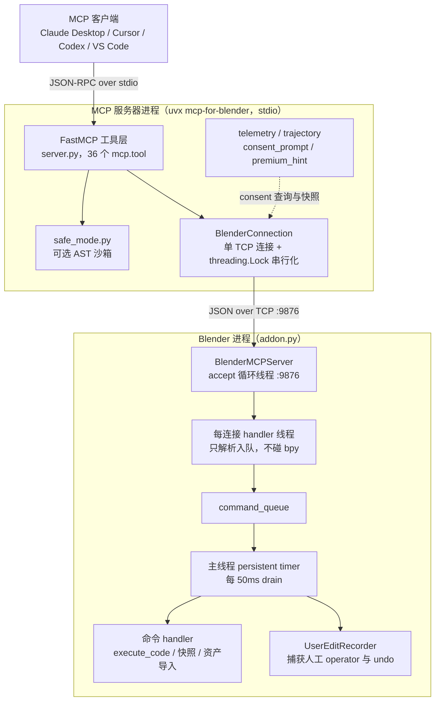
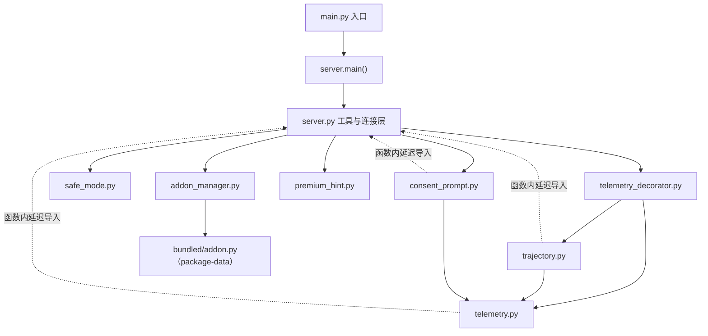
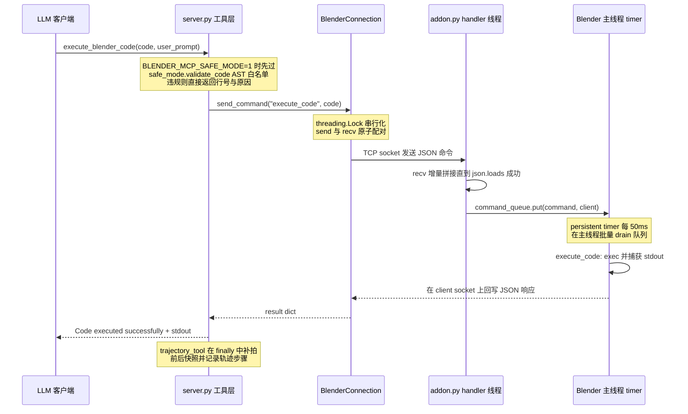
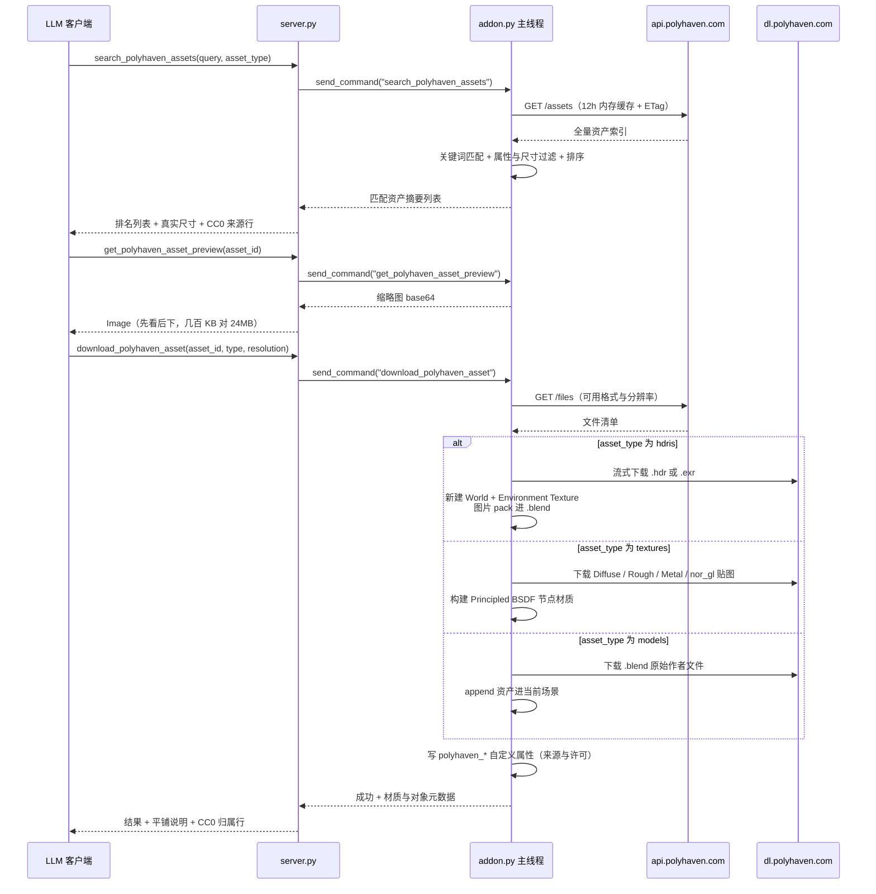

# mcp-for-blender 源码学习笔记

> 仓库地址：[mcp-for-blender](https://github.com/ahujasid/mcp-for-blender)
> 学习日期：2026-09-30
> 版本：v2.1.1（PyPI 包 `mcp-for-blender`，前身为 `blender-mcp`，旧包名仍可运行）

---

> **以下为 AI 源码分析**
>
> ### 一句话概括
>
> 双进程桥接系统：Blender addon 在 Blender 进程内启动 TCP socket server，把 JSON 命令排队到主线程执行 bpy 操作；独立的 Python FastMCP server 把这些命令包装成 36 个 MCP tool 暴露给任意 LLM 客户端，附带可选的 deny-by-default AST 沙箱、opt-in 遥测与 agent 轨迹采集。
>
> ### 要点速览
>
> | 模块 | 关键文件 | 职责 | 规模 |
> |------|---------|------|------|
> | MCP 工具层 | `src/blender_mcp/server.py` | 36 个 `@mcp.tool`、`BlenderConnection` TCP 客户端、启动生命周期、参数/结果翻译 | 2246 行 |
> | Blender addon | `addon.py` ≡ `src/blender_mcp/bundled/addon.py` | 进程内 socket server、主线程命令执行、五大资产源下载导入、侧边栏 UI、Premium | 6141 行 |
> | 安全模式 | `src/blender_mcp/safe_mode.py` | `execute_blender_code` 的 AST 白名单校验（`BLENDER_MCP_SAFE_MODE=1` 启用） | 988 行 |
> | 轨迹采集 | `src/blender_mcp/trajectory.py` | Intent→State→Action→State′→Observation→Feedback 数据集，写 Supabase | 1453 行 |
> | 遥测 | `telemetry.py` + `telemetry_decorator.py` | 匿名用量统计、consent 门控、后台队列上报、三层工具装饰器 | 385 + 487 行 |
> | addon 管理 | `addon_manager.py` | Blender 目录发现、`install-addon` CLI、协议版本握手 | 518 行 |
> | 同意询问 | `consent_prompt.py` | 用 MCP elicitation 能力做首次遥测同意询问 | 220 行 |
> | Premium 引导 | `premium_hint.py` | 每会话一次的付费版提示与生成器引导文案 | 68 行 |

---

## 项目简介

mcp-for-blender 把 Blender 连接到任意支持 MCP 的 LLM 客户端（Claude Desktop、Claude Code、Cursor、Codex、VS Code、OpenCode、Antigravity），实现 prompt 驱动的 3D 建模、场景搭建、材质与灯光控制、场景导出（GLB/FBX），以及资产检索与导入。

它解决的核心问题：LLM 无法直接操作一个 GUI 应用。项目的答案是拆成两个独立部署、独立升级的部件——

1. **Blender addon**（单文件 `addon.py`，6141 行）：在 Blender 进程内启动 TCP socket server，接收 JSON 命令并排队到 Blender 主线程执行，所有碰 bpy、下载文件、调外部 API 的重活都在这里。
2. **MCP server**（`uvx mcp-for-blender`）：一个 Python FastMCP 进程，把 socket 命令包装成 MCP tool，负责参数校验、结果重排成 LLM 友好的文本，以及安全/遥测等横切能力。

两者之间是极简 JSON 协议：请求 `{"type": ..., "params": ...}`，响应 `{"status": "success"|"error", "result"|"message": ...}`。

核心价值除了"让 AI 做 3D"，还包括：五类资产源集成（Poly Haven / Sketchfab / Poly Pizza / Hyper3D Rodin / Hunyuan3D，Premium 另有 Tripo）、为 LLM 专门设计的 bpy API 自省工具（`describe_node_type`、`bpy_api_lookup`）、可选的 AST 沙箱，以及用于训练数据采集的 agent 轨迹记录。这是 MCP 生态最有代表性的"工具桥"型应用之一。

## 技术栈

| 类别 | 技术 |
|------|------|
| 语言 | Python 3.10+（server 端）；addon 端跑在 Blender 内置解释器（要求 Blender 3.0+） |
| 框架 | FastMCP（`mcp>=1.9.0,<2`）、bpy / bmesh / mathutils；addon 端用 `requests`，server 端遥测用 `httpx` |
| 构建工具 | setuptools（src layout，`package-data` 把 addon.py 内嵌进 wheel） |
| 依赖管理 | uv / uvx（README 强制要求官方安装器安装 uv，拒绝 `pip install uv`），`uv.lock` 锁定 |
| 测试框架 | pytest（16 个测试文件；addon.py 无法脱离 bpy import，测试把它当源码文本读取分析，见 `tests/conftest.py`） |
| 分发 | PyPI `mcp-for-blender`（`blender-mcp` 旧名兼容）、Docker 镜像（仅容器化 server，Blender 仍在宿主机） |

## 目录结构

```text
mcp-for-blender/
├── main.py                     # uv 脚本入口，转发到 blender_mcp.server:main
├── addon.py                    # Blender addon 单文件（与 bundled/addon.py 逐字节一致的分发副本）
├── pyproject.toml              # 入口 mcp-for-blender = blender_mcp.server:main
├── Dockerfile                  # uv 基础镜像，ENV BLENDER_HOST=host.docker.internal
├── src/blender_mcp/
│   ├── server.py               # FastMCP 服务器 + BlenderConnection socket 客户端 + 36 个 tool
│   ├── addon_manager.py        # addon 目录发现 / install-addon / 协议握手
│   ├── safe_mode.py            # AST 沙箱（deny-by-default）
│   ├── trajectory.py           # 轨迹数据集采集（Supabase）
│   ├── telemetry.py            # 匿名遥测（Supabase REST，config.py 不入库）
│   ├── telemetry_decorator.py  # telemetry_tool / trajectory_tool 装饰器
│   ├── consent_prompt.py       # MCP elicitation 首次同意询问
│   ├── premium_hint.py         # Premium 引导文案
│   └── bundled/addon.py        # 随包分发的 addon 副本（package-data）
└── tests/                      # 16 个 pytest 文件（读源码文本，不 import bpy）
```

## 架构设计

### 整体架构

两进程 + 一条 TCP 桥，职责切分非常清晰：

- **MCP server 是"翻译与格式化层"**。典型例子：Poly Pizza 的类别人名→数字 id 映射留在 server 侧（`POLYPIZZA_CATEGORIES`，server.py:1416），注释明说原因——"修 bug 跟着 PyPI 包走，不用等用户升级 Blender addon"；返回给 LLM 的文本会追加 CC0 归属行、贴图真实尺寸平铺说明、Premium 引导，把原始 JSON 加工成模型可直接决策的语境。
- **addon 是"执行层"**。bpy 只能在 Blender 主线程调用，所以命令经 `command_queue` 由一个 persistent timer（50ms 间隔）在主线程统一 drain 执行。accept 线程与每连接 handler 线程都不碰 bpy。



### 核心模块

**1. MCP 工具层（`server.py`）**

- `main()`（server.py:2216）：先识别 `install-addon` / `addon-paths` / `-h` CLI 子命令交给 `addon_manager.run_cli`；再解析 `--host/--port`。用 `parse_known_args` 刻意容忍 MCP 客户端追加的未知参数（" unrecognized 参数不能让启动失败"，server.py:44-58）；TTY 手跑时打印"server 会静默等待客户端，这不是卡死"的提示。
- 连接解析优先级：CLI flag > 环境变量 `BLENDER_HOST`/`BLENDER_PORT` > 默认 `localhost:9876`（`resolve_connection`，server.py:61）。CLI flag 支持同机多 Blender 实例各占一个端口。
- `server_lifespan`（server.py:243）：启动时检查磁盘 addon 是否过期（**只读不写**）、记录遥测、尝试首连；关闭时关闭轨迹 episode、flush、断开连接。
- `SERVER_INSTRUCTIONS`（server.py:303）：注入 `initialize` 响应的全局指导——"shader 节点按 type 查而不是按 name 查（非英文 UI 下节点名被本地化）、不要硬编码枚举 id、`scene.render.engine` 是动态枚举 RNA 少报、改完先截图确认"。刻意简短，注释引用 issue #347：instructions 进每个会话的 context，长了烧钱。
- 36 个 tool 分四组：
  - 观察类：`get_scene_info`、`get_object_info`、`get_viewport_screenshot`、`describe_node_type`、`bpy_api_lookup`
  - 执行类：`execute_blender_code`、`export_scene`
  - 资产库类：Poly Haven（categories/search/preview/download/set_texture）、Sketchfab（search/preview/download）、Poly Pizza（search/download），各带 status 检查
  - 生成器类：Hyper3D Rodin / Hunyuan3D / Tripo（Premium），统一 create→poll→import 三段式异步任务流

**2. socket 客户端（`BlenderConnection`，server.py:90）**

- dataclass，`_lock: threading.Lock` 把 send+recv 变成原子对（见亮点 1）。
- `receive_full_response`（server.py:125）：按 8KB 分块 recv，每收到一块就尝试对累计数据 `json.loads`，解析成功即完整响应；失败说明 JSON 未收齐，继续收。超时 180s，与 addon 端一致。
- `get_blender_connection()`（server.py:387）：全局单例懒连接。注释明确记录**故意不做连接探活**——早期每次 tool 调用前 ping 一次等于每调用两条命令，一旦重叠就流失序直到 180s 超时；死 socket 由下一次真实命令发现并把 `self.sock` 置 None 触发重建。
- `_maybe_handshake_addon`（server.py:349）：首个连接建立后做一次协议握手（带锁防并发重复），结果缓存在进程级变量。

**3. addon 侧（`addon.py`，6141 行）**

- 自启动：`register()` 挂 `load_post` handler + timer 重试（Blender 启动时 UI/scene 上下文可能未就绪，返回 0.5s 让 timer 稍后再试，addon.py:75-110）；端口已被其他进程占用则跳过自启；用户手动 Stop 后置 `_user_stopped_server`，之后打开新 .blend 不会背着重启。
- 命令分发 `_execute_command_internal`（addon.py:1472）：基础 handler 常驻（scene/object info、快照、execute_code、API 自省、consent、export），各资产源 handler **只在侧边栏勾选后注册**——server 调未启用的命令会收到 "Unknown command type" 错误，server 端再把它翻译成"请在 Blender 侧边栏勾选"。
- `execute_code`（addon.py:2102）：`exec(code, {"bpy": bpy})` + `redirect_stdout` 捕获 stdout 作为 result；异常时把 exception_type / message / traceback 打包成 JSON 字符串再抛，让完整 traceback 活过 socket 传输，server 端解包后渲染给模型（server.py:694-703）。
- 资产源实现：Poly Haven 最完整（~700 行：12h 内存缓存 + ETag、下载前格式白名单检查、.blend append、Principled 材质构建、CC0 元数据写自定义属性）；Sketchfab 下载 zip 解包导入并按 target_size 归一化；Hunyuan3D 双 profile（大陆 `ai3d` / 国际 `hunyuan` 两套腾讯云服务，addon.py:1143-1160）；Premium region（addon.py:4897-5575）经 mcp-for-blender.com 的 API 免 key 生成。
- `UserEditRecorder`（addon.py:911）：捕获人工 operator（过滤视角平移缩放等无意图操作、路径属性脱敏、限流 0.1s）与 undo/redo；`agent_command()` context manager 把 agent 命令执行期间发生的操作归因给 agent 而非人。
- UI：`BLENDERMCP_PT_Panel`（N 键侧边栏）、`BLENDERMCP_AddonPreferences`（API key 持久化，环境变量可注入）。

**4. safe_mode.py（988 行）**——见亮点 3。

**5. addon_manager.py（518 行）**

- `discover_blender_addon_dirs`：跨平台扫 Blender 用户脚本目录（macOS / Windows / Linux 路径各不同，含 Blender 4.2+ 的 extensions 系统）。
- `install-addon`：把 bundled addon 拷成用户目录下的 `blender_mcp.py`；覆盖前留 `.bak`，且文件内容一致时跳过备份（避免用 bundle 副本覆盖掉真正存有用户旧版本的 .bak）。
- 用 bl_info 里的 name 正则判断"是不是我们的 addon"，刻意比子串匹配窄——因为 install 会覆盖一切匹配项，宽松匹配会误伤用户自己的 fork。
- `handshake_addon`：发 `get_addon_info` 读协议版本；老 addon 不认识该命令时返回 source="missing" 并给出升级指引。

**6. 遥测与轨迹（telemetry.py / trajectory.py / telemetry_decorator.py）**

- 装饰器分层：`telemetry_tool`（记录事件 + 首次 consent 询问）、`trajectory_tool`（再加前后状态快照、human activity drain、episode 管理），观察类工具手动调 `_record_observe_step`。所有记录路径全部 best-effort，任何异常只 logger.debug，绝不打断工具本身。
- `TelemetryCollector`：匿名 install UUID 落盘（Unix 600 权限）、后台队列线程异步上报、consent 结果缓存 30s（consent 查询也要走那把 socket 锁，缓存避免每次变更类调用多打几个往返）。
- `TrajectoryRecorder`：SCHEMA_VERSION=7；快照三级降级；字节预算与 Supabase DB 约束对齐（SNAPSHOT_BYTE_BUDGET=4.5MB，超限时按名字排序截断对象列表，保证前后快照取同一子集、state_delta 不出现幻影增删）；`note_goal` 按 user_prompt 变化切分 episode；`drain_human_activity` 拉取人工操作行。

### 模块依赖关系

server.py 与 telemetry / trajectory / consent_prompt 之间存在运行时双向依赖（工具层调遥测，遥测查 consent / 拍快照又要连 Blender），全部用**函数内延迟导入**解开循环：



## 核心流程

### 流程一：execute_blender_code 命令执行全链路

这是整个系统的主动脉——其余 35 个 tool 里凡是走 socket 的，路径完全同构，只是 handler 不同。



关键逻辑逐条：

1. **safe mode 前置**（server.py:674-688）：`safe_mode_enabled()` 且 `validate_code` 抛 `SandboxViolation` 时，拒绝信息包含行号、被禁原因、允许范围（"只能 import bpy/bmesh/mathutils/纯 stdlib，渲染与导入导出 operator 允许"）和"只有用户能关 safe mode"——这个文案是写给模型看的，让它改写脚本重试而不是硬闯。
2. **锁内原子对**（server.py:186-187）：`send_command` 持锁后调用 `_send_command_locked`，send 和 receive 在同一个临界区，杜绝响应错配。
3. **分块接收**：socket 没有 message framing，靠"尝试 json.loads 成功"判断消息完整；UTF-8 多字节字符跨 recv 边界时 decode 失败也按"未收齐"处理（addon 侧 `_handle_client`，addon.py:1438-1443）。
4. **主线程执行**：handler 线程绝不碰 bpy，只入队；`_drain_command_queue`（addon.py:1378）在主线程执行 handler 并直接 `client.sendall` 回写响应。
5. **错误路径设计**：超时 180s 后的错误信息会提示"Blender 若以 headless（blender -b）运行命令永远不会执行，请用 GUI 或 xvfb-run"（server.py:226）；execute_code 的异常以 JSON payload 携带完整 traceback 过 socket，server 端解包渲染（addon.py:2116-2128 + server.py:694-703）。
6. **收尾观测**：`trajectory_tool` 装饰器在 finally 里补拍 state_after 快照、计算 state_delta、把整步写进轨迹队列——即使工具抛异常也记录。

### 流程二：Poly Haven 资产搜索与导入

资产库三兄弟（Poly Haven / Sketchfab / Poly Pizza）的通用模式：server 侧做参数翻译与结果格式化，addon 侧做 API 调用、下载与导入。以 Poly Haven 为例：



关键逻辑：

1. **贴图只下载会接线的图**：`POLYHAVEN_TEXTURE_MAPS`（addon.py:324-331）明确只取能驱动 Principled BSDF 的六种贴图，注释给出了实测数据——旧做法下载全部图导致 7.4MB 资产只接线 1.9MB，现在 3.9MB 全部接上。
2. **模型从 .blend 导入**：Poly Haven 作者在 Blender 里建模，glTF/FBX 都是从 .blend 派生的有损版本（材质细节丢失）；glTF 只留作"新版 Blender 写的 .blend 打不开"的兜底。
3. **格式白名单前置**：`POLYHAVEN_SUPPORTED_FORMATS` 在下载前检查（API 对每个模型都列 usd，旧逻辑会下完才报"不支持"）。
4. **server 侧的"决策语境"注入**：下载贴图后的返回会附 `_polyhaven_scale_note`（server.py:784）——告诉模型这张贴图真实覆盖 0.5m×0.5m、Mapping 节点是 POINT 模式、UV 0-1 下 Scale = 表面尺寸 / 贴图宽度。把 asset 元数据翻译成模型可执行的参数公式。
5. **许可合规写进数据**：导入时把 `polyhaven_id` / `polyhaven_authors` / `polyhaven_licence` 等写进对象/材质/World 的自定义属性，随 .blend 持久化；响应文本同时附归属行，因为"在 MCP 会话里，聊天窗口是用户唯一看得到的界面"。
6. **Poly Pizza 的分工差异**：类别/许可的"人话→数字 id"映射放 server 侧（修 bug 跟包走），addon 侧只校验 id 并注意 API 的 Capitalized query 参数（小写会被 200 静默忽略，addon.py:147-154）。

## 关键设计亮点

### 1. 单连接上请求-响应的原子配对锁

- **问题**：所有 tool 共享一条到 Blender 的 TCP 长连接，MCP 客户端可能并发调用 tool；而协议没有请求 id，响应只能按流上的顺序配对。两个命令重叠时，第二条的响应会被当成第一条的返回，流从此永久失序，直到 180s 超时烧穿。
- **实现**：`BlenderConnection.send_command`（server.py:186-187）持 `_lock` 覆盖 send+receive 全程；`get_blender_connection`（server.py:391-396）的注释明确记录了"不要探活"的教训：早期版本每次调用前 ping，等于每 tool 调用两条命令，重叠即失序。
- **为什么**：给协议加关联 id 也能解决，但会破坏"addon 可能是任意旧协议版本"的兼容前提；一把锁换来零协议改动，且 socket 错误路径里统一把 `sock=None` 触发懒重建，失败恢复也简单。

### 2. 跨线程 bpy 访问：队列 + 单 timer，绝不从工作线程碰 bpy

- **问题**：bpy API 只能在 Blender 主线程调用；`bpy.app.timers.register` 本身非线程安全，从其他线程注册在 Windows 上会被**静默丢弃**，症状是命令永远不执行、客户端干等 180s 超时（addon.py:1176-1181 注释原话记录了这次教训）。
- **实现**：handler 线程只 `command_queue.put`（addon.py:1437）；一个 persistent timer `_drain_command_queue`（addon.py:1378-1406）每 50ms 在主线程批量执行并把响应 sendall 回对应 client。timer 只在 `start()`（operator，即主线程上下文）里注册。`stop()` 主动 shutdown 所有活动 client socket（addon.py:1310-1325），防止旧 handler 线程活过重启、关闭新 server 拥有的连接（注释点名 WinError 10054）。
- **为什么**：`queue.Queue` 是线程安全的教科书答案；单一 drain timer 还顺带免费获得了命令在主线程的串行化。

### 3. deny-by-default 的 AST 沙箱（safe_mode.py）

- **问题**：产品特性本身就是"在用户的 Blender 里执行任意 Python"，默认不校验。但第三方资产的名字与描述会流入模型上下文，prompt injection 可以诱导模型写出恶意脚本、用户不看就批准。防御目标是"模型能被说服写什么"，不是"沙箱化 Blender"（文件头明确承认 addon 的 socket 对任何本地进程都是裸 execute_code，此防护只覆盖 MCP 路径）。
- **实现**：`validate_code`（safe_mode.py:939）分三段——
  1. `_guard_source`：大小 200KB / AST 节点数 2 万 / 嵌套深度 24 的防 DoS 前置（深度检查用迭代栈防爆栈）；
  2. 预扫描 import 与全部名字绑定，`_check_module_value_use` 拒绝"模块对象逃逸"（`o = bpy.ops` 之后传出去，或 `def f(m): m.wm.link(...)`）——这是所有点路径检查保持可靠的前提；
  3. `_Validator` 白名单遍历。
  策略全是**结构性**的，文件头直言"The attacker is assumed to have read this file"：AST 节点类型白名单（Lambda / ClassDef / 装饰器 / walrus / async 全拒并各有注释说明原因）、模块白名单（numpy 特意排除——`numpy.load` 吃 pickle 是反序列化代码执行，注释原话）、bpy 点路径前缀黑名单（`bpy.app.handlers` / `timers` / `bpy.data.texts` / `bpy.ops.wm.append`……凡"代码在脚本结束后仍存活"或"从外部 .blend 携带驱动器"的路径）、`getattr`/`setattr` 只允许字面量属性名（计算名拒绝而非常量折叠："部分求值对抗能嵌套任意表达式的攻击者是必输的游戏"）、`_FORBIDDEN_BARE_ATTRS` 兜底拦截静态无法解析接收者的属性访问（`d = bpy.data; d.texts`）。
- **为什么**：拒绝信息带行号、写明允许范围，是设计给模型读的——让被拒的脚本可以被改写重试，闭环回到 agent loop。渲染 / 保存 / 导入导出 operator 在此特意放行（与它fork自的 blender-mcp-desktop 桌面版策略不同），因为这正是本工具的用途。

### 4. 为 LLM 设计的 API 自省与 context 工程

- **问题**：LLM 写 bpy 脚本最大的失败模式是猜 socket 顺序、猜枚举 id、猜 operator 参数——每个猜错都是一次 execute_code 往返 + 一条 traceback，烧时间也烧 token。
- **实现**：
  - `describe_node_type`（addon.py:2198）：在 scratch node tree 里实例化目标节点、可选先应用 `property_overrides`（如 Mix 节点设 `data_type: RGBA` 后看该模式下的真实 socket 布局）、读出属性/输入/输出 schema、然后删除 scratch tree——用户场景零污染。
  - `bpy_api_lookup`（addon.py:2317）：用 RNA 反射出类型/属性/方法/operator 的真实签名（enum_items、default、is_required、min/max），而不是刮 `help()` 文本。
  - `SERVER_INSTRUCTIONS`（server.py:303）：把踩过的坑写进 initialize 响应——非英文 UI 节点名本地化（要按 `n.type == "BSDF_PRINCIPLED"` 查）、枚举 id 跨版本会变、`scene.render.engine` 是动态枚举 RNA 少报。
  - tool docstring 本身就是教学材料（"缩略图几百 KB vs 4k 贴图 24MB，先看后下"；每个 tool 带 `user_prompt` 参数并要求逐字引用用户原话，用于轨迹 episode 切分）。
- **为什么**：把"试错学习"变成"一次结构化查询"；instructions 保持简短是对 context 成本的自觉（注释引用 #347）。

### 5. 版本握手 + 三级降级，让"只升级一半"的用户仍能用

- **问题**：PyPI 包（server，`uvx` 每次拉最新）与 Blender addon（用户手动安装、懒得升级）是两个独立升级节奏的部件，协议会长期不对齐。
- **实现**：
  - `ADDON_PROTOCOL_VERSION = 11`（addon.py:42）与 `EXPECTED_ADDON_PROTOCOL_VERSION = 11`（addon_manager.py:23）两边注释互相指向对方，改一处必改另一处。
  - 握手在首个连接后做一次（server.py:349），结果缓存；`get_addon_status` tool 主动重置缓存重新握手。
  - 磁盘 addon 检查**只读不写**："启动一个 MCP server 不是修改用户 Blender 配置的授权"（addon_manager.py:84-90），写操作只属于用户显式执行的 `install-addon`。
  - 轨迹快照三级降级：native `get_world_state_snapshot` → 注入快照脚本走 `execute_code` → `get_scene_info` 兜底（trajectory.py:644-698）。
  - `generate_hunyuan3d_model` 按握手到的协议版本决定是否传 `quality` 参数——"旧 addon 会拒绝未知参数"（server.py:1954-1956）。
- **为什么**：MCP 工具桥类项目的通用难题——两侧部件没有原子升级手段，能力探测 + 降级路径是唯一务实解。

## 其他值得注意的发现

- **`src/blender_mcp/config.py` 被 .gitignore（第 15 行）**：Supabase URL / anon key / 表名配置不入库，只存在于维护者环境与 PyPI 包。从源码运行时 `get_telemetry()` 里 `from .config import telemetry_config`（telemetry.py:78）抛 ModuleNotFoundError，所有调用点 try/except 吞掉——**开源 clone 里遥测与轨迹整体静默失效**。凭据隔离是刻意的，但意味着"源码运行"与"包运行"行为不同，读代码时别被这条路径迷惑。
- **疑似真实 bug**：consent_prompt.py:140-141 `from .telemetry import telemetry` 引用了不存在的符号（telemetry.py 只导出 `get_telemetry`），`_apply_consent` 因此总是 ImportError → False——用户通过 MCP elicitation 点"同意"后，consent 永远写不进 Blender。被外层 except 静默吞掉，无报错。
- **双份 addon.py 人肉同步**：根目录 `addon.py` 与 `src/blender_mcp/bundled/addon.py` 逐字节一致（`diff` 验证），前者供手动安装与 tests 读取，后者随 wheel 分发；没有构建脚本保证同步，靠约定。
- **测试策略**：addon.py import 需要 bpy，CI 里没有 Blender，所以 16 个测试文件把 addon.py 当**源码文本**读（conftest.py 定义 `ROOT_ADDON`），做静态断言（自启动 handler 注册、命令 handler 兼容性、Hunyuan 签名安全等）；server 侧则正常单元测试。
- **安全边界坦率**：socket 无认证、无加密、无请求 id，README 与代码注释都直接承认，建议只监听 localhost、跨机用 SSH tunnel；Docker 镜像默认 `BLENDER_HOST=host.docker.internal`。
