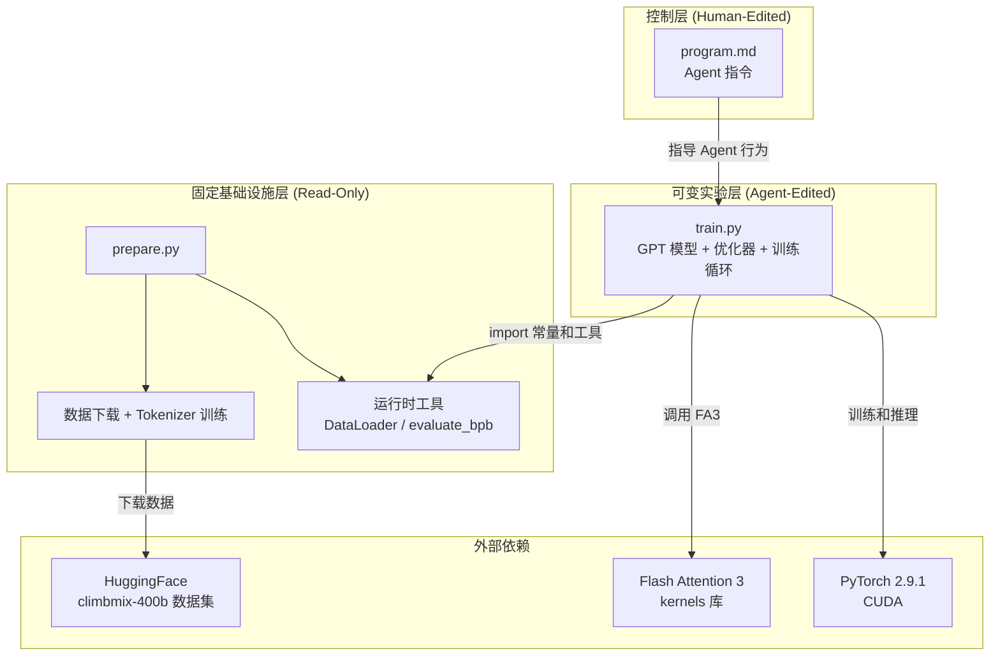
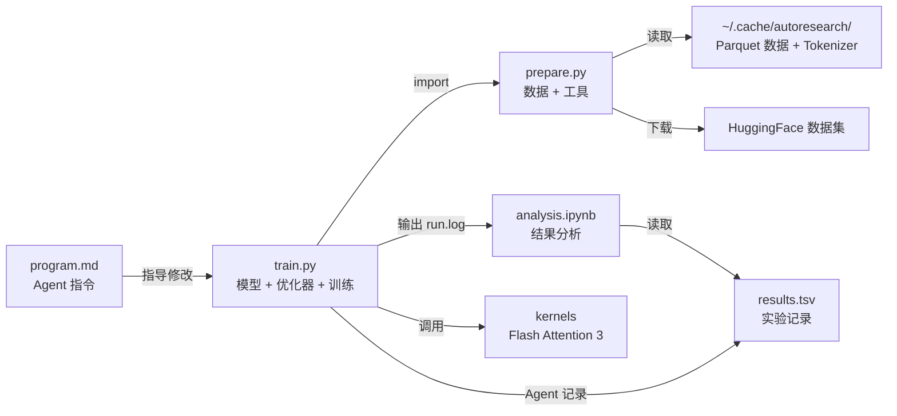
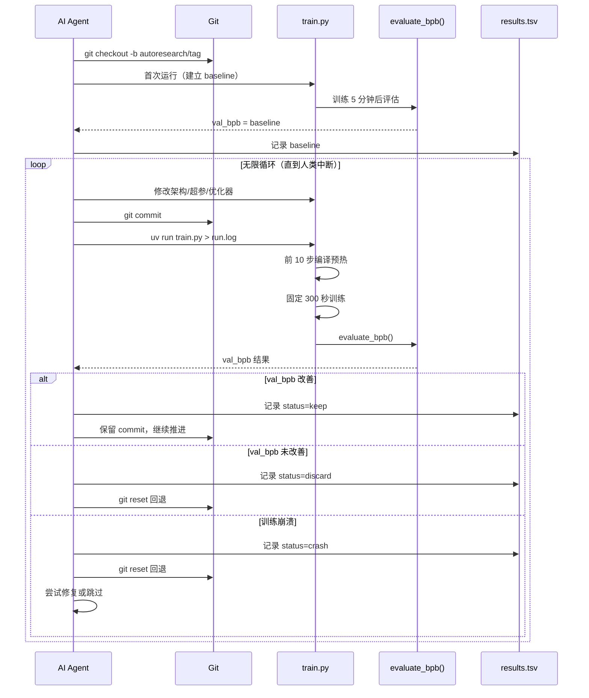
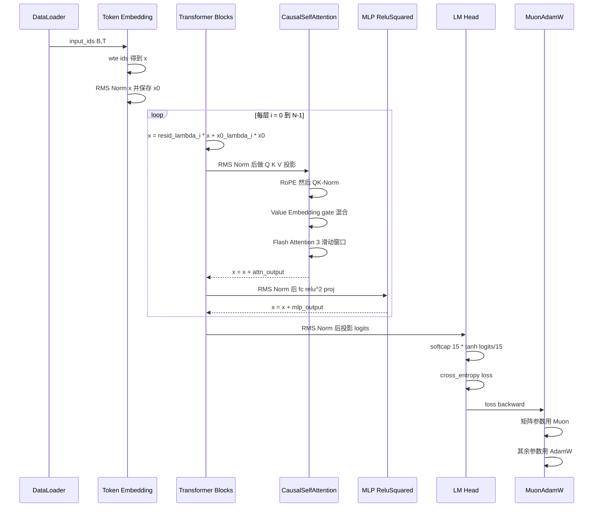

# autoresearch 源码学习笔记

> 仓库地址：[autoresearch](https://github.com/karpathy/autoresearch)
> 学习日期：2026-03-23

---

> **以下为 AI 源码分析**
>
> ### 一句话概括
>
> 一个让 AI agent 在固定 5 分钟时间预算内自主迭代 LLM 训练代码、通宵运行实验并自动筛选最优配置的自主研究框架。
>
> ### 要点速览
>
> | 模块 | 职责 | 关键文件 |
> |------|------|----------|
> | 数据准备 | 下载 Parquet 数据分片、训练 BPE tokenizer | `prepare.py` |
> | GPT 模型 | Transformer 架构定义（RoPE、Flash Attention 3、Value Embedding） | `train.py` (GPT/Block/CausalSelfAttention/MLP) |
> | MuonAdamW 优化器 | 混合优化器：Muon（矩阵参数）+ AdamW（其余参数） | `train.py` (MuonAdamW) |
> | 训练循环 | 固定时间预算训练、梯度累积、LR schedule | `train.py` (训练主循环) |
> | Agent 指令 | 定义 AI agent 自主实验的规则和工作流 | `program.md` |
> | 结果分析 | 可视化实验进度、统计 keep/discard/crash 比率 | `analysis.ipynb` |

---

## 项目简介

autoresearch 是 Andrej Karpathy 发起的一个实验性项目，核心理念是：**让 AI agent 代替人类研究员做 LLM 预训练实验**。用户只需启动一个 AI coding agent（如 Claude Code），指向 `program.md`，agent 就会自主修改 `train.py` 中的模型架构、超参数、优化器等，每次训练固定 5 分钟，通过 val_bpb（验证集 bits per byte）指标判断实验是否成功，成功则保留 commit，失败则回退。整个过程完全自主，用户可以一觉醒来收获约 100 次实验的结果。

训练代码是 [nanochat](https://github.com/karpathy/nanochat) 的精简单 GPU 版本，刻意保持极简：只有三个核心文件，一个 GPU，一个指标。

## 技术栈

| 类别 | 技术 |
|------|------|
| 语言 | Python 3.10+ |
| 框架 | PyTorch 2.9.1 |
| 构建工具 | uv (项目管理) |
| 依赖管理 | uv + pyproject.toml |
| 测试框架 | 无（以 val_bpb 指标作为实验验证） |
| 关键库 | kernels (Flash Attention 3)、rustbpe (BPE tokenizer)、tiktoken、pyarrow |

## 目录结构

```
autoresearch/
├── prepare.py          # 数据下载、tokenizer 训练、DataLoader、评估函数（只读）
├── train.py            # GPT 模型 + MuonAdamW 优化器 + 训练循环（agent 可修改）
├── program.md          # AI agent 的指令文件（人类编辑）
├── analysis.ipynb      # 实验结果分析 notebook（pandas + matplotlib）
├── pyproject.toml      # 项目依赖和构建配置
├── uv.lock             # uv 锁文件
├── progress.png        # 实验进度可视化图（由 notebook 生成）
├── .python-version     # Python 版本锁定
└── .gitignore          # 忽略 __pycache__、.venv、results.tsv 等
```

## 架构设计

### 整体架构

autoresearch 采用**三层分离架构**：固定基础设施层（`prepare.py`）、可变实验层（`train.py`）、控制层（`program.md`）。基础设施层提供数据、tokenizer 和评估指标，实验层定义模型和训练逻辑供 agent 自由修改，控制层指导 agent 的实验策略。这种设计让 agent 在受限范围内最大化探索自由度。



### 核心模块

#### 1. 数据准备模块 (`prepare.py`)

**职责**：下载训练数据、训练 BPE tokenizer、提供运行时 DataLoader 和评估函数。

**关键常量**：
- `MAX_SEQ_LEN = 2048`：上下文长度
- `TIME_BUDGET = 300`：5 分钟训练时间预算
- `EVAL_TOKENS = 40 * 524288`：验证集 token 数量
- `VOCAB_SIZE = 8192`：词表大小

**关键类和函数**：

| 接口 | 说明 |
|------|------|
| `download_data()` | 多进程并行下载 Parquet 数据分片，支持断点续传和重试 |
| `train_tokenizer()` | 使用 rustbpe 训练 BPE tokenizer，保存为 tiktoken 格式 |
| `Tokenizer` | 封装 tiktoken Encoding 的最小 tokenizer，支持 batch encode |
| `make_dataloader()` | BOS 对齐的 DataLoader，best-fit packing 策略，零 padding，100% 利用率 |
| `evaluate_bpb()` | 计算 val_bpb（bits per byte），词表大小无关的评估指标 |

**DataLoader 的 best-fit packing 策略**（`prepare.py:276-337`）：
- 维护一个 document buffer（默认 1000 条）
- 每行容量 `T+1` tokens，贪心选择能放入的最大文档
- 当没有文档能完整放入时，裁剪最短文档填满剩余空间
- 实现 100% token 利用率，无需 padding

#### 2. GPT 模型模块 (`train.py:32-291`)

**职责**：定义完整的 GPT 语言模型，包括 Transformer 架构和前向传播逻辑。

**核心类**：

| 类 | 说明 |
|------|------|
| `GPTConfig` | 模型配置 dataclass（seq_len、vocab_size、n_layer、n_head、n_kv_head、n_embd、window_pattern） |
| `CausalSelfAttention` | 因果自注意力，支持 GQA、RoPE、Value Embedding、Flash Attention 3、滑动窗口 |
| `MLP` | 前馈网络，使用 ReluSquared 激活（`relu(x)^2`） |
| `Block` | 标准 Transformer block = Pre-Norm Attention + Pre-Norm MLP |
| `GPT` | 完整模型：Embedding → N × Block → LM Head，含 residual lambda 和 x0 lambda |

**模型架构亮点**：

1. **Value Embedding (ResFormer)**（`train.py:47-49, 82-87`）：交替层使用 Value Embedding，通过输入依赖的 gate 混合到 attention 的 value 中。gate 取输入前 32 个通道，经 `2 * sigmoid()` 缩放，使得初始化时 gate 为中性值 1.0。

2. **Residual Lambda + x0 Lambda**（`train.py:134-135, 276-277`）：每层有可学习的 `resid_lambda`（初始 1.0）和 `x0_lambda`（初始 0.1），实现 `x = resid_lambda * x + x0_lambda * x0`，让模型学习残差连接的最优混合比。

3. **滑动窗口注意力 SSSL 模式**（`train.py:195-206`）：采用 S（半上下文窗口）和 L（全上下文窗口）交替的模式，最后一层强制为 L，平衡计算效率和长距离依赖建模。

4. **Logit Soft-capping**（`train.py:282-285`）：`softcap * tanh(logits / softcap)`，softcap=15，防止 logits 爆炸导致训练不稳定。

5. **RoPE + QK-Norm**（`train.py:52-58, 89-91`）：先应用 Rotary Position Embedding，再对 Q、K 做 RMS normalization，提升注意力计算的数值稳定性。

#### 3. MuonAdamW 优化器模块 (`train.py:293-427`)

**职责**：混合优化器，对 2D 矩阵参数使用 Muon 算法，对其余参数使用 AdamW。

**关键设计**：

| 组件 | 说明 |
|------|------|
| AdamW 分支 | 用于 embedding、lm_head、per-layer scalar 等参数 |
| Muon 分支 | 用于 Transformer 内部的矩阵参数（attention 投影、MLP 权重） |
| Polar Express | 基于多项式近似的极分解正交化，替代 SVD，5 次迭代 |
| NorMuon | 方差归约技术，用 second moment buffer 归一化梯度 |
| Cautious Weight Decay | 仅在梯度和参数同号时施加 weight decay（`mask = (g * params) >= 0`） |

**AdamW 学习率分组**（`train.py:236-266`）：
- lm_head: `0.004 × dmodel_lr_scale`
- token embedding: `0.6 × dmodel_lr_scale`
- value embedding: `0.6 × dmodel_lr_scale`
- resid_lambda: `scalar_lr × 0.01`
- x0_lambda: `scalar_lr`（beta1=0.96）

其中 `dmodel_lr_scale = (model_dim / 768)^-0.5`，实现学习率随模型宽度缩放。

**Muon 步骤详解**（`train.py:317-353`）：
1. Nesterov momentum：`momentum_buffer.lerp_(grads, 1-momentum)`
2. Polar Express 正交化：5 次迭代多项式近似 `X = a*X + X@B`（取决于矩阵方向）
3. NorMuon 方差归约：second moment 归一化，保持梯度范数不变
4. Cautious weight decay + 参数更新：`params -= lr * (g + wd * params * mask)`

**torch.compile 优化**：AdamW 和 Muon 的核心步骤都标记为 `@torch.compile(dynamic=False, fullgraph=True)`，利用 0-D CPU tensor 避免重编译。

#### 4. 训练循环模块 (`train.py:428-631`)

**职责**：模型初始化、训练循环、LR schedule、最终评估。

**关键超参数**（`train.py:432-452`）：

| 参数 | 默认值 | 说明 |
|------|--------|------|
| DEPTH | 8 | Transformer 层数 |
| ASPECT_RATIO | 64 | model_dim = depth × 64 |
| HEAD_DIM | 128 | 注意力头维度 |
| TOTAL_BATCH_SIZE | 2^19 (~524K) | 每步 token 数 |
| DEVICE_BATCH_SIZE | 128 | 单设备 batch size |
| WARMDOWN_RATIO | 0.5 | 后 50% 时间做 LR 衰减 |

**LR Schedule**（`train.py:518-525`）：
- Warmup 阶段（默认 0%）：线性增长
- 恒定阶段：保持初始 LR
- Warmdown 阶段（后 50%）：线性衰减到 `FINAL_LR_FRAC`（默认 0）

**GC 管理**（`train.py:593-598`）：第 0 步后执行 `gc.collect() → gc.freeze() → gc.disable()`，消除 Python GC 的 ~500ms 停顿，每 5000 步手动收集一次。

**前 10 步排除**（`train.py:578-579, 603`）：前 10 步不计入训练时间，排除 `torch.compile` 编译开销。

#### 5. Agent 指令模块 (`program.md`)

**职责**：定义 AI agent 的自主实验工作流。

**核心流程**：
1. Setup：协商 run tag → 创建分支 → 读取代码 → 验证数据 → 初始化 results.tsv
2. 实验循环（无限）：修改 train.py → git commit → 运行训练 → 读取结果 → 记录 TSV → 改善则保留/否则 reset
3. 约束：只能修改 train.py，不能改 prepare.py、不能装新包
4. 简洁性原则：等效结果下更简单的代码优先

#### 6. 结果分析模块 (`analysis.ipynb`)

**职责**：从 `results.tsv` 加载实验数据，生成可视化图表和统计摘要。

**关键功能**：
- 实验状态统计（keep/discard/crash 比率）
- val_bpb 进度图（running minimum 前沿线）
- 每次 kept 实验的增量改进排名
- 生成 `progress.png` 进度可视化图

### 模块依赖关系



## 核心流程

### 流程一：自主实验循环

这是 autoresearch 的核心工作流——AI agent 如何自主进行 LLM 训练实验。



**关键逻辑**：
1. Agent 读取 `program.md` 获取实验规则
2. 第一次运行建立 baseline val_bpb
3. 每次实验修改 `train.py` 后 commit，训练 5 分钟
4. 通过 `grep "^val_bpb:" run.log` 提取指标
5. 改善则保留 commit（分支前进），否则 `git reset` 回退
6. 永不停止，直到人类中断

### 流程二：模型前向传播和训练

单次训练迭代从数据加载到参数更新的完整流程。



**梯度累积**：`grad_accum_steps = TOTAL_BATCH_SIZE / (DEVICE_BATCH_SIZE * MAX_SEQ_LEN)`，多步前向-反向后才执行一次 optimizer step。

**时间控制**：前 10 步不计时（`torch.compile` 编译预热），之后累计训练时间，达到 `TIME_BUDGET=300s` 停止。

## 关键设计亮点

### 1. 固定时间预算而非固定步数

**解决问题**：让不同硬件平台上的实验可以公平比较，同时找到特定硬件的最优配置。

**实现方式**：`prepare.py` 中 `TIME_BUDGET = 300`，训练循环通过 `total_training_time >= TIME_BUDGET` 判断停止（`train.py:603`），前 10 步排除编译开销（`train.py:578-579`）。

**为什么这样设计**：传统做法是固定训练步数，但这对不同 GPU 不公平（快 GPU 训练更多 token）。固定时间预算意味着每次实验的"成本"相同，agent 需要同时优化模型质量和训练效率——一个能在 5 分钟内处理更多 token 的高效架构比一个慢但"理论上更好"的架构更有价值。

### 2. Polar Express 正交化替代 SVD

**解决问题**：Muon 优化器需要对梯度做正交化（极分解），SVD 在大矩阵上计算开销大。

**实现方式**：使用预计算的多项式系数 `polar_express_coeffs`（`train.py:297-303`），通过 5 次矩阵乘法迭代近似极分解。根据矩阵方向（行多于列或列多于行）选择 `X.mT @ X` 或 `X @ X.mT` 的变体（`train.py:326-335`）。

**为什么这样设计**：多项式近似可以被 `torch.compile` 完全融合，避免 SVD 的同步开销。5 次迭代在精度和性能间取得平衡。系数是离线优化的，无需运行时计算。

### 3. Best-fit Packing DataLoader

**解决问题**：传统 DataLoader 要么 padding 浪费（长文档短文档混装），要么简单拼接导致 BOS 位置不对齐。

**实现方式**：`prepare.py:276-337`，维护 document buffer，贪心选择能完整放入的最大文档，放不下时裁剪最短文档填满。每行以 BOS 开头，利用率 100%。

**为什么这样设计**：在固定 5 分钟时间预算下，每个 token 都很宝贵。100% 利用率意味着不浪费任何计算在 padding 上。BOS 对齐确保模型看到正确的文档边界信号。

### 4. program.md 作为"研究组织代码"

**解决问题**：如何让 AI agent 进行高质量的自主研究，而不是随机乱改。

**实现方式**：`program.md` 定义了完整的实验协议——setup 流程、实验循环规则、结果记录格式、keep/discard 决策标准。特别强调了**简洁性原则**：微小改进但增加复杂度不值得，删除代码获得同等结果则是胜利。

**为什么这样设计**：Karpathy 将 `program.md` 视为可迭代的"元代码"——人类不写 Python，而是编写指导 agent 的 Markdown 指令。这种分离让人类聚焦于研究策略而非实现细节，是 AI-assisted research 的一种新范式。

### 5. 0-D CPU Tensor 避免 torch.compile 重编译

**解决问题**：`torch.compile` 遇到不同的 Python 标量值时会触发重编译（recompilation），严重影响性能。

**实现方式**：MuonAdamW 的 `__init__` 中预创建 0-D CPU tensor（`train.py:362-371`），每步通过 `.fill_()` 更新值而非创建新 tensor，作为编译后 kernel 的输入。

**为什么这样设计**：`torch.compile(dynamic=False, fullgraph=True)` 要求输入 tensor 的 shape 不变。将变化的超参数（lr、momentum、weight_decay 等）封装为固定 shape 的 0-D tensor，既满足编译器约束，又保持了运行时调参的灵活性。
