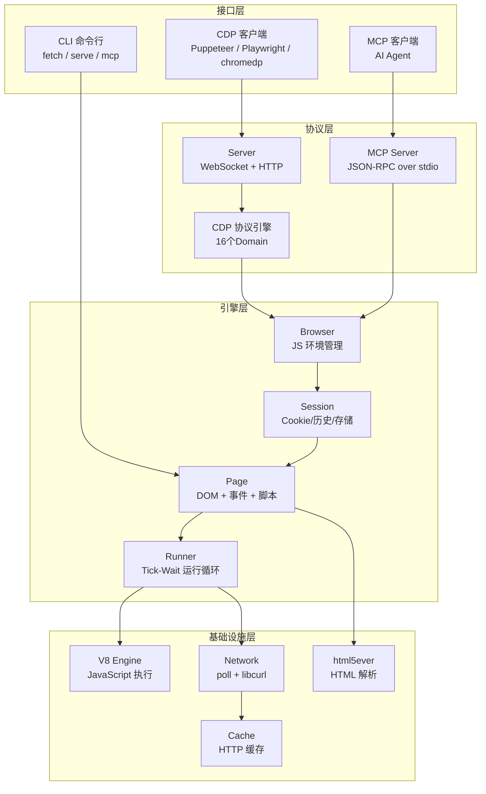
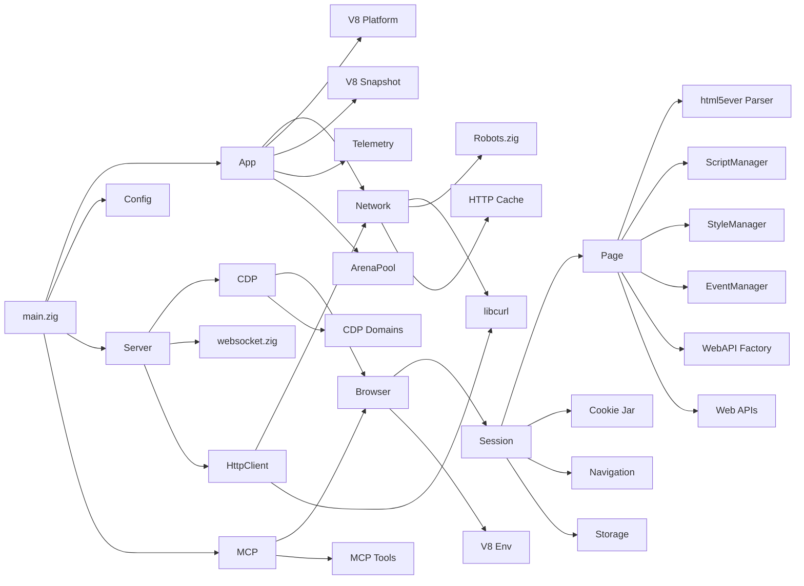
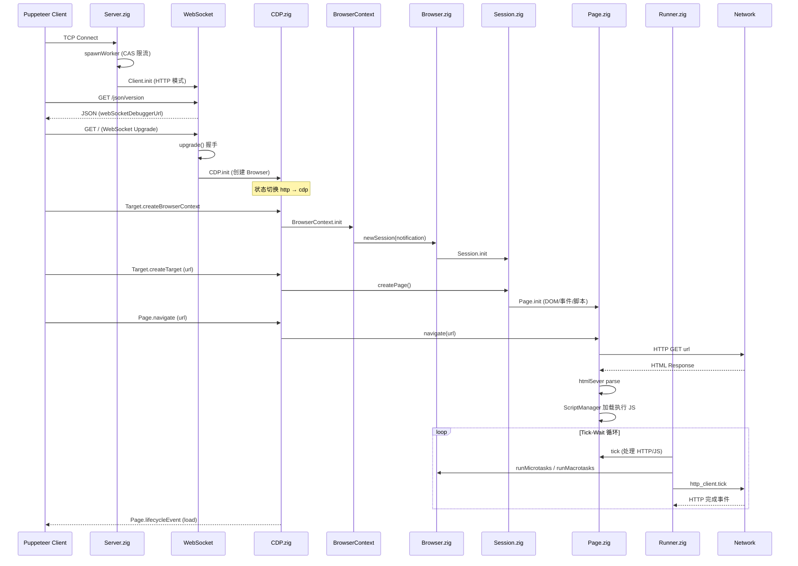
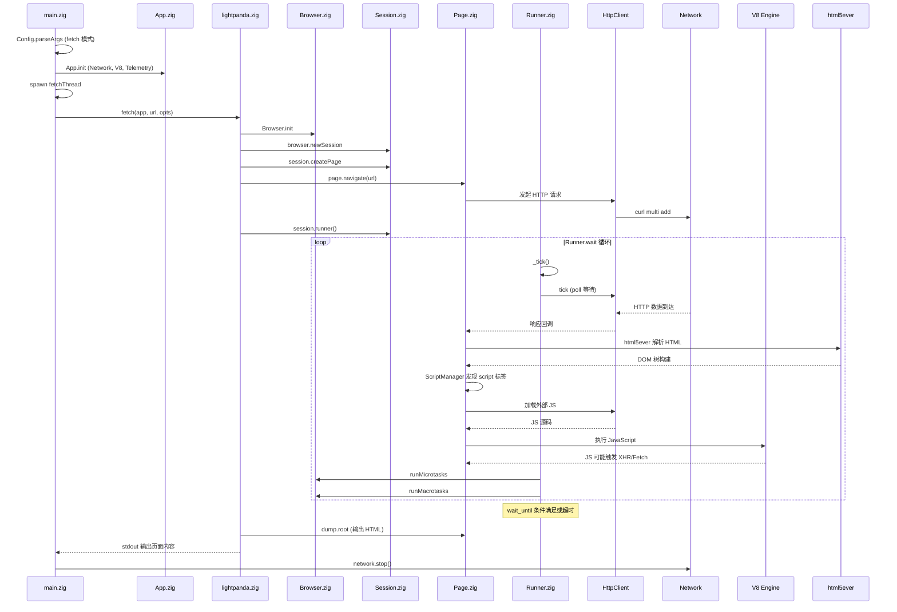

# Lightpanda Browser 源码学习笔记

> 仓库地址：[browser](https://github.com/lightpanda-io/browser)
> 学习日期：2026-04-05

---

> **以下为 AI 源码分析**
>
> ### 一句话概括
>
> Lightpanda 是一款用 Zig 从零编写的无头浏览器，专为 AI agent 和 Web 自动化设计，通过 CDP 协议兼容 Puppeteer/Playwright，内存占用仅为 Chrome 的 1/16，速度快 9 倍。
>
> ### 要点速览
>
> | 核心模块 | 职责 | 关键文件 |
> |---------|------|---------|
> | App | 应用生命周期管理，初始化所有子系统 | `src/App.zig` |
> | Server | CDP WebSocket 服务器，处理客户端连接 | `src/Server.zig` |
> | Browser | 浏览器实例，管理 JS 环境和 Session | `src/browser/Browser.zig` |
> | Page | 页面引擎，DOM/事件/脚本/样式管理 | `src/browser/Page.zig` |
> | CDP | Chrome DevTools Protocol 实现 | `src/cdp/CDP.zig` |
> | Network | 基于 libcurl 的 HTTP 网络层 | `src/network/Network.zig` |
> | MCP | Model Context Protocol 服务器 | `src/mcp/Server.zig` |
> | Parser | 基于 html5ever 的 HTML 解析器 | `src/browser/parser/Parser.zig` |
> | JS Engine | V8 引擎的 Zig 绑定层 | `src/browser/js/` |

---

## 项目简介

Lightpanda 是一个从零构建的开源无头浏览器（headless browser），不基于 Chromium 或 WebKit，而是使用系统级编程语言 Zig 全新编写。它专为 AI agent、Web 自动化、爬虫和测试场景设计，核心价值在于极低的内存占用（Chrome 的 1/16）和极快的执行速度（Chrome 的 9 倍），同时通过实现 Chrome DevTools Protocol (CDP) 来兼容现有的自动化工具生态（Puppeteer、Playwright、chromedp）。项目还原生支持 MCP（Model Context Protocol），使 AI agent 可以直接通过标准协议与浏览器交互。

## 技术栈

| 类别 | 技术 |
|------|------|
| 语言 | Zig 0.15.2 |
| JS 引擎 | V8 (v14.0.365.4, 通过 zig-v8-fork 绑定) |
| HTML 解析 | html5ever (Rust, 通过 FFI 调用) |
| HTTP 库 | libcurl (通过 Zig 绑定) |
| TLS | BoringSSL |
| 压缩 | Brotli, zlib |
| HTTP/2 | nghttp2 |
| 构建工具 | Zig Build System + Makefile |
| 依赖管理 | build.zig.zon (Zig 包管理) |
| 测试框架 | Zig 内置测试 + WPT (Web Platform Tests) + Go E2E runner |

## 目录结构

```
src/
├── main.zig                   # 程序入口，参数解析和模式分发
├── App.zig                    # 应用核心，初始化所有子系统
├── Server.zig                 # CDP WebSocket 服务器
├── Config.zig                 # 命令行参数和配置管理
├── lightpanda.zig             # 模块聚合导出（类似 prelude）
├── browser/                   # 浏览器引擎核心
│   ├── Browser.zig            # 浏览器实例，管理 JS Env
│   ├── Session.zig            # 会话管理（Cookie、导航历史等）
│   ├── Page.zig               # 页面引擎（DOM 树、事件、脚本等）
│   ├── Runner.zig             # 页面运行循环（tick-wait 模型）
│   ├── Factory.zig            # WebAPI 对象工厂
│   ├── HttpClient.zig         # 页面级 HTTP 客户端
│   ├── ScriptManager.zig      # JS 脚本加载和执行管理
│   ├── StyleManager.zig       # CSS 样式管理
│   ├── EventManager.zig       # DOM 事件管理
│   ├── parser/                # HTML 解析器 (html5ever FFI)
│   ├── js/                    # V8 引擎 Zig 绑定层
│   ├── webapi/                # Web API 实现 (DOM, Fetch, XHR 等)
│   ├── dump.zig               # HTML/Markdown 输出
│   ├── markdown.zig           # Markdown 渲染
│   └── actions.zig            # 页面交互动作 (click, fill 等)
├── cdp/                       # Chrome DevTools Protocol
│   ├── CDP.zig                # CDP 核心调度器
│   ├── Node.zig               # CDP 节点映射
│   └── domains/               # CDP 域实现 (Page, DOM, Runtime 等)
├── network/                   # 网络层
│   ├── Network.zig            # 网络事件循环 (poll-based)
│   ├── http.zig               # libcurl HTTP 封装
│   ├── websocket.zig          # WebSocket 协议实现
│   ├── Robots.zig             # robots.txt 支持
│   ├── WebBotAuth.zig         # Web Bot 认证
│   └── cache/                 # HTTP 缓存
├── mcp/                       # Model Context Protocol
│   ├── Server.zig             # MCP 服务器
│   ├── router.zig             # JSON-RPC 路由
│   ├── tools.zig              # MCP 工具定义
│   ├── protocol.zig           # MCP 协议类型
│   └── resources.zig          # MCP 资源
├── telemetry/                 # 遥测数据收集
├── sys/                       # 系统库绑定 (libcurl, libcrypto)
└── html5ever/                 # html5ever Rust crate (FFI 桥接)
```

## 架构设计

### 整体架构

Lightpanda 采用分层架构设计，从外到内分为**接口层**、**协议层**、**引擎层**和**基础设施层**。整个系统围绕一个**单线程事件循环** (`Network.run()`) 驱动，每个 CDP 客户端连接在独立线程中运行，但浏览器引擎的核心逻辑（JS 执行、DOM 操作）是单线程的。



### 核心模块

#### 1. App（应用核心）

**职责**：整个应用的顶层容器，负责初始化和管理所有子系统的生命周期。

**核心文件**：`src/App.zig`

**关键设计**：
- 持有 `Network`、`Platform`（V8 平台）、`Snapshot`（V8 快照）、`Telemetry`、`ArenaPool` 等全局资源
- Debug 模式使用 `DebugAllocator` 检测内存泄漏，Release 模式使用 `c_allocator`
- `ArenaPool` 实现了一个轻量级的 arena 内存池，避免频繁的系存分配
- 通过 `shutdown` 原子变量实现优雅关闭

#### 2. Server（CDP 服务器）

**职责**：监听 TCP 端口，处理 HTTP 和 WebSocket 连接，将 WebSocket 消息路由到 CDP 引擎。

**核心文件**：`src/Server.zig`

**关键接口**：
- `init(app, address)` — 绑定地址并注册到 Network 事件循环
- `Client` — 表示一个 TCP 连接，状态机从 HTTP 升级到 WebSocket/CDP
- `handleConnection()` — 连接处理主循环
- `spawnWorker()` — 使用 CAS 原子操作控制最大并发连接数

**设计特点**：
- `Client` 内部是一个 `union(enum) { http, cdp }` 状态机，初始为 HTTP 模式，WebSocket 握手后切换到 CDP 模式
- 使用 `MemoryPool(Client)` 管理 Client 对象，因为 Client 结构体超过 512KB（包含大型读缓冲区）
- 支持 `/json/version` HTTP 端点，兼容 chromedp 的连接流程

#### 3. Browser / Session / Page（浏览器引擎三层模型）

**职责**：
- `Browser` — 浏览器实例，持有 V8 `Env`，管理 JS microtask/macrotask
- `Session` — 会话级状态（Cookie jar、导航历史、localStorage），包含一个 Page
- `Page` — 页面级状态（DOM 树、事件管理器、脚本管理器、样式管理器等）

**核心文件**：`src/browser/Browser.zig`、`src/browser/Session.zig`、`src/browser/Page.zig`

**关键设计**：
- 三层模型映射了浏览器的真实生命周期：Browser > Session > Page
- `Page` 是最复杂的结构体，包含大量 lazy-init 的 `HashMap` 查找表（属性、样式、classList 等），通过按需创建避免为每个 DOM 元素分配额外内存
- `Session` 使用 `ArenaPool` 管理内存，页面切换时整体释放 `page_arena`
- `Factory` 负责创建 WebAPI 对象，统一管理对象的分配和生命周期

#### 4. CDP（Chrome DevTools Protocol）

**职责**：实现 CDP 协议，解析 JSON 消息并分发到对应的 Domain 处理器。

**核心文件**：`src/cdp/CDP.zig`、`src/cdp/domains/`

**支持的 Domain**：
- `Page` — 页面导航、生命周期事件
- `DOM` — DOM 树操作
- `Runtime` — JavaScript 执行
- `Network` — 网络请求拦截
- `Fetch` — 请求拦截
- `Input` — 键盘/鼠标输入
- `Target` — 目标管理
- `Browser` — 浏览器上下文
- `Emulation` — 设备模拟
- `Accessibility` — 无障碍树
- `CSS`、`Log`、`Security`、`Storage`、`Performance`、`Inspector`

**分发机制**：使用编译期 `@bitCast` 将 domain 名称字符串转换为整数进行 switch 匹配，实现零开销的 Domain 路由。

#### 5. Network（网络层）

**职责**：基于 `poll` 系统调用的事件循环，管理 TCP 监听、HTTP 传输和线程间通信。

**核心文件**：`src/network/Network.zig`、`src/network/http.zig`

**关键设计**：
- 使用 `posix.poll()` 作为事件循环核心，监听 wakeup pipe + listener socket + HTTP socket
- libcurl 的内存分配器被替换为 Zig 的 `Allocator`（`ZigToCurlAllocator`），实现统一的内存管理
- `HttpClient` 管理 curl multi handle，支持并发 HTTP 请求和连接复用
- 支持 robots.txt 遵守、HTTP 缓存、代理、Web Bot 认证

#### 6. MCP（Model Context Protocol）

**职责**：通过 stdio 提供 MCP 服务器，让 AI agent 直接操作浏览器。

**核心文件**：`src/mcp/Server.zig`、`src/mcp/tools.zig`、`src/mcp/router.zig`

**提供的工具**：
- `goto` / `navigate` — 导航到 URL
- `markdown` — 获取页面 Markdown 内容
- `links` — 提取页面链接
- `evaluate` / `eval` — 执行 JavaScript
- `semantic_tree` — 获取语义 DOM 树（为 AI 优化的结构）
- `click` / `fill` — 页面交互
- `detectForms` — 表单检测
- `structuredData` — 结构化数据提取
- `interactiveElements` — 可交互元素提取
- `nodeDetails` — 节点详情

### 模块依赖关系



## 核心流程

### 流程一：CDP 连接和页面导航

从客户端连接 CDP 服务器，到创建 BrowserContext 并导航到目标 URL 的完整流程：



### 流程二：fetch 命令的单次页面抓取

`lightpanda fetch --dump html https://example.com` 的执行流程：



## 关键设计亮点

### 1. 编译期 CDP Domain 路由 — 零开销协议分发

**解决的问题**：CDP 协议有十几个 Domain（Page、DOM、Runtime 等），传统做法是用 HashMap 或 if-else 链进行字符串匹配，运行时开销较大。

**实现方式**（`src/cdp/CDP.zig:200-262`）：
利用 Zig 的 comptime 能力，将 domain 名称的字节直接 `@bitCast` 为对应长度的整数类型（u16、u24、u32...u104），然后通过 `switch` 语句进行匹配。编译器可以将其优化为跳转表或直接比较，实现了真正的零运行时开销 Domain 路由。

**为什么这样设计**：在高频调用的协议解析路径上避免哈希计算和堆分配，符合 Lightpanda "每一字节都精打细算"的性能哲学。

### 2. Arena 内存池 — 页面级批量内存管理

**解决的问题**：浏览器引擎需要为每个页面创建大量临时对象（DOM 节点、事件、JS 绑定对象等），逐个 `malloc/free` 开销巨大且容易泄漏。

**实现方式**（`src/App.zig`、`src/ArenaPool.zig`、`src/browser/Session.zig`）：
采用多层 Arena 架构：
- `Session.arena` — Session 生命周期的分配
- `Session.page_arena` — 页面生命周期的分配，页面切换时整体释放
- `Page.call_arena` — 单次调用的临时分配
- `ArenaPool` — Arena 对象本身的池化复用，避免反复向 OS 申请内存

**为什么这样设计**：页面中的对象大多与页面共生命周期，Arena 一次释放比逐个释放快几个数量级，且天然不会泄漏。

### 3. Lazy-Init 查找表 — 按需创建昂贵对象

**解决的问题**：Web 规范要求每个 DOM 元素都有 `style`、`classList`、`dataset`、`shadowRoot` 等属性，但 99% 的元素从未通过 JS 访问这些属性。如果为每个元素预分配，内存浪费严重。

**实现方式**（`src/browser/Page.zig:108-116`）：
Page 持有多个全局 `HashMap` 查找表（如 `_element_styles`、`_element_datasets`、`_element_class_lists`），键为元素指针。只有当 JS 首次访问某元素的 `.style` 时，才在查找表中创建对应对象。这为每个未访问的元素节省了 24+ 字节。

**为什么这样设计**：真实网页的 DOM 树可能有数千个元素，但 JS 通常只操作少量元素。按需创建将内存开销从 O(n) 降低到 O(k)，其中 k << n。

### 4. 统一的 Zig-to-C 分配器桥接

**解决的问题**：libcurl 使用 `malloc/free`，但 Lightpanda 希望所有内存分配走 Zig 的 `Allocator`，以便在 Debug 模式检测泄漏并统一管理。

**实现方式**（`src/network/Network.zig:88-196`）：
`ZigToCurlAllocator` 实现了一个 C11 兼容的内存分配器接口（`malloc`、`calloc`、`realloc`、`free`、`strdup`），内部使用 Zig `Allocator` 分配 16 字节对齐的 Block（header + payload），header 中记录分配大小以支持 `realloc` 和 `free`。通过 `libcurl.curl_global_init_mem()` 注入。

**为什么这样设计**：让 libcurl 的所有内存操作在 Zig 的视角可追踪，Debug 模式下能精确检测 libcurl 相关的内存泄漏，同时保持与 C 库的 ABI 兼容。

### 5. Server Client 状态机 — HTTP 到 WebSocket 的无缝升级

**解决的问题**：CDP 客户端先通过 HTTP 获取连接信息（`/json/version`），然后通过 WebSocket 升级进行持续通信。需要在同一个连接上处理两种协议。

**实现方式**（`src/Server.zig:200-460`）：
`Client` 使用 `union(enum) { http, cdp }` 作为模式标记。初始为 HTTP 模式，处理简单的 GET 请求。当收到 WebSocket 升级请求时，执行握手并将模式切换为 CDP。之后所有消息都通过 WebSocket 帧解码后交给 CDP 引擎处理。httpLoop 中先处理 HTTP 请求，一旦升级成功就跳出进入 CDP 消息循环。

**为什么这样设计**：利用 Zig 的 tagged union 在编译期保证状态机的完整性，避免运行时出现非法状态。同一个 `Client` 对象贯穿连接全生命周期，避免了协议切换时的对象重建开销。
