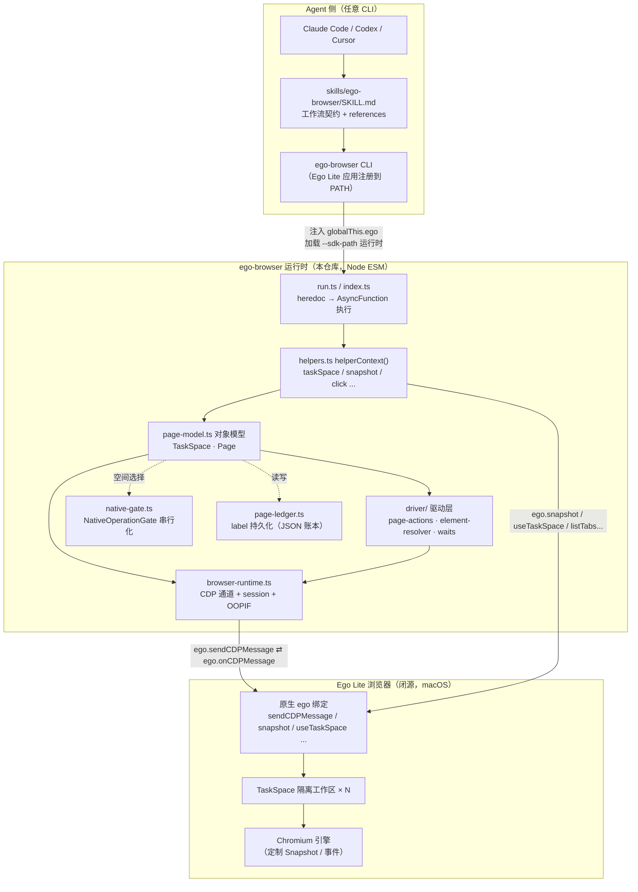
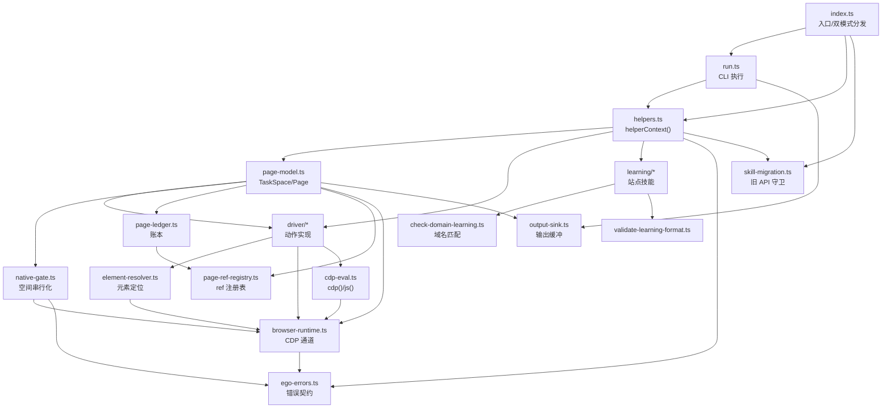
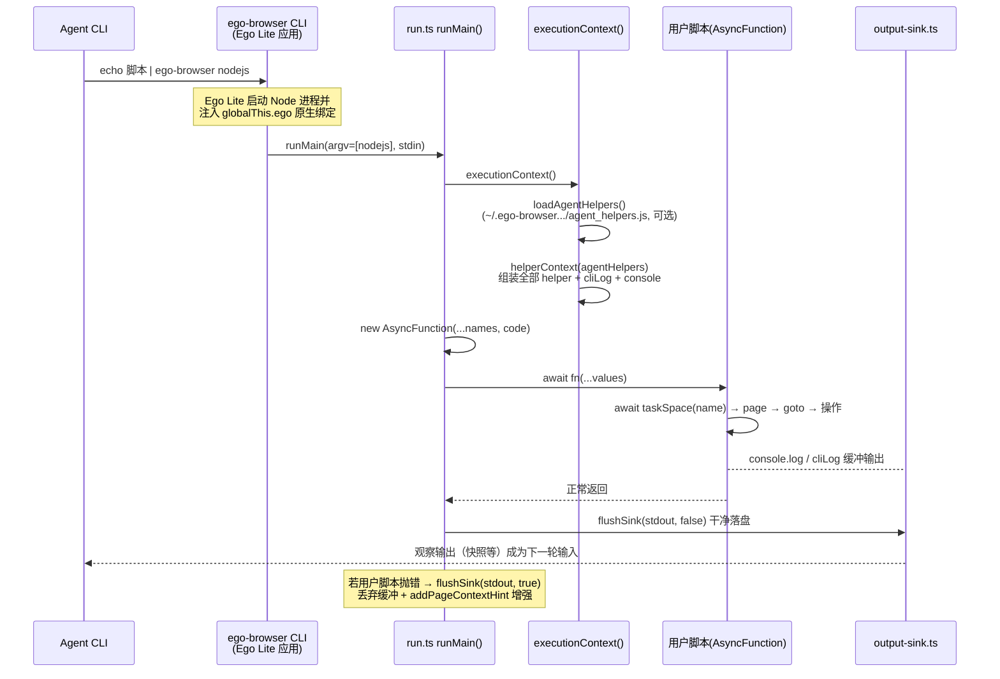
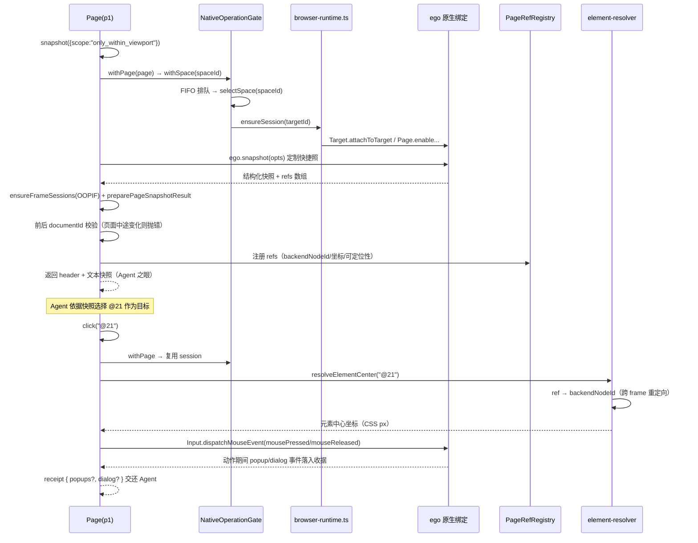
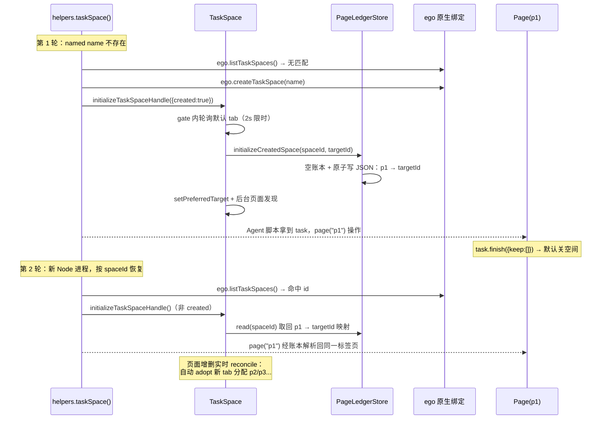

# ego-lite 源码学习笔记

> 仓库地址：[citrolabs/ego-lite](https://github.com/citrolabs/ego-lite)
> 学习日期：2026-09-30

---

> **以下为 AI 源码分析**
>
> ### 一句话概括
>
> ego-lite 是专为"人与 AI Agent 共用"设计的 Chromium 浏览器：本仓库开源的是连接层 `ego-browser`（Agent Skill + Node 运行时），它把浏览器能力封装为 Agent 可在单次脚本里直接调用的 JS 函数（snapshot / click / fill / wait 等），通过闭源浏览器注入的原生 `ego` 绑定驱动 CDP，实现"写代码一步到位"的自动化，替代传统 CLI 工具的"调两条命令-看结果-再调两条"循环。
>
> ### 要点速览
>
> | 模块 / 文件 | 职责 | 关键点 |
>|---|---|---|
> | `package/ego-browser/src/index.ts` | 运行时入口 | 双模式分发：直接 CLI（`runMain`）vs 浏览器内嵌 SDK（`installEgoSdk`） |
> | `package/ego-browser/src/run.ts` | CLI 执行器 | heredoc 读入 → `AsyncFunction` 执行；acorn 恢复语法错误行列 |
> | `package/ego-browser/src/helpers.ts` | 公开 API 面 | `helperContext()` 是 CLI/SDK 两条路径唯一的事实来源 |
> | `package/ego-browser/src/page-model.ts` | v2 对象模型 | `TaskSpace` / `Page` / `FileChooser` / `Download` / `PageMouse` / `PageKeyboard`（3637 行，最大文件） |
> | `package/ego-browser/src/browser-runtime.ts` | CDP 通道 | 基于 `ego.sendCDPMessage` 的请求-响应客户端；session 管理、OOPIF 自动 attach、事件缓冲、会话自愈 |
> | `package/ego-browser/src/native-gate.ts` | 并发门 | `NativeOperationGate`：FIFO + `AsyncLocalStorage` 串行化进程级 space 切换 |
> | `package/ego-browser/src/page-ledger.ts` | 跨轮持久化 | Page label ↔ targetId 账本，JSON 原子替换写入 `~/.ego-browser/state` |
> | `package/ego-browser/src/element-resolver.ts` | 元素定位 | 选择器/ref → backendNodeId，深度处理嵌套 iframe / shadow DOM |
> | `package/ego-browser/src/driver/` | 驱动层 | pointer / keyboard / nav / observe / waits / page-actions / downloads 等 CDP 操作实现 |
> | `package/ego-browser/src/ego-errors.ts` | 错误契约 | 稳定 `error_code` 优先于文案；用户接管 = 硬停（hard stop）不可绕过 |
> | `package/ego-browser/src/learning/` | 经验沉淀机制 | manifest 驱动的站点技能：notes + nodeTools + browserTools |
> | `skills/ego-browser/` | Agent Skill | `SKILL.md`（474 行工作流契约）+ `references/` + 预置 learnings（github/google/x-com） |
> | `package/ego-browser/scripts/` | 工程化 | 单文件构建、API 文档生成、真实浏览器 E2E 套件 |

---

## 项目简介

ego-lite（citrolabs 出品）是一个"你和你的 AI Agent 并行工作"的 Chromium 浏览器。传统方案（browser-use、agent-browser 等）只是通向浏览器的"桥"：它们需要一个额外浏览器来驱动，登录态难以完整迁移，连接不稳定，人和 Agent 还会抢浏览器控制权。ego-lite 则是从设计之初就为"一人一 Agent 共用"打造的浏览器：每个 Agent 拥有自己的 **TaskSpace**（浏览器内相互隔离的工作区），并行执行任务且不干扰用户的标签页，Agent 还能直接继承用户真实的登录态、Cookie 与扩展。

本仓库是 ego-lite 的开源部分——浏览器本体是免费的闭源 macOS 应用（Windows 内测、Linux 在路线图上）。仓库交付两样东西：

1. **`ego-browser` 运行时**（`package/ego-browser`，npm 包）：跑在 Node.js 里、由浏览器注入原生能力（`globalThis.ego`）驱动的 JS 运行时，负责把 Agent 脚本中的函数调用翻译成 CDP 命令；
2. **`ego-browser` Skill**（`skills/ego-browser`）：面向任何 Agent CLI（Claude Code / Codex / Cursor / 自定义）的工作流文档，定义 Agent 如何编写脚本使用上述 API，以及安装、连接、清理的完整指引。

核心价值主张是 **Code-based, not CLI-based**：能力以 JS 函数形式直接给 Agent 调用，Agent 可以把"打开页面 → 等待 → 填表 → 点击 → 断言"的多步任务一次写成一段脚本、单轮执行完成；官方数据称相比 CLI 工具复杂任务提速最高 2.5 倍、token 消耗大幅下降。另一个差异化能力是浏览器引擎内定制的 **Snapshot**（页面转结构化文本），深度处理嵌套 iframe 等文本模型"看网页"的难点场景。

## 技术栈

| 类别 | 技术 |
|------|------|
| 语言 | TypeScript（运行时 + 工具脚本，`target: node22`、ESM）；测试与 E2E 用例为 `.mjs`；安装脚本为 Shell |
| 框架 | 无 Web 框架；浏览器侧协议为 Chrome DevTools Protocol（CDP） |
| 构建工具 | esbuild（TS 编译）+ rollup（单文件 bundle，external 内置模块）→ `dist/out/index.js` |
| 依赖管理 | npm（`package/ego-browser` 子包，`engines.node >= 22`） |
| 运行时依赖 | 仅 `acorn`（脚本语法错误时二次解析恢复行列号） |
| 测试框架 | Node 内置 `node:test`（`node --test "src/**/*.test.mjs"`）+ 自研真实浏览器 E2E 套件（`scripts/real-browser-e2e/`） |
| 工程化 | prettier（格式检查）、lefthook（pre-commit 钩子，含 npm audit 与真实 E2E）、GitHub Actions（star-history 等） |
| 原生桥 | 闭源 Ego Lite 应用注入的 `ego` 绑定（浏览器版本 / 任务空间 / 快照 / CDP 通道），契约见 `docs/native-bindings-api.md` |

## 目录结构

```
ego-lite/
├── package/ego-browser/            # 运行时 npm 包（核心，全部 TS 源码在此）
│   ├── src/
│   │   ├── index.ts                # 入口：installEgoSdk / disposeEgoSdk / CLI 分发
│   │   ├── run.ts                  # CLI 模式：读 heredoc、构造执行上下文、跑用户脚本
│   │   ├── helpers.ts              # 公开 helper 集合与 helperContext()（唯一 API 事实来源）
│   │   ├── browser-runtime.ts      # CDP 客户端：请求-响应、session 管理、事件缓冲、会话自愈
│   │   ├── cdp-eval.ts             # cdp() / js() 原始能力（Runtime.evaluate 封装）
│   │   ├── page-model.ts           # v2 对象模型：TaskSpace / Page / mouse / keyboard
│   │   ├── page-ledger.ts          # Page 账本：label ↔ targetId 的跨轮持久化
│   │   ├── page-ref-registry.ts    # snapshot ref 注册表（文档变化失效检测）
│   │   ├── ref-map.ts / ref-state.ts / element-resolver.ts   # ref 与选择器解析
│   │   ├── snapshot-result.ts      # snapshot 结果处理（ref 重写、locator 校验、iframe 回填）
│   │   ├── native-gate.ts          # NativeOperationGate：进程级空间选择串行化
│   │   ├── ego-errors.ts           # 原生错误码契约与硬停信号
│   │   ├── output-sink.ts          # 输出缓冲（硬停时整体丢弃）
│   │   ├── http.ts                 # serverFetch（Node）/ browserFetch（页内 fetch）
│   │   ├── clipboard.ts            # 剪贴板（macOS 原生粘贴 + 恢复）
│   │   ├── page-discovery.ts       # 未处理新页面通知（popup 观察）
│   │   ├── skill-migration.ts      # 1.3 旧 API 守卫（egoBrowser.* 提示迁移）
│   │   ├── driver/                 # 驱动层：CDP 操作实现
│   │   │   ├── page-actions.ts     # click/fill/focus/hover/drag 等动作派发（1903 行）
│   │   │   ├── pointer.ts / keyboard.ts / page-keyboard.ts   # 输入事件
│   │   │   ├── nav.ts              # goto/切换 tab/iframe target 识别
│   │   │   ├── observe.ts          # snapshot/截图/元素中心
│   │   │   ├── waits.ts / page-waits.ts / scroll-motion.ts  # 等待与滚动
│   │   │   ├── downloads.ts / files.ts / action-target.ts / element-ops.ts
│   │   │   └── load.ts             # waitUntil: load 判定
│   │   └── learning/               # learnings 机制（站点技能加载/校验/执行）
│   ├── scripts/
│   │   ├── build.mjs               # 构建：esbuild + rollup + 内嵌 skill 拷贝
│   │   ├── generate-api-reference.mjs / check-skill-translation.mjs / validate-site-skills.ts
│   │   └── real-browser-e2e/       # 真实浏览器 E2E：fixture 服务器 + 37 个用例
│   ├── package.json / tsconfig.json
│   └── src/*.test.mjs              # 单元测试（与源码同目录）
├── skills/ego-browser/             # Agent Skill（分发给所有 Agent CLI）
│   ├── SKILL.md                    # 工作流契约（474 行）：API 选型、snapshot 优先、收尾规范
│   ├── references/                 # api.md / install.md / clearing-state.md
│   ├── scripts/install.sh          # macOS 安装脚本（下载 DMG → 装 app → 引导 onboarding）
│   └── learnings/                  # 预置站点技能：github / google / x-com（manifest + notes + tools）
├── docs/                           # native-bindings-api.md（893 行原生契约）、本地开发指南
├── spec/agent-skills-spec.md       # 简要规范指针
├── install.md                      # 根级安装说明（呼应 README 1.3 节）
└── .claude/ .codex/ .agents/ 等    # 各 Agent 生态的分发适配目录
```

## 架构设计

### 整体架构

ego-lite 的核心分层可概括为"Agent 写代码 → Skill 约束写法 → 运行时翻译成 CDP → 原生桥转发给浏览器"。仓库自己只拥有中间两层（Skill + 运行时），浏览器与原生绑定是外部的。



数据流要点：

- **连接方式**：Ego Lite 应用安装 `ego-browser` CLI；该 CLI 启动 Node 进程时把原生 `ego` 绑定挂到 `globalThis`，并加载本仓库构建的运行时（默认内置 bundle，开发时用 `--sdk-path` 覆盖）。原生绑定契约完整记录在 `docs/native-bindings-api.md`。
- **双运行模式**：`index.ts` 用 `isDirectCli()` 判断入口——直接以 CLI 运行时走 `runMain()`（读 heredoc 执行一次脚本）；被浏览器内嵌加载时走 `installEgoSdk()`（把 helper 包装挂到 `globalThis`/`target.ego`，配合 `onCDPMessage` 回调长驻）。两条路径共用同一个 `helperContext()`，API 面不会漂移。
- **CDP 通道**：运行时不用 WebSocket，而是通过 `ego.sendCDPMessage(payload)` 发 JSON CDP 消息、`ego.onCDPMessage` 收回复与事件；`browser-runtime.ts` 在其上实现 id 匹配的请求-响应、15s 超时、session 多路复用、事件缓冲（上限 10000 条）与断会话自愈。

### 核心模块

#### 1. 代码执行层（`index.ts` + `run.ts`）

- **职责**：把 Agent 的 heredoc 脚本变成一次受控执行；SDK 模式则把 helper 暴露进浏览器内嵌的 Node 上下文。
- **核心文件**：`src/index.ts`、`src/run.ts`
- **关键函数**：
  - `runMain()`：解析 argv、读 stdin、`executionContext()` 构造上下文、`new AsyncFunction(...names, code)` 编译并执行、`flushSink()` 收尾；
  - `installEgoSdk(target, options)`：遍历 `helperContext()` 以 `Object.defineProperty` 挂载 helper、包装 `useTaskSpace`/`createTab` 使空间切换时自动 `invalidateSession()`、安装 `cliLog`/新 `console`；
  - `userScriptSyntaxError()`：V8 的 Function 构造器报错不带行列，失败后用 acorn 重解析找回位置并画 `^` 指示。
- **关系**：是 CLI/SDK 两条路径的共同装配点；向下依赖 helpers、browser-runtime、output-sink、skill-migration 等全部模块。

#### 2. helper 层（`helpers.ts`）

- **职责**：定义 Agent 可见的完整函数面——v1 风格的扁平 helper（`click`/`fillInput`/`gotoUrl`/`snapshotText`/`wait`...）与 v2 入口（`taskSpace`/`listTaskSpaces`/`claimTaskSpace`/`completeTaskSpace`/`siteSkills`/`learnContext`...）。
- **关键函数**：
  - `helperContext(extra)`：把 pointer/keyboard/nav/observe/waits/files/cdp/js/http/learning 与 task-space 管理函数合并成一个对象，并附 `help()` 与 `egoBrowser` 守卫——CLI（`executionContext`）与 SDK（`installEgoSdk`）都从这里取，是 API 的单一事实来源；
  - `resolveTaskSpace(nameOrId)`：按 id / 精确名 / 数字字符串查找或创建空间，并区分 ownership（agent / agentDelegatedToUser / user）执行选择、claim 或留空等策略；
  - `completeTaskSpace(nameOrId, {keep})`：`keep:true` 移交用户（`ego.completeTaskSpace`），`keep:false` 先 claim 再 `ego.closeTaskSpace`。
- **关系**：被 run.ts 与 index.ts 消费；内部调 page-model 的 `createTaskSpaceHandle` 与 learning 模块；所有权策略表与 `skills/ego-browser/SKILL.md` 显式要求同步（两端都有注释互相指认）。

#### 3. 对象模型（`page-model.ts`，3637 行）

- **职责**：v2 API 的 `TaskSpace` / `Page` / `UnmanagedPage` / `FileChooser` / `Download` 与 `PageMouse` / `PageKeyboard`。所有浏览器操作最终都通过 `services` 注入点（`PageModelServices`）与 `OperationGate` 执行——这一层不知道 CDP 细节，是可测试性的关键（单测注入 mock services）。
- **关键实现**：
  - `class TaskSpace`：持有 `spaceId`、`page(label)` 工厂、`tabs()`/`pages()` 清单（经 ledger 对账）、`newPage()`、`adopt()`、`waitForControl()`、`handOff()`、`finish()`、`cdp()`；`initializeCreatedSpace()` 轮询等待新空间默认 tab（2s 内、只允许 1 个 tab）并写入 ledger 的 `p1`；`initializeBackgroundPageDiscovery()` 订阅浏览器事件 + `Target.setDiscoverTargets` 实现后台发现新页面；
  - `class Page`：每个方法都是 `#resolve()`（拿 targetId）→ `#runActionBoundary`（gate.withPage + 动作 + 收据）→ 驱动层函数；`snapshot()` 额外做 ref 注册与"页面在快照期间是否变化"的 document 校验；`waitForEvent("popup"|"download")` 先订阅再触发动作；
  - `PageEvaluationTimeoutError`：区分"执行已停止 / 可能有迟到副作用 / 页面是否响应"，配套健康探测与恢复（`recoverPageEvaluationTimeout`）。
- **关系**：页面一切动作的门面；依赖 native-gate、page-ledger、page-ref-registry、element-resolver、driver/*。

#### 4. CDP 通道（`browser-runtime.ts` + `cdp-eval.ts`）

- **职责**：在原生消息回调之上实现一个小型 CDP 客户端。
- **关键函数**：
  - `rawCdp()`：自增 id → `pending` Map（带 15s 定时器）→ `runtime.sendCDPMessage(payload)`；
  - `browserCdp()`：缺省 session 时自动 `ensureSession()`；dialog 阻塞的 method 前缀（`Input.`/`Runtime.`/`DOM.setInputFiles`/`Page.navigate`）直接抛 `PageDialogOpenedError`；"Session not found" 类错误自动清 session 并重试一次；
  - `ensureSession()`：优先用缓存的 default/preferred target，2s TTL 内复用；否则 `Target.attachToTarget` + 并行 `Page.enable` / `Network.enable` / OOPIF `Target.setAutoAttach`；
  - `ensureFrameSessions()`：用 `Target.getTargets` + `Page.getFrameTree` 两份快照对账，重建每个属于该页面的 OOPIF target 的 session 与 frame 树（含 renderer 换进程时 in-flight 网络请求迁移）；
  - `cdp-eval.ts` 的 `cdp()`/`js()`：公开的原始逃生舱；`js()` 把 `return` 语句包 IIFE，函数入参自动 `(fn)()` 并警告不捕获闭包。
- **关系**：几乎全部 driver 与 page-model 的底层通道；`native-gate` 的 `ensureSession` 服务也来自这里。

#### 5. 并发门（`native-gate.ts`）

- **职责**：Ego Lite 原生的 space 选择是**进程级**状态（`ego.useTaskSpace(id)` 全局生效）。多个并行 TaskSpace（Claude Code 开 10 个并行 Space 是核心卖点）若不串行化，A 空间的命令会被路由到 B 空间。
- **关键实现**：`NativeOperationGate.withSpace(spaceId, op)` 把操作挂到模块级 promise **FIFO 尾链**上；每个操作先 `selectSpace` 再在 `AsyncLocalStorage`（`GateOwnership`）上执行；同空间重入直接放行（绕过 FIFO），不同空间重入报错；`withPage()` = `withSpace` + `ensureSession(targetId)`。
- **关系**：page-model 的 `defaultGate` 使用它；native-gate 依赖 browser-runtime 与 ego-errors。

#### 6. 驱动层（`src/driver/`，13 个文件约 6000 行）

- **职责**：全部 CDP 操作的具体实现。
- **代表文件**：
  - `page-actions.ts`：`selectOptionInPage` / `clickInPage` / `fillInPage` / `focusInPage` / `hoverInPage` / `dragAndDropInPage` / 点击坐标系（`clickPointInPage`）等；统一做"滚入视野 → 解析目标 → 可点性断言（`assertElementReceivesPointerEvents`）→ 派发 `Input.dispatchMouseEvent`"，fill 有专门的 `fillPreparationError` 与结果验证 `verifyFillOutcome`；
  - `element-resolver.ts`：把 snapshot ref（`@21`）、`text=`、`loc=css:/role:/href:`、`xpath=`、裸 CSS 解析到 backendNodeId / objectId / 中心坐标；`resolveElementCenter` → `resolveElementObjectId` → `collectBackendNodeMatches` 的链路贯穿"先在顶层文档找、再进 frame"的语义，附带 frame 消失时的会话重建（`resolveRefObjectIdWithRecoveredFrame`）；
  - `page-waits.ts` / `waits.ts`：`waitForSelector` / `waitForLoadState` / `waitForFunction`（Playwright 参数序）/ `waitForNetworkIdle`（基于 `inflightNetworkRequests`）；
  - `observe.ts`：v1 的 `snapshot`（走原生 `ego.snapshot`）与 `captureScreenshot`（CSS 像素截图，`1/dpr` 缩放换算，不用 `fromSurface` 的裸像素）；
  - `nav.ts`：`gotoUrl` / `openOrReuseTab` / `iframeTarget`；
  - `downloads.ts`：每轮临时下载目录 + `Browser.setDownloadBehavior` 按 Page 会话配置/恢复。
- **关系**：被 page-model 的 Page 方法调用；依赖 browser-runtime、cdp-eval、element-resolver。

#### 7. 持久化与 ref 系统（`page-ledger.ts` + `page-ref-registry.ts` + `snapshot-result.ts`）

- **职责**：让"每轮一个新 Node 进程"的编程模型（SKILL.md 明言：JavaScript 变量不持久，而 task space、标签、Page label 持久）成立。
- **PageLedgerStore**：每个 space 一个 JSON 文档（`~/.ego-browser/state` 或 `$EGO_BROWSER_STATE_DIR`，前缀 `browser-host:<ppid>` 标识运行实例，30 天过期清理）；label 分配（`p1`/`p2`...）、`reconcile()` 对账浏览器真实 tab、**原子 rename 写入**防读到半截文件；跨轮 `page("p1")` 即从账本取回 targetId。
- **PageRefRegistry**：快照里的 ref 只在"文档未变"时有效——`snapshot()` 前后各取一次 documentId，任何 ref 的文档变了就抛 `Page changed during snapshot; take a new snapshot`（transient 类错误，引导 Agent 重取快照而非重试动作）。
- **snapshot-result.ts**：`preparePageSnapshotResult` 做 ref 重写（把潜在冲突的全局 id 重编号）、`loc=` 稳定定位器校验/剔除、iframe 内容的 frameId 回填。

#### 8. 错误契约与输出（`ego-errors.ts` + `output-sink.ts`）

- **职责**：保证 Agent 对两类关键信号的正确反应：业务失败 vs 用户接管。
- 原生错误统一经由 `invokeEgo`：从 resolved 对象或 thrown Error 里提取稳定的 `error_code`（15 个已知码），**只按码不按文案**分支；`EGO_TASK_SPACE_USER_IN_CONTROL` / `EGO_TASK_SPACE_INACTIVE` 是"硬停"——文案直接教导 Agent 不得重试、不得自行夺回控制权、等待用户确认后 `takeOverTaskSpace`/`claimTaskSpace`。权限弹窗（notifications/location/bluetooth...）映射到 `USER_CONTROL_REASON_MESSAGES`。
- `output-sink.ts`：所有 `cliLog`/`console` 先入缓冲；`markHardStop()` 后在脚本收尾时**整体丢弃**缓冲——避免"任务已经失败仍把半成品观察输出喂给 Agent 误导下一轮"。

#### 9. 学习机制（`src/learning/` + `skills/ego-browser/learnings/`）

- **职责**：README 宣称的 "Experience accumulation"（coming soon 的官方 Skill 蒸馏）的落点——按域名组织的站点技能。
- 结构：每个站点一个目录 `learnings/<siteId>/`，含 `manifest.json`（id/name/domains 匹配模式/notes/nodeTools/browserTools 声明与参数 schema）+ `notes/*.md`（人类可读知识）+ `tools/*.js`（Node 侧工具，`callable` 导出）+ `browser-tools/*.js`（页内工具）。
- 运行时面：`siteSkillsForUrl(url)` 按域名匹配、`learnContext(url)` 注入知识、`runSiteTool`（动态 import 带 `?t=Date.now()` 防缓存）、`runSiteBrowserTool`（把源码包成 IIFE 经 `js()` 在页内执行）。`check-domain-learning.ts` 负责通配域匹配（如 `*.github.com`），`validate-learning-format.ts` 校验写的学习内容格式（配合 `scripts/validate-site-skills.ts` 检查预置 learnings 与运行时 API 对齐）。

### 模块依赖关系



依赖方向上的两条纪律：`page-model.ts` 与 `driver/*` 是核心圈，只依赖 CDP 通道与解析器；`index.ts`/`run.ts` 是装配圈，把 helpers 面粘到执行环境上；原生能力只通过 `browser-runtime.ts`（CDP）与 `ego-errors.ts`（原生调用封装）两扇门进入。

## 核心流程

### 流程一：CLI 单轮脚本执行（Agent 一轮 = 一次 Node 进程）

对应 SKILL.md 的核心工作模型：Agent 把整段操作写成 heredoc，运行时单轮执行并把"最终快照"作为下一轮的起点。



关键逻辑：

1. `runMain` 无参命令只认 stdin；`nodejs` 子命令只是透传（安装的 CLI 负责把它路由到运行时）。
2. `executionContext()` 与 `installEgoSdk()` 取同一个 `helperContext()`——CLI 路径与浏览器内嵌路径的 API 面零漂移；`console` 作为 `AsyncFunction` 的**词法参数**传入，shadows Node 全局 console 而非替换它。
3. 语法错误走 `userScriptSyntaxError()`：V8 不给位置信息时，用 acorn 把同一段代码包进 `async function __egoBrowserUserScript__() {...}` 再解析，换算出用户脚本真实行列并生成 `^` 箭头。
4. 输出策略：正常结束才 flush；**硬停**（用户接管等）丢弃全部缓冲，防止半成品观察误导下一轮决策。

### 流程二：Snapshot 观察 → ref 驱动操作 → 收据（语义页面的核心闭环）

对应 SKILL.md 推荐的"抓快照 → 选 ref → 一轮内完成多步动作 → 快照确认"工作流。



关键逻辑：

1. **ref 是"当前文档时点"的租约**：注册时核对快照前后 `documentId`，页面一变就按 transient 错误提示重新快照——这和 SKILL.md "页面变化后必须重取快照"的纪律互为表里。
2. 元素动作全部走 `Input.dispatchMouseEvent` 等 CDP 原语而非 WebDriver 语义；点击前有可点性断言链（`assertElementEnabled` → `assertElementReceivesPointerEvents` → `assertSafeFillActivationTarget`）。
3. 动作收据（receipt）只描述"派发的动作 + 即时观察到的 popup/dialog"，**不验证业务结果**——验证由 Agent 用 waiting API + 新快照完成，职责边界清晰。
4. iframe 处理链路：主文档优先 → 无匹配再进 frame（含嵌套 OOPIF，逐个 attach session）；`scope:"subtree"` 用 iframe 行上打印的 ref 圈定子树。

### 流程三：TaskSpace 生命周期与跨轮持久化（Agent 多轮任务的骨架）

对应 SKILL.md 的硬性约定："整个用户目标只用一个 TaskSpace，创建一次、打印 spaceId、后续轮次恢复使用"。



关键逻辑：

1. **每轮新进程、状态全裸**：JavaScript 变量不跨轮，能跨轮的只有浏览器里真实的 space/tab 与磁盘账本——因此 SKILL.md 强制"创建一次、打印 spaceId"，第二轮起 `taskSpace(7)` 按数字 id 恢复。
2. 新建空间有严格初始化契约：2 秒内必须出现且仅出现一个默认 tab，否则 `initializeCreatedSpace` 失败并触发 `rollbackCreatedTaskSpace` 回滚关闭空间——"没有 p1 账本项的空间不允许存活"。
3. 账本写入用"写临时文件 + rename"的原子替换，任何读者不会看到半截 JSON；browser instance 以 `browser-host:<ppid>` 标识，重启浏览器后新实例会清理 30 天以上的过期账本。
4. 收尾语义由 API 强制：`finish({keep:[]})` 默认关闭、`keep:["p2"]` 只留结果页给用户；用户自建/未托管 tab 受保护，`keep:[]` 不会误关整个空间。

## 关键设计亮点

### 1. Code-based not CLI-based：把"多轮交互"压缩成"单次程序"

- **解决的问题**：CLI 式浏览器工具（调两条命令→看结果→再调两条）把 Agent 锁死在"每步都要往返"的低效循环里，复杂任务 token 消耗高、失败率高。
- **实现方式**：Agent 直接写 JS（SKILL.md 全部示例即完整脚本），在一个 `AsyncFunction` 里连续调用 `goto → waitForSelector → fill → click → waitForFunction → snapshot`，运行时一次执行；观察→决策的循环只在"中间结果改变下一步"时才拆轮。
- **为什么这样设计**：Agent 最擅长写代码——给它函数而非命令，它能把多步任务组织成单输出（README 数据：复杂任务比 Vercel agent-browser 快 2.5 倍、token 更省）。配合"打印最终快照作为下一轮起点"的约定（SKILL.md《Work efficiently》节），把观察成本也摊薄到每轮一次。

### 2. 单一 API 事实来源 + 显式的"这不是 Playwright"边界

- **解决的问题**：CLI 路径与浏览器内嵌 SDK 路径的 API 漂移；以及 Agent 把 API 脑补成 Playwright（`locator()`、`getByRole()`、`route()` 等不存在的推断调用）。
- **实现方式**：`helpers.ts:643` 的 `helperContext()` 是唯一组装点，`run.ts` 的 `executionContext()` 与 `index.ts` 的 `installEgoSdk()` 都从它取数；SKILL.md 第 53-59 行白纸黑字声明"只在 Skill 列出的 API 内使用，缺能力走 `page.evaluate()`/`page.cdp()` 逃生舱，不要猜"；另有 `egoBrowser.*` 旧命名空间守卫（`skill-migration.ts`）把过时脚本引导到迁移提示。
- **为什么这样设计**：Agent 对"类 Playwright 命名"的 API 有强先验，会自然脑补不在契约内的方法。运行时用"窄而明确的 API + 文档化逃生舱"对抗这种幻觉，把不确定性圈进两个受控出口。

### 3. NativeOperationGate：用 Promise FIFO + AsyncLocalStorage 驯服进程级状态

- **解决的问题**：原生 `ego.useTaskSpace(id)` 是**进程级**选择（native-bindings 契约如此），而并行 TaskSpace 是产品核心卖点——多 Agent 并发时，A 空间的 CDP 命令可能被路由到 B 空间。
- **实现方式**：`native-gate.ts` 把所有需要特定 space 的操作串到模块级 promise 尾链上按 FIFO 执行；`AsyncLocalStorage` 记录"当前持有租约的空间"——同空间重入直接放行（避免死锁），异空间重入立即报错；队列故意无界（等待中的操作不能因为"换空间"被错路由）。
- **为什么这样设计**：原生绑定不可改（浏览器侧契约），并发正确性只能在 JS 侧补偿。用链式 promise 而非互斥锁做串行化，天然保证"选择空间→发请求→等回复"整个异步区间不被穿插。

### 4. CDP 会话自愈与 OOPIF 会话树

- **解决的问题**：嵌套 iframe（README 点名"其他方案在这里系统性崩坏"的场景）在 CDP 里是独立的 OOPIF target，需要独立 session；页面导航/renderer 换进程又会随时废掉 session。
- **实现方式**：`browser-runtime.ts` 的 `ensureSession()` 带 2s TTL 缓存 + `Session not found` 自动重连一次（`browserCdp` 的 lost 分支）；`ensureFrameSessions()` 用 `Target.getTargets` 与 `Page.getFrameTree` 双快照对账重建 frame→session 映射，只把"target 消失"当权威信号清会话（快照间的瞬时不同步不算数）；`registerTargetParent` 还会在 renderer 换进程时把 in-flight 网络请求迁移到新 parent session。
- **为什么这样设计**：Agent 面向的页面复杂且动态，CDP 层的任何"session 失效"若不静默自愈，就会变成 Agent 脚本里的随机失败，逼 Agent 走重试玄学。运行时替上层吞掉可恢复的层故障，只把真正的业务信号（dialog、用户接管）露给 Agent。

### 5. Page Ledger：让"每轮一个新进程"也能有持久标签页句柄

- **解决的问题**：SKILL.md 的编程模型是"调用间进程必死、变量必失"，但 agent 必须能说"回到 p1"。
- **实现方式**：`page-ledger.ts` 每 space 一个 JSON 文件（label→targetId + usedLabels + released 列表），写入永远走临时文件 + atomic rename；`reconcile()` 每次 `tabs()`/`pages()` 前与浏览器真实 tab 对账（自动 adopt 新页面、识别 `openedBy` 归属）；实例 id 用 `browser-host:<ppid>` 标识，30 天过期清理。
- **为什么这样设计**：把"持久化"下沉为账本而非内存缓存，使每一轮脚本都从磁盘+浏览器两个真实源重建世界，绝不依赖上一轮进程的任何内存——模型退化时（第二轮 Agent 忘了打印的 spaceId）还有 `listTaskSpaces()` 兜底找回。

### 6. 错误码契约：稳定 code 优先、用户接管 = 硬停

- **解决的问题**：原生桥的错误文案会随浏览器 build 漂移；且"用户把鼠标拿回去了"这类事件必须让 Agent 停止而非绕过。
- **实现方式**：`ego-errors.ts` 只按 15 个稳定的 `error_code` 分支（`EGO_ERROR_CODES` 常量组），未知码一律透传原生文案；`EGO_TASK_SPACE_USER_IN_CONTROL`/`INACTIVE` 的文案直接是给 Agent 的行为指令（"这是硬停，不要重试、不要自行夺回控制权，等用户确认后 takeOverTaskSpace/claimTaskSpace"），配合 `output-sink` 的 `markHardStop()` 把先前输出整体丢弃。
- **为什么这样设计**：和人共用浏览器，人永远优先。把"用户接管"从技术错误升级为协议级信号，并让 Agent 可见的全部上下文（而非仅错误本身）保持一致，防止 Agent 用重试或重新 claim 绕开用户。

### 7. Learnings：manifest 驱动的站点技能沉淀

- **解决的问题**：官方 roadmap 承诺"Agent 越用越快"——把每次成功的站点操作蒸馏成可复用知识，类似任务跑快 5 倍。
- **实现方式**：`learnings/<site>/manifest.json` 声明域名匹配（支持通配 `*.github.com`）、notes 文档、nodeTools（带参数/返回值 schema 的 Node 模块，`runSiteTool` 动态 import）与 browserTools（页内 JS，`runSiteBrowserTool` 包 IIFE 注入）；运行时 `learnContext(url)` 按当前页注入知识，`validate-site-skills.ts` 保证预置 learnings 与运行时 API 对齐；仓库预置了 github/google/x-com 三个站点的第一批知识。
- **为什么这样设计**：把"经验"设计成**可版本化管理、可校验、可分发**的包（跟着 skill 走），而不是藏在某个 Agent 的历史对话里——经验因此成为 SKILL.md 之外的第二层垂直知识，随仓库迭代共享给所有用户。

### 8. 对 Agent 的"输出卫生"：缓冲、丢弃与升级提示

- **解决的问题**：Agent 会把 stdout 当事实。失败轮次若吐出一堆半截观察，下一轮可能基于过期信息继续错下去；新版本提示若不醒目则被忽略。
- **实现方式**：`output-sink.ts` 全量缓冲 `console/cliLog`，正常结束 flush、异常/硬停丢弃；SDK 路径在进程 teardown 时 flush（`installLifecycleFlush`）；`update-notice.ts` 用 500ms 竞速探测 `getBrowserVersion()` 有无更新，输出 `[ego-browser:notice]` 哨兵行让 Agent 的 Skill 指引识别并询问用户后再 upgrade。
- **为什么这样设计**：把 Agent 当"只读 stdout 的程序"来设计 I/O 契约——不在契约里的噪声（半成品观察、静默失败）宁可不输出，要提示就用明文约定好的哨兵格式。

---

## 未深入分析的部分

- `src/driver/page-waits.ts`（924 行）与 `page-keyboard.ts`（673 行）的逐函数细节未展开，仅理解其等待条件与按键状态机接口。
- `scripts/real-browser-e2e/` 下 37 个用例的具体断言逻辑与 fixture 服务器实现未逐一研读（框架结构已了解：`runner.mjs` + `cases/*` + 自起 fixture server + `--sdk-path` 注入真实浏览器）。
- 各 `*.test.mjs` 单元测试的 mock 策略（`state.cdpOverride`、`setOverrides`）未逐一核对。
- 浏览器本体（闭源）内部如何生成定制 Snapshot、如何实现 TaskSpace 隔离与 Agent 光标叠加层，只能通过 `docs/native-bindings-api.md` 的契约侧面推断。