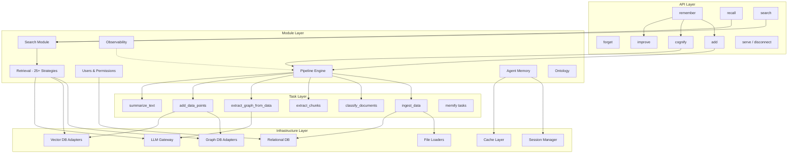
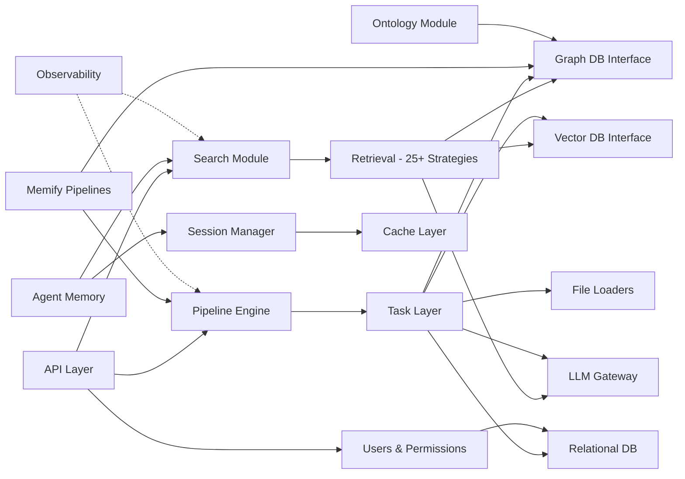
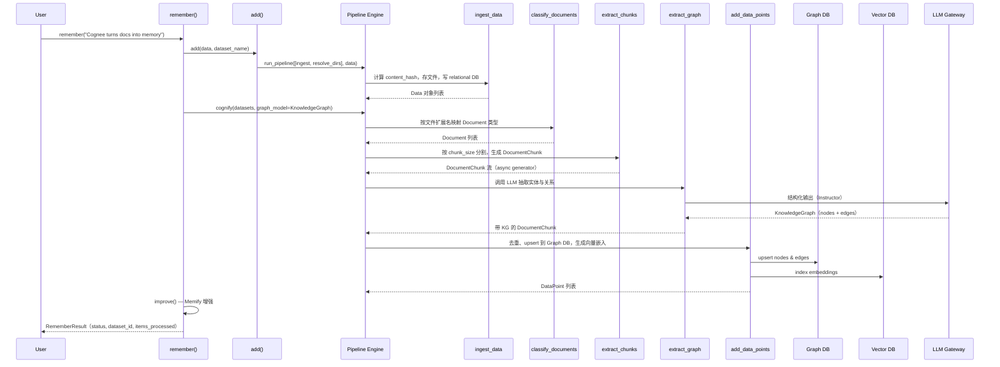
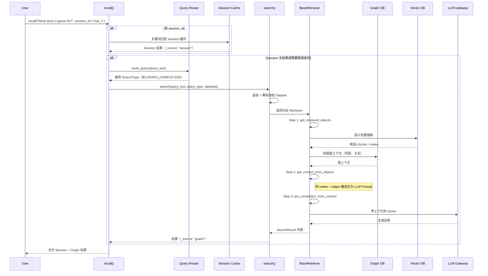

# cognee 源码学习笔记

> 仓库地址：[cognee](https://github.com/topoteretes/cognee)
> 学习日期：2026/04/16

---

> **以下为 AI 源码分析**
>
> ### 一句话概括
>
> Cognee 是一个开源知识引擎，将任意格式的数据摄入后通过 LLM 抽取实体与关系，构建知识图谱与向量索引，为 AI Agent 提供持久化、可学习的记忆系统。
>
> ### 要点速览
>
> | 核心模块 | 职责 | 关键文件 |
> |---------|------|---------|
> | API Layer | 对外暴露 remember/recall/forget/improve 等统一接口 | `cognee/api/v1/` |
> | Pipeline Engine | 基于 async generator 的任务编排与执行引擎 | `cognee/modules/pipelines/` |
> | Tasks | 可组合的处理单元：摄入、分块、图谱抽取、存储、摘要等 | `cognee/tasks/` |
> | Infrastructure | 数据库适配器（Graph/Vector/Relational/Cache）、LLM 网关、文件加载器 | `cognee/infrastructure/` |
> | Modules | 搜索、检索策略、用户权限、可观测性等业务模块 | `cognee/modules/` |
> | Memify | 图谱增强与 Session 记忆桥接 | `cognee/memify_pipelines/` |

---

## 项目简介

Cognee 是一个面向 AI Agent 的开源知识引擎。它支持将任意格式的数据（文本、PDF、图片、音频、CSV、URL 等）摄入系统，通过 LLM 驱动的实体抽取和关系发现，自动构建知识图谱（Knowledge Graph）并同步生成向量嵌入索引。上层提供统一的 `remember` / `recall` / `forget` / `improve` 语义化 API，让 AI Agent 能够像人类一样"记住"信息、"回忆"知识、"遗忘"过时内容，并通过反馈循环持续"改进"记忆质量。其核心价值在于：

- **统一知识基础设施**：一套系统同时支持图搜索和向量搜索，支持本地与云端部署
- **持久化 Agent 记忆**：跨 Session 的知识持久化，支持 Session 级快速缓存与图谱级长期存储
- **可学习与可信赖**：通过反馈权重、本体对齐、溯源追踪等机制让记忆持续演进

## 技术栈

| 类别 | 技术 |
|------|------|
| 语言 | Python 3.10 - 3.13 |
| 框架 | FastAPI (HTTP API)、Pydantic (数据模型)、SQLAlchemy (ORM) |
| 构建工具 | Docker / docker-compose / Modal / Fly.io / Railway |
| 依赖管理 | Poetry / uv (pyproject.toml + uv.lock / poetry.lock) |
| 测试框架 | pytest |
| LLM 集成 | LiteLLM（多 Provider 网关）、Instructor（结构化输出）、OpenAI SDK |
| 图数据库 | Neo4j、Kuzu（默认）、PostgreSQL（图即表）、AWS Neptune |
| 向量数据库 | LanceDB（默认）、ChromaDB、PGVector、Neptune Analytics |
| 关系数据库 | SQLite（默认）、PostgreSQL |
| 缓存 | Redis、文件系统缓存 |
| 可观测性 | OpenTelemetry (structlog + OTEL Spans) |

## 目录结构

```
cognee/
├── __init__.py                  # 包入口，导出 V1 + V2 API
├── api/
│   └── v1/                      # API 层：add, cognify, search, remember, recall, forget, improve, serve...
├── tasks/                       # 可组合的 Pipeline 任务
│   ├── ingestion/               #   数据摄入与注册
│   ├── documents/               #   文档分类与分块
│   ├── chunks/                  #   文本分块策略
│   ├── graph/                   #   LLM 知识图谱抽取
│   ├── storage/                 #   图/向量持久化
│   ├── summarization/           #   LLM 摘要生成
│   ├── translation/             #   多语言翻译
│   ├── temporal_awareness/      #   时间感知图谱
│   ├── memify/                  #   Session 记忆抽取
│   ├── web_scraper/             #   Web 内容爬取
│   ├── codingagents/            #   代码规则抽取
│   └── schema/                  #   数据库 Schema 摄入
├── modules/                     # 业务模块
│   ├── pipelines/               #   Pipeline 引擎（TaskSpec, BoundTask, run_pipeline）
│   ├── search/                  #   搜索入口与 SearchType 枚举
│   ├── retrieval/               #   25+ 检索策略（BaseRetriever 三步管线）
│   ├── ingestion/               #   数据摄入协议与分类
│   ├── chunking/                #   Chunker 抽象与实现
│   ├── graph/                   #   图模型（Node, Edge）与 CRUD
│   ├── cognify/                 #   Cognify 配置
│   ├── memify/                  #   Memify 增强管线
│   ├── agent_memory/            #   Agent 记忆装饰器
│   ├── ontology/                #   本体对齐（RDF 解析）
│   ├── users/                   #   认证、授权、多租户
│   ├── observability/           #   OpenTelemetry 追踪
│   └── visualization/           #   图可视化
├── infrastructure/              # 基础设施抽象
│   ├── databases/
│   │   ├── graph/               #     Neo4j / Kuzu / Postgres / Neptune 适配器
│   │   ├── vector/              #     LanceDB / ChromaDB / PGVector 适配器
│   │   ├── relational/          #     SQLAlchemy (SQLite / PostgreSQL)
│   │   ├── cache/               #     Redis / FSCache 适配器
│   │   ├── hybrid/              #     混合引擎（Neptune Analytics / PGHybrid）
│   │   └── unified/             #     UnifiedStoreEngine 门面
│   ├── llm/                     #   LLM 网关、Prompt 模板、Tokenizer
│   ├── engine/                  #   DataPoint / Edge 核心数据模型
│   ├── loaders/                 #   文件加载器插件体系
│   ├── files/                   #   文件存储（Local / S3）
│   └── session/                 #   SessionManager
├── memify_pipelines/            # Memify 预定义管线
├── cli/                         # CLI 命令入口
├── eval_framework/              # 评估框架
└── shared/                      # 共享工具与数据模型
```

## 架构设计

### 整体架构

Cognee 采用**分层架构**，从上到下分为 API 层、模块层、任务层和基础设施层。API 层提供面向用户的语义化接口（`remember`、`recall` 等），模块层实现搜索、检索策略、用户权限等业务逻辑，任务层定义可组合的原子处理单元，基础设施层通过 Interface + Adapter 模式屏蔽底层数据库差异。Pipeline 引擎是贯穿各层的执行骨架，将任务按顺序链式执行，支持 async generator 流式处理和批量控制。



### 核心模块

#### 1. API Layer (`cognee/api/v1/`)

**职责**：对外暴露统一的异步 Python SDK 和 HTTP REST API。

**核心接口**：

| 函数 | 作用 | 关键参数 |
|------|------|---------|
| `remember(data, session_id?)` | 一步完成 add + cognify + improve | `session_id` 区分 Session 缓存与持久图谱 |
| `recall(query_text, session_id?)` | 智能路由查询，Session 优先、图谱兜底 | `auto_route=True` 自动选择检索策略 |
| `forget(data_id?, dataset?, everything?)` | 统一删除（单条 / 数据集 / 全部） | 同时清理 Graph + Vector + Relational + Cache |
| `improve(dataset, session_ids?)` | 反馈权重应用 + Session 桥接 + Memify 增强 | `feedback_alpha` 控制权重幅度 |
| `add(data, dataset_name)` | 原始数据摄入 | 支持文本、文件路径、URL、BinaryIO、DLT Source |
| `cognify(datasets, graph_model)` | LLM 驱动的知识图谱构建 | `graph_model` 自定义图谱 Schema |
| `search(query_text, query_type)` | 底层搜索，20+ SearchType | `GRAPH_COMPLETION` / `RAG_COMPLETION` / `CHUNKS` 等 |
| `serve(url?, api_key?)` | 连接 Cognee Cloud 或远程实例 | Auth0 Device Code Flow |

**与其他模块的关系**：API Layer 是最外层入口，向下依赖 Pipeline Engine 执行任务链，依赖 Search Module 处理查询，依赖 Users Module 鉴权。

#### 2. Pipeline Engine (`cognee/modules/pipelines/`)

**职责**：定义和执行 Task 组成的处理管线，是系统的执行骨架。

**核心抽象**：
- `TaskSpec`：Task 装饰器，将函数包装为可复用的任务定义
- `BoundTask`：绑定了参数的 Task 实例，ready to run
- `Task`：运行时执行包装器，支持 async generator / generator / coroutine / sync function
- `PipelineContext`：管线上下文，携带 user、dataset、provenance 等运行时状态

**执行模型**：
```
run_pipeline([BoundTask1, BoundTask2, ...], data)
  -> run_tasks_base(tasks, data)
    -> Task.execute(data) -- async for 逐条处理
      -> run_tasks_base(remaining_tasks, result)  -- 递归链式传递
```

**关键特性**：
- 上一个 Task 的输出自动作为下一个 Task 的输入
- `batch_size` 控制批量聚合
- `Drop` 哨兵值用于过滤
- Provenance 溯源：每个 DataPoint 自动打标 pipeline_name、source_task、source_user
- 支持后台执行和分布式模式

**核心文件**：`operations/run_pipeline.py`、`operations/run_tasks_base.py`、`tasks/task.py`、`models/PipelineContext.py`

#### 3. Retrieval Module (`cognee/modules/retrieval/`)

**职责**：25+ 种检索策略的统一抽象，实现三步检索管线。

**BaseRetriever 三步管线**：
1. `get_retrieved_objects(query)` — 从 Graph/Vector DB 获取原始数据
2. `get_context_from_objects(objects)` — 将原始数据转为 LLM 可消费的上下文
3. `get_completion_from_context(context)` — 调用 LLM 生成最终回答

**主要检索器**：
- `GraphCompletionRetriever` — 图谱上下文 + LLM 推理（默认）
- `ChunksRetriever` — 语义向量搜索
- `TripletRetriever` — 三元组嵌入检索
- `NaturalLanguageRetriever` — 自然语言图查询
- `CypherSearchRetriever` — Cypher 直接查询
- `TemporalRetriever` — 时间感知检索
- `GraphCompletionCOTRetriever` — Chain-of-Thought 图推理

**核心文件**：`base_retriever.py`、各 `*_retriever.py`

#### 4. Infrastructure - Database Adapters

**职责**：通过 Interface + Adapter 模式屏蔽底层数据库差异。

**Graph DB（`GraphDBInterface`）**：
- `Neo4jAdapter` — 全功能异步，含死锁重试
- `KuzuAdapter` — 本地文件图数据库（默认），支持远程模式
- `PostgresAdapter` — "图即表"模式（graph_node / graph_edge 表）
- `NeptuneGraphDB` — AWS Neptune

**Vector DB（`VectorDBInterface`）**：
- `LanceDBAdapter` — 默认，HTTP 客户端支持
- `ChromaDBAdapter` — HTTP 部署
- `PGVectorAdapter` — 基于 SQLAlchemy + asyncpg
- `NeptuneAnalyticsAdapter` — 混合 Graph + Vector

**Cache（`CacheDBInterface`）**：
- `RedisAdapter` — 分布式缓存 + 锁
- `FSCacheAdapter` — 文件系统缓存

**工厂模式**：`get_graph_engine()` / `create_vector_engine()` / `get_cache_engine()` 通过环境变量选择 Provider，LRU 缓存单例。

**UnifiedStoreEngine**：门面模式统一包装 Graph + Vector 引擎，通过 Capability Flag 标识能力（`GRAPH`、`VECTOR`、`HYBRID_WRITE`、`HYBRID_SEARCH`）。

#### 5. Users & Permissions (`cognee/modules/users/`)

**职责**：认证、授权、多租户隔离。

**核心模型**：
- `Principal`（多态基类）→ `User` / `Service`
- `Tenant` — 多租户隔离边界
- `Role` — 角色权限集合
- `ACL` — 行级访问控制
- `Permission` — CRUD 权限

**认证策略**：JWT（本地）、API Bearer Token、API Key、fastapi-users 集成

**权限粒度**：Dataset 级别（read / write / admin）

### 模块依赖关系



## 核心流程

### 流程一：数据摄入与知识图谱构建（remember / add + cognify）

这是 Cognee 最核心的流程，将原始数据转化为结构化的知识图谱。



**关键逻辑说明**：

1. **摄入阶段**：`ingest_data` 支持文本、文件、URL、BinaryIO 等多种输入格式，统一转为 `Data` 模型，计算 content_hash 用于增量去重
2. **分类阶段**：`classify_documents` 根据文件扩展名将 Data 映射为 PDF / Text / CSV / Image 等 Document 子类
3. **分块阶段**：`extract_chunks_from_documents` 是 async generator，流式产出 `DocumentChunk`，支持 `batch_size` 控制
4. **抽取阶段**：`extract_graph_from_data` 调用 LLM（通过 Instructor 框架获取结构化输出），按 `graph_model`（默认 `KnowledgeGraph`）抽取实体和关系，可选本体对齐验证
5. **存储阶段**：`add_data_points` 从 DataPoint 中提取 nodes/edges，去重后 upsert 到 Graph DB，同时为标注 `@Embeddable` 的字段生成向量嵌入写入 Vector DB

### 流程二：智能检索与 Session 感知查询（recall / search）



**关键逻辑说明**：

1. **Session 优先**：如果提供了 `session_id`，先在 Cache（Redis / FSCache）中做关键词匹配，命中则直接返回
2. **智能路由**：`auto_route=True` 时，`query_router` 分析 Query 特征自动选择最佳 SearchType
3. **三步管线**：所有 25+ Retriever 都遵循 `get_retrieved_objects → get_context_from_objects → get_completion_from_context` 模式
4. **混合搜索**：`GraphCompletionRetriever` 先用向量搜索找候选节点，再在 Graph DB 上扩展邻居关系，将完整上下文喂给 LLM
5. **多 Dataset 并行**：对多个 Dataset 的搜索在各自的数据库上下文中并行执行

## 关键设计亮点

### 1. Interface + Adapter 模式实现数据库可插拔

**解决的问题**：支持 4 种图数据库、4 种向量数据库、2 种关系数据库、2 种缓存后端，同时保持上层代码零修改。

**实现方式**：
- 定义 `GraphDBInterface`、`VectorDBInterface`、`CacheDBInterface` 等抽象接口
- 每个数据库后端实现一个 Adapter（如 `Neo4jAdapter`、`LanceDBAdapter`）
- 工厂函数 `get_graph_engine()` / `create_vector_engine()` 根据环境变量动态选择 Provider
- `UnifiedStoreEngine` 门面模式统一包装 Graph + Vector，通过 `EngineCapability` 标识混合能力
- LRU 缓存确保工厂函数返回单例

**为什么这样设计**：知识图谱领域数据库选型多样，用户可能从本地 Kuzu 起步，生产环境切换到 Neo4j 或 Neptune。适配器模式让切换只需改一个环境变量。`infrastructure/databases/graph/`、`infrastructure/databases/vector/`

### 2. 基于 Async Generator 的流式 Pipeline 引擎

**解决的问题**：大规模文档处理需要流式执行以控制内存，同时需要灵活的 Task 组合能力。

**实现方式**：
- Task 可以是 async generator（`yield` 多个结果）、coroutine（返回单个结果）或普通函数
- `run_tasks_base` 递归执行：当前 Task `yield` 一个结果后，立即传给后续 Task 链，无需等待全部结果
- `batch_size` 参数控制聚合——下游 Task 的 batch_size 决定上游攒多少结果再传递
- `Drop` 哨兵值允许 Task 过滤掉不需要的数据
- `PipelineContext` 在整个链中传递运行时状态和溯源信息

**为什么这样设计**：文档分块是典型的 1:N 展开（一个文档产出多个 chunk），如果用列表传递会在大文档场景占用大量内存。Async generator 的流式模式天然适配这种场景。`modules/pipelines/operations/run_tasks_base.py`、`modules/pipelines/tasks/task.py`

### 3. 三步检索管线（BaseRetriever）实现 25+ 检索策略

**解决的问题**：不同查询场景需要不同检索策略（向量搜索、图遍历、Cypher 查询、RAG、Chain-of-Thought 等），但上层 API 需要统一接口。

**实现方式**：
- `BaseRetriever` 定义三步抽象：`get_retrieved_objects` → `get_context_from_objects` → `get_completion_from_context`
- 每种检索策略只需实现这三步的具体逻辑
- `RegisterRetriever` 插件注册机制支持自定义检索器
- `query_router` 根据 Query 特征自动选择最佳策略

**为什么这样设计**：检索是知识引擎的核心能力，不同场景对精度、速度、解释性有不同要求。三步管线将"获取数据 → 构建上下文 → 生成回答"的通用模式固化为模板方法，新增策略只需关注差异化逻辑。`modules/retrieval/base_retriever.py`

### 4. Session 记忆与知识图谱的双向桥接

**解决的问题**：AI Agent 的 Session 内短期记忆（QA 历史）和长期知识图谱之间需要双向同步。

**实现方式**：
- `remember(data, session_id=...)` 将数据先存入 Session Cache（Redis/FSCache），后台异步桥接到图谱
- `recall(query, session_id=...)` 先查 Session Cache，无结果再查图谱
- `improve(session_ids=...)` 执行四阶段桥接：
  1. 将 Session 中的用户反馈权重应用到图谱节点/边
  2. 将 Session QA 文本 cognify 到图谱
  3. Memify 增强（三元组嵌入等）
  4. 将图谱新增关系回写到 Session Cache
- `SessionManager` 管理 QA 历史、反馈、Graph Element 追踪

**为什么这样设计**：Agent 的对话记忆（Session 级）和持久知识（Graph 级）有不同的时效性和访问模式。Session Cache 提供毫秒级读写，图谱提供深度推理。双向桥接让短期记忆能沉淀为长期知识，长期知识也能注入到当前对话上下文。`api/v1/remember/`、`api/v1/improve/`、`infrastructure/session/`

### 5. DataPoint 溯源与身份去重体系

**解决的问题**：知识图谱中同一实体可能被多次摄入（不同文档提到同一个人/概念），需要智能去重并保留完整溯源链。

**实现方式**：
- `DataPoint` 基类支持 `identity_fields` 元数据——标记哪些字段构成"身份"
- 当配置了 identity_fields 时，UUID 由 `uuid5(namespace, identity_value)` 确定性生成，相同身份自动合并
- `@Embeddable()` 注解标记需要生成向量嵌入的字段
- 每个 DataPoint 携带溯源信息：`source_pipeline`、`source_task`、`source_user`、`source_content_hash`
- `feedback_weight` 和 `importance_weight` 支持持续调优

**为什么这样设计**：知识图谱的质量核心在于实体消歧和去重。确定性 UUID 避免了同一实体产生多个节点的问题，溯源字段让每条知识可追溯到原始数据和处理管线。`infrastructure/engine/models/DataPoint.py`
