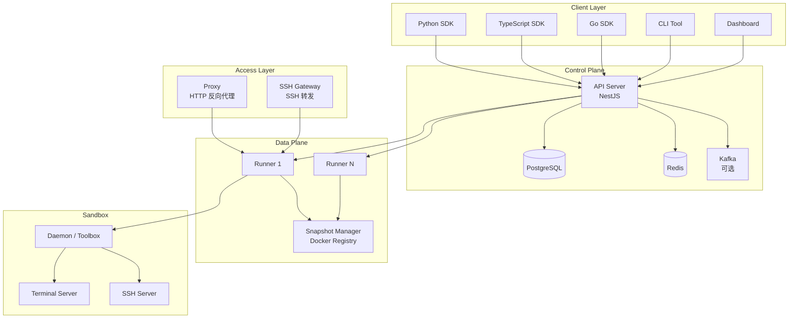
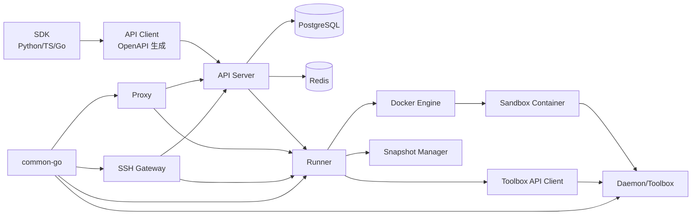
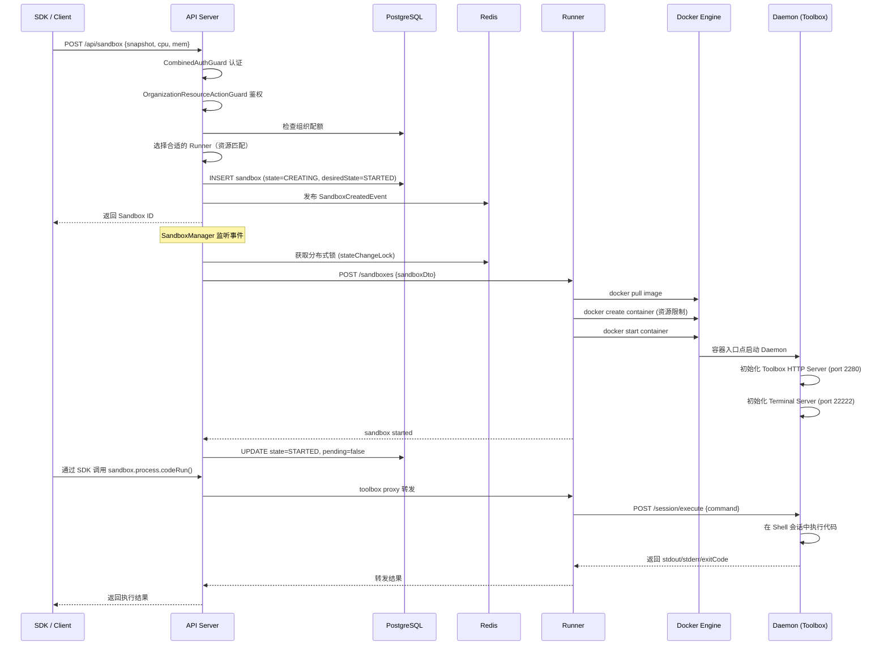
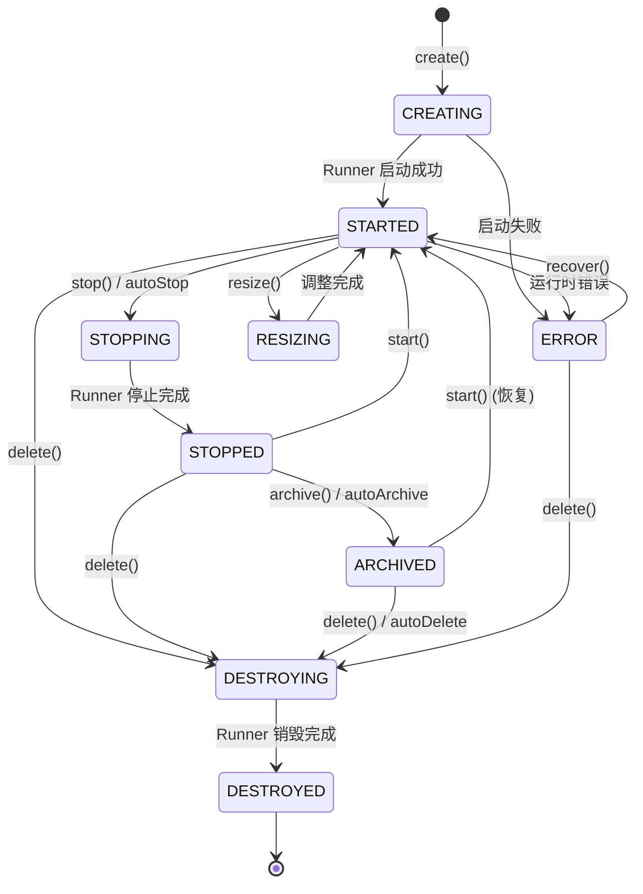

# daytona 源码学习笔记

> 仓库地址：[daytona](https://github.com/daytonaio/daytona)
> 学习日期：2026-03-22

---

> **以下为 AI 源码分析**
>
> ### 一句话概括
>
> Daytona 是一个安全弹性的 Sandbox 基础设施平台，可在亚 90ms 内创建隔离沙箱来安全执行 AI 生成的代码。
>
> ### 要点速览
>
> | 核心模块 | 职责 | 关键文件 |
> |---------|------|---------|
> | API Server | 中央编排引擎，管理沙箱生命周期、认证、多租户 | `apps/api/src/main.ts` |
> | Runner | 沙箱容器的实际管理者，操作 Docker 引擎 | `apps/runner/cmd/runner/main.go` |
> | Daemon (Toolbox) | 运行在沙箱内部，提供文件/Git/进程/LSP API | `apps/daemon/cmd/daemon/main.go` |
> | Proxy | 反向代理，将外部流量路由到沙箱端口 | `apps/proxy/cmd/proxy/main.go` |
> | SSH Gateway | SSH 访问网关，转发 SSH 连接到沙箱 | `apps/ssh-gateway/main.go` |
> | Snapshot Manager | Docker Registry 兼容的快照存储服务 | `apps/snapshot-manager/cmd/main.go` |
> | Dashboard | React 管理界面，可视化管理沙箱和组织 | `apps/dashboard/src/main.tsx` |
> | SDK (Python/TS/Go) | 多语言 SDK，统一封装沙箱操作 API | `libs/sdk-python/`, `libs/sdk-typescript/`, `libs/sdk-go/` |

---

## 项目简介

Daytona 是一个为 AI 代码执行场景设计的 Sandbox 基础设施平台。它解决了 AI 生成代码的安全隔离执行问题——当 AI Agent 需要运行生成的代码时，Daytona 提供完全隔离的容器化沙箱环境，确保零风险执行。平台支持亚 90ms 沙箱创建、无限持久化、OCI/Docker 镜像兼容、以及通过 File/Git/LSP/Execute API 实现完整的编程控制能力。核心价值在于让开发者能安全地将 AI 能力集成到生产流程中，而无需担心代码执行带来的安全风险。

## 技术栈

| 类别 | 技术 |
|------|------|
| 语言 | Go 1.25、TypeScript 5.x、Python 3.x |
| 框架 | NestJS (API)、Gin (Runner/Daemon/Proxy)、React 18 (Dashboard) |
| 构建工具 | Nx (monorepo 管理)、Vite (Dashboard)、Go modules |
| 依赖管理 | Yarn (Node.js)、Go modules、Poetry (Python) |
| 测试框架 | Jest (TypeScript)、Go testing、Pytest |
| 数据库 | PostgreSQL (TypeORM)、Redis (缓存/锁/事件) |
| 容器化 | Docker SDK、Docker Registry (Distribution) |
| 可观测性 | OpenTelemetry、Prometheus |
| 认证 | Passport.js (JWT + API Key)、OIDC/OKTA |
| 消息队列 | Kafka (可选) |

## 目录结构

```
daytona/
├── apps/                          # 应用程序
│   ├── api/                       # API Server (NestJS) - 中央编排引擎
│   │   └── src/
│   │       ├── sandbox/           #   沙箱管理（实体/服务/控制器/管理器）
│   │       ├── organization/      #   组织与多租户
│   │       ├── auth/              #   认证授权 (JWT + API Key)
│   │       ├── region/            #   多区域管理
│   │       ├── user/              #   用户管理
│   │       └── migrations/        #   数据库迁移 (85+)
│   ├── runner/                    # Runner (Go) - Docker 容器生命周期管理
│   │   └── pkg/
│   │       ├── docker/            #   Docker 客户端封装 (90 个文件)
│   │       ├── api/               #   Runner REST API
│   │       └── runner/            #   Runner 单例和轮询器
│   ├── daemon/                    # Daemon (Go) - 沙箱内 Toolbox 服务
│   │   └── pkg/
│   │       ├── toolbox/           #   HTTP API (文件/Git/进程/LSP/Computer Use)
│   │       ├── session/           #   Shell 会话管理
│   │       └── terminal/          #   TTY 终端
│   ├── proxy/                     # Proxy (Go) - 反向代理
│   ├── ssh-gateway/               # SSH Gateway (Go) - SSH 访问
│   ├── snapshot-manager/          # Snapshot Manager (Go) - 镜像仓库
│   ├── dashboard/                 # Dashboard (React) - 管理界面
│   ├── cli/                       # CLI (Go) - 命令行工具
│   ├── docs/                      # Docs (Astro/Starlight) - 文档站点
│   └── otel-collector/            # OTEL Collector - 遥测收集器
├── libs/                          # 共享库
│   ├── sdk-python/                # Python SDK
│   ├── sdk-typescript/            # TypeScript SDK
│   ├── sdk-go/                    # Go SDK
│   ├── sdk-ruby/                  # Ruby SDK
│   ├── api-client*/               # OpenAPI 生成的 API 客户端 (多语言)
│   ├── toolbox-api-client*/       # Toolbox API 客户端 (多语言)
│   ├── common-go/                 # Go 公共库（缓存/日志/遥测）
│   └── computer-use/              # Computer Use 插件
├── docker/                        # Docker Compose 开发环境
├── images/                        # Sandbox 基础镜像 Dockerfile
└── nx.json                        # Nx monorepo 配置
```

## 架构设计

### 整体架构

Daytona 采用分层的微服务架构，以 API Server 为中央编排引擎，通过 Runner 管理物理资源上的 Docker 容器，每个容器内运行 Daemon 提供编程接口。Proxy 和 SSH Gateway 作为接入层，分别处理 HTTP 和 SSH 流量。多语言 SDK 封装了所有 API 交互细节，为开发者提供统一的编程界面。



### 核心模块

#### 1. API Server (`apps/api/`)

API Server 是整个平台的中央编排引擎，基于 NestJS 框架构建。

**核心职责：**
- 沙箱全生命周期管理（创建、启动、停止、存档、销毁）
- 多租户组织隔离和配额管理
- JWT + API Key 双模式认证
- Runner 集群管理和调度
- 快照构建和分发
- 审计日志和使用统计

**关键文件：**
- `src/main.ts` — 应用入口，配置中间件、守卫、拦截器
- `src/sandbox/entities/sandbox.entity.ts` — Sandbox 数据实体，定义状态机
- `src/sandbox/services/sandbox.service.ts` — 核心沙箱业务逻辑
- `src/sandbox/managers/sandbox.manager.ts` — 状态同步编排器，含定时任务
- `src/sandbox/managers/sandbox-actions/` — 独立的操作类（Start/Stop/Destroy/Archive）
- `src/auth/combined-auth.guard.ts` — 多策略认证守卫
- `src/organization/services/organization.service.ts` — 组织和配额管理

**设计模式：**
- **Event-Driven 架构**：使用 `EventEmitter2` 发布领域事件（`SandboxCreatedEvent`、`SandboxStateUpdatedEvent` 等），实现模块解耦
- **Manager + Action 模式**：`SandboxManager` 编排状态转换，具体操作委派给独立的 Action 类
- **Repository 模式**：自定义 `BaseRepository` 扩展 TypeORM，集成 Redis 缓存
- **Guard 链**：`CombinedAuthGuard` → `OrganizationResourceActionGuard` → `SandboxAccessGuard` 多层授权
- **分布式锁**：通过 Redis 实现 `getStateChangeLockKey`，保证并发安全

#### 2. Runner (`apps/runner/`)

Runner 是沙箱容器的实际管理者，用 Go 编写，直接操作 Docker 引擎。

**核心职责：**
- Docker 容器创建、启动、停止、销毁
- 资源监控（CPU/内存/磁盘）
- 快照构建和备份
- 网络隔离规则管理
- Daemon 进程注入和管理

**关键文件：**
- `cmd/runner/main.go` — 入口，初始化 Docker 客户端和监听器
- `pkg/docker/client.go` — Docker SDK 封装，核心容器操作
- `pkg/docker/create.go` — 沙箱创建逻辑（镜像拉取、容器配置、资源限制）
- `pkg/docker/monitor.go` — Docker 事件监听，实时同步容器状态
- `pkg/api/server.go` — Runner HTTP API (Gin)
- `pkg/runner/v2/poller/` — 长轮询模式与 API Server 通信

**关键机制：**
- 启动时将 `daemon` 二进制写入共享路径，通过 bind mount 注入到沙箱容器
- 使用卷级别的 `sync.Mutex` 保证并发安全
- `BackupInfoCache` 和 `SnapshotErrorCache` 使用内存缓存减少 I/O

#### 3. Daemon / Toolbox (`apps/daemon/`)

Daemon 运行在每个沙箱容器内部，是沙箱的"大脑"，提供丰富的编程接口。

**核心职责：**
- HTTP Toolbox API（端口 2280）：文件/Git/进程/LSP/Computer Use
- Shell 会话管理：创建持久 Shell，执行命令并捕获输出
- Terminal 服务（端口 22222）：TTY 交互式终端
- SSH 服务（端口 22）：直接 SSH 访问

**关键文件：**
- `cmd/daemon/main.go` — 入口，并发启动四个服务
- `pkg/toolbox/server.go` — Gin HTTP 服务器，注册所有 API 路由
- `pkg/session/service.go` — 会话服务，管理多个持久 Shell 进程
- `pkg/session/execute.go` — 命令执行核心，支持同步/异步模式
- `pkg/toolbox/fs/` — 文件系统操作（12 个文件）
- `pkg/toolbox/git/` — Git 操作（15 个文件）

#### 4. Proxy (`apps/proxy/`)

反向代理，根据主机名/路径将外部 HTTP/WebSocket 流量路由到对应的沙箱。

**关键文件：**
- `pkg/proxy/proxy.go` — 代理核心逻辑，维护 Runner/Sandbox 缓存
- 常量端口：Terminal=22222，Toolbox=2280，Recording Dashboard=33333

#### 5. SSH Gateway (`apps/ssh-gateway/`)

SSH 接入网关，监听端口 2222，通过 Token 验证后转发 SSH 连接到目标 Runner 上的沙箱。

**工作流程：**
1. 从 SSH 用户名提取 Token
2. 调用 API Server 验证 Token 并获取 Sandbox/Runner 信息
3. 建立到 Runner SSH Gateway（端口 2220）的连接
4. 双向转发数据流
5. 每 45 秒心跳更新沙箱活动状态

#### 6. Snapshot Manager (`apps/snapshot-manager/`)

Docker Registry V2 兼容的快照存储服务，支持 Filesystem 和 S3 两种存储后端。基于 Docker Distribution 库构建。

#### 7. 多语言 SDK (`libs/sdk-*`)

三套 SDK（Python/TypeScript/Go）提供一致的编程接口：

| 子模块 | 功能 |
|--------|------|
| `Daytona` | 主客户端，管理认证和沙箱创建/删除 |
| `Sandbox` | 沙箱实例，聚合下列子服务 |
| `FileSystem` | 文件上传/下载/搜索/权限管理 |
| `Git` | Git clone/commit/push/pull 等操作 |
| `Process` | 命令执行、代码运行、PTY 会话 |
| `CodeInterpreter` | 有状态代码执行环境 |
| `ComputerUse` | 桌面自动化（鼠标/键盘/截图） |
| `LspServer` | Language Server Protocol 支持 |

### 模块依赖关系



## 核心流程

### 流程一：创建并执行代码（Sandbox Creation & Code Execution）

这是 Daytona 最核心的业务流程——从 SDK 调用到代码在隔离沙箱中执行的完整链路。



**关键逻辑说明：**
1. **Runner 选择算法**：API Server 根据 Runner 的 CPU/内存/磁盘使用率和可用资源进行匹配
2. **状态同步**：`SandboxManager` 通过 Event-Driven 模式监听创建事件，使用 Redis 分布式锁避免并发冲突
3. **Daemon 注入**：Runner 在创建容器时将 Daemon 二进制通过 bind mount 注入沙箱
4. **代码执行**：Daemon 维护持久 Shell 会话（`session` 包），命令执行支持同步等待和异步轮询两种模式

### 流程二：沙箱状态机与自动生命周期管理

Daytona 的沙箱具有完整的状态机和自动化生命周期管理能力（自动停止、自动存档、自动删除）。



**自动生命周期管理：**
- `SandboxManager` 每 10 秒执行 `autostopCheck` 定时任务
- 检查 `lastActivityAt` + `autoStopInterval`，超时则自动停止
- 停止后检查 `autoArchiveInterval`，超时则自动存档
- 存档后检查 `autoDeleteInterval`，超时则自动删除
- 支持 `ephemeral` 模式：沙箱停止后立即销毁

## 关键设计亮点

### 1. 双状态机设计（Desired State + Actual State）

**解决的问题：** 分布式环境中状态同步的一致性问题——API Server 发出指令到 Runner 实际执行完成之间存在时间差。

**实现方式：** Sandbox 实体包含两个状态字段：
- `state`：实际状态（CREATING/STARTED/STOPPED/...）
- `desiredState`：期望状态（STARTED/STOPPED/ARCHIVED/DESTROYED）
- `pending: boolean`：标识是否正在转换中

`SandboxManager.syncInstanceState()` 对比两者差异，选择对应的 Action 类执行操作。这种设计类似 Kubernetes 的 Reconciliation Loop。

**关键文件：** `apps/api/src/sandbox/entities/sandbox.entity.ts`、`apps/api/src/sandbox/managers/sandbox.manager.ts`

### 2. 事件驱动的模块解耦

**解决的问题：** 沙箱状态变更需要触发审计日志、使用统计、通知推送等多个副作用，直接调用会导致模块强耦合。

**实现方式：** 使用 NestJS 的 `EventEmitter2` 发布领域事件（`SandboxCreatedEvent`、`SandboxStartedEvent` 等），各模块通过 `@OnEvent()` 装饰器独立订阅处理。审计、计费、通知等横切关注点完全解耦。

**关键文件：** `apps/api/src/sandbox/events/`、`apps/api/src/audit/`

### 3. Daemon 注入模式（Sidecar-like）

**解决的问题：** 如何在任意 OCI 镜像的沙箱中提供统一的编程接口（文件/Git/进程/LSP），同时不侵入用户镜像。

**实现方式：** Runner 在创建容器时将预编译的 `daemon` 二进制通过 Docker bind mount 注入沙箱文件系统。容器的入口点启动 Daemon 进程，Daemon 在沙箱内启动 HTTP 服务（port 2280）和 Terminal 服务（port 22222），对外暴露标准化的 Toolbox API。这类似 Kubernetes Sidecar 模式，但更轻量——只是一个静态二进制。

**关键文件：** `apps/runner/cmd/runner/main.go`（二进制写入）、`apps/daemon/cmd/daemon/main.go`（服务启动）

### 4. 多层认证与细粒度权限模型

**解决的问题：** 平台需要同时支持人类用户（Web/CLI 登录）和程序化访问（SDK），且需要组织级别的资源隔离。

**实现方式：**
- **认证层**：`CombinedAuthGuard` 同时尝试 JWT（OIDC）和 API Key 两种策略，通过 `Passport.js` 实现
- **授权层**：三级守卫链——认证 → 组织权限 → 资源访问
- **API Key 权限**：支持细粒度的 `OrganizationResourcePermission`（`SANDBOX_READ`、`SANDBOX_WRITE`、`VOLUME_WRITE` 等）
- **缓存优化**：API Key 验证结果缓存在 Redis，避免每次请求查库

**关键文件：** `apps/api/src/auth/combined-auth.guard.ts`、`apps/api/src/auth/api-key.strategy.ts`

### 5. 统一的多语言 SDK 体验

**解决的问题：** 需要为 Python/TypeScript/Go/Ruby 开发者提供一致的沙箱操作体验，同时最小化维护成本。

**实现方式：**
- API Server 和 Daemon 均导出 OpenAPI Spec
- 使用 OpenAPI Generator 自动生成各语言的低层 API Client（`libs/api-client-*`、`libs/toolbox-api-client-*`）
- 手写高层 SDK 封装生成的客户端，提供 `Daytona` → `Sandbox` → `FileSystem/Git/Process` 的统一对象模型
- 每套 SDK 同时支持同步和异步 API（Python: `Daytona` + `AsyncDaytona`，TypeScript: 原生 `async/await`）

**关键文件：** `libs/sdk-python/src/daytona/_sync/daytona.py`、`libs/sdk-typescript/src/Daytona.ts`、`libs/sdk-go/pkg/daytona/client.go`
