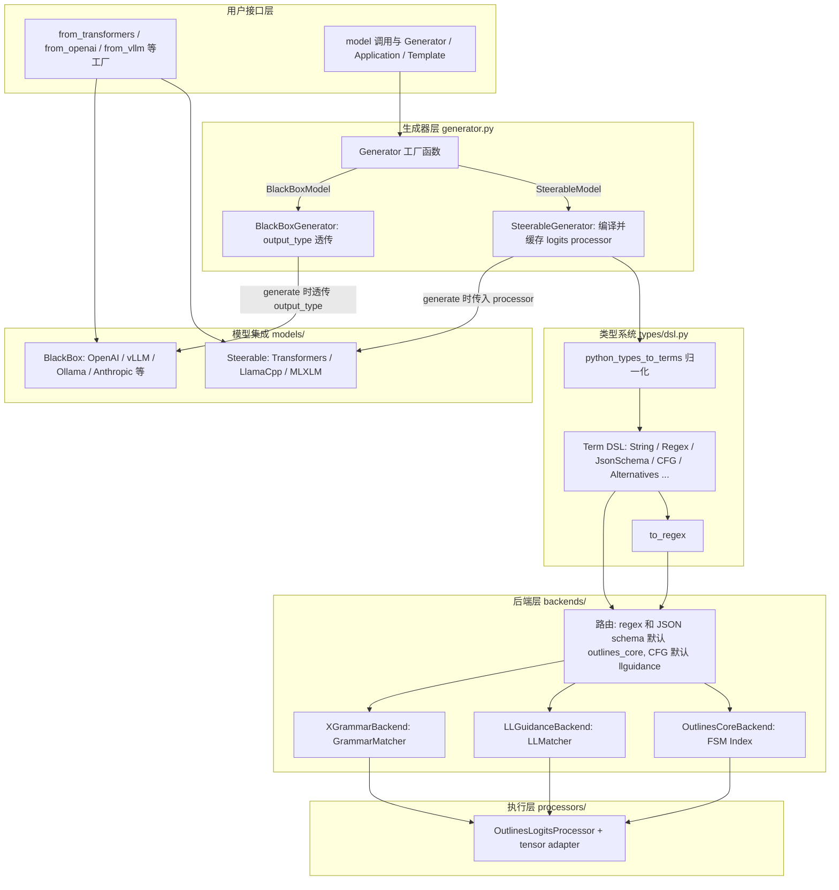
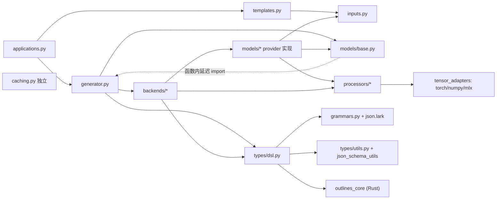
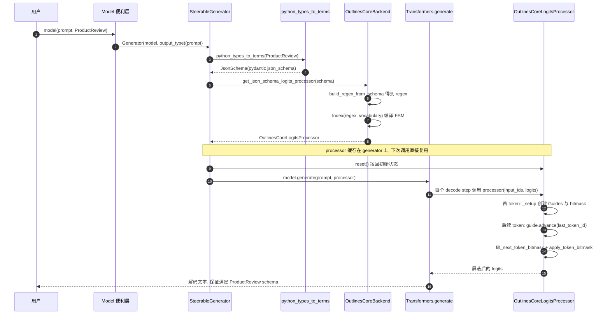
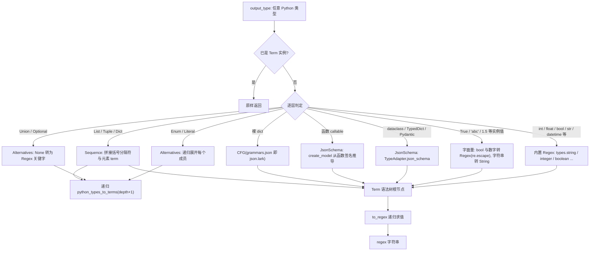

# outlines 源码学习笔记

> 仓库地址：[dottxt-ai/outlines](https://github.com/dottxt-ai/outlines)
> 学习日期：2026-09-30（分析基线：commit `c52af84`，2026-08-24，v1.x 主线）

---

> **以下为 AI 源码分析**
>
> ### 一句话概括
>
> outlines 是 LLM 结构化生成（structured generation）库：把 Python 类型 / Pydantic 模型 / 正则 / CFG 统一编译成 token 级约束（logits processor 或 API `response_format`），在生成过程中直接屏蔽非法 token，而不是生成后再解析修补。
>
> ### 要点速览
>
> | 模块 | 职责 | 关键文件 |
> |------|------|----------|
> | `generator.py` | `Generator` 工厂，按模型类型分派约束策略 | `src/outlines/generator.py` |
> | `types/` | 输出类型 DSL：Python 类型 → `Term` 语法树 → regex / JsonSchema / CFG | `src/outlines/types/dsl.py`、`types/__init__.py` |
> | `backends/` | 约束编译器路由：outlines_core（默认）/ xgrammar / llguidance | `src/outlines/backends/` |
> | `processors/` | logits processor 基类 + tensor adapter（torch/numpy/mlx 抹平） | `src/outlines/processors/base_logits_processor.py` |
> | `models/` | 17 个 provider 集成，分 Steerable（本地可控采样）与 BlackBox（API 透传）两类 | `src/outlines/models/` |
> | `templates.py` | Jinja2 prompt 模板（含 vision few-shot 支持） | `src/outlines/templates.py` |
> | `applications.py` | Template + output_type 封装成可复用 `Application` | `src/outlines/applications.py` |
> | `caching.py` | diskcache + cloudpickle 磁盘缓存（v1 内部已不使用，仅公共导出） | `src/outlines/caching.py` |

---

## 项目简介

LLM 的输出天然不可预测，业界多数方案是"生成后补救"——用 parser、regex、重试循环去修复坏输出。outlines 反其道而行：**在生成时约束**。用户只需声明输出类型（`Literal["Yes", "No"]`、`int`、Pydantic model、正则、CFG），outlines 保证每个生成的 token 都落在该类型的语言里，输出 100% 结构合法，无需解析和重试。

核心价值来自一条清晰的编译链：**Python 类型 → `Term` 统一中间表示 → regex / JSON schema / CFG → FSM 或 grammar matcher → token bitmask → 每步采样前屏蔽非法 logits**。对本地模型（transformers / llama.cpp / MLX）它亲自介入采样循环；对 API 模型（OpenAI / vLLM / Ollama 等）它把类型翻译成 provider 的结构化输出参数（如 `response_format`）。两条路径共享同一用户接口 `model(prompt, output_type)`。

项目由 dottxt（.txt）公司维护，NVIDIA、vLLM、HuggingFace 等在生产中使用；底层 FSM 编译已抽出为独立 Rust 包 `outlines_core`。学术出处：Willard & Louf, *Efficient Guided Generation for Large Language Models*（arXiv:2307.09702）。

## 技术栈

| 类别 | 技术 |
|------|------|
| 语言 | Python（>=3.10, <3.14），`src/` 布局，py.typed 全量类型标注 |
| 核心依赖 | `outlines_core==0.2.14`（Rust FSM 引擎）、`pydantic>=2`、`jinja2`、`jsonschema`、`genson`、`diskcache`、`cloudpickle`、`pillow` |
| 可选约束引擎 | `xgrammar`、`llguidance`（均为 extras） |
| 框架 | 无重框架——纯库设计，每个 provider 用 optional-dependency 轻量集成 |
| 构建工具 | setuptools + setuptools_scm（版本从 git tag 生成，写入 `src/outlines/_version.py`） |
| 依赖管理 | uv（`uv.lock`）+ pyproject extras；另有 nix flake / environment.yml 供开发环境 |
| 测试框架 | pytest + pytest-asyncio + pytest-mock + coverage + diff-cover（分支对比覆盖率） |
| 质量工具 | ruff（lint）、mypy、pre-commit、docformatter（numpy 风格 docstring） |
| 文档 | mkdocs（`docs/` + `mkdocs.yml`），API 文档由 mkdocs_gen_files 生成 |

## 目录结构

```text
outlines/
├── src/outlines/            # 主包（src 布局）
│   ├── __init__.py          # 公共 API 面：re-export Generator/Template/from_* 等
│   ├── generator.py         # Generator 工厂 + 三种 Generator 实现
│   ├── applications.py      # Application：Template + output_type 封装
│   ├── templates.py         # Template：Jinja2 模板 + Vision（deprecated）
│   ├── inputs.py            # Chat / Image / Video / Audio 输入类型
│   ├── caching.py           # diskcache 缓存工具
│   ├── exceptions.py        # provider 错误归一化
│   ├── grammars.py          # 内置 Lark 语法（json.lark / arithmetic.lark）
│   ├── types/               # 输出类型 DSL
│   │   ├── dsl.py           # Term 家族 + python_types_to_terms + to_regex
│   │   ├── utils.py         # 类型判定谓词 + 函数签名转 JSON schema
│   │   ├── json_schema_utils.py  # schema 反向生成 pydantic/TypedDict/dataclass
│   │   └── locale/          # 国家/机场等 locale 类型（optional extras）
│   ├── backends/            # 约束编译后端
│   │   ├── base.py          # BaseBackend 抽象（三种 get_*_logits_processor）
│   │   ├── outlines_core.py # 默认后端：regex → FSM Index + Guide
│   │   ├── xgrammar.py      # XGrammar 引擎适配
│   │   └── llguidance.py    # LLGuidance 引擎适配（CFG 默认）
│   ├── processors/          # 约束执行层
│   │   ├── base_logits_processor.py  # OutlinesLogitsProcessor 基类
│   │   └── tensor_adapters/ # torch / numpy / mlx 张量操作适配器
│   └── models/              # 17 个 provider 集成
│       ├── base.py          # Model/AsyncModel ABC + ModelTypeAdapter
│       ├── transformers.py  # 本地模型代表（含多模态）
│       ├── llamacpp.py / mlxlm.py     # 其余 Steerable 模型
│       ├── openai.py / vllm.py / ollama.py / anthropic.py ...  # BlackBox 模型
│       └── tokenizer.py     # Tokenizer 抽象
├── tests/                   # pytest 测试（按模块镜像 src 结构）
├── docs/                    # mkdocs 文档源
├── examples/                # 各 provider 使用示例
└── scripts/                 # release 脚本
```

## 架构设计

### 整体架构

outlines 是一个**五层单向管道**：用户在顶层用一行 `model(prompt, output_type)` 表达意图，类型系统把它归一化为统一的 `Term`，后端把 `Term` 编译成"可执行约束"（FSM Index / grammar matcher），执行层在采样循环里逐 token 施加约束，模型集成层负责把这一切接到 17 种推理引擎上。设计哲学是 v1 release note 里明说的 unix 式信条——**每个组件只做一件事，组合胜于耦合**（重活下放给 `outlines_core` 等 Rust 引擎和推理库本身）。

最关键的一次分叉发生在 `Generator` 工厂：模型分两类，约束策略完全不同。

- **SteerableModel**（Transformers / LlamaCpp / MLXLM）：本地推理，能介入采样循环 → output_type 被编译成 **logits processor**，由 `SteerableGenerator` 持有并复用；
- **BlackBoxModel**（OpenAI / vLLM / Ollama / Anthropic / Gemini / SGLang / TGI / LMStudio / Mistral / Dottxt）：无法介入采样 → output_type 被 `ModelTypeAdapter.format_output_type` 翻译成 provider 原生参数（OpenAI 的 `response_format`、vLLM 的 `structured_outputs`），约束发生在服务端。



约束施加的通用形态是 **token bitmask**：FSM/guide/matcher 计算出当前状态下合法 token 集合，写入一个 uint32 位掩码，再按位与到 logits 上（把非法位置设为 `-inf`）。这一步与张量库无关，靠 `tensor_adapters` 抹平 torch / numpy / mlx 差异。

### 核心模块

**1. `generator.py` —— 分派中枢（~400 行）**

- `Generator()`（generator.py:347）是唯一入口函数而非类：校验 `output_type` 与 `processor` 互斥后，按 `isinstance(model, SteerableModel / AsyncBlackBoxModel / BlackBoxModel)` 返回三种实现之一。
- `SteerableGenerator.__init__`（generator.py:216-258）是整个库的编译核心，三分支：`CFG` → `get_cfg_logits_processor`；`JsonSchema` → `get_json_schema_logits_processor`（带 `whitespace_pattern`）；其余 Term → `to_regex` 后走 `get_regex_logits_processor`。编译结果存在 `self.logits_processor` 上，**昂贵计算只做一次**。
- `from_processor`（generator.py:260）用 `cls.__new__` 绕过 `__init__`，让高级用户直接注入现成 processor。
- 每次调用前 `self.logits_processor.reset()`（generator.py:297）把 FSM/matcher 状态拨回初始——processor 因此可跨请求复用，这是与"processor 一次性"设计（见 base_logits_processor.py:66 注释）的显式契约。

**2. `types/dsl.py` —— 类型系统心脏（~1000 行）**

- `Term` 基类（dsl.py:82）重载 `__add__`/`__or__` 等运算符，让约束可以用 `"id: " + digits | letters` 直写；同时实现 `__get_pydantic_core_schema__` / `__get_pydantic_json_schema__`（dsl.py:134-142），因此 **Term 本身可当 Pydantic 字段类型用**，schema 里呈现为 `{"type": "string", "pattern": ...}`。
- 三大顶层 Term：`Regex`（pattern）、`CFG`（grammar 字符串）、`JsonSchema`（接受 dict/str/Pydantic/TypedDict/dataclass/genson 五种输入，构造时用 `jsonschema.Draft7Validator.check_schema` 校验，dsl.py:334）。
- `python_types_to_terms`（dsl.py:730）是 Python 世界到 DSL 的唯一桥：基本类型映射到 `types/__init__.py` 预定义的 Regex；`dataclass/TypedDict/Pydantic` 经 `TypeAdapter.json_schema()` 变 `JsonSchema`；callable 经 `get_schema_from_signature`（types/utils.py:190，用 `pydantic.create_model` 从签名造 schema，这就是 function calling 的实现）；`Enum/Literal/Union/List/Dict/Tuple` 递归展开成 `Alternatives/Sequence` 组合，带 `recursion_depth > 10` 防御（dsl.py:746）。
- `to_regex`（dsl.py:978）对 Term 树做模式匹配式的递归求值，每类节点一个分支——一个教科书级的 visitor 实现。

**3. `backends/` —— 约束编译器路由（每个 ~300 行）**

- `backends/__init__.py:27-29` 定义默认路由：`CFG_DEFAULT_BACKEND = "llguidance"`，`JSON_SCHEMA_DEFAULT_BACKEND = "outlines_core"`，`REGEX_DEFAULT_BACKEND = "outlines_core"`；`_get_backend`（:32）按名字分发。
- `OutlinesCoreBackend.__init__`（outlines_core.py:179）在构造时就把模型词表加工成 `outlines_core.Vocabulary`：`create_outlines_core_vocabulary`（:258-294）对每个 token 做 `token_to_str` 转换（special token 要还原成字符串形态，尤其空格）、同字符串多 id 聚合成列表、**剔除 EOS 对应字符串**。FSM 只认字符串，所以这步是 regex 语义和 tokenizer 语义对齐的关键。
- JSON schema 在这个后端里**先转 regex 再转 FSM**（:233 `build_regex_from_schema` → `Index(regex, vocabulary)`）——schema、regex 最终汇入同一条 FSM 路径。
- `llguidance.py:303-307` 体现兼容性技巧：CFG 先按 EBNF 解析，失败再退回 Lark 格式；JSON schema 和 regex 则用 `llg.grammar_from` 统一转 grammar spec。xgrammar 后端与之同构（`TokenizerInfo.from_huggingface` + `GrammarCompiler` + `GrammarMatcher`）。

**4. `processors/` —— 约束执行层**

- `OutlinesLogitsProcessor.__call__`（base_logits_processor.py:85-137）是**形状归一化网关**：不同模型传来的 input_ids/logits 维度不一（mlx-lm 的 1D、transformers 的 2D），统一 lift 成 2D 交给抽象方法 `process_logits`，处理完再 squeeze 回原形。构造函数里还有一个临时 workaround：`torch._dynamo.config.suppress_errors = True`（:36-39，规避 Python 3.12 下 torch 编译告警升级为错误）。
- `OutlinesCoreLogitsProcessor`（outlines_core.py:19）的关键设计是**首 token 延迟初始化**：`_setup`（:42）推迟到第一次 `process_logits` 才执行，因为此时才能从 logits 读出 batch_size、vocab_size 和 device；为 batch 里每行序列创建独立 `Guide`（FSM 状态机）和 bitmask。非首 token 时先 `guide.advance(last_token_id)` 推进状态再施加掩码，其中 `is_finished() or accepts_tokens` 的判断（:168）是针对 outlines_core issue #227（终态接受 EOS 导致自环）的防御。
- torch 路径的 bitmask 有一次 device 往返（:113-120）：fill 在 CPU、apply 前 `to_device` 到 logits 所在设备、用完再搬回——避免每步重复 H2D 分配。

**5. `models/` —— 17 个 provider 的统一外壳**

- `models/base.py` 定义 `Model`/`AsyncModel` ABC（:62/:307）：`__call__`/`batch`/`stream` 是**便利层**，内部临时构造 Generator 再转发（`model("prompt", Foo)` 等价于 `Generator(model, Foo)("prompt")`）；`generate/generate_batch/generate_stream` 是子类必须实现的**内核层**，接收的 `output_type` 对 Steerable 是 logits processor、对 BlackBox 是原始类型——同一个参数名，两种语义（docstring 明说）。
- 每个 provider 一个 `ModelTypeAdapter`，`format_input` 用 `functools.singledispatchmethod` 按运行时类型分派（transformers.py:114，openai.py:45）：str、Chat、带 Image 的 list 各自一个注册分支，未注册类型抛 TypeError。`format_output_type` 则是 provider 差异的集中地——transformers 包成 `LogitsProcessorList`（transformers.py:165-168），OpenAI 组装 `response_format`（openai.py:184-201，强制 `set_additional_properties_false_json_schema`、`strict: True`，并显式拒绝 Regex/CFG），vLLM 组装 `structured_outputs`（vllm.py:42-67，要求 vLLM server >= 0.12，旧 server 会静默忽略导致无约束输出）。
- `TransformerTokenizer`（transformers.py:31）处理两个易错细节：`padding_side = "left"`（:215，生成任务必须左填充）；`convert_token_to_string`（:63-69）对 SentencePiece 的 `SPIECE_UNDERLINE`（`▁`）和 `<0x20>` 补前导空格——token 字符串与 FSM 字符串对不齐时约束会系统性失效。

### 模块依赖关系



两条值得注意的依赖处理：`models/base.py:120` 在 `__call__` 函数体内才 `from outlines.generator import Generator`（虚线），因为 generator.py 顶层已经 import models，模块级再反向 import 会成环——延迟 import 是这个库解开双向依赖的标准手法。`caching.py` 则完全独立，v1 的源码里没有任何内部调用 `@cache` 装饰器（仅顶层 re-export），重编译缓存职责已转移到 `outlines_core` / xgrammar / llguidance 引擎内部。

## 核心流程

### 流程一：本地模型结构化生成全链路

场景：`outlines.from_transformers(...)` 得到 model 后调用 `model(prompt, ProductReview)`，`ProductReview` 是 Pydantic 模型。这是 outlines 最核心的路径——约束从声明到逐 token 生效的完整旅程。



关键逻辑逐步展开：

1. **便利层转发**（models/base.py:120-122）：`Model.__call__` 函数内 import `Generator` 并立即调用。注意 `SteerableGenerator` 的构造（编译 FSM）发生在 `Generator(model, output_type)` 这一步，与 prompt 无关——所以 `Generator(model, Foo)` 应当被复用（文档明示"构建 processor 可能相当昂贵"），而不是每次生成重建。
2. **类型归一化**（dsl.py:792-794）：`is_pydantic_model(ProductReview)` 命中 → `TypeAdapter(ptype).json_schema()` → `JsonSchema` term。
3. **编译**：`get_json_schema_logits_processor`（backends/__init__.py:58）→ 默认 `OutlinesCoreBackend` → `build_regex_from_schema`（outlines_core 包的 Rust 实现，把 JSON schema 翻译成正则）→ 与 `Index(regex, self.vocabulary)` 一起构建 FSM 索引。**JSON schema 和 regex 最终汇入同一条编译路径**，这是理解 outlines 后端的关键——schema 只是 regex 的语法糖。
4. **执行**（outlines_core.py:140-173）：transformers 的 `generate` 在每个采样步调用 `LogitsProcessorList` 里的 processor。`__call__` 先把形状归一成 2D（base_logits_processor.py:85），`process_logits` 里首 token 触发 `_setup`（按 batch 行数建 Guide + bitmask），之后每步先 `advance` 消费上一 token，再 `fill_next_token_bitmask` 写合法集合并 `apply_token_bitmask_inplace` 屏蔽。
5. **收尾**：`_generate_output_seq`（transformers.py:359-373）区分 encoder-decoder（返回 output_ids）与 decoder-only（切片掉 prompt 部分），`_decode_generation` 按 1D/2D/3D 形状批量解码返回。

### 流程二：Python 类型归一化（python_types_to_terms → to_regex）

用户给什么类型都行——这个"什么都行"正是由 `python_types_to_terms`（dsl.py:730）的判定瀑布实现。它是 outlines 对 Python typing 体系的一次完整反射式扫描：



两个容易被忽略但很能体现工程功底的细节：

- **JSON 引号修补 `_ensure_json_quoted`**（dsl.py:868-886）：`List[Literal["a", "b"]]` 的成员是 `String("a")`，但放进 JSON 容器里必须是 `"a"`（带引号）；同理 `Dict[int, str]` 的 key 按 JSON 规范永远必须是字符串。这个函数在容器展开时对子 term 补引号，且区分 `String`（直接加引号）与裸 `Regex`（包成 Sequence 加引号），保证生成的正则匹配合法 JSON。
- **None 语义**（dsl.py:889-905）：`Optional[Union[int, str]]` 的 `None` 分支被翻译成 `Regex("None")`——生成 Python 字面量风格的关键字而非 `null`。同样 `types.boolean` 是 `(True|False)` 而非 JSON 的 `true/false`（types/__init__.py:108）。**outlines 的类型语义优先对齐 Python repr 而不是严格 JSON**，这解释了为什么 Pydantic 路径（走 JsonSchema→JSON schema）与裸类型路径（走 DSL→regex）的输出风格不同。

`to_regex`（dsl.py:978-1027）则是纯粹的树求值：`String` 做 `re.escape`、`Regex`/`JsonSchema` 包一层括号、`Alternatives` 用 `|` 连接、`Sequence` 直接拼接、`Quantify*` 系列映射到 `{n}`/`{n,}`/`{,m}`/`{n,m}`。整个函数没有任何状态，就是一个无副作用 visitor。

## 关键设计亮点

**1. Term DSL：运算符重载 + Pydantic 协议双栖（dsl.py:82-207）**

`Term` 重载 `__add__`（拼接）/`__or__`（选择）等运算符，正则从"字符串DSL"升级为"语法树 AST"——可以 `display_ascii_tree` 可视化、可以递归求值、可以类型检查。更妙的是 Term 同时实现 Pydantic 的 `__get_pydantic_core_schema__`/`__get_pydantic_json_schema__` hook，于是 `class User(BaseModel): age: Regex("[0-9]+")` 直接合法，字段约束与模型约束用同一套 DSL 表达。**一个抽象吃下两套类型系统**。

**2. Steerable/BlackBox 双轨 + Generator 工厂（generator.py:347-407）**

"能否介入采样循环"是约束策略的天然分界线，outlines 把它建模为两个模型 Union（models/__init__.py:32-55）而不是继承体系。`Generator()` 工厂按 isinstance 三分派，用户完全无感：`model(prompt, output_type)` 在本地模型上意味着"编译 logits processor 并注入采样循环"，在 OpenAI 上意味着"翻译成 response_format 发给服务端"。**接口统一而机制分化**，这比强行用抽象基类统一两种模型更诚实。

**3. 约束编译与执行解耦：延迟初始化 + reset 复用 + bitmask 跨张量库**

- 编译（贵，一次性）与执行（每 token 一次）分离在 `SteerableGenerator` 与 `OutlinesCoreLogitsProcessor` 两处；`reset()`（generator.py:297 每次调用前执行）让一个 FSM 实例服务整个进程生命周期。
- `_setup` 推迟到首 token（outlines_core.py:42）：batch_size、vocab_size、device 只有看到真实 logits 才知道——放弃构造期完备性，换取零配置适配。
- bitmask 协议（fill → apply）由 outlines_core / llguidance / xgrammar 三家引擎共享，`tensor_adapters` 字典（processors/tensor_adapters/__init__.py:9）把 torch/numpy/mlx 的 shape/unsqueeze/to_device 抹成统一方法，**同一份 processor 代码跑三种张量库**。

**4. 词表对齐的防御性工程（outlines_core.py:258-294 + transformers.py:63-69）**

FSM 在字符串空间运行，而采样在 token id 空间运行，两者靠 `Vocabulary` 桥接。这里有三个若不处理就系统性失效的坑：special token 的字符串形态（尤其空格）；SentencePiece 的 `▁` 前导空格（SPIECE_UNDERLINE 特判）；EOS 从字符串词表中剔除（终态由 FSM 自己判定）。这类"语义接缝工程"占了这个库相当比例的复杂度，也最值得读源码的人关注——**跨层系统的大部分 bug 不在算法里，在接缝里**。

**5. ModelTypeAdapter + singledispatchmethod：provider 差异的集中收纳（openai.py:36-209）**

17 个 provider 的差异被收敛进两个方法：`format_input`（输入怎么变 messages/prompt）和 `format_output_type`（输出约束怎么变 provider 参数）。`functools.singledispatchmethod` 按运行时类型注册分支，比 if-elif 链可扩展且每个分支独立可测。OpenAI 适配器里 `set_additional_properties_false_json_schema` + `strict: True` 的强制处理、以及"vLLM 旧版本会静默忽略 structured_outputs"的注释（vllm.py:59-62），都是把 provider 怪癖显式写进代码的范例——**集成层的知识必须留在代码里，不能只留在人脑里**。

**6. 诚实的演进治理（release_note.md + pyproject.toml）**

v1 是一次大规模收缩：模型加载函数从"outlines 内部管理一切"改为 `from_*` 工厂接收用户自建的 client/engine；jax/tensorflow 支持弃用并给出迁移文档；旧接口保留 DeprecationWarning 过渡到 1.1.0。配套工程同样克制——coverage omit 排除需要 GPU/API 的文件、vllm 因与 outlines-core 循环依赖被排除出 lockfile 并注释说明、`@cache` 从内部使用退化为纯公共导出。**每一处删减都留下了可追溯的理由**。

## 未深入分析的部分

- `models/` 中其余 provider 的实现细节（llamacpp 的逐 token 循环、vllm_offline 与在线模式的差异、mlxlm 的 Apple Silicon 路径、gemini/anthropic/mistral 等 API 封装）——模式与 transformers.py / openai.py 同构，本文只精读了两个代表。
- `backends/xgrammar.py` 的完整错误处理与 `backends` 三引擎的能力矩阵差异（如 llguidance 不支持 `whitespace_pattern`）。
- `types/locale/`（国家、机场等 locale 约束）与 `types/json_schema_utils.py`（JSON schema 反向生成 pydantic/TypedDict/dataclass，供 `JsonSchema.convert_to` 使用）。
- `exceptions.py` 的 provider 错误归一化（`normalize_provider_errors`）、`tests/` 的测试策略细节。
- `outlines_core` Rust 包本身（FSM 构建算法、interegg 的索引结构）——这是另一个仓库 dottxt-ai/outlines-core。
