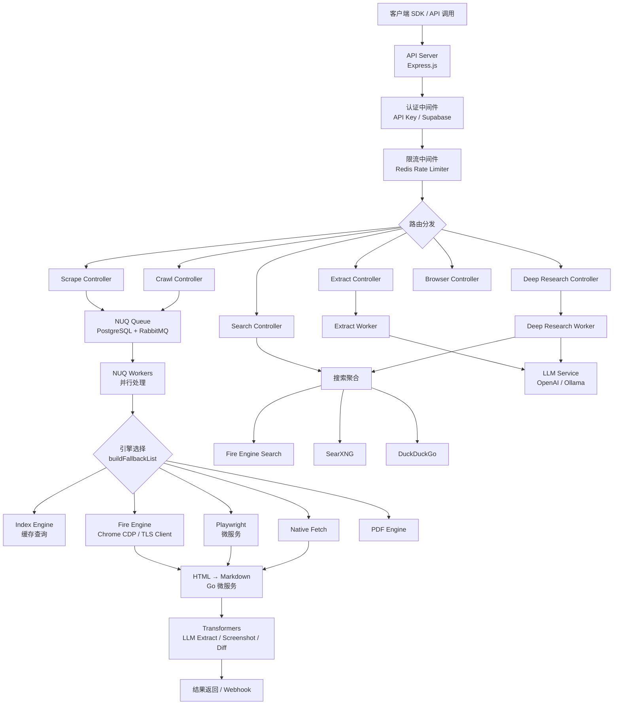
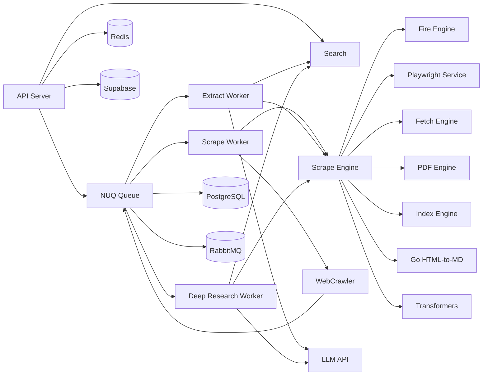
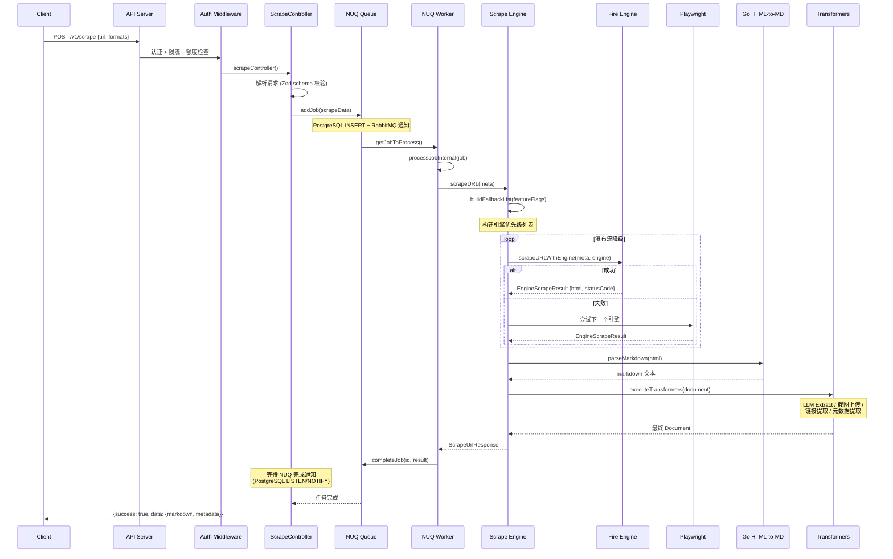
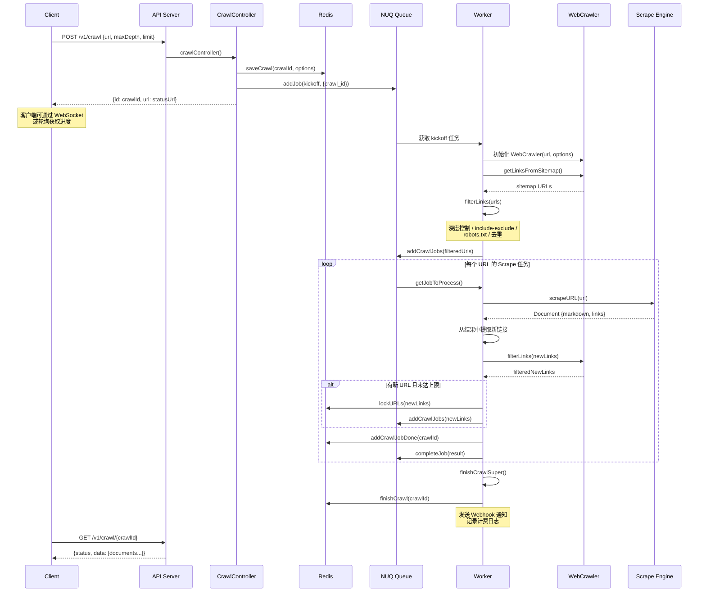

# firecrawl 源码学习笔记

> 仓库地址：[firecrawl](https://github.com/firecrawl/firecrawl)
> 学习日期：2026-03-22

---

> **以下为 AI 源码分析**
>
> ### 一句话概括
>
> Firecrawl 是一个将任意网站转换为 LLM 可消费数据（Markdown / JSON / 截图等）的 API 服务，支持爬取、搜索、结构化提取和深度研究。
>
> ### 要点速览
>
> | 核心模块 | 职责 | 关键文件 |
> |---------|------|---------|
> | API Server | Express REST API，路由注册与请求分发 | `apps/api/src/index.ts` |
> | Scrape Engine | 多引擎瀑布流爬取，HTML→Markdown 转换 | `apps/api/src/scraper/scrapeURL/` |
> | NUQ Queue | 自研 PostgreSQL+RabbitMQ 任务队列 | `apps/api/src/services/worker/nuq.ts` |
> | WebCrawler | URL 发现、robots.txt 解析、深度控制 | `apps/api/src/scraper/WebScraper/crawler.ts` |
> | Extract | LLM 驱动的结构化数据提取 | `apps/api/src/lib/extract/` |
> | Deep Research | 多轮 LLM 搜索→分析→总结循环 | `apps/api/src/lib/deep-research/` |
> | Search | 多搜索引擎聚合（Fire Engine / SearXNG / DDG） | `apps/api/src/search/` |
> | Playwright Service | 远程浏览器渲染微服务 | `apps/playwright-service-ts/` |
> | Go HTML-to-MD | Go 实现的 HTML→Markdown 转换服务 | `apps/go-html-to-md-service/` |
> | SDK | Python / JS / Java / Rust 多语言客户端 | `apps/python-sdk/` `apps/js-sdk/` 等 |

---

## 项目简介

Firecrawl 是一个开源的网页数据采集 API，核心解决"如何把互联网上的网页内容转换为大语言模型可直接使用的结构化数据"这个问题。它通过多种爬取引擎（Fire Engine、Playwright、原生 fetch 等）组成的瀑布流降级策略，处理 JavaScript 渲染、反爬机制、代理轮换、PDF/DOCX 解析等复杂场景，最终输出干净的 Markdown、结构化 JSON、截图或 HTML。在此基础上，还提供批量爬取（Crawl）、网页搜索（Search）、LLM 结构化提取（Extract）、深度研究（Deep Research）和浏览器自动化（Browse）等高级能力。

## 技术栈

| 类别 | 技术 |
|------|------|
| 语言 | TypeScript (API 核心)、Go (HTML-to-MD)、Python / JS / Java / Rust (SDK) |
| 框架 | Express.js + express-ws (API)、Playwright (浏览器自动化) |
| 构建工具 | tsc / tsx (TypeScript)、Go build、Docker / Docker Compose |
| 依赖管理 | pnpm (Node.js)、go mod (Go)、pip / pyproject.toml (Python) |
| 测试框架 | Jest (API E2E + 单元测试)、Go test |
| 数据存储 | Redis (缓存/限流)、PostgreSQL (NUQ 队列持久化)、Supabase (认证/日志) |
| 消息队列 | NUQ (自研，基于 PostgreSQL LISTEN/NOTIFY + RabbitMQ)、BullMQ (遗留) |

## 目录结构

```
firecrawl/
├── apps/                          # 主要应用和服务
│   ├── api/                       # 核心 API 服务（TypeScript）
│   │   ├── src/
│   │   │   ├── index.ts           # Express 服务入口
│   │   │   ├── harness.ts         # 开发/生产环境编排器
│   │   │   ├── config.ts          # 全局配置
│   │   │   ├── controllers/       # 路由控制器（v0/v1/v2）
│   │   │   ├── routes/            # 路由定义
│   │   │   ├── scraper/           # 爬取引擎核心
│   │   │   │   ├── scrapeURL/     # 单页爬取（引擎选择、转换、后处理）
│   │   │   │   └── WebScraper/    # 爬虫逻辑（URL发现、深度控制）
│   │   │   ├── search/            # 搜索聚合（Fire Engine/SearXNG/DDG）
│   │   │   ├── services/          # 基础设施服务
│   │   │   │   ├── worker/        # NUQ Worker 系统
│   │   │   │   ├── billing/       # 计费
│   │   │   │   ├── webhook/       # Webhook 通知
│   │   │   │   └── indexing/      # 索引服务
│   │   │   ├── lib/               # 公共库
│   │   │   │   ├── extract/       # LLM 结构化提取
│   │   │   │   ├── deep-research/ # 深度研究
│   │   │   │   └── generate-llmstxt/ # llms.txt 生成
│   │   │   └── main/              # 爬取 Pipeline 入口
│   │   └── Dockerfile
│   ├── go-html-to-md-service/     # Go HTML→Markdown 转换微服务
│   ├── playwright-service-ts/     # Playwright 浏览器渲染微服务
│   ├── python-sdk/                # Python SDK（firecrawl-py）
│   ├── js-sdk/                    # JavaScript/TypeScript SDK
│   ├── java-sdk/                  # Java SDK
│   ├── rust-sdk/                  # Rust SDK
│   ├── nuq-postgres/              # NUQ 专用 PostgreSQL Docker 镜像
│   ├── redis/                     # Redis Docker 配置
│   ├── test-suite/                # 集成测试套件
│   └── test-site/                 # 测试用静态站点（Astro）
├── examples/                      # 各种 AI 模型集成示例
├── docker-compose.yaml            # 一键部署编排
└── CONTRIBUTING.md                # 贡献指南
```

## 架构设计

### 整体架构

Firecrawl 采用**微服务 + 异步任务队列**架构。API Server 负责接收请求和参数校验，通过 NUQ 队列将爬取任务分发给 Worker 集群。每个 Worker 使用多引擎瀑布流策略执行爬取，支持从缓存索引到 Fire Engine（Chrome CDP）再到 Playwright 和原生 fetch 的多级降级。爬取结果经过 HTML→Markdown 转换、LLM 提取等后处理管线，最终返回给调用方。



### 核心模块

#### 1. Scrape Engine（单页爬取引擎）

**职责**：将单个 URL 转换为 Markdown / HTML / 截图 / JSON 等格式。

**核心文件**：
- `apps/api/src/scraper/scrapeURL/index.ts` — `scrapeURL()` 主入口
- `apps/api/src/scraper/scrapeURL/engines/index.ts` — 引擎注册和选择逻辑

**关键接口/函数**：
- `scrapeURL(meta)` — 主爬取函数，协调引擎选择、执行、转换全流程
- `buildFallbackList(meta)` — 根据请求 FeatureFlag 构建引擎优先级列表
- `scrapeURLWithEngine(meta, engine)` — 执行单个引擎的爬取
- `executeTransformers(meta, document)` — 后处理管线（LLM 提取、截图上传等）

**引擎列表**（按 quality 排序）：

| 引擎 | Quality | 说明 |
|------|---------|------|
| index | 1000 | 缓存索引查询，最快 |
| wikipedia | 500 | Wikipedia 专用 API |
| fire-engine;chrome-cdp | 50 | Chrome CDP 协议，支持 Actions/截图 |
| fire-engine(retry);chrome-cdp | 45 | 带重试的 CDP |
| playwright | 20 | Playwright 微服务渲染 |
| fire-engine;tlsclient | 10 | TLS 指纹模拟，快速静态爬取 |
| fetch | 5 | 原生 HTTP 请求 |
| pdf / document | -20 | PDF/DOCX 专用处理 |
| *;stealth | -2 ~ -15 | 隐身代理变体 |

**与其他模块的关系**：被 Worker 调用，调用 Playwright Service 和 Go HTML-to-MD Service。

---

#### 2. NUQ 队列系统

**职责**：替代 BullMQ 的自研分布式任务队列，管理 scrape/crawl/extract 等任务的分发和执行。

**核心文件**：
- `apps/api/src/services/worker/nuq.ts` — NUQ 核心类定义
- `apps/api/src/services/worker/nuq-worker.ts` — Worker 主循环
- `apps/api/src/services/worker/nuq-prefetch-worker.ts` — 预取 Worker
- `apps/api/src/services/worker/nuq-reconciler-worker.ts` — 协调 Worker
- `apps/api/src/services/worker/scrape-worker.ts` — 爬取任务处理逻辑

**关键类/函数**：
- `NuQ<JobData, JobReturnValue>` — 泛型队列类，封装 PostgreSQL + RabbitMQ 操作
- `addJob(data, options)` — 入队
- `getJobToProcess()` — 原子获取任务（行锁）
- `completeJob(id, result)` / `failJob(id, reason)` — 完成/失败
- `processJobInternal(job)` — 单任务处理：调用 `startWebScraperPipeline()` 执行爬取

**Job 生命周期**：`queued → active → completed / failed`

**与其他模块的关系**：API Controller 入队，Worker 出队并调用 Scrape Engine。

---

#### 3. WebCrawler（爬虫调度器）

**职责**：管理 Crawl 任务中的 URL 发现、去重、深度控制和 robots.txt 遵守。

**核心文件**：
- `apps/api/src/scraper/WebScraper/crawler.ts` — `WebCrawler` 类
- `apps/api/src/scraper/WebScraper/sitemap.ts` — Sitemap 解析
- `apps/api/src/services/worker/crawl-logic.ts` — Crawl 完成逻辑

**关键类/函数**：
- `WebCrawler` — 核心爬虫类
  - `filterLinks()` — 基于深度、include/exclude 模式、robots.txt 等过滤 URL
  - `getLinksFromSitemap()` — 从 sitemap.xml 发现 URL
- `finishCrawlSuper(job)` — 爬取完成后汇总结果、发送 Webhook

**与其他模块的关系**：由 Worker 在 Crawl 任务中实例化，发现的 URL 被加入 NUQ 队列。

---

#### 4. Extract（LLM 结构化提取）

**职责**：使用 LLM 从网页内容中提取符合用户定义 Schema 的结构化 JSON 数据。

**核心文件**：
- `apps/api/src/lib/extract/extraction-service.ts` — `performExtraction()` 主流程
- `apps/api/src/lib/extract/build-prompts.ts` — 提示词构建
- `apps/api/src/lib/extract/completions/` — LLM 交互逻辑

**关键函数**：
- `performExtraction()` — 主提取流程
- `analyzeSchemaAndPrompt()` — LLM 分析 Schema 判断单答案 vs 多实体
- `batchExtractPromise()` — 批量提取（多实体场景）
- `singleAnswerCompletion()` — 单答案提取

**流程**：URL → Scrape 获取 Markdown → LLM 分析 Schema 类型 → 多实体/单答案提取 → 合并去重 → 返回 JSON

**与其他模块的关系**：使用 Scrape Engine 获取页面内容，使用 Search 发现 URL，调用 LLM API（OpenAI/Ollama）。

---

#### 5. Deep Research（深度研究）

**职责**：多轮迭代式深度网页研究，自动搜索→爬取→分析→发现知识空白→再搜索。

**核心文件**：
- `apps/api/src/lib/deep-research/deep-research-service.ts` — 主服务
- `apps/api/src/lib/deep-research/research-manager.ts` — 状态管理

**关键类/函数**：
- `performDeepResearch()` — 主循环
- `ResearchStateManager` — 追踪深度、已见 URL、发现摘要
- `ResearchLLMService` — LLM 交互（生成查询、分析结果、识别知识差距）

**流程**：用户查询 → LLM 生成搜索查询 → 并行搜索+爬取 → LLM 分析发现 → 识别知识空白 → 生成下一轮查询 → 循环直到深度/时间/URL 限制

**与其他模块的关系**：使用 Search 模块发现 URL，使用 Scrape Engine 爬取内容，使用 LLM 分析和总结。

### 模块依赖关系



## 核心流程

### 流程一：单页 Scrape 请求处理

这是 Firecrawl 最核心的流程——将一个 URL 转换为 Markdown 等格式。



**关键细节**：
1. **引擎选择**（`buildFallbackList`）：根据请求 FeatureFlag（如 `actions`、`screenshot`）计算每个引擎的支持度得分，按得分排序构建降级列表
2. **瀑布流执行**：从最高质量引擎开始尝试，失败后自动降级到下一个引擎，直到成功或全部失败
3. **HTML→Markdown 转换**：优先使用 Go 微服务（通过 C-shared 库直接调用），回退到 Node.js 实现
4. **Transformer 管线**：按需执行 LLM 提取、截图上传、搜索索引写入等后处理

### 流程二：Crawl 多页爬取

Crawl 流程在 Scrape 基础上增加了 URL 发现和任务编排逻辑。



**关键细节**：
1. **Kickoff 阶段**：先解析 Sitemap（限制 25 条），再用 WebCrawler 过滤初始 URL 集合
2. **URL 去重**：通过 Redis `lockURL()` 实现分布式去重，使用 URL 标准化确保同一页面不重复爬取
3. **深度发现**：每个页面爬取完成后提取页面中的链接，经 `filterLinks()` 过滤后加入队列
4. **WebCrawler 过滤规则**：maxDepth 深度限制、includePaths/excludePaths 正则匹配、robots.txt 遵守、外部链接控制、社交媒体链接过滤
5. **完成检测**：通过 Redis 计数器跟踪已完成任务数，当所有任务完成时触发 `finishCrawlSuper()`

## 关键设计亮点

### 1. 多引擎瀑布流降级策略

**解决的问题**：不同网站对不同爬取技术的响应差异巨大——有些需要 JavaScript 渲染，有些有反爬机制，有些只需简单 HTTP 请求。

**实现方式**：`buildFallbackList()` 函数（`apps/api/src/scraper/scrapeURL/engines/index.ts`）根据请求的 FeatureFlag（actions、screenshot、pdf 等）为每个引擎计算"特性支持得分"，按得分排序生成降级列表。执行时从最优引擎开始，失败自动切换到下一个，并通过 `engpicker` 服务动态学习哪些引擎对特定域名效果更好。

**为什么这样设计**：单一引擎无法覆盖所有场景。缓存索引最快但覆盖有限，Chrome CDP 最强但成本高，fetch 最轻量但无法处理动态页面。瀑布流策略在保证成功率的同时优化了成本和延迟。

### 2. NUQ 自研队列替代 BullMQ

**解决的问题**：BullMQ 依赖 Redis 作为持久层，在大规模爬取场景下 Redis 内存成本高，且缺乏原生的持久化保证。

**实现方式**：NUQ（`apps/api/src/services/worker/nuq.ts`）使用 PostgreSQL 存储任务状态（行级锁实现原子获取），使用 PostgreSQL LISTEN/NOTIFY 机制实现异步通知，可选 RabbitMQ 作为高吞吐消息分发层。支持 Job 分组（groupId 用于 Crawl 关联）、锁续期、优先级排序。

**为什么这样设计**：PostgreSQL 提供了 ACID 事务保证和低成本持久化，RabbitMQ 提供了高效的消息扇出。两者结合既保证了数据可靠性，又支持水平扩展——可以独立部署多个 nuq-worker 实例。

### 3. Harness 开发编排器

**解决的问题**：Firecrawl 运行需要同时启动 API Server、多个 Worker、PostgreSQL、Redis 等多个进程，本地开发环境搭建复杂。

**实现方式**：`harness.ts`（`apps/api/src/harness.ts`）是一个进程编排器，自动检测/启动 PostgreSQL 和 RabbitMQ 容器，编译代码，按依赖顺序启动所有服务进程，提供彩色日志输出和进程分组。开发模式下集成 tsc-watch 实现代码变更自动重启。

**为什么这样设计**：将多服务编排内聚到一个命令（`pnpm harness --start`），大幅降低了开发门槛。E2E 测试也通过 `pnpm harness jest ...` 一键执行，无需手动管理服务生命周期。

### 4. URL 特定参数适配（Engine Forcing）

**解决的问题**：某些网站有固定的最佳爬取策略（如 LinkedIn 必须用隐身代理，Twitter 需要特殊 headers），不应通过通用瀑布流浪费时间。

**实现方式**：`engine-forcing.ts`（`apps/api/src/scraper/WebScraper/utils/engine-forcing.ts`）维护域名→引擎的映射规则，`urlSpecificParams.ts` 为特定域名注入自定义请求参数。两者在爬取前拦截，跳过瀑布流直接使用最优引擎。

**为什么这样设计**：对高频使用的网站（GitHub、Twitter、Google Docs 等），固定路由比自适应降级更快更可靠。规则可以通过配置动态更新，无需改代码。

### 5. Extract 的多实体 vs 单答案智能路由

**解决的问题**：用户定义的 Schema 可能是"从页面提取一组产品信息"（多实体）或"这个公司是否开源"（单答案），两种场景需要不同的提取策略。

**实现方式**：`analyzeSchemaAndPrompt()`（`apps/api/src/lib/extract/extraction-service.ts`）使用 LLM 分析用户 Schema 的语义，判断是多实体还是单答案。多实体模式下对每个文档独立提取再合并去重（`batchExtractPromise` + `deduplicateObjectsArray`）；单答案模式下将所有文档拼接后一次提取（`singleAnswerCompletion`）。最终通过 `mixSchemaObjects` 合并两类结果。

**为什么这样设计**：多实体提取需要逐文档处理以避免上下文过长导致 LLM 遗漏信息；单答案提取则需要全局视野。自动路由让用户无需关心底层策略，只需定义 Schema 即可获得最优结果。
