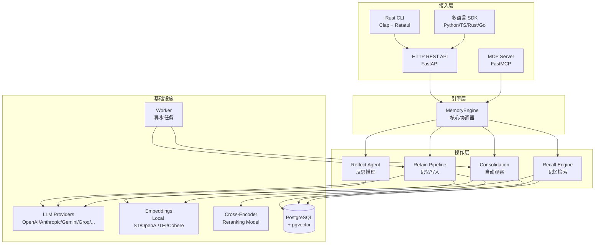
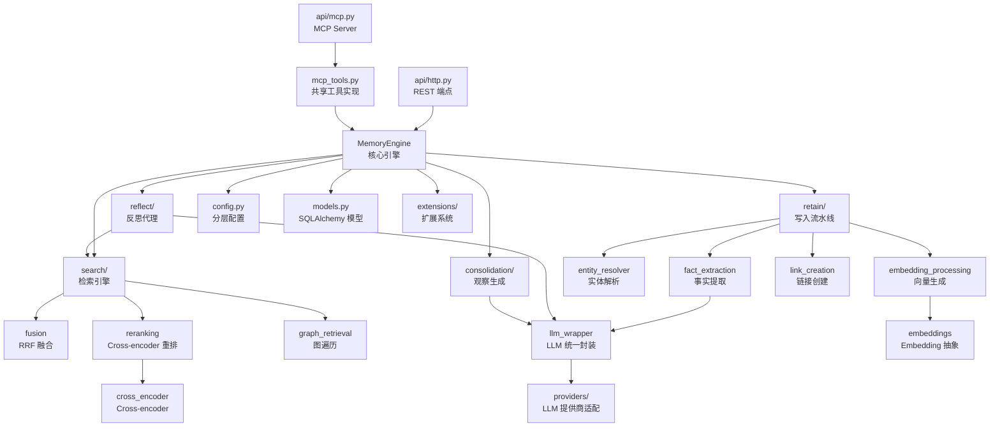
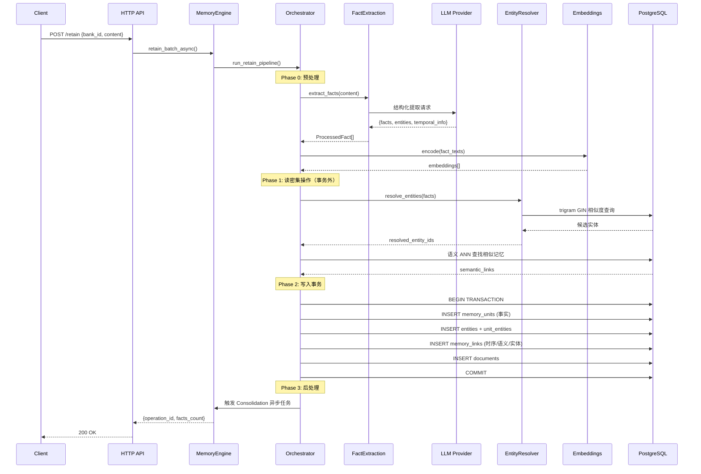
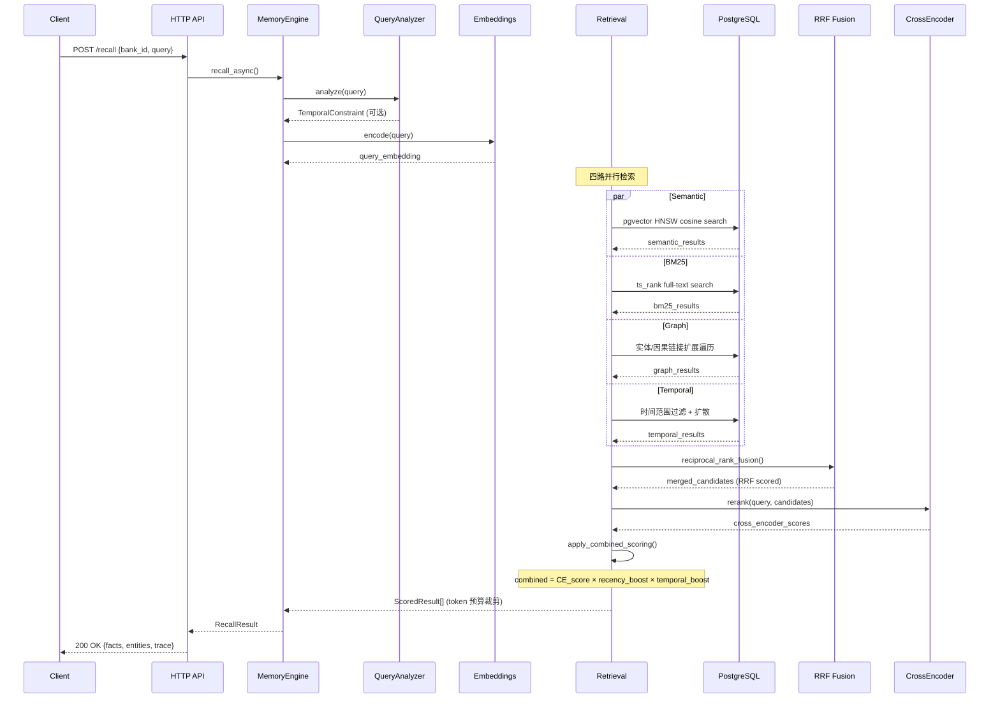

# hindsight 源码学习笔记

> 仓库地址：[hindsight](https://github.com/vectorize-io/hindsight)
> 学习日期：2026-04-05

---

> **以下为 AI 源码分析**
>
> ### 一句话概括
>
> Hindsight 是一个仿生记忆架构的 AI Agent 记忆系统，基于 PostgreSQL + pgvector 实现语义/时序/实体/因果多维记忆存储与检索，支持自动观察生成和心智模型构建。
>
> ### 要点速览
>
> | 核心模块 | 职责 | 关键文件 |
> |---------|------|---------|
> | Memory Engine | 记忆系统核心引擎，协调 retain/recall/reflect 三大操作 | `hindsight_api/engine/memory_engine.py` |
> | Retain Pipeline | 记忆写入流水线：事实提取→实体解析→embedding→链接创建→存储 | `engine/retain/orchestrator.py` |
> | Search/Recall | 四路并行检索（语义/BM25/图/时序）+ RRF 融合 + Cross-encoder 重排 | `engine/search/retrieval.py`, `fusion.py`, `reranking.py` |
> | Reflect Agent | 基于 LLM 工具调用的反思代理，生成分析和洞察 | `engine/reflect/agent.py` |
> | Consolidation | 后台自动从原始事实生成/更新 observation | `engine/consolidation/consolidator.py` |
> | HTTP API | FastAPI REST API，暴露 retain/recall/reflect 等端点 | `hindsight_api/api/http.py` |
> | MCP Server | Model Context Protocol 服务端，支持 Claude Code 等工具直接调用 | `hindsight_api/mcp_tools.py`, `api/mcp.py` |
> | CLI (Rust) | 命令行工具，支持所有 API 操作和 TUI 交互 | `hindsight-cli/src/main.rs` |

---

## 项目简介

Hindsight 是由 Vectorize.io 开发的开源 AI Agent 记忆系统，设计目标是让 AI Agent 能够像人类一样**学习**而非仅仅"记住"。它采用仿生数据结构组织记忆，将信息分为 World Facts（世界知识）、Experiences（自身经验）和 Mental Models（心智模型/观察）三个层次。系统提供三个核心操作：Retain（存储记忆）、Recall（检索记忆）和 Reflect（反思生成洞察），在 LongMemEval 基准测试中达到 SOTA 性能。支持 Docker 一键部署、Python 嵌入式运行、多种 LLM 提供商，并与 CrewAI、LangGraph、Pydantic AI 等主流 Agent 框架集成。

## 技术栈

| 类别 | 技术 |
|------|------|
| 语言 | Python 3.11+（核心 API）、Rust（CLI）、TypeScript（Control Plane / 客户端） |
| 框架 | FastAPI（HTTP API）、FastMCP（MCP Server）、Clap + Ratatui（Rust CLI） |
| 构建工具 | Hatchling（Python）、Cargo（Rust）、npm workspaces（TypeScript） |
| 依赖管理 | uv workspace（Python monorepo）、Cargo（Rust）、npm（TypeScript） |
| 测试框架 | pytest + pytest-asyncio + pytest-xdist（Python）、Rust integration tests |
| 数据库 | PostgreSQL + pgvector（向量存储）、pg0-embedded（嵌入式模式） |
| LLM 集成 | OpenAI、Anthropic、Google Gemini、Groq、Ollama、LM Studio、LiteLLM、Cohere |
| Embedding | 本地 SentenceTransformers、OpenAI Embeddings、TEI（Text Embeddings Inference）、Cohere、LiteLLM |
| 可观测性 | OpenTelemetry（tracing + metrics）、Prometheus exporter |

## 目录结构

```
hindsight/
├── hindsight-api-slim/          # 核心 API 服务（精简版，不含本地 ML 模型）
│   ├── hindsight_api/
│   │   ├── engine/              # 记忆引擎核心
│   │   │   ├── memory_engine.py # MemoryEngine 主类
│   │   │   ├── retain/          # Retain 写入流水线（7 个子模块）
│   │   │   ├── search/          # Recall 检索引擎（4 路检索 + 融合 + 重排）
│   │   │   ├── reflect/         # Reflect 反思代理（工具调用循环）
│   │   │   ├── consolidation/   # 自动观察生成引擎
│   │   │   ├── providers/       # LLM 提供商适配器（8 种）
│   │   │   ├── embeddings.py    # Embedding 抽象层
│   │   │   ├── cross_encoder.py # Cross-encoder 重排模型
│   │   │   ├── entity_resolver.py # 实体解析与消歧
│   │   │   ├── query_analyzer.py  # 查询时序分析
│   │   │   └── llm_wrapper.py   # LLM 统一调用封装
│   │   ├── api/                 # API 层
│   │   │   ├── http.py          # FastAPI REST 端点
│   │   │   └── mcp.py           # MCP Server 实现
│   │   ├── extensions/          # 扩展系统（租户/鉴权/校验）
│   │   ├── worker/              # 异步任务 worker
│   │   ├── admin/               # 管理工具（备份/恢复）
│   │   ├── webhooks/            # Webhook 通知
│   │   ├── config.py            # 集中配置管理（分层配置）
│   │   ├── models.py            # SQLAlchemy 数据模型
│   │   ├── migrations.py        # 数据库迁移
│   │   └── server.py            # ASGI 入口
│   └── tests/                   # ~120 个测试文件
├── hindsight-all/               # All-in-One 包（API + 嵌入式 DB + 客户端）
│   └── hindsight/
│       ├── embedded.py          # HindsightEmbedded 嵌入式客户端
│       └── server.py            # HindsightServer 上下文管理器
├── hindsight-embed/             # 嵌入式 daemon 管理
│   └── hindsight_embed/
│       ├── embed_manager.py     # 抽象管理接口
│       ├── daemon_client.py     # Daemon 生命周期管理
│       └── profile_manager.py   # Profile 隔离管理
├── hindsight-cli/               # Rust CLI 工具
│   └── src/
│       ├── main.rs              # 入口 + Clap 命令定义
│       ├── api.rs               # API 客户端
│       └── ui.rs                # TUI 界面
├── hindsight-clients/           # 多语言 SDK
│   ├── python/                  # Python 客户端
│   ├── typescript/              # TypeScript 客户端
│   ├── rust/                    # Rust 客户端
│   └── go/                      # Go 客户端
├── hindsight-control-plane/     # Web UI 控制台
├── hindsight-integrations/      # 框架集成（17 种）
│   ├── langgraph/
│   ├── crewai/
│   ├── pydantic-ai/
│   ├── claude-code/
│   └── ...
├── docker/                      # Docker 部署配置
│   ├── standalone/Dockerfile    # 单体部署镜像
│   └── docker-compose/          # 多种 compose 配置
└── scripts/                     # 构建/发布/benchmark 脚本
```

## 架构设计

### 整体架构

Hindsight 采用**分层架构**设计，从上到下分为：接入层（HTTP API / MCP / CLI）→ 引擎层（MemoryEngine）→ 操作层（Retain/Recall/Reflect/Consolidation）→ 存储层（PostgreSQL + pgvector）。引擎层是核心，封装了所有记忆操作的业务逻辑。

系统的核心设计理念是**仿生记忆**：区分 World Facts（关于世界的事实）、Experiences（Agent 自身经历）和 Observations（从原始记忆中归纳的观察），模拟人类记忆的分层结构。通过 Consolidation 引擎自动从原始事实生成观察，通过 Reflect 代理生成更高层次的洞察。



### 核心模块

#### 1. MemoryEngine（记忆引擎）

**职责**：系统核心协调器，管理数据库连接池、LLM 客户端、Embedding 模型、Cross-encoder、实体解析器等组件，协调所有记忆操作。

**核心文件**：
- `engine/memory_engine.py` — `MemoryEngine` 类，~350 行初始化 + 核心方法
- `engine/interface.py` — `MemoryEngineInterface` 抽象接口定义

**关键设计**：
- 支持按操作类型配置不同 LLM（retain/reflect/consolidation 可使用不同模型）
- 使用 `contextvars.ContextVar` 实现 async-safe 的 schema 隔离（多租户）
- SQL 运行时校验机制（`validate_sql_schema`）防止跨租户数据访问
- 连接池管理（asyncpg）支持可配置的 min/max size 和超时

#### 2. Retain Pipeline（记忆写入流水线）

**职责**：将输入文本处理为结构化记忆，包括事实提取、实体解析、embedding 生成、链接创建和存储。

**核心文件**：
- `retain/orchestrator.py` — 流水线编排器，分 3 阶段执行
- `retain/fact_extraction.py` — LLM 驱动的事实提取
- `retain/entity_processing.py` — 实体解析与关联
- `retain/embedding_processing.py` — 向量 embedding 生成
- `retain/link_creation.py` — 时序/语义/实体链接创建
- `retain/fact_storage.py` — 事实写入存储
- `retain/chunk_storage.py` — 文档分块存储

**关键设计**：
- 三阶段流水线：Phase 1（读密集：实体解析 + 语义 ANN 搜索）→ Phase 2（事务内写入）→ Phase 3（后处理）
- Phase 1 在事务外执行读操作，避免持有行锁导致超时
- 支持文档去重（content_hash）和增量更新

#### 3. Search/Recall Engine（检索引擎）

**职责**：从记忆库中检索相关记忆，采用四路并行检索 + 融合 + 重排的混合搜索策略。

**核心文件**：
- `search/retrieval.py` — 四路并行检索调度
- `search/fusion.py` — Reciprocal Rank Fusion 结果融合
- `search/reranking.py` — Cross-encoder 神经重排 + 综合评分
- `search/graph_retrieval.py` — 图检索抽象接口
- `search/link_expansion_retrieval.py` — 链接扩展图检索实现
- `search/temporal_extraction.py` — 时序约束提取

**四路检索策略**：
1. **Semantic**：pgvector HNSW 向量相似度搜索
2. **BM25**：PostgreSQL 全文搜索（关键词精确匹配）
3. **Graph**：沿实体/时序/因果链接扩展遍历
4. **Temporal**：时间范围过滤 + 时序扩散

#### 4. Reflect Agent（反思代理）

**职责**：基于 LLM 工具调用的 agentic loop，分层检索记忆后生成深度分析和洞察。

**核心文件**：
- `reflect/agent.py` — 反思代理主循环
- `reflect/tools.py` — 工具实现（recall / search_observations / search_mental_models / expand）
- `reflect/prompts.py` — 提示词模板
- `reflect/tools_schema.py` — 工具 schema 定义

**分层检索策略**：
1. `search_mental_models` — 用户策展的摘要（最高质量）
2. `search_observations` — 自动生成的观察（带时效性）
3. `recall` — 原始事实（ground truth）

#### 5. Consolidation Engine（观察生成引擎）

**职责**：后台自动运行，从新写入的原始事实中生成/更新/删除 observation 类型的记忆单元。

**核心文件**：
- `consolidation/consolidator.py` — 批量整合器
- `consolidation/prompts.py` — 整合提示词

**关键操作**：Create（新建观察）、Update（更新已有观察）、Delete（删除过时观察），每个观察追踪 proof_count 和 source_memory_ids。

#### 6. LLM Provider 抽象层

**职责**：统一封装多种 LLM 提供商的调用接口，支持 tool calling、structured output、并发控制。

**核心文件**：
- `engine/llm_wrapper.py` — `LLMConfig` 统一包装器 + 全局并发信号量
- `engine/providers/openai_compatible_llm.py` — OpenAI 兼容协议（覆盖 Groq/Ollama/LM Studio）
- `engine/providers/anthropic_llm.py` — Anthropic Claude 适配
- `engine/providers/gemini_llm.py` — Google Gemini 适配
- `engine/providers/litellm_llm.py` — LiteLLM 统一网关

### 模块依赖关系



## 核心流程

### 流程一：Retain（记忆写入）

Retain 是将原始文本转化为结构化记忆的完整流水线，采用三阶段架构确保高并发下的性能和一致性。



### 流程二：Recall（记忆检索）

Recall 采用四路并行检索 + 融合重排策略，确保语义相关、关键词匹配、图关联和时序相关的记忆都能被检索到。



## 关键设计亮点

### 1. 仿生记忆分层架构

**解决的问题**：传统 Agent 记忆系统仅依赖 RAG 或知识图谱，缺乏对记忆层次的区分，无法实现"学习"。

**实现方式**：将记忆分为三个层次，通过 `fact_type` 字段区分：
- `world`：关于世界的客观事实
- `experience`：Agent 自身的经历和行为
- `observation`：由 Consolidation 引擎从原始事实自动归纳生成

关键文件：`models.py` 中 `MemoryUnit.fact_type` 的约束定义，`consolidation/consolidator.py` 中的自动观察生成逻辑。

**为什么这样设计**：模拟人类记忆中 semantic memory（世界知识）和 episodic memory（情景记忆）的区分，observation 类似于人类从经验中归纳出的规律，使 Agent 能从历史数据中"学习"。

### 2. 三阶段 Retain 流水线

**解决的问题**：高并发 retain 操作中，实体解析和 ANN 搜索等读密集操作如果在事务内执行，会长时间持有行锁，导致 TimeoutError。

**实现方式**（`retain/orchestrator.py`）：
- Phase 1：在事务外（autocommit 连接）执行实体解析 trigram GIN 扫描和语义 ANN 搜索
- Phase 2：短事务内仅执行必要的写入操作（INSERT facts/entities/links）
- Phase 3：事务后触发异步 Consolidation

**为什么这样设计**：将读写分离到不同连接，最小化事务持有时间，消除并发瓶颈。

### 3. 四路并行混合检索 + RRF + Cross-encoder 重排

**解决的问题**：单一检索策略（如纯向量搜索）无法覆盖所有查询意图，关键词匹配、实体关联、时序相关等信号需要综合考量。

**实现方式**：
- 四路检索并行执行（`search/retrieval.py`），使用 `asyncio.gather` 并发
- Reciprocal Rank Fusion（`search/fusion.py`）合并排序，k=60
- Cross-encoder 神经重排（`search/reranking.py`），然后乘以 recency_boost 和 temporal_boost

**评分公式**：`combined = CE_normalized × (1 + 0.2 × (recency - 0.5)) × (1 + 0.2 × (temporal - 0.5))`

**为什么这样设计**：RRF 是无参数的融合方法，不需要调整权重；Cross-encoder 提供精确的 query-document 相关性评分；乘性 boost 确保二级信号的影响与基础相关性成正比。

### 4. SQL Schema 运行时安全校验

**解决的问题**：多租户场景下，如果 SQL 中遗漏 schema 前缀，可能导致跨租户数据泄露。

**实现方式**（`engine/memory_engine.py`）：
- 定义 `_PROTECTED_TABLES` 保护表集合
- `validate_sql_schema()` 用正则检查所有 SQL 语句是否使用 `fq_table()` 生成的 schema 限定表名
- 检测到未限定表名时抛出 `UnqualifiedTableError`
- 使用 `contextvars.ContextVar` 实现 async-safe 的 per-request schema 切换

**为什么这样设计**：编译期无法验证动态 SQL 的 schema 安全性，运行时校验作为最后一道防线，防止开发者遗漏 schema 前缀。

### 5. 分层配置系统（Hierarchical Config）

**解决的问题**：不同租户和 memory bank 需要不同的 LLM 配置、检索参数等，但服务器级别的基础设施配置（数据库 URL、端口等）应该统一。

**实现方式**（`config.py` + `config_resolver.py`）：
- 配置字段分为 `hierarchical`（可按 tenant/bank 覆盖）和 `static`（仅服务器级别）
- `StaticConfigProxy` 代理对象拦截对 hierarchical 字段的直接访问，强制开发者使用 `ConfigResolver.resolve_full_config(bank_id, context)`
- 配置优先级：Bank 级别 > Tenant 级别 > 环境变量 > 默认值

**为什么这样设计**：在编码层面强制区分全局配置和可定制配置，避免在多租户场景下使用错误的配置值，同时保持单租户部署的简洁性。
